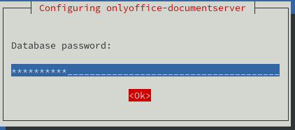
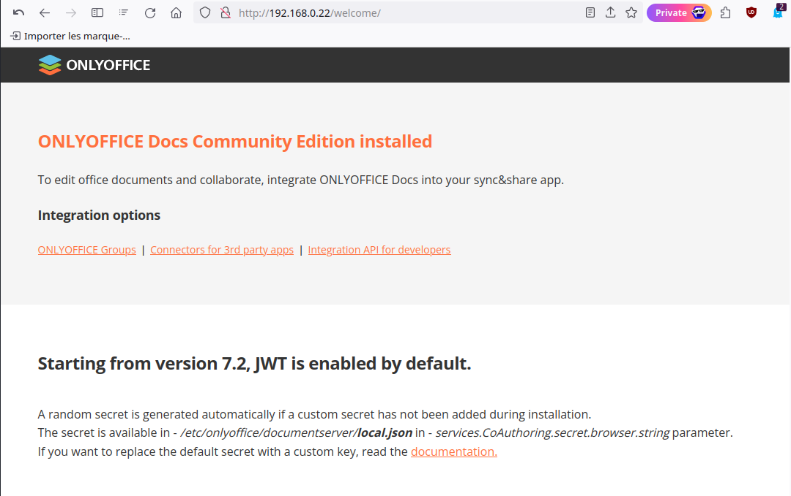
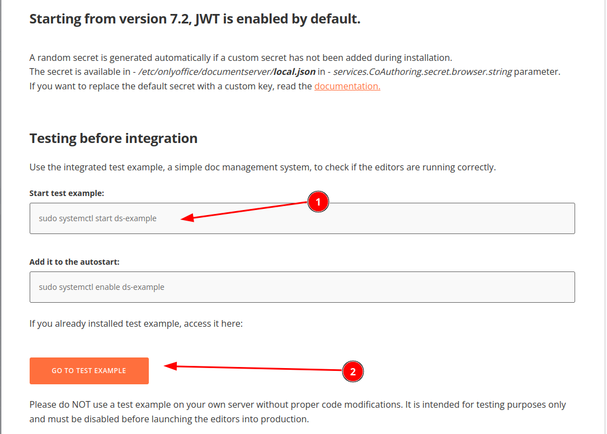
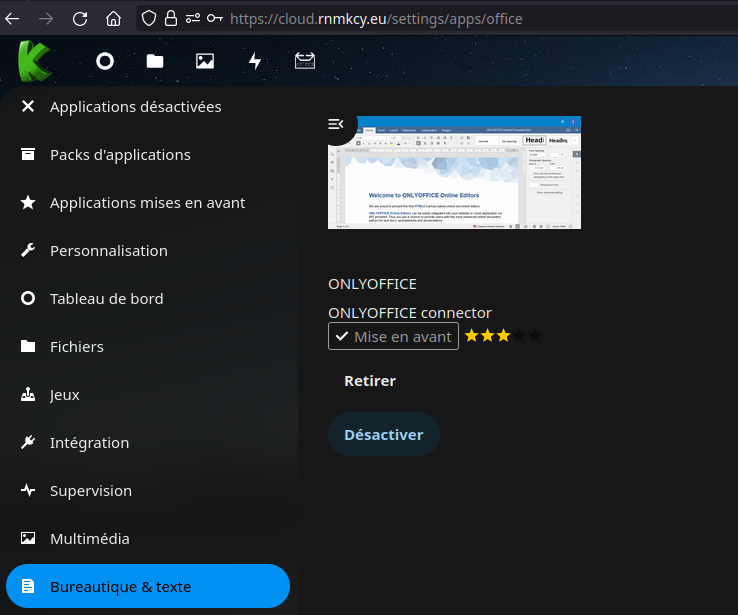
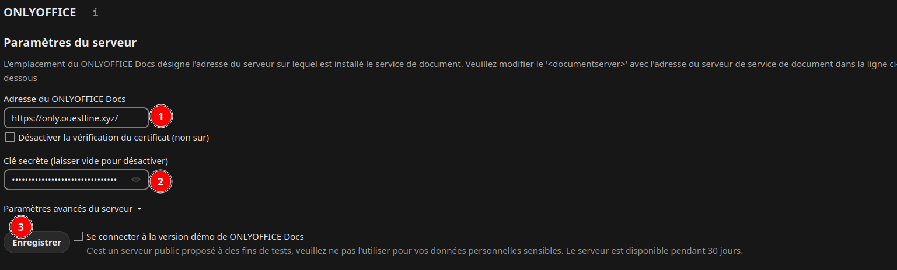
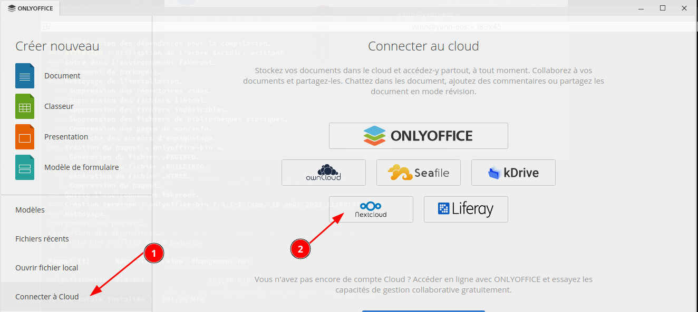
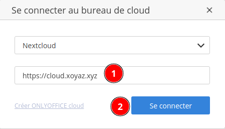
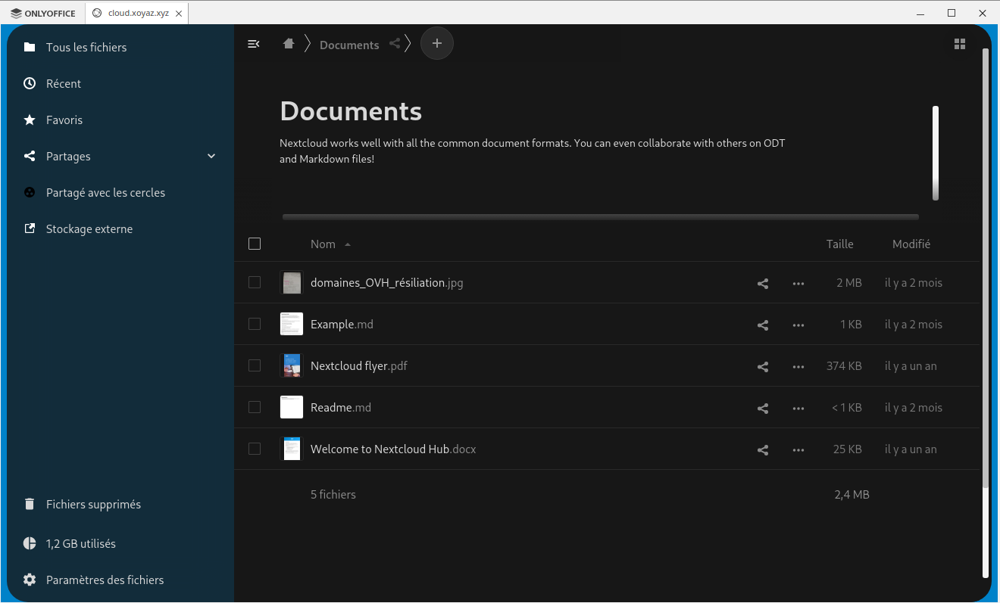
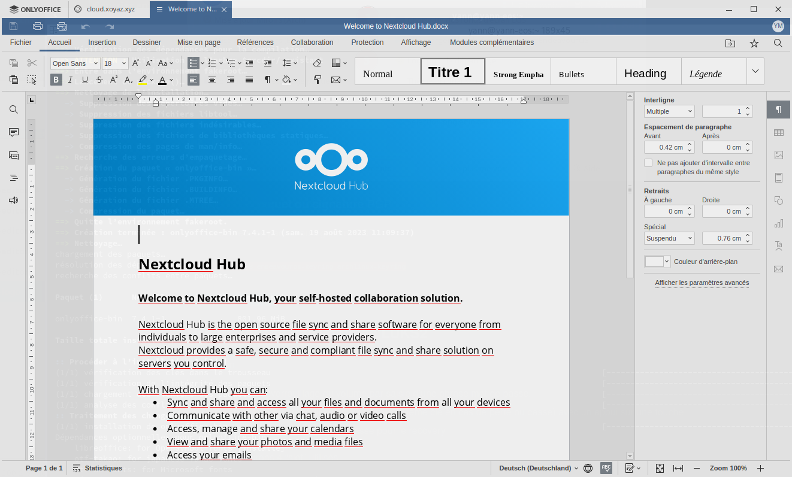

+++
title = 'OnlyOffice Debian Document Server'
date = 2024-03-04 00:00:00 +0100
categories = application debian nextcloud
+++
*ONLYOFFICE Document Server est une suite bureautique en ligne comprenant des visualiseurs et des éditeurs de textes, feuilles de calcul et présentations, entièrement compatible avec les formats Office Open XML: .docx, .xlsx, .pptx et permettant l'édition collaborative en temps réel.*

{:height="100"}  


## ONLYOFFICE Document Server

### Introduction

Community Edition permet d'installer ONLYOFFICE Docs sur votre serveur local et intégrer des éditeurs en ligne dans [plateforme collaborative ONLYOFFICE](https://helpcenter.onlyoffice.com/fr/installation/groups-index.aspx) ou [autres systèmes populaires](https://helpcenter.onlyoffice.com/fr/integration.aspx).

ONLYOFFICE Docs est un suite bureautique complète comportant des visionneuses, des éditeurs de texte, classeurs et présentations complètement compatible avec les formats Office Open XML: .docx, .xlsx, .pptx permettant l'édition collaborative en temps réel.

Fonctionnalités

*    Document Editor
*    Spreadsheet Editor
*    Presentation Editor
*    Visionneuses mobiles web
*    Édition collaborative
*    Prise en charge des hiéroglyphes
*    Prise en charge des formats les plus populaires: DOC, DOCX, TXT, ODT, RTF, ODP, EPUB, ODS, XLS, XLSX, CSV, PPTX, HTML

Consultez la [liste détaillée des fonctionnalités](https://github.com/ONLYOFFICE/DocumentServer#onlyoffice-document-server-editions) disponibles pour ONLYOFFICE Docs Community Edition.

Lors de l'intégration dans ONLYOFFICE Groupes vous pourrez:

*    partager des fichiers;
*    gérer des permissions d'accès aux documents;
*    incorporer des documents dans un site Web;
*    afficher et modifier des fichiers stockés sur Drive, Box, Dropbox, OneDrive, OwnCloud connectés à ONLYOFFICE.

Si vous souhaitez installer **ONLYOFFICE Docs** avec **ONLYOFFICE Groupes**, il faut deux machines différentes pour pouvoir les installer.
{: .prompt-info }

Ce guide vous explique comment installer la version Linux **ONLYOFFICE Docs Community Edition** sur votre ordinateur

### Prérequis

Ne pas installer ONLYOFFICE sur le domaine principal, surtout si vous souhaitez l'utiliser avec une instance Nextcloud installée sur le même domaine.
{: .prompt-warning }

Création domaine **only.ouestline.xyz** pour ONLYOFFICE dans YunoHost avec cerificats Let's Encrypt à l'aide de l'administrateur web  

*Pour installer le serveur de documents Onlyoffice, Debian avec 2 Go de RAM, 4 Go de SWAP, 2 processeurs et 40 Go d'espace disque libre.*

Configuration système minimale

*    Processeur double cœur à 2 GHz ou plus
*    Mémoire RAM 2 Go ou plus
*    HDD disque dur au moins 40 Go d'espace disponible
*    au moins4 Go pour le fichier d'échange
*    Système d'exploitation Debian, Ubuntu édition 64 bits ou une autre version compatible basée sur le noyau 3.13 ou version ultérieure
*    Exigences supplémentaires
     *   PostgreSQL: version 12.9 ou ultérieure
     *   NGINX: version 1.3.13 ou ultérieure
     *   libstdc++6: version 4.8.4 ou ultérieure
     *   RabbitMQ

### Création serveur virtuel

Serveur type kvm debian 10 , HDD 50Go, RAM 4Go

Télécharger image cloud debian10 : <https://cloud.debian.org/images/cloud/buster/latest/debian-10-nocloud-amd64.qcow2>

Créer un serveur virtuel debian 10 dans un environnement KVM

```shell
export VM_NAME="debian-10-nocloud-amd64"
# 50 GB de disque
export VM_ROOT_DISK_SIZE=50G

# Resize Debian 
qemu-img resize \
  /srv/kvm/libvirt/images/$VM_NAME.qcow2 \
  $VM_ROOT_DISK_SIZE

sudo virt-install \
    --memory 4096 \
    --vcpus 2 \
    --name $VM_NAME \
    --disk /srv/kvm/libvirt/images/$VM_NAME.qcow2,device=disk,bus=virtio,format=qcow2 \
    --os-variant debian10 \
    --network bridge=br0 \
    --virt-type kvm \
    --graphics none \
    --import
```

Réinstaller sshd

    apt install --reinstall openssh-server

Modifier la configuration `/etc/ssh/sshd_config`

```
PermitRootLogin yes
PasswordAuthentication yes
```

### Dépendances

rabbit et gnupg

```shell
apt install rabbitmq-server gnupg2
```

### Installer et configurer PostgreSQL

*ONLYOFFICE Docs PostgreSQL en tant que base de données.*
Installer PostgreSQL 

    apt install postgresql

créez la base de données et l'utilisateur PostgreSQL

```
sudo -i -u postgres psql -c "CREATE DATABASE onlyoffice;"
sudo -i -u postgres psql -c "CREATE USER onlyoffice WITH password 'onlyoffice';"
sudo -i -u postgres psql -c "GRANT ALL privileges ON DATABASE onlyoffice TO onlyoffice;"
```

### Installer ONLYOFFICE Docs

Ajout contrib  `/etc/apt/sources.list`  

    deb http://deb.debian.org/debian buster main contrib

Liste onlyoffice `/etc/apt/sources.list.d/onlyoffice.list` 

    deb https://download.onlyoffice.com/repo/debian squeeze main

Mise à jour des paquets

    apt update

Installer mscorefonts:

    apt install ttf-mscorefonts-installer

Installer ONLYOFFICE Docs

    apt install onlyoffice-documentserver

Au cours de l'installation, il vous sera demandé le mot de passe de la base de données PostgreSQL pour le serveur de documents, tapez le mot de passe de la base de données onlyoffice et choisissez OK pour continuer.  
{:width="300"}  
Veuillez patienter quelques minutes...

ONLYOFFICE Docs est lancé en tant que processus. Le paquet sera mis à jour comme tout autre paquet deb.
{: .prompt-info }

### Ip statique

Modifier le serveur pour avoir une IP statique

    nano /etc/network/cloud-interfaces-template

```
auto $INTERFACE
allow-hotplug $INTERFACE

iface $INTERFACE inet static
 address 192.168.0.217
 netmask 255.255.255.0
 gateway 192.168.0.254
```

Redémarrer la machine

### Tests

Maintenant, vous pouvez saisir http://192.168.0.217 dans la barre d'adresse du navigateur pour ouvrir la page d'accueil ONLYOFFICE Docs où vous trouverez des instructions détaillées sur l'activation des modèles de documents ou l'intégration des éditeurs en dans votre application web en utilisant API.

{:width="600"}  
{:width="600"}  
{:width="600"}

Pour connecter ONLYOFFICE Docs à ONLYOFFICE Groupes, veuillez consulter [ces instructions](https://helpcenter.onlyoffice.com/fr/server/linux/document/connect-document-server.aspx).

## ONLYOFFICE Proxy ou HTTPS

### Proxy NGINX

*ONLYOFFICE Docs fonctionne comme une application en ligne et doit souvent être intégré dans des réseaux internes. De nombreux réseaux utilisent aujourd'hui différents serveurs web comme proxy à certaines fins. Il est donc important de faire fonctionner ONLYOFFICE Docs derrière le proxy. Les serveurs web les plus répandus sont NGINX et Apache, dont la popularité est due à leur flexibilité, leur vitesse et leur puissance. Un autre serveur web bien connu est HAProxy qui a été conçu à l'origine pour fonctionner comme un équilibreur de charge.*

[Using ONLYOFFICE Docs behind the proxy](https://helpcenter.onlyoffice.com/installation/docs-community-proxy.aspx)

Configuration pour un proxy nginx https &rarr; htpp

```
# Utilisez cet exemple pour le trafic HTTPS proxy vers le serveur de documents fonctionnant à 'backendserver-address'.
# Remplacez {{SSL_CERTIFICATE_PATH}} par le chemin d'accès au fichier de certificat ssl
# Remplacez {{SSL_KEY_PATH}} par le chemin d'accès au fichier de clé privée ssl

upstream docservice {
  server backendserver-address;
}

map $http_host $this_host {
    "" $host;
    default $http_host;
}

map $http_x_forwarded_proto $the_scheme {
     default $http_x_forwarded_proto;
     "" $scheme;
}

map $http_x_forwarded_host $the_host {
    default $http_x_forwarded_host;
    "" $this_host;
}

map $http_upgrade $proxy_connection {
  default upgrade;
  "" close;
}

proxy_set_header Upgrade $http_upgrade;
proxy_set_header Connection $proxy_connection;
proxy_set_header X-Forwarded-Host $the_host;
proxy_set_header X-Forwarded-Proto $the_scheme;
proxy_set_header X-Forwarded-For $proxy_add_x_forwarded_for;

## Normal HTTP host
server {
  listen 0.0.0.0:80;
  listen [::]:80 default_server;
  server_name _;
  server_tokens off;

  ## Redirects all traffic to the HTTPS host
  return 301 https://$server_name:443$request_uri;
}

server {
  listen 0.0.0.0:443 ssl;
  listen [::]:443 ssl default_server;
  server_tokens off;
  root /usr/share/nginx/html;

  ## Strong SSL Security
  ## https://raymii.org/s/tutorials/Strong_SSL_Security_On_nginx.html
  ssl on;
  ssl_certificate {{SSL_CERTIFICATE_PATH}};
  ssl_certificate_key {{SSL_KEY_PATH}};
  ssl_verify_client off;

  ssl_ciphers "EECDH+AESGCM:EDH+AESGCM:AES256+EECDH:AES256+EDH";

  ssl_protocols  TLSv1 TLSv1.1 TLSv1.2;
  ssl_session_cache  builtin:1000  shared:SSL:10m;

  ssl_prefer_server_ciphers   on;

  ## [Optional] Before enabling Strict-Transport-Security headers, ensure your server is properly configured for SSL.
  ## This directive informs the browser to always use HTTPS. For more info see:
  ## - https://developer.mozilla.org/en-US/docs/Web/HTTP/Headers/Strict-Transport-Security
  # add_header Strict-Transport-Security "max-age=31536000; includeSubDomains" always;
  # add_header X-Frame-Options SAMEORIGIN;
  add_header X-Content-Type-Options nosniff;

  ## [Optional] If your certficate has OCSP, enable OCSP stapling to reduce the overhead and latency of running SSL.
  ## Replace with your ssl_trusted_certificate. For more info see:
  ## - https://medium.com/devops-programming/4445f4862461
  ## - https://www.ruby-forum.com/topic/4419319
  ## - https://www.digitalocean.com/community/tutorials/how-to-configure-ocsp-stapling-on-apache-and-nginx
  # ssl_stapling on;
  # ssl_stapling_verify on;
  # ssl_trusted_certificate /etc/nginx/ssl/stapling.trusted.crt;
  # resolver 208.67.222.222 208.67.222.220 valid=300s; # Can change to your DNS resolver if desired
  # resolver_timeout 10s;

  ## [Optional] Generate a stronger DHE parameter:
  ##   cd /etc/ssl/certs
  ##   sudo openssl dhparam -out dhparam.pem 4096
  ##
  # ssl_dhparam /etc/ssl/certs/dhparam.pem;

  location / {
    proxy_pass http://docservice;
    proxy_http_version 1.1;
  }
}
```

### Sécuriser ONLYOFFICE Docs avec HTTPS

Configurer ONLYOFFICE Docs pour utiliser HTTPS. Cela implique de générer des certificats pour votre nom de domaine. Pour ce faire, vous pouvez générer les certificats signés en utilisant Let'sEncrypt.

Installez d'abord les outils nécessaires :

    sudo apt install certbot python3-certbot-nginx

Une fois installé, générez les certificats pour le nom de domaine (assurez-vous que Nginx est en cours d'exécution)

    sudo bash /usr/bin/documentserver-letsencrypt.sh email@example.com votredomaine.com

Remplacez email@example.com par votre email valide et yourdomain.com par votre FQDN.

Renouvellement lancé toutes les semaines


## Comment éditer des documents ONLYOFFICE ?

### Web Édition dans Nextcloud

`ONLYOFFICE doit être public`{: .prompt-info }

* dans le magasin d'applications Nextcloud, installez `ONLYOFFICE`, c'est-à-dire le [connecteur ONLYOFFICE pour Nextcloud](https://apps.nextcloud.com/apps/onlyoffice)   

* Allez dans Nextcloud `Paramètres d'administration` --> `Administration` --> `ONLYOFFICE` > `Paramètres du serveur` > `Adresse du service d'édition de document`.
    1. Spécifiez le domaine d'installation de votre serveur `ONLYOFFICE`, `https://only.ouestline.xyz/`
    2. Récupérer le token `JWT secret` en cli : `sudo documentserver-jwt-status.sh` ([Upgrade soft-fails due to 7.2 enabling JWT](https://github.com/YunoHost-Apps/onlyoffice_ynh/issues/84))
    *  Saisir URL du serveur docs, clé secrète (token) et cliquer sur `Enregistrer`.  

* Créer un nouveau document !

### Desktop Édition sur PC

* Téléchargez et installez [ONLYOFFICE Desktop Editors](https://www.onlyoffice.com/fr/download-desktop.aspx)  
[Comment installer ONLYOFFICE Desktop Editors sur Arch Linux](https://www.onlyoffice.com/blog/fr/2022/06/comment-installer-onlyoffice-desktop-editors-sur-arch-linux) : `yay -S onlyoffice-bin`

### Edition documents sur Nextcloud

* Démarrez l'éditeur {:height="50"}  
  

* Sélectionnez `Nextcloud`, saisir le domaine d'installation Nextcloud  
{:width="200"}  
Saisir utilisateur et mot de passe puis se connecter  
{:width="200"}  
Connextion établie avec le serveur nextcloud  
  
* Editer un document !  


## Liens

* [ONLYOFFICE Docs , Debian/Ubuntu](https://helpcenter.onlyoffice.com/fr/installation/docs-community-install-ubuntu.aspx)
* [Install ONLYOFFICE Docs Community on Debian / Ubuntu](https://computingforgeeks.com/install-onlyoffice-docs-on-debian-ubuntu/)
* Site officiel application : <https://www.onlyoffice.com>
* Dépôt du code officiel : <https://github.com/ONLYOFFICE/DocumentServer>
* Documentation YunoHost : <https://yunohost.org/app_onlyoffice>
* Signaler un bug : <https://github.com/YunoHost-Apps/onlyoffice_ynh/issues>


