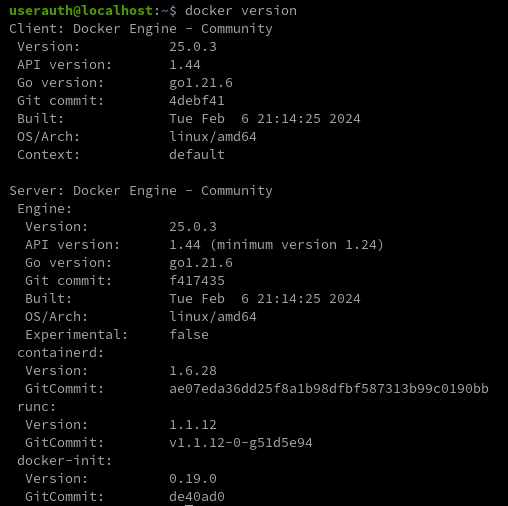
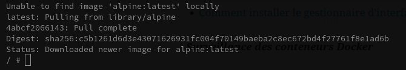
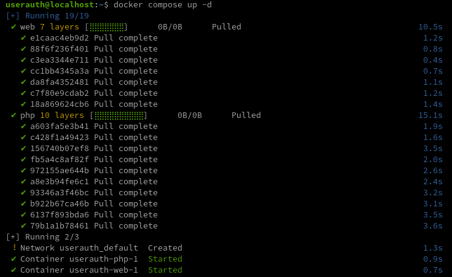
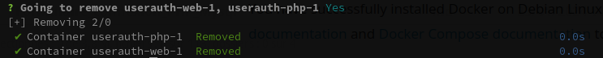

+++
title = 'Installer Docker CE (Community Edition) sur Debian'
date = 2024-03-14 00:00:00 +0100
categories = debian
+++
*Docker est une technologie de conteneurisation qui permet la création et l'utilisation de conteneurs Linux*

## Docker

{:height="50"}

* [Comment installer Docker CE sur le système Linux Debian 12/11/10 ?](https://computingforgeeks.com/install-docker-and-docker-compose-on-debian/). Installation étape par étape de Docker et Docker Compose sur le système d'exploitation Debian.
* [How To Remove Docker Containers, Images and Volumes [Cheat Sheet]](https://shisho.dev/blog/posts/docker-remove-cheatsheet/)
* [Guide To Stopping and Removing Docker Containers](https://ioflood.com/blog/docker-compose-down-guide-to-stopping-and-removing-docker-containers/)

Il existe deux éditions de Docker disponibles.

*    Community Edition (CE) : idéale pour les développeurs individuels et les petites équipes souhaitant démarrer avec Docker et expérimenter des applications basées sur des conteneurs.
*    Enterprise Edition (EE) : conçue pour les équipes informatiques et de développement d'entreprise qui créent, expédient et exécutent des applications critiques pour l'entreprise en production à grande échelle.

Ce guide couvrira l'installation de Docker CE sur Debian Linux. Mais examinons d’abord les terminologies courantes du menu Docker.
Composants Docker / Terminologies

Vous trouverez ci-dessous les terminologies couramment utilisées dans l'écosystème Docker.

*    **Docker daemon** : également appelé Docker Engine, il s'agit d'un processus en arrière-plan qui s'exécute sur le système hôte responsable de la création et de l'exécution des conteneurs.
*    **Docker Client**  : Il s'agit d'un outil de ligne de commande utilisé par l'utilisateur pour interagir avec le démon Docker.
*    **Docker Image** : Une image est un fichier immuable qui est essentiellement un instantané d'un conteneur. Une image Docker possède un système de fichiers et des dépendances d'application nécessaires à l'exécution des applications.
*    **Docker container** : Il s'agit d'une instance en cours d'exécution d'une image Docker avec une application et ses dépendances. Chaque conteneur possède un ID de processus unique et est isolé des autres conteneurs. La seule chose que les conteneurs partagent est le noyau.
*    **Docker registry** : Il s'agit d'une application chargée de gérer le stockage et la livraison des images de conteneurs Docker. Cela peut être privé ou public.

## Installer Docker CE sur Debian

### 1) Installer les packages de dépendances

Démarrez l'installation en vous assurant que tous les packages utilisés par Docker en tant que dépendances sont installés.

```shell
sudo apt update
sudo apt -y install apt-transport-https ca-certificates curl gnupg2 software-properties-common
```

### 2) Ajouter la clé GPG officielle de Docker

Importez la clé Docker GPG utilisée pour signer les packages Docker.

```shell
curl -fsSL https://download.docker.com/linux/debian/gpg | sudo gpg --dearmor -o /etc/apt/trusted.gpg.d/docker-archive-keyring.gpg
```

### 3) Ajouter le référentiel Docker

Ajoutez le référentiel Docker qui contient les dernières versions stables de Docker CE.

```shell
sudo add-apt-repository \
   "deb [arch=amd64] https://download.docker.com/linux/debian \
   $(lsb_release -cs) \
   stable"
```

Cette commande ajoutera la ligne affichée dans /etc/apt/sources.listle fichier.

### 4) Installez Docker et Docker Compose

Mettez à jour l’  apt index du package.

```shell
sudo apt update
```

Pour installer Docker CE sur Debian, exécutez la commande :

```shell
sudo apt install docker-ce docker-ce-cli containerd.io docker-compose-plugin -y
```

Démarrez et activez le service Docker :

```shell
sudo systemctl enable --now docker
```

Cette installation ajoutera dockerun groupe au système sans aucun utilisateur. Ajoutez votre compte utilisateur au groupe pour exécuter les commandes Docker en tant qu'utilisateur non privilégié.

```shell
sudo usermod -aG docker $USER
newgrp docker
```

Vérifiez le docker et composez la version.  


Vérification du plugin de composition :

```shell
docker compose version # renvoie : Docker Compose version v2.24.6
```

Déconnectez-vous et reconnectez-vous afin que votre appartenance à un groupe soit réévaluée.

    exit

### 5) Tester l'installation de Docker

Exécutez un conteneur Docker de test :

    docker run --rm -it  --name test alpine:latest /bin/sh

Résulat de la commande  


```
/ # cat /etc/os-release
NAME="Alpine Linux"
ID=alpine
VERSION_ID=3.19.1
PRETTY_NAME="Alpine Linux v3.19"
HOME_URL="https://alpinelinux.org/"
BUG_REPORT_URL="https://gitlab.alpinelinux.org/alpine/aports/-/issues"
/ # exit
```

### 6) Tester l'installation de Docker Compose

Créez un fichier Docker Compose de test.

    nano docker-compose.yml

Ajoutez les données ci-dessous au fichier.

```yaml
version: '3'  
services:
  web:
    image: nginx:latest
    ports:
     - "8080:80"
    links:
     - php
  php:
    image: php:7-fpm
```

Démarrez les conteneurs de services.

    docker compose up -d

  
docker compose les conteneurs de démarrage

Afficher les conteneurs en cours d'exécution

    docker compose ps

Détruire les conteneurs

    docker compose stop
    docker compose rm

  

Vous avez installé avec succès Docker sur Debian Linux.

