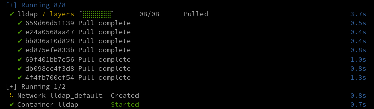
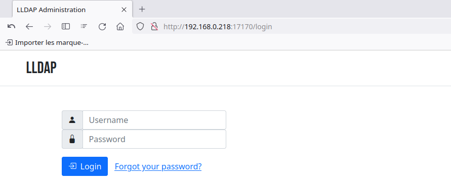
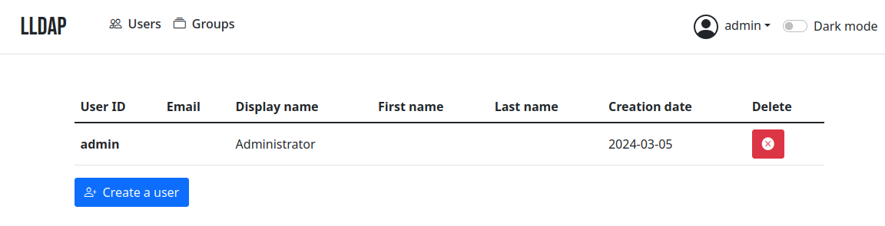
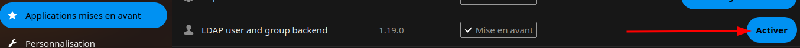
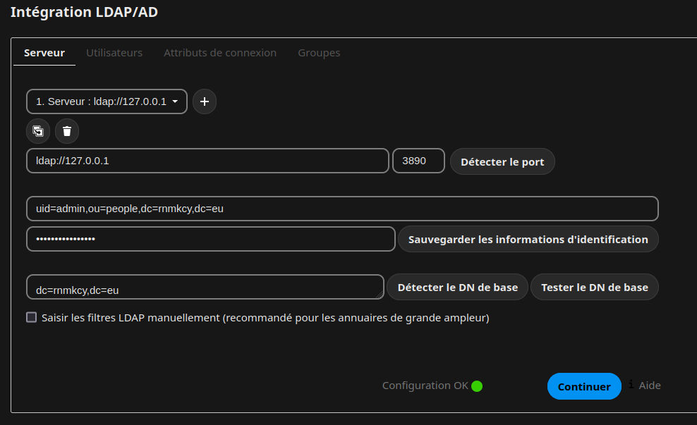
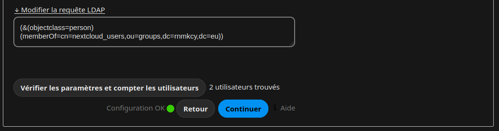
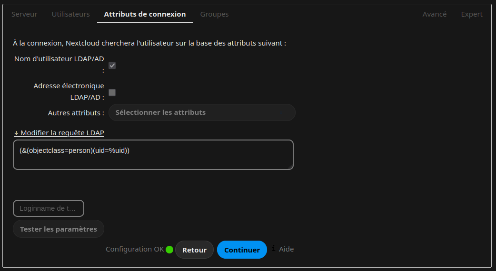

+++
title = 'LLdap - Serveur virtuel d'authentification (VM+Docker)'
date = 2024-03-14 00:00:00 +0100
categories = authentification
+++
*[LLDAP](https://github.com/lldap/lldap) : Light LDAP est un serveur d'authentification léger qui fournit une interface LDAP simplifiée.  
Authelia & lldap : authentification, SSO, gestion des utilisateurs et réinitialisation de mot de passe pour les réseaux domestiques*  


  
<https://github.com/lldap/lldap>

## Liens

* [Authelia & lldap: Authentication, SSO, User Management & Password Reset for Home Networks](https://helgeklein.com/blog/authentication-sso-user-management-password-reset-for-home-networks/)
* [Installation et configuration de LLDAP et Authelia pour limiter l'accès à l'application web Lufi](https://blog.raspot.in/fr/blog/installation-et-configuration-de-lldap-et-authelia-pour-limiter-lacces-a-lapplication-web-lufi)
* [lldap - Light LDAP implementation for authentication](https://github.com/lldap/lldap)


## Machine virtuelle

[Création rapide machine virtuelle KVM debian 12 nocloud](/posts/Creation_rapide_machine_virtuelle_KVM_debian_12_nocloud/)

{:height="50"}

Adresse IP

    ip a

```
2: enp1s0: <BROADCAST,MULTICAST,UP,LOWER_UP> mtu 1500 qdisc fq_codel state UP group default qlen 1000
    link/ether 52:54:00:a1:29:e1 brd ff:ff:ff:ff:ff:ff
    inet 192.168.0.218/24 brd 192.168.0.255 scope global enp1s0
       valid_lft forever preferred_lft forever
    inet6 2a01:e0a:9c8:2080:5054:ff:fea1:29e1/64 scope global dynamic mngtmpaddr noprefixroute 
       valid_lft 86054sec preferred_lft 86054sec
    inet6 fe80::5054:ff:fea1:29e1/64 scope link 
       valid_lft forever preferred_lft forever
```

Modifier motd , `/etc/motd`

```
  _     _     ___    _    ___   ___                           
 | |   | |   |   \  /_\  | _ \ / __| ___  _ _ __ __ ___  _ _  
 | |__ | |__ | |) |/ _ \ |  _/ \__ \/ -_)| '_|\ V // -_)| '_| 
 |____||____||___//_/ \_\|_|   |___/\___||_|   \_/ \___||_|   
  _  ___  ___     _   __  ___     __     ___  _  ___          
 / |/ _ \|_  )   / | / / ( _ )   /  \   |_  )/ |( _ )         
 | |\_, / / /  _ | |/ _ \/ _ \ _| () |_  / / | |/ _ \         
 |_| /_/ /___|(_)|_|\___/\___/(_)\__/(_)/___||_|\___/         
```

### Docker

[Installer Docker CE (Community Edition) sur Debian](/posts/Installer_Docker_CE_sur_Debian/)

## LLDAP

  

[LLdap](https://github.com/lldap/lldap) est un serveur d'authentification léger qui fournit une interface LDAP simplifiée pour l'authentification. Il s'intègre avec
de nombreux backends, de KeyCloak à Authelia en passant par Nextcloud et
[plus](https://github.com/lldap/lldap/blob/main/README.md#compatible-services) !


Il s'accompagne d'une interface qui facilite la gestion des utilisateurs et leur permet de
de modifier leurs coordonnées ou de réinitialiser leur mot de passe par courrier électronique.

Ce serveur est un système de gestion des utilisateurs qui est :

- simple à mettre en place (pas de problème avec `slapd`),
- simple à gérer (interface web conviviale),
- peu de ressources,
- avec des valeurs de base par défaut pour que vous n'ayez pas à comprendre les
  les subtilités de LDAP.

Il cible principalement les serveurs auto-hébergés, avec des composants open-source comme
comme Nextcloud, Airsonic et ainsi de suite, qui ne supportent que LDAP comme source d'authentification externe.  
Pour plus de fonctionnalités (support OAuth/OpenID, reverse proxy, ...) vous pouvez installer
d'autres composants (KeyCloak, Authelia, ...) utilisant ce serveur comme source de
vérification pour les utilisateurs, via LDAP.

Par défaut, les données sont stockées dans SQLite, mais vous pouvez remplacer le backend par
MySQL/MariaDB ou PostgreSQL.

### Configuration LLDAP

Création des fichiers et des dossiers :

```shell
cd $HOME
sudo mkdir /srv/lldap/
sudo chown $USER:$USER /srv/lldap/
mkdir -p /srv/lldap/{secrets,data}
mkdir -p /srv/lldap/data/ssl
cd /srv/lldap/

## Génération du jeton JWT_SECRET
tr -cd '[:alnum:]' < /dev/urandom | fold -w "64" | head -n 1 > ./secrets/JWT_SECRET

## Génération du mot de passe admin LDAP
tr -cd '[:alnum:]' < /dev/urandom | fold -w "20" | head -n 1 > ./secrets/LDAP_USER_PASS

## Génération du certificat et de la clé privée pour LDAPS
## Common Name (e.g. server FQDN or YOUR name) []:lldap.rnmkcy.eu
openssl req -x509 -sha256 -nodes -days 365 -newkey rsa:2048 -keyout ./data/ssl/keyfile.key -out ./data/ssl/certfile.crt

## Sécurisation des fichiers sensibles
chmod 600 ./secrets/*
chmod 600 ./data/ssl/*
```

Configuration de LLDAP 

    nano ./data/lldap_config.toml 

```
database_url = "sqlite:///data/users.db?mode=rwc"
key_file = "/data/private_key"
```

Configuration des variables d'env 

    nano container-vars.env 

```
LLDAP_LDAP_BASE_DN=dc=lldap,dc=rnmkcy,dc=eu
TZ=Europe/Paris
UID=1000                                           
GID=1000                                           

# If using LDAPS, set enabled true and configure cert and key path
LLDAP_LDAPS_OPTIONS__ENABLED=true
LLDAP_LDAPS_OPTIONS__CERT_FILE=/data/ssl/certfile.crt
LLDAP_LDAPS_OPTIONS__KEY_FILE=/data/ssl/keyfile.key

# Secrets: lldap reads them from the specified files.
# This way, the secrets are not part of any process' environment.
LLDAP_JWT_SECRET_FILE=/secrets/JWT_SECRET
LLDAP_LDAP_USER_PASS_FILE=/secrets/LDAP_USER_PASS
```

### Docker LLDAP

**docker**  

* Vous pouvez utiliser l'image la plus récente `:latest` ou `:stable` utilisée dans cet exemple.
* Si UID et GID non définis LLDAP  utilisera par défaut le numéro 1000 pour UID et GID
* Si aucun TZ n'est défini, le fuseau horaire UTC sera utilisé.
* Vous pouvez générer les secrets en utilisant le script `./generate_secrets.sh`

Configuration du docker-compose.yml

    nano docker-compose.yml

```yaml
version: "3"

services:
  lldap:
    container_name: lldap
    image: nitnelave/lldap:stable
    ports:
      # For LDAP
      - "3890:3890"
      # For LDAPS (LDAP Over SSL), enable port if LLDAP_LDAPS_OPTIONS__ENABLED set true, look env below
      - "6360:6360"
      # For the web front-end
      - "17170:17170"
    volumes:
      - ./data:/data
      - ./secrets:/secrets
    env_file:
      - container-vars.env
    restart: unless-stopped
```


Lancez le conteneur 

    docker compose up -d

  

Vérifier docker compose ps

```
NAME      IMAGE                    COMMAND                  SERVICE   CREATED             STATUS                    PORTS
lldap     nitnelave/lldap:stable   "tini -- /docker-ent…"   lldap     About an hour ago   Up 53 minutes (healthy)   0.0.0.0:3890->3890/tcp, :::3890->3890/tcp, 0.0.0.0:6360->6360/tcp, :::6360->6360/tcp, 0.0.0.0:17170->17170/tcp, :::17170->17170/tcp
```

Structure finale

  

### Interface web de gestion

Se connecter à l'**interface web de gestion** <http://192.168.0.218:17170/> (bien évidemment en prod, on mettra le chiffrement en place ou un proxy).  
  

Le compte par défaut est admin et le mot de passe est contenu dans le fichier "/srv/lldap/secrets/LDAP_USER_PASS".  
  
Vous pouvez créer/gérer les groupes et les utilisateurs.

Note : par défaut on utilise une base Sqlite mais il est possible de [migrer plus tard vers MySQL/MariaDB ou PostgreSQL](https://github.com/lldap/lldap/blob/main/docs/database_migration.md)

### Ldap cli

*Accès aux informations de l'annuaire en ligne de commande*

Installer les outils ldap

    sudo apt install ldap-utils

Afficher les données de l'annuaire

```
# IPV4
ldapsearch -H ldap://127.0.0.1:3890 -LLL -D "uid=admin,ou=people,dc=rnmkcy,dc=eu" \
-w '<admin_password>' -b "ou=people,dc=rnmkcy,dc=eu" 

# IPV6
ldapsearch -H ldap://[2a01:e0a:9c8:2080:5054:ff:fea1:29e1]:3890 \
-LLL -D "uid=admin,ou=people,dc=rnmkcy,dc=eu" \
-w '<admin_password>' -b "ou=people,dc=rnmkcy,dc=eu" 
```

Résultat commande

```
dn: uid=admin,ou=people,dc=rnmkcy,dc=eu
objectclass: inetOrgPerson
objectclass: posixAccount
objectclass: mailAccount
objectclass: person
uid: admin
cn: Administrator
createtimestamp: 2024-03-05T14:12:09.880825287+00:00
entryuuid: 22e95ce8-c4c8-3726-a708-abf8eab7fab7

dn: uid=yann,ou=people,dc=rnmkcy,dc=eu
objectclass: inetOrgPerson
objectclass: posixAccount
objectclass: mailAccount
objectclass: person
uid: yann
mail: yann@cinay.eu
cn: Second admin
createtimestamp: 2024-03-05T14:29:18.503605447+00:00
entryuuid: 5afdc712-b11f-305a-948f-195fa036d5a5
```

### Clients LLdap

[lldap - Client configuration](https://github.com/lldap/lldap?tab=readme-ov-file#client-configuration)  
[lldap - Light LDAP implementation for authentication](https://hub.docker.com/r/lldap/lldap)  

Les configurations clientes utilisées

#### Calibre Web

* [Calibre Web](https://github.com/lldap/lldap/blob/main/example_configs/calibre_web.md)


#### Nextcloud LLDAP

* [Nextcloud](https://github.com/lldap/lldap/blob/main/example_configs/nextcloud.md)  

Mise en place dans nextcloud (méthode graphique) 

Préalable sur debian, installer ldap suivant version php

    sudo apt install php8.2-ldap

Activer l'application ldap   


Administration &rarr; Intégration LDAP/AD  
  
**Serveur** 

  
**Utilisateurs**

  
**Attributs de connexion**
