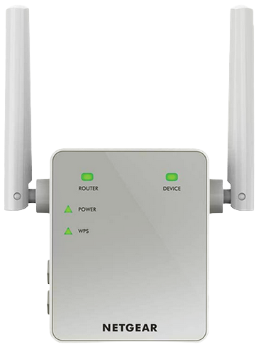
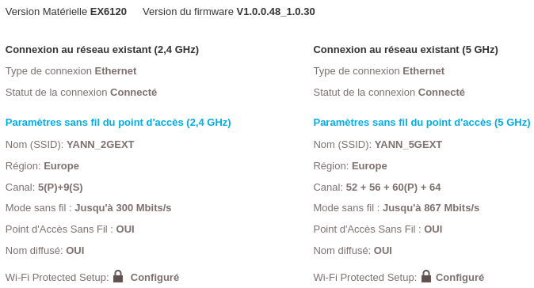
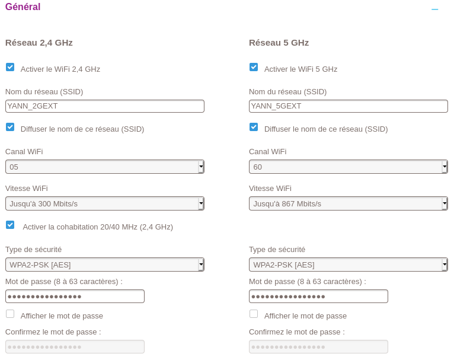
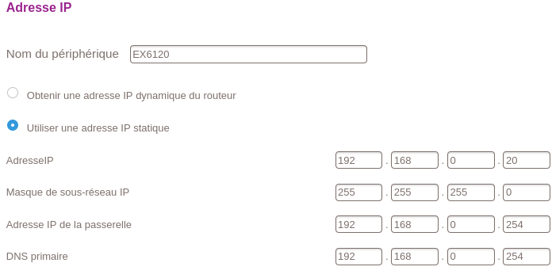
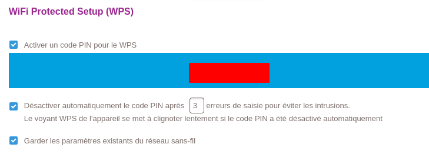
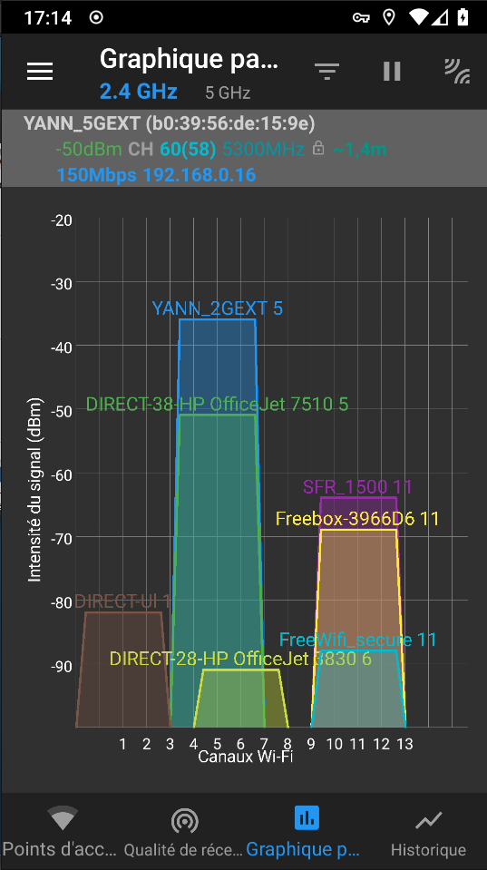
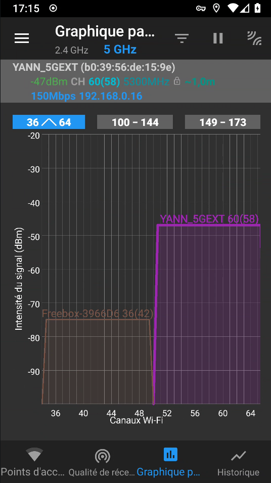

+++
title = 'NETGEAR Répéteur WiFi Dual Band AC1200 Modèle EX6120'
date = 2024-04-04 00:00:00 +0100
categories = ['wifi']
+++
{:width="200"}   

## Démarrage Rapide

* [Démarrage rapide - Répéteur WiFi Dual Band AC1200 Modèle EX6120 (PDF)](/files/EX6120_FR_QSG_25May2015.pdf)

## Répéteur wifi réseau 192.168.0.0/24

* [Configuration initiale de l’EX6000/6120 en utilisant l’installation par navigateur](https://kb.netgear.com/fr/30749/Configuration-initiale-de-l-EX6000-6120-en-utilisant-l-installation-par-navigateur?language=fr)

### Synthèse

{:width="500"}   

### Paramètrage

Répéteur configurer en Point d'accès WIFI AC1200

{:width="500"}   
{:width="500"}   
{:width="500"}   

### Analyse réseau

Wifi analyzer  

{:height="400"} {:height="400"}   

## Répéteur wifi réseau 192.168.100.0/24

Ouvrir le navigateur sur le lien <http://192.168.0.20>, saisir login/Mot de passe  
Modifier l'adresse IP pour se connecter à OpenMpTcpRouter  
{:width="500"}   

On est déconnecté car changement de réseau, passe de 192.168.0.0/24 &rarr; 192.168.100.0/24

