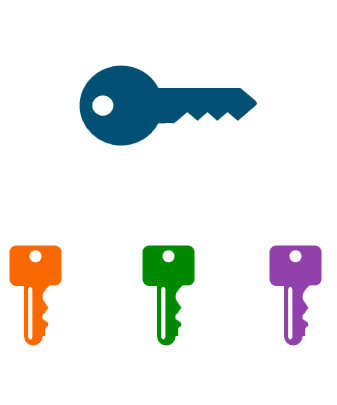
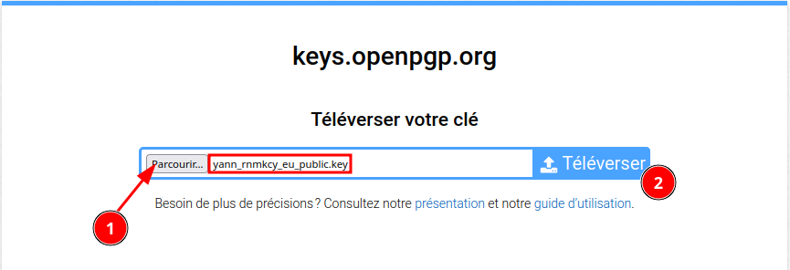
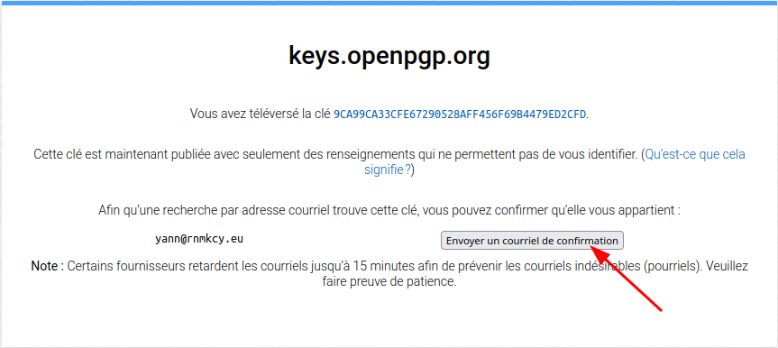
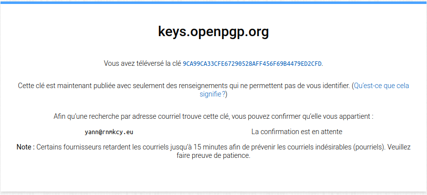
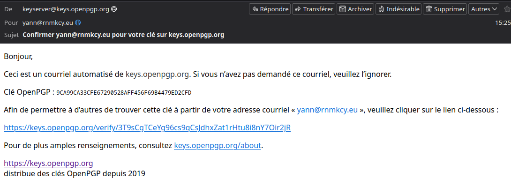
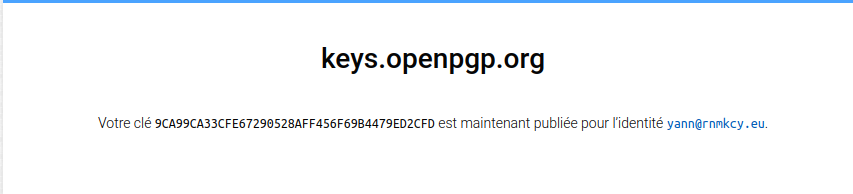

+++
title = 'OpenPGP Yubikey 5'
date = 2024-04-17 00:00:00 +0100
categories = chiffrement
+++
*Comment configurer votre YubiKey avec OpenPGP après avoir généré la clé privée puis déplacer les sous-clés vers le YubiKey*

 {:height="150"}   

- [OpenPGP](#openpgp)
    - [Clé GnuPG principale](#clé-gnupg-principale)
    - [Création des sous-clés](#création-des-sous-clés)
    - [Sauvegarde Restauration](#sauvegarde-restauration)
    - [Exporter clé sur serveur](#exporter-clé-sur-serveur)
- [OpenPGP Yubikey 5](#openpgp-yubikey-5)
    - [Prérequis archlinux](#prérequis-archlinux)
    - [Retour paramétrage usine de pgp](#retour-paramétrage-usine-de-pgp)
    - [Configuration yubikey](#configuration-yubikey)
    - [Exporter les clefs vers la Yubikey](#exporter-les-clefs-vers-la-yubikey)

## OpenPGP

* [OpenPGP - Une paire de clés presque parfaite](https://blog.eleven-labs.com/fr/openpgp-paire-clef-presque-parfaite-partie-1/)

Lors de la création d'une clé OpenPGP dans son mode de base, gpg va créer une paire de clés qui permet de signer et de certifier. Pour augmenter la sécurité de notre clé, nous allons utiliser une particularité d'OpenPGP : les sous-clés.  
OpenPGP permet de créer des sous-clés avec un usage spécifique : signer, chiffrer et authentifier. Un autre avantage à l'utilisation des sous-clés est qu'en cas de perte ou vol des clés secrètes des sous-clés, il suffira de révoquer la sous-clé sans avoir à révoquer la clé principale (celle qui permet de certifier d'autres clés).

Commençons par créer la clé principale, celle qui va détenir notre identité. Puis ensuite, créons des sous-clés pour signer, chiffrer et authentifier.

### Clé GnuPG principale

<div class="item">
  <div class="item__image">
    
  </div>
  <div class="item__content">
    <div class="item__header">
      <h4>Clé GPG</h4>
    </div>
    <div class="item__description">
      <ul>
        <li>C (Certifier) : Permet de certifier les clés publiques des autres utilisateurs.</li>
        <li>S (Signer) : Permet de signer les messages électroniques.</li>
        <li>A (Authenticate) : Permet d’authentifier l’utilisateur.</li>
        <li>E (Encrypt) : Permet de chiffrer les messages électroniques.</li>
      </ul>
    </div>
  </div>
</div>

Ces permissions peuvent être cumulées sur une même clé ou réparties sur plusieurs sous-clés. Ainsi, il est possible de créer une clé principale avec la permission C et des sous-clés avec les permissions S, E et A (pour séparer les usages).  
Une sous-clé (subkey) est une clé secondaire à une clé principale. Comme dit plus haut, celle-ci possède ses propres permissions et sa propre date d’expiration. La clé principale est la clé qui certifie ou révoque les sous-clés.

Générer la clé GPG

    gpg --expert --full-gen-key

<details>
<summary><b>Etendre Réduire</b></summary>
  
gpg (GnuPG) 2.2.40; Copyright (C) 2022 g10 Code GmbH
This is free software: you are free to change and redistribute it.
There is NO WARRANTY, to the extent permitted by law.

Sélectionnez le type de clef désiré :
   (1) RSA et RSA (par défaut)
   (2) DSA et Elgamal
   (3) DSA (signature seule)
   (4) RSA (signature seule)
   (7) DSA (indiquez vous-même les capacités)
   (8) RSA (indiquez vous-même les capacités)
   (9) ECC et ECC
  (10) ECC (signature seule)
  (11) ECC (indiquez vous-même les capacités)
  (13) Clef existante
  (14) Existing key from card
Quel est votre choix ? 11

Actions possibles pour une clef ECDSA/EdDSA : Signer Certifier Authentifier 
Actions actuellement permises : Signer Certifier 

   (S) Inverser la capacité de signature
   (A) Inverser la capacité d'authentification
   (Q) Terminé

Quel est votre choix ? s

Actions possibles pour une clef ECDSA/EdDSA : Signer Certifier Authentifier 
Actions actuellement permises : Certifier 

   (S) Inverser la capacité de signature
   (A) Inverser la capacité d'authentification
   (Q) Terminé

Quel est votre choix ? q
Sélectionnez le type de courbe elliptique désiré :
   (1) Curve 25519
   (3) NIST P-256
   (4) NIST P-384
   (5) NIST P-521
   (6) Brainpool P-256
   (7) Brainpool P-384
   (8) Brainpool P-512
   (9) secp256k1
Quel est votre choix ? 1
Veuillez indiquer le temps pendant lequel cette clef devrait être valable.
         0 = la clef n'expire pas
      <n>  = la clef expire dans n jours
      <n>w = la clef expire dans n semaines
      <n>m = la clef expire dans n mois
      <n>y = la clef expire dans n ans
Pendant combien de temps la clef est-elle valable ? (0) 10y
La clef expire le ven. 14 avril 2034 12:42:11 CEST
Est-ce correct ? (o/N) o

GnuPG doit construire une identité pour identifier la clef.

Nom réel : Yannick MEUNIER
Adresse électronique : yann@rnmkcy.eu
Commentaire : 
Vous avez sélectionné cette identité :
    « Yannick MEUNIER <yann@rnmkcy.eu> »

Changer le (N)om, le (C)ommentaire, l'(A)dresse électronique
ou (O)ui/(Q)uitter ? O
De nombreux octets aléatoires doivent être générés. Vous devriez faire
autre chose (taper au clavier, déplacer la souris, utiliser les disques)
pendant la génération de nombres premiers ; cela donne au générateur de
nombres aléatoires une meilleure chance d'obtenir suffisamment d'entropie.

</details>

Résultat

```
gpg: /home/leno/.gnupg/trustdb.gpg : base de confiance créée
gpg: répertoire « /home/leno/.gnupg/openpgp-revocs.d » créé
gpg: revocation certificate stored as '/home/leno/.gnupg/openpgp-revocs.d/9CA99CA33CFE67290528AFF456F69B4479ED2CFD.rev'
les clefs publique et secrète ont été créées et signées.

pub   ed25519 2024-04-16 [C] [expire : 2034-04-14]
      9CA99CA33CFE67290528AFF456F69B4479ED2CFD
uid                      Yannick MEUNIER <yann@rnmkcy.eu>
```

### Création des sous-clés

il est important d'en avoir une dédiée à chaque tâche :

*    Authentification (A)
*    Signature (S)
*    Chiffrement (E)

Créer des clés secondaires

    gpg --edit-key --expert yann@rnmkcy.eu

```
gpg (GnuPG) 2.2.40; Copyright (C) 2022 g10 Code GmbH
This is free software: you are free to change and redistribute it.
There is NO WARRANTY, to the extent permitted by law.

La clef secrète est disponible.

sec  ed25519/56F69B4479ED2CFD
     créé : 2024-04-16  expire : 2034-04-14  utilisation : C   
     confiance : ultime        validité : ultime
[  ultime ] (1). Yannick MEUNIER <yann@rnmkcy.eu>
```

La commande addkey sera exécutée 3 fois 

<details>
<summary><b>Etendre Réduire</b></summary>
  
gpg> addkey
Sélectionnez le type de clef désiré :
   (3) DSA (signature seule)
   (4) RSA (signature seule)
   (5) Elgamal (chiffrement seul)
   (6) RSA (chiffrement seul)
   (7) DSA (indiquez vous-même les capacités)
   (8) RSA (indiquez vous-même les capacités)
  (10) ECC (signature seule)
  (11) ECC (indiquez vous-même les capacités)
  (12) ECC (chiffrement seul)
  (13) Clef existante
  (14) Existing key from card
Quel est votre choix ? 11

Actions possibles pour une clef ECDSA/EdDSA : Signer Authentifier 
Actions actuellement permises : Signer 

   (S) Inverser la capacité de signature
   (A) Inverser la capacité d'authentification
   (Q) Terminé

Quel est votre choix ? Q
Sélectionnez le type de courbe elliptique désiré :
   (1) Curve 25519
   (3) NIST P-256
   (4) NIST P-384
   (5) NIST P-521
   (6) Brainpool P-256
   (7) Brainpool P-384
   (8) Brainpool P-512
   (9) secp256k1
Quel est votre choix ? 1
Veuillez indiquer le temps pendant lequel cette clef devrait être valable.
         0 = la clef n'expire pas
      <n>  = la clef expire dans n jours
      <n>w = la clef expire dans n semaines
      <n>m = la clef expire dans n mois
      <n>y = la clef expire dans n ans
Pendant combien de temps la clef est-elle valable ? (0) 5y
La clef expire le dim. 15 avril 2029 13:44:51 CEST
Est-ce correct ? (o/N) o
Faut-il vraiment la créer ? (o/N) o
De nombreux octets aléatoires doivent être générés. Vous devriez faire
autre chose (taper au clavier, déplacer la souris, utiliser les disques)
pendant la génération de nombres premiers ; cela donne au générateur de
nombres aléatoires une meilleure chance d'obtenir suffisamment d'entropie.

sec  ed25519/56F69B4479ED2CFD
     créé : 2024-04-16  expire : 2034-04-14  utilisation : C   
     confiance : ultime        validité : ultime
ssb  ed25519/1654EE1DCB6A4B92
     créé : 2024-04-16  expire : 2029-04-15  utilisation : S   
[  ultime ] (1). Yannick MEUNIER <yann@rnmkcy.eu>

gpg> addkey
Sélectionnez le type de clef désiré :
   (3) DSA (signature seule)
   (4) RSA (signature seule)
   (5) Elgamal (chiffrement seul)
   (6) RSA (chiffrement seul)
   (7) DSA (indiquez vous-même les capacités)
   (8) RSA (indiquez vous-même les capacités)
  (10) ECC (signature seule)
  (11) ECC (indiquez vous-même les capacités)
  (12) ECC (chiffrement seul)
  (13) Clef existante
  (14) Existing key from card
Quel est votre choix ? 11

Actions possibles pour une clef ECDSA/EdDSA : Signer Authentifier 
Actions actuellement permises : Signer 

   (S) Inverser la capacité de signature
   (A) Inverser la capacité d'authentification
   (Q) Terminé

Quel est votre choix ? A

Actions possibles pour une clef ECDSA/EdDSA : Signer Authentifier 
Actions actuellement permises : Signer Authentifier 

   (S) Inverser la capacité de signature
   (A) Inverser la capacité d'authentification
   (Q) Terminé

Quel est votre choix ? S

Actions possibles pour une clef ECDSA/EdDSA : Signer Authentifier 
Actions actuellement permises : Authentifier 

   (S) Inverser la capacité de signature
   (A) Inverser la capacité d'authentification
   (Q) Terminé

Quel est votre choix ? Q
Sélectionnez le type de courbe elliptique désiré :
   (1) Curve 25519
   (3) NIST P-256
   (4) NIST P-384
   (5) NIST P-521
   (6) Brainpool P-256
   (7) Brainpool P-384
   (8) Brainpool P-512
   (9) secp256k1
Quel est votre choix ? 1
Veuillez indiquer le temps pendant lequel cette clef devrait être valable.
         0 = la clef n'expire pas
      <n>  = la clef expire dans n jours
      <n>w = la clef expire dans n semaines
      <n>m = la clef expire dans n mois
      <n>y = la clef expire dans n ans
Pendant combien de temps la clef est-elle valable ? (0) 5y
La clef expire le dim. 15 avril 2029 13:47:50 CEST
Est-ce correct ? (o/N) o
Faut-il vraiment la créer ? (o/N) o
De nombreux octets aléatoires doivent être générés. Vous devriez faire
autre chose (taper au clavier, déplacer la souris, utiliser les disques)
pendant la génération de nombres premiers ; cela donne au générateur de
nombres aléatoires une meilleure chance d'obtenir suffisamment d'entropie.

sec  ed25519/56F69B4479ED2CFD
     créé : 2024-04-16  expire : 2034-04-14  utilisation : C   
     confiance : ultime        validité : ultime
ssb  ed25519/1654EE1DCB6A4B92
     créé : 2024-04-16  expire : 2029-04-15  utilisation : S   
ssb  ed25519/61386614B5A2EB55
     créé : 2024-04-16  expire : 2029-04-15  utilisation : A   
[  ultime ] (1). Yannick MEUNIER <yann@rnmkcy.eu>

gpg> addkey
Sélectionnez le type de clef désiré :
   (3) DSA (signature seule)
   (4) RSA (signature seule)
   (5) Elgamal (chiffrement seul)
   (6) RSA (chiffrement seul)
   (7) DSA (indiquez vous-même les capacités)
   (8) RSA (indiquez vous-même les capacités)
  (10) ECC (signature seule)
  (11) ECC (indiquez vous-même les capacités)
  (12) ECC (chiffrement seul)
  (13) Clef existante
  (14) Existing key from card
Quel est votre choix ? 12
Sélectionnez le type de courbe elliptique désiré :
   (1) Curve 25519
   (3) NIST P-256
   (4) NIST P-384
   (5) NIST P-521
   (6) Brainpool P-256
   (7) Brainpool P-384
   (8) Brainpool P-512
   (9) secp256k1
Quel est votre choix ? 1
Veuillez indiquer le temps pendant lequel cette clef devrait être valable.
         0 = la clef n'expire pas
      <n>  = la clef expire dans n jours
      <n>w = la clef expire dans n semaines
      <n>m = la clef expire dans n mois
      <n>y = la clef expire dans n ans
Pendant combien de temps la clef est-elle valable ? (0) 5y
La clef expire le dim. 15 avril 2029 13:49:58 CEST
Est-ce correct ? (o/N) o
Faut-il vraiment la créer ? (o/N) o
De nombreux octets aléatoires doivent être générés. Vous devriez faire
autre chose (taper au clavier, déplacer la souris, utiliser les disques)
pendant la génération de nombres premiers ; cela donne au générateur de
nombres aléatoires une meilleure chance d'obtenir suffisamment d'entropie.

sec  ed25519/56F69B4479ED2CFD
     créé : 2024-04-16  expire : 2034-04-14  utilisation : C   
     confiance : ultime        validité : ultime
ssb  ed25519/1654EE1DCB6A4B92
     créé : 2024-04-16  expire : 2029-04-15  utilisation : S   
ssb  ed25519/61386614B5A2EB55
     créé : 2024-04-16  expire : 2029-04-15  utilisation : A   
ssb  cv25519/F2C20511596953B4
     créé : 2024-04-16  expire : 2029-04-15  utilisation : E   
[  ultime ] (1). Yannick MEUNIER <yann@rnmkcy.eu>

gpg> save

</details>

Accorder la confiance

    gpg --edit-key yann@rnmkcy.eu

<details>
<summary><b>Etendre Réduire</b></summary>
  
gpg (GnuPG) 2.2.40; Copyright (C) 2022 g10 Code GmbH
This is free software: you are free to change and redistribute it.
There is NO WARRANTY, to the extent permitted by law.

La clef secrète est disponible.

sec  ed25519/56F69B4479ED2CFD
     créé : 2024-04-16  expire : 2034-04-14  utilisation : C   
     confiance : inconnu       validité : inconnu
ssb  ed25519/1654EE1DCB6A4B92
     créé : 2024-04-16  expire : 2029-04-15  utilisation : S   
ssb  ed25519/61386614B5A2EB55
     créé : 2024-04-16  expire : 2029-04-15  utilisation : A   
ssb  cv25519/F2C20511596953B4
     créé : 2024-04-16  expire : 2029-04-15  utilisation : E   
[ inconnue] (1). Yannick MEUNIER <yann@rnmkcy.eu>

gpg> trust
sec  ed25519/56F69B4479ED2CFD
     créé : 2024-04-16  expire : 2034-04-14  utilisation : C   
     confiance : inconnu       validité : inconnu
ssb  ed25519/1654EE1DCB6A4B92
     créé : 2024-04-16  expire : 2029-04-15  utilisation : S   
ssb  ed25519/61386614B5A2EB55
     créé : 2024-04-16  expire : 2029-04-15  utilisation : A   
ssb  cv25519/F2C20511596953B4
     créé : 2024-04-16  expire : 2029-04-15  utilisation : E   
[ inconnue] (1). Yannick MEUNIER <yann@rnmkcy.eu>

Décidez maintenant de la confiance que vous portez en cet utilisateur pour
vérifier les clefs des autres utilisateurs (en regardant les passeports, en
vérifiant les empreintes depuis diverses sources, etc.)

  1 = je ne sais pas ou n'ai pas d'avis
  2 = je ne fais PAS confiance
  3 = je fais très légèrement confiance
  4 = je fais entièrement confiance
  5 = j'attribue une confiance ultime
  m = retour au menu principal

Quelle est votre décision ? 5
Voulez-vous vraiment attribuer une confiance ultime à cette clef ? (o/N) o

sec  ed25519/56F69B4479ED2CFD
     créé : 2024-04-16  expire : 2034-04-14  utilisation : C   
     confiance : ultime        validité : inconnu
ssb  ed25519/1654EE1DCB6A4B92
     créé : 2024-04-16  expire : 2029-04-15  utilisation : S   
ssb  ed25519/61386614B5A2EB55
     créé : 2024-04-16  expire : 2029-04-15  utilisation : A   
ssb  cv25519/F2C20511596953B4
     créé : 2024-04-16  expire : 2029-04-15  utilisation : E   
[ inconnue] (1). Yannick MEUNIER <yann@rnmkcy.eu>
Veuillez remarquer que la validité affichée pour la clef n'est pas
forcément correcte avant d'avoir relancé le programme.

gpg> quit

</details>

### Sauvegarde Restauration

Sauvegarder les clés GnuPG dans un dossier `/sharenfs/rnmkcy/.gnupg/`

```bash
# Clé publique
gpg --export --armor yann@rnmkcy.eu > /sharenfs/rnmkcy/.gnupg/yann_rnmkcy_eu_public.key

# Clé privée principale et les clés privées des subkeys
# Il faut saisir la passphrase
gpg --export-secret-keys --armor yann@rnmkcy.eu > /sharenfs/rnmkcy/.gnupg/yann_rnmkcy_eu_private.key
gpg --export-secret-subkeys --armor yann@rnmkcy.eu > /sharenfs/rnmkcy/.gnupg/yann_rnmkcy_eu_private-subkeys.key
```

Pour vérifier la sauvegarde, on va supprimer les clés du trousseau

```bash
gpg --delete-secret-keys yann@rnmkcy.eu
gpg --delete-keys yann@rnmkcy.eu
```

Les commandes `gpg --list-keys` et `gpg --list-secret-keys` ne devraient plus rien retourner.

Réimporter les clés sauvegardées

```bash
gpg --import /sharenfs/rnmkcy/.gnupg/yann_rnmkcy_eu_private.key
```

Résultat

```
gpg: clef 56F69B4479ED2CFD : clef publique « Yannick MEUNIER <yann@rnmkcy.eu> » importée
gpg: clef 56F69B4479ED2CFD : clef secrète importée
gpg:       Quantité totale traitée : 1
gpg:                     importées : 1
gpg:           clefs secrètes lues : 1
gpg:      clefs secrètes importées : 1
```

Liste des clés

```
leno@rnmkcy:~$ gpg --list-keys
gpg: vérification de la base de confiance
gpg: marginals needed: 3  completes needed: 1  trust model: pgp
gpg: profondeur : 0  valables :   1  signées :   0
     confiance : 0 i., 0 n.d., 0 j., 0 m., 0 t., 1 u.
gpg: la prochaine vérification de la base de confiance aura lieu le 2034-04-14
/home/leno/.gnupg/pubring.kbx
-----------------------------
pub   ed25519 2024-04-16 [C] [expire : 2034-04-14]
      9CA99CA33CFE67290528AFF456F69B4479ED2CFD
uid          [  ultime ] Yannick MEUNIER <yann@rnmkcy.eu>
sub   ed25519 2024-04-16 [S] [expire : 2029-04-15]
sub   ed25519 2024-04-16 [A] [expire : 2029-04-15]
sub   cv25519 2024-04-16 [E] [expire : 2029-04-15]

leno@rnmkcy:~$ gpg --list-secret-keys
/home/leno/.gnupg/pubring.kbx
-----------------------------
sec   ed25519 2024-04-16 [C] [expire : 2034-04-14]
      9CA99CA33CFE67290528AFF456F69B4479ED2CFD
uid          [  ultime ] Yannick MEUNIER <yann@rnmkcy.eu>
ssb   ed25519 2024-04-16 [S] [expire : 2029-04-15]
ssb   ed25519 2024-04-16 [A] [expire : 2029-04-15]
ssb   cv25519 2024-04-16 [E] [expire : 2029-04-15]
```

### Exporter clé sur serveur

L’interface Web de keys.openpgp.org vous permet de :

* [Chercher](https://keys.openpgp.org/) des clés manuellement, par empreinte ou par adresse courriel.
* [Téléverser](https://keys.openpgp.org/upload) des clés manuellement et de les confirmer une fois téléversées.
* [Gérer](https://keys.openpgp.org/manage) vos clés et supprimer les identités publiées.

  
  
  
  
  

## OpenPGP Yubikey 5

* [pcsc-lite: configuration using /etc/default/pcscd](https://ludovicrousseau.blogspot.com/2021/08/pcsc-lite-configuration-using.html)  
* [Resetting Your YubiKey 5 Series to Factory Defaults](https://support.yubico.com/hc/en-us/articles/360013757959-Resetting-Your-YubiKey-5-Series-to-Factory-Defaults)
* [OpenPGP - Exporter les clefs secrètes sur une Yubikey](https://blog.eleven-labs.com/fr/openpgp-clef-secrete-yubikey-partie-2/)

### Prérequis archlinux

Installez ccid et opensc à partir des référentiels officiels

    sudo pacman -S ccid opensc

Créer un fichier

    echo "disable-ccid" > ~/.gnupg/scdaemon.conf

Activer et démarrer le service pcscd.service

    sudo systemctl enable pcscd.service --now

### Retour paramétrage usine de pgp

Retour paramétrage usine de la partie pgp, installer: `yay -S yubikey-manager`  
Exécuter : `ykman openpgp reset`

```
WARNING! This will delete all stored OpenPGP keys and data and restore factory settings. Proceed? [y/N]: y
Resetting OpenPGP data, don't remove the YubiKey...
Success! All data has been cleared and default PINs are set.
PIN:         123456
Reset code:  NOT SET
Admin PIN:   12345678
```

Satus **Yubikeys 5**

    gpg --card-status

Etat

```
Reader ...........: 1050:0407:X:0
Application ID ...: D2760001240100000006245545860000
Application type .: OpenPGP
Version ..........: 3.4
Manufacturer .....: Yubico
Serial number ....: 24554586
Name of cardholder: [non positionné]
Language prefs ...: [non positionné]
Salutation .......: 
URL of public key : [non positionné]
Login data .......: [non positionné]
Signature PIN ....: non forcé
Key attributes ...: rsa2048 rsa2048 rsa2048
Max. PIN lengths .: 127 127 127
PIN retry counter : 3 0 3
Signature counter : 0
KDF setting ......: off
UIF setting ......: Sign=off Decrypt=off Auth=off
Signature key ....: [none]
Encryption key....: [none]
Authentication key: [none]
General key info..: [none]
```

La carte est vierge, il n'y aucune information personnelle. Il est recommandé de compléter les informations au cas où une personne retrouve cette clef.

### Configuration yubikey

Éditons la carte et passons en mode admin. Vous pouvez entrer help pour avoir la liste des commandes disponibles.

```
gpg --card-edit

gpg/carte> admin
Les commandes d'administration sont permises
```

Nous allons tout d'abord changer le code PIN d'administration de la clef et le code PIN utilisateur. Par défaut, le code PIN de l'administrateur est 12345678 et 123456 pour le code PIN utilisateur.

Le PIN administrateur est requis pour quelques opérations sur la carte (l'export de clef par exemple), et pour débloquer quand un code PIN a été entré 3 fois par erreur.

Entrer passwd pour les changer. Commençons par le PIN administrateur et ensuite le PIN utilisateur.

```
gpg/carte> passwd
gpg: carte OpenPGP nº D2760001240100000006245545860000 détectée

1 - change PIN
2 - unblock PIN
3 - change Admin PIN
4 - set the Reset Code
Q - quit

Quel est votre choix ? 3
PIN changed.

1 - change PIN
2 - unblock PIN
3 - change Admin PIN
4 - set the Reset Code
Q - quit

Quel est votre choix ? 1
PIN changed.

1 - change PIN
2 - unblock PIN
3 - change Admin PIN
4 - set the Reset Code
Q - quit

Quel est votre choix ? q

gpg/carte>
```

Ensuite, entrer les informations pour personnaliser votre clef :

```
gpg/carte> name
Nom du détenteur de la carte : MEUNIER
Prénom du détenteur de la carte : Yannick

gpg/carte> url
URL pour récupérer la clef publique : https://keys.openpgp.org/search?q=yann@rnmkcy.eu

gpg/carte> quit
```

La clef est a présent configurée. Nous pouvons exporter les clefs privées des sous-clefs dans la carte à puce.

### Exporter les clefs vers la Yubikey

L'objectif est de déplacer les clefs secrètes des sous-clefs dans la Yubikey. Pour cela, nous allons séléctionner chaque sous-clef une par une avec la commande key n et la déplacer dans la carte avec keytocard. À la fin, il n'y aura plus aucun secret dans le trousseau de clef gpg.

Éditons la clef.

    gpg --expert --edit-key yann@rnmkcy.eu

```
La clef secrète est disponible.

gpg: vérification de la base de confiance
gpg: marginals needed: 3  completes needed: 1  trust model: pgp
gpg: profondeur : 0  valables :   1  signées :   0
     confiance : 0 i., 0 n.d., 0 j., 0 m., 0 t., 1 u.
gpg: la prochaine vérification de la base de confiance aura lieu le 2034-04-14
sec  ed25519/56F69B4479ED2CFD
     créé : 2024-04-16  expire : 2034-04-14  utilisation : C   
     confiance : ultime        validité : ultime
ssb  ed25519/1654EE1DCB6A4B92
     créé : 2024-04-16  expire : 2029-04-15  utilisation : S   
ssb  ed25519/61386614B5A2EB55
     créé : 2024-04-16  expire : 2029-04-15  utilisation : A   
ssb  cv25519/F2C20511596953B4
     créé : 2024-04-16  expire : 2029-04-15  utilisation : E   
[  ultime ] (1). Yannick MEUNIER <yann@rnmkcy.eu>

gpg> 
```

Ensuite, nous sélectionnons les clés une à une pour les importer sur la Yubikey.

<details>
<summary><b>Etendre Réduire</b></summary>

  
gpg> key 1

sec  ed25519/56F69B4479ED2CFD
     créé : 2024-04-16  expire : 2034-04-14  utilisation : C   
     confiance : ultime        validité : ultime
ssb* ed25519/1654EE1DCB6A4B92
     créé : 2024-04-16  expire : 2029-04-15  utilisation : S   
ssb  ed25519/61386614B5A2EB55
     créé : 2024-04-16  expire : 2029-04-15  utilisation : A   
ssb  cv25519/F2C20511596953B4
     créé : 2024-04-16  expire : 2029-04-15  utilisation : E   
[  ultime ] (1). Yannick MEUNIER <yann@rnmkcy.eu>

---
Le petit astérisque devant l'empreinte de la clef indique qu'elle est sélectionnée.
Entrer keytocard pour l'exporter vers la Yubikey.
---

gpg> keytocard
Veuillez sélectionner l'endroit où stocker la clef :
   (1) Clef de signature
   (3) Clef d'authentification
Quel est votre choix ? 1

sec  ed25519/56F69B4479ED2CFD
     créé : 2024-04-16  expire : 2034-04-14  utilisation : C   
     confiance : ultime        validité : ultime
ssb* ed25519/1654EE1DCB6A4B92
     créé : 2024-04-16  expire : 2029-04-15  utilisation : S   
ssb  ed25519/61386614B5A2EB55
     créé : 2024-04-16  expire : 2029-04-15  utilisation : A   
ssb  cv25519/F2C20511596953B4
     créé : 2024-04-16  expire : 2029-04-15  utilisation : E   
[  ultime ] (1). Yannick MEUNIER <yann@rnmkcy.eu>

Note: the local copy of the secret key will only be deleted with "save".

---
gpg va vous demander le mot de passe de la clef secrète de chiffrement et ensuite le code pin d'administration de la clef Yubikey. Une fois le code pin d'administration de la Yubikey entré, la clef secrète de chiffrement est bien dans la Yubikey. Nous pourrons le vérifier juste après avoir déplacé les deux autres clef.  
Séléctionnons la clef de signature. Il faut désélectionner la première clef et séléctionner la seconde.
---

gpg> key 1
gpg> key 2

sec  ed25519/56F69B4479ED2CFD
     créé : 2024-04-16  expire : 2034-04-14  utilisation : C   
     confiance : ultime        validité : ultime
ssb  ed25519/1654EE1DCB6A4B92
     créé : 2024-04-16  expire : 2029-04-15  utilisation : S   
ssb* ed25519/61386614B5A2EB55
     créé : 2024-04-16  expire : 2029-04-15  utilisation : A   
ssb  cv25519/F2C20511596953B4
     créé : 2024-04-16  expire : 2029-04-15  utilisation : E   
[  ultime ] (1). Yannick MEUNIER <yann@rnmkcy.eu>

gpg> keytocard
Veuillez sélectionner l'endroit où stocker la clef :
   (3) Clef d'authentification
Quel est votre choix ? 3

sec  ed25519/56F69B4479ED2CFD
     créé : 2024-04-16  expire : 2034-04-14  utilisation : C   
     confiance : ultime        validité : ultime
ssb  ed25519/1654EE1DCB6A4B92
     créé : 2024-04-16  expire : 2029-04-15  utilisation : S   
ssb* ed25519/61386614B5A2EB55
     créé : 2024-04-16  expire : 2029-04-15  utilisation : A   
ssb  cv25519/F2C20511596953B4
     créé : 2024-04-16  expire : 2029-04-15  utilisation : E   
[  ultime ] (1). Yannick MEUNIER <yann@rnmkcy.eu>

Note: the local copy of the secret key will only be deleted with "save".

gpg> key 2

gpg> key 3

sec  ed25519/56F69B4479ED2CFD
     créé : 2024-04-16  expire : 2034-04-14  utilisation : C   
     confiance : ultime        validité : ultime
ssb  ed25519/1654EE1DCB6A4B92
     créé : 2024-04-16  expire : 2029-04-15  utilisation : S   
ssb  ed25519/61386614B5A2EB55
     créé : 2024-04-16  expire : 2029-04-15  utilisation : A   
ssb* cv25519/F2C20511596953B4
     créé : 2024-04-16  expire : 2029-04-15  utilisation : E   
[  ultime ] (1). Yannick MEUNIER <yann@rnmkcy.eu>

gpg> keytocard
Veuillez sélectionner l'endroit où stocker la clef :
   (2) Clef de chiffrement
Quel est votre choix ? 2

sec  ed25519/56F69B4479ED2CFD
     créé : 2024-04-16  expire : 2034-04-14  utilisation : C   
     confiance : ultime        validité : ultime
ssb  ed25519/1654EE1DCB6A4B92
     créé : 2024-04-16  expire : 2029-04-15  utilisation : S   
ssb  ed25519/61386614B5A2EB55
     créé : 2024-04-16  expire : 2029-04-15  utilisation : A   
ssb* cv25519/F2C20511596953B4
     créé : 2024-04-16  expire : 2029-04-15  utilisation : E   
[  ultime ] (1). Yannick MEUNIER <yann@rnmkcy.eu>

Note: the local copy of the secret key will only be deleted with "save".

---
Nous avons terminé. Taper save
---
gpg> save

</details>

Vérifions que nous n'avons plus aucune clef secrète dans notre trousseau de clefs gpg

    gpg --list-secret-keys

```
/home/yann/.gnupg/pubring.kbx
-----------------------------
sec   ed25519 2024-04-16 [C] [expire : 2034-04-14]
      9CA99CA33CFE67290528AFF456F69B4479ED2CFD
uid          [  ultime ] Yannick MEUNIER <yann@rnmkcy.eu>
ssb>  ed25519 2024-04-16 [S] [expire : 2029-04-15]
ssb>  ed25519 2024-04-16 [A] [expire : 2029-04-15]
ssb>  cv25519 2024-04-16 [E] [expire : 2029-04-15]
```

Le chevron `>` devant `ssb` indique que la clef secrète n'existe pas pour cette clef. 

Vérifions que ces clefs secrètes sont bien dans la Yubikey.

    gpg --card-status

```
Reader ...........: 1050:0407:X:0
Application ID ...: D2760001240100000006245545860000
Application type .: OpenPGP
Version ..........: 3.4
Manufacturer .....: Yubico
Serial number ....: 24554586
Name of cardholder: Yannick MEUNIER
Language prefs ...: [non positionné]
Salutation .......: 
URL of public key : https://keys.openpgp.org/search?q=yann@rnmkcy.eu
Login data .......: [non positionné]
Signature PIN ....: non forcé
Key attributes ...: ed25519 cv25519 ed25519
Max. PIN lengths .: 127 127 127
PIN retry counter : 3 0 3
Signature counter : 0
KDF setting ......: off
UIF setting ......: Sign=off Decrypt=off Auth=off
Signature key ....: AD71 F453 30D5 2031 4CD5  A984 1654 EE1D CB6A 4B92
      created ....: 2024-04-16 11:44:25
Encryption key....: 4CB4 96B1 B13F DC8F DEC6  38B0 F2C2 0511 5969 53B4
      created ....: 2024-04-16 11:49:31
Authentication key: FB14 DDA4 0D0F EDDB A1BF  B1A9 6138 6614 B5A2 EB55
      created ....: 2024-04-16 11:46:53
General key info..: sub  ed25519/1654EE1DCB6A4B92 2024-04-16 Yannick MEUNIER <yann@rnmkcy.eu>
sec   ed25519/56F69B4479ED2CFD  créé : 2024-04-16  expire : 2034-04-14
ssb>  ed25519/1654EE1DCB6A4B92  créé : 2024-04-16  expire : 2029-04-15
                                nº de carte : 0006 24554586
ssb>  ed25519/61386614B5A2EB55  créé : 2024-04-16  expire : 2029-04-15
                                nº de carte : 0006 24554586
ssb>  cv25519/F2C20511596953B4  créé : 2024-04-16  expire : 2029-04-15
                                nº de carte : 0006 24554586
```

Nous retrouvons bien les informations personnelles dans la première partie. Ensuite, il y a les informations sur les clefs présentes dans la Yubikey.

Nous voyons qu'il y a le chevron > devant ssb. Comme vu plus haut, cela indique l'absence de la clef secrète dans le trousseau de clefs. Mais juste en dessous, il y a une ligne supplémentaire qui permet de dire à gpg où trouver la clef secrète. Ici, nous avons le numéro de série de la Yubikey card-no: 0006 24554586.  
Ce numéro de série est également imprimé sur la clef physiquement. Si vous avez plusieurs Yubikey, il sera facile de retrouver celle que vous cherchez.