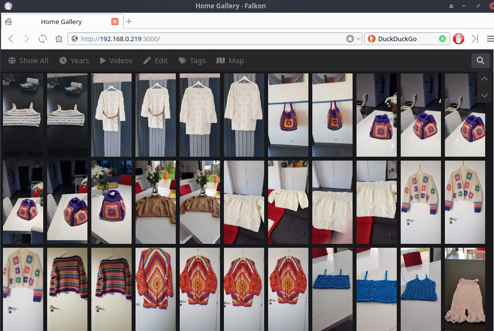

+++
title = 'HomeGallery'
date = 2024-04-27 00:00:00 +0100
categories = application
+++
*Visualisation images sur le web*

## HomeGallery

* [Documentation HomeGallery](https://docs.home-gallery.org)

### KVM debsrv01

* [Lenovo KVM - Serveur virtuel Debian 12 + Jekyll](/posts/Serveur_virtuel_Debian_12_image_nocloud/)

Connexion sur le serveur

    ssh usersso@192.168.0.219 -p 55219 -i /home/yann/.ssh/debsrv01

Exécuter la commande suivante pour installer l'application

```bash
curl -sL https://dl.home-gallery.org/dist/latest/home-gallery-latest-linux-x64 -o gallery
chmod 755 gallery
```

Initialiser le dossier des images `~/sharenfs/photos/Claudine/`

```bash
./gallery run init --source ~/sharenfs/photos/Claudine/
```

Résultat commande ci-dessus

```
[2024-04-27 08:54:33.457]: cli.config.init Initialized configuration '/home/usersso/.config/home-gallery/gallery.config.yml' from /tmp/caxa/home-gallery/1.15.0/home-gallery/gallery.config-example.yml
```

Modifier la configuration `/home/usersso/.config/home-gallery/gallery.config.yml`

```
#
# Server configuration
#
server:
  port: 3000
  host: '192.168.0.219'
```

Lancer le serveur manuellement

```bash
./gallery run server &
```

Patienter quelques minutes au premier lancement

```
[...]
[2024-04-27 09:01:24.746]: database.build Created 0 database entries 50ms
[2024-04-27 09:01:24.768]: database.mergeJournal Read file index journal /home/usersso/.config/home-gallery/Claudine.idx.0427-L9Tx.journal
[2024-04-27 09:01:24.769]: cli.database Database unchanged: Journals contain no changes
[2024-04-27 09:01:24.798]: cli.spawn Run cli with index journal --index /home/usersso/.config/home-gallery/Claudine.idx --journal 0427-L9Tx -r
[2024-04-27 09:01:25.117]: index.journal Remove journal 0427-L9Tx from file index /home/usersso/.config/home-gallery/Claudine.idx
```

### Service systemd HomeGallery

Créer un service pour s’assurer que notre application fonctionne juste après le démarrage du système.

    sudo nano /etc/systemd/system/HomeGallery.service

```
[Unit]
Description=HomeGallery
 
[Service]
Type=simple
User=usersso
ExecStart=/home/usersso/gallery run server
Restart=on-failure
 
[Install]
WantedBy=multi-user.target
```

Le fichier d’unité, le fichier de configuration source ou les drop-ins de HomeGallery.service ont changé sur le disque. Exécutez ‘sudo systemctl daemon-reload’ pour recharger les unités.

```bash
sudo systemctl daemon-reload
sudo systemctl start HomeGallery.service
```

Ouvrir le lien 192.168.0.219:3000 pour vérification  
{:width="400"}

Activer le service

    sudo systemctl enable HomeGallery.service
