+++
title = 'Compléments Firefox et Thunderbird'
date = 2024-05-14 00:00:00 +0100
categories = ['navigateur']
+++
- [Firefox](#firefox)
    - [ERREUR "Échec de la connexion sécurisée"](#erreur-échec-de-la-connexion-sécurisée)
    - [Configuration de base](#configuration-de-base)
    - [Préférences](#préférences)
    - [Modules --> Extensions](#modules----extensions)
    - [Ajout moteur de recherche](#ajout-moteur-de-recherche)
    - [about:config](#aboutconfig)
        - [Désactiver la géolication](#désactiver-la-géolication)
        - [Désactivation lecture auto contenu HTML5](#désactivation-lecture-auto-contenu-html5)
        - [Ne stock rien dans le cache:](#ne-stock-rien-dans-le-cache)
        - [Désactivation du prefetching DNS](#désactivation-du-prefetching-dns)
        - [Désactivation des données hors connexion](#désactivation-des-données-hors-connexion)
        - [Désactivation de Pocket](#désactivation-de-pocket)
        - [Ne pas avertir lors de la fermeture de plusieurs onglets](#ne-pas-avertir-lors-de-la-fermeture-de-plusieurs-onglets)
        - [Désactivation du popup et de l'alerte de connexion non sécurisée](#désactivation-du-popup-et-de-lalerte-de-connexion-non-sécurisée)
        - [Désactivation du préchargement des URL](#désactivation-du-préchargement-des-url)
        - [Retrouver le mode compact de Firefox](#retrouver-le-mode-compact-de-firefox)
        - [Firefox user-agent](#firefox-user-agent)
        - [WebRTC](#webrtc)
        - [Désactiver les suggestions des moteurs de recherche](#désactiver-les-suggestions-des-moteurs-de-recherche)
        - [Autres suggestions](#autres-suggestions)
    - [Firefox - Importer un certificat client](#firefox---importer-un-certificat-client)
    - [Liens](#liens)
- [Thunderbird](#thunderbird)
    - [Modules complémentaires Thunderbird](#modules-complémentaires-thunderbird)
        - [CardBook](#cardbook)
        - [Enigmail](#enigmail)
        - [Lightning](#lightning)
        - [Import/Export filtres de message](#importexport-filtres-de-message)
        - [Firetray](#firetray)
        - [Birdtray (Firetray Alternative)](#birdtray-firetray-alternative)
    - [Contacts](#contacts)
- [Thunderbird 102+](#thunderbird-102)
    - [Erreur (TRYCREATE) Mailbox does not exist](#erreur-trycreate-mailbox-does-not-exist)
    - [Erreur Certificat invalide (port 587)](#erreur-certificat-invalide-port-587)
    - [Erreur certificat imap](#erreur-certificat-imap)
    - [Erreur copie dossier "Envoyés"](#erreur-copie-dossier-envoyés)

## Firefox

### ERREUR "Échec de la connexion sécurisée"

Au **premier appel** sur un lien https vers un site ayant validé OCSP , on a l'erreur suivante  

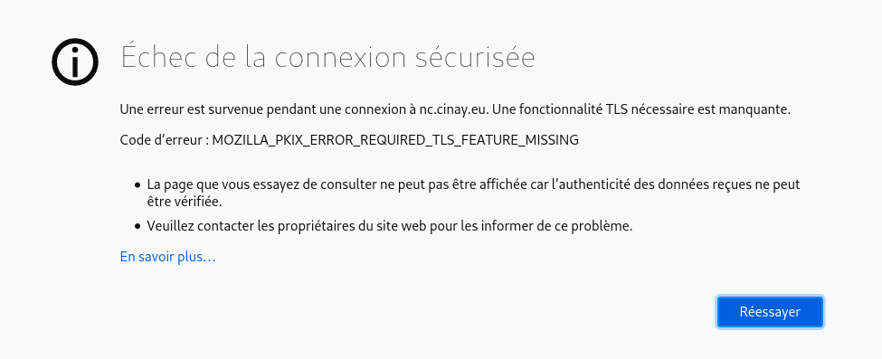{:width="600"}

Au **second appel** avec le même lien , tout est ok !!!  

On peut reproduire le problème en ligne de commande  
Au **premier appel**

    openssl s_client -connect xoyize.xyz:443 -status < /dev/null |grep -i ocsp

```
depth=2 O = Digital Signature Trust Co., CN = DST Root CA X3
verify return:1
depth=1 C = US, O = Let's Encrypt, CN = Let's Encrypt Authority X3
verify return:1
depth=0 CN = xoyize.xyz
verify return:1
DONE
OCSP response: no response sent
```

Au **second appel**

    openssl s_client -connect xoyize.xyz:443 -status < /dev/null |grep -i ocsp

```
depth=2 O = Digital Signature Trust Co., CN = DST Root CA X3
verify return:1
depth=1 C = US, O = Let's Encrypt, CN = Let's Encrypt Authority X3
verify return:1
depth=0 CN = xoyize.xyz
verify return:1
DONE
OCSP response: 
OCSP Response Data:
    OCSP Response Status: successful (0x0)
    Response Type: Basic OCSP Response
```

**Solutions** : 

* A chaque redémarrage de nginx , il faut lancer la commande openssl s_client 2 fois sur chaque domaine !!!
* [Can I make Nginx automatically OCSP staple certificates at reload/restart?](https://serverfault.com/questions/806329/can-i-make-nginx-automatically-ocsp-staple-certificates-at-reload-restart)

### Configuration de base

Si **ecryptfs** est installé , il faut lier le dossier *.mozilla* à Private  


```
# en mode utilisateur
cd $HOME
mv .mozilla $HOME/Private/
ln -s $HOME/Private/.mozilla .mozilla
```

Il faut installer "Adobe Flash Plugin"

	yaourt -S flashplugin

### Préférences

* Au démarrage de firefox : **Afficher une page vide**  
* Moteur de recherche par défaut : **DuckDuckGo**  

Navigation :

    Décocher : Défilement automatique
    Décocher : Défilement doux


**Vie privée et sécurité** : 

* [Configurer Firefox pour optimiser les performances et laisser moins de traces](https://www.kali-linux.fr/configuration/configurer-firefox-optimiser-securite-performances)
* [Protéger sa vie privée sur le web](/files/proteger-sa-vie-privee-sur-le-web-exemple-avec-firefox.epub)

* Formulaires et mots de passe : **NE PAS ENREGISTRER identifiants et mots de passe**
* Protection contre le pistage : **toujours** , Envoyer aux sites web un signal « Ne pas me pister » :**toujours** 
* Protection contre les contenus trompeurs et les logiciels dangereux , **tout valider**

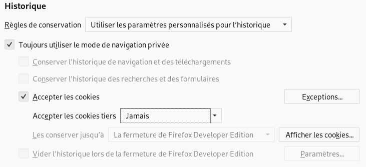{:width="60%"}

### Modules --> Extensions  

* [Les extensions Firefox que j’utilise en cette fin d’année, et probablement pour 2019](https://blog.seboss666.info/2018/12/les-extensions-firefox-que-jutilise-en-cette-fin-dannee-et-probablement-pour-2019/)

[I don't care about cookies](https://addons.mozilla.org/fr/firefox/addon/i-dont-care-about-cookies/)  
*La réglementation de l'UE exige que tout site Web utilisant des cookies de suivi doit obtenir l'autorisation de l'utilisateur avant de les installer. Ces avertissements apparaissent sur la plupart des sites Web jusqu'à ce que le visiteur accepte les termes et conditions du site Web. Imaginez à quel point cela devient irritant lorsque vous naviguez de façon anonyme ou si vous supprimez automatiquement les cookies à chaque fois que vous fermez votre navigateur.*  

*Ce module complémentaire supprimera ces avertissements ennuyeux de cookies de presque tous les sites Web ! Vous pouvez signaler tout site Web qui vous avertit encore des cookies : faites un clic droit et choisissez'Signaler un avertissement de cookie' dans le menu.*

[QookieFix](https://addons.mozilla.org/fr/firefox/addon/qookiefix/)  
*Beaucoup de sites intègrent la solution de consentement de Quantcast mais ne proposent pas de solution simple d'opposition. Cette extension fait juste apparaitre le bouton "Je refuse".*  
*Cette extension simplifie le choix sur les bandeaux cookies Quantcast en faisant apparaitre un bouton « Je refuse » en plus du bouton j’accepte.*
*Cliquer sur « Je refuse » permet de s'opposer à toutes les finalités d’un coup.*

[Flagfox](https://addons.mozilla.org/fr/firefox/addon/flagfox/)  
*Affiche le drapeau du pays où est situé le serveur du site parcouru, et procure de multiples outils : vérification de la sécurité des sites, informations whois, traduction, sites semblables, validation, adresses URL courtes, et d'autres encore...*

[Ghostery](https://addons.mozilla.org/fr/firefox/addon/ghostery/)  
**TrackMeNot** (FACULTATIF ,nécessite un redémarrage firefox)  

[Ublock Origin](https://addons.mozilla.org/fr/firefox/addon/ublock-origin/)  
*bloqueur de requêtes qui se veut léger et performant. Son fonctionnement « avancé » permet d'avoir un résultat similaire à RequestPolicy Continued (voir ci-dessous). Le mode de fonctionnement « normal » est celui habituellement utilisé par les bloqueurs de publicités, à savoir l'utilisation de listes noires. Les listes chargées par défaut sont EasyList, Peter Lowe's Adservers, EasyPrivacy et Malware domains et certaines de ces listes ont pour objet de contrecarrer le pistage. Il permet également d'empêcher les fuites d'adresse IP liées à l'utilisation de WebRTC*

[Cookies autorisation](https://addons.mozilla.org/fr/firefox/addon/i-dont-care-about-cookies/)  
*La réglementation européenne exige que tout site web utilisant des cookies doit obtenir l'autorisation de l'utilisateur avant de les installer. Ces avertissements apparaissent sur la plupart des sites Web jusqu' à ce que le visiteur accepte les termes et conditions du site Web. Imaginez à quel point cela devient irritant lorsque vous surfez anonymement ou si vous supprimez automatiquement les cookies chaque fois que vous fermez le navigateur.*  
*Ce module supprimera ces avertissements de cookies ennuyeux de presque tous les sites Web! Vous pouvez signaler tout site Web qui vous avertit encore des cookies: faites un clic droit et choisissez "Signaler un avertissement de cookie" dans le menu.*

[Lightbeam](https://addons.mozilla.org/fr/firefox/addon/lightbeam/)
*Lightbeam est un module complémentaire pour Firefox vous permettant de voir avec quels sites de première et tierce-partie vous interagissez sur le Web. Il vous montre les relations existant entre ces tierces parties et les sites que vous visitez.*

[Smart Referer](https://addons.mozilla.org/fr/firefox/addon/smart-referer/)  
*Désactiver la transmission du référent par une extension Smart Referer qui n'autorise l'usage du référent que sur le site courant).*

### Ajout moteur de recherche

[Qwant](https://addons.mozilla.org/fr/firefox/addon/qwant/)  

**Ixquick** : Aller sur le lien <https://www.ixquick.fr/fra> et cliquer sur le bouton **Ajouter à Firefox** et il sera dans la liste des moteurs de recherche du navigateur.

Moteur de recherche à supprimer :  
Préférences --> Recherche --> Moteur de recherche  
Décocher Yahoo ,Bing ,Portail Lexical

### about:config

#### Désactiver la géolication

    geo.enabled : false


#### Désactivation lecture auto contenu HTML5

Paramètre avancé ,saisir **about:config** dans la barre d’adresses, valider le fait qu’on fera attention, et chercher la clé **media.autoplay.enabled**  
Par défaut, la valeur est sur **True**, double-cliquez dessus pour la passer à **False** (prise en compte immédiate).

>**ATTENTION!!! Pas de lecture possible des vidéos VIMEO**

#### Ne stock rien dans le cache:

    network.prefetch-next : False

#### Désactivation du prefetching DNS

Hautement recommandé :

    network.dns.disablePrefetch : true

Un bon serveur DNS vous retournera l'information sous 10ms alors pourquoi requêter inutilement et potentiellement vous vendre gratuitement dans le cas d'utilisation de serveur DNS peu regardant sur la vie privée.

#### Désactivation des données hors connexion

Certains sites tels que office365 stockent des données sans notre avis, afin de forcer la demande à l'utilisateur :

    offline-apps.allow_by_default : false

#### Désactivation de Pocket

Facultatif ,si cette fonctionnalité ne vous sert pas :

    extensions.pocket.enabled : false

#### Ne pas avertir lors de la fermeture de plusieurs onglets

Facultatif :

    browser.tabs.warnOnClose : false
    browser.tabs.warnOnCloseOtherTabs : false

#### Désactivation du popup et de l'alerte de connexion non sécurisée

Facultatif :

    security.insecure_field_warning.contextual.enabled : false
    security.insecure_password.ui.enabled : false

#### Désactivation du préchargement des URL

Facultatif :

    browser.urlbar.speculativeConnect.enabled : false

#### Retrouver le mode compact de Firefox

1.    Saisissez **about:config** dans la barre d’adresse de Firefox, puis appuyez sur **Entrée**  
Une page d’avertissement peut apparaître. Cliquez sur **Accepter le risque et poursuivre** pour accéder à la page about:config.
2.    Recherchez la préférence `browser.compactmode.show`
3.    Basculez la préférence à **true** et fermez l’onglet.
4.    Cliquez sur le **bouton de menu** pour ouvrir le panneau de menu.
5.    Cliquez sur Outils supplémentaires
6.    Choisissez **Personnaliser la barre d'outils…**
7.    En bas du panneau, cliquez sur **Densité**
8.    Choisissez **Compacte (non prise en charge)** dans le menu d’options.
9.    Cliquez sur **Terminé** 


#### Firefox user-agent

[Changer l’user-agent dans Firefox](https://lehollandaisvolant.net/?d=2014/01/19/17/30/43-changer-luser-agent-dans-firefox)  
*L’user-agent est une chaîne de caractères que votre navigateur envoie au site que vous visitez, et qui contient diverses informations sur le navigateur et l’ordinateur.*  
Saisir « **about:config** » dans la barre d'adresses de firefox puis taper « **useragent** » dans le champ de recherche.  
Si la clé **general.useragent.override** n’existe pas déjà (auquel cas un double clic dessus suffit), faites un clic-droit sur la page, puis « **nouvelle** » puis « **chaîne de caractères** » et mettez **general.useragent.override** pour le nom.  
Pour la valeur, mettez ce que vous voulez.  
Si vous voulez vous identifier comme <u>Chrome sous Windows 8</u>, mettez :

	Mozilla/5.0 (Windows NT 6.2; Win64; x64) AppleWebKit/537.36 (KHTML, like Gecko) Chrome/32.0.1667.0 Safari/537.36

Pour <u>Firefox Mobile sous Android</u>, mettez :

	Mozilla/5.0 (Android; Mobile; rv:26.0) Gecko/26.0 Firefox/26.0

Pour <u>Opera sous GNU/Linux</u> :

	Opera/9.80 (X11; Linux x86_64; Edition Linux Mint) Presto/2.12.388 Version/12.16

Pour revenir à la valeur par défaut, faites un clic droit sur cette clé et « **réinitialiser** ».

#### WebRTC

Désactiver le WebRTC «Web Real-Time Communication» qui permet le partage vocal, vidéo et P2P via votre navigateur, cette fonctionnalité peut également révéler votre adresse IP réelle via les requêtes STUN du navigateur, même si vous utilisez un service VPN

    media.peerconnection.enabled = false  

#### Désactiver les suggestions des moteurs de recherche 

    browser.search.suggest.enabled : false

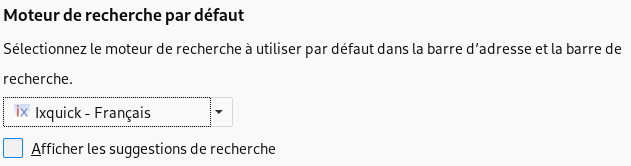

#### Autres suggestions  

**About config**


- browser.cache.disk.enable = false (désactive le cache disk)
- browser.cache.disk.capacity = 0 (interdit le cache disk)
- browser.cache.memory.enable = true (active le cache de la ram, accélère Mozilla)
- browser.cache.memory.capacity ou browser.cache.memory.max_entry_size = 20000 (Ram pour le cache)
- browser.cache.offline.enable = false (Désactive le cache offline)
- browser.cache.offline.capacity = 0 (interdit le cache offline)
- network.http.sendRefererHeader = 0 (n'informe pas le site de vos ancien site visité)
- browser.sessionhistory.max_entries = 5 (Nombre de pages pour revenir en arrière sur le même onglet)
- browser.display.use_document_fonts = 0 (Ne pas utiliser les polices du pays)
- privacy.trackingprotection.enabled  =  true (activer la protection contre le pistage)
- extensions.getAddons.cache.enabled  =  false (ne pas autoriser les add-ons a utiliser le cache)
- network.dns.disableIPv6  =  True  (accélère la connexion)
- browser.tabs.closeWindowWithLastTab  =  false  (Ne pas fermer Firefox à la fermeture du dernier onglet, si vous trouvez cela pratique)
- network.manage-offline-status  =  false  (Empêcher la mise « hors connexion » en cas de coupure réseau)
- browser.urlbar.maxRichResults = 0  (Désactiver la barre intelligente)
- browser.urlbar.matchOnlyTyped = true  (plus là?)
- xpinstall.signatures.required  = False (pour accepter les extensions non signées)
- xpinstall.whitelist.required  =  False (pour ne pas utiliser la liste blanche)
- extensions.legacy.enabled = true (si l'on veut faire fonctionner des anciens add-ons qui n'ont pas encore évolué vers le format WebExtensions)
- privacy.resistFingerprinting = true (rendre Firefox plus résistant aux empreintes digitales des navigateurs)
- privacy.firstparty.isolate = true (isoler les cookies dans le premier domaine de la partie, ce qui empêche le suivi sur plusieurs domaines mais fait aussi beaucoup plus)
- media.navigator.enabled = false (empêchera les sites Web de suivre l'état du microphone et de la caméra de votre appareil)
- webgl.disabled = true (WebGL représente un risque de sécurité potentiel. C'est pourquoi il est préférable de le désactiver, de plus il peut être utilisé pour identifier votre appareil par des empreintes digitales)


**Extensions**

Les Add-ons Firefox pour une navigation sécurisée

Pour bien faire, il y en a 3 qui sont absolument obligatoires, pour votre sécurité et le respect de votre vie privée:

- uBlock Origin  : Bloque les pubs, bloque les malwares et accélère la navigation. Vous pouvez vous rendre ici afin de rajouter des filtres: https://filterlists.com/ 
- HTTPS Everywhere  : active automatiquement le chiffrement HTTPS sur les sites le prenant en charge, même lorsque vous saisissez une URL ou cliquez sur un lien sans préfixe « https: ».
- NoScript  : L'indispensable.  La meilleure sécurité possible pour un navigateur web. Ce module autorise le contenu actif des sites auxquels vous faites confiance et protège des attaques par XSS et détournement de clic, « Spectre », « Meltdown » et d’autres failles JavaScript. Un peu contraignant au début, mais vous vous y ferez vite (pensez à mettre en fiable les sites sûr).

Ceci étant dit, je rajoute aussi, en règle générale:

- Cookies Autodelete  : Efface les cookies a chaque fermeture d'un onglet.
- Clear Flash Cookies  : Efface les cookies LSO, les cookies caché pas connu. (remplace le regretté Better Privacy).
- Files MD5 SHA1 Calculate & Compare  : Qui est utile aussi, pour voir si le fichier que vous avez téléchargé est le bon et s'il est complet.
- Privacy Badger  : Bloque les traceurs invisibles.
- Ghostery  : Ghostery est une puissante extension de protection de la vie privée.
 Bloquez les publicités, déjouez les outils de pistage et accélérez les sites Web.
- Requestblock  : Permet de bloquer les requêtes "cross-site" nécessite Noscript (remplace Request Policy).
- Referer Modifier  : Permet de mentir sur la page d'où nous venons (remplace RefControl).
- Show-my-ip : pour voir son ip (Pratique lorsque l'on a un vpn).

Ensuite en option, vous pouvez aussi rajouter:

- Wot  : Il vous renseigne les sites Web fiables, sur la base de l'expérience de millions d'utilisateurs à travers le monde.
- Lightbeam  : Il permet de voir avec quels sites de première et tierce-partie vous interagissez sur le Web. Il vous montre les relations existant entre ces tierces parties et les sites que vous visitez. Avec protection contre le pistage.
- User Agent Switcher  : Pour faire croire que vous utiliser un autre OS/navigateur ou un autre appareil.
- AnonymoX  : Si vous n'avez pas de VPN, vous avez plusieurs de choix de proxies anonymes.
- Tap Translate  : Si, comme moi, vous êtes pas trop doué avec l'anglais, et les autres langues aussi.
- Decentraleyes  : Protège du pistage lié aux diffuseurs de contenus « gratuits », centralisés (attention peut avoir conflit avec Ghostery).
- French Spelling Dictionary  : Pour se faire corriger ses fautes d'orthographe, afin de participer proprement à notre forum par exemple...

### Firefox - Importer un certificat client

Ouvrir le navigateur firefox   
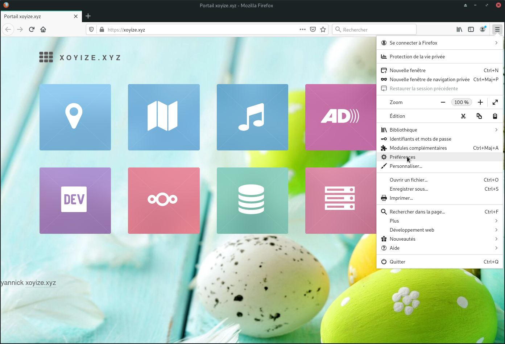{:width="600"}  
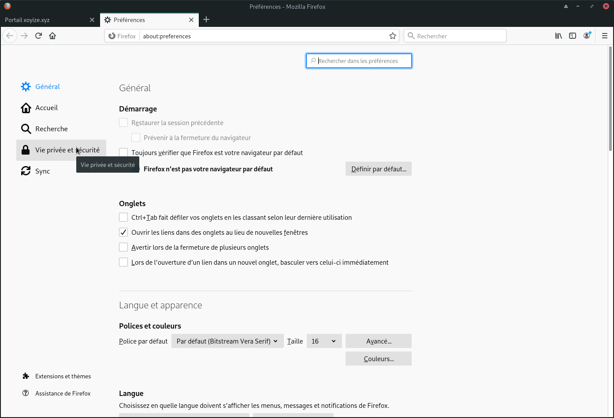{:width="600"}  
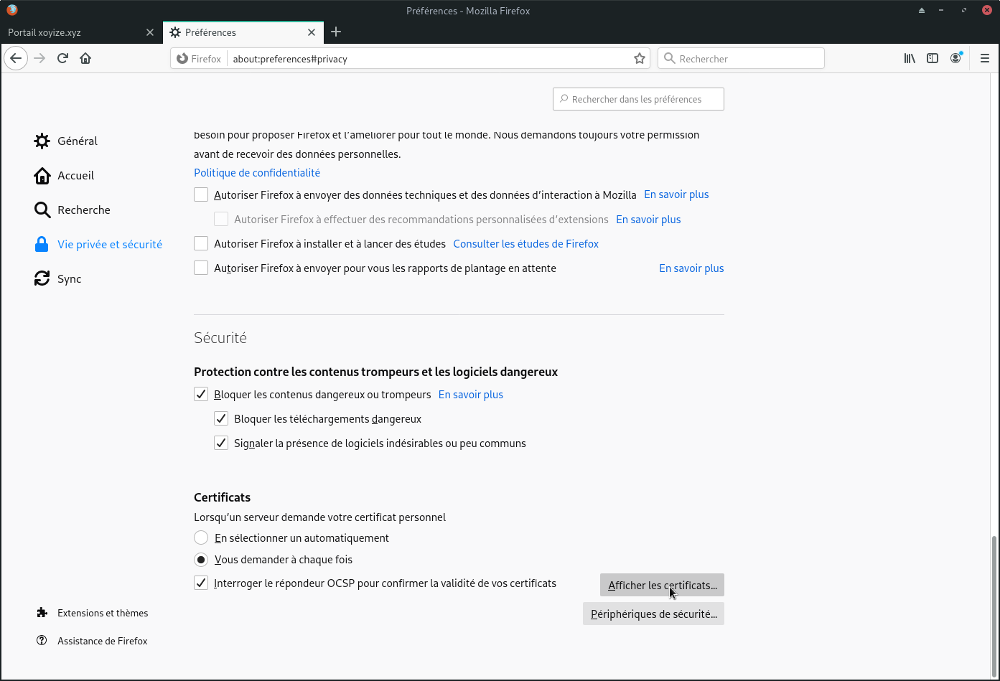{:width="600"}  
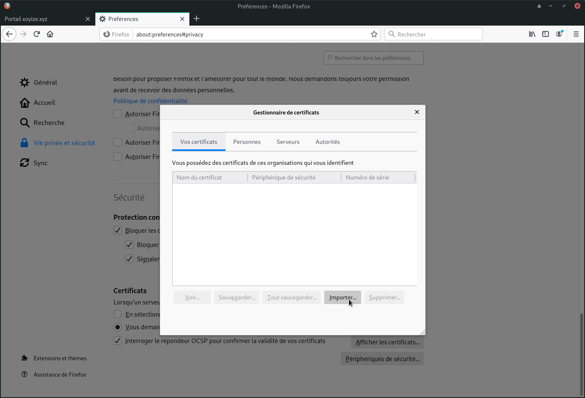{:width="600"}  
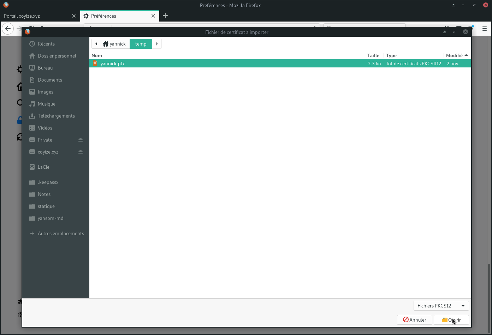{:width="600"}  
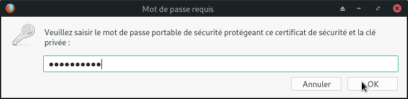{:width="600"}  
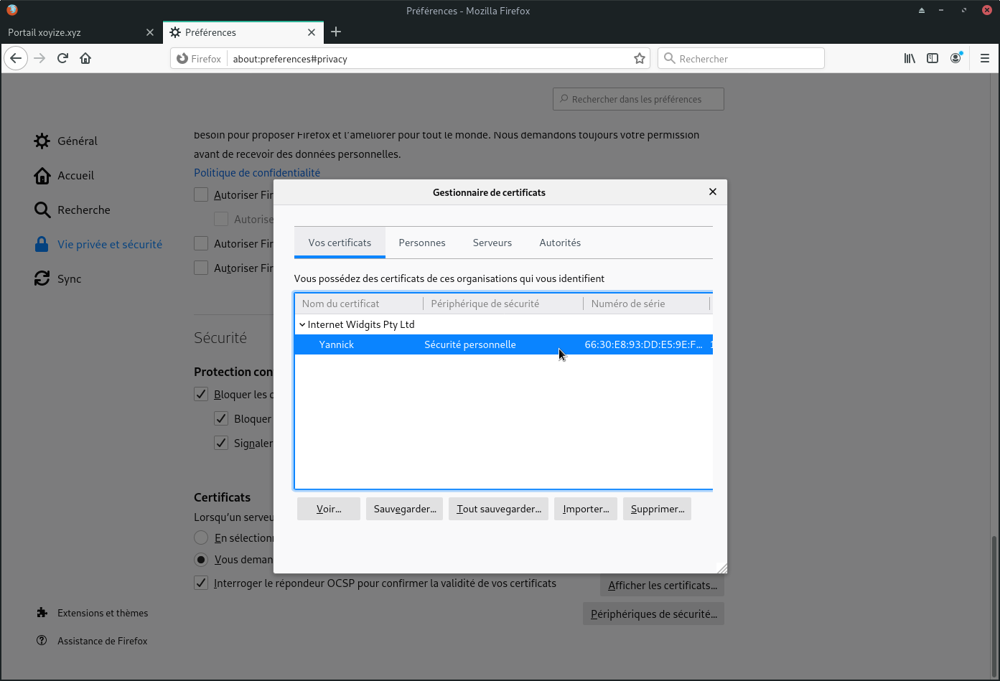{:width="600"}  
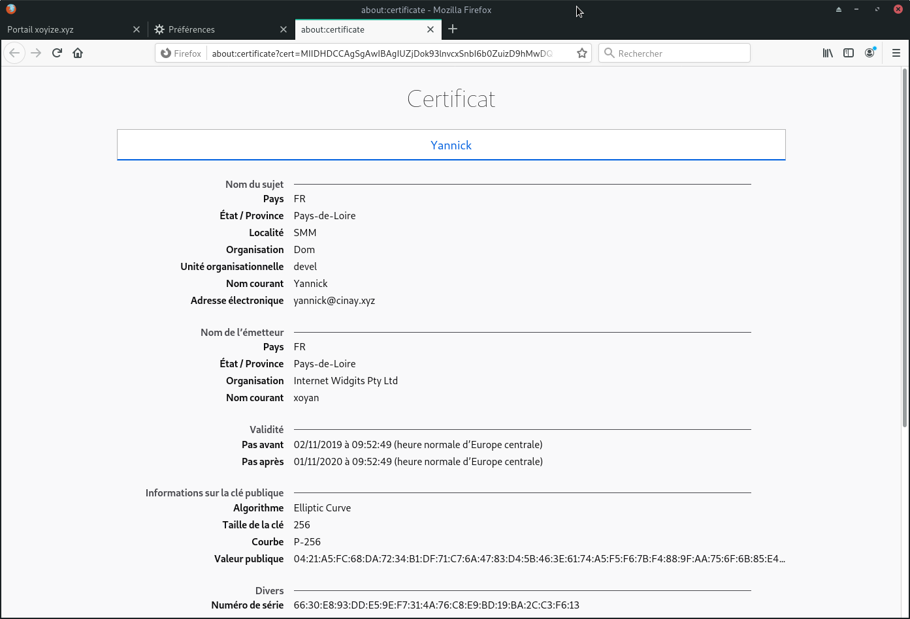{:width="600"}  

Lors de l'ouverture d'un site "sensible" ,le certificat client s'affiche , cliquer sur OK  
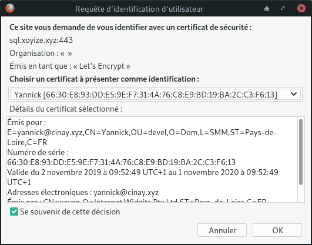{:width="200"}  

Si vous ne souhaitez plus valider le certificat à chaque ouverture  
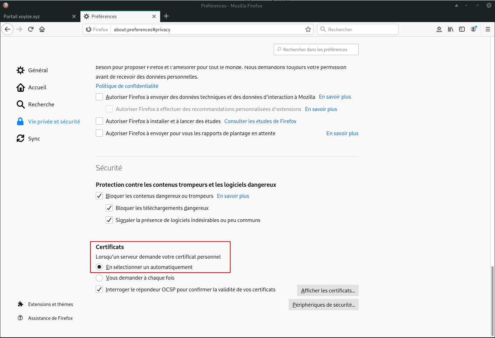{:width="600"}  

### Liens 

* [Ma liste des tweaks « about:config » dans Firefox (Le Hollandais Volant)](https://lehollandaisvolant.net/?d=2020/01/02/11/28/39-ma-liste-des-tweaks-aboutconfig-dans-firefox)

## Thunderbird

>ATTENTION version 60 et + de Thunderbird 

### Modules complémentaires Thunderbird

#### CardBook

[CardBook](https://addons.mozilla.org/fr/thunderbird/addon/cardbook/)  
*Un nouveau carnet d'adresses pour Thunderbird basé sur les standards vCard et CardDAV.*  

#### Enigmail

[Enigmail](https://addons.mozilla.org/fr/thunderbird/addon/enigmail/)  
*Chiffrement et vérification OpenPGP de messages, pour Thunderbird et Seamonkey.*  

#### Lightning

* [Calendar version](https://developer.mozilla.org/en-US/docs/Mozilla/Calendar/Calendar_Versions)
* [Index of /pub/calendar/lightning/candidates/](https://ftp.mozilla.org/pub/calendar/lightning/candidates/)

Lightning en français :

* Thunderbird version >=60  &rarr; lightning version 6.2 &rarr; télécharger : `cd ~/Private && wget https://ftp.mozilla.org/pub/calendar/lightning/candidates/6.2b6-candidates/build1/linux-x86_64/lightning-6.2b6.fr.xpi`  
* Sur Thunderbird, aller sur **Outils &rarr; Modules complémentaires** et cliquer sur la fenêtre déroulante , petite roue (Outils pour tous les modules) &rarr; **Installer un module depuis un fichier**  
* Sélectionner le fichier **lightning-6.2b6.fr.xpi** , *Ouvrir* et *Installer maintenant*  
* *Redémarrer maintenant* pour la prise en charge  

#### Import/Export filtres de message

*Exporter puis importer les filtres des mails sous Thunderbird. Il faut savoir que par défaut, la fonctionnalité n'est pas présente dans Thunderbird, nous allons donc passer par le téléchargement du module [Thunderbird Message Filter Import/Export](https://addons.mozilla.org/fr/thunderbird/addon/tb-import-export-wind-li-port/)*  

Une fois le fichier téléchargé, se rendre dans le Gestionnaire de modules Thunderbird, cliquer sur l'engrenage en haut à  droite puis sélectionner **Installer un module depuis un fichier...**  
Sélectionner le fichier que nous venons de télécharger, celui-ci doit avoir une extension ".xpi" et dans la fenêtre "Installation d'un logiciel" on devra cliquer sur "Thunderbird..." et "Installer Mainetenant" pour valider l'installation.  
Un redémarrage est nécessaire pour la prise encharge du module.

Dans la fenêtre "Filtres de messages" (Menu -> Outils -> Filtres de messages) , un bouton **Exporter** est présent

#### Firetray

*Une extension de la barre d'état système pour Linux et Windows, permettant de configurer des icônes personnalisées, se cacher dans la barre au lieu de la fermer, afficher le nombre de messages non lus dans les applications de messagerie, et d'autres fonctionnalités...*

Les dernières mises à jour : <https://github.com/Ximi1970/FireTray/releases>  
Extension **firetray-0.6.5.xpi** (février 2019)  

**Caractéristiques :**

* pour toutes les applications :
       * afficher/masquer une seule fenêtre ou toutes les fenêtres
       * restaurer l'état, la position et la taille des fenêtres à leur état, leur taille et leur position d'origine
       * restaurer chaque fenêtre sur son bureau/espace de travail virtuel d'origine
       * activer les fenêtres restaurées
       * hide to tray on close
       * hide to tray on minimize
       * Début minimisé dans le plateau
       * afficher l'icône seulement lorsqu'elle est cachée dans la barre d'état système
       * la souris fait défiler sur l'icône de la barre d'état-civil montre/masque
       * icônes thématiques
       * menu déroulant (afficher/masquer les fenêtres individuelles, ouvrir de nouvelles fenêtres, quitter)
       * raccourcis clavier
* pour les applications de courrier :
       * afficher le nombre de messages non lus dans l'icône de la barre d'état système
       * affichage de l'icône biff dans la barre des tâches lorsque de nouveaux messages sont affichés
       * Icône personnalisable dans la barre d'état système pour mail biff
       * inclure/exclure les comptes de messagerie de/vers le nombre de messages
       * inclure/exclure les types de dossiers de/vers le nombre de messages


**Préférences :**

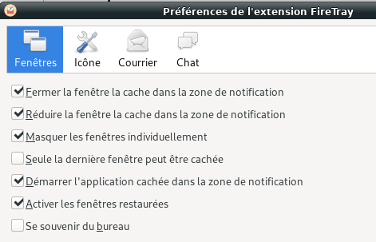{:width="400"}

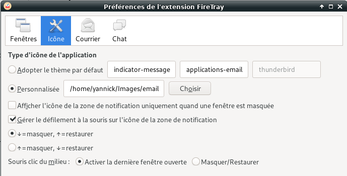{:width="400"}  
icône **email-309491_640.png** {:width="30"}  
[Télécharger icône  "email-309491_640.png"](/files/email-309491_640.png)

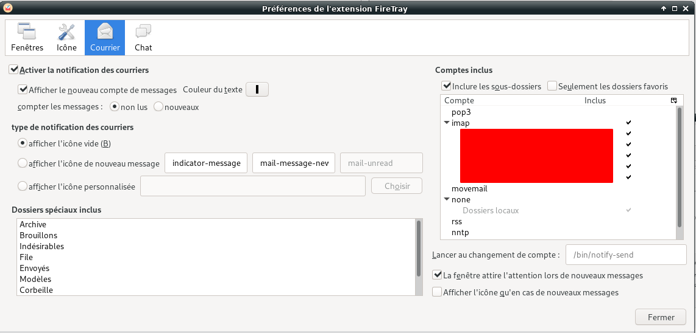{:width="700"}

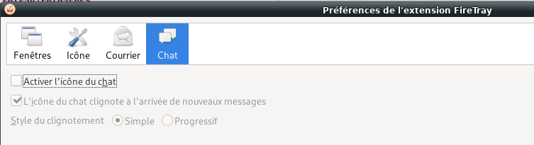{:width="400"}

#### Birdtray (Firetray Alternative)

*icône Thunderbird Tray avec de nouvelles notifications par courrier électronique pour Linux*

Birdtray ajoute une icône de barre d'état système pour le client de messagerie Thunderbird sous Linux (Xorg) ou Windows, qui indique le nombre de courriers électroniques non lus.   
En plus de cela, Birdtray prend en charge la mise en attente des nouvelles notifications par e-mail, configurez les comptes / dossiers de messagerie pour notifier les nouveaux e-mails, etc.

FireTray et d'autres solutions pour ajouter une icône de plateau pour Thunderbird qui affiche un nombre d'e-mails non lus ont cessé de fonctionner avec Thunderbird 60.   
Birdtray vérifie l'état des e-mails non lus directement en lisant la base de données de recherche d'e-mails de Thunderbird, ce qui le rend immunisé contre les modifications de l'API Thunderbird. En conséquence, Birdtray est une excellente alternative à Firetray qui ne devrait pas se casser sur les mises à jour de Thunderbird.

L'outil nécessite Qt5 (5.6 ou supérieur) et est actuellement considéré comme un logiciel alpha - ce n'est plus le cas, Birdtray est maintenant considéré comme stable.

Caractéristiques de Birdtray:

*    Icône de plateau Thunderbird avec compteur de courrier électronique non lu
*    L'icône de la barre d'état peut clignoter (clignoter) lorsque de nouveaux e-mails sont reçus. avec vitesse de clignotement configurable
*    Comptes configurables / dossier de messagerie pour lequel il doit vérifier les nouveaux e-mails
*    Couleurs de police de comptage non lues configurables pour différents comptes de messagerie
*    Peut masquer et restaurer la fenêtre Thunderbird en double-cliquant sur l'icône de la barre d'état ou à partir du menu contextuel de l'icône de la barre d'état
*    Peut démarrer automatiquement Thunderbird lors du lancement de Birdtray et fermer Thunderbird lorsque vous quittez l'icône de la barre d'état
*    Icône de plateau configurable (pour les icônes normales et non lues)
*    Peut détecter si Thunderbird a été accidentellement fermé
*    Répéter les nouvelles notifications par e-mail pendant une durée prédéfinie
*    Permet d'ajouter des modèles d'e-mails préconfigurés dans la barre d'état pour un accès rapide (nouvel onglet E-mail dans Birdtray - nécessite de redémarrer Birdtray après l'ajout de nouveaux e-mails préconfigurés) 


Il convient également de noter que cela peut prendre quelques secondes jusqu'à ce que l'icône de la barre d'état vous avertisse des nouveaux e-mails, car Thunderbird doit mettre à jour la base de données avant que Birdtray ne puisse "voir" qu'un nouvel e-mail est arrivé.


L'onglet des versions de Birdtray GitHub ne contient que des fichiers binaires pour Windows (et source).

Birdtray est disponible dans les référentiels pour les récentes versions de distribution Linux basées sur Debian, y compris Debian Buster et les versions plus récentes, Ubuntu 19.04, 19.10 et 20.04, Linux Mint 19. *, et plus encore. Cependant, il peut y avoir une ou deux versions derrière la dernière version. Vous pouvez l'installer en utilisant:

    sudo apt install birdtray 


Birdtray est également disponible dans le [référentiel Arch User](https://aur.archlinux.org/packages/?O=0&SeB=nd&K=birdtray&outdated=&SB=n&SO=a&PP=50&do_Search=Go) 

    yay -S birdtray # birdtray-git

Et enfin, si vous êtes sous Linux, vous pouvez également [construire Birdtray](https://github.com/gyunaev/birdtray#building) vous-même si vous le souhaitez.

**Comment configurer l'icône de la barre d'état Birdtray Thunderbird**

>Avant de commencer avec Birdtray, assurez-vous que votre adresse e-mail est déjà configurée dans Thunderbird, sinon cela ne fonctionnera pas.

La première chose que vous devrez faire est d'ajouter votre profil Thunderbird dans Birdtray.  
Pour ce faire, lancez **Birdtray** et dans le menu d'icônes de la barre d'état, sélectionnez **Settings** 

>Birdtray prend en charge 2 méthodes d'analyse de vos e-mails pour afficher les notifications par e-mail non lues:

* Utilisation de Mork Parser pour indexer des fichiers.  
Avec Thunderbird 68+, l'analyseur basé sur sqlite ne fonctionne plus, vous devrez donc changer l'option d' **Unread notification parser** de *sqlite* à *mork*  
Pour ce faire, ouvrez **Birdtray**, passez à l'onglet Surveillance et sélectionnez à l' **using Mork index files** sous **Method to parse unread notifications** . Ensuite, cliquez sur **Add** :

Avec Birdtray 1.7.0 et plus récent, vos comptes de messagerie de votre profil ~/.thunderbird devraient être répertoriés, vous permettant de sélectionner ceux pour lesquels vous souhaitez être averti:

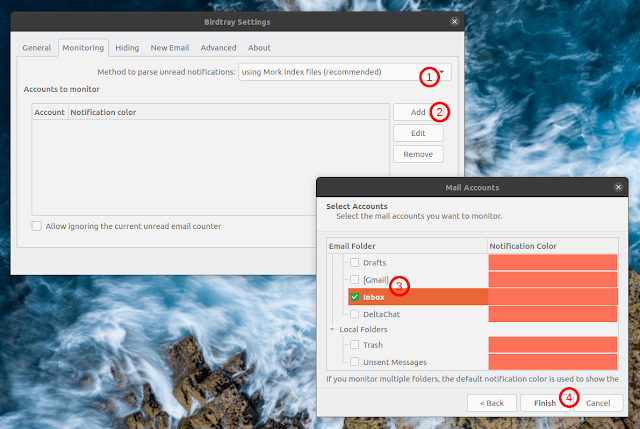{:width="500"}  
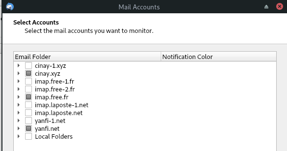{:width="400"}    
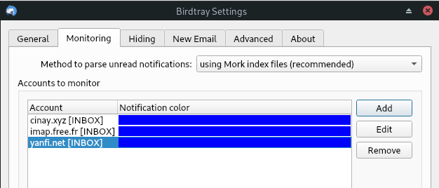{:width="400"}  

C'est tout ce que vous devez faire pour que Birdtray fonctionne. Vous voudrez peut-être modifier certains de ses autres paramètres, selon vos besoins.

Il convient également de noter que par défaut, Birdtray n'est pas configuré pour démarrer automatiquement Thunderbird au démarrage de Birdtray, pour masquer / afficher la fenêtre Thunderbird lorsque vous cliquez sur l'icône de la barre d'état, masquer la fenêtre Thunderbird lorsqu'elle est minimisée, etc. Vous pouvez activer toutes ces options dans les paramètres Birdtray, sous l'onglet Hiding .

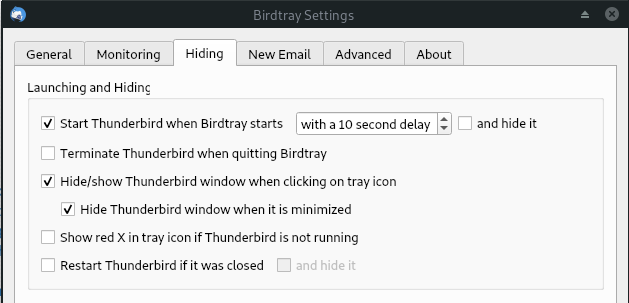{:width="400"}   
Icône : {:width="50"}

### Contacts

A partir de la version 68, de nombreux modules ne sont plus valides notamment cardbook et firetray.

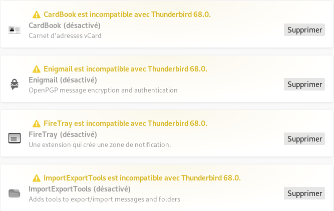{:width="400"}

Remplacement de cardbook , on va installer les modules "tbSync" et "Provider caldav carddav"

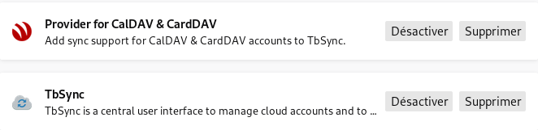{:width="400"}

Paramétrage : Outils &rarr; Préférences des modules &rarr; TbSync

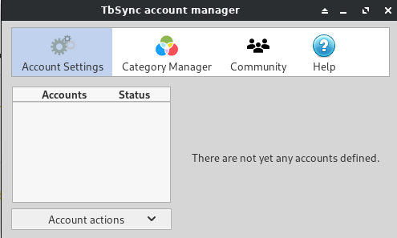{:width="400"}  
Cliquer sur "Account actions"  
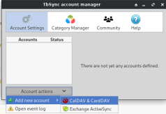  
Sélection "Caldav..."  
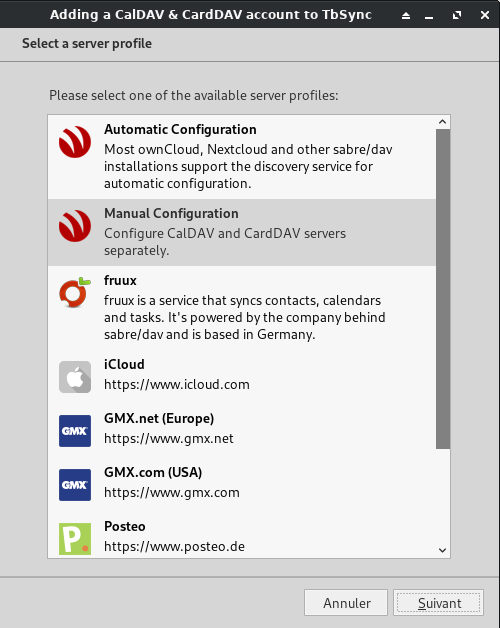{:width="300"}  
Sélection "Manual configuration" et suivant  
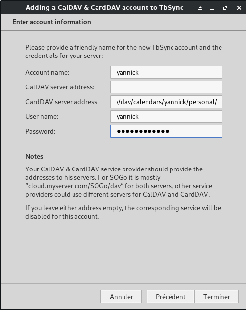{:width="300"}  
Remplir et cliquer sur "Terminer"  
*on n'est pas obligé d'utiliser calendrier (caldav) et contacts (carddav)*

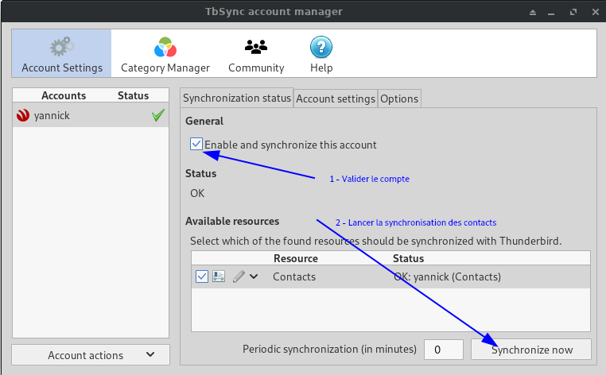{:width="400"}  

Vous avez un nouveau carnet d'adresses

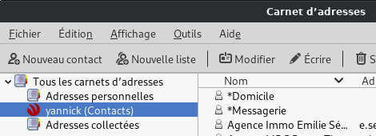{:width="400"}

## Thunderbird 102+

### Erreur (TRYCREATE) Mailbox does not exist

*La commande courante n'a pas abouti. Le serveur de courrier pour le compte XXXXXXX@laposte.net a répondu : (TRYCREATE) Mailbox does not exist.*

Correction 

Je demande à Thunderbird d'envoyer une copie des mails sortants dans le dossier adéquat, idem pour les brouillons.

1. Aller dans les paramètres de votre compte laposte.net dans Thunderbird
- Aller à la rubrique "Copies et dossiers" de votre compte SFR

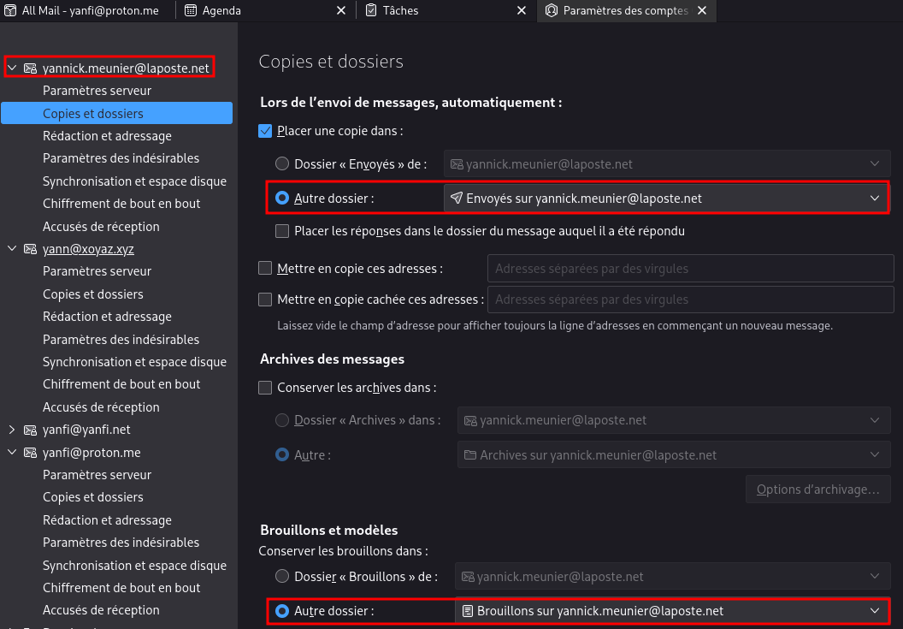


### Erreur Certificat invalide (port 587)

Lors de l'envoi d'un message en utilisant le smtp xoyaz.xyz, j'ai une erreur  
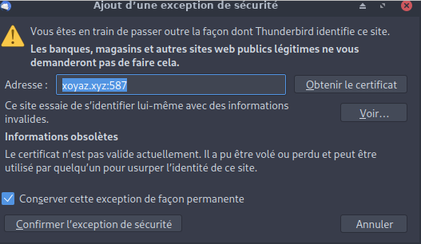

Le certificat SSL est valide  


Par contre il n'est pas valide sur le port 587

    openssl s_client -starttls smtp -showcerts -connect xoyaz.xyz:587 -servername xoyaz.xyz --quiet


Pour la solution, il faut exécuter le commande suivante sur le serveur

    sudo postmap -F hash:/etc/postfix/sni

Vérification

    openssl s_client -starttls smtp -showcerts -connect xoyaz.xyz:587 -servername xoyaz.xyz --quiet

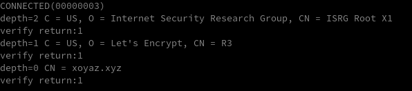


Voir forum yunohost <https://forum.yunohost.org/t/probleme-certificat-sur-serveur-smtp/20883>


### Erreur certificat imap

Lors de la configuration thunderbird j'ai une erreur  
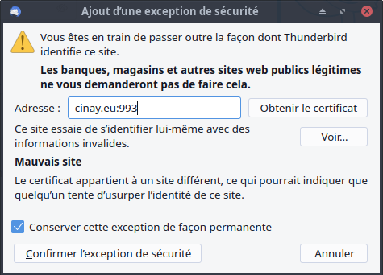

Erreur qui concerne le domaine , il est différent xoyize.xyz au lieu de cinay.eu

    openssl s_client -connect cinay.eu:993 -quiet

```
depth=2 C = US, O = Internet Security Research Group, CN = ISRG Root X1
verify return:1
depth=1 C = US, O = Let's Encrypt, CN = R3
verify return:1
depth=0 CN = xoyize.xyz
verify return:1
* OK [CAPABILITY IMAP4rev1 SASL-IR LOGIN-REFERRALS ID ENABLE IDLE LITERAL+ AUTH=PLAIN AUTH=LOGIN] Dovecot (Debian) ready.
```

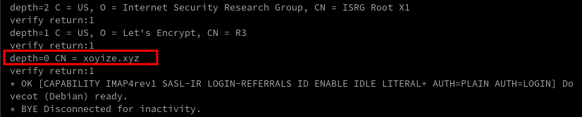

La configuration dovecot est incomplète, le domaine cinay.eu n'y est pas ? (fichier /etc/dovecot/dovecot.conf)

```
ssl = required

ssl_cert = </etc/yunohost/certs/xoyize.xyz/crt.pem
ssl_key = </etc/yunohost/certs/xoyize.xyz/key.pem

```

`ATTENTION Une simple commande peut corriger le problème : yunohost tools regen-conf dovecot --force`{: .prompt-warning }

Il faut ajouter le domaine cinay.eu en local_name, ce qui donne au final

```
ssl = required

ssl_cert = </etc/yunohost/certs/xoyize.xyz/crt.pem
ssl_key = </etc/yunohost/certs/xoyize.xyz/key.pem

local_name cinay.eu {
  ssl_cert = </etc/yunohost/certs/cinay.eu/crt.pem
  ssl_key = </etc/yunohost/certs/cinay.eu/key.pem
}
```

Relancer dovecot

    sudo systemctl restart dovecot

Vérifier

    openssl s_client -connect cinay.eu:993 -quiet

```
depth=2 C = US, O = Internet Security Research Group, CN = ISRG Root X1
verify return:1
depth=1 C = US, O = Let's Encrypt, CN = R3
verify return:1
depth=0 CN = cinay.eu
verify return:1
* OK [CAPABILITY IMAP4rev1 SASL-IR LOGIN-REFERRALS ID ENABLE IDLE LITERAL+ AUTH=PLAIN AUTH=LOGIN] Dovecot (Debian) ready.
```

### Erreur copie dossier "Envoyés"

Le message d'erreur  
`Votre message a été envoyé, mais une copie n’a pas été placée dans votre dossier Envoyés (Envoyés) en raison d’un problème d’accès au réseau ou au fichier.
Vous pouvez recommencer ou enregistrer le message en local dans Dossiers locaux...`{: .prompt-warning }

Aller dans **Paramètres du compte &rarr; Copie et dossiers**  
Placer une copie dans :  &rarr; Autre dossier  
Sélectionner le compte de messagerie  &rarr; Courrier entrant  &rarr; et en fin le dossier "Envoyés" ou "Sent" suivant le compte

