+++
title = 'Alpine Linux dans un environnement virtuel KVM Lenovo'
date = 2024-05-20 00:00:00 +0100
categories = ['virtuel']
+++
*Alpine Linux est une distribution Linux ultra-légère, orientée sécurité et basée sur Musl (en) et BusyBox, principalement conçue pour un « utilisateur intensif qui apprécie la sécurité, la simplicité et l'efficacité des ressources ». Elle utilise les patches PaX et Grsecurity du noyau par défaut et compile tous les binaires de l'espace utilisateur et exécutables indépendants de la position avec protection de destruction de la pile ([Alpine Linux (wikipédia)](https://fr.wikipedia.org/wiki/Alpine_Linux))*

{:width="300"}  


## Alpine Linux

*Création machine virtuelle Alpine  de type KVM avec 2 Go de RAM, 1 cœur de processeur et 8 Go de disque dur.*

* [Création machines virtuelles KVM avec la commande virsh](/posts/Installer_KVM_Kernel_Virtual_Machine_sur_un_serveur/#création-machines-virtuelles-kvm-avec-la-commande-virsh)
* [Accéder aux machines virtuelles KVM via le client VNC](/posts/Installer_KVM_Kernel_Virtual_Machine_sur_un_serveur/#accéder-aux-machines-virtuelles-kvm-via-le-client-vnc)
* [Wiki Alpine Linux](https://wiki.alpinelinux.org/wiki/)

### Créer machine virtuelle AlpineOuest

Création d'une image virtuelle AlpineOuest sous le serveur Lenovo rnmkcy.eu  
On se connecte sur le serveur Lenovo en SSH, puis on exécute la commande suivante pour créer  une machine virtuelle Alpine avec 2 Go de RAM, 1 cœur de processeur et 8 Go de disque dur

```shell
sudo virt-install --os-variant="alpinelinux3.17" \
--name AlpineOuest \
--ram=2048 \
--vcpus=1 \
--cpu host \
--hvm --disk path=/srv/kvm/libvirt/images/alpine-ouest,size=8 \
--cdrom /srv/kvm/libvirt/boot/alpine-standard-3.19.0-x86_64.iso \
--network bridge=br0 \
--graphics vnc  
```

Le serveur Lenovo n'a pas d'affichage, il faut créer un tunnel ssh depuis un poste local

    ssh -L 5900:127.0.0.1:5900 leno@192.168.0.215 -p 55215 -i /home/yann/.ssh/lenovo-ed25519

Puis lancer de ce même poste un client VNC : `localhost:9500` , la console s'affiche   
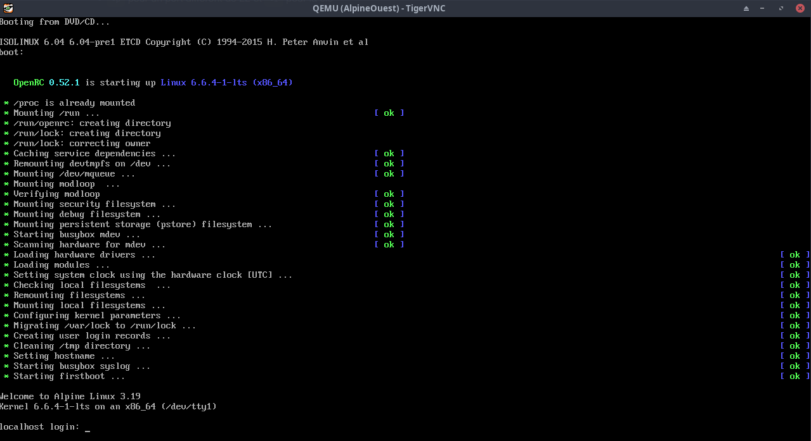  

### Installer et configurer AlpineOuest

* [Alpine tutos](https://www.librebyte.net/en/tag/alpine/)

Une fois l'image ISO lancée, on arrive à un invite de connexion.   
Indiquez `root` comme nom d'utilisateur, aucun mot de passe ne vous sera demandé à cette étape.   
Le système est utilisable, mais on veut l'installer, ce qui passe par la commande suivante (clavier qwerty)

    setup-alpine

Une suite de questions :

* la langue du clavier (fr) keyboard layout (fr)
* le nom que vous voulez donner à la machine sur le réseau (ouestline.xyz)
* interface (eth0) et réseau
* mot de passe root (toor)
* votre fuseau horaire (Europe/paris)
* proxy none
* APK mirror (f)
* User à créer (aluser) et son mot de passe (aluser49)
* ssh key (none)
* ssh server (openssh)
* Disk & Install (vda)
* Utiliser (sys)
* Erase the disk vda (y)

Normalement, vous n'avez rien à faire, les paramètres par défaut doivent convenir. Mais si vous le désirez, vous pouvez les modifier pour utiliser une interface particulière, une IP fixe, un serveur proxy, etc.

Une soixantaine de serveurs mirroir vous seront proposés pour télécharger les paquets. Choisissez un numéro dans la liste ou demandez au système de les tester et de sélectionner le plus rapide. Vous pouvez aussi modifier le fichier des sources. Il vous faudra ensuite choisir votre serveur SSH : OpenSSH, Dropbear ou aucun. 

On termine par la méthode d'installation. Il en existe quatre : 

*    none : le système et ses données sont placés en RAM et seront perdus après le redémarrage
*    sys : le système et ses données sont placés sur un HDD/SSD
*    data : le système est placé en RAM, les données sur un HDD/SSD
*    lvm : utilisation de Logical Volume Manager, les deux choix précédents seront proposés (lvmsys, lvmdata)

Si vous stockez le système en mémoire, il faudra trouver un moyen de sauvegarder la configuration. Vous pourrez le faire uniquement depuis un lecteur de disquettes (!) ou une clé USB. Une fois le système installé, vous pourrez l'utiliser directement s'il est placé en mémoire ou redémarrer si vous avez opté pour un stockage classique.

Il n'est pas conseillé d'utiliser directement le compte root pour les actions du quotidien.  
Si utilisateur non créé dans la procédure d'installation, le créer avec son propre espace dans /home/ 

    adduser aluser

Vous pouvez utiliser l'utilisateur pour vous connecter via SSH (impossible avec le compte root)  
Relever l'adresse ip allouée : `ip a` --> 192.168.0.5  

Sur un poste linux du réseau

    ssh aluser@192.168.0.5

Une fois connecté ,vous pouvez accéder au "root" de manière classique avec la commande :

    su -

Mise à jour

```shell
apk update
apk upgrade 
# Vous pouvez fusionner les deux lignes avec 
apk -U upgrade
```

Editeur nano (Vous pouvez aussi opter pour vi qui est nativement présent sur le système)

    apk add nano

### Réseau

[How to configure static IP address on Alpine Linux](https://www.cyberciti.biz/faq/how-to-configure-static-ip-address-on-alpine-linux/)

#### Activer IPv6

Si vous utilisez IPv6, faites ce qui suit pour activer IPv6 maintenant et à chaque démarrage :

    modprobe ipv6
    echo "ipv6" >> /etc/modules

#### Configurer interface

Configuration de loopback (obligatoire)

Remarque : La configuration loopback doit apparaître en premier dans /etc/network/interfaces pour éviter les problèmes de réseau.
{: .prompt-info }

Pour configurer loopback, ajoutez ce qui suit au fichier `/etc/network/interfaces` 

Contenu de `/etc/network/interfaces`

```
...
auto lo
iface lo inet loopback
```

Ce qui précède fonctionne pour configurer l'adresse IPv4 loopback (127.0.0.1) et l'adresse IPv6 loopback (::1) — si vous avez activé IPv6.
{: .prompt-info }

Le fichier finale de configuration `/etc/network/interfaces`

    /etc/network/interfaces

```shell
auto lo
iface lo inet loopback

auto eth0
iface eth0 inet static
        address 192.168.0.216/24
        gateway 192.168.0.254
        hostname linux-alpine

iface eth0 inet static
        address 2a01:e0a:9c8:2083::1/64
        gateway fe80::8e97:eaff:fe39:66d6
        pre-up echo 0 > /proc/sys/net/ipv6/conf/eth0/accept_ra
```

Fichier de résolution dns

    /etc/resolv.conf

```
nameserver 1.1.1.1
nameserver 192.168.0.254
```

ATTENTION , pour l'adresse ipv6 statique il faut renseigner le NextHop de la box free avec l'adresse inet6  `fe80::5054:ff:fe7c:b46c` de l'interface réseau eth0  
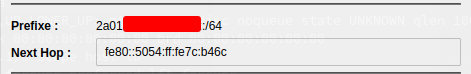  
{: .prompt-warning }

Les modifications apportées à /etc/network/interfaces peuvent être activées en exécutant

```shell
rc-service networking restart  # par défaut
/etc/init.d/networking restart # alternative
service networking restart     # autre alternative
```

### hostname

Vérifier hostname

    hostname

Renvoie `ouestline.xyz`

Si l'on veut changer de hostname 

```shell
echo "linux-alpine" > /etc/hostname
```
Activez immédiatement la modification en exécutant la commande suivante.

```shell
hostname -F /etc/hostname
```

### PHP

[How to install PHP, PHP-FPM in Alpine Linux?](https://www.librebyte.net/en/systems-deployment/how-to-install-php-php-fpm-in-alpine-linux/)

#### Installer php81

Vérifier les dépôts de mon installation `cat /etc/apk/repositories`
Vérifiez que le dépôt communautaire est actif.


Mise à jour

    apk update && apk upgrade

Liste des paquets php

    apk search ph8 | more

```
[...]
php81-8.1.27-r0
php81-fpm-8.1.27-r0
[...]
```

PHP-FPM introduit le concept de pools, chaque pool peut recevoir des connexions sur une socket PTC/IP (IP:Port) ou UNIX, et peut fonctionner sous un utilisateur et un groupe différents. Chaque pool a son fichier de configuration.

Installation

    apk add php81 php81-fpm

Résultat

```
(1/5) Installing php81-common (8.1.27-r0)
(2/5) Installing pcre2 (10.42-r2)
(3/5) Installing libxml2 (2.11.6-r0)
(4/5) Installing php81 (8.1.27-r0)
(5/5) Installing php81-fpm (8.1.27-r0)
Executing busybox-1.36.1-r15.trigger
OK: 438 MiB in 118 packages
```

Une fois le processus terminé, vous pouvez explorer les paramètres par défaut, voici un exemple de la structure du répertoire:

    tree /etc/php81/

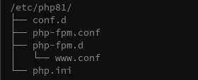{:width="400"}  

Vous pouvez découvrir la valeur de la directive écoute en exécutant la commande

    grep 'listen =' -R /etc/php81/

```
/etc/php81/php-fpm.d/www.conf:listen = 127.0.0.1:9000
/etc/php81/php-fpm.d/www.conf:;pm.status_listen = 127.0.0.1:9001
```

La seconde ligne est commentée, l'écoute se fait sur le port 9000

    listen = 127.0.0.1:9000

Créer un lien symbolique vers la version correspondante

    ln -s /usr/bin/php81 /usr/bin/php

Afficher les versions installées de php

    php -v

```
PHP 8.1.27 (cli) (built: Dec 22 2023 21:16:31) (NTS)
Copyright (c) The PHP Group
Zend Engine v4.1.27, Copyright (c) Zend Technologies
```

#### Gérer le service php-fpm81

Démarrer, arrêter ou redémarrer le service php-fpm8, en utilisant le système d'initialisation OpenRC qui est le système init par défaut dans les distributions comme Gentoo et Alpine Linux.

Vérifier l'état : `rc-service php-fpm81 status`  &rarr; `* status: stopped`  
Démarrer le service : `rc-service php-fpm81 start`

```
 * Caching service dependencies ...                                                               [ ok ]
 * Checking /etc/php81/php-fpm.conf ...
 * /run/php-fpm81: creating directory
 * Starting PHP FastCGI Process Manager ...                                                       [ ok ]
```

Maintenant, vous pouvez vérifier si le service a démarré avec succès: `rc-service php-fpm81 status`  &rarr; `* status: started`  

Lancement automatiquement après un redémarrage du système  

    rc-update add php-fpm81 default

`* service php-fpm81 added to runlevel default`

#### Vérifier et Recharger php-fpm81

Chaque fois que vous modifiez les fichiers de configuration, vérifiez d'abord les modifications avec:

    php-fpm81 -t

`[02-Jan-2024 14:33:00] NOTICE: configuration file /etc/php81/php-fpm.conf test is successful`  
puis rechargez les configurations:

    rc-service php-fpm81 reload

`* Reloading PHP FastCGI Process Manager ...    [ ok ]`

redémarrer et arrêter

    rc-service php-fpm81 restart
    rc-service php-fpm81 stop

### Caddy server

#### Installer et configurer

Installer caddy

    apk update
    apk add caddy

J'ai une erreur , il ne trouve pas le paquet caddy

```
ERROR: unable to select packages:
  caddy (no such package):
    required by: world[caddy]
```

Voir le site : Alpine Linux packages https://pkgs.alpinelinux.org/packages  
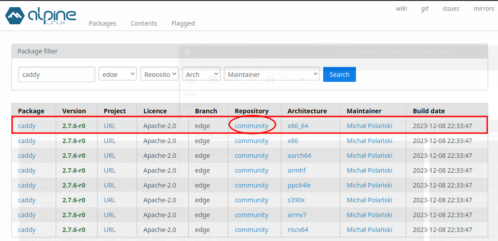  
caddy est dans le dépôt community  

Vérifier les dépôts de mon installation `cat /etc/apk/repositories`

```
#/media/cdrom/apks
http://mirrors.ircam.fr/pub/alpine/v3.19/main
#http://mirrors.ircam.fr/pub/alpine/v3.19/community
```

Il faut décommenter le dépôt community, exécuter `apk update` puis installer caddy `apk add caddy`

**DNS OVH** du domaine et sous-domaines ouestline.xyz pointent sur l'adresse ipv6 `2a01:e0a:9c8:2083::1/64` de la machine alpine  

```
$TTL 3600
@	IN SOA dns111.ovh.net. tech.ovh.net. (2024020607 86400 3600 3600000 300)
        IN NS     ns111.ovh.net.
        IN NS     dns111.ovh.net.
        IN AAAA     2a01:e0a:9c8:2083::1
dev     IN AAAA     2a01:e0a:9c8:2083::1
dice    IN AAAA     2a01:e0a:9c8:2083::1
osm     IN AAAA     2a01:e0a:9c8:2083::1
static  IN AAAA     2a01:e0a:9c8:2083::1
tst     IN AAAA     2a01:e0a:9c8:2083::1
```

Créer une configuration de test dans le fichier `/etc/caddy/Caddyfile`

```
# Caddy's configuration file
# see: https://caddyserver.com/docs/caddyfile
ouestline.xyz

respond "Hello, privacy!"
```

Lancer le service caddy

    service caddy start

```
 * Caching service dependencies ...  [ ok ]
 * Starting Caddy web server ...     [ ok ]
```

Puis tester sur le lien https://ouestline.xyz  
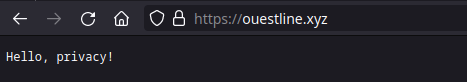  

Tester une autre configuration  
On va créer un fichier `/var/lib/caddy/index/`

``/
<!DOCTYPE/>
/>
<head>
  <title>Hello from Caddy!</title>
</head>
<body>
  <h1 style="font-family: sans-serif">This page is being served via Caddy</h1>
</body>
</>
```

Modifier le fichier de configuration `/etc/caddy/Caddyfile`

```
ouestline.xyz {
	root * /var/lib/caddy
	file_server
}
```

Il s’agit d’une configuration de base de Caddy, qui déclare que le domaine ouestline.xyz de votre serveur doit être servi avec des fichiers provenant de `/var/lib/caddy`

On lance le service : `service caddy start` puis ouvre le lien https://ouestline.xyz  
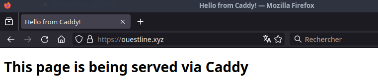{:width="400"}  

Pour un lancement au démarrage de la machine

    rc-update add caddy

#### Prise en charge PHP

*Prérequis, PHP est installé avec php-fpm*

Installer gzip et zstd

    apk add gzip zstd

fichier de configuration `/etc/caddy/Caddyfile`

```
domain.tld {
	root * /chemin/racine
	encode gzip zstd
	php_fastcgi 127.0.0.1:9000
	file_server {
		index index/ index.php;
	}
}
```

Recharger

    caddy fmt --overwrite /etc/caddy/Caddyfile
    service caddy reload

#### Sites HTTPS 

**Sites : ouestline.xyz et sous-domaines static, osm, dice, tst et dev**

Modifier le fichier de configuration `/etc/caddy/Caddyfile`

```
ouestline.xyz {
	root * /mnt/nfs-share/alpine/default
	php_fastcgi 127.0.0.1:9000
	file_server {
		index index/ index.php
	}
}

static.ouestline.xyz {
	root * /mnt/nfs-share/multimedia/Divers/static
	file_server
}

osm.ouestline.xyz {
	root * /mnt/nfs-share/multimedia/Divers/osm-new
	file_server
}

dice.ouestline.xyz {
	root * /mnt/nfs-share/multimedia/Divers/diceware
	file_server
}

tst.ouestline.xyz {
	root * /mnt/nfs-share/alpine/tst
	file_server
}

dev.ouestline.xyz {
	root * /mnt/nfs-share/alpine/dev
	encode gzip zstd
	php_fastcgi 127.0.0.1:9000
	file_server
}
```

Reformater le fichier

    caddy fmt --overwrite /etc/caddy/Caddyfile

Recharger le service caddy

    service caddy reload

### Samba client (INACTIF)

Installer samba client

    apk add samba-client cifs-utils

Créer le dossier de montage

    mkdir /mnt/nfs-share/

Le fichier d'autorisation `/root/.smb-credentials`

```
username=aluser
password=xxxxxxxxxxxxxxx
```

Tester le montage

    mount -t cifs //192.168.0.215/thinkshare /mnt/nfs-share -o rw,credentials=/root/.smb-credentials,uid=aluser,gid=aluser

On a bien les droits utilisateur

```
/home/aluser # ls -la /mnt/nfs-share
total 4
drwxr-xr-x    2 aluser   aluser           0 Dec 19 20:57 .
drwxr-xr-x    3 aluser   aluser        4096 Dec 19 20:56 ..
-rwxr-xr-x    1 aluser   aluser           0 Dec 19 20:57 test.txt
```

Le fichier /etc/fstab

    //192.168.0.215/thinkshare /mnt/sambashare cifs rw,credentials=/root/.smb-credentials,uid=aluser,gid=aluser

Activer le montage

    rc-update add netmount boot

**Désinstaller samba client**  
Supprimer la ligne dans fstab  
Supprimer les paquets : `sudo apk del samba-client cifs-utils`

Désinstaller le mount au boot : `sudo rc-update del netmount boot`

### NFS 

Installer le paquet nfs

    sudo apk add nfs-utils

Démarrage automatique

Exporter les répertoires dans /etc/exports, puis

    rc-update add nfs

Si vous avez besoin de monter un partage nfs à partir du fichier fstab au démarrage du système

    rc-update add nfsmount

ou

    rc-update add netmount

Vous pouvez vérifier les services de démarrage :

rc-status

Démarrez maintenant

    rc-service nfs start

ou si vous avez besoin de monter un partage nfs à partir du fichier fstab maintenant

    rc-service nfsmount start

ou

    rc-service netmount start

**Montage du partage NFS disponible sur le réseau**

Création point de montage

    sudo mkdir -p /mnt/nfs-share

Ajout du partage réseau à fstab

    sudo nano /etc/fstab

Ligne à ajouter

```
192.168.0.215:/ /mnt/nfs-share nfs4 soft,intr,rsize=8192,wsize=8192
```

Lancer le service et vérifier

    sudo rc-service nfsmount start
    ls /mnt/nfs-share/

partage nfs à partir du fichier fstab au démarrage du système

    rc-update add nfsmount

### Parefeu nftables

*Parmi les avantages de nftables sur iptables, il y a moins de duplication de code et plus de débit. nftables est configuré via l'utilitaire espace utilisateur nft, tandis que netfilter est configuré via les utilitaires iptables, ip6tables, arptables et ebtables.* 

On installe le paquet nftables

    apk add nftables

Par défaut les régles **Basic IPv4/IPv6 stateful firewall for server/workstation.** présentes dans le fichier `/etc/nftables.nft` sont chargés  

Modifier le fichier

```shell
#!/usr/sbin/nft -f
# vim: set ts=4 sw=4:
# You can find examples in /usr/share/nftables/.

# Clear all prior state
flush ruleset

# Basic IPv4/IPv6 stateful firewall for server/workstation.
table inet filter {
	chain input {
		type filter hook input priority 0; policy drop;

		iifname lo accept \
		comment "Accept any localhost traffic"

		ct state { established, related } accept \
		comment "Accept traffic originated from us"

		tcp dport http
		tcp dport https

		tcp dport 55216 accept \
		comment "Port SSH 55216"

		ct state invalid drop \
		comment "Drop invalid connections"

		tcp dport 113 reject with icmpx type port-unreachable \
		comment "Reject AUTH to make it fail fast"

		# ICMPv4

		ip protocol icmp icmp type {
			echo-reply,  # type 0
			destination-unreachable,  # type 3
			echo-request,  # type 8
			time-exceeded,  # type 11
			parameter-problem,  # type 12
		} accept \
		comment "Accept ICMP"

		# ICMPv6

		ip6 nexthdr icmpv6 icmpv6 type {
			destination-unreachable,  # type 1
			packet-too-big,  # type 2
			time-exceeded,  # type 3
			parameter-problem,  # type 4
			echo-request,  # type 128
			echo-reply,  # type 129
		} accept \
		comment "Accept basic IPv6 functionality"

		ip6 nexthdr icmpv6 icmpv6 type {
			nd-router-solicit,  # type 133
			nd-router-advert,  # type 134
			nd-neighbor-solicit,  # type 135
			nd-neighbor-advert,  # type 136
		} ip6 hoplimit 255 accept \
		comment "Allow IPv6 SLAAC"

		ip6 nexthdr icmpv6 icmpv6 type {
			mld-listener-query,  # type 130
			mld-listener-report,  # type 131
			mld-listener-reduction,  # type 132
			mld2-listener-report,  # type 143
		} ip6 saddr fe80::/10 accept \
		comment "Allow IPv6 multicast listener discovery on link-local"

		ip6 saddr fe80::/10 udp sport 547 udp dport 546 accept \
		comment "Accept DHCPv6 replies from IPv6 link-local addresses"
	}

	chain forward {
		type filter hook forward priority 0; policy drop;
	}

	chain output {
		type filter hook output priority 0; policy accept;
	}
}

# The state of stateful objects saved on the nftables service stop.
include "/var/lib/nftables/*.nft"

# Rules
include "/etc/nftables.d/*.nft"
```

Relancer nftables

    rc-service nftables restart

Vérifier les configurations : `nft list ruleset`

```
table inet filter {
	chain input {
		type filter hook input priority filter; policy drop;
		iifname "lo" accept comment "Accept any localhost traffic"
		ct state { established, related } accept comment "Accept traffic originated from us"
		tcp dport { 80, 443 } accept
		tcp dport 55216 accept comment "Port SSH 55216"
		ct state invalid drop comment "Drop invalid connections"
		tcp dport 113 reject comment "Reject AUTH to make it fail fast"
		ip protocol icmp icmp type { echo-reply, destination-unreachable, echo-request, time-exceeded, parameter-problem } accept comment "Accept ICMP"
		ip6 nexthdr ipv6-icmp icmpv6 type { destination-unreachable, packet-too-big, time-exceeded, parameter-problem, echo-request, echo-reply } accept comment "Accept basic IPv6 functionality"
		ip6 nexthdr ipv6-icmp ip6 hoplimit 255 icmpv6 type { nd-router-solicit, nd-router-advert, nd-neighbor-solicit, nd-neighbor-advert } accept comment "Allow IPv6 SLAAC"
		ip6 nexthdr ipv6-icmp icmpv6 type { mld-listener-query, mld-listener-report, mld-listener-done, mld2-listener-report } ip6 saddr fe80::/10 accept comment "Allow IPv6 multicast listener discovery on link-local"
		ip6 saddr fe80::/10 udp sport 547 udp dport 546 accept comment "Accept DHCPv6 replies from IPv6 link-local addresses"
	}

	chain forward {
		type filter hook forward priority filter; policy drop;
	}

	chain output {
		type filter hook output priority filter; policy accept;
	}
}
```

nftables exécution et chargement des configurations lorsque le système démarre.

    rc-update add nftables 

`* service nftables added to runlevel default`

### Accès administration via sudo

Installer sudo

```shell
apk update
apk add sudo
```

Ensuite, créons un nouvel utilisateur dans Alpine Linux et accordons des privilèges de sudo à l'utilisateur nouvellement créé.

**Créer un utilisateur de sudo** 

Pour créer un nouvel utilisateur dans Alpine Linux, nous utilisons la commande adduser

    adduser admi

Création du nouvel utilisateur nommé "admi".

Saisissez le mot de passe deux fois pour le nouvel utilisateur et remplissez la création de l'utilisateur.

```
Changing password for admi
New password: 
Retype password: 
passwd: password for admi changed by root
```

Nous venons de créer un nouvel utilisateur normal. L'utilisateur n'a pas encore de droits administratifs.

Vous pouvez vérifier si un utilisateur a des privilèges de sudo ou non dans Alpine Linux en utilisant la commande

    sudo -lU admi

Sortie :

```
User admi is not allowed to run sudo on ouestline.
```

Ajoutons le nouvel utilisateur à la liste des sudoers, afin qu'il puisse effectuer des opérations administratives

**Accorder des privilèges de sudo aux utilisateurs**

Nous pouvons le faire de deux façons.

<u>Méthode 1</u>

Pour attribuer des permissions de sudo à un utilisateur dans Alpine Linux, il suffit de l'ajouter au groupe **wheel** qui est un groupe spécial dans certains systèmes d'exploitation comme Unix. Tous les membres du groupe **wheel** peuvent effectuer des tâches administratives. Le groupe **wheel** est similaire au groupe de sudo dans les systèmes basés sur Debian.

Exécutez la commande suivante pour permettre aux membres du groupe **wheel** d'exécuter n'importe quelle commande

    echo '%wheel ALL=(ALL) ALL' > /etc/sudoers.d/wheel

Puis ajouter l'utilisateur "admi" au groupe wheel

    adduser admi wheel

Nous avons ajouté l'utilisateur admi à la liste des sudoers. 
Vérifiez si l'utilisateur a accès au sudo

    sudo -lU admi

<u>Méthode 2</u>

Une autre façon d'attribuer les permissions de sudo à un utilisateur est de l'ajouter directement dans le fichier de configuration `/etc/sudoers` 

Pour donner des permissions de sudo à l'utilisateur "admi", modifier le fichier "/etc/sudoers" :

    visudo

Ajouter la ligne suivante:

    admi ALL=(ALL) ALL

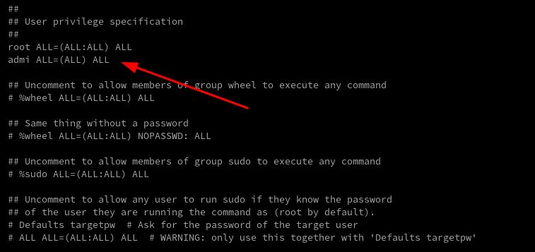  
Editeur vi &rarr; ESC puis `:wq`

Pour donner des permissions de sudo à l'utilisateur "admi", sans saisie mot de passe

    admi ALL=(ALL) NOPASSWD: ALL

**Vérifiez si un utilisateur a accès au sudo**

Pour vérifier si un utilisateur a des droits sudo dans Alpine Linux, exécutez cette commande :

    sudo -lU admi

Sortie :

```
User admi may run the following commands on ouestline:
    (ALL) ALL
```

Comme vous pouvez le voir, l'utilisateur "admi" peut exécuter toutes les commandes

Passons au nouvel utilisateur de sudo et vérifions s'il peut exécuter des tâches de sudo.  
Pour passer au nouvel utilisateur, c'est-à-dire admi dans notre cas, exécutez :

    su - admi

Exécutez toute opération de sudo pour vérifier si l'utilisateur a vraiment des permissions de sudo.

    sudo apk update

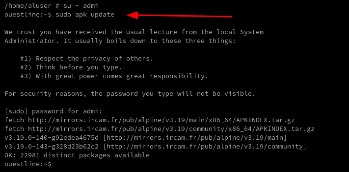  

Oui, l'utilisateur fait partie du groupe des utilisateurs administratifs.

**Supprimer les privilèges sudo à un utilisateur**

Pour révoquer les autorisations de sudo d'un utilisateur dans Alpine Linux, il suffit de le supprimer du groupe wheel en utilisant la commande `gpasswd`. La commande `gpasswd` n'est pas disponible dans l'image de base alpine. Vous devez installer le paquet `shadow` afin d'obtenir la commande `gpasswd`.

Pour installer le paquet shadow dans Alpine Linux, exécutez la commande suivante en tant qu'utilisateur root :

    apk add shadow

Maintenant, vous pouvez supprimer les privilèges de sudo d'un utilisateur, par exemple ostechnix, en utilisant la commande:

    gpasswd -d admi wheel

Sortie :

```
Removing user admi from group wheel
```

L'utilisateur admi a été retiré du groupe de roues. Vous pouvez le vérifier 

    sudo -lU admi

L'utilisateur admi est maintenant devenu un utilisateur régulier. Il ne peut plus effectuer d'opérations de sudo.

Si vous ne voulez plus de cet utilisateur, retirez-le entièrement du système en utilisant cette commande 

    userdel -r admi

Ici, le drapeau `-r` est utilisé pour supprimer le répertoire `$HOME` de l'utilisateur.

### OpenSSH avec clés

*Connexion ssh sur un autre port avec un jeu de clés*

Générer une paire de clé sur l'ordinateur de bureau PC1  
Générer une paire de clé curve25519-sha256 (ECDH avec Curve25519 et SHA2) pour une liaison SSH avec le serveur.

    ssh-keygen -t ed25519 -o -a 100 -f ~/.ssh/alpine-vm

Copier la clé publique `alpine-vm.pub` dans le presse-papier

On se connecte sur la machine virtuelle alpine linux

    ssh aluser@192.168.0.216

Créer le répertoire et ouvrir nouveau fichier

    mkdir -p $HOME/.ssh/
    nano $HOME/.ssh/authorized_keys

Coller le contenu du presse-papier , sauver le fichier et sortir

Passer en mode su

Modifier la configuration serveur SSH

    nano /etc/ssh/sshd_config

Modifier

```
Port = 55216
PasswordAuthentication no
```

Relancer le serveur

    service sshd restart

Modifier /etc/motd

```
    _    _        _              ___                  _      
   /_\  | | _ __ (_) _ _   ___  / _ \  _  _  ___  ___| |_    
  / _ \ | || '_ \| || ' \ / -_)| (_) || || |/ -_)(_-<|  _|   
 /_/ \_\|_|| .__/|_||_||_|\___| \___/  \_,_|\___|/__/ \__|   
           |_|        _    _  _                              
  ___  _  _  ___  ___| |_ | |(_) _ _   ___    __ __ _  _  ___
 / _ \| || |/ -_)(_-<|  _|| || || ' \ / -_) _ \ \ /| || ||_ /
 \___/ \_,_|\___|/__/ \__||_||_||_||_|\___|(_)/_\_\ \_, |/__|
  _  ___  ___     _   __  ___     __     ___  _   __|__/     
 / |/ _ \|_  )   / | / / ( _ )   /  \   |_  )/ | / /         
 | |\_, / / /  _ | |/ _ \/ _ \ _| () |_  / / | |/ _ \        
 |_| /_/ /___|(_)|_|\___/\___/(_)\__/(_)/___||_|\___/ 
```

Test connexion

    ssh -p 55216 -i ~/.ssh/alpine-vm aluser@192.168.0.216


## Utilitaires 

### iproute2

Vous pouvez souhaiter installer le paquet 'iproute2' (à noter que cela installera également iptables si ce n'est pas encore installé)

    sudo apk ajouter iproute2

Cela fournit la commande 'ss' qui est IMHO une version 'meilleure' de netstat.

Afficher les ports tcp d'écoute 

    ss -tl

```
State       Recv-Q      Send-Q           Local Address:Port            Peer Address:Port      Process      
LISTEN      0           0                      0.0.0.0:55216                0.0.0.0:*                      
LISTEN      0           0                    127.0.0.1:2019                 0.0.0.0:*                      
LISTEN      0           0                    127.0.0.1:9000                 0.0.0.0:*                      
LISTEN      0           0                            *:55216                      *:*                      
LISTEN      0           0                            *:https                      *:*                      
LISTEN      0           0                            *:http                       *:*                      
```

Afficher les ports d'écoute tcp et les processus associés:

    ss -ptl

Afficher l'écoute et les connexions tcp établies :

    ss -ta

```
State      Recv-Q     Send-Q         Local Address:Port           Peer Address:Port            Process     
LISTEN     0          0                    0.0.0.0:55216               0.0.0.0:*                           
LISTEN     0          0                  127.0.0.1:2019                0.0.0.0:*                           
LISTEN     0          0                  127.0.0.1:9000                0.0.0.0:*                           
ESTAB      0          0              192.168.0.216:55216          192.168.0.39:60300                       
ESTAB      0          0              192.168.0.216:56326         192.168.0.215:microsoft-ds                
LISTEN     0          0                          *:55216                     *:*                           
LISTEN     0          0                          *:https                     *:*                           
LISTEN     0          0                          *:http                      *:*                           
```

Afficher le résumé d'utilisation de la socket :

    ss -s

```
Total: 17
TCP:   8 (estab 2, closed 0, orphaned 0, timewait 0)

Transport Total     IP        IPv6
RAW	  0         0         0        
UDP	  1         0         1        
TCP	  8         5         3        
INET	  9         5         4        
FRAG	  0         0         0        
```

Afficher plus d'options :

    ss -h

### drill

Vous pouvez également vouloir installer 'drill' (il installera également le paquet 'ldns') qui est un remplacement supérieur (IMHO) pour nslookup et dig etc 

    sudo apk add drill

Alors utilisez-le comme vous le feriez avec dig

    drill @8.8.8.8 alpinlinux.org

Pour effectuer une recherche inversée (obtenir un nom depuis une IP) utilisez la syntaxe suivante :

    drill @208.67.222.222 -x 8.8.8.8

### postfix

*Envoyer des messages en ligne de commande depuis le serveur alpine linux*

Installation postfix et mailx

    sudo apk add postfix
    sudo apk add mailx

Ajouter les lignes suivantes au fichier de configuration `/etc/postfix/main.cf`

```
myhostname = ouestline.xyz
mydomain = ouestline.xyz
myorigin = $mydomain
mydestination = $myhostname, localhost.$mydomain, localhost, $mydomain,
inet_interfaces = loopback-only
```

Recharger postfix

    sudo service postfix restart 

Envoyer un message

    echo "Test envoi via postfix smtp" | mail -s "serveur alpine linux" yack@cinay.eu

Sur la boîte de réception  
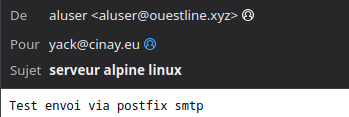

### chroot

*On veut modifier l'interface réseau de la Machine virtuelle AlpineOuest*

Il faut arrêter la machine virtuelle AlpineOuest pour la faire redémarrer sur une image ISO  
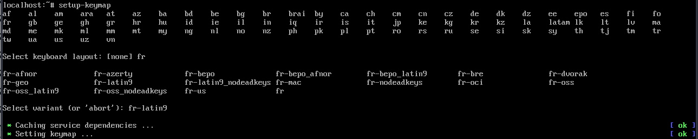


Booter sur une image ISO Alpine Linux

Passer le clavier en fr (qwerty de base)  
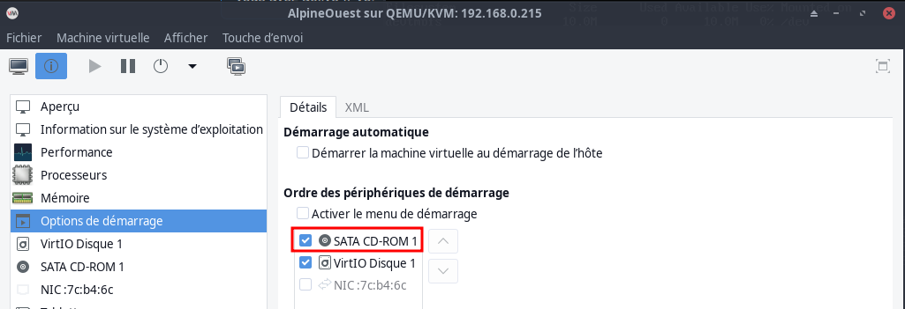  
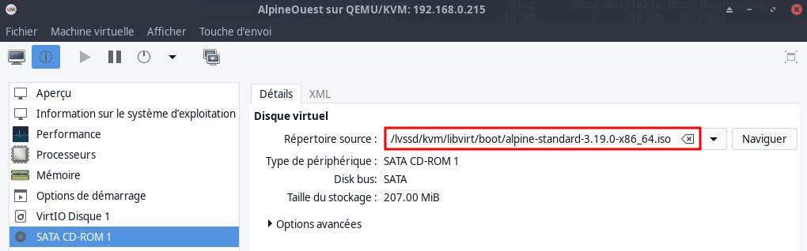  

Montage de la partion à chrooter /dev/vda3

```bash
mount /dev/vda3 /mnt
```

Passage en chroot

```bash
chroot /mnt /bin/ash
```

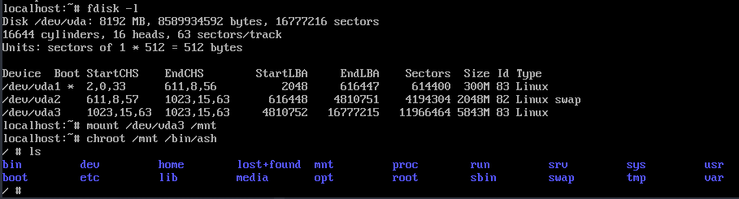

Modifier l'adresse  
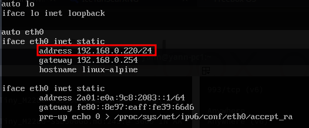

Sortie chroot et arrêt

```bash
exit
poweroff
```

Modifier l'ordre de démarrage et désactiver le cd-rom  
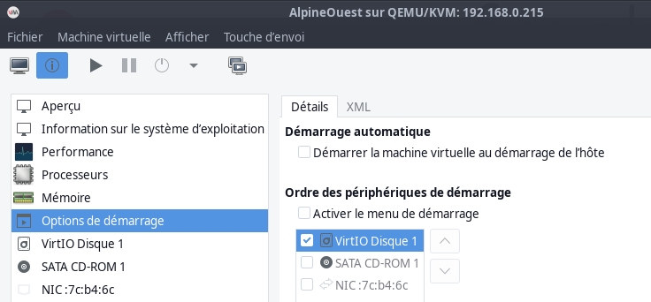

