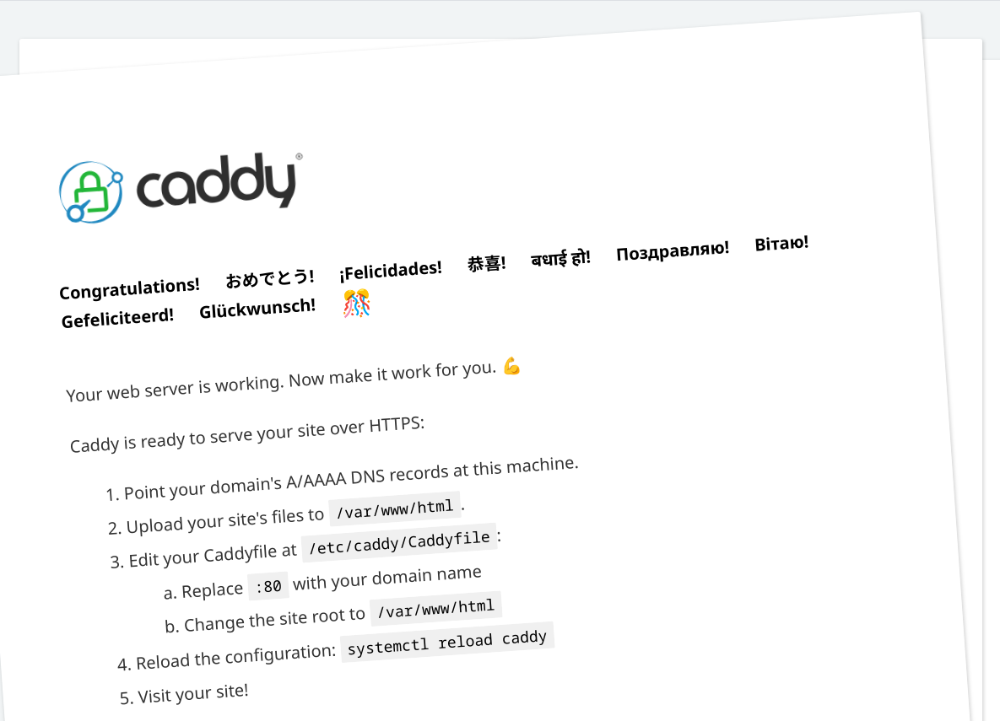
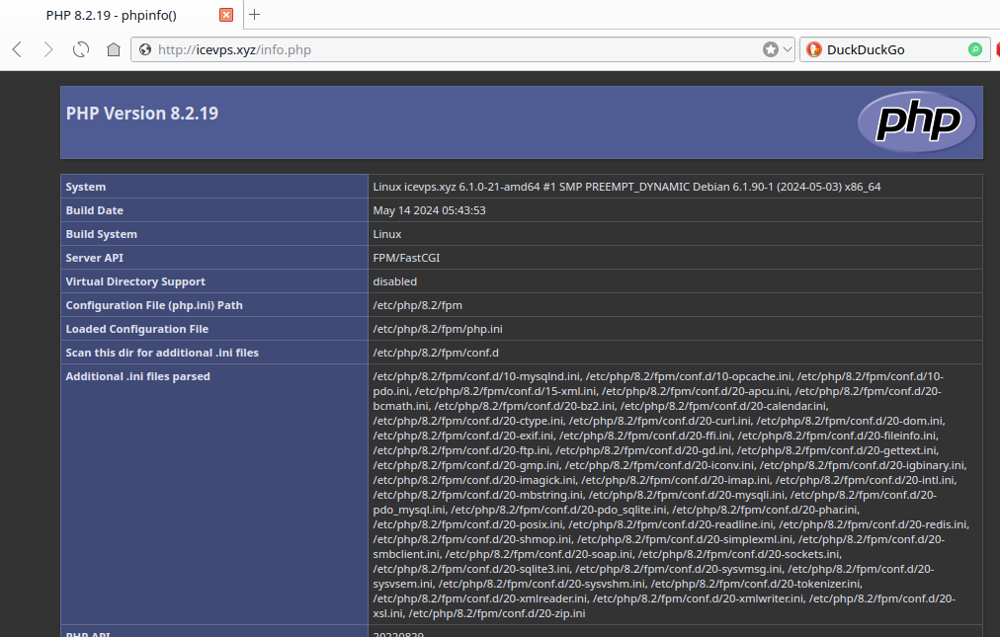

+++
title = 'Caddy serveur + PHP sur Debian 12 bookworm'
date = 2025-08-11
categories = serveur
+++
*[Caddy](https://caddyserver.com/) est un serveur Web open source écrit en Go. Il est connu pour sa simplicité et sa facilité d'utilisation, et il est particulièrement célèbre pour sa prise en charge automatique du HTTPS.*  

{:width="100" .normal}

*    Caddy prend en charge le HTTPS automatique, c'est-à-dire qu'il va obtenir un certificat TLS automatiquement pour votre site Web. Ce certificat TLS valide est obtenu auprès de Let's Encrypt et sera renouvelé automatiquement. Possibilité d'avoir du HTTPS sur localhost également, grâce à une autorité de certification locale. C'est un gros point positif pour ce serveur Web.
*    Son fichier de configuration Caddyfile peut-être rédigé en mode déclaratif ou au format JSON. ll y a ce que Caddy appelle des "Config Adapter" permettant la prise en charge de différents formats : [une configuration rédigée au format Nginx sera interprétée par Caddy](https://github.com/caddyserver/nginx-adapter).
*    Son API native sert à gérer la configuration du serveur web.
*    Caddy est rapide à installer et à configurer pour publier un simple site web.
*    Caddy peut gérer plusieurs sites web, avec un système de "virtual hosts" par nom de domaine et port.
*    Caddy peut jouer le rôle de reverse proxy.


## Caddy Debian 

*Installer et configurer le serveur Web Caddy sur Debian 12 Bookworm . Caddy est un serveur Web simple et sécurisé doté de fonctionnalités étonnantes utiles pour l'hébergement de sites Web. L'une des fonctionnalités étonnantes est qu'il peut obtenir et gérer automatiquement les certificats TLS de Let's Encrypt pour activer HTTPS et inclut la prise en charge de HTTP/2.*

### Installez les clés requises et le transport HTTPS

Les packages `debian-keyring` et `debian-archive-keyring` contiennent les clés d'archive de l'archive Debian, garantissant l'authenticité des packages téléchargés à partir des référentiels Debian. Le package `apt-transport-https` permet au gestionnaire de packages APT de récupérer des packages via HTTPS, garantissant une communication sécurisée.

```bash
sudo apt update
sudo apt install -y debian-keyring debian-archive-keyring apt-transport-https curl
```

Ces commandes rafraîchiront la liste des paquets et installeront les outils nécessaires pour ajouter le dépôt Caddy et gérer les connexions HTTPS.

### Installation de Caddy sur Debian 12.

Ensuite, nous ajouterons le dépôt officiel de Caddy à notre système. Cela garantit que nous avons accès à la dernière version de Caddy et peut facilement la mettre à jour à l'avenir. Suivez ces étapes :

```bash
curl -1sLf 'https://dl.cloudsmith.io/public/caddy/stable/gpg.key' | sudo gpg --dearmor -o /usr/share/keyrings/caddy-stable-archive-keyring.gpg
curl -1sLf 'https://dl.cloudsmith.io/public/caddy/stable/debian.deb.txt' | sudo tee /etc/apt/sources.list.d/caddy-stable.list
```

*    `curl -1sLf`: télécharge les données à partir d'une URL.
*     Les indicateurs `-1sLf` garantissent que l'opération suit les redirections ( L), échoue silencieusement en cas d'erreurs du serveur ( f) et utilise des connexions sécurisées ( 1s).
*    URL `'https://dl.cloudsmith.io/public/caddy/stable/gpg.key'`: Il s'agit de l'adresse où se trouve la clé GPG du référentiel Caddy.
*    `|` : redirige la clé téléchargée vers la commande suivante.

Mettre à jour l'index des paquets pour reconnaître le nouveau dépôt :

```bash
sudo apt update
```

**Installez Caddy**

Avec le dépôt ajouté, nous pouvons maintenant installer Caddy en utilisant le gestionnaire de paquets APT. Exécutez la commande suivante :


```bash
sudo apt install caddy
```

Cela installera le serveur Web Caddy sur votre système.


Pour vérifier si Caddy est correctement installé, vous pouvez exécuter : `caddy version`

```
v2.10.0 h1:fonubSaQKF1YANl8TXqGcn4IbIRUDdfAkpcsfI/vX5U=
```

L'installation de Caddy Web Server est maintenant terminée. Vous avez téléchargé et installé Caddy avec succès, et il est prêt à être configuré pour l'hébergement de sites Web.

Vérifier que le serveur Web Caddy est actif et fonctionne sur Debian 12 

    systemctl status caddy

```
● caddy.service - Caddy
     Loaded: loaded (/lib/systemd/system/caddy.service; enabled; preset: enabled)
     Active: active (running) since Mon 2025-08-11 13:33:02 UTC; 54s ago
       Docs: https://caddyserver.com/docs/
   Main PID: 3036 (caddy)
      Tasks: 7 (limit: 687)
     Memory: 12.8M
        CPU: 136ms
     CGroup: /system.slice/caddy.service
             └─3036 /usr/bin/caddy run --environ --config /etc/caddy/Caddyfile
```

Nous devons pouvoir accéder à la page par défaut de Caddy. Suite à l'installation, il est actif sur le port 80 en HTTP.

`http://<adresse IP du serveur>`  
`http://<Nom de domaine>`  

Voici la page obtenue :  
{: .normal}

### Configurer Caddy.

Caddy utilise un fichier de configuration appelé Caddyfile pour définir comment il doit servir votre site Web. Laissez créer un fichier Caddyfile de base pour servir un site statique:

```shell
sudo mkdir /var/www/example.com
```

Créer un fichier index.html dans le répertoire :

```shell
echo "Hello, World!" | sudo tee /var/www/example.com/index.html
```

Ouvrez un nouveau fichier Caddy en utilisant un éditeur de texte (p. ex. nano):

```shell
sudo nano /etc/caddy/Caddyfile
```

Ajouter le contenu suivant au panier:

```
example.com {
    root * /var/www/example.com
    file_server
}
```

Enregistrer le fichier et démarrer Caddy:

```shell
sudo systemctl start caddy
```

Testez votre configuration en accédant à http://exemple.com dans votre navigateur Web. Vous devriez voir le message “Hello, World!”.


## Autoriser les connexions HTTP et HTTPS dans le pare-feu UFW

Pour permettre à Caddy de servir des sites Web à l'aide des protocoles HTTP et HTTPS , vous devez accorder l'accès aux ports 80 et 443. Exécutez les commandes suivantes pour autoriser les ports requis dans le pare-feu UFW

```bash
sudo ufw allow proto tcp from any to any port 80,443
```

## Configurer PHP pour le serveur Web Caddy

### Ajouter le dépôt sury

Pour installer la version de 8 de php, ajouter le dépôt sury.

```bash
sudo apt install -y lsb-release apt-transport-https ca-certificates wget
sudo wget -O /etc/apt/trusted.gpg.d/php.gpg https://packages.sury.org/php/apt.gpg
echo "deb https://packages.sury.org/php/ $(lsb_release -sc) main" |sudo tee /etc/apt/sources.list.d/php.list
```

Mise à jour des dépôts :

    sudo apt update

### Installer PHP

**PHP8.3 de base**

```shell
sudo apt install -y php8.3 php8.3-fpm 
```

**PHP8.3 pour utiliser nextcloud hub**

```bash
sudo apt -y install php8.3 php8.3-fpm php8.3-sqlite3 php8.3-cli php8.3-gd php8.3-imap php8.3-mysql php8.3-soap php8.3-apcu php8.3-common php8.3-gmp  php8.3-intl php8.3-opcache php8.3-xml php8.3-curl php8.3-igbinary php8.3-readline  php8.3-zip php8.3-bcmath php8.3-imagick php8.3-mbstring php8.3-redis imagemagick libmagickcore-6.q16-6-extra php8.3-bz2 php8.3-smbclient
```

Vérifiez votre installation PHP en vérifiant sa version :

    php --version

Sortie

```
PHP 8.3.24 (cli) (built: Aug  3 2025 08:54:08) (NTS)
Copyright (c) The PHP Group
Zend Engine v4.3.24, Copyright (c) Zend Technologies
    with Zend OPcache v8.3.24, Copyright (c), by Zend Technologies
```

Ensuite, vous devez modifier le fichier de configuration PHP-FPM et modifier l'utilisateur et le groupe par défaut avec Caddy.

Ouvrez le fichier avec votre éditeur de texte préféré 

    sudo nano /etc/php/8.3/fpm/pool.d/www.conf

Dans le fichier, recherchez les lignes ci-dessous et changez leur valeur en Caddy :

```
user = caddy
group = caddy
listen.owner = caddy
listen.group = caddy
```

En ligne de commande

```shell
sudo sed -i s/"user = www-data"/"user = caddy"/g /etc/php/8.3/fpm/pool.d/www.conf
sudo sed -i s/"group = www-data"/"group = caddy"/g /etc/php/8.3/fpm/pool.d/www.conf
sudo sed -i s/"listen.owner = www-data"/"listen.owner = caddy"/g /etc/php/8.3/fpm/pool.d/www.conf
sudo sed -i s/"listen.group = www-data"/"listen.group = caddy"/g /etc/php/8.3/fpm/pool.d/www.conf
```

Redémarrer PHP-FPM pour appliquer les modifications :

    sudo systemctl restart php8.3-fpm

### Configuration Caddy PHP

modifier le fichier de configuration de l'hôte virtuel Caddy.

Le fichier de configuration de l'hôte virtuel par défaut de Caddy se trouve à l'adresse `/etc/caddy/Caddyfile` 

    sudo nano /etc/caddy/Caddyfile

Supprimez les lignes du fichier et ajoutez les lignes suivantes au fichier avec votre nom de domaine 

```
icevps.xyz:80 {
    root * /usr/share/caddy/
    encode gzip zstd
    php_fastcgi unix//run/php/php8.3-fpm.sock
}
```

Redémarrez le service Caddy sur Debian 12 pour appliquer les modifications :

    sudo systemctl restart caddy

Ensuite, créez un exemple de fichier PHP pour Caddy avec la commande suivante :

    sudo nano /usr/share/caddy/info.php

Ajoutez le contenu suivant au fichier :

```php
<?php
phpinfo();
?>
```

Vous pouvez accéder au site Caddy en tapant votre nom de domaine dans votre navigateur web suivi de info.php :

http://icevps.xyz/info.php  
  
Vous devriez voir vos informations PHP sur Debian 12.

Lorsque vous avez fini de lire vos informations PHP, il est préférable de supprimer votre fichier PHP pour plus de sécurité.

    sudo rm -rf /usr/share/caddy/info.php

Pour plus d'informations, vous pouvez visiter la [documentation Caddy](https://caddyserver.com/docs/) 
