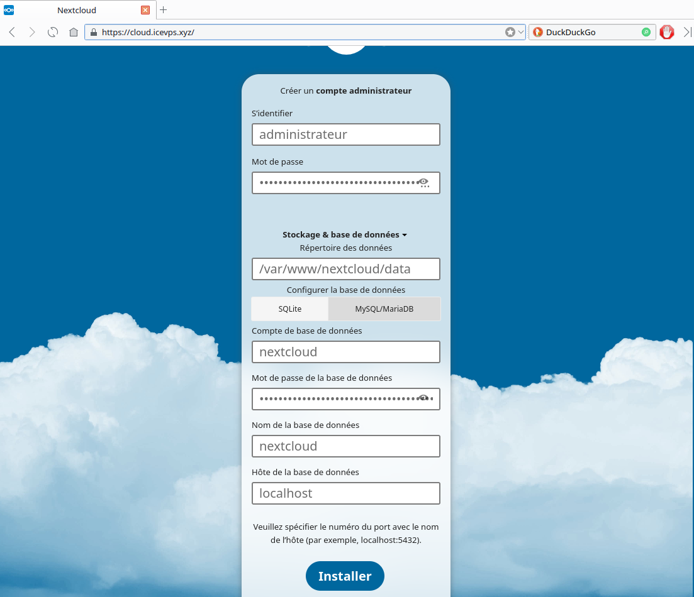
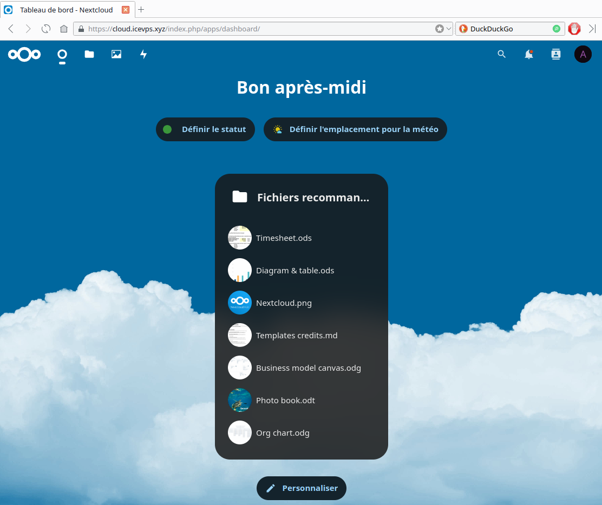

+++
title = 'Caddy PHP MariaDB Nextcloud Hub'
date = 2024-06-05 00:00:00 +0100
categories = ['nextcloud']
+++
*Nextcloud est une suite de logiciels client-serveur permettant de créer et d'utiliser des services d'hébergement de fichiers.*  

## Nextcloud sur serveur Caddy

Installer nextcloud sur un serveur Caddy , voir les liens :

* [Nextcloud with Caddy](https://jj-projects.com/2021/12/08/installing-nextcloud-with-caddy-instead-of-apache/)
* [Exemple de fichier Caddyfile Nextcloud](https://github.com/caddyserver/examples/blob/master/nextcloud/Caddyfile)

### Serveur Caddy + PHP8.2

{:height="60"} {:height="60"}

<u>Installation Caddy sur debian 12</u>  
[Caddy serveur + PHP sur Debian 12 bookworm](/posts/Caddy_serveur_debian_bookworm/)

Maintenant que Caddy est installé et exécuté, créez ensuite le répertoire à partir duquel vous souhaitez que Caddy héberge NextCloud et attribuez la propriété de l'utilisateur « Caddy ».

```bash
sudo mkdir -p /var/www
sudo chown caddy:caddy /var/www
```

### MariaDB

{:height="60"}

Installer MariaDB :

```bash
sudo apt install mariadb-server
sudo mysql_secure_installation # Y à tout et nouveau mot de passe n
```

Base ‘nextcloud’ , en mode su

```
MOTPASSEDB="xxxxxxxxxxxxxxxxxxxxxxxxxxxxxx"
mysql -uroot -e "CREATE USER 'nextcloud'@'localhost' IDENTIFIED BY '$MOTPASSEDB'; CREATE DATABASE nextcloud CHARACTER SET utf8mb4 COLLATE utf8mb4_general_ci; GRANT ALL PRIVILEGES ON nextcloud.* TO 'nextcloud'@'localhost';FLUSH PRIVILEGES;"
```

### Nextcloud

{:height="60"}

Obtenez la dernière version sur <https://download.nextcloud.com/server/releases/> , cliquez sur « Télécharger pour le serveur » et choisissez l'archive tar ou zip. Mettez le fichier sur votre serveur Web, je l'ai simplement transféré dans le répertoire personnel de l'utilisateur root, puis je l'ai déplacé vers le directeur du serveur Web de Caddy /var/www.

```bash
wget https://download.nextcloud.com/server/releases/nextcloud-29.0.1.tar.bz2
tar -xf nextcloud-29.0.1.tar.bz2
sudo mv nextcloud /var/www/
```

changer la propriété des fichiers en caddy 

    sudo chown -R caddy:caddy /var/www/nextcloud

### PHP paramétrage

mémoire pour PHP : ajouter memory_limit = 512M dans le fichier /etc/php/8.2/fpm/php.ini

    sudo sed -i -e "s/memory_limit = 128M/memory_limit = 512M/g" "/etc/php/8.2/fpm/php.ini"

Cache PHP (OPcache) :/etc/php/8.2/fpm/php.ini, paramétrage sera réalisé par le pool nextcloud
PHP Cache de données (APCu & Redis)

    sudo apt install php8.2-apcu redis-server php8.2-redis 

Il faut ajouter apc.enable_cli=1 au fichier /etc/php/8.2/mods-available/apcu.ini

```
extension=apcu.so
apc.enable_cli=1
```

La nouvelle configuration sera prise en compte après redémarrage du service PHP-FPM :

    sudo systemctl restart php8.2-fpm.service

### Configurer Caddy

2 options de configuration :

* A /etc/caddy/Caddyfile
* B /etc/caddy/config.json

<u>A - Configuration /etc/caddy/Caddyfile</u>  

<details>
<summary><b>Etendre Réduire /etc/caddy/config.json</b></summary>
  
cloud.icevps.xyz {
	root * /var/www/nextcloud
	file_server
	encode gzip zstd

	php_fastcgi unix//run/php/php8.2-fpm.sock {
		env front_controller_active true
		trusted_proxies 127.0.0.1/8 ::1 91.194.161.27/24
	}

	# High Performance Backend / Client Push App
	handle_path /push/* {
		reverse_proxy http://127.0.0.1:7867
	}

	log {
		output file /var/log/caddy/nextcloud.log
	}

	header {
		Strict-Transport-Security "max-age=15768000;"
		X-Content-Type-Options "nosniff"
		X-XSS-Protection "1; mode=block"
		X-Robots-Tag "none"
		X-Download-Options "noopen"
		X-Permitted-Cross-Domain-Policies "none"
		Referrer-Policy "no-referrer"
	}

	redir /.well-known/carddav /remote.php/dav 301
	redir /.well-known/caldav /remote.php/dav 301

	# .htaccess / data / config / ... shouldn't be accessible from outside
	@forbidden {
		path /.htaccess
		path /data/*
		path /config/*
		path /db_structure
		path /.xml
		path /README
		path /3rdparty/*
		path /lib/*
		path /templates/*
		path /occ
		path /console.php
	}

	respond @forbidden 404
}

</details>

Vérifier la configuration : `caddy validate --config /etc/caddy/Caddyfile`

```
2024/06/05 04:35:33.961	INFO	using config from file	{"file": "/etc/caddy/Caddyfile"}
2024/06/05 04:35:33.967	INFO	adapted config to JSON	{"adapter": "caddyfile"}
2024/06/05 04:35:33.968	INFO	http.auto_https	server is listening only on the HTTPS port but has no TLS connection policies; adding one to enable TLS	{"server_name": "srv0", "https_port": 443}
2024/06/05 04:35:33.969	INFO	http.auto_https	enabling automatic HTTP->HTTPS redirects	{"server_name": "srv0"}
2024/06/05 04:35:33.972	INFO	tls.cache.maintenance	started background certificate maintenance	{"cache": "0xc0008fc100"}
2024/06/05 04:35:33.973	INFO	tls.cache.maintenance	stopped background certificate maintenance	{"cache": "0xc0008fc100"}
Valid configuration
```

<u>B - Configuration /etc/caddy/config.json</u>  
La configuration de Caddy se fait à l'aide d'un Caddyfile ou d'un fichier json. Le fichier json est plus puissant et voici le fichier enregistré dans `/etc/caddy/config.json`  
Assurez-vous de remplacer "cloud.jj-projects.com" par l'URL de votre site et "php8.0-fpm.sock"

<details>
<summary><b>Etendre Réduire /etc/caddy/config.json</b></summary>
  
{
    "apps": {
        "http": {
            "servers": {
                "srv0": {
                    "listen": [
                        ":443"
                    ],
                    "routes": [
                        {
                            "match": [
                                {
                                    "host": [
                                        "cloud.jj-projects.com"
                                    ]
                                }
                            ],
                            "handle": [
                                {
                                    "handler": "subroute",
                                    "routes": [
                                        {
                                            "handle": [
                                                {
                                                    "handler": "vars",
                                                    "root": "/var/www/nextcloud"
                                                },
                                                {
                                                    "encodings": {
                                                        "gzip": {}
                                                    },
                                                    "handler": "encode",
                                                    "prefer": [
                                                        "gzip"
                                                    ]
                                                }
                                            ]
                                        },
                                        {
                                            "handle": [
                                                {
                                                    "handler": "static_response",
                                                    "headers": {
                                                        "Location": [
                                                            "{http.request.uri.path}/"
                                                        ]
                                                    },
                                                    "status_code": 308
                                                }
                                            ],
                                            "match": [
                                                {
                                                    "file": {
                                                        "try_files": [
                                                            "{http.request.uri.path}/index.php"
                                                        ]
                                                    },
                                                    "not": [
                                                        {
                                                            "path": [
                                                                "*/"
                                                            ]
                                                        }
                                                    ]
                                                }
                                            ]
                                        },
                                        {
                                            "handle": [
                                                {
                                                    "handler": "rewrite",
                                                    "uri": "{http.matchers.file.relative}"
                                                }
                                            ],
                                            "match": [
                                                {
                                                    "file": {
                                                        "split_path": [
                                                            ".php"
                                                        ],
                                                        "try_files": [
                                                            "{http.request.uri.path}",
                                                            "{http.request.uri.path}/index.php",
                                                            "index.php"
                                                        ]
                                                    }
                                                }
                                            ]
                                        },
                                        {
                                            "handle": [
                                                {
                                                    "handler": "reverse_proxy",
                                                    "transport": {
                                                        "protocol": "fastcgi",
                                                        "split_path": [
                                                            ".php"
                                                        ]
                                                    },
                                                    "upstreams": [
                                                        {
                                                            "dial": "unix//run/php/php8.2-fpm.sock"
                                                        }
                                                    ]
                                                }
                                            ],
                                            "match": [
                                                {
                                                    "path": [
                                                        "*.php"
                                                    ]
                                                }
                                            ]
                                        },
                                        {
                                            "handle": [
                                                {
                                                    "handler": "file_server",
                                                    "hide": [
                                                        "/etc/caddy/Caddyfile"
                                                    ]
                                                }
                                            ]
                                        }
                                    ]
                                }
                            ],
                            "terminal": true
                        }
                    ]
                }
            }
        }
    }
}

</details>

Mettre à jour systemd pour qu'il pointe vers lui :

    sudo systemctl edit --full caddy.service

Rechercher et remplacer toutes les instances de **«Caddyfile»** par **«config.json»**.  
Après avoir enregistré, redémarrer Caddy avec :

    sudo systemctl restart caddy

### Installer Nextcloud

<u>Assistant d'installation graphique</u>  
NextCloud dispose d'un assistant d'installation graphique qui devrait être disponible immédiatement à partir de votre URL <https://cloud.icevps.xyz>  
  
Ignorer les applications à installer  
  

<u>Installation manuelle en ligne de commande</u>  
Voici comment installer manuellement à partir du terminal 

    cd /var/www/nextcloud

La commande suivante installera NextCloud en créant un utilisateur administrateur nommé « admin » avec le mot de passe « mot de passe ». N'hésitez pas à le remplacer par quelque chose de plus difficile à deviner.

```bash
sudo -u caddy php occ maintenance:install --database "mysql" --database-name "nextcloud" --database-user "nextcloud" --database-pass "PASSWORD_YOU_CREATED_IN_STEP_4" --admin-user "admin" --admin-pass "password"
```

Accédez à votre URL et vous devriez voir la page de connexion NextCloud, où vous pouvez utiliser « admin » et « mot de passe » (ou tout ce que vous avez modifié) pour vous connecter.

Modifier le fichier /var/www/nextcloud/config/config.php  
Ajouter 'default_phone_region' => 'FR', et les lignes suivantes dans le fichier `/var/www/nextcloud/config/config.php` avant le tag de fin de fichier `);`

```
  'default_locale' => 'fr_FR',
  'default_phone_region' => 'FR',
  'filelocking.enabled' => true,
  'memcache.locking' => '\OC\Memcache\Redis',
  'memcache.local' => '\\OC\\Memcache\\APCu',
  'redis' => array(
    'host' => 'localhost',
    'port' => 6379,
    'timeout' => 0.0,
    'password' => '',
  ),
```

Points à régler

```
Il y a quelques erreurs concernant votre configuration.
La configuration des entêtes du reverse proxy est incorrecte. C'est un problème de sécurité, qui peut permettre à un attaquant d'usurper l'adresse IP affichée à Nextcloud. Pour plus d’information, voir la documentation ↗.
Votre serveur web n’est pas configuré correctement pour résoudre les URL `.well-known`, a échoué sur : `/.well-known/caldav` Pour plus d’information, voir la documentation ↗.
Vous n’avez pas encore paramétré ou vérifié la configuration de votre serveur mail. Merci de le faire sur la page « Paramètres de base ». Ensuite, utilisez le bouton « Envoyer un e-mail » sous le formulaire pour vérifier vos paramètres. Pour plus d’information, voir la documentation ↗.
```