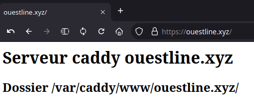

+++
title = 'Lenovo KVM - Serveur virtuel Debian 12 debsrv01 (image nocloud)'
date = 2024-06-11 00:00:00 +0100
categories = virtuel debian
+++
*Si vous exploitez un nuage privé ou une plateforme de virtualisation fonctionnant avec KVM. La manière la plus idéale de faire tourner une machine virtuelle Debian 12 est d'utiliser une image de nuage* 

## KVM - Debian virtuel

{:height="50"}  

*Installer un serveur debian virtuel sur Lenovo KVM*  
Se connecter sur le serveur Lenovo

### Installer image debian cloud

Télécharger image debian cloud  

* **nocloud** : Principalement utile pour tester le processus de construction lui-même. N'a pas installé cloud-init, mais permet à l'utilisateur de se connecter en tant que root sans mot de passe.

Toutes les images de Debian 12 Cloud sont disponibles sur la [page officielle de téléchargement des images d'OS](https://cloud.debian.org/images/cloud/bookworm/latest/). Dans ce guide, nous allons télécharger l'image nocloud qcow2 

```shell
# Nom serveur à créer
export VM_NAME="debsrv01"
wget https://cloud.debian.org/images/cloud/bookworm/latest/debian-12-nocloud-amd64.qcow2 -O /srv/kvm/libvirt/images/$VM_NAME.qcow2
```

Redimensionner taille image à 8Go

```shell
# Nom serveur à créer
export VM_NAME="debsrv01"
qemu-img resize /srv/kvm/libvirt/images/$VM_NAME.qcow2 8G
```

Info sur l'image : `qemu-img info /srv/kvm/libvirt/images/debsrv01.qcow2`

```
image: /srv/kvm/libvirt/images/debsrv01.qcow2
file format: qcow2
virtual size: 8 GiB (8589934592 bytes)
disk size: 348 MiB
cluster_size: 65536
Format specific information:
    compat: 1.1
    compression type: zlib
    lazy refcounts: false
    refcount bits: 16
    corrupt: false
    extended l2: false
```

Créez une nouvelle machine virtuelle Debian 12 à l'aide de la commande `virt-install`.  
Nous utilisons le réseau en pont , remplacer `network=default` par `bridge=br0`


```bash
sudo virt-install \
    --memory 2048 \
    --vcpus 1 \
    --name $VM_NAME \
    --disk /srv/kvm/libvirt/images/$VM_NAME.qcow2,device=disk,bus=virtio,format=qcow2 \
    --os-variant debiantesting \
    --network bridge=br0,model=virtio \
    --virt-type kvm \
    --graphics none \
    --boot uefi \
    --import
```

La sortie du mode console: `Ctrl+Altgr ]`  
A la fin de l'installation, on arrive sur le login (en mode console) :  
Saisir "root"   

```
[...]
Debian GNU/Linux 12 localhost ttyS0

localhost login: 
```

Par défaut openssh ne fonctionne pas: `[FAILED] Failed to start ssh.servic…[0m - OpenBSD Secure Shell server.`  
Il faut regénérer les clés : `dpkg-reconfigure openssh-server` et valider **"Keep the local version currently installed"**


Mise à jour

```shell
apt update && apt upgrade -y
```

### Redimensionner taille partition

Il faut mettre la taille au maximun sur la partition 1 du disque /dev/vda

```
root@localhost:~# fdisk /dev/vda

Welcome to fdisk (util-linux 2.38.1).
Changes will remain in memory only, until you decide to write them.
Be careful before using the write command.

GPT PMBR size mismatch (4194303 != 16777215) will be corrected by write.
The backup GPT table is not on the end of the device. This problem will be corrected by write.
This disk is currently in use - repartitioning is probably a bad idea.
It's recommended to umount all file systems, and swapoff all swap
partitions on this disk.


Command (m for help): p

Disk /dev/vda: 8 GiB, 8589934592 bytes, 16777216 sectors
Units: sectors of 1 * 512 = 512 bytes
Sector size (logical/physical): 512 bytes / 512 bytes
I/O size (minimum/optimal): 512 bytes / 512 bytes
Disklabel type: gpt
Disk identifier: AA02A0A0-DE2C-E343-AC65-FCC478C5851B

Device      Start     End Sectors  Size Type
/dev/vda1  262144 4192255 3930112  1.9G Linux filesystem
/dev/vda14   2048    8191    6144    3M BIOS boot
/dev/vda15   8192  262143  253952  124M EFI System

Partition table entries are not in disk order.

Command (m for help): d
Partition number (1,14,15, default 15): 1

Partition 1 has been deleted.

Command (m for help): n
Partition number (1-13,16-128, default 1): 
First sector (262144-16777182, default 262144): 
Last sector, +/-sectors or +/-size{K,M,G,T,P} (262144-16777182, default 16775167): 

Created a new partition 1 of type 'Linux filesystem' and of size 7.9 GiB.
Partition #1 contains a ext4 signature.

Do you want to remove the signature? [Y]es/[N]o: N

Command (m for help): w 
```

### Redémarrer machine virtuelle

    systemctl reboot

### Mot passe root

Créer mot de passe root ( rootsso49600)

   passwd root

### Créer un utilisateur

Après s'être connecté en tant qu'utilisateur root, créer le premier utilisateur

    useradd -m -d /home/usersso -s /bin/bash -c "vm-srv01 Owner" -U usersso

Mot de passe usersso  (usersso49600) 

    passwd usersso

Ajout à sudoers

    echo "usersso     ALL=(ALL) NOPASSWD: ALL" >> /etc/sudoers.d/usersso

### Relever adresse IP

    ip a |grep "inet "

```
    inet 127.0.0.1/8 scope host lo
    inet 192.168.0.22/24 metric 100 brd 192.168.0.255 scope global dynamic enp1s0
```

### Réseau netplan

*netplan est utilisé comme gestionnaire réseau avec l'image debian cloud*

Les périphériques du réseau

    ip link show

```
1: lo: <LOOPBACK,UP,LOWER_UP> mtu 65536 qdisc noqueue state UNKNOWN mode DEFAULT group default qlen 1000
    link/loopback 00:00:00:00:00:00 brd 00:00:00:00:00:00
2: enp1s0: <BROADCAST,MULTICAST,UP,LOWER_UP> mtu 1500 qdisc fq_codel state UP mode DEFAULT group default qlen 1000
    link/ether 52:54:00:a1:89:e4 brd ff:ff:ff:ff:ff:ff
```

*[Netplan](https://netplan.io/) est un utilitaire qui permet de configurer facilement le réseau sous Linux.*

* [Gestion du réseau Linux avec Netplan](https://linux.goffinet.org/administration/configuration-du-reseau/gestion-du-reseau-linux-avec-netplan/)
* [How to configure IPv6 with Netplan](https://www.snel.com/support/how-to-configure-ipv6-with-netplan-on-ubuntu-18-04/)

Les fichiers de configuration sont dans le dossier `/etc/netplan`

```
90-default.yaml
```

On retire les fichiers de configuration originaux 

```
mkdir /etc/backup.netplan
mv /etc/netplan/* /etc/backup.netplan/
```

On propose cette configuration statique de l’interface **enp1s0**

```
bash -c 'cat << EOF > /etc/netplan/01-enp1s0.yaml
network:
  version: 2
  renderer: networkd
  ethernets:
    enp1s0:
      addresses:
        - 192.168.0.219/24
        - 2a01:e0a:9c8:2081::1/64
      nameservers:
        addresses:
        - 1.1.1.1
        - 9.9.9.9
        search: []
      routes:
      - to: default
        via: 192.168.0.254
EOF'
```

NOTE:Adresse IPV6 `2a01:e0a:9c8:2081::1/64` sur NextHop  Freebox avec inet6 `fe80::5054:ff:feae:baa2`

Droits

    chmod 600 /etc/netplan/01-enp1s0.yaml

Et on génère la configuration pour l’appliquer auprès du gestionnaire 

```
netplan generate
netplan apply
```

`Cannot call openvswitch: ovsdb-server.service is not running`  
Il s'agit juste d'un avertissement...

Pour vérification 

    ip a

```
1: lo: <LOOPBACK,UP,LOWER_UP> mtu 65536 qdisc noqueue state UNKNOWN group default qlen 1000
    link/loopback 00:00:00:00:00:00 brd 00:00:00:00:00:00
    inet 127.0.0.1/8 scope host lo
       valid_lft forever preferred_lft forever
    inet6 ::1/128 scope host noprefixroute 
       valid_lft forever preferred_lft forever
2: enp1s0: <BROADCAST,MULTICAST,UP,LOWER_UP> mtu 1500 qdisc fq_codel state UP group default qlen 1000
    link/ether 52:54:00:ae:ba:a2 brd ff:ff:ff:ff:ff:ff
    inet 192.168.0.219/24 brd 192.168.0.255 scope global enp1s0
       valid_lft forever preferred_lft forever
    inet6 2a01:e0a:9c8:2080:5054:ff:feae:baa2/64 scope global dynamic mngtmpaddr noprefixroute 
       valid_lft 85946sec preferred_lft 85946sec
    inet6 2a01:e0a:9c8:2081::1/64 scope global 
       valid_lft forever preferred_lft forever
    inet6 fe80::5054:ff:feae:baa2/64 scope link 
       valid_lft forever preferred_lft forever
```

### Modifier hostname

    hostnamectl set-hostname vm-srv01
    hostnamectl

```
 Static hostname: vm-srv01
       Icon name: computer-vm
         Chassis: vm 🖴
      Machine ID: c2899a89218d46af92cafe2aaba0d1a6
         Boot ID: 198d45e8f81a4cb78ae413ab9a2ed9a5
  Virtualization: kvm
Operating System: Debian GNU/Linux 12 (bookworm)  
          Kernel: Linux 6.1.0-18-amd64
    Architecture: x86-64
 Hardware Vendor: QEMU
  Hardware Model: Standard PC _Q35 + ICH9, 2009_
Firmware Version: 0.0.0
```

### OpenSSH clé 

<u>sur la machine virtuelle</u>  
**SSH** Il faut activer authentification mot de passe

    nano /etc/ssh/sshd_config

```
# To disable tunneled clear text passwords, change to no here!
PasswordAuthentication yes
#PermitEmptyPasswords no
```

Relancer

    systemctl restart sshd

**connexion avec clé**  
<u>sur l'ordinateur de bureau</u>  
Générer une paire de clé curve25519-sha256 (ECDH avec Curve25519 et SHA2) pour une liaison SSH avec le serveur.  

    ssh-keygen -t ed25519 -o -a 100 -f ~/.ssh/debsrv01

Envoyer les clés publiques sur le serveur KVM   

    ssh-copy-id -i ~/.ssh/debsrv01.pub usersso@192.168.0.219

<u>sur la machine virtuelle</u>
On se connecte  

    ssh usersso@192.168.0.219

Modifier la configuration serveur SSH  

    sudo nano /etc/ssh/sshd_config

Modifier

```conf
Port = 55219
PasswordAuthentication no
```

Relancer le serveur

    sudo systemctl restart sshd

### Sortie console

Sortir du mode console par `poweroff` en mode su  avec le message suivant

```
Création de domaine terminée.
Vous pouvez redémarrer votre domaine en exécutant :
  virsh --connect qemu:///system start debsrv01
```

Démarrer la vm et positionner le démarrage auto

```shell
sudo virsh --connect qemu:///system start debsrv01  # Domain 'debsrv01' started
sudo virsh autostart debsrv01                       # Domain 'debsrv01' marked as autostarted
```

### Connexion utilisateur via SSH

    ssh -p 55219 -i ~/.ssh/debsrv01 usersso@192.168.0.219

### Utilitaires

Installer utilitaires  

    sudo apt update && sudo apt install rsync curl tmux jq figlet git

Effacer et créer motd

    sudo rm /etc/motd && sudo nano /etc/motd

```
 __     __ __  __       _        _                         ___   _ 
 \ \   / /|  \/  |   __| |  ___ | |__   ___  _ __ __   __ / _ \ / |
  \ \ / / | |\/| |  / _` | / _ \| '_ \ / __|| '__|\ \ / /| | | || |
   \ V /  | |  | | | (_| ||  __/| |_) |\__ \| |    \ V / | |_| || |
    \_/   |_|  |_|  \__,_| \___||_.__/ |___/|_|     \_/   \___/ |_|
  ____         _      _                 _  ____                    
 |  _ \   ___ | |__  (_)  __ _  _ __   / ||___ \                   
 | | | | / _ \| '_ \ | | / _` || '_ \  | |  __) |                  
 | |_| ||  __/| |_) || || (_| || | | | | | / __/                   
 |____/  \___||_.__/ |_| \__,_||_| |_| |_||_____|                  
  _   ___  ____      _   __     ___     ___     ____   _   ___     
 / | / _ \|___ \    / | / /_   ( _ )   / _ \   |___ \ / | / _ \    
 | || (_) | __) |   | || '_ \  / _ \  | | | |    __) || || (_) |   
 | | \__, |/ __/  _ | || (_) || (_) |_| |_| |_  / __/ | | \__, |   
 |_|   /_/|_____|(_)|_| \___/  \___/(_)\___/(_)|_____||_|   /_/    
```

### Historique de la ligne de commande  

Ajoutez la recherche d’historique de la ligne de commande au terminal  
Se connecter en utilisateur  
Tapez un début de commande précédent, puis utilisez shift + up (flèche haut) pour rechercher l’historique filtré avec le début de la commande.

```bash
# Global, tout utilisateur
echo '"\e[1;2A": history-search-backward' | sudo tee -a /etc/inputrc
echo '"\e[1;2B": history-search-forward' | sudo tee -a /etc/inputrc
```

### Partage (virtiofs)

Virtiofs est un système de fichiers partagé qui permet aux machines virtuelles d'accéder à une arborescence de répertoires sur l'hôte. Contrairement aux approches existantes, il est conçu pour offrir la sémantique et les performances d'un système de fichiers local.

Voir <https://virtio-fs.gitlab.io/>

Remarque : virtiofs ne prend actuellement pas en charge la migration, de sorte que les opérations telles que la migration, la sauvegarde/la sauvegarde gérée ou les instantanés avec mémoire ne sont pas prises en charge si une machine virtuelle a un système de fichiers virtiofs connecté.
Partage d'un répertoire hôte avec un invité

Ajoutez les éléments XML de domaine suivants pour partager le répertoire hôte /path avec l'invité

```xml
<domaine>
      ...
  <memoryBacking>
    <source type="memfd"/>
    <access mode="shared"/>
  </memoryBacking>
      ...
  <devices>
        ...
    <filesystem type="mount" accessmode="passthrough">
      <driver type="virtiofs"/>
      <binary path="/usr/lib/qemu/virtiofsd"/>
      <source dir="/sharenfs"/>
      <target dir="sharenfs"/>
      <alias name="fs0"/>
      <address type="pci" domain="0x0000" bus="0x07" slot="0x00" function="0x0"/>
    </filesystem>
        ...
   </devices>
</domaine>
```

N'oubliez pas les éléments `<memoryBacking>`. Ils sont nécessaires pour la connexion de l'utilisateur vhost avec le démon virtiofsd.

Notez que malgré son nom, le répertoire cible est une chaîne arbitraire appelée étiquette de montage qui est utilisée dans l'invité pour identifier le système de fichiers partagé à monter. Il n'est pas nécessaire qu'il corresponde au point de montage souhaité dans l'invité.

Démarrez l'invité, système de fichiers sur fstab

```
sharenfs   /home/usersso/sharenfs   virtiofs rw,_netdev 0 0
```

`Note : ceci nécessite la prise en charge de virtiofs dans le noyau de l'invité (Linux v5.4 ou plus récent)`{: .prompt-info }

### Parefeu

[Parefeu (firewall) UFW](/posts/Pare-Feu-UFW/)

### Caddy serveur

* [Caddy serveur](/posts/Caddy_serveur/)  
* [Installation de Caddy avec systemd](https://ungeek.fr/caddy-setup/)

[Télécharger la version linux amd64](https://caddyserver.com/download) : `caddy_linux_amd64`  
Déplacer, renommer et droit en exécution de **caddy** sous `/usr/bin/`  

```
mv caddy_linux_amd64 /usr/local/bin/caddy
chmod +x /usr/local/bin/caddy
```

Les serveurs Web tels que Caddy sont généralement exposés sur l'Internet. C'est une bonne pratique que de lancer tout logiciel qui est exposé sur Internet en tant qu'utilisateur restreint.

Par conséquent, nous allons configurer un utilisateur restreint nommé caddy avec le répertoire personnel de /etc/caddy en exécutant la commande suivante :

    sudo useradd --shell /bin/false --home-dir /etc/caddy --system caddy

Dans le dossier d'accueil, Caddy stocke la configuration dans le répertoire .config, et les certificats dans le répertoire .local. Donc, exécutez la commande suivante pour créer ces deux répertoires :

    sudo mkdir -p /etc/caddy/.config /etc/caddy/.local

Nous aurons également besoin d'un répertoire dans lequel nous pourrons dire à Caddy de stocker les logs. Dans ce sens, nous allons créer un répertoire /var/log/caddy avec la commande suivante :

    sudo mkdir -p /var/log/caddy

Ensuite, changez la propriété de ces répertoires au profit de l'utilisateur caddy :

    sudo chown -R caddy: /etc/caddy /var/log/caddy
En général, lorsque vous exécutez un logiciel en tant qu'utilisateur non root, Linux interdit à ces processus d'écouter des numéros de port inférieurs à 1024. Pour contourner cette restriction et exécuter Caddy en toute sécurité en tant qu'utilisateur non root, ajoutez la capacité cap_net_bind_service au binaire caddy :

    sudo setcap cap_net_bind_service+ep /usr/local/bin/caddy

**Démarrage automatique de Caddy**  
Maintenant que nous avons créé l'utilisateur et les répertoires, nous allons configurer Caddy comme un service du système. En effectuant cette étape, le serveur web Caddy démarrera automatiquement lorsque vous démarrez (ou redémarrez) votre système.

Vous pourrez ainsi démarrer, arrêter, ou forcer Caddy à recharger sa configuration en utilisant la commande systemctl. Nous allons également définir le répertoire de base de Caddy par le biais de ce fichier, qui définira le répertoire par défaut dans lequel Caddy cherchera les fichiers à diffuser.

Utilisez un éditeur de texte pour créer le fichier /etc/systemd/system/caddy.service. La plupart des distributions ont l'éditeur vi installé, vous pouvez donc utiliser :

    sudo nano /etc/systemd/system/caddy.service

```
[Unit]
Description=Caddy web server
After=network-online.target

[Service]
User=caddy
Group=caddy
Type=exec
WorkingDirectory=/var/caddy/

ExecStart=/usr/local/bin/caddy run --config /etc/caddy/Caddyfile
ExecReload=/usr/local/bin/caddy reload --config /etc/caddy/Caddyfile
ExecStop=/usr/local/bin/caddy stop

LimitNOFILE=1048576
LimitNPROC=512

PrivateTmp=true
PrivateDevices=true
ProtectHome=true
ProtectSystem=strict
ReadWritePaths=/etc/caddy/.local /etc/caddy/.config /var/log

CapabilityBoundingSet=CAP_NET_BIND_SERVICE
AmbientCapabilities=CAP_NET_BIND_SERVICE
NoNewPrivileges=true

[Install]
WantedBy=multi-user.target
```

Comme nous l'avons mentionné précédemment, nous avons défini le répertoire de travail lorsque nous avons créé le fichier de service, comme vous pouvez le voir dans la ligne WorkingDirectory=/var/caddy/.

Ensuite, nous allons créer le répertoire /var/caddy/ et y placer un fichier index/. Exécutez les commandes suivantes pour y parvenir :

```bash
sudo mkdir -p /var/caddy/
sudo bash -c 'echo "<h1>Hello from Caddy web server</h1>" > /var/caddy//index/'
```

**Configuration de Caddy pour fournir un site web**  

Vous pouvez configurer Caddy pour qu'il ajoute automatiquement HTTPS à votre site.

Pour suivre les étapes de cette section, vous devez avoir votre propre nom de domaine. Tout d'abord, allez dans les paramètres DNS du fournisseur DNS de votre domaine. Créez un sous-domaine ou modifiez l'entrée DNS du domaine afin qu'elle pointe vers l'adresse IP publique du serveur.

Après avoir effectué les modifications dans le DNS, modifiez le fichier `/etc/caddy/Caddyfile` afin que la configuration ressemble à ceci :

```
{
    email <YOUR EMAIL ADDRESS HERE>
}

<YOUR DOMAIN NAME HERE> {
    encode gzip
    file_server
}
```

Assurez-vous de remplacer les champs  et  par votre email et votre nom de domaine respectivement. Il n'est pas nécessaire de spécifier le protocole "https://" lorsque vous indiquez le nom de domaine. Lorsque vous ne précisez pas de nom de domaine, Caddy obtient automatiquement des certificats. Ensuite, il applique le protocole HTTPS à votre site Web et met en place une redirection de HTTP vers HTTPS.

Lancer le service

    sudo systemctl daemon-reload

On active, on démarre, et on suit les logs pour vérifier que tout tourne bien.

    sudo systemctl enable caddy --now

Maintenant, à l'aide d'un navigateur, allez sur votre site web en utilisant votre nom de domaine. Le site apparaîtra comme protégé par HTTPS  


### FrankenPHP (OPTION)

FrankenPHP est un serveur d’applications moderne pour PHP construit à partir du serveur web Caddy.

*    support natif de HTTP/2 et de HTTP/3
*    génération et renouvèlement automatique des certificats TLS grâce à Let's Encrypt ou à ZeroSSL
*    support des Early Hints (qui viennent également d'être implémentés par Chrome)
*    mode "worker" qui permet de court-circuiter l'architecture share nothing de PHP et de diviser par trois (ou plus) les temps de réponse comparé à PHP-FPM
*    support du temps réel avec support natif du protocole Mercure, une alternative aux WebSockets basée sur les SSE

**Binaire autonome**  
Si vous préférez ne pas utiliser Docker, nous fournissons des binaires autonomes de FrankenPHP pour Linux et macOS contenant PHP 8.3 et la plupart des extensions PHP populaires : [Télécharger FrankenPHP](https://github.com/dunglas/frankenphp/releases)  
En mode su

```
wget https://github.com/dunglas/frankenphp/releases/download/v1.2.0/frankenphp-linux-x86_64 -O /usr/local/bin/frankenphp
chmod +x /usr/local/bin/frankenphp
```

Pour servir le contenu du répertoire courant, exécutez :

    ./frankenphp php-server

Vous pouvez également exécuter des scripts en ligne de commande avec :

    ./frankenphp php-cli /path/to/your/script.php

il faut un fichier `/etc/caddy/Caddyfile`

```
{
	# Enable FrankenPHP
	frankenphp {
      worker /home/usersso/sharenfs/ouestline.xyz/racine/index.php
    }
}

ouestline.xyz {
    root * /home/usersso/sharenfs/ouestline.xyz/racine
	# Enable compression (optional)
	encode zstd br gzip
	# Execute PHP files in the current directory and serve assets
	php_server
}
```


## Site statique test

### Jekyll

[Installation Simplifiée Jekyll (générateur de site statique) sur Linux](/posts/Installation_Simplifiee_Jekyll_(generateur_de_site_statique)_sur_Linux/)

**jekyll 4.3.3** au 4 mai 2024 

Création dossier et modification des droits

```bash
sudo mkdir sharenfs/debsrv01
sudo chown $USER:$USER sharenfs/debsrv01
```

Se positionner dans le dossier

    cd ~/sharenfs/debsrv01/yannstatic/

Le fichier **Gemfile**

```
source "https://rubygems.org"

# gem "github-pages", group: :jekyll_plugins
gem "jekyll-text-theme"
gem "jekyll/-pipeline"
```

Le fichier **_config.yml**

<details>
<summary>(Afficher/Cacher) <b>_config.yml</b></summary>

# Bienvenue à Jekyll !
#
# Ce fichier de configuration est destiné aux paramètres qui affectent l'ensemble de votre blog, des valeurs
# que vous êtes censé configurer une fois et rarement besoin de modifier par la suite.
# Pour des raisons techniques, ce fichier n'est *PAS* rechargé automatiquement lorsque vous utilisez
# 'jekyll serve'. Si vous modifiez ce fichier, veuillez redémarrer le processus de serveur.

## => Paramètres du site
##############################
theme             : jekyll-text-theme
text_skin         : dark                          # "default" (par défaut), "dark", "forest", "ocean", "chocolate", "orange".
highlight_theme   : tomorrow-night-eighties       # "default" (par défaut), "tomorrow", "tomorrow-night", "tomorrow-night-eighties", "tomorrow-night-blue", "tomorrow-night-bright".
url               : https://static.bullsvm.local   # le nom d'hôte et le protocole de base pour votre site, par exemple https://www.someone.com
baseurl           :                               # ne comprend pas le nom d'hôte
title             : YannStatic
description       : >                             # cela signifie qu'il faut ignorer les nouvelles lignes jusqu'à "Language & timezone".
  Expérimentations et tests

## => Language and Timezone
##############################
lang        : fr               # le language du site, par défaut "en"
timezone    : Europe/Paris     # voir https://en.wikipedia.org/wiki/List_of_tz_database_time_zones


## => Auteur et social
##############################
author :
  type      : ## "personne" (par défaut), "organisme".
  name      : Yann Static
  url       :
  avatar    : # chemin ou url de l'image de l'avatar (carré)
  bio       :
  email     :
  facebook  : # "user_name" la dernière partie de l'url de votre profil, par exemple https://www.facebook.com/user_name
  twitter   : # "user_name" la dernière partie de l'url de votre profil, par exemple https://twitter.com/user_name
  weibo     : # "user_id" la dernière partie de l'url de votre profil, ex. https://www.weibo.com/user_id/profile ?...
  googleplus: # "user_id" la dernière partie de l'url de votre profil, par exemple https://plus.google.com/u/0/user_id
  telegram  : # "user_name" la dernière partie de votre url de profil, par exemple https://t.me/user_name
  medium    : # "user_name" la dernière partie de l'url de votre profil, par exemple https://medium.com/user_name
  zhihu     : # "user_name" la dernière partie de l'url de votre profil, par exemple https://www.zhihu.com/people/user_name
  douban    : # "user_name" la dernière partie de l'url de votre profil, par exemple https://www.douban.com/people/user_name
  linkedin  : # "user_name" la dernière partie de l'url de votre profil, par exemple https://www.linkedin.com/in/user_name
  github    : # "user_name" la dernière partie de l'url de votre profil, par exemple https://github.com/user_name
  npm       : # "user_name" la dernière partie de votre url de profil, par exemple https://www.npmjs.com/~user_name

## => Dépôt GitHub (si le site est hébergé par GitHub)
##############################
repository: 
repository_tree: 


## => Chemins
##############################
paths:
  root    : # title link url, "/" (default)
  home    : # home layout url, "/" (default)
  archive : # "/archive/" (default)
  rss     : # "/feed.xml" (default)


## => Post
##############################
## excerpt
excerpt_separator: 

## license
license: # "CC-BY-4.0", "CC-BY-SA-4.0", "CC-BY-NC-4.0", "CC-BY-ND-4.0"

## TOC
toc:
  selectors: h1,h2,h3 # "h1,h2,h3" (default)


## => Markdown Enhancements
##############################
## Mathjax
mathjax: 			  # false (default), true
mathjax_autoNumber: # false (default), true

## Mermaid
mermaid:            # false (default), true

## Chart
chart: true         # false (default), true


## => Paginate
##############################
paginate: 3
paginate_path: /page:num # don't change this unless for special need


## => Sources
##############################
sources:            # bootcdn (default), unpkg


## => Sharing
##############################
sharing:
  provider: false   # false (default), "addtoany", "addthis", "custom"

  ## AddThis
  addthis:
    id:             # AddThis pubid, e.g. ra-5xxxxxxxxxxx


## => Comments
##############################
comments:
  provider: false   # false (default), "disqus", "gitalk", "valine", "custom"

  ## Disqus
  disqus:
    shortname   : # the Disqus shortname for the site

  ## Gitalk
  # please refer to https://github.com/gitalk/gitalk for more info.
  gitalk:
    clientID    : # GitHub Application Client ID
    clientSecret: # GitHub Application Client Secret
    repository  : # GitHub repo
    owner       : # GitHub repo owner
    admin       : # GitHub repo owner and collaborators, only these guys can initialize GitHub issues, IT IS A LIST.
      # - your GitHub Id

  ## Valine
  # please refer to https://valine.js.org/en/ for more info.
  valine:
    app_id      : # LeanCloud App id
    app_key     : # LeanCloud App key
    placeholder : # Prompt information
    visitor     : # false (default)
    meta        : # "[nick, mail, link]" (default) nickname, E-mail, Personal-site


## => Pageview
##############################
pageview:
  provider: false # false (default), "leancloud", "custom"

  ## Leancloud
  leancloud:
    app_id    : # LeanCloud App id
    app_key   : # LeanCloud App key
    app_class : # LeanCloud App class


## => Recherche
##############################
search:
  provider: "custom" # "default" (default), false, "google", "custom"

  ## Google Custom Search Engine
  google:
    custom_search_engine_id: # Google Custom Search Engine ID


## => Analytics
##############################
analytics:
  provider: false # false (default), "google", "custom"

  ## Google Analytics
  google:
    tracking_id : # Google Analytics id for the site
    anonymize_ip: false # Anonymize IP tracking for Analytics


## => Build
##############################
markdown    : kramdown
highlighter : rouge
permalink   : date

# http://jekyllrb.com/docs/configuration/options/
exclude: [LISEZMOI.md,.jekyll-cache/,.git/,Gemfile,Gemfile.lock,static]
include: [search.json]

defaults:
  - scope:
      path: ""
      type: posts
    values:
      layout: article
      sharing: true
      license: false # true
      aside:
toc: true
      show_edit_on_github: true
      show_subscribe: true
      pageview: true
 

## => Plugins
##############################
plugins:
  - jekyll-feed
  - jekyll-paginate
  - jekyll-sitemap
  - jemoji


</details>


Bundle lit le fichier **Gemfile**

```bash
bundle install # Patientez ...
```

Résultat exécution

```
Bundle complete! 2 Gemfile dependencies, 44 gems now installed.
Use `bundle info [gemname]` to see where a bundled gem is installed.
```

Créer le dossier destination

```bash
sudo mkdir sharenfs/rnmkcy/racine/static
sudo chown $USER:$USER sharenfs/rnmkcy/racine/static
```

Générer le site

    bundle exec jekyll build --source "/home/usersso/sharenfs/debsrv01/yannstatic" --destination "/home/usersso/sharenfs/rnmkcy/racine/static"


Lancer le serveur

    tmux
    cd sharenfs/debsrv01/yannstatic/
    bundle exec jekyll serve

Résultat de la dernière commande

```
Configuration file: /home/usersso/sharenfs/debsrv01/yannstatic/_config.yml
            Source: /home/usersso/sharenfs/debsrv01/yannstatic
       Destination: /home/usersso/sharenfs/debsrv01/yannstatic/_site
 Incremental build: disabled. Enable with --incremental
      Generating... 
       Jekyll Feed: Generating feed for posts
                    done in 35.971 seconds.
 Auto-regeneration: enabled for '/home/usersso/sharenfs/debsrv01/yannstatic'
    Server address: http://127.0.0.1:4000
  Server running... press ctrl-c to stop.
```

Test depuis un poste de bureau ayant un droit d'accès via SSH

    ssh -L 9500:localhost:4000 usersso@192.168.0.219 -p 55219 -i /home/yann/.ssh/debsrv01

Lien <http://localhost:9500/>

