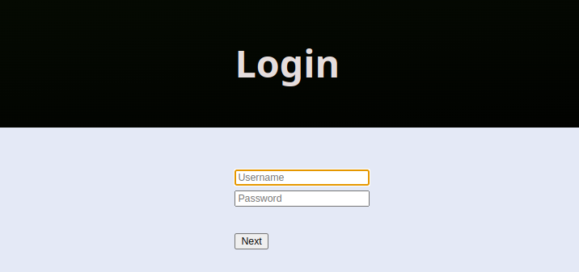
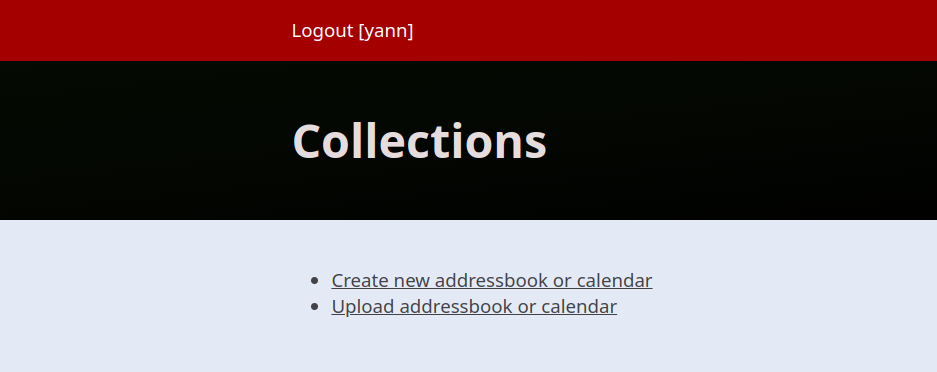
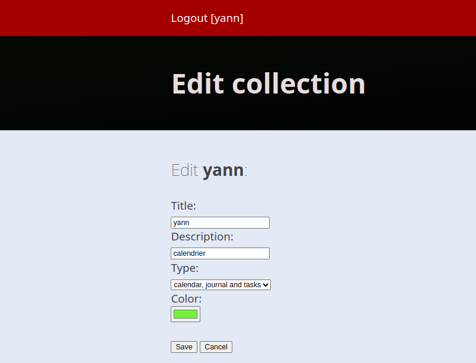
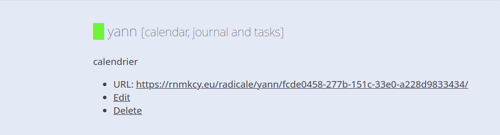
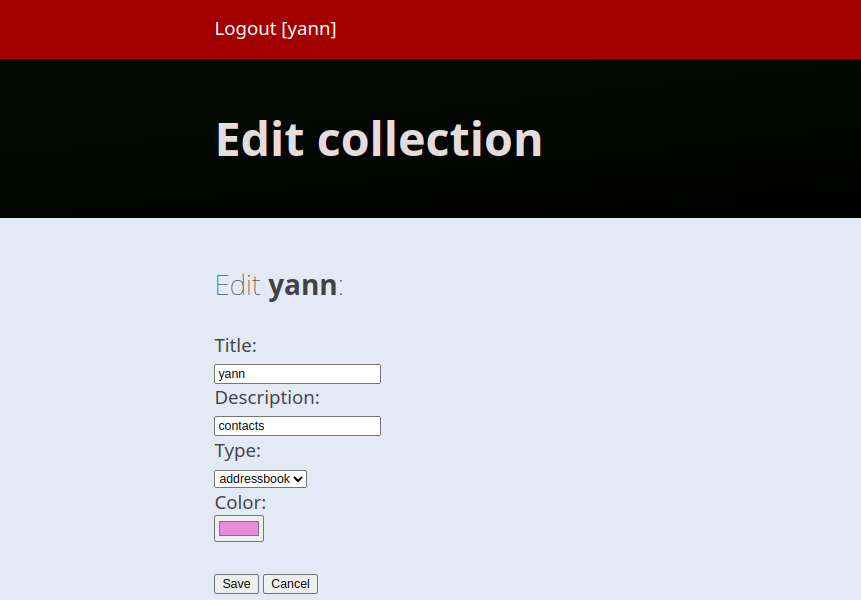
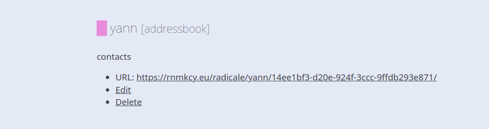

+++
title = 'Radicale serveur de calendrier et contacts'
date = 2024-06-14 00:00:00 +0100
categories = ['serveur']
+++
*Pour réduire la dépendance aux produits Google , héberger un serveur CardDav et CalDav à l'aide de Radicale. 
([Héberger son propre serveur de calendrier et de contacts](https://www.pragmageek.fr/2015/08/serveur-calendrier-contacts/))* 

## Radicale

*L'application [Radicale](https://radicale.org/v3.html) est écrite en python et, à ce titre, le paquet python et pip sont nécessaires pour la mettre en place.*

  

### Installation

#### Paquet debian

Installer radicale

    sudo apt install radicale 

#### Python venv (Problème)

Installer python3

    sudo apt install python3 python3-pip python3-venv

Version `python3 --version` &rarr; Python 3.11.2

Créer un environnement `.radicale`

```bash
cd ~
python3 -m venv .radicale
source .radicale/bin/activate
# On arrive sur le prompt --> (.radicale) usersso@vm-srv01:~$ 
```

Installer radicale (<https://radicale.org/v3.html>)

```bash
python3 -m pip install --upgrade radicale
# Pour tester
python3 -m radicale --storage-filesystem-folder=~/.var/lib/radicale/collections
```

Le serveur est en écoute 

```
[2024-06-14 12:49:22 +0000] [1701] [INFO] Loaded default config
[2024-06-14 12:49:22 +0000] [1701] [INFO] Loaded config file '/etc/radicale/config'
[2024-06-14 12:49:22 +0000] [1701] [INFO] Skipped missing config file '/home/usersso/.config/radicale/config'
[2024-06-14 12:49:22 +0000] [1701] [INFO] Loaded command line arguments
[2024-06-14 12:49:22 +0000] [1701] [INFO] Starting Radicale
[2024-06-14 12:49:22 +0000] [1701] [INFO] auth type is 'radicale.auth.htpasswd'
[2024-06-14 12:49:22 +0000] [1701] [INFO] auth htpasswd encryption is 'radicale.auth.htpasswd_encryption.md5'
[2024-06-14 12:49:22 +0000] [1701] [INFO] storage type is 'radicale.storage.multifilesystem'
[2024-06-14 12:49:22 +0000] [1701] [INFO] rights type is 'radicale.rights.owner_only'
[2024-06-14 12:49:22 +0000] [1701] [INFO] web type is 'radicale.web.internal'
[2024-06-14 12:49:22 +0000] [1701] [INFO] hook type is 'radicale.hook.none'
[2024-06-14 12:49:22 +0000] [1701] [INFO] permit delete of collection: True
[2024-06-14 12:49:22 +0000] [1701] [INFO] Listening on '127.0.0.1:5232'
[2024-06-14 12:49:22 +0000] [1701] [INFO] Radicale server ready
```

Lorsque le serveur est lancé, ouvrez http://localhost:5232 dans votre navigateur !  
Vous pouvez vous connecter avec n'importe quel nom d'utilisateur et mot de passe.

**Plugin ldap**

```bash
git clone https://github.com/shroomify-it/radicale-auth-ldap-plugin.git
mv radicale-auth-ldap-plugin/radicale_auth_ldap/ .radicale/
mv radicale-auth-ldap-plugin/setup.py .radicale/
cd .radicale/
python3 -m pip install .
python3 -m pip install python3-ldap
```

upgrade

    pip install --upgrade pip wheel setuptools requests

Liste des paquets installés dans l'environnement

```
(.radicale) usersso@vm-srv01:~/.radicale$ pip list
Package            Version
------------------ -----------
certifi            2024.6.2
charset-normalizer 3.3.2
defusedxml         0.7.1
idna               3.7
ldap3              2.9.1
passlib            1.7.4
pika               1.3.2
pip                24.0
pyasn1             0.6.0
python-dateutil    2.9.0.post0
python3-ldap       0.9.8.4
Radicale           3.2.1
radicale-auth-ldap 0.3
requests           2.32.3
setuptools         70.0.0
six                1.16.0
urllib3            2.2.1
vobject            0.9.7
wheel              0.43.0
```

**Paramétrage**

Radicale tente de charger les fichiers de configuration à partir de /etc/radicale/config et ~/.config/radicale/config. Des chemins personnalisés peuvent être spécifiés avec l'argument de ligne de commande --config /path/to/config ou la variable d'environnement RADICALE_CONFIG. Plusieurs fichiers de configuration peuvent être séparés par : (resp. ; sous Windows). Les chemins qui commencent par ? sont facultatifs.

Vous devez créer un nouveau fichier de configuration à l'emplacement souhaité. (Si l'utilisation d'un fichier de configuration n'est pas pratique, toutes les options peuvent être transmises via les arguments de la ligne de commande).

    sudo nano /etc/radicale/config

 Pour lldap

```
[auth]
type = radicale_auth_ldap
ldap_url = ldap://192.168.0.218:3890
ldap_base = dc=rnmkcy,dc=eu
ldap_attribute = uid
ldap_filter = (objectClass=person)
ldap_binddn = uid=admin,ou=people,dc=rnmkcy,dc=eu
ldap_password = Mot_de_passe_admin_lldap
ldap_scope = LEVEL
ldap_support_extended = no
```

Tester

```
python3 -m radicale --config  /etc/radicale/config 
```

### Stockage

Le stockage `/var/lib/radicale/collections/`  

```bash
# sudo useradd --system --user-group --home-dir /var/lib/radicale --shell /sbin/nologin radicale
sudo chown -R radicale:radicale /var/lib/radicale/collections
sudo chmod -R o= /var/lib/radicale/collections
```

### Configuration

Sauvegarde config par défaut 

    sudo mv /etc/radicale/config /etc/radicale/config.sav

La configuration `/etc/radicale/config`

```
[server]
hosts = 127.0.0.1:5232
max_connections = 20
# 100 Megabyte
max_content_length = 100000000
# 30 seconds
timeout = 30

ssl = False

[encoding]
request = utf-8
stock = utf-8

[auth]
type = htpasswd
htpasswd_filename = /var/lib/radicale/users
htpasswd_encryption = md5

[storage]
filesystem_folder = /var/lib/radicale/collections
```

### Ajout utilisateur

En mode su

Créer un nouveau fichier htpasswd avec l'utilisateur "user1"

```
[root@server ~]# printf "user1:`openssl passwd -apr1`\n" >> /var/lib/radicale/users
Password:
Verifying - Password:
```

Autre utilisateur

```
[root@server ~]# printf "user2:`openssl passwd -apr1`\n" >> /var/lib/radicale/users
Password:
Verifying - Password:
```

### Systemd service radicale

Créer,vérifier ou modifier le service `/lib/systemd/system/radicale.service`

```
[Unit]
Description=A simple CalDAV (calendar) and CardDAV (contact) server
Documentation=man:radicale(1)
After=network.target
Requires=network.target

[Service]
ExecStart=/usr/bin/radicale
Restart=on-failure
LogsDirectory=radicale
User=radicale
# Deny other users access to the calendar data
UMask=0027
# Optional security settings
PrivateTmp=true
ProtectSystem=strict
ProtectHome=true
PrivateDevices=true
ProtectKernelTunables=true
ProtectKernelModules=true
ProtectControlGroups=true
NoNewPrivileges=true
ReadWritePaths=/var/lib/radicale/collections

[Install]
WantedBy=multi-user.target
```

Recharger et activer le service

    sudo systemctl daemon-reload
    sudo systemctl enable radicale.service --now

Vérifier le status du service `sudo systemctl status radicale.service`

```
● radicale.service - A simple CalDAV (calendar) and CardDAV (contact) server
     Loaded: loaded (/lib/systemd/system/radicale.service; enabled; preset: enabled)
     Active: active (running) since Wed 2024-05-15 12:03:42 UTC; 18s ago
       Docs: man:radicale(1)
   Main PID: 2617 (radicale)
      Tasks: 1 (limit: 2291)
     Memory: 20.3M
        CPU: 241ms
     CGroup: /system.slice/radicale.service
             └─2617 /usr/bin/python3 /usr/bin/radicale

May 15 12:03:42 vm-srv01 systemd[1]: Started radicale.service - A simple CalDAV (calendar) and CardDAV (contact) server.
```

### proxy Nginx

Utilisation du proxy

```
location /radicale/ { 
    proxy_pass        http://127.0.0.1:5232/;
    proxy_set_header  X-Script-Name /radicale;
    proxy_set_header  X-Forwarded-For $proxy_add_x_forwarded_for;
    proxy_set_header  Host $http_host;
    proxy_pass_header Authorization;
}
```

Une fois que vous avez redémarré Nignx, vous devriez pouvoir accéder à radicale sur un port http ou https normal en naviguant vers http://example.com/radicale/ et vous devriez voir l'écran de connexion.



### Connexion Radicale

Utilisez le nom d'utilisateur et le mot de passe que vous avez créés dans les étapes ci-dessus pour vous connecter au portail Radicale.



### Collections

Créer une nouvelle collection ou ajouter à partir d'un fichier existant de type **vcf** pur le carnet d'adresses et **ics** pour les calendriers

Cliquer sur “Upload addressbook or calendar”  
  
  

Refaire l'opération pour le carnet d'adresse  
  
  


