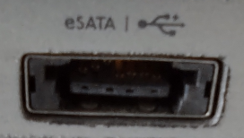
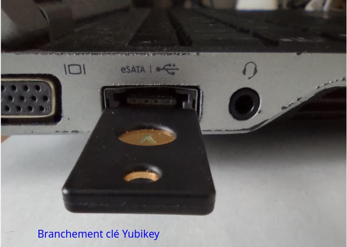
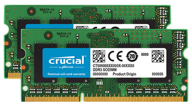
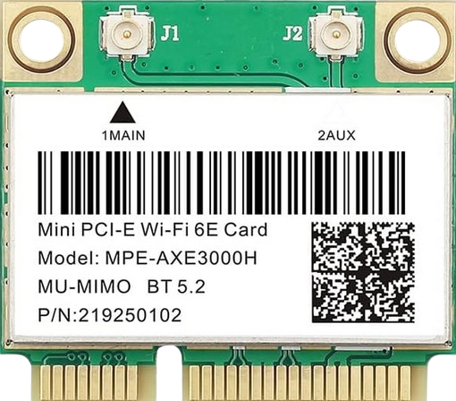

+++
title = 'Portable Dell Latitude E6230 - matériel , documentation et bios'
date = 2024-06-21 00:00:00 +0100
categories = ['archlinux', 'laptop']
+++
## Dell Latitude E6230   

{:width="150"}  

### Caractéristiques générales

* Ecran LCD LED 12,5 pouces HD (résolution 1366 x 768) MAT - Anti-Reflet
* Processeur : Intel Core i5-3320M 2,60 GHz - Turbo : 3,30 Ghz - DMI : 5 GT/s - Cache : 3 Mo - Socket FCBGA1023
* Chipset : Mobile Intel QM77 Express Chipset
* Mémoire Vive : 8GB DDR3 SDRAM
* Disque dur Gigabyte SSD 480Gb
* Carte graphique : Intégrée - Intel HD Graphics 4000
* Carte son : Intégrée - Intel Panther Point PCH - Audio haute définition + haut-parleurs intégrés
* Réseau : Intel 82579LM - Gigabit Lan Ethernet 10/100/1000 Gigabit
* Wifi : Intel Centrino 6205 Wifi 802.11b/g/n
* Lecteur de carte 2-en-1
* Boutons Power, Volume Up / Down

Ports d'E/S:

* 1 x Hi-Speed USB (2.0)/eSATA combo    
{:height="100"} {:height="100"} {:height="100"}
* 2 x Super-Speed USB (3.0)
* 1 x VGA - HD D-Sub (HD-15) 15 broches
* 1 x HDMI
* 1 x Lecteur de cartes mémoires : SD
* 1 x Express Card 34mm &rarr; 2xUSB3.0 ADWITS Express Card
* 1 x Smart Card 
* 1 x Gigabit Ethernet (RJ45) 10/100/1000Mbps
* 1 x Station d'accueil / duplicateur de ports
* 1 x Microphone - entrée/Audio - sortie de ligne/casque

Alimentation,Batterie

* 1 x Alimentation (Chargeur) 100-240V ~ 1.5A, 50-50Hz / 19.5V-4.62A
* 1 x Batterie Li-ion 11.1v 7800mAh(86.6Wh)

Dimensions de l'unité:

* Dimensions : Hauteur : 2,4 cm // Largeur : 30,9 cm // Profondeur : 22,6 cm
* Poids : 1,67 Kg

<u>UPGRADE RAM</u>  
{:width="150"}  
[Mémoires compatibles pour Dell Latitude E6230](https://www.crucial.fr/fra/fr/mise-a-niveau-compatible-avec/Dell/latitude-e6230)  

Crucial 16GB Kit (2 x 8GB) DDR3-1866 SODIMM  
CT2K102464BF186D  
ID de la configuration: CT7785757  
DDR3 PC3-14900 • CL=13 • UNBUFFERED • NON-ECC • DDR3-1866 • 1.35V • 1024MEG X 64 •

<u>UPGRADE Half Mini PCI-E WiFi 6E BT5.2</u>  
*WiFi 6E Half Mini PCI-E WiFi Network Card 802.11AX AC MPE-AXE3000H 2.4GHz 5GHz 6GHz 5400Mbps Wireless Card BT5.2 MU-MIMO Mini PCIe Wi-Fi 6E Adapter OFDMA vPro*  
{:height="150"}

### Documentation et support Latitude e6230

* [Support pour Latitude E6230](http://www.dell.com/support/home/fr/fr/frbsdt1/product-support/product/latitude-e6230/)
* [Installation et caractéristiques](http://downloads.dell.com/Manuals/all-products/esuprt_laptop/esuprt_latitude_laptop/latitude-e6230_Setup%20Guide2_fr-fr.pdf)
* Dell Latitude E6230 Repair Manuals &rarr; https://www.parts-people.com/blog/category/dell-latitude-repair-manuals/latitude-e6230/ 
* [DELL Latitude e6230 ,fichier bios](http://www.dell.com/support/home/us/en/19/Products/?app=drivers)
* [Dell Latitude E6230 Manuel du propriétaire](/files/latitude-e6230_owner's manual_fr-fr.pdf)
* [Fiche technique : Informations sur la configuration et les fonctions ](/files/latitude-e6230_setup guide2_fr-fr.pdf)

**Vidéo : How to disassemble dell Latitude E6230**  
<video width="640" height="480" controls poster="dell-latitude-e6230.png">
  <source src="/files/How_to_disassemble_dell_Latitude_E6230.mp4" type="video/mp4">
</video>

**Vidéo : Keyboard replacement dell Latitude E6230**  
<video width="640" height="480" controls poster="/images/dell-latitude-e6230-keyboard.png">
  <source src="/files/keyboard-replacement.mp4" type="video/mp4">
</video>

### BIOS

Accès bios par touche F2 au démarrage

* BIOS Version A20 du 09/01/2109
* System Configuration
    * Integrated NIC &rarr; Enabled w/PXE (internal LAN enabled with PXE boot)
    * Parallel Port &rarr; Disabled
    * Serial Port &rarr; Disabled
* Wireless
    * Wireless switch &rarr; WWAN,Bluetooth et WLAN sont **DESACTIVES**
    * Wireless Device Enable &rarr; WWAN,Bluetooth et WLAN sont **ACTIVES**

**Mise à jour BIOS**

* [DELL Latitude e6230 ,fichier bios](http://www.dell.com/support/home/us/en/19/Products/?app=drivers)
* [Mise à jour du BIOS Dell dans des environnements Linux et Ubuntu](https://www.dell.com/support/article/fr/fr/frdhs1/sln171755/mise-%C3%A0-jour-du-bios-dell-dans-des-environnements-linux-et-ubuntu?lang=fr)
* [Comment créer un live-USB contenant FreeDOS](https://doc.ubuntu-fr.org/tutoriel/comment_creer_un_live_usb_freedos)
* [Bootable FreeDOS Live image for BIOS upgrade](https://pingtool.org/bootable-dos-iso-bios-upgrade/)

