+++
title = 'Dell Latitude e6230 - EndeavourOS XFCE sur partition LVM entièrement chiffrée + YubiKey'
date = 2024-06-21 00:00:00 +0100
categories = ['archlinux', 'chiffrement', 'lvm']
+++
*EndeavourOS est une distribution GNU/Linux basée sur Arch Linux*

{:width="90"} {:width="150"}  
[Portable Dell Latitude E6230 - matériel , documentation et bios](/posts/Dell_Latitude_E6230_Caracteristiques_generales_Documentation_et_Bios/)


## Création clé EndeavourOS USB Live

Télécharger le dernier fichier iSO <https://endeavouros.com/latest-release/>  
**Endeavouros_Cassini_Nova-03-2023_R3.iso** et **Endeavouros_Cassini_Nova-03-2023_R3.iso.sha512sum**

Vérifier checksum

```
sha512sum -c Endeavouros_Cassini_Nova-03-2023_R3.iso.sha512sum
```

**Endeavouros_Cassini_Nova-03-2023_R3.iso: Réussi**

Créer la clé bootable  
Pour savoir sur quel périphérique, connecter la clé sur un port USB d'un ordinateur et lancer la commande `sudo dmesg`  
Dans le cas présent , le périphérique est **/dev/sde**

```
sudo dd if=Endeavouros_Cassini_Nova-03-2023_R3.iso of=/dev/sde bs=4M
```

`Installer une distribution EndeavourOS sur une partition LVM est impossible avec l'outil "Calamarès"`{: .prompt-warning }

## Installation EndeavourOS XFCE sur partition LVM entièrement chiffrée

[Portable Dell Latitude E6230 - matériel , documentation et bios](/posts/Dell_Latitude_E6230_Caracteristiques_generales_Documentation_et_Bios/)

### Installation via USB LIVE

Démarrage avec la clé USB insérée dans le portable DELL Latitude e6230 et appui sur F12 pour un accès au menu  
Choisir UEFI specific storage

Vous arrivez sur la page de sélection  
{:width="400"}  
Valider le choix par défaut

Changer le clavier en FR  
{:width="600"}  
{:width="400"}  
{:width="200"}  
Supprimer **English(US)** pour ne garder que **French** et **Close**

Ouvrir un **Terminal Emulator** dans le live endeavour  
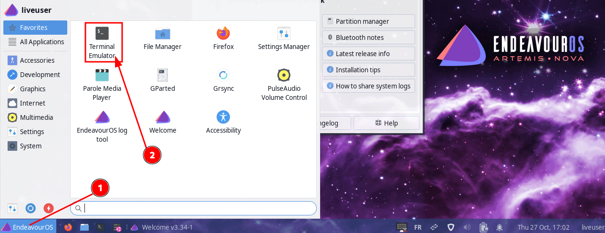{:width="600"}

### Partionner un disque

en mode su

```
sudo -s
```

Le disque : `lsblk`

```
sda         8:0    0 447.1G  0 disk 
```

On partitionne un disque en 3 avec `gdisk`

* Partition 1 : 512M EFI (code ef00) système de fichier FAT32
* Partition 2 : 438G LVM (code 8e00) système de fichier EXT4
* Partition restante pour Installation temporaire

Zapper le disque,

(**Attention** Ceci effacera de manière irréversible toutes les données de votre disque, veuillez sauvegarder toutes les données importantes) :

```
sgdisk --zap-all /dev/sda
# OU
wipefs -a /dev/sda
```

Créer une table de partition GPT à l'aide de la commande `sgdisk` :

```
sgdisk --clear --new=1:0:+550MiB --typecode=1:ef00 --new=2:0:+438G --typecode=2:8e00 /dev/sda

```

Format la partition EFI

```
mkfs.fat -F32 /dev/sda1 
```

### Installer EndeavourOS sur une partition temporaire

Lancer l'installation  
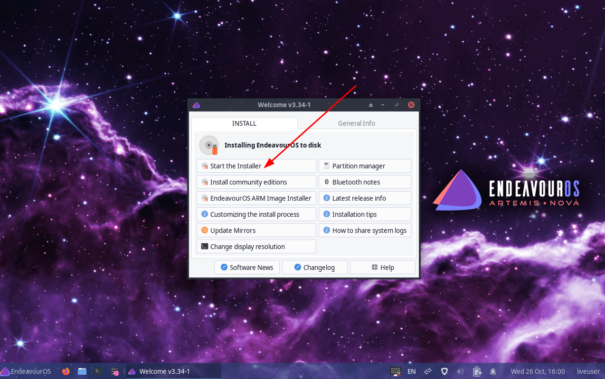{:width="600"}

{:width="600"}  
Choix du "pas en ligne"

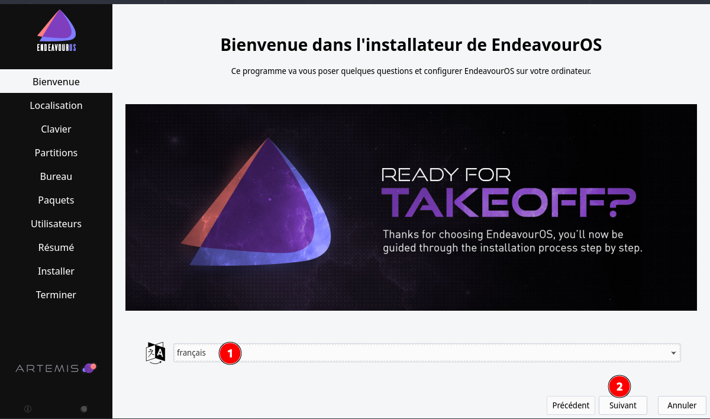{:width="600"}  
Français

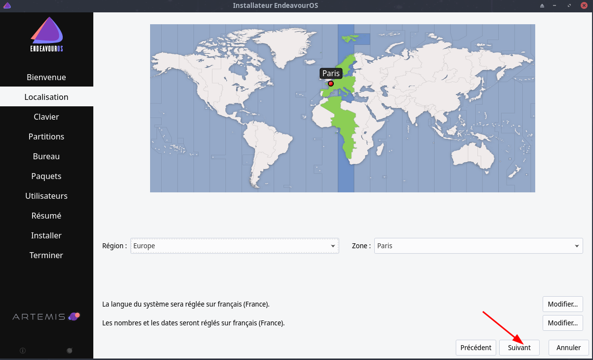{:width="600"}

{:width="600"}

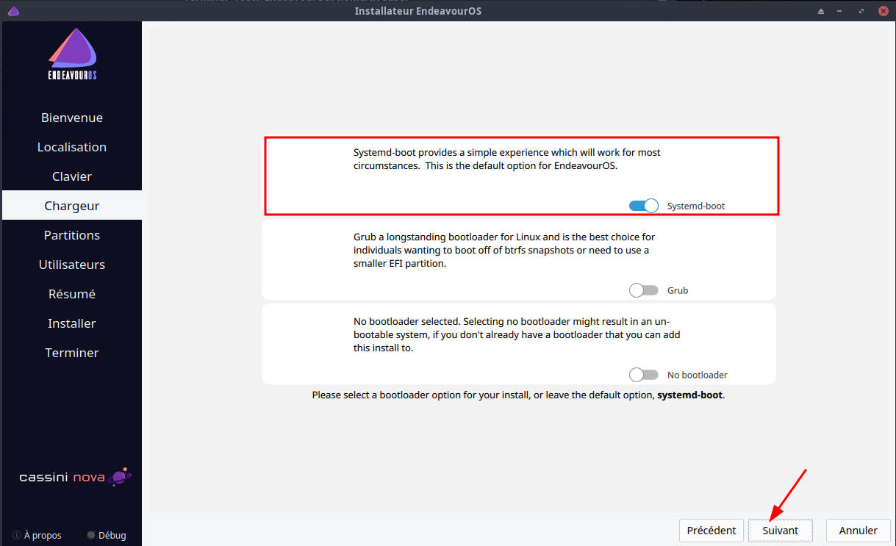{:width="600"}

{:width="600"}

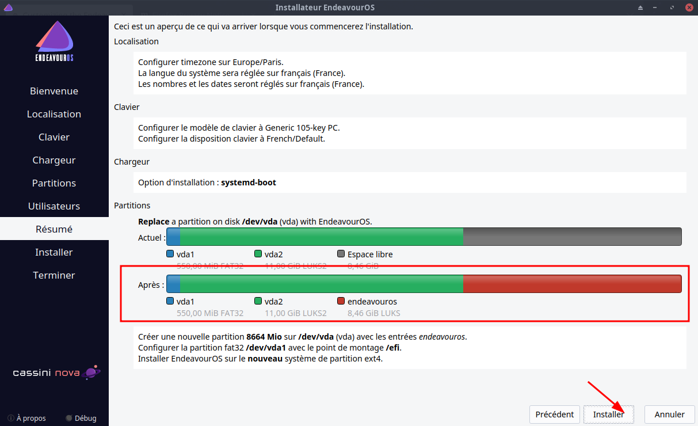

Renseigner nom identifiant nom ordi et mot de passe (mp idem pour root)  
Laissez Calamares terminer l'installation.

L'installation démarre  
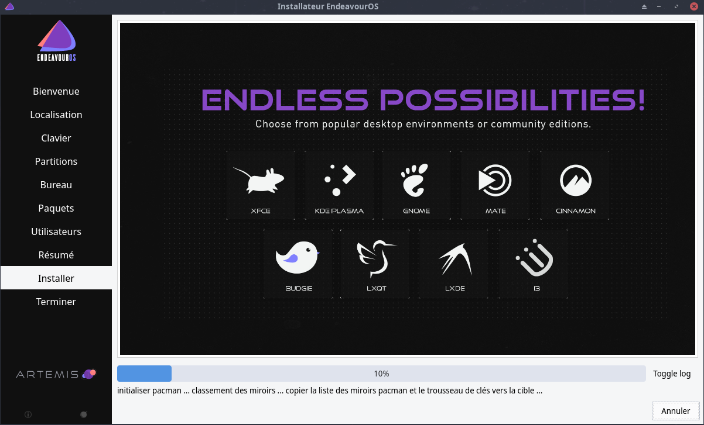{:width="600"}  
Installation en cours, patienter ...

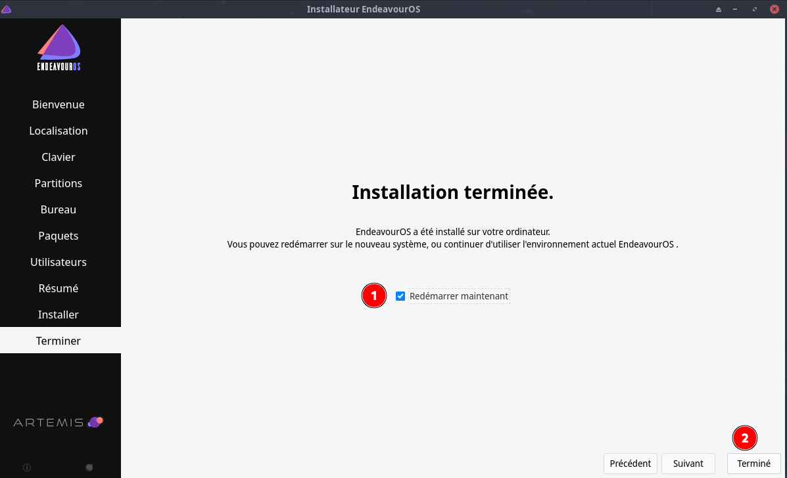{:width="600"}  
L'installation est terminée, cliquer "Redémarrer maintenant" et sur **Terminé**, oter la clé USB,  et redémarrer sur endeavour

Vérifiez si vous pouvez accéder au système crypté.
Vous devriez maintenant avoir un système crypté LUKS (sans les trucs amusants comme les volumes logiques, la partition /home séparée, etc.).

`Réinsérer la clé USB et redémarrer dans l'environnement Live-Cd`{: .prompt-info }

Commuter le clavier en FR  
Ouvrir un terminal et basculer en mode su : `sudo -s`

**Facultatif**  
Pour un accès sur la machine via SSH depuis un poste distant  
Lancer le service : `sudo systemctl start sshd`  
Ouvrir le port 22 firewall: `sudo firewall-cmd --zone=public --add-port=22/tcp --permanent`  
Créer un mot de passe à liveuser : `passwd liveuser`
Relever l'adresse ip de la machine : `ip a`

### Convertir Déchiffrer et monter le système temporaire

Le système temporaire chiffré /dev/sda3

Conversion chiffrement luks2

```
cryptsetup convert /dev/sda3 --type luks2
```

```
WARNING!
========
This operation will convert /dev/sda3 to LUKS2 format.


Are you sure? (Type 'yes' in capital letters): YES
```

Confirmer par la saisie YES

Dans l'environnement live-CD, ouvrez un Terminal ,basulez en mode su et tapez (ou marquez et copiez la ligne avec ctrl-c et collez dans le terminal avec shift-ctrl-v ) …

```shell
cryptsetup luksOpen /dev/sda3 crypttemp # saisir la phrase mot de passe de l'installation
mkdir -p /media/crypttemp
mount /dev/mapper/crypttemp /media/crypttemp 
```

Nos données d'installation temporaires sont désormais accessibles sous `/media/crypttemp` et peuvent être copiées sur le nouveau système que nous allons mettre en place dans les prochaines étapes.

### Configurer le nouveau système LVMonLUKS

Chiffrer la partition /dev/sda2,saisrr la passphrase définitive

```shell
cryptsetup luksFormat --type luks2 /dev/sda2
```

Une demande de confirmation est exigée

```
WARNING!
========
This will overwrite data on /dev/sda2 irrevocably.

Are you sure? (Type 'yes' in capital letters): YES
Enter passphrase for /dev/sda2: 
Verify passphrase: 
```

Choisissez un mot de passe sécurisé ( <https://xkcd.com/936/> )

```shell
cryptsetup luksOpen /dev/sda2 crypt
    Enter passphrase for /dev/sda2:
pvcreate /dev/mapper/crypt
    Physical volume "/dev/mapper/crypt" successfully created.
vgcreate vg0 /dev/mapper/crypt
    Volume group "vg0" successfully created
```

Une bonne taille de départ pour le volume racine (lvroot) est d'environ 30 Go. Si vous envisagez d'utiliser ultérieurement un fichier d'échange résidant sur root, vous devez en tenir compte.  
Le redimensionnement ultérieur des volumes est assez facile, alors n'y réfléchissez pas trop.  
Vous pouvez attribuer tout l'espace libre restant au volume d'accueil,  
`lvcreate --extents 100%FREE vg0 -n lvhome`  
mais pour augmenter les volumes plus tard et pour les instantanés , il faut de l'espace vide à l'intérieur du groupe de volumes, donc je choisis généralement une taille pour lvhome qui laisse environ 30 Go d'espace inutilisé global dans le volume groupe (en supposant un lecteur de 500 Go, par exemple 500 – 0,512 – 40 – 430 = 29,488)

```shell
# 40G root dont 8 swapfile
lvcreate -L 40G vg0 -n lvroot   #  Logical volume "lvroot" created.
lvcreate -L 110G vg0 -n lvhome  #  Logical volume "lvhome" created.
lvcreate -l 100%FREE vg0 -n lvhome  #  Logical volume "lvhome" created.
```

Créez un système de fichiers ext4 sur les volumes logiques.

```shell
mkfs.ext4 -L root /dev/mapper/vg0-lvroot
mkfs.ext4 -L home /dev/mapper/vg0-lvhome
```

### Monter le nouveau système sur "mnt"

Monter le nouveau système sur `/mnt` pour les systèmes UEFI

```shell
mount /dev/mapper/vg0-lvroot /mnt
mkdir -p /mnt/home
mount /dev/mapper/vg0-lvhome /mnt/home
mkdir -p /mnt/efi
mount /dev/sda1 /mnt/efi
```

```
lsblk
```

devrait maintenant fournir une sortie similaire à la suivante (ignorez les tailles, celles-ci proviennent d'une installation de test) …

pour les systèmes UEFI :

```
NAME             MAJ:MIN RM   SIZE RO TYPE  MOUNTPOINTS
loop0              7:0    0   1.7G  1 loop  /run/archiso/airootfs
sda                8:0    0 111.8G  0 disk  
├─sda1             8:1    0   550M  0 part  /mnt/efi
├─sda2             8:2    0   100G  0 part  
│ └─crypt        254:1    0   100G  0 crypt 
│   ├─vg0-lvroot 254:2    0    40G  0 lvm   /mnt
│   └─vg0-lvhome 254:3    0    60G  0 lvm   /mnt/home
└─sda3             8:3    0  11.3G  0 part  
  └─crypttemp    254:0    0  11.3G  0 crypt /media/crypttemp
sdb                8:16   1   3.7G  0 disk  
├─sdb1             8:17   1   1.8G  0 part  /run/archiso/bootmnt
└─sdb2             8:18   1   113M  0 part  
```

### Copier le système temporaire

pour vider les nouveaux points de montage

```
rsync -avA /media/crypttemp/ /mnt
```

*Veuillez patienter quelques minutes*

### Démonter le système temporaire

```shell
umount /media/crypttemp
cryptsetup luksClose crypttemp
```

### Ajouter un fichier de clé existant LUKS

Nous allons maintenant ajouter une deuxième clé saisie à la création chiffrement sur /dev/sda2  
Nous ferons référence à cette clé à l'étape suivante.

```
cryptsetup luksAddKey /dev/sda2 /mnt/crypto_keyfile.bin 
```

### Configurer "crypttab"

Configuration `/etc/crypttab`

```
cryptsetup luksUUID /dev/sda2
```

renvoie **0b5f9165-989d-4211-9734-7303c9bd771b**  
Votre UUID sera différent, alors <u>**assurez-vous d'utiliser votre UUID à l'étape suivante !**</u>

```
nano /mnt/etc/crypttab
```

contient une ligne non commentée commençant par `luks-`...  
Remplacez cette ligne par la suivante ; <u>**n'oubliez pas d' utiliser votre UUID**</u>

```
cryptlvm UUID=0b5f9165-989d-4211-9734-7303c9bd771b /crypto_keyfile.bin luks
```

Sauvegarder et quitter.

### Basculer en chroot

Passer en chroot

```
arch-chroot /mnt
```

### Configurer "fstab"

Configurer /etc/fstab

```
blkid -s UUID -o value /dev/mapper/vg0-lvroot
```

renvoie l'UUID du volume racine :  **e2e8bb75-02b8-4cf9-aa76-b793e91c431c**.

```
blkid -s UUID -o value /dev/mapper/vg0-lvhome
```

renvoie l'UUID du volume d'accueil : **d8ae2ca4-2c2c-409a-9d49-243dcde32ec7**.

```
nano /etc/fstab
```

contient une ligne commençant par `/dev/mapper/luks-`...  
**Supprimez** cette ligne et ajoutez ce qui suit (<u>**n'oubliez pas d' utiliser vos UUID**</u>)

```
UUID=e2e8bb75-02b8-4cf9-aa76-b793e91c431c / ext4 defaults,acl,noatime,discard 0 0
UUID=d8ae2ca4-2c2c-409a-9d49-243dcde32ec7 /home ext4 defaults,acl,noatime,discard 0 0
```

Sauvegarder et quitter.

### Ajout fichier échange

Utilisez dd pour créer un fichier d'échange de la taille de votre choix.  
Création d'un fichier d'échange de 8192 Mo (pour tous les systèmes de fichiers)

```
dd if=/dev/zero of=/swapfile bs=1M count=8192 status=progress
```

Remplacez `count=8192` par la quantité de Mo que vous souhaitez installer pour l'utilisation du fichier d'échange :

```
chmod 600 /swapfile
```

Pour donner au fichier d'échange des permissions de racine seulement.

```
mkswap /swapfile
```

Pour faire du fichier un espace de pagination et enfin pour activer le fichier :

```
swapon /swapfile
```

Modifier /etc/fstab pour activer le fichier d'échange

```
nano /etc/fstab
```

Ajoutez la ligne suivante…

```
/swapfile                                 none  swap defaults,pri=-2 0 0
```

Sauvegarder et quitter.

> Remarque : le fichier d'échange doit être spécifié par son emplacement sur le système de fichiers, et non par son UUID ou son LABEL.

pour vérifier :

```
swapon --show
```

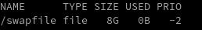

### Modifier les options du noyau


Dans **systemd-boot**, vous éditez le fichier d'entrée approprié qui se trouve sur votre partition EFI dans le répertoire `loader/entries`  
Chaque entrée est une option de démarrage dans le menu et chacune a une ligne appelée options. Vous pouvez modifier ces entrées directement, mais ces changements peuvent être écrasés lors de l'installation ou de la mise à jour de paquets.


Pour effectuer les changements, au lieu de modifier les entrées, modifiez le fichier `/etc/kernel/cmdline` qui est un fichier d'une ligne contenant une liste d'options du noyau.  

    nano /etc/kernel/cmdline

UUID de /dev/sda2 : `blkid -s UUID -o value /dev/sda2`

```
nvme_load=YES nowatchdog rw rd.luks.uuid=2c8e7bb4-9286-47e9-8823-12b79bf2810c root=/dev/mapper/vg0-lvroot
```

Exécutez ensuite `sudo reinstall-kernels` qui remplira les entrées et régénérera les initrds.

    reinstall-kernels

### Sortie du chroot et démontage

```
exit
umount -R /mnt
```

### Redémarrez sur le système LVMonLUKS chiffré

Oter la clé USB , redémarrer

```
reboot
```

`FINI! Vous devriez maintenant avoir un système LVMonLUKS fonctionnel avec un volume logique séparé pour /home`{: .prompt-info }

## EndeavourOS XFCE

### Mise à jour Système

Mode graphique  
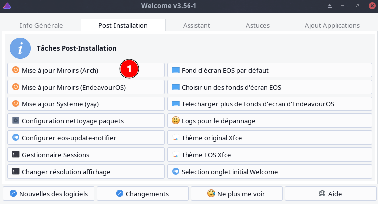{:width="400"}  
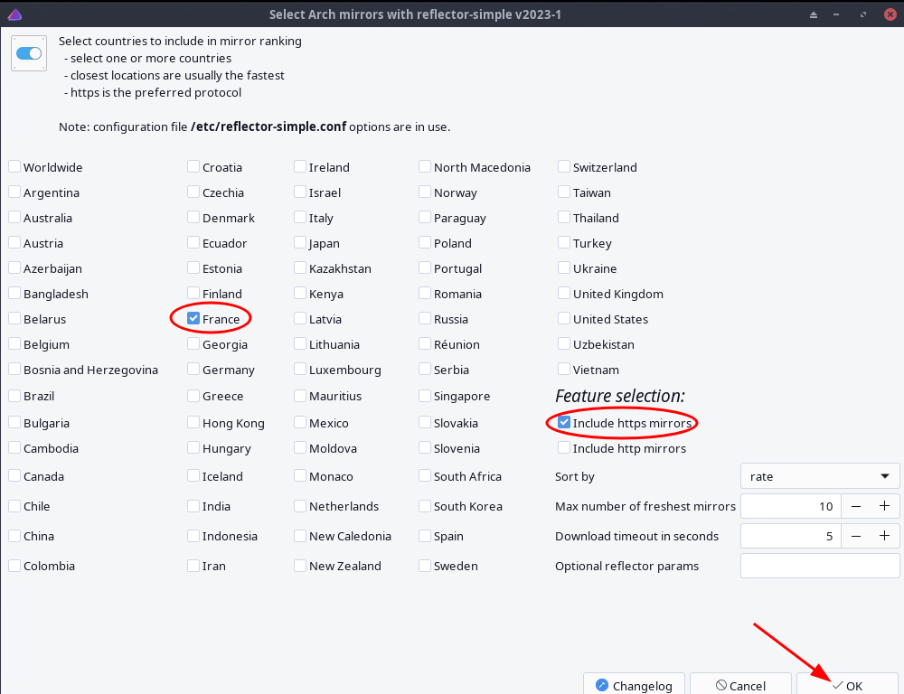{:width="400"}  
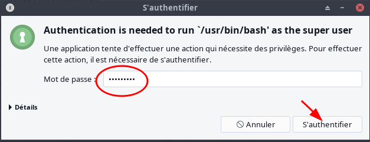{:width="300"}

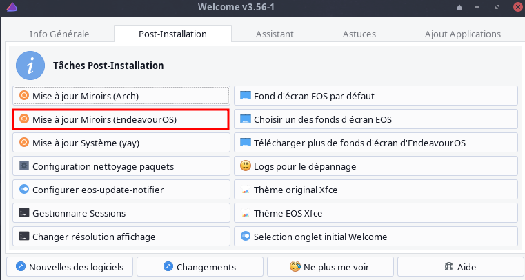{:width="400"}  
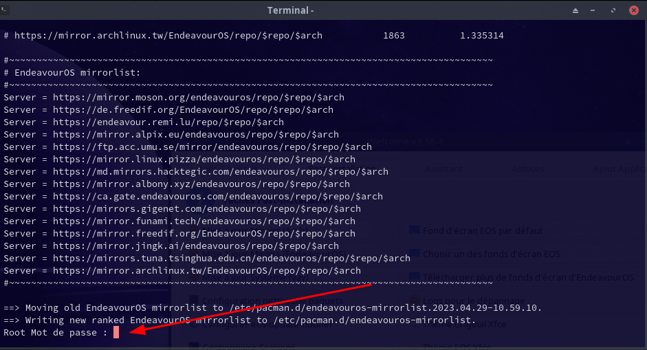{:width="400"}  
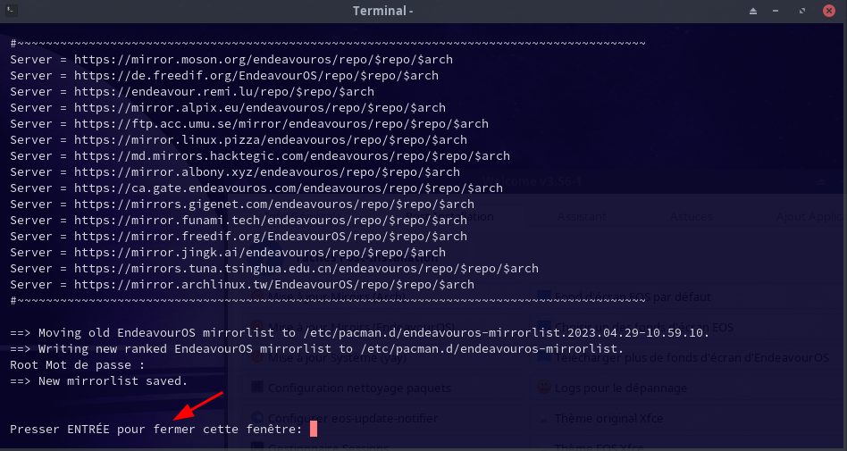{:width="300"}

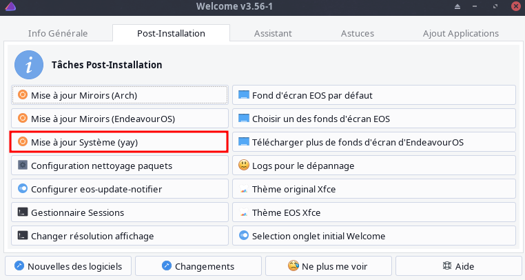{:width="400"}  
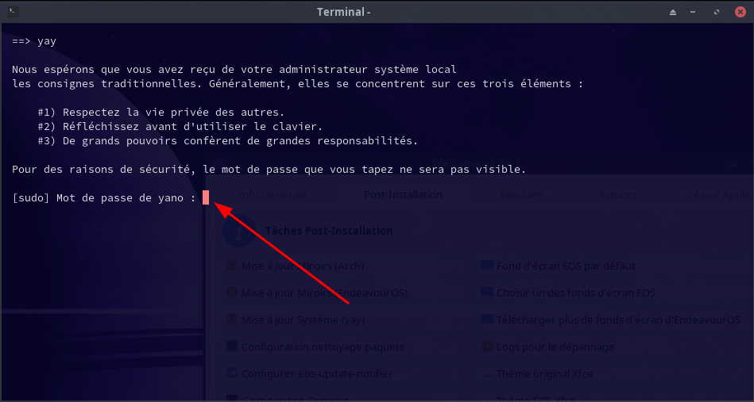{:width="400"}  
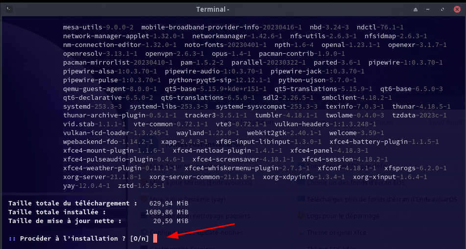{:width="300"}  
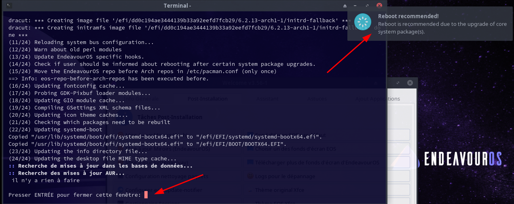{:width="400"}

Résumé  
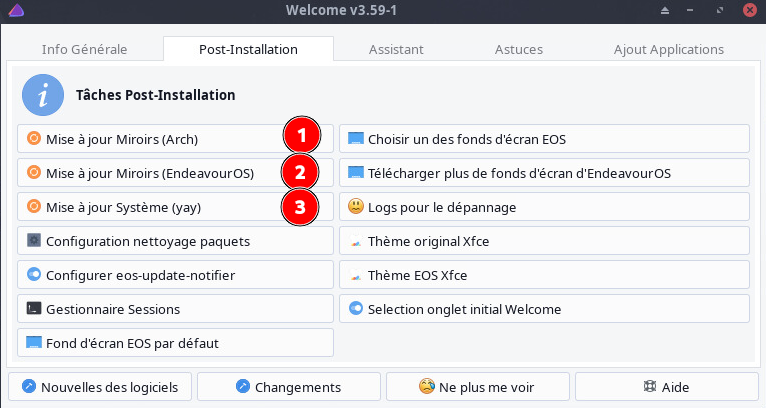

### Déverrouillage des volumes LUKS2

Description

* Slot 0 pour le déverrouillage du volume par saisie d'une phrase mot de passe.
* Slot 1 et 2 pour le déverrouillage par des clés (2 ième clé en cas de perte ou casse) avec un appui sur une touche.
* Slot 3 - Ajout d'une phrase mot de passe pour le recovery

Au final nous aurons 4 "slot" utilisés

Installer librairie libfido2 pour la prise en charge des clés Yubico et SoloKeys

```
sudo pacman -S libfido2
```

#### Enroler clé USB YubiKey 5 NFC

{:height="150"}

Vérifier que la YubiKey est insérée dans un port USB

Lister et enroler la yubikey

```
systemd-cryptenroll --fido2-device=list
```

```
PATH         MANUFACTURER PRODUCT              
/dev/hidraw4 Yubico       YubiKey OTP+FIDO+CCID
```

Enroler la clé pour le déverrouillage du disque chiffré /dev/sda2

```
sudo systemd-cryptenroll --fido2-device=auto /dev/sda2
```

```
🔐 Please enter current passphrase for disk /dev/sda2: *********************   
Requested to lock with PIN, but FIDO2 device /dev/hidraw4 does not support it, disabling.
Initializing FIDO2 credential on security token.
👆 (Hint: This might require confirmation of user presence on security token.)
Generating secret key on FIDO2 security token.
👆 In order to allow secret key generation, please confirm presence on security token.
New FIDO2 token enrolled as key slot 1.
```

Le **Y** de la clé se met à clignoter , il suffit de poser son doigt sur l'emplacement du **Y** pour le déverrouillage
{: .prompt-info }

Retirer la première clé et insérer la seconde clé USB YubiKey 5 NFC, puis exécuter la commande

```
sudo systemd-cryptenroll --fido2-device=auto /dev/sda2
```

```
🔐 Please enter current passphrase for disk /dev/sda2: *********************   
Requested to lock with PIN, but FIDO2 device /dev/hidraw4 does not support it, disabling.
Initializing FIDO2 credential on security token.
👆 (Hint: This might require confirmation of user presence on security token.)
Generating secret key on FIDO2 security token.
👆 In order to allow secret key generation, please confirm presence on security token.
New FIDO2 token enrolled as key slot 2.
```

#### Enroler une passphrase de recouvrement (OPTION)

Les jetons et puces de sécurité FIDO2, PKCS#11 et TPM2 s'associent bien avec les clés de recouvrement : puisque vous n'avez plus besoin de taper votre mot de passe tous les jours, il est logique de vous en débarrasser et d'enregistrer à la place une clé de recouvrement à forte entropie que vous imprimez ou scannez hors écran et conservez dans un endroit physique sûr.  
Voici comment procéder :

```
sudo systemd-cryptenroll --recovery-key /dev/sda2
```

```
🔐 Please enter current passphrase for disk /dev/nvme0n1p2: ***********             
A secret recovery key has been generated for this volume:

    🔐 vbcrnbjn-vkrkihte-rctbufne-nlihihjl-tegudteu-rkjthcgd-hvhuvgik-rugeregh

Please save this secret recovery key at a secure location. It may be used to
regain access to the volume if the other configured access credentials have
been lost or forgotten. The recovery key may be entered in place of a password
whenever authentication is requested.
New recovery key enrolled as key slot 3.
```

Cette opération génère une clé, l'enregistre dans le volume LUKS2, l'affiche à l'écran et génère un code QR que vous pouvez scanner en dehors de l'écran si vous le souhaitez.  
La clé possède la plus grande entropie et peut être saisie partout où vous pouvez saisir une phrase d'authentification.  
C'est pourquoi il n'est pas nécessaire de modifier le fichier /etc/crypttab pour que la clé de récupération fonctionne.

#### Enroler une clé USB SoloKeys (OPTION)


Lister la clé

```
systemd-cryptenroll --fido2-device=list
```

```
PATH         MANUFACTURER PRODUCT   
/dev/hidraw1 SoloKeys     Solo 4.1.5
```

Ajout de la solokeys

```
sudo systemd-cryptenroll --fido2-device=auto /dev/sda2
```

```
🔐 Please enter current passphrase for disk /dev/sda2: ***********             
Requested to lock with PIN, but FIDO2 device /dev/hidraw1 does not support it, disabling.
Initializing FIDO2 credential on security token.
👆 (Hint: This might require confirmation of user presence on security token.)
Generating secret key on FIDO2 security token.
👆 In order to allow secret key generation, please confirm presence on security token.
New FIDO2 token enrolled as key slot 3.
```

Lors du boot , le **S** de la SoloKeys passe au ROUGE et il suffit d'appuyer sur le voyant pour qu'il repasse  au vert afin de lancer le processus de déchiffrement et finir le démarrage
{: .prompt-info }

### Prise en charge YubiKey (OPTION)

Les options timeout de [crypttab](https://www.man7.org/linux/man-pages/man5/crypttab.5/)

```
timeout=
           Spécifie le délai d'attente pour la demande d'un mot de passe. Si aucune unité
           n'est spécifiée, l'unité utilisée est la seconde. Les unités prises en charge sont s, ms, us,
           min, h, d. Un délai de 0 permet d'attendre indéfiniment (valeur par défaut).

token-timeout=
           Spécifie le temps d'attente maximum pour que les dispositifs de sécurité configurés (c'est-à-dire FIDO2, PKCS#11, TPM2) apparaissent.
           configurés (c'est-à-dire FIDO2, PKCS#11, TPM2). Prend une valeur
           en secondes (mais d'autres unités de temps peuvent être spécifiées,
           voir systemd.time(7) pour les formats supportés). La valeur par défaut est 30s.
           Une fois le délai spécifié écoulé, l'authentification par
           mot de passe est tentée. Notez que ce délai s'applique à
           l'attente de l'apparition du dispositif de sécurité - il ne s'applique pas
           ne s'applique pas à la demande de code PIN pour le dispositif (le cas échéant)
           ou autre. Passez 0 pour désactiver le délai et attendre indéfiniment.
```

Configurer /etc/crypttab

```
sudo nano /etc/crypttab
```

```
# <name>               <device>                         <password> <options>
#cryptlvm UUID=0b5f9165-989d-4211-9734-7303c9bd771b /crypto_keyfile.bin luks
cryptlvm UUID=0b5f9165-989d-4211-9734-7303c9bd771b - fido2-device=auto,token-timeout=20s
```

Sauvegarder et quitter.

Réinitialiser

```
sudo reinstall-kernels
```

`Redémarrer la machine`{: .prompt-info }

### Historique de la ligne de commande  

Ajoutez la recherche d’historique de la ligne de commande au terminal  
Se connecter en utilisateur  
Tapez un début de commande précédent, puis utilisez shift + up (flèche haut) pour rechercher l’historique filtré avec le début de la commande.

```shell
# Global, tout utilisateur
echo '"\e[1;2A": history-search-backward' | sudo tee -a /etc/inputrc
echo '"\e[1;2B": history-search-forward' | sudo tee -a /etc/inputrc
```

### Activation SSH avec clés

**Etablir une liaison temporaire SSH**

Pour un accès sur la machine via SSH depuis un poste distant  
Lancer et activer le service : `sudo systemctl enable sshd --now`  
Ouvrir le port 22 firewall: `sudo firewall-cmd --zone=public --add-port=22/tcp`  
Relever l'adresse ip de la machine : `ip a`  192\.168.0.22 dans notre cas

Se connecter depuis un poste distant `ssh yano@192.168.0.22`

**SSH avec clés**

**A - Poste appelant**  
Générer une paire de clé curve25519-sha256 (ECDH avec Curve25519 et SHA2) nommé **e6230** pour une liaison SSH avec le portable E6230.

```
ssh-keygen -t ed25519 -o -a 100 -f ~/.ssh/e6230
```

Envoyer les clés depuis le poste distant

```
ssh-copy-id -i ~/.ssh/e6230.pub yano@192.168.0.22
```

On se connecte sur la machine

    ssh yano@192.168.0.22

**B - Dell Latitude e6230**  
Modification fichier configuration ssh sur le dell e6230 pour le port

```
sudo nano /etc/ssh/sshd_config
```

```
Port 56230
PasswordAuthentication	no
```

`IL FAUT ACTIVER LE PORT 56230 EN ZONE "PUBLIC" DU PAREFEU !`{: .prompt-warning }

Ajouter le nouveau port à la zone configurée de firewalld ("public" par défaut).

```shell
sudo firewall-cmd --zone=public --add-port=56230/tcp --permanent
sudo systemctl restart firewalld
```

Redémarrer sshd

```bash
sudo systemctl restart sshd
```

Se connecter depuis le poste appelant

```
ssh yano@192.168.0.22 -p 56230 -i /home/yann/.ssh/e6230
```

Ouvrir un terminal

**Motd**

```
sudo nano /etc/motd
```

```
  _____             _                                          ___   ____  
 | ____| _ __    __| |  ___   __ _ __   __ ___   _   _  _ __  / _ \ / ___| 
 |  _|  | '_ \  / _` | / _ \ / _` |\ \ / // _ \ | | | || '__|| | | |\___ \ 
 | |___ | | | || (_| ||  __/| (_| | \ V /| (_) || |_| || |   | |_| | ___) |
 |_____||_| |_| \__,_| \___| \__,_|  \_/  \___/  \__,_||_|    \___/ |____/ 
  ____         _  _    _            _    _  _               _              
 |  _ \   ___ | || |  | |     __ _ | |_ (_)| |_  _   _   __| |  ___        
 | | | | / _ \| || |  | |    / _` || __|| || __|| | | | / _` | / _ \       
 | |_| ||  __/| || |  | |___| (_| || |_ | || |_ | |_| || (_| ||  __/       
 |____/  \___||_||_|  |_____|\__,_| \__||_| \__| \__,_| \__,_| \___|       
         __   ____   _____   ___                                           
   ___  / /_ |___ \ |___ /  / _ \                                          
  / _ \| '_ \  __) |  |_ \ | | | |                                         
 |  __/| (_) |/ __/  ___) || |_| |                                         
  \___| \___/|_____||____/  \___/                                          
```

Modifier sudoers pour accès sudo sans mot de passe à l'utilisateur **yano**

```shell
su               # mot de passe root identique utilisateur
echo "yano     ALL=(ALL) NOPASSWD: ALL" >> /etc/sudoers.d/20-yano
```

### Créer les dossiers "utilisateur"

Créer les dossiers `.keepassx` , `Notes` , `scripts` `statique/images` et `statique/_posts`

```bash
mkdir -p ~/{.ssh,.keepassx,scripts,media}
mkdir -p ~/media/statique/{images,_posts}
mkdir -p ~/Documents/Dossiers-Locaux-Thunderbird
mkdir -p ~/media/Notes
# Lien pour affichage des images avec éditeur Retext
sudo ln -s /home/yano/media/statique/images /images
```

### Modification clavier portable

*Manipulations à effectuer sur un terminal de la machine*  
Pas de touches ">" "<" sur clavier ex Qwerty du portable Dell Latitude e6230  
La commande suivante permet d'afficher la disposition actuelle de votre clavier

```
xmodmap -pke
```

Sur un clavier normal Azerty

```
keycode  94 = less greater less greater bar brokenbar bar
```

Sur le clavier du portable on va utiliser la touches `²` et shift `²`  keycode 49  
Pour modifier la fonction d'une touche on invoque simplement xmodmap avec en argument la chaîne de caractères que l'on souhaite modifier :

```
xmodmap -e "keycode  49 = less greater less greater bar brokenbar bar"
```

**Pour rendre les modifications permanentes** ,créer ou modifier **~/.xmodmap.conf** et ajouter

```
echo "keycode 49 = less greater less greater bar brokenbar bar" >> ~/.xmodmap.conf
```

<u>Exécuter au lancement de la session</u>  
Menu → Paramètres → Session et démarrage ,onglet **Démarrage automatique d'application**  
Clique sur **\+** :  
Nom : **Modif clavier**  
Description : **attribution touche**  
Commande : **/usr/bin/xmodmap /home/yano/.xmodmap.conf**  
Déclencher : à la connexion  
Puis cliquer sur **OK**

Déconnexion/Reconnexion utilisateur pour prise en charge

### Paramètres XFCE

On déplace le **tableau de bord** du bas vers le haut de l'écran

Modification du **tableau de bord** , clic-droit → Tableau de bord → Préférences de tableau de bord → Eléments

Affichage date et heure  
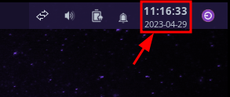  
ou **format personnalisé** dans **Horloge** : `%e %b %Y %R`

**Options**

* Gestionnaire d'alimentation (Batterie et Branché)  
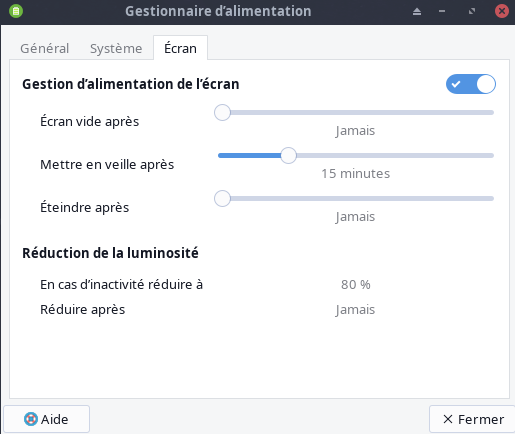{:width="400"}
* Les fonds d'écran (1366x768) -->  `/usr/share/endeavouros/backgrounds/`
* Démarre auto ou pas de la session, modifier le fichier `/etc/lightdm/lightdm.conf`

        sudo nano /etc/lightdm/lightdm.conf

        [Seat:*]  
        autologin-user=yano

* Ecran de veille (FACULTATIF)  
**On remplace l'application **xfce4-screensaver** (goodies) par **xscreensaver**

        sudo pacman -R xfce4-screensaver  
        sudo pacman -S xscreensaver


    ATTENTION! Il faut supprimer quelques fichiers pour un avoir un menu xfce plus propre.  
`sudo rm /usr/share/applications/xscreensaver.desktop`  
`rm ~/.gnome/apps/xscreensaver.desktop`  

* Catégorie Settings uniquement   
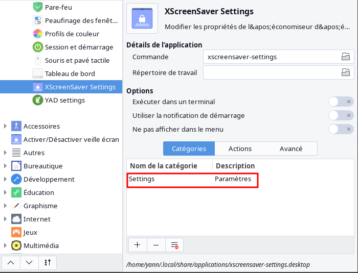{:width="300"}

* Préférences économiseur écran **XScreenSaver Settings**
    - Considérer l'ordinateur inactif après: 20 min
    - Verrouillage écran INACTIF

### Lecteur carte à puce + NFC

*comment configurer votre système pour utiliser un lecteur de carte à puce*

Installez ccid et opensc à partir des référentiels officiels

```
sudo pacman -S ccid opensc
```

Si le lecteur de carte ne dispose pas d'un clavier NIP, définissez `enable_pinpad = false` dans le fichier de configuration opensc **/etc/opensc.conf**

Démarrer le service pcscd.service

```
sudo systemctl start pcscd.service # démarrer
```

> **Conseil**: Si vous obtenez le `Failed to start pcscd.service: Unit pcscd.socket not found`. erreur `Failed to start pcscd.service: Unit pcscd.socket not found`. , rechargez simplement les unités systemd avec cette commande `systemctl daemon-reload`

Status

```
sudo systemctl status pcscd.service 
```

```
● pcscd.service - PC/SC Smart Card Daemon
     Loaded: loaded (/usr/lib/systemd/system/pcscd.service; indirect; preset: disabled)
     Active: active (running) since Fri 2023-05-12 18:24:39 CEST; 10s ago
TriggeredBy: ● pcscd.socket
       Docs: man:pcscd(8)
   Main PID: 2386 (pcscd)
      Tasks: 6 (limit: 19046)
     Memory: 1.4M
        CPU: 61ms
     CGroup: /system.slice/pcscd.service
             └─2386 /usr/bin/pcscd --foreground --auto-exit

mai 12 18:24:39 e6230 systemd[1]: Started PC/SC Smart Card Daemon.
```

Activation

```
sudo systemctl enable pcscd.service
```

lecteur de carte `pcsc-tools`

```
sudo pacman -S pcsc-tools
```

et lancez l’utilitaire `pcsc_scan` , puis (connectez le lecteur de carte à puce si non interne) insérez une carte. Si vous voyez une sortie comme celle-ci, le lecteur de carte à puce ainsi que la carte ont été reconnus avec succès.

```
Mon Jul 29 14:43:50 2019
 Reader 0: Broadcom Corp 5880 [Contacted SmartCard] (0123456789ABCD) 00 00
  Event number: 2
  Card state: Card inserted, 
  ATR: 3B DA 18 FF 81 B1 FE 75 1F 03 00 31 C5 73 C0 01 40 00 90 00 0C

[...]
Possibly identified card (using /usr/share/pcsc/smartcard_list.txt):
3B DA 18 FF 81 B1 FE 75 1F 03 00 31 C5 73 C0 01 40 00 90 00 0C
	OpenPGP Card V2
```

Activer le service pcscd.service

```
sudo systemctl enable pcscd.service # activer
```

Vérifier également la lecture NFC

### VNC

*Se connecter VNC via SSH*

#### Portable DELL Latitude e6230

installer x11vnc

```
yay -S x11vnc
```

Générer un mot de passe dans le dossier root

```shell
sudo -s
x11vnc -storepasswd "mot_de_passe" /root/.vnc_passwd
exit
```

*stored passwd in file: /root/.vnc_passwd*

Ajouter le nouveau port 5900 à la zone configurée de firewalld ("public" par défaut).

```shell
sudo firewall-cmd --zone=public --add-port=5900/tcp --permanent
sudo systemctl restart firewalld
```

Lancement manuel en console et en session utilisateur pour valider et enregistrer le mot de passe VNC

```shell
sudo x11vnc -xkb -noxrecord -noxfixes -noxdamage -display :0 -auth /var/run/lightdm/root/:0 -usepw
```

Saisir le mot de passe VNC 2 fois ( la seconde pour vérification) et répondre `y` pour écriture

```
Enter VNC password: 
Verify password:    
Write password to /root/.vnc/passwd?  [y]/n y
```

Arrêt par Ctrl+C

#### Poste Appelant

<u>Première fenêtre de terminal</u>

Tunnel SSH  
Utilisez le drapeau `-localhost` avec **x11vnc** pour qu’il se lie à l’interface locale.  
Une fois que c’est fait, vous pouvez utiliser SSH pour tunneliser le port ; puis, connectez-vous à VNC via SSH.

```shell
# SSH avec clés
ssh -f -L 5900:localhost:5900 -p 56230 -i ~/.ssh/e6230 yano@192.168.0.20 'sudo x11vnc -xkb -noxrecord -noxfixes -noxdamage -display :0 -auth /var/run/lightdm/root/:0 -usepw'
```

<u>Seconde fenêtre de terminal</u>  
Exécuter la commande suivante

```bash
vncviewer -PreferredEncoding=ZRLE localhost:0
```

{:width="200"}  
Saisir le mot de passe pour la connexion VNC

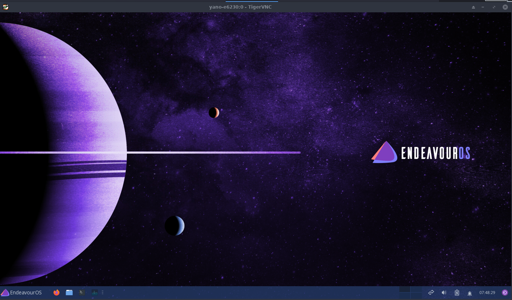{:width="600"}

Si le curseur est mal affiché, c’est possible de mettre l’option -cursor à la ligne de commande x11vnc
`Le programme écoute sur le port 9500. Il faut penser à ouvrir le parefeu du Latitude e6230 sur ce port en TCP`{: .prompt-info }

<u>Script - VNC via Tunnel SSH</u>

* Ouverture distant et redirection du port 5900 via tunnel ssh, reprise de la main (nohup)
* On mémorise le processus ssh (pidof)
* Lancement de vncviewer
* En sortie du viewer, on tue le processus ssh ... avec kill

  nano ~/scripts/vncdell.sh

```bash
#!/bin/bash

nohup ssh -f -L 5900:localhost:5900 -p 56230 -i ~/.ssh/e6230 yano@192.168.8.20 'sudo x11vnc -xkb -noxrecord -noxfixes -noxdamage -display :0 -auth /var/run/lightdm/root/:0 -usepw'
p=$(pidof -s ssh)
# tempo
echo "Patienter 5 secondes..."
sleep 5
vncviewer -PreferredEncoding=ZRLE localhost:0
kill $p
echo "FIN VNC"
 
exit 0
```

Droits en exécution

```
chmod +x ~/scripts/vncdell.sh
```

Au lancement du script

```
sh ~/scripts/vncdell.sh
```

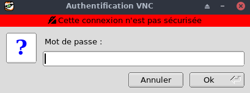{:width="200"}  
Saisir le mot de passe VNC

### Applications et Paquets

On commence par tout ce qui est graphique : gimp, cups (gestion de l’imprimante) et hplip (si vous avez une imprimante scanner Hewlett Packard). Le paquet python-pyqt5 est indispensable pour l’interface graphique de HPLIP+scan. Webkigtk2 étant indispensable pour la lecture de l’aide en ligne de Gimp. outil rsync, Retext éditeur markdown, firefox fr, thunderbird, libreoffice, gdisk, bluefish, **Double Commander** , **Menulibre** pour la gestion des menus , outils android

Lancer la commande

```bash
yay -S cups system-config-printer gimp hplip libreoffice-fresh-fr thunderbird-i18n-fr jq figlet p7zip xsane tmux  calibre retext bluefish gedit doublecmd-gtk2 terminator filezilla minicom zenity android-tools yt-dlp qrencode zbar xclip nmap jre-openjdk-headless openbsd-netcat borg xterm gparted tigervnc xournalpp qbittorrent

# Scripts to aid in installing Arch Linux (ex: arch-chroot)
yay -S arch-install-scripts
```

Gestion des menus du bureau, construction du paquet avant installation

```
yay -S menulibre 
```

Firefox en français si l'option non validé lors de l'installation

```
yay -S firefox-i18n-fr
```

#### Minicom

Paramétrage de l'application terminale **minicom**

```
 sudo minicom -s
```

> Seul les paramètres à modifier sont cités

Configuration du port série  
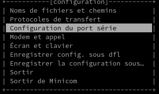  
A -                             Port série : **/dev/ttyUSB0**  
F -              Contrôle de flux matériel : **Non**  
  
Echap  
Enregistrer config. sous dfl  
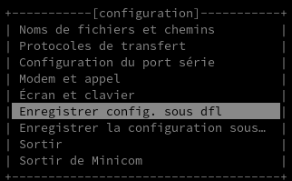  
Sortir de Minicom

#### Son

**<u>PulseAudio</u>**  
La gestion **coupure**, **vol+** et **vol-** du son se fait à l'aide des touches spécifique du clavier  


#### Flameshot (copie écran)

**Copie écran (flameshot)**  
[**Flameshot**](https://github.com/lupoDharkael/flameshot) c’est un peu THE TOOL pour faire des captures d’écrans

```
yay -S flameshot
```

Lancer l'application XFCE Flameshot et l'icône est visible dans la barre des tâches  
{:width="300"}

Paramétrage de flameshot, clic droit sur icône , Configuration  
{:width="300"}  
Paramétrage de flameshot  
{:width="300"}

#### scrpy émulation android

Utilise adb et le port USB

```
yay -S scrcpy
```

*Les icônes pour lancer l'application sont générés à l'installation*

Créer le dossier (OPTION)

```
mkdir -p $HOME/.local/share/applications
```

Créer le fichier `$HOME/.local/share/applications/scrcpy-android.desktop` avec le contenu suivant

```
[Desktop Entry]
Version=1.1
Type=Application
Name=ScrCpy (Android)
Comment=Votre smartphone sur le bureau
Icon=phone
Exec=/usr/bin/scrcpy
Path=/home/yann
Actions=
Categories=Utility;X-XFCE;X-Xfce-Toplevel;
Terminal=false
StartupNotify=false
```

#### Client Nextcloud

Installation client nextcloud

```
yay -S nextcloud-client libgnome-keyring gnome-keyring  
```

Démarrer le client nextcloud , après avoir renseigné l'url ,login et mot de passe pour la connexion

Trousseau de clé avec mot de passe idem connexion utilisateur

Paramétrage

* Menu → Lancer **Client de synchronisation nextcloud**
* Adresse du serveur : <https://cloud.xoyaz.xyz>  
  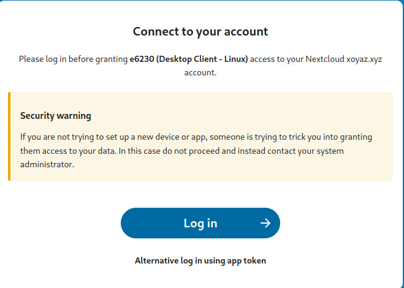{:width="300"}
* Nom d’utilisateur : yann
* Mot de passe : xxxxx  
  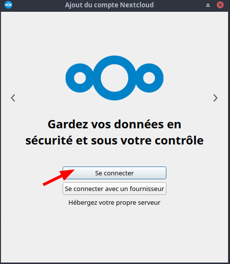{:width="200"}  
  {:width="300"}  
  {:width="200"}
* Sauter les dossiers à synchroniser, Ignorer la configuration des dossiers
* Trousseau de clés = mot de passe connexion utilisateur  
  {:width="400"}
* Paramètres nextcloud  
  {:width="400"}

Saisir les différents dossiers à synhroniser  
{:width="400"}

Au prochain redémarrage, il faudra confirmer le mot de passe du trousseau

#### Gestion mot de passe (keepassxc)

{:width="50"}  
Ajouter une synchronisation de dossier nextcloud : /home/yano/.keepassx (local) → Home/.keepasx (serveur)  
Télécharger la clé **yannick_keepassxc.key** dans **~/.ssh**

```shell
scp -P 56230 -i ~/.ssh/e6230  ~/.ssh/yannick_keepassxc.key yano@192.168.0.9:/home/yano/.ssh/
```

Installer keepassxc

```
yay -S keepassxc
```

Ajouter aux favoris "KeepassXC" et lancer l'application → **Ouvrir une base de données existante**  
Base de données --> Ouvrir une base de données (afficher les fichiers cachés) : **~/.keepassx/yannick_xc.kdbx** --> Ouvrir  
{:width="400"}

**Affichage → Thème** : Sombre  
**Affichage → Mode compact**  , un redémarrage de l'application est nécessaire

#### Thunderbird

Ajouter thunderbird aux favoris et lancer

**Comptes de messagerie**

* Paramètrer les différents compte de messagerie
* Compte ProtonMail 
  1. Comment paramétrer Mozilla Thunderbird pour ProtonMail Bridge, ouvrir le lien suivant [Proton Mail](/posts/Proton_Mail/)
  * Paramétrer le compte de messagerie ProtonMail

*Si vous souhaitez que Thunderbird soit minimisé dans la zone de notification, vous devez installer une application indépendante pour déplacer Thunderbird dans la zone de notification chaque fois qu'il est minimisé. Sous Linux, je recommande KDocker (disponible dans de nombreuses distributions Linux).*

*KDocker est pratique lorsque vous souhaitez intégrer une application graphique dans la barre d'état système, étant donné que l'application en question ne dispose pas de sa propre fonctionnalité pour la placer dans la barre d'état système. Bien qu'elle n'ait pas été mise à jour depuis 2005, la dernière version publiée le 5 avril 2005 est suffisamment bonne et, selon le site officiel, elle fonctionne avec tous les gestionnaires de fenêtres conformes à la norme NET WM. Pour n'en citer que quelques-uns : KDE, GNOME, Xfce, Blackbox ou Fluxbox. Je ne l'ai utilisé que dans KDE 3.5.9, mais je suis sûr qu'il fonctionne bien dans les autres environnements de bureau aussi, si vous ne voulez pas utiliser une application d'ancrage native, comme ALLTray pour GNOME.*

* Paramètres → Modules complémentaires et thèmes 
  * **Thèmes** : Activer **sombre**
  * **Extensions** : Installer **Minimize on Close**

**Calendriers et contacts**

`Alt+m` pour afficher la bare de menu  
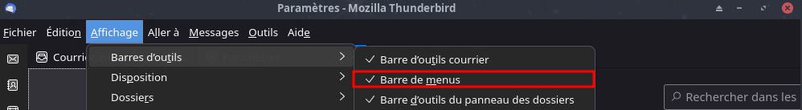{:width="400"}

* **Calendrier**  
  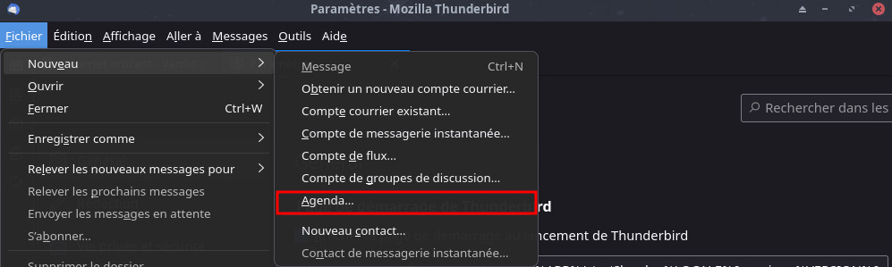{:width="400"}  
  {:width="400"}  
  {:width="400"}  
  Saisir le mot de passe  
  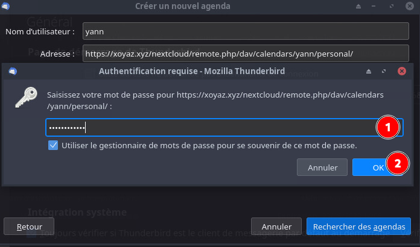{:width="400"}  
  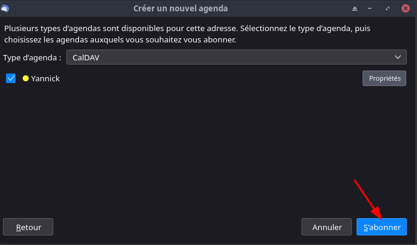{:width="400"}
* **Contacts**  
  Outils → Carnet d'adresses  
  {:width="400"}  
  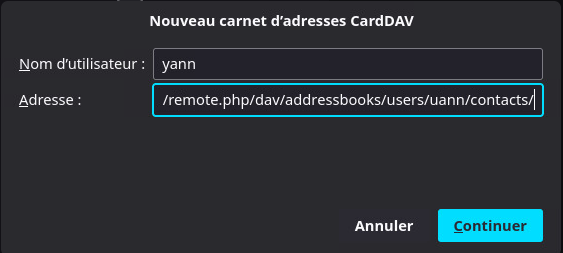{:width="250"}  
  {:width="250"}  
  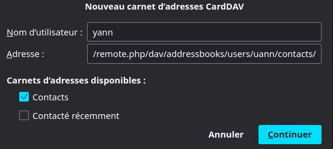{:width="250"}

#### Radio via internet (facultatif)

Installation au choix

```
yay -S radiotray
yay -S geocode-glib tuner-git
```

#### Double Commander

*Double Commander est un gestionnaire de fichiers open source multiplateforme avec deux panneaux côte à côte. Il s'inspire de Total Commander*

Application GTK ou QT

```
yay -S doublecmd-gtk2
yay -S doublecmd-qt5
```

Les paramètres sont stockés dans le dossier `~/.config/doublecmd`

#### Développement

**Wing personal python IDE** → [Téléchargement](https://wingware.com/downloads/wing-personal)

```
# Décompression de la version téléchargée
tar xjvf wing-personal-9.1.1.0-linux-x64.tar.bz2
# Passage en root
sudo -s
# Lancement procédure installation
cd wing-personal-9.1.1.0-linux-x64
./wing-install.py
# Suppression dossier et fichier
cd ..
rm -rf wing-personal*
# sortie root
exit
```

## VPN - Wireguard

Au choix GtkWg ou Mullvad

### GtkWg

Pour utiliser wireguard il faut installer openresolv qui ets en conflit avec systemd-resolvconf

    sudo pacman -S openresolv

`:: openresolv et systemd-resolvconf sont en conflit. Supprimer systemd-resolvconf ? [o/N] o`

Installer wireguard

    yay -S wireguard-tools

Le dossier et les droits

```
sudo mkdir -p /usr/local/share/gtkwg
# copier le contenu d'une archive dans gtkwg
sudo chown $USER:$USER -R /usr/local/share/gtkwg
```

Structure dossier

```
/usr/local/share/gtkwg/
├── button-green.png
├── button-red.png
├── data
│   ├── country.json
│   └── wg-config.json
├── dns-logo.png
├── flags
│   ├── fr.png
│   ├── gb.png
│   └── za.png
├── GtkMullvadConfig.py
├── GtkSpeed.py
├── GtkWgGui.py
├── GtkWgLatence.py
├── GtkWgTest.py
├── GtkWgTray.py
├── GtkWgTray.sh
├── install.sh
├── LISEZMOI.md
├── menulibre-gtkwg.desktop
├── mullvad_config_linux_all
│   ├── fr-par-wg-004.conf
│   ├── gb-lon-wg-005.conf
│   └── za-jnb-wg-002.conf
├── progressbar.py
├── __pycache__
│   └── wgcom.cpython-311.pyc
├── speed.png
├── speedtestfr.py
├── speedtest.py
├── spinner.py
├── stopwatch.png
├── subpro.py
├── wgcom.py
└── wireguard_icon.png
```

Les fichiers .sh et .py sont exécutable (`chmod +x`)

Le fichier desktop `.local/share/applications/menulibre-gtkwg.desktop` 

```
[Desktop Entry]
Version=1.0
Type=Application
Name=Wireguard
Comment=IconTray/Configuration
Icon=/usr/local/share/gtkwg/wireguard_icon.png
Exec=/usr/bin/python /usr/local/share/gtkwg/GtkWgTray.py
Path=/usr/local/share/gtkwg/
NoDisplay=false
Categories=Utility;
StartupNotify=false
Terminal=false
```

Un fichier de paramétrage `/etc/wireguard/wg0.conf`

Paramétrage &rarr; Session et démarrage &rarr; Démérrage automatique d'application  
+Ajouter

Nom: wireguard  
Description: systray wireguard  
Commande: /usr/bin/sh /usr/local/share/gtkwg/GtkWgTray.sh  
Déclencher: à la connexion  


### Mullvad

Installation

```
yay -S mullvad-vpn-bin
```

#### Paramétrage

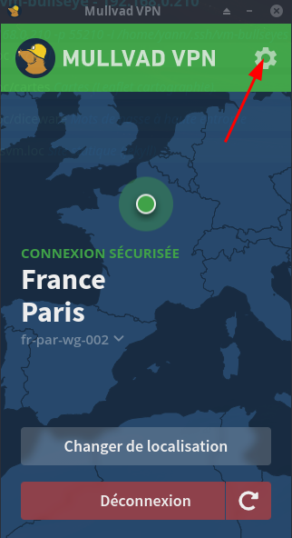{:width="150"}  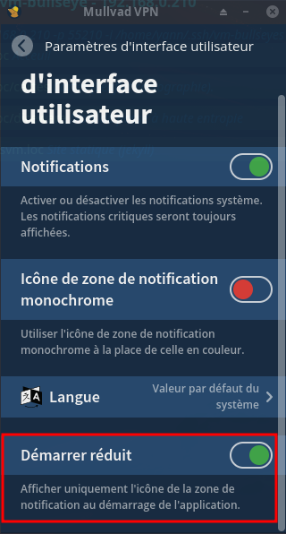{:width="150"}  
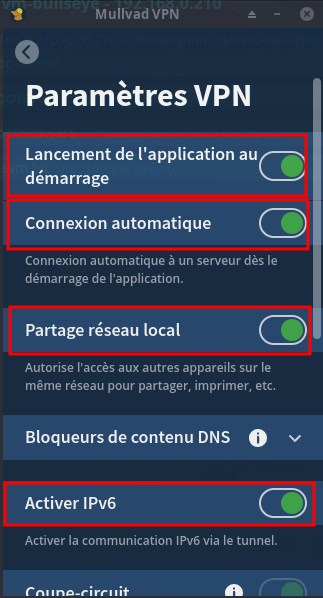{:width="150"}  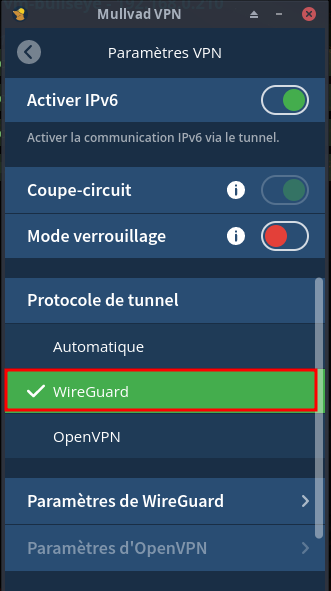{:width="150"}

## Annexe

### Plymouth

[Plymouth - Processus de démarrage graphique](/posts/Plymouth_Processus_de_demarrage_graphique/)

### BorgBackup

[Borg - Laptop Dell e6230](/posts/BorgBackup_vers-Boite_de_stockage/#borg---laptop-dell-e6230)

Passphrase et dépôt

```bash
mkdir -p /root/.borg
# ajout phrase
echo "<La phrase de passe forte>" > /root/.borg/e6230.passphrase
# ajout dépôt
echo "ssh://u326239@u326239.your-storagebox.de:23/./backup/borg/e6230" > /root/.borg/e6230.repository
```

Initialisation dépôt distant

```bash
export BORG_PASSPHRASE="$(cat /root/.borg/e6230.passphrase)"
export BORG_RSH='ssh -i /root/.ssh/id_borg_ed25519'
BORG_REPOSITORY="$(cat /root/.borg/e6230.repository)"
borg init --encryption=repokey $BORG_REPOSITORY
```

Le résultat de la commande

```
By default repositories initialized with this version will produce security
errors if written to with an older version (up to and including Borg 1.0.8).

If you want to use these older versions, you can disable the check by running:
borg upgrade --disable-tam ssh://u326239@u326239.your-storagebox.de:23/./backup/borg/e6230

See https://borgbackup.readthedocs.io/en/stable/changes/#pre-1-0-9-manifest-spoofing-vulnerability for details about the security implications.

IMPORTANT: you will need both KEY AND PASSPHRASE to access this repo!
If you used a repokey mode, the key is stored in the repo, but you should back it up separately.
Use "borg key export" to export the key, optionally in printable format.
Write down the passphrase. Store both at safe place(s).
```

### Partages disque réseau

#### Samba

*Les machines sont sur le réseau 192.168.0.0/24*  
[Partage disque externe USB sur Freebox](/posts/Partage_disque_externe_USB_sur_Freebox/)

#### NFS ou SSHFS

* Utiliser NFS si toutes les machines sont sur le réseau local  
* Utiliser SSHFS si toutes les machines NE sont PAS sur le réseau local 

**NFS** 

*Les machines sont sur le réseau 192.168.0.0/24*   
[NFS (Network File System), partages réseau linux](/posts/NFS/)

**SSHFS**  
{:width="50"}  
*SSHFS sert à monter sur son système de fichier, un autre système de fichier distant, à travers une connexion SSH, le tout avec des droits utilisateur.*

Créer une connexion ssh sur le serveur Lenovo avec clé  

Depuis la machine portable DELL Latitude e6230

    ssh-keygen -t ed25519 -o -a 100 -f ~/.ssh/rnmkcy.eu_key

Ajouter la clé publique rnmkcy.eu_key.pub au fichier authorized_keys du serveur lenovo (82.64.18.243)

Tester la connexion SSH depuis le portable DELL port 55215

    ssh -p 55215 -i ~/.ssh/rnmkcy.eu_key leno@82.64.18.243

Installer sshfs

```bash
sudo apt install sshfs # debian
sudo pacman -S sshfs   # archlinux
```

Exemple de montage manuel  
`sshfs -oIdentityFile=<clé privée> utilisateur@domaine.tld:<dossier distant> <dossier local> -C -p <port si dfférent de 22>`

Partage du dossier /sharenfs serveur Lenovo avec /mmnt/sharenfs machine DELL  
Créer le point de montage local

    sudo mkdir /mnt/sharenfs

<u>Accès utilisateur sécurisé</u>  
Lors du montage automatique via fstab, le système de fichiers sera généralement monté par root. Par défaut, cela produit des résultats indésirables si vous souhaitez accéder en tant qu'utilisateur ordinaire et limiter l'accès aux autres utilisateurs.Ajouter la ligne suivante au fichier `/etc/fstab`

```
leno@82.64.18.243:/sharenfs /mnt/sharenfs fuse.sshfs noauto,x-systemd.automount,_netdev,user,idmap=user,follow_symlinks,identityfile=/home/yano/.ssh/rnmkcy.eu_key,port=55215,allow_other,default_permissions,uid=1000,gid=1000 0 0
```

Recharger les daemons

    sudo systemctl daemon-reload

Pour pouvoir exécuter mount -av et consulter la sortie de débogage, supprimez les éléments suivants 

    noauto,x-systemd.automount

Lancer le montage en mode vue pour valider la clé SSH

    sudo mount -av

```
/efi                      : déjà monté
/                         : ignoré
/home                     : déjà monté
/tmp                      : déjà monté
none                      : ignoré
The authenticity of host '[82.64.18.243]:55215 ([82.64.18.243]:55215)' can't be established.
ED25519 key fingerprint is SHA256:UXJCYtFENT8AKvmNe5TugLM1mXDdIcSOQ3o3oeAxd5I.
This key is not known by any other names.
Are you sure you want to continue connecting (yes/no/[fingerprint])? yes
Warning: Permanently added '[82.64.18.243]:55215' (ED25519) to the list of known hosts.
/mnt/sharenfs             : successfully mounted
```

## EndeavourOS Virt-Manager

### Complete Edition (VMM KVM QEMU)

[EndeavourOS Virt-Manager Complete Edition (VMM KVM QEMU)](/posts/EndeavourOS-Virt-Manager_Complete_Edition/)

### NetworkManager Bridge

*Créer un ‘bridged network’ ou réseau bridgé sur l'interface réelle pour une utilisation avec virt-manager (Qemu/KVM). On utilise un réseau bridgé pour les machines virtualisées pour qu’elles aient une vrai adresse IP sur le réseau local et qu’elles soient accessibles comme un ordinateur réel.*

nmcli peut créer des ponts à partir du gestionnaire de réseau.  
Passer en mode su  
Créer un pont br0 avec STP désactivé (pour éviter que le pont ne soit annoncé sur le réseau)  

    nmcli connection add type bridge ifname br0 stp no

`Connexion « bridge-br0 » (7f5a043a-257d-4c2b-869e-9de51d7246ea) ajoutée avec succès.`

Faites de votre interface Ethernet **eno1** un esclave du pont 

    nmcli connection add type bridge-slave ifname eno1 master br0

`Connexion « bridge-slave-eno1 » (a3468d56-deed-47d6-bcac-56e2d4261a27) ajoutée avec succès.`

Mettre fin à la connexion existante si active (vous pouvez obtenir le nom de la connexion avec `nmcli connection show --active`) :

    nmcli connection down Connection

#### Activation du pont (bridge) br0

Mettre en place le nouveau pont :

    nmcli connection up bridge-br0

`Connexion activée (master waiting for slaves) (Chemin D-Bus actif : /org/freedesktop/NetworkManager/ActiveConnection/5)`

    nmcli connection up bridge-slave-eno1

`Connexion activée (chemin D-Bus actif : /org/freedesktop/NetworkManager/ActiveConnection/6)`

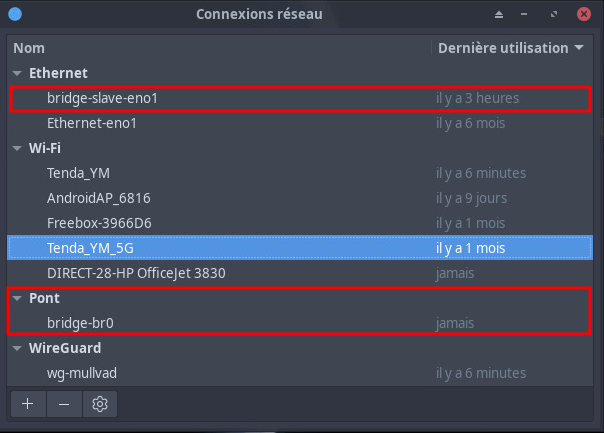{:width="350"}

Si l'interface par défaut de NetworkManager pour le périphérique que vous avez ajouté au pont se connecte automatiquement, vous pouvez la désactiver en cliquant sur la roue dentée à côté d'elle dans les paramètres du réseau, et en décochant **Connecter automatiquement** sous Identité.

Vérification

```
nmcli connection show
```

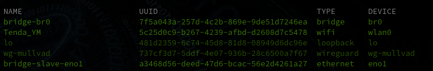

#### Assigner au pont une ip statique (facultatif)


On veut que le pont br0 est une adresse 192.168.0.20  
son adresse mac est `56:c6:b3:31:ff:27`

Pour le wlan on veut 192.168.0.21
son adresse mac est `a6:cb:63:52:dc:7a`

On va créer un bail statique dans la box  
Paramètres → Mode avancé → DHCP → Baux statiques → Ajouter un bail DHCP statique  
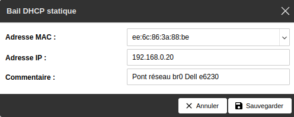{:width="300"}  
`Redémarrer la machine`{: .prompt-info }

#### Paramétrage graphique NetworkManager

Paramétrage réseau pour un démarrage auto sur le pont br0 si le réseau filaire est branché

Modifier les paramètres réseau, clic droit sur icône réseau  
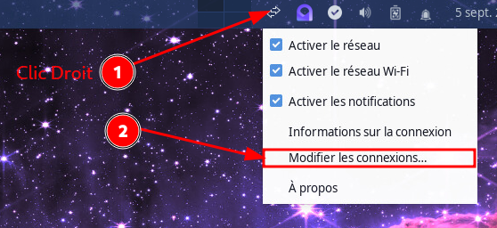{:width="300"}

Créer un pont réseau nommé br0 en cliquant sur le **\+**  
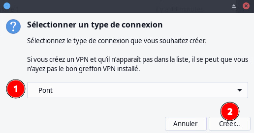{:width="300"}  
Saisir un nom après avoir cliquer sur **Créer**  
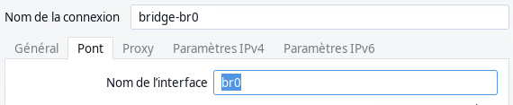{:width="300"}

**Pont entre connexions** → **Ajouter**  
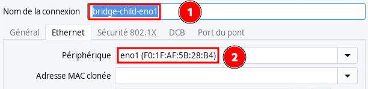{:width="300"}  
Enregistrer

Le pont réseau  
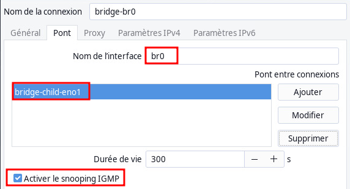{:width="300"}  
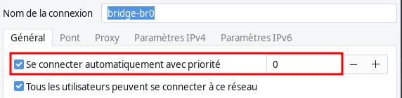{:width="300"}  
Enregistrer

Il faut désactiver la connexion automatique du réseau filaire  
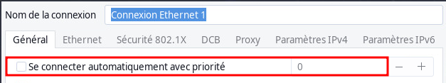{:width="300"}

#### Création de VLANs via ncmli

[*VLAN*](https://www.baeldung.com/linux/vlans-create)* sur les liens et les ponts à l'aide de l'outil de ligne de commande de NetworkManager, nmcli*

Pour commencer, vérifions les interfaces disponibles :

```
nmcli device
```

```
DEVICE  TYPE      STATE                  CONNECTION     
br0     bridge    connecté               bridge-br0     
wlan0   wifi      connecté               Freebox-3966D6 
lo      loopback  connecté (en externe)  lo             
eno1    ethernet  connecté               Ethernet-eno1  
```

Ensuite, créons une interface VLAN

```
nmcli con add type vlan con-name vlan-eno1.100 ifname eno1.100 dev eno1 id 100 ip4 192.168.0.25/24
```

*Connexion « vlan-eno1.100 » (9aa8cded-7814-4e84-af15-09672e0b2563) ajoutée avec succès.*

Nous devons fournir les options con-name, dev et ifname. L'option con-name spécifie la nouvelle connexion VLAN créée, l'option dev spécifie l'interface physique sur laquelle se trouve ce VLAN, et l'option ifname (nom de l'interface VLAN, par exemple vlan-eno1.100) spécifie l'interface à laquelle lier la connexion.

Vérifions si l'interface est créée

```
nmcli device
```

```
DEVICE    TYPE      STATE                  CONNECTION           
eno1      ethernet  connecté               Ethernet automatique 
br0       bridge    connecté               bridge-br0           
eno1.100  vlan      connecté               vlan-eno1.100        
wlan0     wifi      connecté               Freebox-3966D6       
lo        loopback  connecté (en externe)  lo                   
```

## Maintenance

### Ouvrir un disque chiffré LUKS2

Installer les outils archlinux

```
pacman -S arch-install-scripts
```

```
cryptsetup luksOpen /dev/sda2 crypt

mount /dev/mapper/vg0-lvroot /mnt
mkdir -p /mnt/home
mount /dev/mapper/vg0-lvhome /mnt/home
mkdir -p /mnt/efi
mount /dev/sda1 /mnt/efi
```

### Liste des clés et mots de passe LUKS2

Le déchiffrement du disque dur /dev/sda2 peut être réalisé de plusieurs manière

* Phrase mot de passe
* Clés FIDO2 (Solokeys et Yubico)
* Pharse de recouvrement

Chacune des possibilités est stockée dans un "SLOT" (8 max, de 0 à 7)  
Lister les "SLOT" : `sudo cryptsetup luksDump /dev/sda2`  

Il y a 5 slots utilisés

* slot 0 : Phrase de passe
* slot 1 : Phrase de recouvrement
* slot 2 : Yubikeys Fido2 24 554 586
* slot 3 : Yubikeys Fido2 24 554 581
* slot 4 : Solokeys

Tester les différentes clés enregistrées

```
# Phrase de passe
sudo cryptsetup --verbose open --token-id=0 --test-passphrase /dev/sda2

Le jeton 0 a besoin d'une ressource supplémentaire qui est manquante.
Saisissez la phrase secrète pour /dev/sda2 : 
Emplacement de clé 0 déverrouillé.
Commande réussie.

# Yubico 24 554 586
sudo cryptsetup --verbose open --test-passphrase /dev/sda2

Asking FIDO2 token for authentication.
👆 Please confirm presence on security token to unlock.
Emplacement de clé 2 déverrouillé.
Commande réussie.

# Yubico 24 554 581
sudo cryptsetup --verbose open --test-passphrase /dev/sda2

Asking FIDO2 token for authentication.
👆 Please confirm presence on security token to unlock.
Emplacement de clé 3 déverrouillé.
Commande réussie.

# Solokeys
sudo cryptsetup --verbose open --test-passphrase /dev/sda2

Asking FIDO2 token for authentication.
👆 Please confirm presence on security token to unlock.
Emplacement de clé 4 déverrouillé.
Commande réussie.
```

Procédure de vérification

Désactiver l'historique

    set +o history

Vérifier la phrase mot de passe

```bash
printf "anycurrentpassphrase" | \
  sudo cryptsetup luksOpen --test-passphrase /dev/sda2 && \
  echo "Il y a une clé disponible avec ce passphrase."
```

Réactiver l'historique

    set -o history

### Lightdm

*Utilise `lightdm-slick-greeter` Un greeter basé sur GTK plus axé sur l'apparence que `lightdm-gtk-greeter`*

Les paramètres sont dans le fichier `/etc/lightdm/slick-greeter.conf` 

```
[Greeter]
background=/usr/share/endeavouros/backgrounds/endeavouros-wallpaper.png
draw-user-backgrounds=false
draw-grid=true
theme-name=Arc-Dark
icon-theme-name=Qogir
cursor-theme-name=Qogir
cursor-theme-size=16
show-a11y=false
show-power=false
background-color=#000000
```

Si vous changez l'image de fond, il désactiver draw-grid

```
background=/usr/share/endeavouros/backgrounds/light_sky_stars_85555_1366x768_yano.jpg
draw-grid=false
```

### Récupérer la partition temporaire

**Ajouter la partition temporaire à la partition LUKS**

Vous pouvez simplement reformater /dev/sda3 et l'utiliser comme stockage non chiffré, mais ici, nous allons récupérer l'espace

`Redémarrer sur un environnement Live-Cd`{: .prompt-info }

Basculer le clavier en FR

**Supprimer sda3 (installation temporaire EndeavourOS)**

Pour supprimer /dev/sda3

```
sudo fdisk /dev/sda
```

Eentrez simplement les caractères ci-dessous dans l'ordre indiqué.

```
> p
> d
> 3 (delete partition 3)
> w (write changes to disk)
```

**Étendre /dev/sda2 (partition LUKS) et le groupe de volumes**

```
sudo fdisk /dev/sda
```

```
> d
> 2 (delete partition 2)
> n
> 2 (recreate partition 2)
>   (first sector is 'default'; press enter)
>   (last sector is 'default'; press enter)
> n (keep existing filesystem signature)
> w (write changes to disk)
```

Partition LUKS

```shell
sudo cryptsetup luksOpen /dev/sda2 crypt
sudo cryptsetup resize crypt -v

sudo e2fsck -f /dev/mapper/vg0-lvroot
sudo e2fsck -f /dev/mapper/vg0-lvhome

sudo pvresize /dev/mapper/crypt
```

Le groupe de volumes vg0 contient maintenant l'espace que nous avons libéré en supprimant `/dev/sda3`  
Il a été ajouté en tant qu'espace libre pouvant être utilisé pour des instantanés ou une affectation future au volume racine

```
  VG  #PV #LV #SN Attr   VSize   VFree  
  vg0   1   3   0 wz--n- 446,57g 196,57g
```

Oter la clé Live et redémarrer la machine

### Bluetooth

**Activation**  
Bluetooth n'est pas actif par défaut, en raison de plusieurs risques de sécurité et pour éviter une consommation d'énergie inutile.

Les packages nécessaires sont installés par défaut, mais ils sont dans leur état désactivé par défaut.

Pour pouvoir utiliser Bluetooth, vous devez démarrer le service ou l'activer si vous avez besoin que Bluetooth soit exécuté à chaque démarrage :

```bash
sudo systemctl start bluetooth  # pour le démarrer pour la session restera désactivé après le redémarrage.
sudo systemctl enable bluetooth # à activer par défaut, s'exécutera après chaque démarrage.
```

Version bluetooth : `sudo inxi -E`

```
Bluetooth:
  Device-1: Intel AX210 Bluetooth driver: btusb type: USB
  Report: btmgmt ID: hci0 state: up address: C8:15:4E:49:64:DD bt-v: 5.3
```

La plupart des ordinateurs de bureau auront des outils de configuration dans leurs outils de configuration, sinon voir en bas à propos de Et installer des outils d'interface graphique graphique pour configurer et gérer Bluetooth .

Si vous souhaitez vous assurer que tous les packages sont toujours installés ou si vous pouvez en supprimer certains, en utilisant une installation personnalisée, etc., installez-le manuellement :

Avec Pipewire

    sudo pacman -S --needed bluez bluez-utils

Et installez des outils d'interface graphique graphique pour configurer et gérer Bluetooth :

blueman (gtk) recommandé pour les applications basées sur GTK [peut être utilisé indépendamment des environnements de bureau]

    sudo pacman -S blueman

Il est utile de l'exécuter en tant que root pour que les premiers appareils connectés puissent les utiliser. Mais essayez d’abord en tant qu’utilisateur normal !  


Gérer les appareils Bluetooth via l'outil CLI.([How to Manage Bluetooth Devices on Linux Using bluetoothctl](https://www.makeuseof.com/manage-bluetooth-linux-with-bluetoothctl/)) 

le processus habituel pour connecter un nouvel appareil est le suivant :

    bluetoothctl ----> scan on ------> trust ----> pair ---> connect

**Souris Bluetooth Pebble Mouse 2 M350s**  
Basculez entre 3 de vos dispositifs d'une simple pression sur le bouton Easy-Switch.  
Position 2 pour le portable DELL latitude e6230  
{:width="400"}

Liste des appareils

    bluetoothctl devices

```
Device 98:52:3D:79:B3:F1 Soundcore Liberty Air 2-L
Device D0:33:94:1E:38:C8 Pebble M350s
```