+++
title = 'Syncthing synchronisation de fichiers pair à pair'
date = 2024-06-22 00:00:00 +0100
categories = ['debian']
+++
*Syncthing est une application de synchronisation de fichiers pair à pair open source disponible pour Windows, Mac, Linux, Android, Solaris, Darwin et BSD. Aucun compte ni enregistrement préalable à l'utilisation auprès d'un tiers n'est nécessaire, ni même optionnelle. La sécurité et l'intégrité des données sont intégrées dans la conception du logiciel (<https://fr.wikipedia.org/wiki/Syncthing>)*

Syncthing est une plateforme de partage de fichiers auto-hébergée, de sorte qu'aucune de vos données n'est jamais stockée ailleurs que sur vos ordinateurs. Il n'y a pas de serveur central qui pourrait être compromis, légalement ou illégalement. Toutes les communications sont sécurisées à l'aide de TLS. Le cryptage utilisé comprend un secret parfait pour empêcher tout espion d'accéder à vos données. Chaque nœud est identifié par un certificat cryptographique solide. Seuls les nœuds que vous avez explicitement autorisés peuvent se connecter à votre cluster.
{: .prompt-info }

## Serveur rnmkcy.eu

### Paquets debian

Pour permettre au système de vérifier l'authenticité des paquets, vous devez fournir la clé de version.

```
# Add the release PGP keys:
sudo mkdir -p /etc/apt/keyrings
sudo curl -L -o /etc/apt/keyrings/syncthing-archive-keyring.gpg https://syncthing.net/release-key.gpg
```

Le canal stable est mis à jour avec les versions stables, généralement tous les premiers mardis du mois.

```
# Add the "stable" channel to your APT sources:
echo "deb [signed-by=/etc/apt/keyrings/syncthing-archive-keyring.gpg] https://apt.syncthing.net/ syncthing stable" | sudo tee /etc/apt/sources.list.d/syncthing.list
```

Le canal candidat est mis à jour avec les versions candidates, généralement tous les deuxièmes mardis du mois. Celles-ci précèdent les versions stables correspondantes d'environ trois semaines.

```
# Add the "candidate" channel to your APT sources:
echo "deb [signed-by=/etc/apt/keyrings/syncthing-archive-keyring.gpg] https://apt.syncthing.net/ syncthing candidate" | sudo tee /etc/apt/sources.list.d/syncthing.list
```

Et finallement

```
# Update and install syncthing:
sudo apt update
sudo apt install syncthing
```

Le port tcp/22000 doit être ouvert...  

    sudo ufw allow 22000/tcp

### Syncthing service système

**Utiliser Systemd pour configurer Syncthing en tant que service système**  

Le paquetage officiel Syncthing deb est livré avec le fichier de service systemd nécessaire. Dans le répertoire `/lib/systemd/system/`, vous trouverez un fichier `syncthing@.service`. Activez syncthing pour qu'il démarre automatiquement au démarrage en exécutant la commande ci-dessous.  
Remplacez le nom d'utilisateur par votre nom d'utilisateur réel.

```
sudo systemctl enable syncthing@leno.service
sudo systemctl start syncthing@leno.service
```

Vérifier le statut

    systemctl status syncthing@leno.service

```
● syncthing@leno.service - Syncthing - Open Source Continuous File Synchronization for leno
     Loaded: loaded (/lib/systemd/system/syncthing@.service; enabled; preset: enabled)
     Active: active (running) since Sat 2024-06-22 11:17:14 CEST; 17s ago
       Docs: man:syncthing(1)
   Main PID: 706892 (syncthing)
      Tasks: 18 (limit: 14162)
     Memory: 31.7M
        CPU: 1.491s
     CGroup: /system.slice/system-syncthing.slice/syncthing@leno.service
             ├─706892 /usr/bin/syncthing serve --no-browser --no-restart --logflags=0
             └─706900 /usr/bin/syncthing serve --no-browser --no-restart --logflags=0

juin 22 11:17:15 rnmkcy.eu syncthing[706892]: [SUJWS] INFO: Using discovery mechanism: IPv6>
juin 22 11:17:15 rnmkcy.eu syncthing[706892]: [SUJWS] INFO: Ready to synchronize "Default F>
juin 22 11:17:15 rnmkcy.eu syncthing[706892]: [SUJWS] INFO: Completed initial scan of sendr>
juin 22 11:17:15 rnmkcy.eu syncthing[706892]: [SUJWS] INFO: Relay listener (dynamic+https:/>
juin 22 11:17:15 rnmkcy.eu syncthing[706892]: 2024/06/22 11:17:15 failed to sufficiently in>
juin 22 11:17:15 rnmkcy.eu syncthing[706892]: [SUJWS] INFO: GUI and API listening on 127.0.>
juin 22 11:17:15 rnmkcy.eu syncthing[706892]: [SUJWS] INFO: Access the GUI via the followin>
juin 22 11:17:15 rnmkcy.eu syncthing[706892]: [SUJWS] INFO: My name is "rnmkcy.eu"
juin 22 11:17:15 rnmkcy.eu syncthing[706892]: [SUJWS] INFO: TCP listener ([::]:22000) start>
juin 22 11:17:15 rnmkcy.eu syncthing[706892]: [SUJWS] INFO: QUIC listener ([::]:22000) star>
```

Nous pouvons voir que le démarrage automatique de Syncthing est activé et qu'il est en cours d'exécution.

Version : `syncthing --version`

```
syncthing v1.27.8 "Gold Grasshopper" (go1.22.3 linux-amd64) debian@github.syncthing.net 2024-05-30 08:49:22 UTC [noupgrade]
```

### SSH Port Forwarding

Le service est en écoute sur le port 8384 en local  

```
# rnmkcy.eu
ssh -L 9500:127.0.0.1:8384 leno@192.168.0.215 -p 55215 -i /home/yann/.ssh/lenovo-ed25519

# icevps.xyz
ssh -L 9600:localhost:8384 hallmar@91.194.161.27 -p 55027 -i /home/yann/.ssh/icevps_xyz

# xoyaz.xyz
ssh -L 9700:localhost:8384 yani@xoyaz.xyz -p 55030 -i /home/yann/.ssh/xoyaz-ed25519
```

### Configuration

Ouvrir le lien localhost:9500 sur un navigateur  
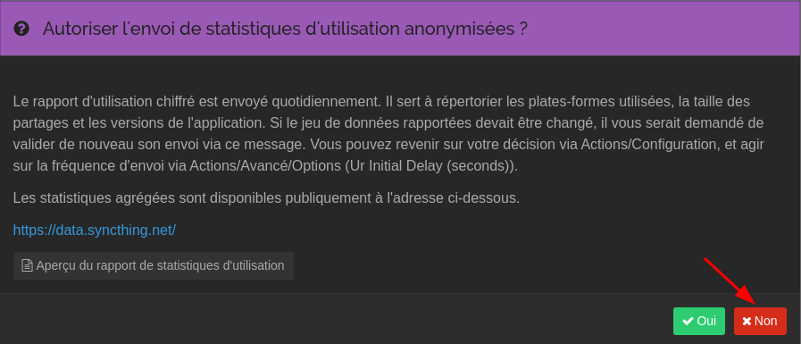{:width="400"}  
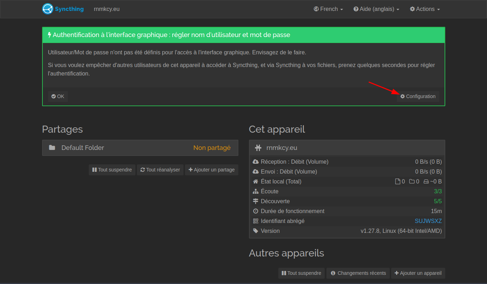{:width="600"}  

Seul utilisateur yann est autorisé  
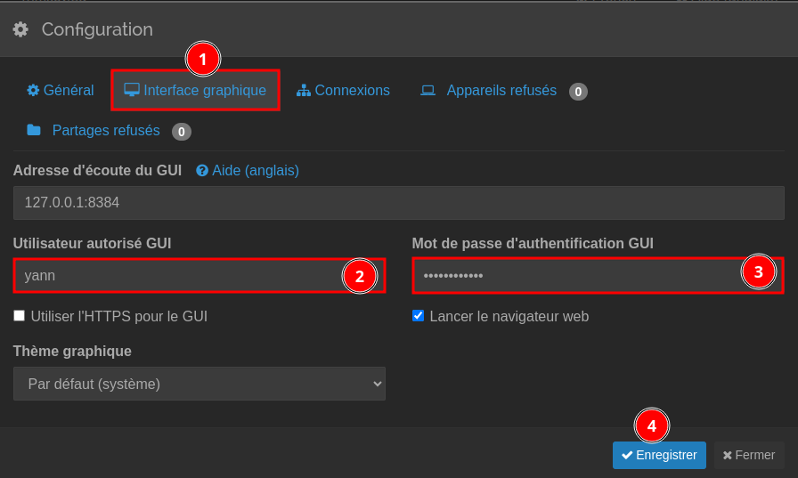{:width="400"}  
Authentification  
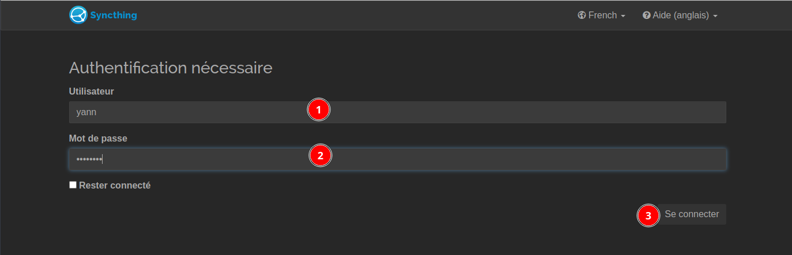{:width="600"}  

Page accueil utilisateur yann 
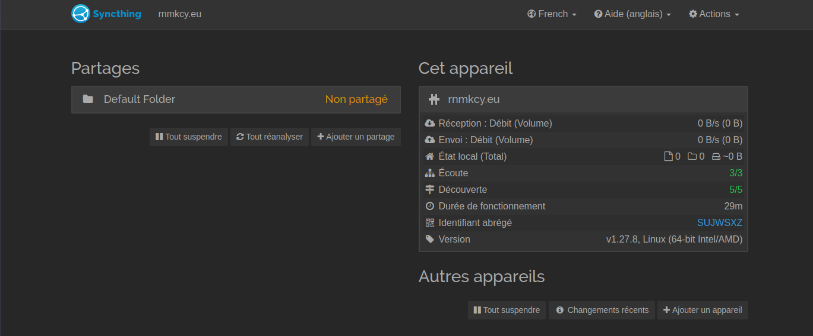{:width="600"}  


## Serveur yunohost xoyaz.xyz

Le port tcp/22000 doitêtre ouvert...  
Page acceuil  utilisateur yani  
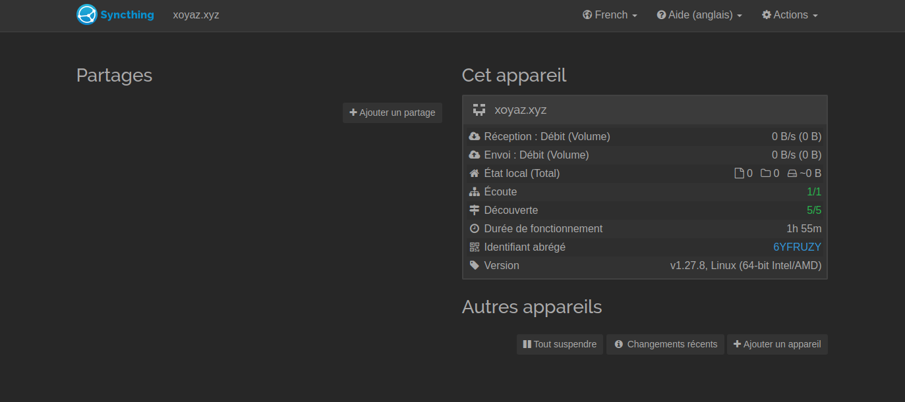{:width="600"}  

## Synchro entre machine

Une fois que nous avons deux appareils utilisant Syncthing, nous pouvons commencer à synchroniser les fichiers entre eux.

Dans l'interface web de Syncthing, cliquez sur **Actions --> Afficher mon ID** dans le coin supérieur droit. Vous verrez l'ID de l'appareil, qui est une longue chaîne de lettres et de chiffres. Le code QR, qui est également l'ID de l'appareil, est utilisé pour configurer Syncthing sur les smartphones.

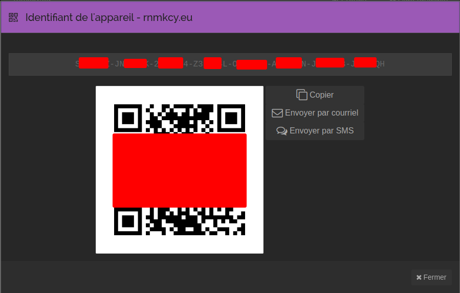{:width="400"} 

Copiez l'ID de l'appareil, puis ouvrez l'interface Web Syncthing du deuxième appareil, cliquez sur **Ajouter un appareil** distant dans le coin inférieur droit. Collez ensuite l'ID du périphérique et donnez-lui un nom. Cliquez sur le bouton Enregistrer.

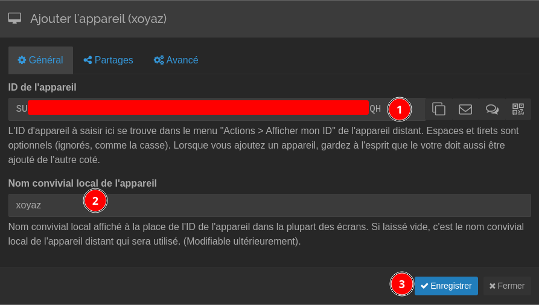{:width="400"} 

Le deuxième appareil va maintenant essayer de se connecter au premier. Actualisez l'interface Web du premier appareil et vous verrez le message suivant. Cliquez sur Ajouter un périphérique pour ajouter le deuxième périphérique à la liste des périphériques du premier périphérique.

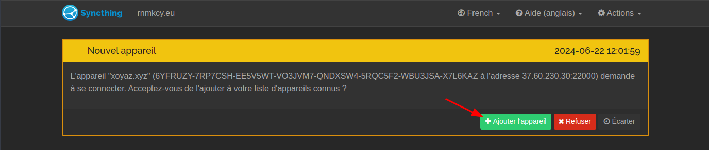{:width="400"}  
{:width="400"}

Les deux appareils sont maintenant connectés.  
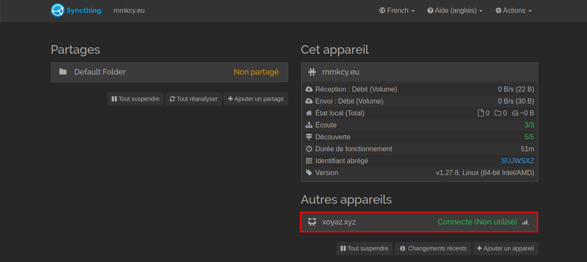{:width="600"}  
{:width="600"}  

Dans le volet gauche de l'interface Web se trouve le dossier de synchronisation par défaut (/home/nom_utilisateur/Sync).  
Cliquez sur le bouton **Ajouter un partage** pour ajouter un nouveau dossier.  
Il faut désormais indiquer à Syncthing les répertoires qui doivent être synchronisés. Pour cela, il faut cliquer sur le bouton *Ajouter un partage* dans la zone de gauche du GUI et renseigner les diverses informations de la page.

  * **Étiquette du partage** Étiquette optionnelle pour le partage. Peut être différente sur chaque appareil.
  * **ID du partage** Identifiant unique du partage. Doit être le même sur l'ensemble des appareils concernés. N’hésitez pas à remplacer celui proposé d'office par Syncthing par un nom intelligible.
  * **Chemin racine du partage** Chemin vers le répertoire dans l'appareil local.
  * **Synchroniser avec des appareils** Cliquez sur le nom des machines sur lesquelles ce répertoire sera synchronisé.
  * **Configuration avancée** Cliquez pour accéder aux paramètres suivants :
    * **Type de partage** Choisissez *Normal* pour de la synchronisation bidirectionnelle ou *Maître* pour de la synchronisation unidirectionnelle dans laquelle le répertoire de la machine locale est la source. Voir la page [[synchronisation]] pour plus d'information à ce sujet.
    * **Ignorer les permissions** Cliquez ici si l'un de vos partage ce trouve sur une machine Windows ne gerant pas les permissions comme sur Linux

Procédez de même sur vos autres machines ou attendez de recevoir et acceptez l'invitation au partage de la première machine configurée sur les autres.  
La synchronisation de vos répertoires entre vos diverses machines devrait commencer.

Exemple ave diceware dossier `~/sharenfs/multimedia/Divers/diceware`  
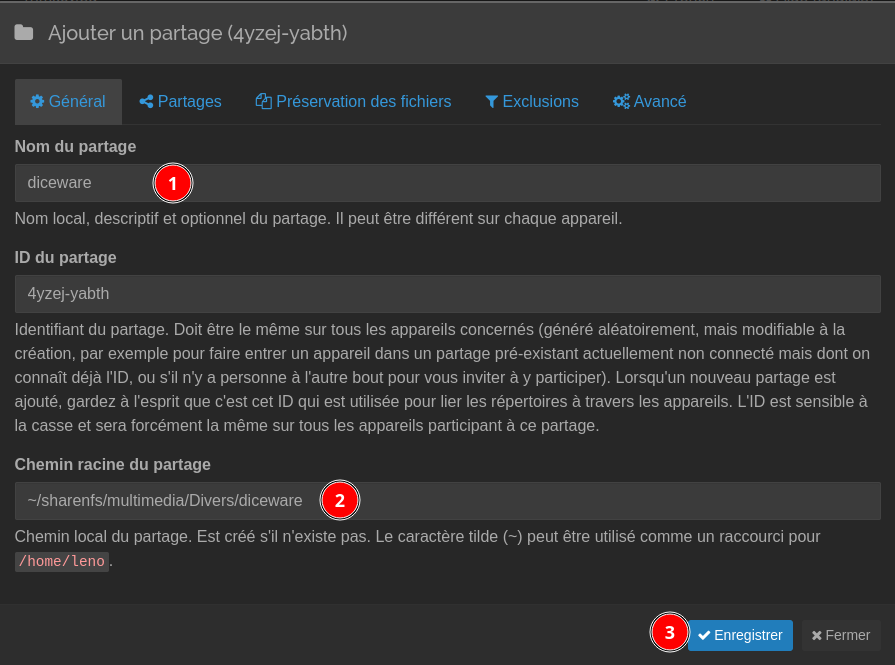{:width="400"}

Syncthing s'exécute sous votre propre compte d'utilisateur, vous devez donc avoir des droits d'écriture sur le dossier partagé. Si vous voyez le message d'erreur suivant lors du partage d'un dossier, cela signifie que vous n'avez pas les droits d'écriture sur ce dossier.

```
2020-06-21 20:05:49: Failed to create folder marker: mkdir .stfolder: read-only file system
```

Vous pouvez accorder des droits d'écriture avec setfacl.

    sudo apt install acl
    sudo setfacl -R -m u:username:rx /folder/path/

Dans l'onglet **Partage**, sélectionnez votre autre périphérique Syncthing.

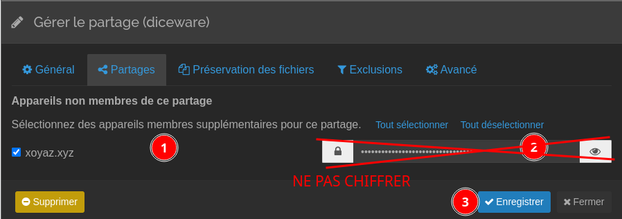{:width="400"}   
Dans l'onglet **Avancé**, vous pouvez choisir le type de dossier, l'intervalle de renumérisation, etc.  
Cliquez sur le bouton Enregistrer pour commencer la synchronisation.  
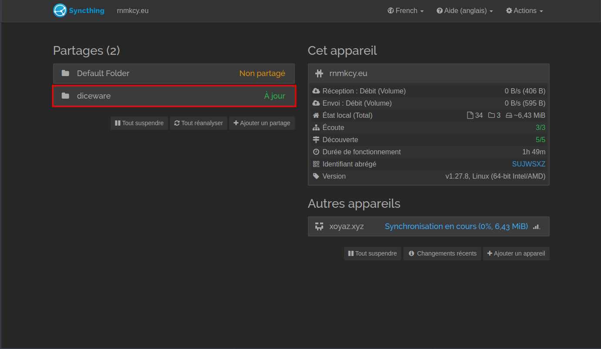{:width="600"}   

Un message s'affiche dans l'interface Web de l'autre appareil. Cliquez sur Ajouter pour recevoir des fichiers.  
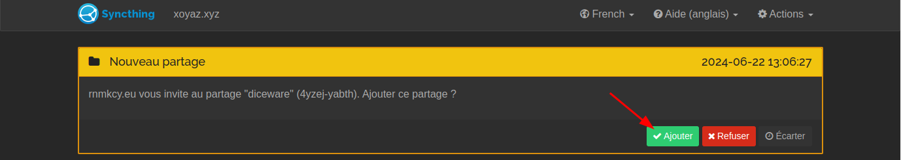{:width="600"}   
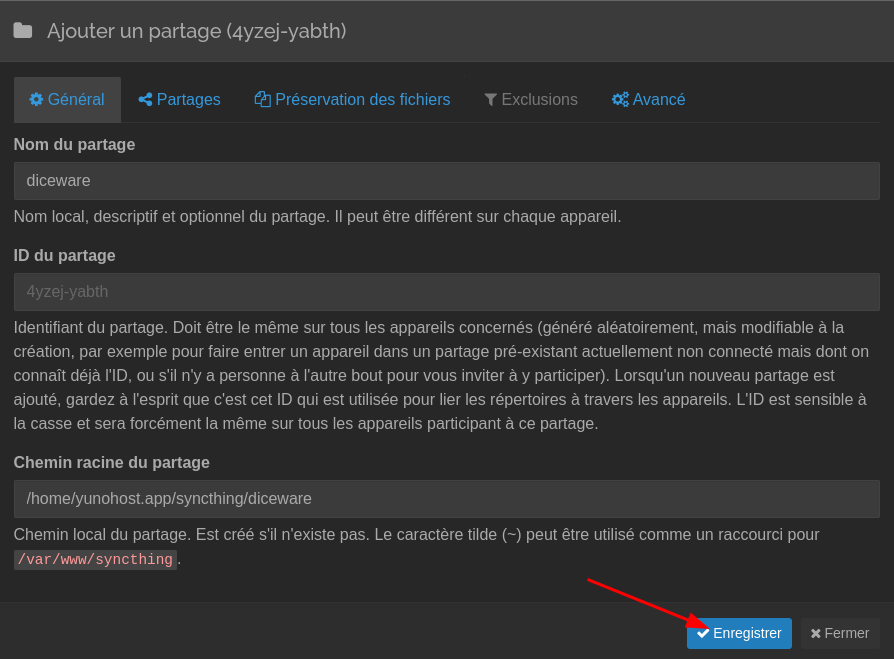{:width="400"}   

Les deux appareils synchronisent à présent les fichiers. Sur le côté droit, vous pouvez voir le taux de téléchargement, le taux de chargement, la taille du dossier local, etc.   
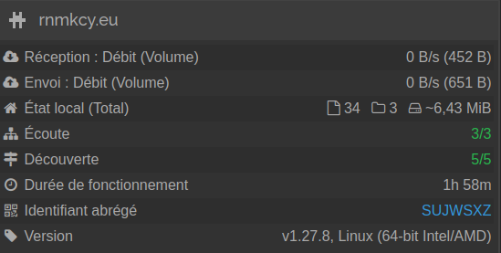{:width="300"}   

