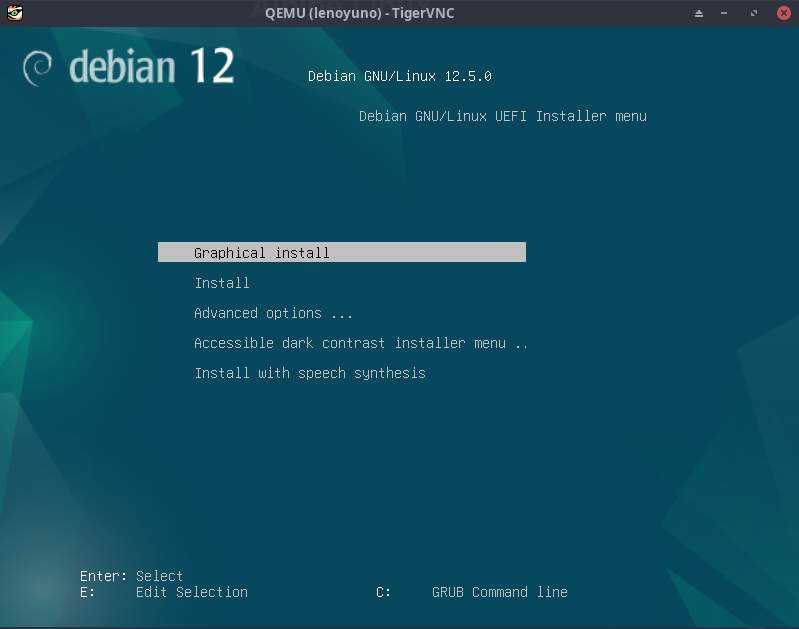

+++
title = 'Lenovo KVM - Yunohost virtuel Debian 12'
date = 2024-06-24 00:00:00 +0100
categories = virtuel yunohost
+++
*Si vous exploitez un nuage privé ou une plateforme de virtualisation fonctionnant avec KVM. La manière la plus idéale de faire tourner une machine virtuelle Debian 12 est d'utiliser une image de nuage* 

## KVM - Debian virtuel

{:height="50"}  

*Installer un serveur debian virtuel sur Lenovo KVM*  
Se connecter sur le serveur Lenovo

### Installer via iso debian

Télécharger image debian iso <https://cdimage.debian.org/debian-cd/current/amd64/iso-cd/>

```shell
wget https://cdimage.debian.org/debian-cd/current/amd64/iso-cd/debian-12.5.0-amd64-netinst.iso -O /srv/kvm/libvirt/boot/debian-12.5.0-amd64-netinst.iso
```

Créer un disque virtuel de 20G

```shell
# Nom serveur à créer : lenoyuno
qemu-img create -f qcow2 /srv/kvm/libvirt/images/lenoyuno.qcow2 30G
```

Créez une nouvelle machine virtuelle Debian 12 à l'aide de la commande `virt-install`.  
Nous utilisons le réseau en pont , remplacer `network=default` par `bridge=br0`


```bash
sudo virt-install \
    --memory 2048 \
    --vcpus 2 \
    --name lenoyuno \
    --disk /srv/kvm/libvirt/images/lenoyuno.qcow2,device=disk,bus=virtio,format=qcow2 \
    --os-variant debiantesting \
    --cdrom /srv/kvm/libvirt/boot/debian-12.5.0-amd64-netinst.iso \
    --network bridge=br0 \
    --graphics vnc \
    --boot uefi 
```

Le serveur Lenovo n’a pas d’affichage, il faut créer un tunnel ssh depuis un poste local

    ssh -L 5900:127.0.0.1:5900 leno@192.168.0.215 -p 55215 -i /home/yann/.ssh/lenovo-ed25519

Puis lancer un client VNC : localhost:5900 , la console s’affiche  
{:width="600"}

Lancer **Install**  
Machine : lenoyuno  
root/root49600  
yuno/yuno49600  
Tout le disque est utilisé  
Serveur SSH + système

A la fin de l'installation il faut réouvrir le tunnel

    ssh -L 5900:127.0.0.1:5900 leno@192.168.0.215 -p 55215 -i /home/yann/.ssh/lenovo-ed25519

Et lancer le client VNC  
Se connecter en utilisateur yuno  
Relever adresse ip : 192.168.0.34  

## Yunohost 12

Depuis un autre terminal, se connecter SSH

    ssh yuno@192.168.0.34

Installer curl et sudo

    su
    apt install sudo curl

Ajout à sudoers

    echo "yuno     ALL=(ALL) NOPASSWD: ALL" >> /etc/sudoers.d/yuno

Lancer le bash d'installation (en mode root)

    curl https://install.yunohost.org/bookworm | bash -s -- -d unstable

Post installation

```
Domaine principal: xoyaz.xyz
Nom du compte d'administration: yaxo
Nom complet du compte administrateur: yaxo domo
```

A la fin , message suivant

```
Attention : La post-installation est terminée ! Pour finaliser votre installation, il est recommandé de :
    - diagnostiquer les potentiels problèmes dans la section 'Diagnostic' de l'interface web (ou 'yunohost diagnosis run' en ligne de commande) ;
    - lire les parties 'Lancer la configuration initiale' et 'Découvrez l'auto-hébergement, comment installer et utiliser YunoHost' dans le guide d'administration : https://yunohost.org/admindoc.
```


Lancer le diagnostique

    yunohost diagnosis run

```
Attention : Trouvé 1 objet(s) pouvant être amélioré(s) pour Système de base.
Succès ! Tout semble OK pour Connectivité Internet !
Erreur : Trouvé 2 problème(s) significatif(s) (et 1 (avertissement(s)) en relation avec Enregistrements DNS !
Succès ! Tout semble OK pour Exposition des ports !
Succès ! Tout semble OK pour Web !
Erreur : Trouvé 3 problème(s) significatif(s) lié(s) à Email !
Succès ! Tout semble OK pour État des services !
Succès ! Tout semble OK pour Ressources système !
Succès ! Tout semble OK pour Configurations système !
Succès ! Tout semble OK pour Applications !
Attention : Pour voir les problèmes détectés, vous pouvez accéder à la section Diagnostic du webadmin ou exécuter 'yunohost diagnosis show --issues --human-readable' à partir de la ligne de commande.
```

Afficher les erreurs

    yunohost diagnosis show --issues --human-readable

```
=================================
Système de base (basesystem)
=================================

[WARNING] 'apt' (le gestionnaire de paquets du système) est actuellement configuré pour installer toutes les mises à niveau dites 'testing' de votre instance YunoHost.
  - C'est probablement normal si vous savez ce que vous faites, toutefois faites attention aux notes de version avant d'installer les mises à niveau de YunoHost ! Si vous voulez désactiver les mises à jour 'testing', vous devez supprimer le mot-clé 'testing' de '/etc/apt/sources.list.d/yunohost.list'.


=================================
Enregistrements DNS (dnsrecords)
=================================

[ERROR] Certains enregistrements DNS sont manquants ou incorrects pour le domaine xoyaz.xyz (catégorie basic)
  - Veuillez consulter la documentation disponible ici https://yunohost.org/dns_config si vous avez besoin d'aide pour configurer les enregistrements DNS.
  - Cet enregistrement DNS ne semble pas correspondre à la configuration recommandée : 
    Type : AAAA
    Nom : @
     La valeur actuelle est : 2a01:e0a:9c8:2080:64de:1eff:fe0e:f3eb
     La valeur attendue est : 2a01:e0a:9c8:2080:5054:ff:fea0:b282

[ERROR] Certains enregistrements DNS sont manquants ou incorrects pour le domaine xoyaz.xyz (catégorie mail)
  - Veuillez consulter la documentation disponible ici https://yunohost.org/dns_config si vous avez besoin d'aide pour configurer les enregistrements DNS.
  - Cet enregistrement DNS ne semble pas correspondre à la configuration recommandée : 
    Type : TXT
    Nom : @
     La valeur actuelle est : "v=spf1 mx ~all"
     La valeur attendue est : "v=spf1 a mx -all"
  - Selon la configuration DNS recommandée, vous devez ajouter un enregistrement DNS
    Type : TXT
    Nom : mail._domainkey
    Valeur : "v=DKIM1; h=sha256; k=rsa; p=MIGfMA0GCSqGSIb3DQEBAQUAA4GNADCBiQKBgQDyX4wKPKqxQ0cdMvVgl5lKP+hoypHeUSbbzryxEARKQQF8nTvnQZl8gLt1QGoDFMrCGhIsGu8ZA5qgyHXe7OIVXQQip3kjsdVtrG/SXfwQxqYsmQmv9PwPvErsDEmj6P+6V0d1t4oYwPKvjA4oi3QzRhbVvkiqD+WCIFNidQVU7QIDAQAB"
  - Selon la configuration DNS recommandée, vous devez ajouter un enregistrement DNS
    Type : TXT
    Nom : _dmarc
    Valeur : "v=DMARC1; p=none"

[WARNING] Certains enregistrements DNS sont manquants ou incorrects pour le domaine xoyaz.xyz (catégorie extra)
  - Veuillez consulter la documentation disponible ici https://yunohost.org/dns_config si vous avez besoin d'aide pour configurer les enregistrements DNS.
  - Cet enregistrement DNS ne semble pas correspondre à la configuration recommandée : 
    Type : AAAA
    Nom : *
     La valeur actuelle est : 2a01:e0a:9c8:2080:64de:1eff:fe0e:f3eb
     La valeur attendue est : 2a01:e0a:9c8:2080:5054:ff:fea0:b282


=================================
Email (mail)
=================================

[ERROR] Le reverse-DNS n'est pas correctement configuré en IPv4. Il se peut que certains emails ne soient pas acheminés ou soient considérés comme du spam.
  - DNS inverse actuel : rnmkcy.eu 
     Valeur attendue : xoyaz.xyz
  - Vous devez d'abord essayer de configurer le reverse-DNS avec xoyaz.xyz dans l'interface de votre routeur, box Internet ou votre interface d'hébergement. (Certains hébergeurs peuvent vous demander d'ouvrir un ticket sur leur support d'assistance pour cela).
  - Certains opérateurs ne vous laisseront pas configurer votre reverse-DNS (ou leur fonctionnalité pourrait être cassée…). Si vous rencontrez des problèmes à cause de cela, envisagez les solutions suivantes :
     - Certains FAI offre cette possibilité à l'aide d'un relais de serveur de messagerie bien que cela implique que le relais pourra espionner votre trafic de messagerie.
     - Une alternative respectueuse de la vie privée consiste à utiliser un VPN *avec une IP publique dédiée* pour contourner ce type de mesures. Voir https://yunohost.org/vpn_advantage
     - Enfin, il est également possible de changer d'opérateur

[ERROR] Aucun reverse-DNS n'est défini pour IPv6. Il se peut que certains emails ne soient pas acheminés ou soient considérés comme du spam.
  - Vous devez d'abord essayer de configurer le reverse-DNS avec xoyaz.xyz dans l'interface de votre routeur, box Internet ou votre interface d'hébergement. (Certains hébergeurs peuvent vous demander d'ouvrir un ticket sur leur support d'assistance pour cela).
  - Certains fournisseurs ne vous laisseront pas configurer votre DNS inversé (ou leur fonctionnalité pourrait être cassée…). Si votre DNS inversé est correctement configuré en IPv4, vous pouvez essayer de désactiver l'utilisation d'IPv6 lors de l'envoi d'emails en exécutant 'yunohost settings set email.smtp.smtp_allow_ipv6 -v off'. Remarque : cette dernière solution signifie que vous ne pourrez pas envoyer ou recevoir d'emails avec les quelques serveurs qui ont uniquement de l'IPv6.

[ERROR] Votre IP ou domaine 82.64.18.243 est sur liste noire sur Spamhaus ZEN
  - La raison de la liste noire est : "Listed by PBL, see https://check.spamhaus.org/query/ip/82.64.18.243"
  - Après avoir identifié la raison pour laquelle vous êtes répertorié sur cette liste et l'avoir corrigée, n'hésitez pas à demander le retrait de votre IP ou de votre domaine sur https://www.spamhaus.org/zen/
```
