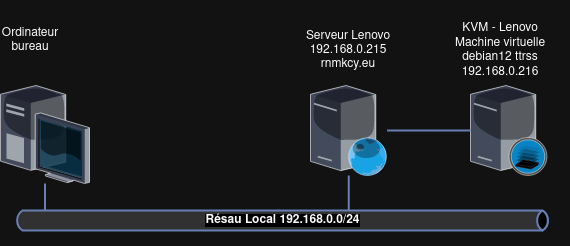
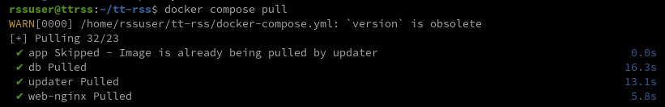
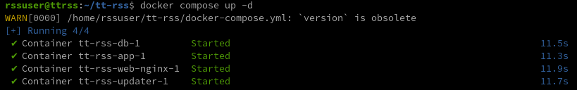
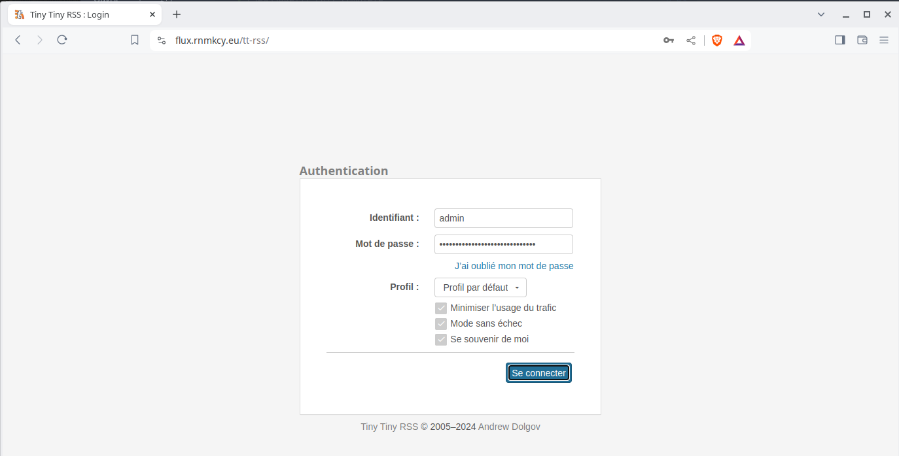
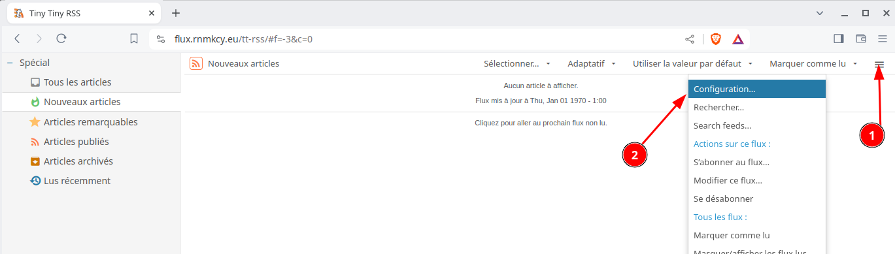
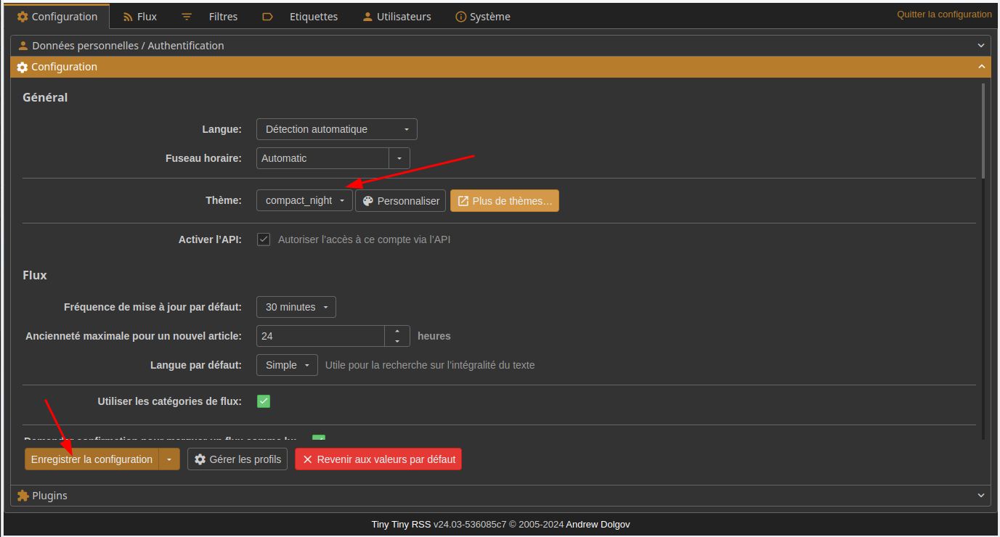
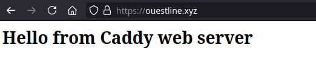

+++
title = 'Lenovo KVM - Tiny Tiny RSS (docker) + Serveur web Caddy ouestline.xyz'
date = 2024-07-06 00:00:00 +0100
categories = rss
+++
*[Tiny Tiny RSS](https://tt-rss.org/) (ttrss) est un agrégateur de flux RSS et Atom libre sous licence libre GNU GPL v3. Il s'agit d'une application web qui s'installe sur un serveur de type LAMP. Elle s'appuie notamment sur un SGBD qui peut être MySQL ou PostgreSQL, bien que ce dernier soit recommandé par la documentation officielle pour des raisons de performance et de fiabilité.* [Tiny Tiny RSS ({:height="12"}ikipédia)
](https://fr.wikipedia.org/wiki/Tiny_Tiny_RSS)



## Machine virtuelle Debian

{:height="50"}  
[Création rapide machine virtuelle KVM debian 12 nocloud](/posts/Creation_rapide_machine_virtuelle_KVM_debian_12_nocloud/)

Nom : ttrss  
Fichier : /srv/kvm/libvirt/images/ttrss.qcow2  
Mémoire : 2048 Mo  
hostname : ttrss  
Utilisateur : rssuser  
Adresse IP statique : 192.168.0.216  
Clés ssh : ttrss  
Port SSH : 55216  

Connexion ssh : `ssh -p 55216 -i ~/.ssh/ttrss rssuser@192.168.0.216`

```
Linux ttrss 6.1.0-18-amd64 #1 SMP PREEMPT_DYNAMIC Debian 6.1.76-1 (2024-02-01) x86_64
  _____  _              _____  _              ___  ___  ___ 
 |_   _|(_) _ _  _  _  |_   _|(_) _ _  _  _  | _ \/ __|/ __|
   | |  | || ' \| || |   | |  | || ' \| || | |   /\__ \\__ \
   |_|  |_||_||_|\_, |   |_|  |_||_||_|\_, | |_|_\|___/|___/
                 |__/                  |__/                 
  _  ___  ___     _   __  ___     __     ___  _   __        
 / |/ _ \|_  )   / | / / ( _ )   /  \   |_  )/ | / /        
 | |\_, / / /  _ | |/ _ \/ _ \ _| () |_  / / | |/ _ \       
 |_| /_/ /___|(_)|_|\___/\___/(_)\__/(_)/___||_|\___/  
Last login: Fri Mar 15 12:55:06 2024 from 192.168.0.20
```

## Docker

{:height="50"}  
[Installer Docker CE (Community Edition) sur Debian](/posts/Installer_Docker_CE_sur_Debian/)


## Tiny Tiny RSS


### Caractéristiques

*    Logiciel libre, sous licence GNU GPLv3 ;
*    Auto-hébergé : contrôlez vos propres données et protégez votre vie privée au lieu de dépendre de services tiers ;
*    Prend en charge :
     *   l'agrégation de flux / la syndication,
     *   Raccourcis clavier,
     *   importation/exportation OPML,
     *   multiples façons de partager : exportation de flux RSS, plugins pour divers sites sociaux, partage par URL, etc,
     *   partage de contenu arbitraire par tt-rss,
     *   Plugins et thèmes,
     *   intégration du contenu complet d'un article via readability et des plugins spécifiques au site,
     *   déduplication, y compris le hachage perceptuel pour les images,
        podcasts,
     *   filtrage flexible des articles,
     *   API JSON,
        et bien plus encore...
*    Client Android 

### Tiny Tiny RSS via docker

Vous aurez besoin des éléments suivants :

*    Un navigateur web moderne. Il s'agit généralement d'un navigateur récent de type Chrome ou compatible 
*   Un serveur (VDS ou VPS) exécutant Docker 

Guide d'installation de Docker

Tiny Tiny RSS utilise un modèle de développement continu basé sur la [branche master de git](https://git.tt-rss.org/fox/tt-rss.git/) qui est considérée comme stable. Si possible, vous devriez toujours utiliser le dernier code de la branche master.

[Avec docker compose](https://tt-rss.org/wiki/InstallationNotes#docker-compose.yml)  
La seule façon supportée d'exécuter tt-rss est sous Docker. Vous pouvez utiliser les images officielles de Docker Hub (AMD64 uniquement).

Cette installation utilise PostgreSQL et exécute tt-rss en utilisant plusieurs conteneurs.

Créer le dossier

    mkdir ~/tt-rss
    cd ~/tt-rss

Les fichiers [environnement ".env" et "docker-compose.yml"](https://tt-rss.org/wiki/InstallationNotes#docker-compose.yml) à modifier  
Lier le port exposé à 127.0.0.1 pour fonctionner derrière un proxy inverse sur le même hôte. Si vous prévoyez d'exposer le conteneur, supprimez "127.0.0.1 :" dans le fichier .env

<details>
<summary><b>Etendre Réduire fichier .env</b></summary>
  
# Put any local modifications here.

# Run FPM under this UID/GID.
OWNER_UID=1000
OWNER_GID=1000

# FPM settings.
PHP_WORKER_MAX_CHILDREN=5
PHP_WORKER_MEMORY_LIMIT=256M

# ADMIN_USER_* settings are applied on every startup.

# Set admin user password to this value. If not set, random password will be generated on startup, look for it in the 'app' container logs.
ADMIN_USER_PASS=FeigneDindeRagrafeCompluMalade

# Sets admin user access level to this value. Valid values:
# -2 - forbidden to login
# -1 - readonly
#  0 - default user
# 10 - admin
ADMIN_USER_ACCESS_LEVEL=10

# Auto create another user (in addition to built-in admin) unless it already exists.
AUTO_CREATE_USER=yann
AUTO_CREATE_USER_PASS=Mot_de_passe_yann
AUTO_CREATE_USER_ACCESS_LEVEL=10

# Default database credentials.
TTRSS_DB_USER=postgres
TTRSS_DB_NAME=postgres
TTRSS_DB_PASS=Mot_de_passe_base_postgres

# You will likely need to set this to the correct value - it should point to external tt-rss URL as seen in your browser.
TTRSS_SELF_URL_PATH=https://flux.rnmkcy.eu

# You can customize other config.php defines by setting overrides here. See tt-rss/.docker/app/Dockerfile for complete list. Examples:

# TTRSS_PLUGINS=auth_remote
# TTRSS_SINGLE_USER_MODE=true
# TTRSS_SESSION_COOKIE_LIFETIME=2592000
# TTRSS_FORCE_ARTICLE_PURGE=30
# ...

# Bind exposed port to 127.0.0.1 to run behind reverse proxy on the same host. If you plan expose the container, remove "127.0.0.1:".
HTTP_PORT=192.168.0.216:8280

</details>

<details>
<summary><b>Etendre Réduire fichier docker-compose.yml</b></summary>
  
version: '3'

services:
  db:
    image: postgres:15-alpine
    restart: unless-stopped
    env_file:
      - .env
    environment:
      - POSTGRES_USER=${TTRSS_DB_USER}
      - POSTGRES_PASSWORD=${TTRSS_DB_PASS}
      - POSTGRES_DB=${TTRSS_DB_NAME}
    volumes:
      - db:/var/lib/postgresql/data

  app:
    image: cthulhoo/ttrss-fpm-pgsql-static:latest
    restart: unless-stopped
    env_file:
      - .env
    volumes:
      - app:/var/www/
      - ./config.d:/opt/tt-rss/config.d:ro
    depends_on:
      - db

#  optional, makes weekly backups of your install
#  backups:
#    image: cthulhoo/ttrss-fpm-pgsql-static:latest
#    restart: unless-stopped
#    env_file:
#      - .env
#    volumes:
#      - backups:/backups
#      - app:/var/www/
#    depends_on:
#      - db
#    command: /opt/tt-rss/dcron.sh -f

  updater:
    image: cthulhoo/ttrss-fpm-pgsql-static:latest
    restart: unless-stopped
    env_file:
      - .env
    volumes:
      - app:/var/www/
      - ./config.d:/opt/tt-rss/config.d:ro
    depends_on:
      - app
    command: /opt/tt-rss/updater.sh

  web-nginx:
    image: cthulhoo/ttrss-web-nginx:latest
    restart: unless-stopped
    env_file:
      - .env
    ports:
      - ${HTTP_PORT}:80
    volumes:
      - app:/var/www/:ro
    depends_on:
      - app

volumes:
  db:
  app:
  backups:

</details>

Démarrez les conteneurs de services.

    docker compose up -d

### Mettre à jour un conteneur avec Docker Compose

L'utilisation de Docker Compose simplifie le processus de gestion des conteneurs Docker, y compris leurs mises à jour. Si vous êtes déjà familiarisé avec le téléchargement et l'utilisation des conteneurs Docker

Conditions préalables

*    Persistance des données : un aspect crucial à retenir est la perte potentielle de données lors du processus de mise à jour du conteneur. Sauf si vous avez configuré des volumes persistants dans votre docker-compose.ymlfichier, la mise à jour de votre conteneur peut effacer les données qui lui sont associées. Essentiellement, cela reviendrait à reconstituer le conteneur.
*    Identification des volumes persistants : Dans votre fichier Docker Compose, vous pouvez identifier les volumes persistants avec la balise **volumes:**

Récupérer la dernière image  
accédez au répertoire de votre conteneur qui héberge le fichier Docker Compose

    cd ~/tt-rss

Exécutez la commande 

    docker compose pull



Docker relayera une sortie indiquant s'il extrait l'image de conteneur la plus récente.

Déployer le conteneur mis à jour  
avec la dernière image en remorque, déployez le conteneur en utilisant :

    docker compose up -d



### Proxy nginx rnmkcy.eu

Sur le serveur Lenovo rnmkcy.eu, créer un proxy pour ttrss `/etc/nginx/conf.d/flux.rnmkcy.eu.conf`

```nginx
server {
    listen 80;
    listen [::]:80;
    server_name  flux.rnmkcy.eu;

    # redirect all plain HTTP requests to HTTPS
    return 301 https://flux.rnmkcy.eu$request_uri;
}

server {
    # ipv4 listening port/protocol
    listen       443 ssl http2;
    # ipv6 listening port/protocol
    listen           [::]:443 ssl http2;
    server_name  flux.rnmkcy.eu;

    include /etc/nginx/conf.d/security.conf.inc;

   location / {
      proxy_set_header Host $host;
      proxy_set_header X-Real-IP $remote_addr;
      proxy_set_header X-Forwarded-For $remote_addr;
      proxy_set_header X-Forwarded-Proto $scheme;
      
      proxy_pass http://192.168.0.216:8280/;
      break;
   }

}
```

Recharger nginx

### Paramétrage

ouvrir le lien  <https://flux.rnmkcy.eu>

{:width="600"}  
{:width="600"}  

{:width="600"}  
Thème

## ouestline.xyz

### Partage (virtiofs)

*Virtiofs est un système de fichiers partagé qui permet aux machines virtuelles d'accéder à une arborescence de répertoires sur l'hôte. Contrairement aux approches existantes, il est conçu pour offrir la sémantique et les performances d'un système de fichiers local.*

Ajoutez les éléments XML de domaine suivants pour partager le répertoire hôte /path avec l'invité

```xml
<domaine>
      ...
  <memoryBacking>
    <source type="memfd"/>
    <access mode="shared"/>
  </memoryBacking>
      ...
  <devices>
        ...
    <filesystem type="mount" accessmode="passthrough">
      <driver type="virtiofs"/>
      <source dir="/sharenfs"/>
      <target dir="media_tag"/>
      <address type="pci" domain="0x0000" bus="0x07" slot="0x00" function="0x0"/>
    </filesystem>
        ...
   </devices>
</domaine>
```

Créer dossier local

    mkdir ~/sharenfs

Le partage sur fstab

```
media_tag   /home/rssuser/sharenfs   virtiofs rw,_netdev 0 0
```

Recharger et monter

```
sudo systemctl daemon-reload
sudo mount -a
```

### Caddy server 

* [Caddy Proxy Reverse](https://ettayeb.fr/configuration-dun-reverse-proxy-avec-caddy/)  
* [Guide d'utilisation d'un serveur Caddy sous Linux](https://ettayeb.fr/guide-dutilisation-dun-serveur-caddy-sous-linux/)

### DNS OVH

```
$TTL 3600
@	IN SOA dns111.ovh.net. tech.ovh.net. (2024070608 86400 3600 3600000 300)
        IN NS     ns111.ovh.net.
        IN NS     dns111.ovh.net.
        IN AAAA     2a01:e0a:9c8:2081::1
    600 IN TXT     "v=spf1 mx ~all"
        IN CAA     128 issue "letsencrypt.org"
*        IN AAAA     2a01:e0a:9c8:2081::1
```

Tester caddy

```shell
sudo mkdir -p /var/caddy/
sudo bash -c 'echo "<h1>Hello from Caddy web server</h1>" > /var/caddy//index/'
```

Test lien   



## Parefeu

[Parefeu (firewall) UFW](/posts/Pare-Feu-UFW/)

Autoriser le port et les ip

    sudo ufw allow from 192.168.0.0/24  to any port 55216
    sudo ufw allow https

Les règles

```
Status: active

To                         Action      From
--                         ------      ----
443                        ALLOW       Anywhere                  
55216                      ALLOW       192.168.0.0/24            
443 (v6)                   ALLOW       Anywhere (v6)             
```


