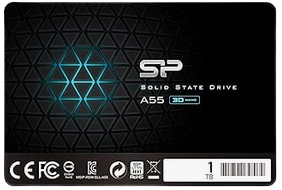
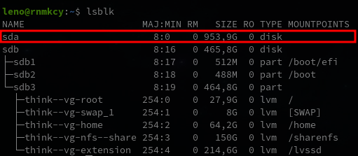
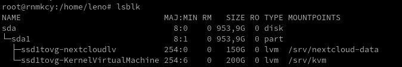

+++
title = 'Ajout disque stockage SSD'
date = 2024-08-10 00:00:00 +0100
categories = ['lvm']
+++
*Ajouter un disque SSD (Solid State Drive, matériel informatique permettant le stockage de données sur de la mémoire flash).*

- [Disque SSD 1To](#disque-ssd-1to)
    - [Créer partition LVM](#créer-partition-lvm)
- [LVM](#lvm)
    - [PV - Volume physique](#pv---volume-physique)
    - [VG - Groupe de volumes](#vg---groupe-de-volumes)
    - [LV - Volume logique](#lv---volume-logique)
        - [Volume logique nextcloudlv](#volume-logique-nextcloudlv)
        - [Volume logique KernelVirtualMachine](#volume-logique-kernelvirtualmachine)
        - [Vérification](#vérification)


## Disque SSD 1To

{:height="100"}  
SP Silicon Power 1To 2"5

En mode su

Après montage physique dans le serveur on exécute `lsblk`  


Le nouveau SSD 1To est connecté sur /dev/sda

### Créer partition LVM

    gdisk /dev/sda

<details>
<summary><b>Etendre Réduire</b></summary>
  
GPT fdisk (gdisk) version 1.0.9

Partition table scan:
  MBR: not present
  BSD: not present
  APM: not present
  GPT: not present

Creating new GPT entries in memory.

Command (? for help): o
This option deletes all partitions and creates a new protective MBR.
Proceed? (Y/N): Y

Command (? for help): n
Partition number (1-128, default 1): 
First sector (34-2000409230, default = 2048) or {+-}size{KMGTP}: 
Last sector (2048-2000409230, default = 2000408575) or {+-}size{KMGTP}: 
Current type is 8300 (Linux filesystem)
Hex code or GUID (L to show codes, Enter = 8300): 8E00
Changed type of partition to 'Linux LVM'

Command (? for help): w

Final checks complete. About to write GPT data. THIS WILL OVERWRITE EXISTING
PARTITIONS!!

Do you want to proceed? (Y/N): Y
OK; writing new GUID partition table (GPT) to /dev/sda.
The operation has completed successfully.

</details>

## LVM

### PV - Volume physique

*Un volume physique ou « PV » pour « physical volume » est tout simplement un disque ou une partition.*

```shell
pvcreate /dev/sda1
```

### VG - Groupe de volumes

*Un groupe de volumes ou « VG » pour « volume group » est un ensemble de volumes physiques. On a donc un ou plusieurs volumes physiques dans un groupe de volumes, et pour utiliser LVM, il faut obligatoirement au moins un groupe de volumes.*

```shell
vgcreate ssd1tovg /dev/sda1
```

### LV - Volume logique

*Un volume logique ou « LV » pour « logical volume » est un espace dans un groupe de volume où l'on peut mettre un système de fichiers.* 

#### Volume logique nextcloudlv

Création volume logique pour les données de nextcloud

```shell
lvcreate -L 150G -n nextcloudlv ssd1tovg
```

Format de la partition

```shell
mkfs.ext4 /dev/mapper/ssd1tovg-nextcloudlv
```

UUID de la partition : `blkid | grep "/dev/mapper/ssd1tovg-nextcloudlv"`

```
/dev/mapper/ssd1tovg-nextcloudlv: UUID="1be07569-dceb-4495-a5e9-9f82a42efe1d" BLOCK_SIZE="4096" TYPE="ext4"
```

Création point de montage `/srv/nextcloud-data` 

```shell
mkdir -p /srv/nextcloud-data
```

ajout ligne au fichier `/etc/fstab`

```
# /dev/mapper/ssd1tovg-nextcloudlv
UUID=1be07569-dceb-4495-a5e9-9f82a42efe1d /srv/nextcloud-data   ext4    defaults        0       2
```

Montage

```shell
systemctl daemon-reload
mount -a
```

#### Volume logique KernelVirtualMachine

Création volume logique pour les données de KVM

```shell
lvcreate -L 200G -n KernelVirtualMachine ssd1tovg
```

Format de la partition

```shell
mkfs.ext4 /dev/mapper/ssd1tovg-KernelVirtualMachine
```

UUID de la partition : `blkid | grep "/dev/mapper/ssd1tovg-KernelVirtualMachine"`

```
/dev/mapper/ssd1tovg-KernelVirtualMachine: UUID="1be07569-dceb-4495-a5e9-9f82a42efe1d" BLOCK_SIZE="4096" TYPE="ext4"
```

Création point de montage `/srv/KernelVirtualMachine-data` 

```shell
mkdir -p /srv/KernelVirtualMachine-data
```

ajout ligne au fichier `/etc/fstab`

```
# /dev/mapper/ssd1tovg-KernelVirtualMachine
UUID=53ca7740-115f-4593-ab04-a58401adaea9 /srv/kvm   ext4    defaults        0       2
```

Montage

```shell
systemctl daemon-reload
mount -a
```

#### Vérification



