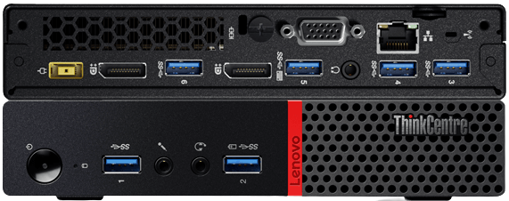
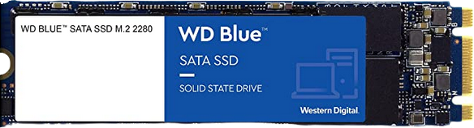
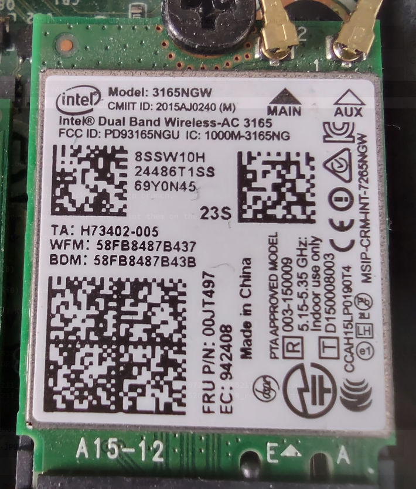
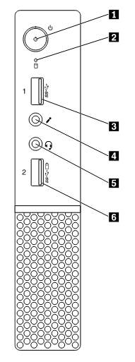
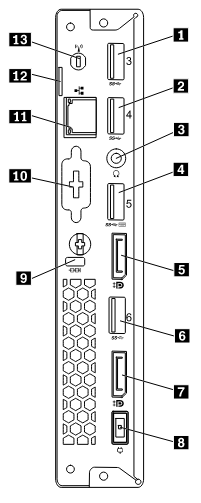
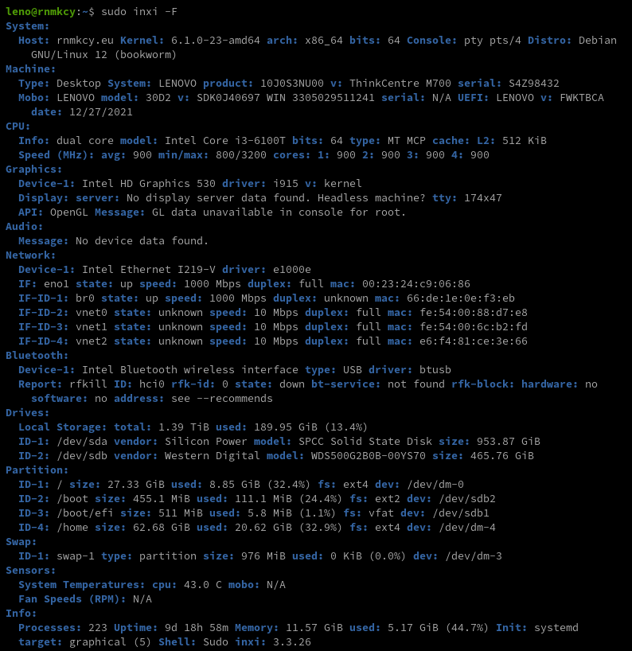

+++
title = 'Lenovo ThinkCentre M700 Tiny - Description matériel et mise à jour BIOS'
date = 2024-08-14 00:00:00 +0100
categories = ['ordinateur']
+++
{:height="150"} 
{:height=150}  
[ThinkCentre M700 and M900 User Guide](/files/m700_m900_tiny_ug_en.pdf) 

## Matériel

* Intel Core i3-6100T 2.20Ghz  
    - Nb. de cœurs     : 2
    - Nb. de threads   : 4
    - Fréquence de base : 3.20 GHz
    - Cache : 3 MB Intel® Smart Cache
    - Vitesse du bus : 8 GT/s
    - PDT : 35 W
* RAM DDR4 SODIMM 2133/2400  (max 2x8Go)
    * SLOT1 : 8 Go 
    * SLOT2 : 4 Go 
* SSD M.2 2280 500 Go  
{:height="50"}  
* HDD Mobile 1.8 To  
* Gigabit LAN  
* M.2 slots	M.2 2280/2242 M-key (SATA); M.2 2230 (WiFi/BT);  
* Dimensions (L x P x H) (mm) : 34,5 x 182,9 x 179 mm  
* Ports d'E/S (entrées/sorties)	
    * Avant : 
        * 2 USB 3.0 (dont un avec technologie Fast Charge)
        * 2 audio
    * Arrière : 
        * Jusqu'à 4 USB 3.0
        * DisplayPort™ + DisplayPort™ 1 série par retrait de cache (VGA / HDMI™ DisplayPort™ / Série)
        * 1 LAN
        * 1 audio
* WiFi et Bluetooth®	 {:width="150"}
    * 1 x 1 802.11 a/c WLAN + Bluetooth® 4.0
    * 2 x 2 802.11 a/c WLAN + Bluetooth® 4.0

| Vue avant | Vue arrière|
|:------- | :---------- |
|||
|1 Bouton d'alimentation |1 Connecteur USB 3.0|
|2 Voyant d'activité de l'unité de stockage|2 Connecteur USB 3.0|
|3 Connecteur USB 3.0 |3 Connecteur de casque|
|4 Connecteur du micro|4 Connecteur USB 3.0|
|5 Connecteur de casque |5 Connecteur DisplayPort®|
|6 Connecteur Always On USB 3.0|6 Connecteur USB 3.0|
||7 Connecteur DisplayPort|
||8 Connecteur du boîtier d'alimentation|
||9 Prise de sécurité|
||10 Connecteur en option (sur certains modèles)|
||11 Port Ethernet |
||12 Anneau pour cadenas|
||13 Emplacement de l'antenne Wi-Fi|

### Informations détaillées



## Mise à jour BIOS
Télécharger le fichier iso sur le site [Flash BIOS Update - Intel B150 for ThinkCentre M700 Tiny, ThinkCentre M800, M900, M900x Tiny](https://support.lenovo.com/de/en/downloads/ds105487-flash-bios-update-intel-b150-for-thinkcentre-m700-tiny-thinkcentre-m800-m900-m900x-tiny)

    wget https://download.lenovo.com/pccbbs/thinkcentre_bios/fwj9bcusa.iso  # Version FWKTBCA27 Jan 2022

```
    Checksum Tips

    SHA256: 7a0e889d697c225f73bdc27df7830e0a89a41ccc1bdb1c3ede60d872412b5c01
    SHA1: 59256372e3e785ba7d0807a9e990340d870d07f2
    MD5: d3fc782a415fb9c9a06ad25782ae5876
```

[How to update Lenovo BIOS from Linux without using Windows](https://www.cyberciti.biz/faq/update-lenovo-bios-from-linux-usb-stick-pen/)

Installer utilitaire

```
sudo -s
cd /usr/local/bin
wget https://userpages.uni-koblenz.de/~krienke/ftp/noarch/geteltorito/geteltorito/geteltorito
chmod +x geteltorito
exit
```

Extraire l'image

    geteltorito -o m700.img fwj9bcusa.iso

```
Booting catalog starts at sector: 18 
Manufacturer of CD: FWJTBCA
Image architecture: x86
Boot media type is: harddisk
El Torito image starts at sector 28 and has 32130 sector(s) of 512 Bytes

Image has been written to file "m700.img".
```

Identifier la clé USB : `sudo dmesg` , /dev/sdc dans notre cas  
Exécutez la commande suivante pour écrire l'image nommée m700.img sur la clé USB 

    sudo dd if=m700.img of=/dev/sdc bs=64K status=progress

Installation du paquet

1.  Veuillez prendre note de tous les paramètres que vous avez modifiés dans l'utilitaire BIOS
    de l'utilitaire de configuration. Il se peut que vous deviez les saisir à nouveau après la mise à jour du BIOS. 
    le BIOS.                                                    
2.  Utilisez le programme de mise à jour flash en le plaçant dans une clé USB amorçable.  
    Tout d'abord, interrompez le processus de démarrage en appuyant sur la touche ENTER. Appuyez ensuite sur la touche F12 et sélectionnez le périphérique de stockage de masse USB comme source de démarrage. Assurez-vous que l'alimentation de votre ordinateur portable est branchée. Dans certains cas, la batterie doit être chargée à 80-100%. Assurez-vous de suivre les instructions à l'écran pour mettre à jour le BIOS.
3.  Le niveau actuel du BIOS de l'ordinateur est comparé à celui de la mise à jour flash.
    la mise à jour flash. Si les niveaux sont identiques, ou si le niveau de la mise à jour
    mise à jour est plus ancien que celui de la ROM, un message s'affiche, indiquant que
    "Le fichier de la ROM du BIOS est plus ancien que (ou identique à) l'image de la ROM du BIOS.    
    Continuer quand même ? (y/n)", tapez 'y'.                        
4.  La mise à jour peut prendre jusqu'à 2 minutes. N'éteignez pas et ne redémarrez pas le
    système pendant cette procédure !                                
5.  Une fois la mise à jour flash terminée, le système redémarre automatiquement.
    N'oubliez pas de retirer le dispositif flash, sinon vous risquez d'être
    obtenir une nouvelle mise à jour de votre BIOS. 
