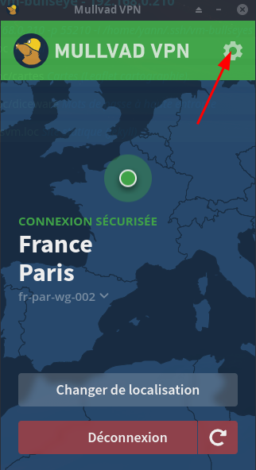
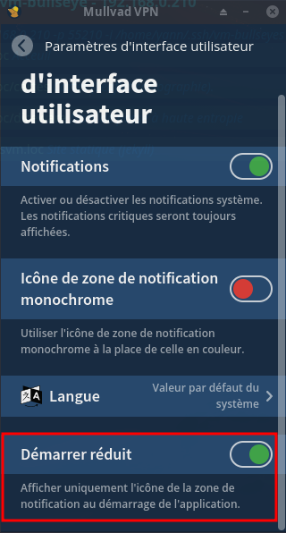
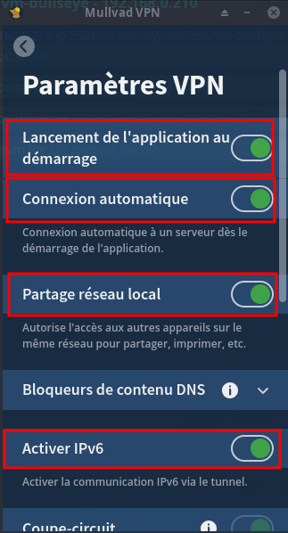
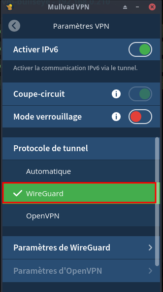

+++
title = 'Mullvad 2024'
date = 2024-09-14 00:00:00 +0100
categories = vps wireguard
+++
*[Mullvad VPN/Wireguard](https://www.mullvad.net/fr/) : Débits excellents en filaire et 4G, Gère IPv6, Obfuscation et protection post-quantique avec WireGuard, Confidentialité irréprochable, Vraie interface graphique pour Linux*

## Mullvad

Mullvad VPN ne propose pas d’extension pour navigateur. À défaut, le fournisseur a développé son propre navigateur en collaboration avec Tor Project, [Mullvad Browser](https://mullvad.net/fr/browserhttps://mullvad.net/fr/browser), disponible sur l’ensemble des systèmes d’exploitation desktop.

On peut installer Mullvad sur un routeur, ce qui leur permet de profiter de la protection VPN sur tous leurs équipements connectés au réseau, contre cinq appareils autorisés en temps normal. Des explications détaillées pour plusieurs modèles sont disponibles dans un guide dédié (en anglais).

### Protection des données et vie privée

Le code de Mullvad VPN est open source et disponible sur GitHub.  
Mullvad semble être l'un des VPN les plus à cheval sur l'anonymat de ses utilisateurs.

### Chiffrement, protocole et DNS

Mullvad VPN utilise les protocoles suivants :

*    OpenVPN TCP/UDP (Windows, macOS, Linux)
*    WireGuard (tous les systèmes d’exploitation desktop et mobiles pris en charge)

Concernant WireGuard, Mullvad propose quelques réglages avancés 

* permettant de sélectionner des ports préconfigurés ou personnalisés
* obfusquer le trafic (dissimulation du trafic VPN dans du trafic HTTPS standard via UDP sur TCP)
* activer une protection contre les attaques quantiques (échange supplémentaire de clés résistantes aux qbits)
* activer la prise en charge IPv6 pour les appareils dépossédés d’IPv4
* forcer les connexions multihop (trafic routé par plusieurs serveurs VPN compatibles WireGuard pour brouiller les tentatives de pistage).

*Mullvad VPN dispose de ses propres serveurs DNS pour garantir un niveau de confidentialité élevé sur Internet. En les mettant à l’épreuve avec dnsleaktest.com, nous n’avons pas repéré de fuites. Pour le chiffrement, ce VPN utilise le standard AES (Advanced Encryption Standard) 256.*

### Streaming vidéo

Côté streaming, il y a du mieux avec la version 2024 de Mullvad, nous avons débloqué sans problèmes les catalogues US et UK des services de SVoD Netflix et BBC.  
En revanche, Amazon détecte toujours l’utilisation du VPN. Si vous êtes abonné à Prime Video et souhaitez poursuivre vos séries à l’étranger, il faudra opter pour un fournisseur concurrent de Mullvad, comme Surfshark, NordVPN ou Proton VPN.

### Torrents/P2P

Mullvad VPN ne propose pas de serveurs spécifiques pour le téléchargement de fichiers torrent, mais nous n'avons rencontré aucune difficulté pour télécharger une image ISO d'une distribution Linux en mode P2P.

### Options avancées

De prime abord, Mullvad VPN propose peu d'options avancées et le service lui-même est assez basique. Il est toutefois possible de retrouver quelques fonctionnalités classiques
* le kill switch qui coupe la connexion Internet en cas de panne du VPN pour ne pas compromettre vos données
* le split tunneling qui permet d’exclure le trafic de certaines applications du tunnel VPN.
* dans les paramètres de connexion du VPN, on découvre aussi un mode de verrouillage, sorte de kill switch très strict qui bloque toute connexion entrante et sortante lorsque le VPN est volontairement désactivé
* un mode multihop (compatible WireGuard uniquement, sans possibilité de sélectionner manuellement les serveurs entrants et sortants)
* des options de dissimulation du trafic et de résistance aux attaques quantiques
* Divers bloqueurs de contenu DNS font office de bloqueurs de pub, de traqueurs, de malwares et de contrôle parental.

*Mullvad fait partie des rares services capables de fonctionner en IPv6.* 

### Conclusion

Mullvad a connu de nettes améliorations. 

* Toujours à la pointe en matière de débits (filaires et 4G, en France et à l’étranger), il surpasse de loin ses concurrents et s’impose comme le service VPN le plus rapide. 
* On apprécie ses engagements forts pour la confidentialité et la sécurité des données privées qui, outre les protections VPN traditionnelles, bénéficient d’un soin particulier apporté par la mise à disposition de fonctionnalités avancées, peut-être trop bien cachées. 
* Si l’on devait lui trouver des défauts, on insisterait principalement sur son interface manquant de flexibilité et son organisation en sous-menus trop complexe. 
* Dans l’ensemble, Mullvad gagnerait à être davantage connu. 

## Archlinux Mullvad

* [Using the Mullvad VPN app](https://mullvad.net/en/help/using-mullvad-vpn-app)
* [Utilisation application VPN Mullvad (traduction)](/htmldoc/Utilisation application VPN Mullvad.html)

Installation

    yay -S mullvad-vpn-bin

Si erreur gpg

```
[yano@e6230 ~]$ gpg --keyserver hkps://keys.openpgp.org --recv-keys  A1198702FC3E0A09A9AE5B75D5A1D4F266DE8DDF
gpg: clef D5A1D4F266DE8DDF : clef publique « Mullvad (code signing) <admin@mullvad.net> » importée
gpg:       Quantité totale traitée : 1
gpg:                     importées : 1
```

#### Paramétrage

{:width="150"}  {:width="150"}  
{:width="150"}  {:width="150"}  
