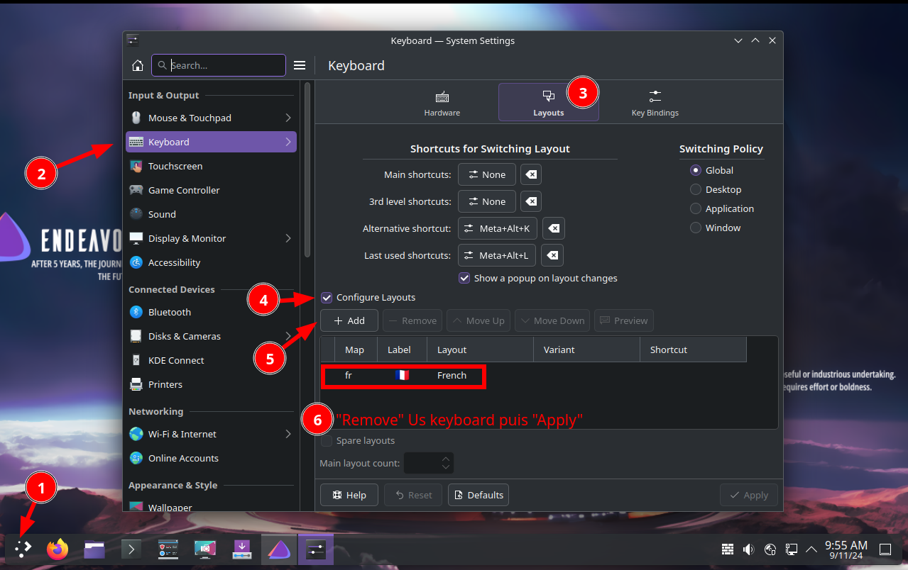

+++
title = 'Basculer EndeavourOS chiffré vers EndeavourOS chiffré LVM/LUKS'
date = 2024-09-16 00:00:00 +0100
categories = ['archlinux', 'chiffrement', 'lvm']
+++
*Transférer une installation EndeavourOS chiffrée LUKS vers EndeavourOS chiffrée LVM/LUKS sur un autre disque*


## EndeavourOS

### Prérequis

* Une machine avec une installation Endeavour chiffrée **LUKS sur une partition**  
* Clé USB Live EndeavourOS
* Un disque SSD externe USB

L'installation de base chiffrée 

* **LUKS sur une partition**, configuration basique et simple pour une racine entièrement chiffrée LUKS.
    * <u>Avantages</u>:
        * partitionnement et configuration simples
        * Sur un disque partitionné GPT, systemd peut auto-monter la partition racine.
    * <u>Inconvénients</u>:
        * Inflexible
        * l'espace disque à chiffrer doit être pré-alloué

Après les opérations de transfert

* **LVM/LUKS**, flexibilité de partitionnement en utilisant LVM dans une seule partition cryptée LUKS.
    * <u>Avantages</u>:
        * partitionnement simple avec connaissance de LVM
        * Une seule clé nécessaire pour déverrouiller tous les volumes (p. ex. installation facile de récupération de disque)
        * Mise en page du volume non visible lorsque verrouillé
        * Méthode la plus facile pour permettre la [suspension du disque](https://wiki.archlinux.org/title/Dm-crypt/Swap_encryption#With_suspend-to-disk_support)
    * <u>Inconvénients</u>:
        * LVM ajoute une couche de mappage supplémentaire et un "hook"
        * Moins utile, si un volume doit recevoir une clé séparée

### Démarrer sur Eos USB Live 

Insérer la clé USB EndeavourOS, redémarrer la machine, sur Eos live 

`Clavier QWERTY!!!`{: .prompt-warning }  

{:width="600"}  
Remove Us...   
Apply  

On va se connecter en SSH  

```
ip a # relever adresse IP
sudo systemctl start sshd
passwd liveuser  # changer le mot de passe liveuser --> rtyuiop
sudo firewall-cmd --zone=public --add-port=22/tcp
```

Se connecter depuis un poste sur le même réseau: `ssh liveuser@adresse_IP`

### Disque USB externe

Connecter le disque USB externe sur un port de la machine  

Relever le mappage des disques : `lsblk` 

```
NAME   MAJ:MIN RM   SIZE RO TYPE MOUNTPOINTS
loop0    7:0    0   2.4G  1 loop /run/archiso/airootfs
sda      8:0    0 119.2G  0 disk 
├─sda1   8:1    0     1G  0 part 
└─sda2   8:2    0 118.2G  0 part 
sdb      8:16   1   3.7G  0 disk 
├─sdb1   8:17   1   2.5G  0 part /run/archiso/bootmnt
└─sdb2   8:18   1   155M  0 part 
sdc      8:32   0 447.1G  0 disk 
├─sdc1   8:33   0     1G  0 part 
└─sdc2   8:34   0 446.1G  0 part 
```

Le disque SSD de 480GB est sur `/dev/sdc`

Zapper le disque,

(**Attention** Ceci effacera de manière irréversible toutes les données de votre disque, veuillez sauvegarder toutes les données importantes) :

```
sgdisk --zap-all /dev/sdc
```

On partitionne un disque en 2 avec `gdisk`

* Partition 1 : 512M EFI (code ef00) système de fichier FAT32
* Partition restante LVM (code 8e00) système de fichier EXT4

Créer une table de partition GPT à l'aide de la commande `sgdisk` :

```
sgdisk --clear --new=1:0:+550MiB --typecode=1:ef00 --new=2:0:0 --typecode=2:8e00 /dev/sdc
```

Format la partition EFI

```
mkfs.fat -F32 /dev/sdc1 
```

Le mappage

```
sdc      8:32   0 447.1G  0 disk 
├─sdc1   8:33   0   550M  0 part 
└─sdc2   8:34   0 446.6G  0 part 
```

**Déchiffrer système actuel**

Le système actuel chiffré `/dev/sda2`

Dans l'environnement live-CD, ouvrez un Terminal ,basculez en mode su et tapez (ou marquez et copiez la ligne avec ctrl-c et collez dans le terminal avec shift-ctrl-v ) …

```shell
cryptsetup luksOpen /dev/sda2 crypttemp # saisir la phrase mot de passe de l'installation
mkdir -p /media/crypttemp
mount /dev/mapper/crypttemp /media/crypttemp 
```

Nos données d'installation sont désormais accessibles sous `/media/crypttemp`   

```
bin  boot  dev	efi  etc  home	lib  lib64  lost+found	mnt  opt  proc	root  run  sbin  srv  sys  tmp	usr  var
```

**Créer un système sur le disque externe**

Chiffrer la partition /dev/sdc2,saisir la passphrase définitive

```shell
cryptsetup luksFormat --type luks2 /dev/sdc2
```

Une demande de confirmation est exigée

```
WARNING!
========
This will overwrite data on /dev/sdc2 irrevocably.

Are you sure? (Type 'yes' in capital letters): YES
Enter passphrase for /dev/sdc2: 
Verify passphrase: 
```

Choisissez un mot de passe sécurisé ( <https://xkcd.com/936/> )

```shell
cryptsetup luksOpen /dev/sdc2 crypt #    Enter passphrase for /dev/sdc2:
pvcreate /dev/mapper/crypt          #    Physical volume "/dev/mapper/crypt" successfully created.
vgcreate vg0 /dev/mapper/crypt      #    Volume group "vg0" successfully created
```

Une bonne taille de départ pour le volume racine (lvroot) est d'environ 30 Go. Si vous envisagez d'utiliser ultérieurement un fichier d'échange résidant sur root, vous devez en tenir compte.  
Le redimensionnement ultérieur des volumes est assez facile, alors n'y réfléchissez pas trop.  
Vous pouvez attribuer tout l'espace libre restant au volume d'accueil,  
`lvcreate --extents 100%FREE vg0 -n lvhome`  
mais pour augmenter les volumes plus tard et pour les instantanés , il faut de l'espace vide à l'intérieur du groupe de volumes, donc je choisis généralement une taille pour lvhome qui laisse environ 30 Go d'espace inutilisé global dans le volume groupe (en supposant un lecteur de 500 Go, par exemple 500 – 0,512 – 40 – 430 = 29,488)

```shell
# 40G root 
lvcreate -L 40G vg0 -n lvroot   #  Logical volume "lvroot" created.
lvcreate -L 120G vg0 -n lvhome  #  Logical volume "lvhome" created.
#lvcreate -l 100%FREE vg0 -n lvhome  #  Logical volume "lvhome" created.
```

Créez un système de fichiers ext4 sur les volumes logiques.

```shell
mkfs.ext4 -L root /dev/mapper/vg0-lvroot
mkfs.ext4 -L home /dev/mapper/vg0-lvhome
```

### Montage sur "mnt"

Monter le nouveau système sur `/mnt` pour les systèmes UEFI

```shell
mount /dev/mapper/vg0-lvroot /mnt
mkdir -p /mnt/home
mount /dev/mapper/vg0-lvhome /mnt/home
mkdir -p /mnt/efi
mount /dev/sdc1 /mnt/efi
```

Le mappage

```
lsblk
```

devrait maintenant fournir une sortie similaire à la suivante (ignorez les tailles, celles-ci proviennent d'une installation de test) …

pour les systèmes UEFI :

```
NAME             MAJ:MIN RM   SIZE RO TYPE  MOUNTPOINTS
loop0              7:0    0   2.4G  1 loop  /run/archiso/airootfs
sda                8:0    0 119.2G  0 disk  
├─sda1             8:1    0     1G  0 part  
└─sda2             8:2    0 118.2G  0 part  
  └─crypttemp    254:0    0 118.2G  0 crypt /media/crypttemp
sdb                8:16   1   3.7G  0 disk  
├─sdb1             8:17   1   2.5G  0 part  /run/archiso/bootmnt
└─sdb2             8:18   1   155M  0 part  
sdc                8:32   0 447.1G  0 disk  
├─sdc1             8:33   0   550M  0 part  /mnt/efi
└─sdc2             8:34   0 446.6G  0 part  
  └─crypt        254:1    0 446.6G  0 crypt 
    ├─vg0-lvroot 254:2    0    40G  0 lvm   /mnt
    └─vg0-lvhome 254:3    0   120G  0 lvm   /mnt/home
```

### Cloner système temporaire

pour vider les nouveaux points de montage

```
rsync -avA /media/crypttemp/ /mnt
```

*Veuillez patienter quelques minutes*

### Démonter système temporaire

```shell
umount /media/crypttemp
cryptsetup luksClose crypttemp
```

### Configurer "crypttab"

Configuration `/etc/crypttab`

```
cryptsetup luksUUID /dev/sdc2
```

renvoie **3380a759-f14f-49ba-bb63-8fb8c67265d2**  
Votre UUID sera différent, alors <u>**assurez-vous d'utiliser votre UUID à l'étape suivante !**</u>

```
nano /mnt/etc/crypttab
```

contient une ligne non commentée commençant par `luks-`...  
Remplacez cette ligne par la suivante ; <u>**n'oubliez pas d' utiliser votre UUID**</u> , ajouter `,fido2-device=auto` en fin de ligne si utilisation FIDO2

```
cryptlvm UUID=3380a759-f14f-49ba-bb63-8fb8c67265d2     none luks,fido2-device=auto
```

Sauvegarder et quitter.

### Basculer en chroot

Passer en chroot

```
arch-chroot /mnt
```

Installer le boot efi

    booctl install

Résultat de la commande

```
Created "/efi/EFI".
Created "/efi/EFI/systemd".
Created "/efi/EFI/BOOT".
Created "/efi/loader".
Created "/efi/loader/entries".
Created "/efi/EFI/Linux".
Copied "/usr/lib/systemd/boot/efi/systemd-bootx64.efi" to "/efi/EFI/systemd/systemd-bootx64.efi".
Copied "/usr/lib/systemd/boot/efi/systemd-bootx64.efi" to "/efi/EFI/BOOT/BOOTX64.EFI".
⚠️ Mount point '/efi' which backs the random seed file is world accessible, which is a security hole! ⚠️
⚠️ Random seed file '/efi/loader/.#bootctlrandom-seedbbb198a50e8f5dd5' is world accessible, which is a security hole! ⚠️
Random seed file /efi/loader/random-seed successfully written (32 bytes).
Created EFI boot entry "Linux Boot Manager".
```

### Configurer "fstab"

Configurer /etc/fstab

```
blkid -s UUID -o value /dev/sdc1
```

renvoie l'UUID du volume /dev/sdc1 :  **F8C4-3B1C**.

blkid -s UUID -o value /dev/

```
blkid -s UUID -o value /dev/mapper/vg0-lvroot
```

renvoie l'UUID du volume racine :  **1cc4ed5a-33a8-423d-865b-27527870d076**.

```
blkid -s UUID -o value /dev/mapper/vg0-lvhome
```

renvoie l'UUID du volume home : **0e507988-cacb-4cd7-913a-c9227e7737b3**.

```
nano /etc/fstab
```

contient une ligne commençant par `/dev/mapper/luks-`...  
**Supprimez** cette ligne et ajoutez ce qui suit (<u>**n'oubliez pas d' utiliser vos UUID**</u>)

```
UUID=F8C4-3B1C                            /efi           vfat    fmask=0137,dmask=0027 0 2
UUID=1cc4ed5a-33a8-423d-865b-27527870d076 / ext4 noatime 0 0
UUID=0e507988-cacb-4cd7-913a-c9227e7737b3 /home ext4 noatime 0 0
tmpfs                                     /tmp           tmpfs   defaults,noatime,mode=1777 0 0
leno@rnmkcy.eu:/sharenfs /home/yano/sharenfs fuse.sshfs noauto,x-systemd.automount,_netdev,user,idmap=user,follow_symlinks,identityfile=/home/yano/.ssh/rnmkcy.eu_key,port=55215,allow_other,default_permissions,uid=1000,gid=1000 0 0
```

Sauvegarder et quitter.

### Options du noyau


Dans **systemd-boot**, vous éditez le fichier d'entrée approprié qui se trouve sur votre partition EFI dans le répertoire `loader/entries`  
Chaque entrée est une option de démarrage dans le menu et chacune a une ligne appelée options. Vous pouvez modifier ces entrées directement, mais ces changements peuvent être écrasés lors de l'installation ou de la mise à jour de paquets.

UUID de /dev/sdc2 : `blkid -s UUID -o value /dev/sdc2`

renvoie l'UUID du volume /dev/sdc2 : **3380a759-f14f-49ba-bb63-8fb8c67265d2**

Pour effectuer les changements, au lieu de modifier les entrées, modifiez le fichier `/etc/kernel/cmdline` qui est un fichier d'une ligne contenant une liste d'options du noyau.  

    nano /etc/kernel/cmdline

```
nvme_load=YES nowatchdog rw rd.luks.uuid=3380a759-f14f-49ba-bb63-8fb8c67265d2 root=/dev/mapper/vg0-lvroot
# Plymouth
# nvme_load=YES nowatchdog splash rw rd.luks.uuid=3380a759-f14f-49ba-bb63-8fb8c67265d2 root=/dev/mapper/vg0-lvroot
```

Exécutez ensuite `sudo reinstall-kernels` qui remplira les entrées et régénérera les initrds.

    reinstall-kernels

### Sortie chroot 

```
exit
umount -R /mnt
```

Oter la clé USB , redémarrer

```
reboot
```

`FINI! Vous devriez maintenant avoir un système LVMonLUKS fonctionnel avec un volume logique séparé pour /home`{: .prompt-info }

