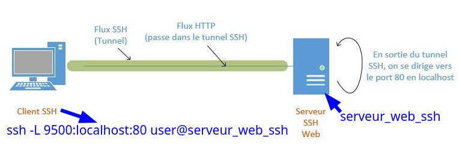

+++
title = 'Serveur vpn wireguard'
date = 2024-09-19 00:00:00 +0100
categories = vpn wireguard
+++
*WireGuard est un serveur VPN à code source ouvert, gratuit, moderne et rapide, doté d'un chiffrement de pointe. Il est plus rapide et plus simple que l'IPSec et l'OpenVPN. Il est associé à Unbound qui améliore le DNS et à un parefeu UFW pour la sécurité.*

## Unbound

{:width="100"}

*Un problème majeur avec beaucoup de configurations VPN/Wireguard est que le DNS n'est pas suffisant. Cela finit par une fuite de connexion client et de détails d'emplacement (test via le site <http://ipleak.net/>*

Pour l'installation complète **Unbound** qui ajoute la mise à jour des serveurs "racine", le blocage des publicités et des DMP (Data Management Platforms), voir lien [Résolveur DNS Unbound](/posts/unbound-resolveur-DNS/)
{: .prompt-info } 

Nous allons sécuriser le trafic DNS avec la solution **unbound** qui offre les caractéristiques suivantes

* Léger et rapide
* Facile à installer et à configurer
* Orienté sécurité
* Prise en charge DNSSEC 

Nous allons le configurer de manière à contrer les fuites DNS, les attaques plus sophistiquées comme la fausse configuration de proxy, les routeurs escrocs et toutes sortes d'attaques MITM sur HTTPS et autres protocoles.

Nous installons unbound sur le serveur    

ATTENTION : Le programme **resolvconf** est en général seulement nécessaire quand un système a plusieurs programmes qui ont besoin de modifier de façon dynamique les informations sur les serveurs de noms de domaine. Sur un système simple où les serveurs de noms de domaine ne changent pas souvent ou bien ne sont modifiés que par un programme, le <u>fichier de configuration **resolv.conf** est suffisant</u>.  
Il faut installer **resolvconf**, sinon on a une erreur **unbound-resolvconf**  
Une fois le paquet «  **resolvconf**  » installé, <u>il ne faut plus modifier le fichier</u> « **/etc/resolv.conf**  », car le contenu de celui-ci sera automatiquement géré et remplacé par  **resolvconf** 

Installation des outils dns, des paquets Unbound et resolv :  

    sudo apt install unbound resolvconf -y

Ajout d'un fichier de configuration **unbound-wg.conf**  

    sudo nano /etc/unbound/unbound.conf.d/unbound-wg.conf 
    
```    
server:
    # ne rien enregistrer dans les journaux hormis les erreurs
    verbosity: 0

    # n'écouter que sur l'interface locale en IPv4
    # unbound nécessite d'être relancé si modifié
    interface: 127.0.0.1

    port: 53

    # refuser tout le monde sauf les connexions locales (pas forcément
    # nécessaire vu que le serveur n'écoute que sur la boucle locale en IPv4)
    access-control: 0.0.0.0/0 refuse
    access-control: 127.0.0.1/32 allow

    # par défaut, unbound ne log pas les requêtes ni les réponses
    # on peut le rappeler au cas où
    log-queries: no
    log-replies: no

    # imposer la QNAME minimisation (RFC 7816)
    # Pour mieux protéger la vie privée
    qname-minimisation: yes
    # même si le serveur faisant autorité ne le veut pas
    #   après discussion, il est possible que cette option ne soit
    #   pas recommandée dans le cadre d'un résolveur ouvert
    qname-minimisation-strict: yes
```

Vérifier la validité du fichier de configuration avec la commande
suivante :

```bash
sudo unbound-checkconf /etc/unbound/unbound.conf.d/unbound-wg.conf
```

*unbound-checkconf: no errors in /etc/unbound/unbound.conf.d/unbound-wg.conf*

Toutes les règles disponibles sont détaillées dans le manuel `man 5 unbound.conf` ou [dans le manuel en ligne](https://nlnetlabs.nl/documentation/unbound/unbound.conf/).

Démarrer le résolveur.

```bash
sudo systemctl start unbound.service
```

S'assurer que tout fonctionne bien à l'aide de la commande
`dig` disponible dans le paquet `bind9-dnsutils` ou `dnsutils`. Pour cela il
suffit de spécifier l'adresse de notre résolveur, ici `127.0.0.1` ou `::1` et
d'effectuer une requête DNS. Ici on demande à Unbound de récupérer
l'enregistrement `AAAA` associé au nom de domaine `afnic.fr`.

```bash
dig @127.0.0.1 A afnic.fr
```

Résultat commande 

```
; <<>> DiG 9.18.28-1~deb12u2-Debian <<>> @127.0.0.1 A afnic.fr
; (1 server found)
;; global options: +cmd
;; Got answer:
;; ->>HEADER<<- opcode: QUERY, status: NOERROR, id: 37353
;; flags: qr rd ra ad; QUERY: 1, ANSWER: 1, AUTHORITY: 0, ADDITIONAL: 1

;; OPT PSEUDOSECTION:
; EDNS: version: 0, flags:; udp: 1232
;; QUESTION SECTION:
;afnic.fr.			IN	A

;; ANSWER SECTION:
afnic.fr.		600	IN	A	51.178.83.21

;; Query time: 232 msec
;; SERVER: 127.0.0.1#53(127.0.0.1) (UDP)
;; WHEN: Sun Sep 15 14:53:14 GMT 2024
;; MSG SIZE  rcvd: 53
```

Une réponse est bien renvoyée. Le résolveur fonctionne.Vérifier que tout est opérationnel en IPv4, et en utilisant UDP et TCP.

```
$ dig +notcp @127.0.0.1 A afnic.fr  # connexion UDP en IPv4 au résolveur
$ dig +tcp @127.0.0.1 A afnic.fr    # connexion TCP en IPv4 au résolveur
```

À ce stade, un résolveur Unbound est configuré en local et écoute sur le port
`53`. Il peut donc être utilisé pour résoudre toutes les requêtes en provenance
de la machine.
{: .prompt-info }

## Parefeu UFW

Installation

    sudo apt install ufw

Ajout des règles pour ssh et wireguard

```bash
sudo ufw allow 52255/udp # wireguard
sudo ufw allow 55027/tcp # ssh
sudo ufw allow DNS
```

Activation

    sudo ufw enable

Status `sudo ufw status`

```
Status: active

To                         Action      From
--                         ------      ----
55027/tcp                  ALLOW       Anywhere                  
52255/udp                  ALLOW       Anywhere                  
DNS                        ALLOW       Anywhere                  
55027/tcp (v6)             ALLOW       Anywhere (v6)             
52255/udp (v6)             ALLOW       Anywhere (v6)             
DNS (v6)                   ALLOW       Anywhere (v6)             
```

**Désactiver les règles IPv6 utilisant UFW sur Linux**  
Le désactivation des règles IPv6 dans UFW est relativement facile. Ouvrez simplement le fichier de configuration UFW `/etc/default/ufw`   
Remplacer `IPV6=yes` par `IPV6=no`  
Recharger : `sudo ufw reload`

## Wireguard

{:width="50"}  
*WireGuard est un serveur VPN à code source ouvert, gratuit, moderne et rapide, doté d'un chiffrement de pointe. Il est plus rapide et plus simple que l'IPSec et l'OpenVPN*  

Wireguard est dans le noyau 5.6+

    sudo apt install wireguard

### Autorisations

**Autoriser le serveur Wireguard à relayer les paquets **

Autoriser le serveur Wireguard à relayer les paquets venant de ces clients vers l'internet et de traiter les paquets retours (modifier **/etc/sysctl.conf**)  
On passe en mode su : `sudo -s`

```
sed -i 's/^#net.ipv4.ip_forward=1/net.ipv4.ip_forward=1/' /etc/sysctl.conf
sed -i 's/^#net.ipv6.conf.all.forwarding=1/net.ipv6.conf.all.forwarding=1/' /etc/sysctl.conf
sysctl -p # prise en compte immédiate
```

Résultat

```
net.ipv4.ip_forward = 1
net.ipv6.conf.all.forwarding = 1
```

### Générer une paire de clés

On passe en mode su : `sudo -s`

On se positionne dans le dossier **/etc/wireguard/**  

    cd /etc/wireguard

WireGuard repose sur une authentification par clé publique/privée (cryptographie asymétrique), vous devez donc créer ces clés avec les sous-commandes wg genkey et wg pubkey  
La création de la clé privée se fait avec wg genkey et la clé publique est générée en la canalisant dans wg pubkey

    umask 077; wg genkey | tee wg0.key | wg pubkey > wg0.pub

### Configuration wg0.conf

**Fichier de configuration /etc/wireguard/wg0.conf**

Récupérer le nom de la carte réseau et l'adresse IP, `ip a` :  
carte réseau **ens3**  
adresse IP **91.194.161.27**  

La première étape consiste à choisir une plage IPV4 privée, [Random IPV4 Private Address Generator](https://www.fakeaddresstool.com/random-ipv4-private-generator/), qui sera utilisée par le serveur : **10.30.55.0/8**  

Pour une adresse IPV6 [Local IPv6 Address Generator](https://www.unique-local-ipv6.com)  : **fd27:4ae2:2ed9::/64**  

Les adresses locales uniques (ULA) IPv6 sont utilisées de la même manière que les adresses locales IPv4, telles que 10.0.0.0/8. Les adresses privées IPv4 ont été définies par la RFC 1918, tandis que les ULA IPv6 ont été définies par la RFC 4193. Contrairement à leur équivalent IPv4, les adresses locales IPv6 ont une partie aléatoire de 40 bits, ce qui les rend uniques. L'objectif des adresses locales IPv6 est que si vous connectez deux réseaux IPv6 privés ensemble - tels que deux sites privés connectés par VPN - il est très peu probable que vous rencontriez des conflits d'adressage.
{: .prompt-info }

Le serveur aura l'adresse IP suivante: 10.30.55.1 . Il est également nécessaire de choisir un port, qui sera exposé publiquement, pour que le serveur écoute.Le port de documentation standard est généralement 51820.

Créer le fichier **/etc/wireguard/wg0.conf** serveur wg0

    /etc/wireguard/wg0.conf

```
[Interface]
Address = 10.30.55.1, fd27:4ae2:2ed9::1
ListenPort = 52255
PostUp = ufw route allow in on wg0 out on ens3
PostUp = iptables -t nat -I POSTROUTING -o ens3 -j MASQUERADE; ip6tables -t nat -A POSTROUTING -o ens3 -j MASQUERADE
PreDown = ufw route delete allow in on wg0 out on ens3
PreDown = iptables -t nat -D POSTROUTING -o ens3 -j MASQUERADE; ip6tables -t nat -D POSTROUTING -o ens3 -j MASQUERADE
# wg0_PRIVATE_KEY
PrivateKey = 5Z........................................mk=
DNS = 10.30.55.1, fd27:4ae2:2ed9::1
```

**Address** , fixer l'adresse IP privée du serveur à l'intérieur du VPN.Les adresses du réseau VPN de 10.30.55.0 à 10.30.55.255 sont fixées par le masque **/24** et fd27:4ae2:2ed9::1 à fd27:4ae2:2ed9::ffff sont fixées par le masque **/128**  
**PostUp** , pour la mise en place des règles iptables de translation d'adresses à l'activation du VPN (autoriser le routage des paquets réseau venant des clients vers internet)  
**PostDown** , pour la suppression des règles iptables de translation d'adresses à l'arrêt du VPN  
**PrivateKey** , clé privée du serveur (wg0.key)  
**DNS =** Pour utiliser un pair comme serveur DNS, définissez DNS = wireguard_internal_ip_address_of_peer dans la section [Interface]. Les domaines de recherche sont également définis avec l'option DNS =. Séparez toutes les valeurs dans la liste par des virgules.
**AllowedIPs =** Pour acheminer tout le trafic du tunnel vers un pair spécifique, ajoutez l'itinéraire par défaut (0.0.0.0/0 pour IPv4 et ::/0 pour IPv6) à AllowedIPs. Par exemple, AllowedIPs = 0.0.0.0/0, ::/0. wg-quick se chargera automatiquement de configurer le routage correct et fwmark [5] pour que le réseau fonctionne toujours.

Modifier les droits des fichiers **wg0.conf** (lecture uniquement par "root")

    chmod 600 /etc/wireguard/wg0.conf

### Activer wireguard

Pour une activation permanente de wireguard 

    sudo systemctl enable wg-quick@wg0.service

### Modifier unbound

Modifier le fichier de configuration **unbound-wg.conf** pout y ajouter l'adresse IP privée 10.30.55.1 

    sudo nano /etc/unbound/unbound.conf.d/unbound-wg.conf 

```
server:
    # ne rien enregistrer dans les journaux hormis les erreurs
    verbosity: 0

    # n'écouter que sur l'interface locale en IPv4
    # unbound nécessite d'être relancé si modifié
    interface: 127.0.0.1
    interface: 10.30.55.1

    port: 53

    # refuser tout le monde sauf les connexions locales (pas forcément
    # nécessaire vu que le serveur n'écoute que sur la boucle locale en IPv4)
    access-control: 0.0.0.0/0 refuse
    access-control: 127.0.0.1/32 allow
    access-control: 10.30.55.0/24 allow

    # par défaut, unbound ne log pas les requêtes ni les réponses
    # on peut le rappeler au cas où
    log-queries: no
    log-replies: no

    # imposer la QNAME minimisation (RFC 7816)
    # Pour mieux protéger la vie privée
    qname-minimisation: yes
    # même si le serveur faisant autorité ne le veut pas
    #   après discussion, il est possible que cette option ne soit
    #   pas recommandée dans le cadre d'un résolveur ouvert
    qname-minimisation-strict: yes
```

Relancer unbound

    sudo systemctl restart unbound

## Wireguard wg-gen-web

*Le but est d'exécuter Wg Gen Web dans un espace et WireGuard sur le système hôte.[wg-gen-web (original)](https://github.com/vx3r/wg-gen-web)*

### Caractéristiques

 * Libre-service et basé sur le web
 * QR-Code pour une configuration pratique du client mobile
 * Support optionnel multi-utilisateurs derrière un proxy d'authentification
 * Prise en charge de l'authentification simple
 * Zéro dépendance externe - juste un binaire unique utilisant le module noyau wireguard
 * Déploiement de binaires et de conteneurs

### Prérequis

**Installer go**

```bash
cd ~
wget https://go.dev/dl/go1.23.1.linux-amd64.tar.gz
sudo tar -C /usr/local -xzf go1.23.1.linux-amd64.tar.gz
echo "export PATH=$PATH:/usr/local/go/bin"  >> ~/.bashrc
source ~/.bashrc
```

Version `go version` --> go version go1.23.1 linux/amd64

**Installer node**

```bash
curl -fsSL https://deb.nodesource.com/setup_20.x | sudo bash -
sudo apt-get install -y nodejs
```

Versions `node -v && npm -v`  
v20.17.0  
10.8.2  


Vous devez avoir WireGuard installé sur la machine qui exécute `wg-ui`

### Application web

Création dossier application web

    sudo mkdir -p /opt/appwg

Construction du site

```bash
cd ~/wg-webui-fr/
go mod tidy
go build -o wg-ui main.go
cd ui
export NODE_OPTIONS=--openssl-legacy-provider
export VUE_APP_API_BASE_URL=http://localhost:8080/api/v1.0
npm install
npm run build
sudo mkdir -p /opt/appwg/ui
sudo cp ../wg-ui /opt/appwg
sudo cp -r dist /opt/appwg/ui/
```

### Environnement

l'autorisation à 2 facteurs n'est pas utilisée, le fichier **/opt/appwg/.env** se résume à remplir la zone correspondante SMTP de la messagerie et désactiver l'autorisation

    /opt/appwg/.env

```
SERVER=127.0.0.1
PORT=8090
# Gin framework release mode
#GIN_MODE=release
GIN_MODE=debug

WG_CONF_DIR=/etc/wireguard
WG_INTERFACE_NAME=wg0.conf

SMTP_HOST=127.0.0.1
SMTP_PORT=587
SMTP_USERNAME=""
SMTP_PASSWORD=""
SMTP_FROM="wg-web-ui@wg-web-ui.xyz"
```  

>On modifie dans **/opt/appwg/.env** ,le paramètre WG_CONF_DIR=./wireguard &rarr; `WG_CONF_DIR=/etc/wireguard`  

### Créer service wgweb

Créer un service systemd **wgweb** qui lance le serveur avec journalisation  

    sudo nano /etc/systemd/system/wgweb.service

```
[Unit]
Description=Wireguard web
After=network.target

[Service]

Type=simple

Restart=on-failure
RestartSec=10

WorkingDirectory=/opt/appwg
ExecStart=/opt/appwg/wg-ui

[Install]
WantedBy=multi-user.target
```

### Créer et configurer server.json

**wireguard (wg0.conf et server.json)**

Modifier les fichiers existants pour être identique au paramétrage de wireguard **wg0.conf** situé sous **/etc/wireguard**

    /etc/wireguard/server.json 

```json
{
 "address": [
    "10.30.55.1", 
    "fd27:4ae2:2ed9::1"
  ],
  "listenPort": 51820,
  "mtu": 0,
  "privateKey": "A----------------------------------------c=",
  "publicKey": "v----------------------------------------c=",
  "endpoint": "91.194.161.27:52255",
  "persistentKeepalive": 16,
  "dns": [
    "10.30.55.1", 
    "fd27:4ae2:2ed9::1"
  ],
  "allowedips": [
    "0.0.0.0/0",
    "::/0"
  ],
  "preUp": "",
  "postUp": "ufw route allow in on wg0 out on ens3; iptables -t nat -I POSTROUTING -o ens3 -j MASQUERADE; ip6tables -t nat -A POSTROUTING -o ens3 -j MASQUERADE",
  "preDown": "ufw route delete allow in on wg0 out on ens3; iptables -t nat -D POSTROUTING -o ens3 -j MASQUERADE; ip6tables -t nat -D POSTROUTING -o ens3 -j MASQUERADE",
  "postDown": "",
  "updatedBy": "Yann",
  "created": "2024-09-15T18:00:50.589913433Z",
  "updated": "2024-09-15T18:00:50.589913433Z"
}
```

Recharger `systemd` puis démarrer le service:

    sudo systemctl daemon-reload
    sudo systemctl start wgweb.service
    sudo systemctl status wgweb.service

```
● wgweb.service - Wireguard web
[...]
sept. 15 16:57:25 icevps.xyz wg-ui[14292]: [GIN-debug] Listening and serving HTTP on 127.0.0.1:8090
```

### Démarrer service wireguard

Lancer wireguard

    sudo systemctl start wg-quick@wg0.service

### Accès page Web Wireguard 

On utilise la redirection port SSH ([Tunneling SSH](https://www.it-connect.fr/chapitres/tunneling-ssh/))  
   

Vérification,ouvrir un terminal sur le client linux qui dispose des clés ssh et lancer la commande

    ssh -L 9500:localhost:8090 hallmar@91.194.161.27 -p 55027 -i /home/yann/.ssh/icevps_xyz

Ouvrir un navigateur sur le client et saisir `localhost:9500` pour afficher le gestionnaire web de wireguard


Activer le service si tout fonctionne

    sudo systemctl enable wgweb.service

### Reconstruire wg-web

On peut recompiler l'application wg-web suite à des modifications

Procédure de reconstruction `$HOME/reconstruire.sh`

```bash
cat > $HOME/reconstruire.sh << EOF
#!/bin/bash

echo "Arrêt wgweb.service"
sudo systemctl stop wgweb.service
echo "Sauvegarde"
sudo cp /opt/appwg/.env _.env
echo "Supprimer appwg"
sudo rm -r /opt/appwg
echo "Construire wg-ui main.go"
cd $HOME/wg-webui-fr/
go mod tidy
go build -o wg-ui main.go
cd ui
export NODE_OPTIONS=--openssl-legacy-provider
export VUE_APP_API_BASE_URL=http://localhost:8080/api/v1.0
npm install
npm run build
sudo mkdir -p /opt/appwg/ui
sudo cp ../wg-ui /opt/appwg
sudo cp -r dist /opt/appwg/ui/
echo "Restaurer environnement"
sudo cp $HOME/_.env /opt/appwg/.env
echo "Démarrer le service"
sudo systemctl start wgweb.service
echo "FIN reconstruction"
EOF
```

La rendre exécutable

    chmod +x $HOME/reconstruire.sh