+++
title = 'VSCodium, éditeur de code source multiplateforme et multi langage'
date = 2024-09-24 00:00:00 +0100
categories = application
+++
*VSCodium, l’alternative open source à Microsoft Visual Studio Code*

## VSCodium

{:height="100"}

### Prérequis

Installation sur archlinux `yay -S vscodium-bin` pose problème de dépendances installées par une autre application.  
Installation de VSCodium se fera par **flatpak**

Installer flatpak sur archlinux

    yay -S flatpak

### Installation via flatpak

[How to Install VSCodium on Ubuntu 24.04, 22.04, or 20.04](https://linuxcapable.com/install-vscodium-on-ubuntu-linux/)  

**Installer VSCodium via la commande Flatpak**  
Avec le dépôt Flathub, nous pouvons passer à l'installation de VSCodium. Cela implique la commande flatpak install. Pour démarrer le déploiement de VSCodium, utilisez la commande suivante :

```bash
flatpak install flathub com.vscodium.codium -y
```

Cette commande récupère VSCodium directement depuis Flathub et assure une installation optimale sur votre système.

### Méthode CLI pour lancer VSCodium 

Pour ceux qui préfèrent une interaction rapide avec le terminal, utilisez la commande suivante pour lancer VSCodium 

    flatpak run com.vscodium.codium

Si vous voulez lancer `codium /path/to/file` du terminal hôte, ajoutez simplement ceci
dans le fichier bashrc

```bash
alias codium="flatpak run com.vscodium.codium "
```

### Fichier de bureau (.desktop)

Créer un fichier bureau `~/.local/share/applications/com.vscodium.codium.desktop`

```
[Desktop Entry]
Version=1.1
Type=Application
Name=VSCodium
GenericName=Editeur de code source multiplateforme et multi langage
Comment=Gestionnaire de bases de données universel et Client SQL.
Icon=vscodium
Exec=/usr/bin/flatpak run com.vscodium.codium
Categories=Development;IDE;
```

### Mise à jour VSCodium

Pour maintenir VSCodium à jour, vous devez régulièrement vérifier la présence de mises à jour. Linux rend ce processus relativement simple.

    flatpak update

Les commandes ci-dessus vérifieront en bloc les mises à jour de VSCodium et de tous les paquets installés à l'aide du gestionnaire de paquets de votre choix.

### Supprimer VSCodium

Pour les installations Flatpak de VSCodium, exécutez la commande suivante pour supprimer le logiciel :

    flatpak uninstall com.vscodium.codium

## Utilisation

### Première utilisation de VSCodium

Pour mettre VSCodium en français

1. Menu `View>Command Palet` (ou `Ctrl+Maj+P`).
2. Saisir `Configure Display Language` dans la zone de recherche qui s'est ouverte, puis valider.
3. Choisir `français` puis Cliquez sur le bouton `Restart` qui est alors proposé.

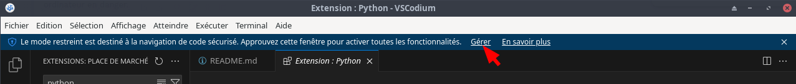  
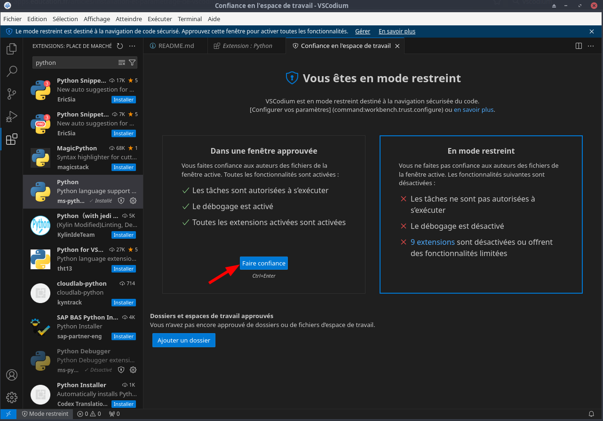  
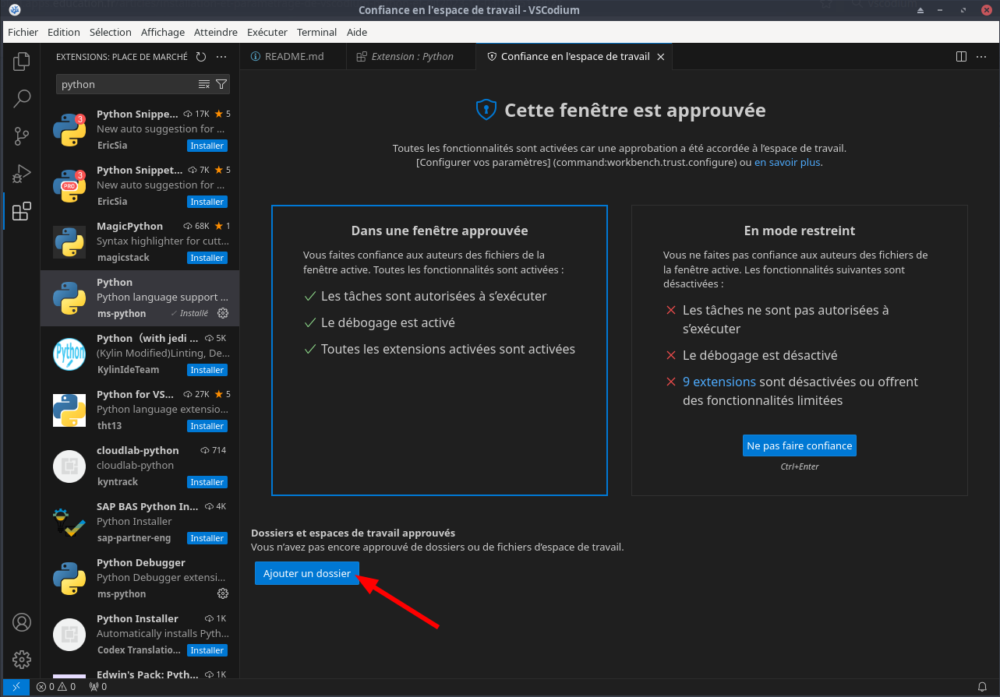  
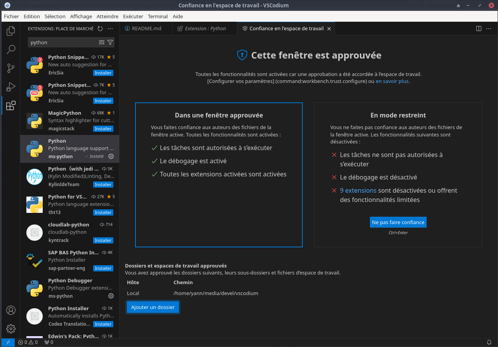  

### Python

A gauche, dans la rubrique "Extension" (ou Ctrl+Maj+X), installer l'extension Python (de l'éditeur ms-python avec comme descriptif : IntelliSense (Pylance), Linting, Debugging (multi-threaded, remote), code formatting, ...)  
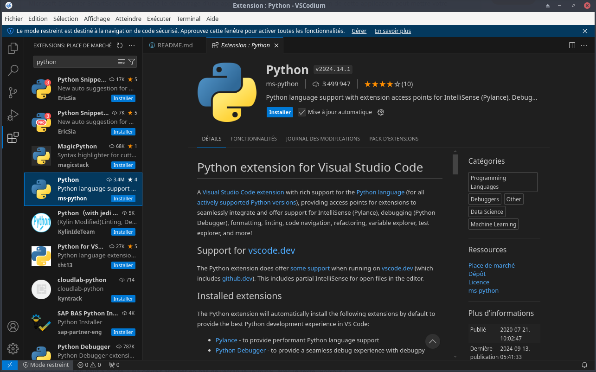


Aller dans le menu `Affichage>Palette de commandes...` (ou Ctrl+Maj+P).

Saisir `Python: Select Interpreter` dans la zone de recherche qui s'est ouverte, puis valider.  
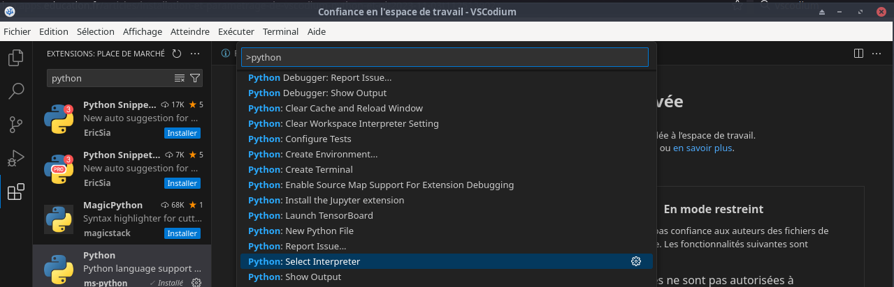  

Choisir à présent l'interpréteur (ex : Python 3.11)
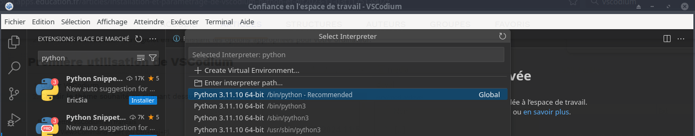  

Menu `Fichier>Nouveau fichier...`, saisir main.py puis appuyer sur la touche Entrée.  
Choisir toujours le même dossier, par exemple : `~/media/devel/vscodium/` puis valider.

Saisir le code source d'un premier programme simple, comme :  
`print("Bonjour !")`  
puis cliquer sur le bouton d'exécution (de forme triangulaire : Run Python File) en haut à droite.  
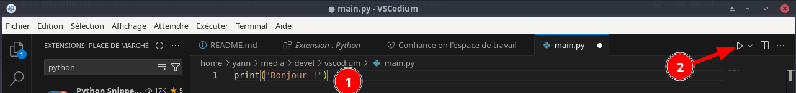  
Cela devrait afficher en bas de l'écran le Terminal, avec le texte "Bonjour !".  
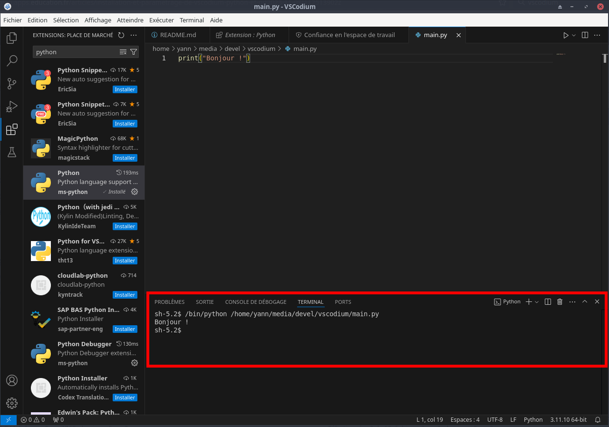  

### Markdown

[Astuces pour VSCodium](https://humanize.me/nerd/vscode-vscodium.html)

**Changer la couleur des titres Markdown**

Quand on commence à créer des fichiers Markdown à la pelle, on a un peu tendance à voir ses yeux couler sur son clavier, notamment à cause des titres de niveau 1, de niveau 2, de niveau 3, etc., qui, par défaut, ont tous la même couleur ! Faut-il installer une extension pour changer ça ? Non !

Ouvrir les préférences (raccourci `Ctrl + ,`   
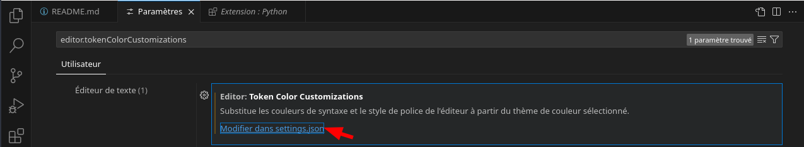  

Dans la barre de recherche, cherche `editor.tokenColorCustomizations`  
Clic sur "Modifier dans settings.json"  
Là, VSCode t'as prérempli le paramètre :  
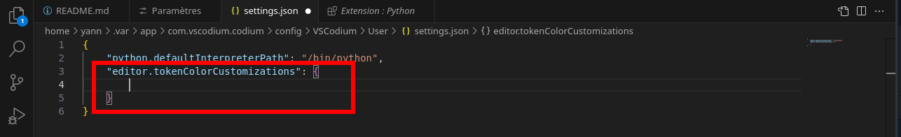  

Tu peux alors remplacer ces 5 lignes par cette nouvelle configuration, qui va appliquer des couleurs sur tes titres Markdown de niveaux 2, 3 et 4 :

```json
"editor.tokenColorCustomizations": {
    "textMateRules": [
        {
            "scope": "heading.2.markdown entity.name.section.markdown, heading.2.markdown punctuation.definition.heading.markdown",
            "settings": {
                "foreground": "#FF6B6B",
            }
        },
        {
            "scope": "heading.3.markdown entity.name.section.markdown, heading.3.markdown punctuation.definition.heading.markdown",
            "settings": {
                "foreground": "#FABE28",
            }
        },
        {
            "scope": "heading.4.markdown entity.name.section.markdown, heading.4.markdown punctuation.definition.heading.markdown",
            "settings": {
                "foreground": "#4ECDC4",
            }
        }
    ]
}
```

Sauvegarder  
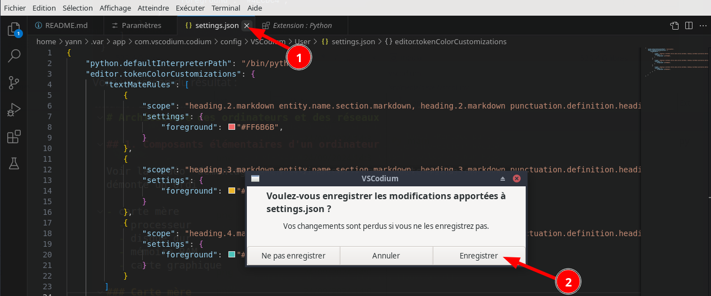  

Résultat  
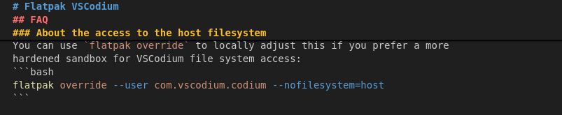  
