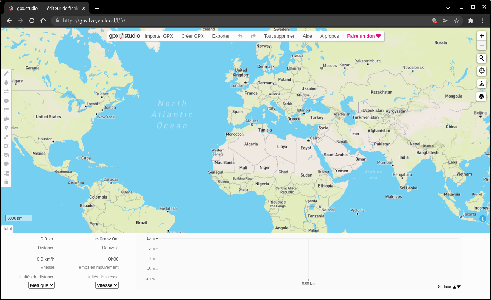
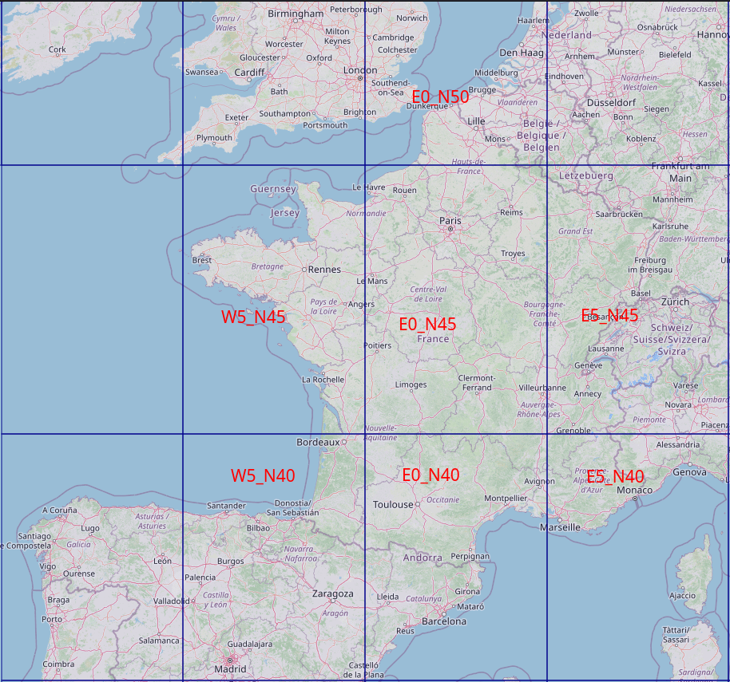

+++
title = 'Visualisation et édition des traces gpx (gpxstudio.github.io)'
date = 2024-10-01 00:00:00 +0100
categories = ['cartographie']
+++
*Affichez, éditez et créez des fichiers GPX en ligne avec des outils avancés de planification et de traitement de fichiers, de magnifiques cartes et des visualisations de données détaillées*

## gpx.rnmkcy.eu

{:width="300"}  
<https://github.com/gpxstudio>

Création dossier

    sudo mkdir -p /sharenfs/rnmkcy/
    sudo chown $USER:$USER -R /sharenfs/rnmkcy

Aller dans le dossier

    cd /sharenfs/rnmkcy/

### Cloner gpxstudio.github.io

Dépôt source

```bash
git clone https://github.com/gpxstudio/gpxstudio.github.io.git
```

Modifier la clé API **mapbox** ainsi que **routing_url** dans le fichier `/sharenfs/rnmkcy/gpxstudio.github.io/res/config.json`

```json
{
    "mapbox": "pk.cG1yZTNwcnJ3MzkifQ.YZnNs9sZDBjcjkzZXJ4bHZ1GlvIiwiYSI6ImNrdTowYkn-xmoUszyIOIDYw",
    "mapbox_dev": "pk.eyJ1IjoiZ3B4c3R1ZGlvIiwiYSI6ImNrdHVoM2pjNTBodmUycG1yZTNwcnJ3MzkifQ.YZnNs9s9oCQPzoXAWs_SLg",
    "routing_url": "https://routeur.rnmkcy.eu"
}

```

Le fichier index.html

Le fichier layers 

/sharenfs/rnmkcy/gpxstudio.github.io/js/layers.js  
/sharenfs/rnmkcy/gpxstudio.github.io/js/buttons.js

### Configuration nginx

Configuration nginx site <https://gpx.rnmkcy.eu>

```nginx
server {
    listen 443 ssl http2;
    listen [::]:443 ssl http2;
    server_name gpx.rnmkcy.eu;

    include /etc/nginx/conf.d/security.conf.inc;
    root /sharenfs/rnmkcy/gpxstudio.github.io/;

    location / {
      index index.html;
    }
}
```

Recharger

    sudo systemctl reload nginx

{:width="600"}  
<https://gpx.exemple.fr/l/fr/>

### Afficher les autres cartes

Pour afficher les autres cartes  


### brouter-web

<https://github.com/nrenner/brouter-web>

*Comme alternative à la [version en ligne](https://brouter.de/brouter-web/), le serveur autonome de BRouter peut également être exécuté sur votre bureau local.*

**Prérequis:**  
Installer java  

    sudo apt install default-jre

Version : `java --version`

```
openjdk 17.0.12 2024-07-16
OpenJDK Runtime Environment (build 17.0.12+7-Debian-2deb12u1)
OpenJDK 64-Bit Server VM (build 17.0.12+7-Debian-2deb12u1, mixed mode, sharing)
```

**Dossier**  
Créer le dossier `brouter` dans `/sharenfs/rnmkcy/gpxstudio.github.io/`

**Procédure**

1. téléchargez et décompressez la dernière archive autonome (`brouter-web-standalone.<version>.zip`) à partir de https://github.com/nrenner/brouter-web/releases, par exemple pour Linux (remplacez `~/opt/` par votre répertoire d'installation préféré et `0.11.0` par la dernière version) :

        mkdir -p /sharenfs/rnmkcy/gpxstudio.github.io/brouter
        cd /sharenfs/rnmkcy/gpxstudio.github.io/brouter
        wget https://github.com/nrenner/brouter-web/releases/download/0.11.0/brouter-web-standalone.0.11.0.zip
        unzip brouter-web-standalone.0.11.0.zip
        rm brouter-web-standalone.0.11.0.zip

2. téléchargez un ou plusieurs fichiers de données rd5 depuis le [download directory](https://brouter.de/brouter/segments4/) ou le [grid map](https://umap.openstreetmap.de/de/map/brouter-rd5-grid_9438) dans le répertoire `segments4`.

  
<https://brouter.de/brouter/segments4/W5_N45.rd5>

La structure

```
/sharenfs/rnmkcy/gpxstudio.github.io/brouter
.
├── brouter.jar
├── brouter-web
├── brouter-web-standalone.0.11.0.zip
├── customprofiles
├── profile_developers_guide.txt
├── profiles2
├── run.sh
├── segments4
├── srv.sh
└── standalone
```

Les dossiers

```
leno@rnmkcy:/sharenfs/rnmkcy/gpxstudio.github.io/brouter$ ls
brouter.jar                        customprofiles                run.sh     standalone
brouter-web                        profile_developers_guide.txt  segments4
profiles2                     srv.sh

leno@rnmkcy:/sharenfs/rnmkcy/gpxstudio.github.io/brouter$ ls segments4/
W5_N45.rd5

leno@rnmkcy:/sharenfs/rnmkcy/gpxstudio.github.io/brouter$ ls profiles2/
car-eco.brf                  Hiking-Alpine-SAC6.brf          shortest.brf
car-fast.brf                 Hiking-Alpine-SAC6-private.brf  trekking.brf
car-vario.brf                hiking-beta.brf                 trekking-ignore-cr.brf
dummy.brf                    lookups.dat                     trekking-noferries.brf
fastbike-asia-pacific.brf    moped.brf                       trekking-nosteps.brf
fastbike.brf                 rail.brf                        trekking-steep.brf
fastbike-lowtraffic.brf      river.brf                       vm-forum-liegerad-schnell.brf
fastbike-verylowtraffic.brf  safety.brf                      vm-forum-velomobil-schnell.brf
```

### brouter-server

Le bash `/sharenfs/rnmkcy/gpxstudio.github.io/brouter/srv.sh`

```bash
#!/bin/sh

BINDADDRESS="localhost"
# BRouter standalone server
# java -cp brouter.jar btools.brouter.RouteServer <segmentdir> <profile-map> <customprofiledir> <port> <maxthreads> [bindaddress]

# maxRunningTime is the request timeout in seconds, set to 0 to disable timeout
JAVA_OPTS="-Xmx128M -Xms128M -Xmn8M -DmaxRunningTime=300"

# If paths are unset, first search in locations matching the directory structure
# as found in the official BRouter zip archive
CLASSPATH=${CLASSPATH:-"/sharenfs/rnmkcy/gpxstudio.github.io/brouter/brouter.jar"}
SEGMENTSPATH=${SEGMENTSPATH:-"/sharenfs/rnmkcy/gpxstudio.github.io/brouter/segments4"}
PROFILESPATH=${PROFILESPATH:-"/sharenfs/rnmkcy/gpxstudio.github.io/brouter/profiles2"}
CUSTOMPROFILESPATH=${CUSTOMPROFILESPATH:-"/sharenfs/rnmkcy/gpxstudio.github.io/brouter/customprofiles"}


java $JAVA_OPTS -cp $CLASSPATH btools.server.RouteServer "$SEGMENTSPATH" "$PROFILESPATH" "$CUSTOMPROFILESPATH" 17777 1 $BINDADDRESS
```

Créer un service brouter

    sudo nano /etc/systemd/system/brouter.service

```
[Unit]
Description=brouter server
 
[Service]
Type=exec
User=leno
WorkingDirectory=/sharenfs/rnmkcy/gpxstudio.github.io/brouter
ExecStart=sh /sharenfs/rnmkcy/gpxstudio.github.io/brouter/srv.sh
 
[Install]
WantedBy=multi-user.target
```

Recharger , activer et lancer le service **brouter**

```bash
sudo systemctl daemon-reload
sudo systemctl enable brouter --now
```

Serveur web **brouter** : <https://routeur.rnmkcy.eu>

```nginx
server {
    # ipv4 listening port/protocol
    listen       443 ssl http2;
    # ipv6 listening port/protocol
    listen           [::]:443 ssl http2;
    server_name  routeur.rnmkcy.eu;

    include /etc/nginx/conf.d/security.conf.inc;

  location / { 
      proxy_pass              http://127.0.0.1:17777;
  } 

}
```

Vérifier et recharger nginx 

```bash
sudo nginx -t
sudo systemctl reload nginx
```

Le site <https://gpx.rnmkcy.eu> est opérationnel

