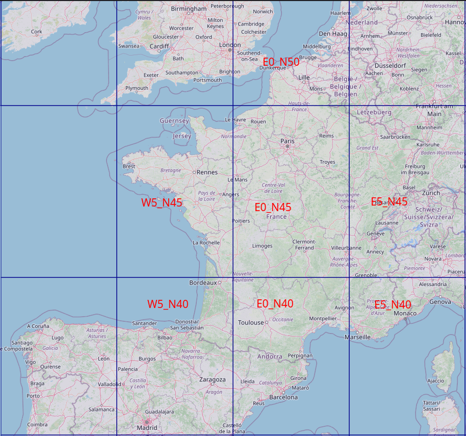

+++
title = 'Moteur de routage (BRouter) + Visualisation et édition traces gpx (gpx.studio)'
date = 2024-10-02 00:00:00 +0100
categories = ['cartographie']
+++
*Tracer des itinéaires à l'aide du moteur de routage BRouter. Visualiser, éditer et créer des traces gpx avec un fork de l'application web <https://gpx.studio>* 

> **BRouter** et **gpx.studio** sont installés sur un serveur debian 12 cwwk rnmkcy.eu  `192.168.0.205`
{: .prompt-tip }

## BRouter

{: .normal}  
*BRouter est un moteur de routage conçu pour calculer des itinéraires optimaux en utilisant OpenStreetMap et des données d'élévation.  
Comme alternative à la [version en ligne](https://brouter.de/brouter-web/), le serveur autonome de BRouter peut également être exécuté localement (<https://github.com/nrenner/brouter-web>, <https://github.com/abrensch/brouter>).*

### Prérequis

Installer java  

    sudo apt install default-jre

Version : `java --version`

```
openjdk 17.0.12 2024-07-16
OpenJDK Runtime Environment (build 17.0.12+7-Debian-2deb12u1)
OpenJDK 64-Bit Server VM (build 17.0.12+7-Debian-2deb12u1, mixed mode, sharing)
```

### Procédure installation

Télécharger et décompresser la dernière archive autonome (`brouter-web-standalone.<version>.zip`) à partir de <https://github.com/nrenner/brouter-web/releases>, par exemple pour Linux (remplacez `~/opt/` par votre répertoire d'installation préféré et `0.11.0` par la dernière version) :

```bash
sudo mkdir -p /opt/brouter
sudo chown $USER:$USER /opt/brouter
cd /opt/brouter
wget https://github.com/nrenner/brouter-web/releases/download/0.18.1/brouter-web-standalone.0.18.1.zip
unzip brouter-web-standalone.0.18.1.zip
rm brouter-web-standalone.0.18.1.zip
```

### Données rd5

Télécharger un ou plusieurs fichiers de données rd5 depuis le [download directory](https://brouter.de/brouter/segments4/) ou le [grid map](https://umap.openstreetmap.de/de/map/brouter-rd5-grid_9438) dans le répertoire `/opt/segments4`.  
  


```
wget -P /opt/brouter/segments4 https://brouter.de/brouter/segments4/W5_N45.rd5
wget -P /opt/brouter/segments4 https://brouter.de/brouter/segments4/E0_N50.rd5
wget -P /opt/brouter/segments4 https://brouter.de/brouter/segments4/E0_N45.rd5
wget -P /opt/brouter/segments4 https://brouter.de/brouter/segments4/E5_N45.rd5
wget -P /opt/brouter/segments4 https://brouter.de/brouter/segments4/E5_N40.rd5
wget -P /opt/brouter/segments4 https://brouter.de/brouter/segments4/E0_N40.rd5
wget -P /opt/brouter/segments4 https://brouter.de/brouter/segments4/W5_N40.rd5
```

Veuillez patienter quelques minutes...

### Le script de lancement

Création d'un script `/opt/brouter/srv.sh` , Port d'écoute 11955

```bash
#!/bin/sh

BINDADDRESS="localhost"
# BRouter standalone server
# java -cp brouter.jar btools.brouter.RouteServer <segmentdir> <profile-map> <customprofiledir> <port> <maxthreads> [bindaddress]

# maxRunningTime is the request timeout in seconds, set to 0 to disable timeout
JAVA_OPTS="-Xmx128M -Xms128M -Xmn8M -DmaxRunningTime=300"

# If paths are unset, first search in locations matching the directory structure
# as found in the official BRouter zip archive
CLASSPATH=${CLASSPATH:-"/opt/brouter/brouter.jar"}
SEGMENTSPATH=${SEGMENTSPATH:-"/opt/brouter/segments4"}
PROFILESPATH=${PROFILESPATH:-"/opt/brouter/profiles2"}
CUSTOMPROFILESPATH=${CUSTOMPROFILESPATH:-"/opt/brouter/customprofiles"}


java $JAVA_OPTS -cp $CLASSPATH btools.server.RouteServer "$SEGMENTSPATH" "$PROFILESPATH" "$CUSTOMPROFILESPATH" 11955 1 $BINDADDRESS
```

Le rendre exécutable

    chmod +x /opt/brouter/srv.sh

### Systemd service brouter

Créer un service brouter

    sudo nano /etc/systemd/system/brouter.service

```
[Unit]
Description=brouter server
 
[Service]
Type=exec
User=leno
WorkingDirectory=/opt/brouter
ExecStart=sh /opt/brouter/srv.sh
 
[Install]
WantedBy=multi-user.target
```

Recharger , activer et lancer le service **brouter**

```bash
sudo systemctl daemon-reload
sudo systemctl enable brouter --now
```

Vérifier : `systemctl status brouter`

```
● brouter.service - brouter server
     Loaded: loaded (/etc/systemd/system/brouter.service; enabled; preset: enabled)
     Active: active (running) since Wed 2024-10-02 13:40:18 CEST; 32s ago
   Main PID: 283776 (sh)
      Tasks: 20 (limit: 14161)
     Memory: 28.5M
        CPU: 247ms
     CGroup: /system.slice/brouter.service
             ├─283776 sh /opt/brouter/srv.sh
             └─283778 java -Xmx128M -Xms128M -Xmn8M -DmaxRunningTime=300 -cp /opt/brouter/brouter.jar btools.server.RouteServer /opt/brouter/segments4 /opt/brouter/profiles2 /opt/brouter/customprofiles 11955 1 localhost

oct. 02 13:40:18 rnmkcy.eu systemd[1]: Starting brouter.service - brouter server...
oct. 02 13:40:18 rnmkcy.eu systemd[1]: Started brouter.service - brouter server.
oct. 02 13:40:18 rnmkcy.eu sh[283778]: BRouter 1.6.3 / 21122021
```

### Proxy nginx

Proxy nginx **brouter** `/etc/nginx/conf.d/routeur.rnmkcy.eu.conf`

```nginx
server {
    # ipv4 listening port/protocol
    listen       443 ssl http2;
    # ipv6 listening port/protocol
    listen           [::]:443 ssl http2;
    server_name  routeur.rnmkcy.eu;

    include /etc/nginx/conf.d/security.conf.inc;

  location / { 
      proxy_pass              http://127.0.0.1:11955 ;
  } 

}
```

Vérification et rechargement nginx

```bash
sudo nginx -t
sudo systemctl reload nginx
```

## gpx.studio

{:width="200"}  
<https://github.com/gpxstudio>

Cloner dans /sharenfs/rnmkcy/

    cd /sharenfs/rnmkcy/
    git clone https://github.com/gpxstudio/gpx.studio.git

Le code est divisé en deux parties:
- `gpx`: une bibliothèque de typescript pour parser et manipuler des fichiers GPX,
- `site web`: le site lui-même, qui est une application [SvelteKit](https://kit.svelte.dev/).

Vous aurez besoin de [Node.js](https://nodejs.org/) pour construire et exécuter ces deux parties.

### Construction bibliothèque gpx

**Construction bibliothèque gpx**

```bash
cd gpx.studio/gpx
npm install
npm run build
```

Pour pouvoir charger la carte, vous devrez créer votre propre <a href="https://account.mapbox.com/auth/signup" target="_blank">Mapbox access token</a> et le stocker dans un fichier `.env` dans le répertoire `website`.

```
cd ../website
echo "PUBLIC_MAPBOX_TOKEN={YOUR_MAPBOX_TOKEN}" >> .env
npm install
```

### Mode production

**Les modifications des sources "website" avant construction**    
Dossier `/sharenfs/rnmkcy/gpx.studio/website/src`

Avant toute modification de la zone "website/src", effectuer une sauvegarde des sources

```bash
mkdir $HOME/FreeUSB2To/rnmkcy.eu/sauvegardes/gpx_website_src
rsync -av /sharenfs/rnmkcy/gpx.studio/website/src $HOME/FreeUSB2To/rnmkcy.eu/sauvegardes/gpx_website_src
```

Les pages par défaut en fr

```bash
find /sharenfs/rnmkcy/gpx.studio/website/src/ -name "*" -type f -exec sed -i "s#'en'#'fr'#g" {} \;
```

Remplacer **gpx.studio** par **gpx.rnmkcy.eu**

```bash
find /sharenfs/rnmkcy/gpx.studio/website/src/ -name "*" -type f -exec sed -i "s#gpx.studio#gpx.rnmkcy.eu#g" {} \;
```

Modifier Export.svelte

```
			<div style="display: none"
				class="w-full flex flex-row items-center justify-center gap-4 border rounded-md p-2 bg-secondary"
			>
				<span>⚠️</span>
				<span class="max-w-[80%] text-sm">
					{$_('menu.support_message')}
				</span>
				<Button class="bg-support grow" href="https://ko-fi.com/gpxstudio" target="_blank">
					{$_('menu.support_button')}
					<span class="ml-2">🙏</span>
				</Button>
			</div>
			<div class="w-full flex flex-row flex-wrap gap-2">
				<Button
					variant="outline"
					class="grow"
					on:click={() => {
						if ($exportState === ExportState.SELECTION) {
							exportSelectedFiles(exclude);
						} else if ($exportState === ExportState.ALL) {
							exportAllFiles(exclude);
						}
						open = false;
						$exportState = ExportState.NONE;
					}}
				>
					<Download size="16" class="mr-1" />
					{#if $fileObservers.size === 1 || ($exportState === ExportState.SELECTION && $selection.size === 1)}
						{$_('menu.download_file')}
					{:else}
						{$_('menu.download_files')}
					{/if}
				</Button>
			</div>

```

Menu.svelte , supprimer button

```
			<Button
				variant="ghost"
				href="https://ko-fi.com/gpxstudio"
				target="_blank"
				class="cursor-default h-fit rounded-sm font-bold text-support hover:text-support px-3 py-0.5"
				aria-label={$_('menu.donate')}
			>
				<HeartHandshake size="18" class="md:hidden" />
				<span class="hidden md:flex flex-row items-center">
					{$_('menu.donate')}
					<Heart size="16" class="ml-1" fill="rgb(var(--support))" />
				</span>
			</Button>
```

**Utilisation avec BRouter**  
Il faut modifier l'adresse de routing ligne 50  fichier `Routing.ts`  
`let url = `https://routing.gpx.studio?lonlats=$.......`  
Remplacer "https://routing.gpx.studio" par "https://routeur.rnmkcy.eu"  

Fichier: `/sharenfs/rnmkcy/gpx.studio/website/src/lib/components/toolbar/tools/routing/Routing.ts`

```
# fichier /sharenfs/rnmkcy/gpx.studio/website/src/lib/components/toolbar/tools/routing/Routing.ts
# ligne 11
export const brouterProfiles: { [key: string]: string } = {
    bike: 'trekking',
    racing_bike: 'fastbike',
    foot: 'hiking-beta',
    water: 'river',
    railway: 'rail'
};

#ligne 47
    let url = `https://routeur.rnmkcy.eu?lonlats=${points.map(point => `${point.lon.toFixed(8)},${point.lat.toFixed(8)}`).join('|')}&profile=${brouterProfile + (privateRoads ? '-private' : '')}&format=geojson&alternativeidx=0`;

# On supprime '-private'

    let url = `https://routeur.rnmkcy.eu?lonlats=${points.map(point => `${point.lon.toFixed(8)},${point.lat.toFixed(8)}`).join('|')}&profile=${brouterProfile + (privateRoads ? '' : '')}&format=geojson&alternativeidx=0`;
```

**Construire le site**

```bash
cd /sharenfs/rnmkcy/gpx.studio/website
echo "PUBLIC_MAPBOX_TOKEN={YOUR_MAPBOX_TOKEN}" >> .env
npm install

export NODE_OPTIONS=--max-old-space-size=4096
npm run build
```

En cas d'erreur du type:  
`FATAL ERROR: Reached heap limit Allocation failed - JavaScript heap out of memory`  
Solution : `export NODE_OPTIONS=--max-old-space-size=4096`  
[Solved: How to Fix “JavaScript Heap Out of Memory Error” ](https://geekflare.com/fix-javascript-heap-out-of-memory-error/)

### gpx.rnmkcy.eu

Après la construction on copie le dossier `build` sous `/var/www/gpx`

```bash
sudo cp -r /sharenfs/rnmkcy/gpx.studio/website/build /var/www/gpx.studio
# les droits
sudo chown www-data:www-data -R /var/www/gpx.studio
```

Le site est accessible dans le dossier `/sharenfs/rnmkcy/gpx.studio/website/build/`  
Configuration nginx `/etc/nginx/conf.d/gpx.rnmkcy.eu.conf`

```
server {
    listen 443 ssl http2;
    listen [::]:443 ssl http2;
    server_name gpx.rnmkcy.eu;

    include /etc/nginx/conf.d/security.conf.inc;
    root /var/www/gpx.studio/;

    location / {
      index index.html;
    }
}
```

Vérifier et recharger nginx

    sudo nginx -t
    sudo systemctl reload nginx

Accès par le lien <https://gpx.rnmkcy.eu>  


### Reconstruction

Après modification des sources, exécution du script `rebuild`

Création script `/usr/local/bin/rebuild`

    sudo nano /usr/local/bin/rebuild

```bash
#!/bin/bash

echo "Départ exécution script"

# Construction
cd /sharenfs/rnmkcy/gpx.studio/website
rm -r build/  # si existant
export NODE_OPTIONS=--max-old-space-size=4096
npm run build

# Mise à jour site nginx
sudo rm -r /var/www/gpx.studio
sudo cp -r /sharenfs/rnmkcy/gpx.studio/website/build /var/www/gpx.studio
sudo chown www-data:www-data -R /var/www/gpx.studio
# Recharger nginx
sudo systemctl reload nginx
echo "Fin exécution script"
```

Droits en exécution

    sudo chmod +x /usr/local/bin/rebuild

## Crédits

Ce projet utilise les projets open source suivants:

- Développement :
    - [Svelte](https://github.com/sveltejs/svelte) and [SvelteKit](https://github.com/sveltejs/kit) — seamless development experience
    - [MDsveX](https://github.com/pngwn/MDsveX) — permettant une documentation basée sur Markdown
    - [svelte-i18n](https://github.com/kaisermann/svelte-i18n) - localisation facile
- Design:
    - [shadcn-svelte](https://github.com/huntabyte/shadcn-svelte) — beaux composants
    - [lucide-svelte](https://github.com/lucide-icons/lucide/tree/main/packages/lucide-svelte) — belles icônes
    - [tailwindcss](https://github.com/tailwindlabs/tailwindcss) - un style facile
    - [Chart.js](https://github.com/chartjs/Chart.js) — graphiques magnifiques et rapides
- Logique :
    - [immer](https://github.com/immerjs/immer) — gestion complexe de l &apos; État
    - [Dexie.js](https://github.com/dexie/Dexie.js) — IndexedDB wrapper
    - [fast-xml-parser](https://github.com/NaturalIntelligence/fast-xml-parser) — Fast GPX file parsing
    - [SortableJS](https://github.com/SortableJS/Sortable) — créant un arbre de fichiers triable
- Mapping:
    - [Mapbox GL JS](https://github.com/mapbox/mapbox-gl-js) — cartes interactives magnifiques et rapides
    - [brouter](https://github.com/abrensch/brouter) — Moteur de routage
    - [OpenStreetMap](https://www.openstreetmap.org) — map data used by Mapbox and brouter
- Recherche :
    - [DocSearch](https://github.com/algolia/docsearch) — moteur de recherche de la documentation

## Annexe

### gpx.studio mode dev

    npm run dev

Le serveur est accessible sur le lien <http://localhost:5173/>, q pour sortir

```
> website@0.0.1 dev
> vite dev

Forced re-optimization of dependencies

  VITE v5.4.8  ready in 1305 ms

  ➜  Local:   http://localhost:5173/
  ➜  Network: use --host to expose
  ➜  press h + enter to show help
Browserslist: caniuse-lite is outdated. Please run:
  npx update-browserslist-db@latest
  Why you should do it regularly: https://github.com/browserslist/update-db#readme
```

L'exécution a lieu sur un serveur, utilisation de SSH tunneling, sur un poste ayant un accès SSH, ouvrir un terminal et exécuter la commande suivante

```bash
ssh -L 9500:localhost:5173 leno@192.168.0.215 -p 55215 -i /home/yann/.ssh/lenovo-ed25519
```

Puis ouvrir le lien suivant dans un navigateur : localhost:9500  
