+++
title = 'EndeavourOS Virt-Manager Complete Edition (VMM KVM QEMU)'
date = 2025-08-06
categories = ['kvm', 'virtuel']
+++


*Depuis son introduction, la virtualisation a parcouru un long chemin. De nos jours, les hyperviseurs sont utilisés pour presque tout, de l'exécution de serveurs au niveau de l'entreprise au test de différents systèmes d'exploitation sur un ordinateur utilisateur local.  
Nous allons installer l'un des meilleurs ensembles d'outils gratuits utilisés pour la virtualisation qui se compose de Virt-Manager , KVM et QEMU .([How to install Virt-Manager Complete Edition](https://discovery.endeavouros.com/applications/how-to-install-virt-manager-complete-edition/2021/09/))*


## Virt-Manager Complete Edition

Script pour une installation complète

```shell
# Créez des groupes kvm et libvirt
sudo groupadd -f kvm  
sudo groupadd -f libvirt
# Ajouter l'utilisateur actuel
sudo usermod -a -G libvirt $USER
sudo usermod -aG kvm $USER

# Installation complète Virt-Manager
sudo pacman -Syu --needed virt-manager qemu-desktop libvirt edk2-ovmf dnsmasq vde2 bridge-utils iptables-nft dmidecode swtpm libguestfs guestfs-tools
# activer le service libvirtd
sudo systemctl enable --now libvirtd.service

# Modifier le fichier /etc/libvirt/libvirtd.conf
sudo sed -i -e 's/#unix_sock_group = "libvirt"/unix_sock_group = "libvirt"/g' /etc/libvirt/libvirtd.conf
sudo sed -i -e 's/#unix_sock_rw_perms = "0777"/unix_sock_rw_perms = "0770"/g' /etc/libvirt/libvirtd.conf
sudo sed -i -e 's/#unix_sock_ro_perms = "0777"/unix_sock_ro_perms = "0777"/g' /etc/libvirt/libvirtd.conf
sudo systemctl restart libvirtd.service

# Créer utilisateur système swtpm
sudo useradd -r swtpm
sudo mkdir -p /var/lib/swtpm-localca
sudo chown swtpm:swtpm /var/lib/swtpm-localca

# Ajout lignes suivantes au fichier /etc/libvirt/qemu.conf
sudo sed -i -e 's/#swtpm_user = "tss"/swtpm_user = "swtpm"/g' /etc/libvirt/qemu.conf
sudo sed -i -e 's/#swtpm_group = "tss"/swtpm_group = "swtpm"/g' /etc/libvirt/qemu.conf
# Utilisateur ID (1000)
sudo sed -i -e 's/#user = "libvirt-qemu"/user = "1000"/g' /etc/libvirt/qemu.conf
sudo sed -i -e 's/#group = "libvirt-qemu"/group = "1000"/g' /etc/libvirt/qemu.conf
```

>Un redémarrage complet de la machine est nécessaire
{: .prompt-tip }

### Installation simplifiée

Regroupement des commandes pour une installation rapide

```bash
sudo pacman -Syu --needed virt-manager qemu-desktop libvirt edk2-ovmf dnsmasq vde2 bridge-utils iptables-nft dmidecode libguestfs
# activer et lancer le service
sudo systemctl enable --now libvirtd.service
```

Vérifier existance des groupes : `grep -E '^kvm|^libvirt|^qemu|^swtpm' /etc/group`

```bash
kvm:x:992:libvirt-qemu,qemu
libvirt:x:961:
libvirt-qemu:x:959:
qemu:x:958:
```

Autoriser Libvirt pour les comptes utilisateurs standards

Puisque nous voulons utiliser notre compte utilisateur Linux standard pour gérer KVM, configurons KVM pour l'autoriser.

Ouvrez le fichier /etc/libvirt/libvirtd.conf pour l'éditer.

```bash
sudo nano /etc/libvirt/libvirtd.conf
```

Définissez la propriété du groupe UNIX domain socket à libvirt, (autour de la ligne 85)

```bash
unix_sock_group = "libvirt"
```

Définissez les permissions de socket UNIX pour le socket R/W (autour de la ligne 108).

```bash
unix_sock_rw_perms = "0770"
```

Ajoutez votre compte utilisateur au groupe libvirt.

```bash
sudo usermod -a -G libvirt $USER
sudo newgrp libvirt
```

Redémarrez le démon libvirt.

```bash
sudo systemctl restart libvirtd.service
```

La virtualisation imbriquée est active par défaut

```
[yann@pc1 ~]$ sudo lsmod |grep 'kvm_intel'
kvm_intel             434176  0
kvm                  1388544  1 kvm_intel
```

Activer la virtualisation imbriquée (facultatif)

La fonction de virtualisation imbriquée vous permet d'exécuter des machines virtuelles à l'intérieur d'une VM.  
Activez la virtualisation imbriquée pour kvm_intel / kvm_amd en activant le module du noyau comme indiqué.

```bash
### Intel Processor ###
sudo modprobe -r kvm_intel
sudo modprobe kvm_intel nested=1

### AMD Processor ###
sudo modprobe -r kvm_amd
sudo modprobe kvm_amd nested=1
```

Pour rendre cette configuration persistante, exécutez :

```bash
echo "options kvm-intel nested=1" | sudo tee /etc/modprobe.d/kvm-intel.conf
```

Confirmez que la virtualisation imbriquée est réglée sur Oui :

```bash
### Intel Processor ###
$ systool -m kvm_intel -v | grep nested
    nested              = "Y"
    nested_early_check  = "N"
$ cat /sys/module/kvm_intel/parameters/nested 
Y

### AMD Processor ###
$ systool -m kvm_amd -v | grep nested
    nested              = "Y"
    nested_early_check  = "N"
$ cat /sys/module/kvm_amd/parameters/nested 
Y
```

### Virt-Manager ?

[Virt-Manager](https://virt-manager.org/) est un frontal utilisateur graphique pour la bibliothèque qui fournit des services de gestion de machines virtuelles. L'interface Virt-manager permet à l'utilisateur de créer, supprimer et manipuler facilement des machines virtuelles sans passer par le terminal.  
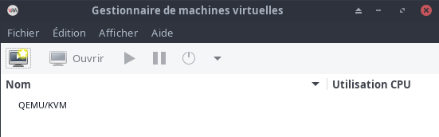  
*Virt-manager prend principalement en charge KVM mais il peut également fonctionner avec d'autres hyperviseurs tels que Xen et LXC*

Lorsque virt-manager est installé, il est livré avec l'ensemble d'outils répertorié ci-dessous.

*    **virt-install** : utilitaire de ligne de commande pour provisionner le système d'exploitation
*    **virt-viewer** : L'interface utilisateur avec des fonctionnalités graphiques
*    **virt-clone** : outil en ligne de commande pour cloner des hôtes inactifs existants
*    **virt-xml** : outil de ligne de commande pour éditer facilement le XML du domaine libvirt à l'aide des options de ligne de commande de virt-install.
*    **virt-bootstrap** : outil de commande fournissant un moyen simple de configurer le système de fichiers racine pour les conteneurs basés sur libvirt.

### KVM

Les lettres **[KVM](https://www.linux-kvm.org/page/Main_Page)** signifient **K** ernel-based **V** irtual **M** achines. KVM est une solution de virtualisation complète Linux pour les processeurs d'architecture x86 qui a l'extension de virtualisation (Intel VT et AMD-V).

KVM est un logiciel gratuit et open-source. La prise en charge de KVM est incluse dans tous les nouveaux noyaux Linux par conception.

### QEMU

**[QEMU](https://www.qemu.org/)** est la version abrégée de **Quick EMU**lator, un émulateur open source gratuit capable d'effectuer une virtualisation matérielle . Il émule le processeur de la machine hôte via une traduction binaire dynamique. Cela fournit différents ensembles de modèles de matériel et de périphérique pour la machine hôte, ce qui lui permet d'exécuter une variété de systèmes invités.

KVM peut être utilisé avec QEMU, ce qui permet aux machines virtuelles d'être exécutées presque à des vitesses natives. Non seulement l'émulation matérielle, QEMU est capable d'émuler des processeurs de niveau utilisateur qui permettent aux applications compilées pour une architecture de s'exécuter sur une autre.

### Installer Virt-Manager Complete Edition

Installation de tous les packages pour exécuter virt-manager.

Installation de base 

    sudo pacman -Syu virt-manager qemu-desktop dnsmasq iptables-nft

Installation complète 

    sudo pacman -Syu --needed virt-manager qemu-desktop libvirt edk2-ovmf dnsmasq vde2 bridge-utils iptables-nft dmidecode swtpm


*    [edk2-ovmf](https://archlinux.org/packages/extra/any/edk2-ovmf/) : ovmf est un projet basé sur [EDK](https://github.com/tianocore/tianocore.github.io/wiki/EDK-II) II pour activer le support [UEFI](https://github.com/tianocore/tianocore.github.io/wiki/UEFI) pour les machines virtuelles.
*    [iptables-nft](http://edk2-ovmf:  ovmf  is an EDK II based project to enable UEFI support for Virtual Machines. iptables-nft https://archlinux.org/packages/core/x86_64/iptables-nft/) : outil de contrôle des paquets du noyau Linux (utilisant l'interface nft).
*    [bridge-utils](https://archlinux.org/packages/extra/x86_64/bridge-utils/) : utilitaires de pont Ethernet.

Une fois l'installation terminée, vous devez activer le service libvirtd

    sudo systemctl enable --now libvirtd.service

Vérifiez l'état pour vous assurer que le service est en cours d'exécution.

    systemctl status libvirtd.service

Vous pourrez maintenant commencer à créer votre configuration de machine virtuelle sur l'application.

La connexion QEMU ne nécessite pas d'exécuter libvirtd.service !

**Exécutez Virt-Manager en tant qu'utilisateur normal (recommandé)** 

1. Créez des groupes kvm et libvirt s'ils ne sont pas présents  
sudo groupadd -f kvm  
sudo groupadd -f libvirt

2. Ajouter l'utilisateur actuel aux groupes kvm et libvirt  
sudo usermod -aG libvirt $USER  
sudo usermod -aG kvm $USER

3. Ajoutez les lignes suivantes à la fin de `/etc/libvirt/libvirtd.conf`  
unix_sock_group = "libvirt"  
unix_sock_ro_perms = "0777"  
unix_sock_rw_perms = "0770"

4. Ajoutez les lignes suivantes à la fin de /etc/libvirt/qemu.conf  
swtpm_user = "swtpm"  
swtpm_group = "swtpm"  
user = "yann"  
group = "yann"

Création d'un utilisateur système swtpm 

    sudo useradd -r swtpm

>Maintenant, redémarrez le système pour vous assurer que les modifications sont appliquées ou au moins déconnectez complètement votre utilisateur en vous déconnectant et en revenant sur le bureau.
{: .prompt-info }

Créer et donner les droits au dossier

    sudo mkdir -p /var/lib/swtpm-localca
    sudo chown swtpm:swtpm /var/lib/swtpm-localca

#### Gestionnaire de session utilisateur (INACTIF)

Pour terminer la configuration, la dernière étape consiste à remplacer le gestionnaire de session qemu par défaut par le gestionnaire de session utilisateur qemu :  
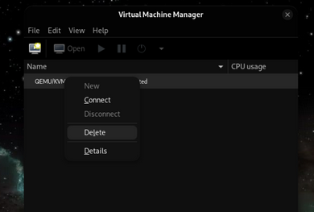  
Ouvrez virt-manager à partir du menu de l'application. Supprimer la connexion par défaut QEMU/KVM System/Root Session"

Et ajoutez-en une nouvelle à l'aide de QEMU/KVM User Session :  
Fichier &rarr; Ajouter une connexion &rarr; Hypervieur : QEMU/KVM Session utilisateur &rarr; Connexion auto &rarr; Enable  
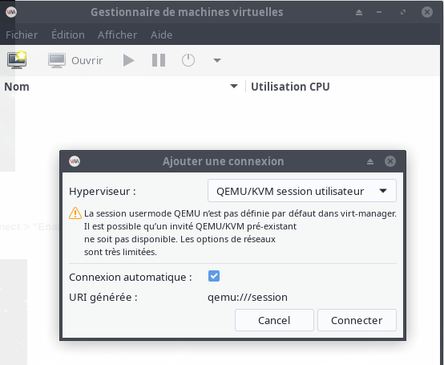   
Vous pouvez maintenant démarrer virt-manager et créer des machines virtuelles en tant qu'utilisateur non root !

#### libguestfs guestfs-tools

Si vous souhaitez modifier les images de disque de la machine virtuelle créées, vous pouvez installer libguestfs . 
libguestfs est un ensemble d'outils utilisés pour accéder aux images disques des machines virtuelles (VM) et les modifier. Vous pouvez l'utiliser pour :

*    visualiser et modifier des fichiers à l'intérieur des invités
*    effectuer des changements de script sur les VMs
*    surveiller les statistiques sur les disques utilisés/libres
*    créer des invités
*    P2V
*    V2V
*    effectuer des sauvegardes, etc.

Installation

    yay -S libguestfs guestfs-tools

#### Fonctionnalité facultative

Forfait pour des fonctionnalités supplémentaires :

*    [qemu-arch-extra](https://www.archlinux.org/packages/?name=qemu-arch-extra)  - prise en charge d'architectures supplémentaires
*    [qemu-block-gluster](https://www.archlinux.org/packages/?name=qemu-block-gluster)  –   Prise en charge des blocs [Glusterfs](https://wiki.archlinux.org/index.php/Glusterfs)
*    [qemu-block-iscsi](https://www.archlinux.org/packages/?name=qemu-block-iscsi)  -   Prise en charge des blocs [iSCSI](https://wiki.archlinux.org/index.php/ISCSI)
*    [qemu-block-rbd](https://www.archlinux.org/packages/?name=qemu-block-rbd)  - Prise en charge du bloc RBD

**qemu-emulators-full**  
Tous les émulateurs de mode utilisateur et de système QEMU

    yay -S qemu-emulators-full

**qemu-bloc-gluster**  
Glusterfs est un système de fichiers réseau évolutif. Cela ajoute la prise en charge du bloc Glusterfs à QEMU.

    yay -S qemu-block-gluster

**qemu-block-iscsi**  
iSCI permet l'accès au stockage via un réseau. qemu-block-iscsi permet à QEMU de bloquer cela.

    yay -S qemu-block-iscsi

**samba**  
Cela ajouterait la prise en charge de SMB/CIFS à QEMU.

    yay -S samba

### Activation des graphiques virtio avec accélération 3D

Il existe plusieurs modes d'accélérations graphiques pris en charge par virt-manager.

*    QXL - Carte graphique paravirtuelle QXL. Il est compatible VGA (y compris le support VESA 2.0 VBE). Fonctionne mieux avec les pilotes invités QXL installés. Choix recommandé lors de l'utilisation du protocole d'épices.
*    Bochs - Le BIOS VGA Bochs prend en charge, dans une certaine mesure, la spécification VBE.
*    Ramfb - Un tampon de trame simple qui vit dans la RAM invitée et est configuré via fw_cfg.
*    VGA – Carte VGA standard
*    Virtio – Virtio-gpu est un pilote graphique accéléré 3D paravirtualisé.

Lors de l'utilisation de virtio avec l'accélération 3D, virt-manager ne fonctionne parfois pas et génère une erreur. Ce n'est en fait pas virt-manager, c'est qemu qui plante.  
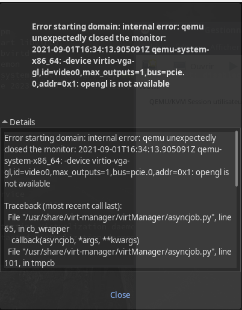   
Erreur QEMU lorsque l'accélération 3D est activée

Pour utiliser virtio avec l'accélération 3D, vous devez configurer virt-manager comme indiqué ci-dessous.

REMARQUE : Au moment de la rédaction, il existe un problème lors de l'utilisation de virtio avec l'accélération 3D avec XFCE DE, ce qui entraîne un écran noir pour les invités. Cela est dû au compositeur xfwm4+compositing par défaut. La solution de contournement connue consiste à utiliser 'QXL' ou virtio sans accélération 3D.
{: .prompt-warning }

Accédez à Display Spice et cochez la case Open GL et sélectionnez Auto dans le menu déroulant.  
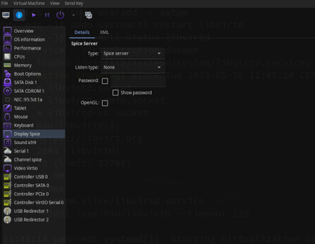   
Avant de configurer

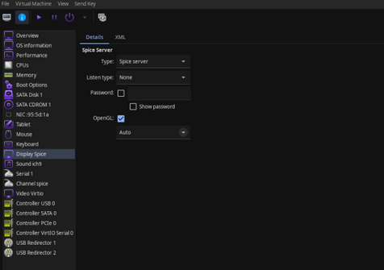   
Après avoir configuré

Allez maintenant dans Vidéo et sélectionnez virtio puis cochez la case Accélération 3D.  
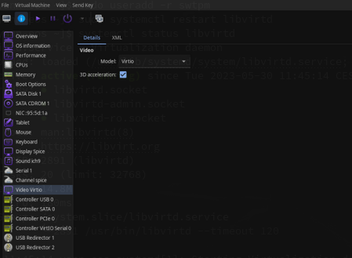   
Après avoir configuré les options vidéo

Après une telle configuration, vous pouvez profiter d'une VM invitée entièrement accélérée en 3D. Pensez également à cliquer sur Appliquer .

Installation des pilotes invités virtio pour Windows

RedHat fournit un ensemble de pilotes invités pour virtio qui couvre les pilotes graphiques du système invité. Vous pouvez télécharger les derniers pilotes depuis leur page GitHub virtio-win-pkg-scripts [ici](https://github.com/virtio-win/virtio-win-pkg-scripts/blob/master/README.md) .

### Modifier emplacement pool stockage 

*Modifier l'emplacement du pool de stockage par défaut de KVM Libvirt à l'aide de Virt-manager*

Virt-manager, abréviation de Virtual Machine Manager, est une interface graphique utilisée pour gérer les machines virtuelles via libvirt.

Ouvrir l'application Virt-manager. Faire un clic droit sur **QEMU/KVM** et cliquer sur l'option **Détails**.  
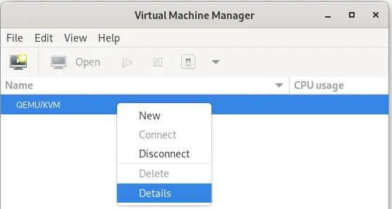  
Voir les détails de la connexion KVMVoir les détails de la connexion KVM  
Vous pouvez aussi cliquer sur Edition &rarr; Details de la connexion  à partir de l'interface Virt-manager.

Sous la section Stockage, vous verrez l'emplacement du pool de stockage par défaut.  
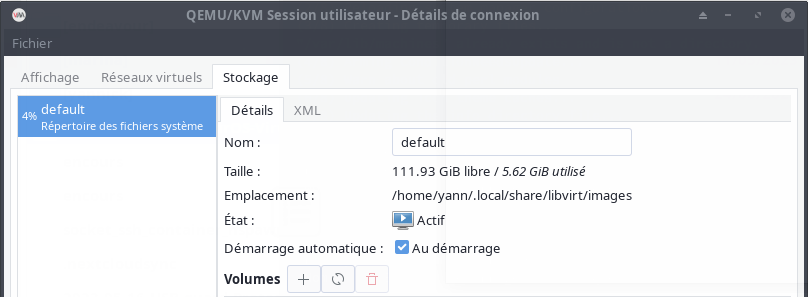  
Emplacement du pool de stockage par défaut de KVM Libvirt

Arrêter et supprimer le pool de stockage par défaut KVM Libvirt  
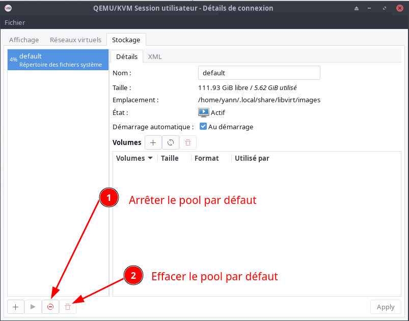  
Ceci désactivera et supprimera le pool par défaut.

Cliquez sur le signe plus (+) dans le volet inférieur gauche pour créer un nouveau pool de stockage à utiliser par les machines virtuelles.

Saisissez le nom du pool de stockage (par exemple, default dans mon cas).  
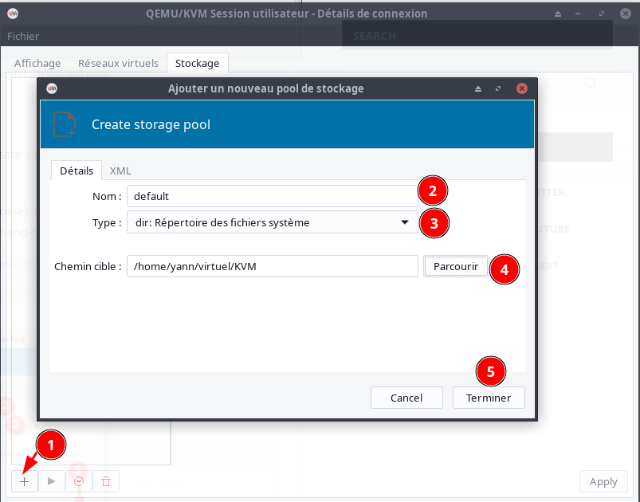  
Créer un nouveau pool de stockage KVM Libvirt

Le nouveau stockage est maintenant actif. Cochez la case Démarrage automatique pour démarrer automatiquement le nouveau pool de stockage au démarrage du système.  
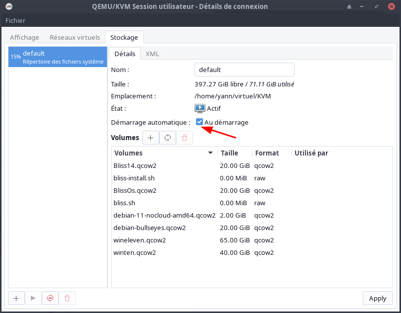  
Nouvel emplacement du pool de stockage KVM Libvirt

>Si nécessaire, déplacez toutes les images VM de l'ancien répertoire de stockage vers le nouveau.

Redémarrez le service libvirtd 

    sudo systemctl restart libvirtd

Vérification

    virsh pool-info default

```
Nom :          default
UUID :         23c3aee6-57bb-4c98-93f8-4c15ab3c9fae
État :        en cours d’exécution
Persistant :    oui
Démarrage automatique : oui
Capacité :    58,76 GiB
Allocation :   17,95 GiB
Disponible :   40,81 GiB
```

## Réseau 

La connexion des machines virtuelles (VM) à d'autres périphériques et emplacements sur un réseau doit être facilitée par le matériel hôte. Les sections suivantes expliquent les mécanismes des connexions réseau des VM et décrivent le paramètre réseau VM par défaut.

### Fonctionnement des réseaux virtuels

Le réseau virtuel utilise le concept de commutateur de réseau virtuel. Un commutateur de réseau virtuel est une construction logicielle qui fonctionne sur une machine hôte.  
Les machines virtuelles se connectent au réseau par l'intermédiaire du commutateur de réseau virtuel. En fonction de la configuration du commutateur virtuel, une machine virtuelle peut utiliser un réseau virtuel existant géré par l'hyperviseur ou une méthode de connexion réseau différente.

La figure suivante montre un commutateur de réseau virtuel qui connecte deux machines virtuelles au réseau :  
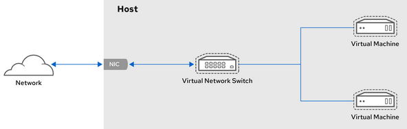

Du point de vue d'un système d'exploitation invité, une connexion réseau virtuelle est identique à une connexion réseau physique.  
Les machines hôtes considèrent les commutateurs réseau virtuels comme des interfaces réseau.  
Lorsque le service **libvirtd** est installé et démarré pour la première fois, il crée **virbr0**, l'interface réseau par défaut des machines virtuelles.

Pour afficher des informations sur cette interface, utilisez l'utilitaire ip sur l'hôte.

Par défaut, toutes les machines virtuelles d'un même hôte sont connectées au même réseau virtuel de type NAT, appelé **default**, qui utilise l'interface **virbr0**
{: .prompt-info }

Si vous avez besoin d'une fonctionnalité réseau différente, vous pouvez créer des réseaux virtuels et des interfaces réseau supplémentaires et configurer vos machines virtuelles pour qu'elles les utilisent. En plus du NAT par défaut, ces réseaux et interfaces peuvent être configurés pour utiliser l'un des modes suivants :

#### Mise en réseau virtuelle en mode routé 

En mode routé, le commutateur virtuel se connecte au réseau local physique connecté à la machine hôte et transmet le trafic dans les deux sens sans utiliser de NAT. Le commutateur virtuel peut examiner l'ensemble du trafic et utiliser les informations contenues dans les paquets réseau pour prendre des décisions de routage.  
Dans ce mode, les machines virtuelles (VM) se trouvent toutes dans un sous-réseau unique, séparé de la machine hôte.  
Le sous-réseau des machines virtuelles est acheminé via un commutateur virtuel, qui existe sur la machine hôte.   Cela permet d'établir des connexions entrantes, mais nécessite des entrées supplémentaires dans la table de routage pour les systèmes sur le réseau externe.

Le mode routé utilise le routage basé sur l'adresse IP :  
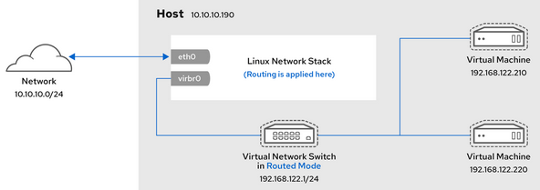

L'hébergement de serveurs virtuels (VSH) est une topologie courante qui utilise le mode routé. Un fournisseur VSH peut avoir plusieurs machines hôtes, chacune avec deux connexions réseau physiques. Une interface est utilisée pour la gestion et la comptabilité, l'autre pour la connexion des machines virtuelles. Chaque VM possède sa propre adresse IP publique, mais les machines hôtes utilisent des adresses IP privées afin que seuls les administrateurs internes puissent gérer les VM.

#### Mise en réseau virtuelle en mode ponté

Dans la plupart des modes de mise en réseau de VM, les VM créent automatiquement le pont virtuel virbr0 et s'y connectent.  
En revanche, en **mode ponté**, la VM se connecte à un pont Linux existant sur l'hôte.  
Par conséquent, la VM est directement visible sur le réseau physique.  
Cela permet les connexions entrantes, mais ne nécessite pas d'entrées supplémentaires dans la table de routage.

Le mode ponté utilise la commutation de connexion basée sur l'adresse MAC :  
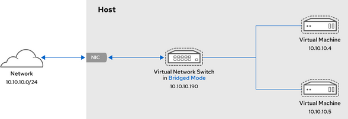

En mode ponté, la VM apparaît dans le même sous-réseau que la machine hôte.  
Toutes les autres machines physiques sur le même réseau physique peuvent détecter la VM et y accéder.

**Liaison entre réseaux pontés**

Il est possible d'utiliser plusieurs interfaces de pont physique sur l'hyperviseur en les reliant par un lien. Le lien peut ensuite être ajouté à un pont, après quoi les machines virtuelles peuvent également être ajoutées au pont. Cependant, le pilote de liaison a plusieurs modes de fonctionnement, et tous ces modes ne fonctionnent pas avec une passerelle où des machines virtuelles sont en cours d'utilisation.

Les modes de liaison ([bonding modes](https://access.redhat.com/solutions/67546)) suivants sont utilisables :

*    mode 1
*    mode 2
*    mode 4 

En revanche, l'utilisation des modes 0, 3, 5 ou 6 risque de faire échouer la connexion. Notez également que la surveillance de l'interface indépendante du média (MII) doit être utilisée pour surveiller les modes de liaison, car la surveillance du protocole de résolution d'adresses (ARP) ne fonctionne pas correctement.

Pour plus d'informations sur les modes de liaison, reportez-vous à la base de connaissances de Red Hat ( [Red Hat Knowledgebase](https://access.redhat.com/solutions/67546))

**Scénarios courants**

Les cas d'utilisation les plus courants du mode ponté sont les suivants :

*    Déployer des machines virtuelles dans un réseau existant aux côtés de machines hôtes, en rendant la différence entre les machines virtuelles et physiques invisible pour l'utilisateur final.
*    Déploiement de machines virtuelles sans modification des paramètres de configuration du réseau physique existant.
*    Déployer des machines virtuelles qui doivent être facilement accessibles à un réseau physique existant. Placer des machines virtuelles sur un réseau physique où elles doivent accéder aux services DHCP.
*    Connecter des machines virtuelles à un réseau existant où des réseaux locaux virtuels (VLAN) sont utilisés.
*    Un réseau de zone démilitarisée (DMZ). Pour un déploiement DMZ avec des machines virtuelles, Red Hat recommande de configurer la DMZ au niveau du routeur et des commutateurs du réseau physique, et de connecter les machines virtuelles au réseau physique en utilisant le mode ponté.

#### Mise en réseau virtuelle en mode isolé

En mode isolé, les machines virtuelles connectées au commutateur virtuel peuvent communiquer entre elles et avec la machine hôte, mais leur trafic ne passe pas en dehors de la machine hôte et elles ne peuvent pas recevoir de trafic en provenance de l'extérieur de la machine hôte. L'utilisation de dnsmasq dans ce mode est nécessaire pour les fonctionnalités de base telles que DHCP.  
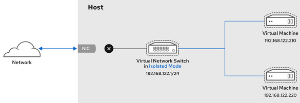

#### Réseau virtuel en mode ouvert

Lors de l'utilisation du mode ouvert pour la mise en réseau, libvirt ne génère aucune règle de pare-feu pour le réseau. Par conséquent, libvirt n'écrase pas les règles de pare-feu fournies par l'hôte, et l'utilisateur peut donc gérer manuellement les règles de pare-feu de la VM.

#### Comparaison des types de connexion des machines virtuelles

Le tableau suivant fournit des informations sur les emplacements auxquels certains types de configurations réseau de machines virtuelles (VM) peuvent se connecter et sur lesquels elles sont visibles.

Types de connexion de machine virtuelle

______  | Connexion à l'hôte | Connexion à d'autres VM sur l'hôte| Connexion aux sites extérieurs |Visible aux sites extérieurs
--- | --- | --- | --- | ---
Mode ponté  |Oui|Oui|Oui |Oui
NAT  |Oui|Oui|Oui |Non
Mode routé  |Oui|Oui|Oui |Oui
Mode isolé  |Oui|Oui|Non |Non

Mode ouvert : Dépend des règles du pare-feu de l'hôte


### Hôte - NetworkManager Bridge Network br0 sur interface par défaut

En mode su

Les connexions actives

    nmcli connection show --active

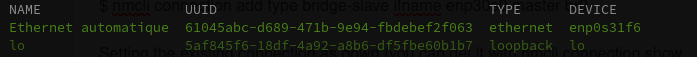

J'ai une «Ethernet automatique» qui utilise l'interface Ethernet **enp0s31f6**.  
Je vais configurer une interface de pont nommée br0 et ajouter (ou asservir) l'interface **enp0s31f6**.

#### Créer un Pont br0

**Créer un pont nommé br0**

```bash
sudo nmcli con add ifname br0 type bridge con-name br0
sudo nmcli con modify br0 bridge.stp no
# désactiver IPV6 sur br0
sudo nmcli connection modify br0 ipv6.method "disabled"
```

Affichez les interfaces réseau et notez le(s) nom(s) des interfaces que vous souhaitez ajouter au pont  

    nmcli device status

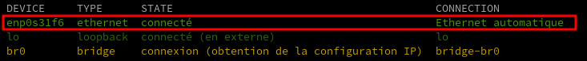

Affectez les interfaces à la passerelle.  
Si les interfaces que vous souhaitez affecter à la passerelle ne sont pas configurées, créez de nouveaux profils de connexion pour elles

```bash
sudo nmcli con add type bridge-slave ifname enp0s31f6 master br0
```

Définir la connexion existante, celle utilise enp0s31f6,  comme "down" (vous pouvez l'obtenir avec nmcli connection show --active) :  

```bash
sudo nmcli con down e7d9d5a6-8d41-3015-9c5a-3ea38d3d8c78
```

Mettre en place le nouveau pont :

```bash
sudo nmcli con up br0
```

#### Box - bail statique

**Box - bail statique**  
Paramétrer un bail statique sur la box avec l'adresse mac de la connexion br0  
  


Utilisez l'utilitaire ip pour afficher l'état des liens des périphériques Ethernet qui sont des ports d'un pont spécifique :

    ip a show br0

```
5: br0: <BROADCAST,MULTICAST,UP,LOWER_UP> mtu 1500 qdisc noqueue state UP group default qlen 1000
    link/ether 5e:95:2e:b1:9f:c4 brd ff:ff:ff:ff:ff:ff
    inet 192.168.0.20/24 brd 192.168.0.255 scope global dynamic noprefixroute br0
       valid_lft 42855sec preferred_lft 42855sec
```

#### Pont réseau virtuel "host-bridge"

**Les commandes `virsh` en mode su**

Déclarer le pont (bridge) à KVM.  
Créer un fichier de définition de réseau au format XML :

    nano host-bridge.xml

```xml
<network>
  <name>host-bridge</name>
  <forward mode="bridge"/>
  <bridge name="br0" />
</network>
```

Appliquer la configuration :

```shell
sudo virsh net-define host-bridge.xml # -> Réseau host-bridge défini depuis host-bridge.xml
sudo virsh net-start host-bridge # -> Réseau host-bridge démarré
sudo virsh net-autostart host-bridge # -> Réseau host-bridge marqué en démarrage automatique
```

Vérification

    sudo virsh net-list --all

```
 Nom           État      Démarrage automatique   Persistant
-------------------------------------------------------------
host-bridge   actif     oui                     oui
```

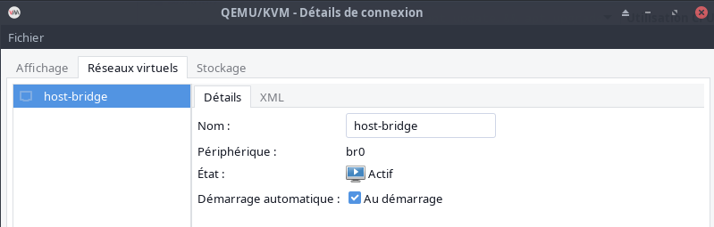


### Hôte - NetworkManager Bridge Network br1 sur autre interface

On dispose d'une seconde ou plus interface réseau

```
2: enp0s31f6: <BROADCAST,MULTICAST,UP,LOWER_UP> mtu 1500 qdisc fq_codel state UP mode DEFAULT group default qlen 1000
    link/ether 38:d5:47:7c:a0:6c brd ff:ff:ff:ff:ff:ff
3: enp3s0f0: <BROADCAST,MULTICAST,UP,LOWER_UP> mtu 1500 qdisc mq master br0 state UP mode DEFAULT group default qlen 1000
    link/ether 6c:b3:11:32:04:c8 brd ff:ff:ff:ff:ff:ff
5: enp3s0f1: <NO-CARRIER,BROADCAST,MULTICAST,UP> mtu 1500 qdisc mq state DOWN mode DEFAULT group default qlen 1000
    link/ether 6c:b3:11:32:04:c9 brd ff:ff:ff:ff:ff:ff
```

Dans ce cas, 3 interfaces réseau, enp0s31f6 est l'interface affectée à br0 et utilisée par l'hôte

#### Créer un Pont br1

**Créer un pont nommé br1**

```bash
sudo nmcli con add ifname br1 type bridge con-name br1
sudo nmcli con modify br1 bridge.stp no
# désactiver IPV6 sur br1
sudo nmcli connection modify br1 ipv6.method "disabled"
```

Affichez les interfaces réseau et notez le(s) nom(s) des interfaces que vous souhaitez ajouter au pont  

    nmcli device status


Affectez les interfaces à la passerelle.  
Si les interfaces que vous souhaitez affecter à la passerelle ne sont pas configurées, créez de nouveaux profils de connexion pour elles

```bash
sudo nmcli con add type bridge-slave ifname enp3s0f0 master br1
```

Définir la connexion existante, celle qui utilise enp3s0f0,  comme "down" (vous pouvez l'obtenir avec nmcli connection show --active) :  

```bash
sudo nmcli con down 15950896-b8dc-39c8-9f21-f20f13086975
```

Mettre en place le nouveau pont :

```bash
sudo nmcli con up br1
```

Utilisez l'utilitaire ip pour afficher l'état des liens des périphériques Ethernet qui sont des ports d'un pont spécifique :

    ip a show br1

```
9: br1: <BROADCAST,MULTICAST,UP,LOWER_UP> mtu 1500 qdisc noqueue state UP group default qlen 1000
    link/ether 26:89:96:2c:1d:9d brd ff:ff:ff:ff:ff:ff
    inet 192.168.10.180/24 brd 192.168.10.255 scope global dynamic noprefixroute br1
       valid_lft 85978sec preferred_lft 85978sec
```

Au final  
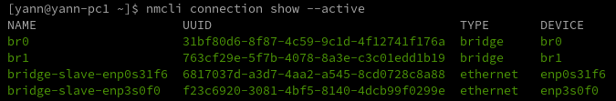

#### Pont réseau virtuel "host-tenda"

**Les commandes `virsh` en mode su**

Déclarer le pont (bridge) à KVM.  
Créer un fichier de définition de réseau au format XML :

    nano host-tenda.xml

```xml
<network>
  <name>host-tenda</name>
  <forward mode="bridge"/>
  <bridge name="br1" />
</network>
```

Appliquer la configuration :

```shell
sudo virsh net-define host-tenda.xml # -> Réseau host-tenda défini depuis host-tenda.xml
sudo virsh net-start host-tenda # -> Réseau host-tenda démarré
sudo virsh net-autostart host-tenda # -> Réseau host-tenda marqué en démarrage automatique
```

Vérification

    sudo virsh net-list --all

```
 Nom           État      Démarrage automatique   Persistant
-------------------------------------------------------------
host-tenda   actif     oui                     oui
```

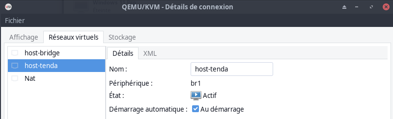

