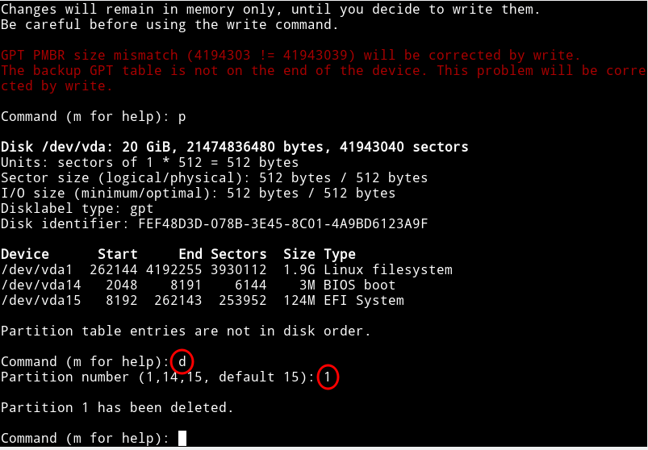
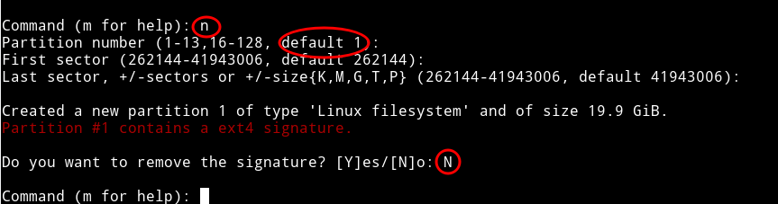
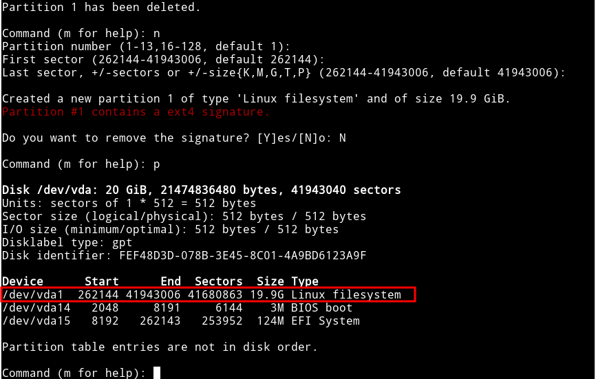
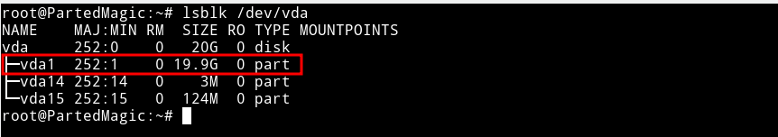
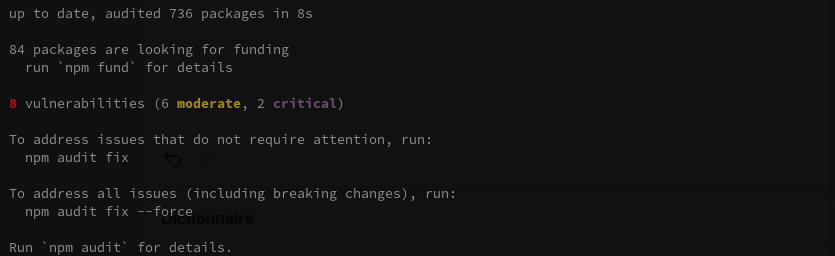
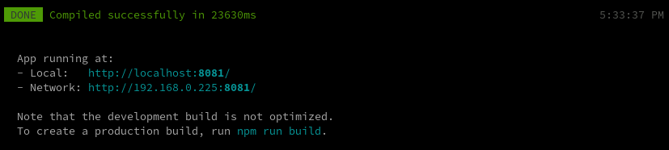
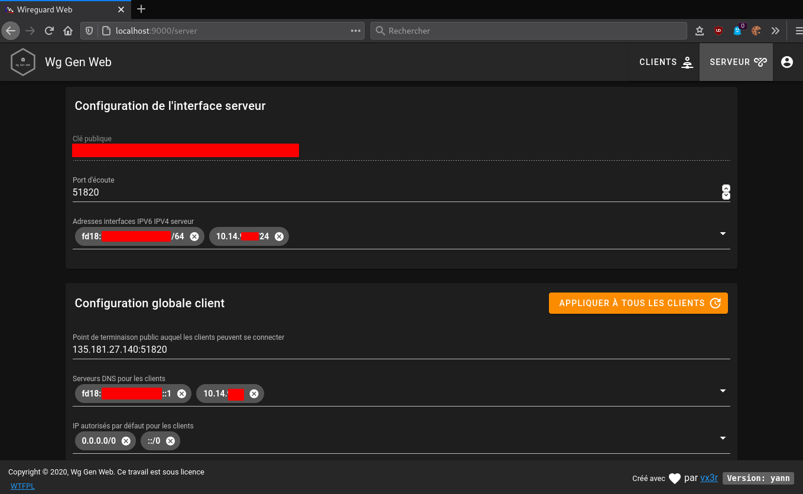
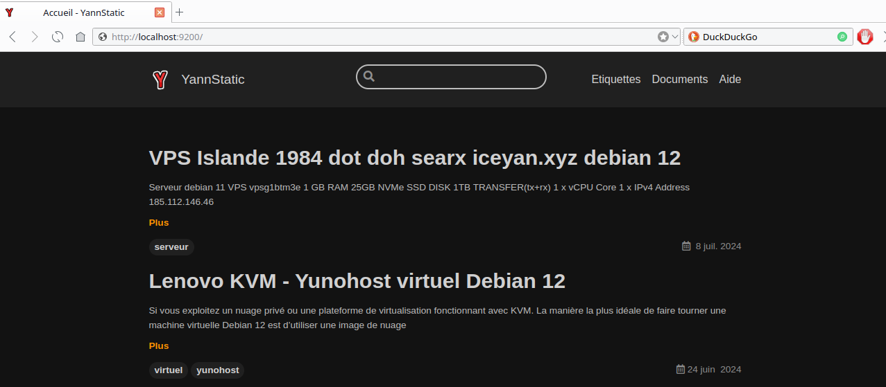

+++
title = 'Lenovo KVM - Machine virtuelle debian 12 (vm-debian12)'
date = 2024-10-07 00:00:00 +0100
categories = virtuel debian
+++
{:height=30}  {:height=30}  {:height=30}  
*installer une image virtuelle cloud debian 12*  


## KVM debian virtuel vm-debian12 

{:height="50"}  
*Si vous exploitez un nuage privé ou une plateforme de virtualisation fonctionnant avec KVM, comme OpenStack et oVirt. La manière la plus idéale de faire tourner une machine virtuelle Debian 12 est d'utiliser une image de nuage. Dans ce blog, nous vous montrons comment télécharger l'image officielle du nuage Debian 12 et créer une instance de machine virtuelle à partir de celle-ci sur l'hyperviseur KVM.* 

On se positionne dans le dossier des images KVM

```bash
mkdir -p $HOME/virtuel/KVM/  # si le dossier n'existe pas
cd $HOME/virtuel/KVM/
```
### Image Cloud Debian 12

* **generic** : Doit fonctionner dans n'importe quel environnement
* **genericcloud** : devrait fonctionner dans n'importe quel environnement virtualisé. Il est plus petit que generic car il exclut les pilotes pour le matériel physique.
* **nocloud** : Principalement utile pour tester le processus de construction lui-même. N'a pas installé cloud-init, mais permet à l'utilisateur de se connecter en tant que root sans mot de passe.

Toutes les images de Debian 12 Cloud sont disponibles sur la [page officielle de téléchargement des images d'OS](https://cloud.debian.org/images/cloud/bookworm/latest/). Dans ce guide, nous allons télécharger l'image nocloud qcow2 :

```shell
wget https://cloud.debian.org/images/cloud/bookworm/latest/debian-12-nocloud-amd64.qcow2
```

Vous pouvez vérifier plus de détails sur le fichier en utilisant la commande file :

    file debian-12-nocloud-amd64

*debian-12-nocloud-amd64.qcow2: QEMU QCOW Image (v3), 2147483648 bytes (v3), 2147483648 bytes*

### Créer machine virtuelle Debian 12

Ensuite, nous créons une machine virtuelle Debian 12 vm-debian12 à partir de notre image du nuage.

Définir la variable nom du vps 

    export VM_NAME="vm-debian12"

Une fois la variable exportée, déplacer ou créer l'image du disque racine de l'OS à partir de l'image du cloud téléchargée précédemment :

```bash
#mv debian-12-nocloud-amd64.qcow2 $VM_NAME.qcow2
qemu-img convert \
  -f qcow2 \
  -O qcow2 \
   .qcow2 \
  $VM_NAME.qcow2
```

### Redimensionner le disque virtuel

*Redimensionner le disque à la taille souhaitée.*

>Notez que le disque racine que nous avons créé a une petite capacité de disque comme défini dans l'image de nuage par défaut.

Redimensionnons à la taille souhaitée pour le disque racine.


```bash
# 20 GB de disque
export VM_ROOT_DISK_SIZE=20G

# Resize Debian 12 VM disk
qemu-img resize \
  $VM_NAME.qcow2 \
  $VM_ROOT_DISK_SIZE
```

*Image resized.*

Confirmez la taille actuelle avec la commande qemu-img info :

    qemu-img  info $VM_NAME.qcow2

```
image: vm-debian12.qcow2
file format: qcow2
virtual size: 20 GiB (21474836480 bytes)
disk size: 1.05 GiB
cluster_size: 65536
Format specific information:
    compat: 1.1
    compression type: zlib
    lazy refcounts: false
    refcount bits: 16
    corrupt: false
    extended l2: false
Child node '/file':
    filename: vm-debian12.qcow2
    protocol type: file
    file length: 1.05 GiB (1126236672 bytes)
    disk size: 1.05 GiB
```

Init mot de passe root si image différente  de **nocloud**

    virt-customize -a $VM_NAME.qcow2 --root-password password:debian

Patienter quelques instants...

```
[   0.0] Examining the guest ...
[  30.1] Setting a random seed
[  30.1] Setting passwords
[  31.1] Finishing off
```

### Créer VM avec virt-install

Créez une nouvelle machine virtuelle Debian 12 à l'aide de la commande `virt-install`.  
Nous utilisons le réseau en pont , remplacer `network=default` par `bridge=br0`


```bash
sudo virt-install \
    --memory 4096 \
    --vcpus 2 \
    --name $VM_NAME \
    --disk $VM_NAME.qcow2,device=disk,bus=virtio,format=qcow2 \
    --os-variant debian12 \
    --network bridge=br0,model=virtio \
    --virt-type kvm \
    --graphics none \
    --boot uefi \
    --import
```

La sortie du mode console: `Ctrl+Altgr ]`  
A la fin de l'installation, on arrive sur le login (en mode console) :  
Saisir "root" et mot de passe "debian"  

```
[...]
Debian GNU/Linux 12 localhost ttyS0

localhost login: 
```

Mise à jour

```shell
apt update && apt upgrade
timedatectl set-timezone Europe/Paris
reboot # si des mises à jour ont été effectuées
```

**En cas d'erreur virt-install** : `ERROR    erreur interne : Impossible d'exécuter '/usr/bin/swtpm_setup'`  

Qui est le propriétaire et quelles sont les permissions sur /var/lib/swtpm-localca ?

```
[yann@yann-eos ~]$ ls -l /var/lib/ |grep swtpm-localca
drwxr-x---  2 tss     root    4096 16 nov.  11:43 swtpm-localca
```

Par ailleurs, quel est le contenu du fichier /etc/libvirt/qemu.conf relatif à swtpm :

```
swtpm_user = "swtpm"  
swtpm_group = "swtpm"  
```

Vous pouvez essayer la commande suivante pour voir si cela résout le problème

    sudo chown -R swtpm:swtpm /var/lib/swtpm-localca

### Ip V4 V6

Les périphériques du réseau

    ip link show

```
1: lo: <LOOPBACK,UP,LOWER_UP> mtu 65536 qdisc noqueue state UNKNOWN mode DEFAULT group de
fault qlen 1000
    link/loopback 00:00:00:00:00:00 brd 00:00:00:00:00:00
2: enp1s0: <BROADCAST,MULTICAST,UP,LOWER_UP> mtu 1500 qdisc fq_codel state UP mode DEFAUL
T group default qlen 1000
    link/ether 52:54:00:64:ad:a1 brd ff:ff:ff:ff:ff:ff
```

En fonction du type de l'image installée, la gestion réseau est différente (netplan, systemd network, etc...)

#### netplan

*[Netplan](https://netplan.io/) est un utilitaire qui permet de configurer facilement le réseau sous Linux.*

* [Gestion du réseau Linux avec Netplan](https://linux.goffinet.org/administration/configuration-du-reseau/gestion-du-reseau-linux-avec-netplan/)
* [How to configure IPv6 with Netplan](https://www.snel.com/support/how-to-configure-ipv6-with-netplan-on-ubuntu-18-04/)

Les fichiers de configuration sont dans le dossier `/etc/netplan`

```
90-default.yaml
```

On retire les fichiers de configuration originaux 

```
mkdir /etc/backup.netplan
mv /etc/netplan/* /etc/backup.netplan/
```

On propose cette configuration statique de l’interface **enp1s0**

```
bash -c 'cat << EOF > /etc/netplan/01-enp1s0.yaml
network:
  version: 2
  renderer: networkd
  ethernets:
    enp1s0:
      addresses: [192.168.0.225/24]
      routes:
        - to: default
          via: 192.168.0.254 
      nameservers:
          addresses: [1.1.1.1, 9.9.9.9]
      dhcp4: false
      dhcp6: false
EOF'
```

Et on génère la configuration pour l’appliquer auprès du gestionnaire 

```
netplan generate
netplan apply
```

`Cannot call openvswitch: ovsdb-server.service is not running`  
Je peux confirmer qu'il s'agit juste d'un avertissement, car il a réussi à changer le premier cas de test en une IP statique...

Pour vérification 

    ip a

```
1: lo: <LOOPBACK,UP,LOWER_UP> mtu 65536 qdisc noqueue state UNKNOWN group default qlen 1000
    link/loopback 00:00:00:00:00:00 brd 00:00:00:00:00:00
    inet 127.0.0.1/8 scope host lo
       valid_lft forever preferred_lft forever
    inet6 ::1/128 scope host noprefixroute 
       valid_lft forever preferred_lft forever
2: enp1s0: <BROADCAST,MULTICAST,UP,LOWER_UP> mtu 1500 qdisc fq_codel state UP group default qlen 1000
    link/ether 52:54:00:64:ad:a1 brd ff:ff:ff:ff:ff:ff
    inet 192.168.0.225/24 brd 192.168.0.255 scope global enp1s0
       valid_lft forever preferred_lft forever
    inet6 2a01:e0a:9c8:2080:5054:ff:fe64:ada1/64 scope global dynamic mngtmpaddr noprefix
route 
       valid_lft 86325sec preferred_lft 86325sec
    inet6 fe80::5054:ff:fe64:ada1/64 scope link 
       valid_lft forever preferred_lft forever
```

#### systemd network

*Configuration réseau via systemd-networkd avec debian 12 ([Guides - Network Configuration Using systemd-networkd](https://www.linode.com/docs/products/compute/compute-instances/guides/systemd-networkd/))*

Liste des interfaces

    networkctl list

```
IDX LINK   TYPE     OPERATIONAL SETUP    
  1 lo     loopback carrier     unmanaged
  2 enp1s0 ether    off         unmanaged
```

Sur la machine concernée, l'interface réseau s'appelle enp1s0

Je vais créer le fichier `/etc/systemd/network/enp1s0-ethernet.network`  

```
[Match]
Name=enp1s0
[Network]
Address=192.168.0.225/24
Gateway=192.168.0.254
DNS=1.1.1.1  
```

Il est important que le fichier de configuration de l'interface réseau ait l'extension `.network`  

Redémarrer la machine : `reboot`

Vérifier Adressage IP statique

    ip a show enp1s0

```
2: enp1s0: <BROADCAST,MULTICAST,UP,LOWER_UP> mtu 1500 qdisc fq_codel state UP group default q
len 1000
    link/ether 52:54:00:ae:90:25 brd ff:ff:ff:ff:ff:ff
    inet 192.168.0.225/24 brd 192.168.0.255 scope global enp1s0
       valid_lft forever preferred_lft forever
    inet6 2a01:e0a:9c8:2080:5054:ff:feae:9025/64 scope global dynamic mngtmpaddr noprefixrout
e 
       valid_lft 86391sec preferred_lft 86391sec
    inet6 fe80::5054:ff:feae:9025/64 scope link 
       valid_lft forever preferred_lft forever
```

Configuration ipv6 (facultatif)

Relever inet6 : `fe80::5054:ff:feae:9025`  
Ajouter une délégation de préfixe sur la freebox : `2a01:e0a:9c8:2082::/64` --> `fe80::5054:ff:feae:9025` 

Modifier le fichier `/etc/systemd/network/enp1s0-ethernet.network`, ajouter dans la rubrique `[Network]`

```
IPv6PrivacyExtensions=false
IPv6AcceptRA=true
Address=2a01:e0a:9c8:2082::1
```

Le paramètre IPv6AcceptRA n'est pas strictement nécessaire tant que la variable de noyau  net.ipv6.conf.eth0.autoconf est fixée à 1 (et non à 0). Vous pouvez déterminer ce paramètre en exécutant la commande suivante.

```
sudo sysctl net.ipv6.conf.eth0.autoconf # 1 dans bookworm
```

Recharger le réseau

    sudo systemctl restart systemd-networkd

Vérifier Adressage IP statique

    ip a show enp1s0

```
1: lo: <LOOPBACK,UP,LOWER_UP> mtu 65536 qdisc noqueue state UNKNOWN group default qlen 1000
    link/loopback 00:00:00:00:00:00 brd 00:00:00:00:00:00
    inet 127.0.0.1/8 scope host lo
       valid_lft forever preferred_lft forever
    inet6 ::1/128 scope host noprefixroute 
       valid_lft forever preferred_lft forever
2: enp1s0: <BROADCAST,MULTICAST,UP,LOWER_UP> mtu 1500 qdisc fq_codel state UP group default qlen 1000
    link/ether 52:54:00:ae:90:25 brd ff:ff:ff:ff:ff:ff
    inet 192.168.0.225/24 brd 192.168.0.255 scope global enp1s0
       valid_lft forever preferred_lft forever
    inet6 2a01:e0a:9c8:2080:5054:ff:feae:9025/64 scope global dynamic mngtmpaddr noprefixroute 
       valid_lft 85935sec preferred_lft 85935sec
    inet6 2a01:e0a:9c8:2082::1/0 scope global 
       valid_lft forever preferred_lft forever
    inet6 fe80::5054:ff:feae:9025/64 scope link 
       valid_lft forever preferred_lft forever
```

### Modifier hostname

    hostnamectl set-hostname vm-debian12
    hostnamectl

```
 Static hostname: vm-debian12
       Icon name: computer-vm
         Chassis: vm 🖴
      Machine ID: 85e470b1337c4e209bb5167c34fc00c5
         Boot ID: b0a64369a876497da3f5ab183516e904
  Virtualization: kvm
Operating System: Debian GNU/Linux 12 (bookworm)  
          Kernel: Linux 6.1.0-13-amd64
    Architecture: x86-64
 Hardware Vendor: QEMU
  Hardware Model: Standard PC _Q35 + ICH9, 2009_
Firmware Version: unknown
```

Ajout ip au fichier hosts

    nano /etc/hosts

```
127.0.0.1       localhost vm-debian12
```

### Créer un utilisateur

Après s'être connecté en tant qu'utilisateur root, créer le premier utilisateur (mp bookvm49) 

    adduser bookvm

```
Adding user `bookvm' ...
Adding new group `bookvm' (1000) ...
Adding new user `bookvm' (1000) with group `bookvm' ...
Creating home directory `/home/bookvm' ...
Copying files from `/etc/skel' ...
New password: 
Retype new password: 
passwd: password updated successfully
Changing the user information for bookvm
Enter the new value, or press ENTER for the default
	Full Name []: 
	Room Number []: 
	Work Phone []: 
	Home Phone []: 
	Other []: 
Is the information correct? [Y/n] 
```

Ajout à sudoers

    echo "bookvm     ALL=(ALL) NOPASSWD: ALL" >> /etc/sudoers.d/bookvm

### Reconfigurer les clés openssh

Par défaut openssh ne fonctionne pas

```
[FAILED] Failed to start ssh.servic…[0m - OpenBSD Secure Shell server.
```

Il faut regénérer les clés

    dpkg-reconfigure openssh-server

{:width=500}


### OpenSSH, clé et script

Il faut activer authentification mot de passe

    nano /etc/ssh/sshd_config

```
# To disable tunneled clear text passwords, change to no here!
PasswordAuthentication yes
#PermitEmptyPasswords no
```

Relancer

    systemctl restart sshd


{:width="70"}  
**connexion avec clé**  
<u>sur l'ordinateur de bureau</u>
Générer une paire de clé curve25519-sha256 (ECDH avec Curve25519 et SHA2) pour une liaison SSH avec le serveur.  

    ssh-keygen -t ed25519 -o -a 100 -f ~/.ssh/vm-debian12

Envoyer les clés publiques sur le serveur KVM   

    ssh-copy-id -i ~/.ssh/vm-debian12.pub bookvm@192.168.0.225

<u>sur le serveur KVM</u>
On se connecte  

    ssh bookvm@192.168.0.225

Modifier la configuration serveur SSH  

    sudo nano /etc/ssh/sshd_config

Modifier

```conf
Port = 55215
PasswordAuthentication no
```

Relancer le serveur

    sudo systemctl restart sshd

Test connexion

    ssh -p 55215 -i ~/.ssh/vm-debian12 bookvm@192.168.0.225

### Utilitaires

Installer utilitaires  

    sudo apt update && sudo apt install rsync curl tmux jq figlet git

Effacer et créer motd

    sudo rm /etc/motd && sudo nano /etc/motd

```
                               __       __     _               ___ ___ 
 _   __ ____ ___          ____/ /___   / /_   (_)____ _ ____  <  /|__ \
| | / // __ `__ \ ______ / __  // _ \ / __ \ / // __ `// __ \ / / __/ /
| |/ // / / / / //_____// /_/ //  __// /_/ // // /_/ // / / // / / __/ 
|___//_/ /_/ /_/        \__,_/ \___//_.___//_/ \__,_//_/ /_//_/ /____/ 
   ___ ____  ___      ___ _____  ____     ____     ___   ___ ______    
  <  // __ \|__ \    <  // ___/ ( __ )   / __ \   |__ \ <  // ____/    
  / // /_/ /__/ /    / // __ \ / __  |  / / / /   __/ / / //___ \      
 / / \__, // __/ _  / // /_/ // /_/ /_ / /_/ /_  / __/ / /____/ /      
/_/ /____//____/(_)/_/ \____/ \____/(_)\____/(_)/____//_//_____/       

```

### Historique de la ligne de commande  

Ajoutez la recherche d’historique de la ligne de commande au terminal  
Se connecter en utilisateur  
Tapez un début de commande précédent, puis utilisez shift + up (flèche haut) pour rechercher l’historique filtré avec le début de la commande.

```shell
# Global, tout utilisateur
echo '"\e[1;2A": history-search-backward' | sudo tee -a /etc/inputrc
echo '"\e[1;2B": history-search-forward' | sudo tee -a /etc/inputrc
```

### Sortie console

Sortir du mode console par `poweroff` en mode su  

```
Création de domaine terminée.
Vous pouvez redémarrer votre domaine en exécutant :
  virsh --connect qemu:///system start vm-debian12
```

### Redimensionner la partition racine vda1

La partition virtuelle est 20Go  
`Disk /dev/vda: 20 GiB, 21474836480 bytes, 41943040 sectors`

mais la partition réelle est 1.9Go  

```
bookvm@vm-debian12:~$ lsblk
NAME    MAJ:MIN RM  SIZE RO TYPE MOUNTPOINTS
vda     254:0    0   20G  0 disk 
├─vda1  254:1    0  1.9G  0 part /
├─vda14 254:14   0    3M  0 part 
└─vda15 254:15   0  124M  0 part /boot/efi
```

Pour redimensionner le disque, il faut démarrer la vm sur un "cd live" de type iso  
{:width="400"}

Les éléments encadrés de rouge doivent être ajoutés avant de lancer l'opération

on lance l’interface de fdisk sur le disque souhaité, dans mon cas /dev/vda  
{:width="400"}  

on supprime la partition que l’on souhaite agrandir (1)  
{:width="400"}  

Puis on créé une nouvelle avec la commande n, cette fois en définissant la taille de disque souhaitée  
{:width="400"}  

on utilise la commande p pour être certains que c’est bien l’agencement de partition que l’on souhaite appliquer  
{:width="400"}  
tout est correct, on enregistre avec la commande w.

Par sécurité, on peut faire une vérification du système de fichier avec fsck

    e2fsck -f /dev/vda1

on agrandir le système de fichier avec resize2fs

    resize2fs /dev/vda1

Vérification  
{:width="500"}  


### PC1 - Démarrer la VM au boot

On active le flag "Démarrer la machine virtuelle au démarrage de l'hôte"

<u>En cas d'erreur du service libvirtd</u>  
 `erreur interne : Impossible de démarrer automatiquement la VM ’vm-debian12’ : Impossible d'obtenir le MTU de l'interface sur 'br0': Aucun périphérique de ce type`  

Créer un service qui lancera la machine virtuelle vm-debian12 au démarrage après 45 secondes de délai

    sudo nano /etc/systemd/system/vm-debian12.service

```
[Unit]
Description=Autostart vm-debian12

After=network.target libvirtd.service
Wants=libvirtd.service

[Service]
Type=simple
ExecStartPre=/usr/bin/sleep 45
ExecStart=/usr/bin/virsh start vm-debian12

[Install]
WantedBy=multi-user.target
```

Activation

    sudo systemctl enable vm-debian12

Exécution pour test

    sudo systemctl daemon-reload
    sudo systemctl start vm-debian12

### Partage dossier hôte avec invité

* [Partage répertoire hôte avec un invité](/posts/QEMU_KVM+virtio-fs-Partager_un_repertoire_hote_avec_une_machine_virtuelle.md/#partage-répertoire-hôte-avec-un-invité)

Les dossiers partagés :

* /srv/media &rarr; media_tag
* /home/yann/scripts &rarr; scripts_tag

Ajoutez les éléments XML de domaine suivants pour partager le répertoire hôte /srv/media avec l’invité

```xml
<domain>
  ...
  <memoryBacking>
    <source type='memfd'/>
    <access mode='shared'/>
  </memoryBacking>
  ...
  <devices>
    ...
    <filesystem type='mount' accessmode='passthrough'>
      <driver type='virtiofs'/>
      <source dir='/srv/media'/>
      <target dir='media_tag'/>
    </filesystem>
    <filesystem type='mount' accessmode='passthrough'>
      <driver type='virtiofs'/>
      <source dir='/home/yann/scripts'/>
      <target dir='scripts_tag'/>
    </filesystem>
    ...
  </devices>
</domain>
```

Créer les dossiers

    mkdir -p $HOME/{scripts,media}

Ajout au fichier `/etc/fstab`

```
media_tag   /home/bookvm/media   virtiofs rw,_netdev 0 0
scripts_tag /home/bookvm/scripts virtiofs rw,_netdev 0 0
```

Recharger

    sudo systemctl daemon-reload
    sudo mount -a

### Autorité Certification  

[Comment mettre en place et configurer une autorité de certification (AC) avec Easy-RSA et créer un certificat client](/posts/Mettre_en_place_et_configurer_une_autorite_de_certification_AC_avec_Easy-RSA/)

Le fichier des paramètres vars

```
set_var EASYRSA_REQ_COUNTRY    "FR"
set_var EASYRSA_REQ_PROVINCE   "Pays de Loire"
set_var EASYRSA_REQ_CITY       "Bopro"
set_var EASYRSA_REQ_ORG        "yann"
set_var EASYRSA_REQ_EMAIL      "vps@cinay.eu"
set_var EASYRSA_REQ_OU         "Dom"
set_var EASYRSA_ALGO           "ec"
set_var EASYRSA_DIGEST         "sha512"
```

Vous diposez du fichier **yannick.pfx**

### Envoi message smtp postfix

[Envoi de message - Installer et configurer Postfix comme serveur SMTP d'envoi uniquement](/posts/Debian_Postfix_serveur_SMTP_envoi_uniquement/)


## Développement

### nginx, php, composer et mariadb

En mode su

**nginx version compilée**  

```
wget https://static.xoyize.xyz/files/compilation-nginx-tls1.3.sh
chmod +x compilation-nginx-tls1.3.sh
./compilation-nginx-tls1.3.sh
```

Versions Nginx OpenSSL  
nginx version: nginx/1.24.0  
OpenSSL 3.0.11 19 Sep 2023 (Library: OpenSSL 3.0.11 19 Sep 2023)  

Ajout module

**php 8.2** Installation 

    sudo apt install -y lsb-release ca-certificates apt-transport-https software-properties-common gnupg2

importer et installer le Clé et référentiel GPG et actualiser

    echo "deb https://packages.sury.org/php/ $(lsb_release -sc) main" | sudo tee /etc/apt/sources.list.d/sury-php.list
    sudo wget -O /etc/apt/trusted.gpg.d/php.gpg https://packages.sury.org/php/apt.gpg

Actualiser

    sudo apt update && sudo apt -y upgrade

Installation des paquets php8.2 de base

    sudo apt install php8.2 php8.2-fpm php8.2-sqlite3 php8.2-gd

Php complet

    sudo apt -y install php8.2 php8.2-fpm php8.2-sqlite3 php8.2-cli php8.2-gd php8.2-imap php8.2-mysql php8.2-soap php8.2-apcu php8.2-common php8.2-gmp  php8.2-intl php8.2-opcache php8.2-xml php8.2-curl php8.2-igbinary php8.2-readline  php8.2-zip php8.2-bcmath php8.2-imagick php8.2-mbstring php8.2-redis imagemagick libmagickcore-6.q16-6-extra

**test.bookvm.loc**  
*site de test*

Dossier root web : `/home/bookvm/media/www/bookvm/default-www/`

Création du pool php-fpm dédié au devel

    nano /etc/php/8.0/fpm/pool.d/devel.conf

```
[devel]

user = bookvm
group = bookvm

listen = /run/php/php8.2-fpm-devel.sock

listen.owner = bookvm
listen.group = bookvm

pm = dynamic
pm.max_children = 5
pm.start_servers = 2
pm.min_spare_servers = 1
pm.max_spare_servers = 3
```

Modifier le fichier de configuration nginx `/etc/nginx/conf.d/test.bookvm.loc.conf` 

```
server {
  listen *:443 ssl http2;
  server_name test.bookvm.loc;
  ssl_certificate /etc/ssl/certs/bookvm-cert.pem;
  ssl_certificate_key /etc/ssl/private/bookvm-key.pem;
  root /home/bookvm/media/www/bookvm/default-www/;
  # root /var/www/default-www/;
  
  location / {
    index index.htm index/;
  }

  location /diceware {
    alias /home/bookvm/media/diceware/;
  }

  location /cartes {
    alias /home/bookvm/media/osm-new/;
  }

  location ~ \.php$ {
    fastcgi_split_path_info ^(.+\.php)(/.+)$;
    fastcgi_pass unix:/run/php/php8.2-fpm-devel.sock;   # PHP8.2
    fastcgi_index index.php;
    include fastcgi_params;
    fastcgi_param SCRIPT_FILENAME $document_root$fastcgi_script_name;
   }

}
```

Redémarrer les services php-fpm et nginx

    systemctl restart php8.2-fpm nginx


**Composer**

Installation ([How to Install and use PHP Composer on Linux?](https://www.geeksforgeeks.org/how-to-install-and-use-php-composer-on-linux/))

```bash
curl -Ss https://getcomposer.org/installer | php
sudo mv composer.phar /usr/local/bin/composer
chmod +x /usr/local/bin/composer
```

Composer peut utiliser unzip

    sudo apt install unzip

**MariadDb**  
[Installer MySQL (MariaDB) sur Debian 12](https://www.malekal.com/installer-mysql-mariadb-debian/)

```
sudo apt search mariadb-server
Sorting... Done
Full Text Search... Done
mariadb-server/stable 1:10.11.4-1~deb12u1 amd64
  MariaDB database server binaries

mariadb-server-10.5/stable 1:10.11.4-1~deb12u1 amd64
  MariaDB database server binaries

mariadb-server-core/stable 1:10.11.4-1~deb12u1 amd64
  MariaDB database core server files
```

On installe la version 10.5

    sudo apt install mariadb-server-10.5

Les paquets configure MySQL mais on peut utiliser un script de sécurité pour changer le mot de passe root puis configurer certains aspects de sécurité de MySQL.
Pour cela, saisissez la commande suivante :

    sudo mysql_secure_installation

Puis laissez vous guider pour répondre aux questions suivantes avec la touche Y ou N.

*    Set root password – You already have your root account protected, so you can safely answer 'n'
*    Switch to unix_socket authentication [Y/n]
*    Remove anonymous users – Supprimer les utilisateurs anonymes
*    Remove test database and access to it – Supprimer la base de données de test et y accéder
*    Reload privilege tables now – Recharger les tables de privilèges maintenant


### SSO (facultatif)

[Jasny SSO](https://github.com/jasny/sso) est une solution relativement simple et directe pour l'authentification unique (SSO).

#### Installation

Cloner le site 

```bash
git clone https://github.com/jasny/sso.git
cd sso
rm composer.json
```

Installez cette bibliothèque via composer

    composer require jasny/sso

#### Démo

Il existe par exemple un serveur de démonstration et deux brokers de démonstration. Un avec des redirections normales et un utilisant [JSONP](https://en.wikipedia.org/wiki/JSONP) / AJAX.

Pour prouver que cela fonctionne, vous devez configurer le serveur et deux brokers ou plus, chacun sur sa propre machine.  
(sous)domaine. Cependant, vous pouvez également exécuter à la fois le serveur et les brokers sur votre propre ordinateur, simplement pour le tester.

Sur *nix (Linux / Unix / OSX), exécutez :

```shell
tmux
php -S localhost:9000 -t demo/server/
# Ctrl b d pour sortir dession tmux

tmux
export SSO_SERVER=http://localhost:9000/attach.php SSO_BROKER_ID=Alice SSO_BROKER_SECRET=8iwzik1bwd; php -S localhost:9001 -t demo/broker/
# Ctrl b d pour sortir dession tmux

tmux
export SSO_SERVER=http://localhost:9000/attach.php SSO_BROKER_ID=Greg SSO_BROKER_SECRET=7pypoox2pc; php -S localhost:9002 -t demo/broker/
# Ctrl b d pour sortir dession tmux

tmux
export SSO_SERVER=http://localhost:9000/attach.php SSO_BROKER_ID=Julius SSO_BROKER_SECRET=ceda63kmhp; php -S localhost:9003 -t demo/ajax-broker/
# Ctrl b d pour sortir dession tmux
```

Maintenant, ouvrez quelques onglets et visitez


    ssh -L 9501:localhost:9001 bullsvm@192.168.0.210 -p 55210 -i /home/yann/.ssh/vm-bullseyes

  * http://localhost:9001
  * http://localhost:9002
  * http://localhost:9003

nom d'utilisateur | mot de passe
-------- | ---------
Jackie | jackie123
Jean | john123

_Notez qu'après vous être connecté, vous devez actualiser les autres brokers pour voir l'effet._

### Certificats auto-signés (mkcert)

*mkcert est un outil facile d’utilisation qui va se charger de tout. Il génère notre autorité de certification, qui servira à signer le(s) certificat(s). Il suffira de déployer sa clé sur toutes les machines clientes pour que nous n’ayons aucune erreur du type "self signed…"([Générer des certificats SSL auto-signés avec mkcert](/posts/Generer_des_certificats_SSL_auto-signes_avec_mkcert/))*

[Comment créer des certificats SSL de confiance locale avec mkcert sur Ubuntu 20.04](https://fr.linux-console.net/?p=3120)

#### Installer mkcert

```bash
# Installer mkcert sur un système Ubuntu ou Debian 
sudo apt -y install wget libnss3-tools
curl -s https://api.github.com/repos/FiloSottile/mkcert/releases/latest| grep browser_download_url  | grep linux-amd64 | cut -d '"' -f 4 | wget -qi -
mv mkcert-v*-linux-amd64 mkcert
chmod a+x mkcert
sudo mv mkcert /usr/local/bin/
# version
mkcert --version
# générer un certificat CA local ,autorité de certification, sans saisir une seule information
mkcert -install
# Création autorité de certification CA
mkcert -CAROOT # renvoi $HOME/.local/share/mkcert
```

Vérification

    ls -l $HOME/.local/share/mkcert

Création de certificats locaux :

    mkcert bookvm.loc '*.bookvm.loc' localhost 127.0.0.1 ::1

```
Created a new certificate valid for the following names 📜
 - "bookvm.loc"
 - "*.bookvm.loc"
 - "localhost"
 - "127.0.0.1"
 - "::1"

Reminder: X.509 wildcards only go one level deep, so this won't match a.b.bookvm.loc ℹ️

The certificate is at "./bookvm.loc+4.pem" and the key at "./bookvm.loc+4-key.pem" ✅

It will expire on 18 February 2026 🗓
```

Déplacer et renommer les certificats

```bash
sudo mv bookvm.loc+4.pem /etc/ssl/certs/bookvm-cert.pem
sudo mv bookvm.loc+4-key.pem /etc/ssl/private/bookvm-key.pem
```

#### Diffuser autorité rootCA

<u>Diffuser l'autorité de certification rootCA.pem</u>

```
# Debian and Ubuntu derived distributions
sudo cp /tmp/rootCA.pem /usr/local/share/ca-certificates/
sudo update-ca-certificates
# Archlinux
sudo cp /tmp/rootCA.pem /etc/ca-certificates/trust-source/anchors/
sudo update-ca-trust
```

#### Configurer Nginx pour utiliser le certificat généré

Renommer le fichier de configuration

    mv /etc/nginx/conf.d/default.conf /etc/nginx/conf.d/bookvm.loc.conf

Modifier le fichier de configuration `/etc/nginx/conf.d/bookvm.loc.conf`

```
server {
  listen *:443 ssl http2;
  server_name bookvm.loc;
  ssl_certificate /etc/ssl/certs/bookvm-cert.pem;
  ssl_certificate_key /etc/ssl/private/bookvm-key.pem;
  root /home/bookvm/media/www/bookvm/default-www/;

  
  location / {
    index index.htm index/;
  }

  location /diceware {
    alias /home/bookvm/media/diceware/;
  }

  location /cartes {
    alias /home/bookvm/media/osm-new/;
  }

}
```

Relancer nginx

    sudo systemctl restart nginx

Modifier /etc/hosts de PC1

```
192.168.0.225   bookvm.loc static.loc bookvm.loc gpx.bookvm.loc static.bookvm.loc calibre.bookvm.loc zic.bookvm.loc fmy.bookvm.loc traduction.bookvm.loc rss.bookvm.loc cloud.bookvm.loc iptv.bookvm.loc
```

### Go + Node

#### Installer Go et Node sur debian
[Debian installer go + nodejs](/posts/Debian_installer_Go+Node/)  
go version go1.21.4 linux/amd64  
Node géré par nvm  

#### Application web radio

[Application Radiolise](https://gitlab.com/radiolise/radiolise.gitlab.io)

Installer Radiolise globalement 

    npm install -g radiolise

Ensuite, démarrez le serveur à chaque fois en tapant simplement

    radiolise

Le serveur : 127.0.0.1:56225

### Python

Installer les bases

    sudo apt install python3 python3-pip python3-venv
    sudo apt install python-is-python3

#### Analyse traces GPX

Installer les modules supplémentaires

#### Homer tester résolveur dns

Pour s’assurer que le résolveur fonctionne de manière nominal, on va utiliser Homer.  
Homer est un outil développé par l’Afnic, qui permet de tester et débugger un résolveur DoT/DoH en ligne de commande.  
Homer est un logiciel libre et le code est disponible sur la [forge logicielle Framagit](https://framagit.org/bortzmeyer/homer).

L’outil nécessite python3, et certains modules associés :

    sudo apt-get install python3 python3-pycurl python3-dnspython python3-openssl python3-netaddr  # debian
    yay -S python-pycurl python-dnspython python-pyopenssl python-netaddr # archlinux

Il ne reste plus qu’à récupérer Homer

    git clone https://framagit.org/bortzmeyer/homer
    cd homer

et à lancer les tests

```
./remoh.py https://doh.icebull.xyz afnic.fr

id 0
opcode QUERY
rcode NOERROR
flags QR RD RA AD
edns 0
payload 1232
option ECS 0.0.0.0/0 scope/0
;QUESTION
afnic.fr. IN AAAA
;ANSWER
afnic.fr. 600 IN AAAA 2001:41d0:404:200::2df6
;AUTHORITY
;ADDITIONAL

./remoh.py --dot dot.icebull.xyz afnic.fr

id 51405
opcode QUERY
rcode NOERROR
flags QR RD RA AD
edns 0
payload 1232
;QUESTION
afnic.fr. IN AAAA
;ANSWER
afnic.fr. 579 IN AAAA 2001:41d0:404:200::2df6
;AUTHORITY
;ADDITIONAL
```

### wg web (INACTIF)

https://github.com/vx3r/wg-gen-web

Cloner le git wg-gen-web

```bash
cd ~/media/devel/
# git clone https://gitea.cinay.eu/yann/wg-gen-web.git
git clone https://github.com/vx3r/wg-gen-web
```

#### Mode développement

    cd ~/media/devel/wg-gen-web

**Backend**

```bash
cd ~/media/devel/wg-gen-web
# Créer un fichier .env

cat > cmd/wg-gen-web/.env << EOF
# IP address to listen to
SERVER=127.0.0.1
# port to bind
PORT=8080
# Gin framework release mode
GIN_MODE=release
# where to write all generated config files
WG_CONF_DIR=/etc/wireguard
# WireGuard main config file name, generally <interface name>.conf
WG_INTERFACE_NAME=wg0.conf

# SMTP settings to send email to clients
SMTP_HOST=smtp.gmail.com
SMTP_PORT=587
SMTP_USERNAME=account@gmail.com
SMTP_PASSWORD=*************
SMTP_FROM=Wg Gen Web <account@gmail.com>

# set provider name to fake to disable auth, also the default
OAUTH2_PROVIDER_NAME=fake
EOF
```
ouvrir une session tmux

    tmux 

Go run

    go run cmd/wg-gen-web/main.go

Résultat de la commande  
   
Se déconnecter , Ctrl B D &rarr; `[detached (from session 0)]`

**Frontend**

Ouvrir une autre session

    tmux

se rendre dans le dossier ui

    cd ~/media/devel/wg-gen-web/ui

Dans le fichier vue.config.js, commenter la ligne `disableHostCheck: true,` :  
`//disableHostCheck: true,`

installer les dépendances

    npm install

   

Définir l'url de base de l'api

    export VUE_APP_API_BASE_URL=http://localhost:8080/api/v1.0

Démarrez le serveur de développement. Il reconstruira et rechargera le site dès que vous apporterez une modification au code source.

    npm run serve

   

#### Construction du site

Créer un bash `build-wg-gen-web.sh`

```bash
cd $HOME/media/devel/wg-gen-web/cmd/wg-gen-web/
# on efface l'existant
sudo rm -rf deb-wg-gen-web
# On construit
go build -o deb-wg-gen-web
cd ../../ui
# on efface l'existant
sudo rm -rf dist
# On construit
npm install  # + npm audit fix si nécessaire
npm run build
# On copie sur le dossier final /opt/appwg
sudo mkdir -p /opt/appwg/ui
sudo cp ~/media/devel/wg-gen-web/cmd/wg-gen-web/deb-wg-gen-web /opt/appwg
sudo cp -r ~/media/devel/wg-gen-web/ui/dist /opt/appwg/ui/
```

Le rendre exécutable

    chmod +x $HOME/build-wg-gen-web.sh

Exécution

    ./build-wg-gen-web.sh


**Configuration .env**

l'autorisation à 2 facteurs n'est pas utilisée, le fichier **/opt/appwg/.env** se résume à remplir la zone correspondante SMTP de la messagerie et désactiver l'autorisation

    /opt/appwg/.env

```
# IP address to listen to
SERVER=127.0.0.1
# port to bind
PORT=8080
# Gin framework release mode
GIN_MODE=release
# where to write all generated config files
WG_CONF_DIR=/etc/wireguard
# WireGuard main config file name, generally <interface name>.conf
WG_INTERFACE_NAME=wg0.conf

# SMTP settings to send email to clients
SMTP_HOST=smtp.gmail.com
SMTP_PORT=587
SMTP_USERNAME=account@gmail.com
SMTP_PASSWORD=*************
SMTP_FROM=Wg Gen Web <account@gmail.com>

# set provider name to fake to disable auth, also the default
OAUTH2_PROVIDER_NAME=fake
```  

>On modifie dans **/opt/appwg/.env** ,le paramètre WG_CONF_DIR=./wireguard &rarr; `WG_CONF_DIR=/etc/wireguard`  


**Créer le service wgweb.service **

Créer un service systemd **wgweb** qui lance le serveur avec journalisation  

    sudo nano /etc/systemd/system/wgweb.service

```
[Unit]
Description=Wireguard web
After=network.target

[Service]

Type=simple

Restart=on-failure
RestartSec=10

WorkingDirectory=/opt/appwg
ExecStart=/opt/appwg/deb-wg-gen-web

[Install]
WantedBy=multi-user.target
```

**wireguard (wg0.conf et server.json)**

Modifier les fichiers existants pour être identique au paramétrage de wireguard **wg0.conf** situé sous **/etc/wireguard**

    /etc/wireguard/server.json 

```json
{
 "address": [
    "fd18:2941:0ae9:7d96::1/64",
    "10.14.94.1/24"
  ],
  "listenPort": 51820,
  "mtu": 0,
  "privateKey": "UEQCgh/6a2RQbF9+qqylVjqLCK/mRwqRPc/4vjRsYXg=",
  "publicKey": "0s1wsNpuU1RlKgj6AmoN0aKUeb+aESByhO3yTSnfTyE=",
  "endpoint": "xoyaz.xyz:51820",
  "persistentKeepalive": 16,
  "dns": [
    "fd18:2941:0ae9:7d96::1",
    "10.14.94.1"
  ],
  "allowedips": [
    "0.0.0.0/0",
    "::/0"
  ],
  "preUp": "",
  "postUp": "iptables -A FORWARD -i wg0 -j ACCEPT; iptables -t nat -A POSTROUTING -o eth0 -j MASQUERADE; ip6tables -A FORWARD -i wg0 -j ACCEPT; ip6tables -t nat -A POSTROUTING -o eth0 -j MASQUERADE",
  "preDown": "",
  "postDown": "iptables -D FORWARD -i wg0 -j ACCEPT; iptables -t nat -D POSTROUTING -o eth0 -j MASQUERADE; ip6tables -D FORWARD -i wg0 -j ACCEPT; ip6tables -t nat -D POSTROUTING -o eth0 -j MASQUERADE",
  "updatedBy": "Unknown",
  "created": "2020-10-21T12:31:50.589913433Z",
  "updated": "2020-10-21T12:31:50.589913433Z"
}
```

Recharger `systemd` puis démarrer le service:

    sudo systemctl daemon-reload
    sudo systemctl start wgweb.service
    sudo systemctl status wgweb.service

```
● wgweb.service - Wireguard web
   Loaded: loaded (/etc/systemd/system/wgweb.service; disabled; vendor preset: enabled)
   Active: active (running) since Wed 2020-10-21 10:46:58 CEST; 43s ago
 Main PID: 1426 (deb-wg-gen-web)
    Tasks: 5 (limit: 2289)
   Memory: 5.0M
   CGroup: /system.slice/wgweb.service
           └─1426 /opt/appwg/deb-wg-gen-web

Oct 21 10:46:58 debian-cx11 systemd[1]: Started Wireguard web.
Oct 21 10:46:58 debian-cx11 deb-wg-gen-web[1426]: time="2020-10-21T10:46:58+02:00" level=info msg="Lancement de la version Web de Wg Gen : yann"
Oct 21 10:46:58 debian-cx11 deb-wg-gen-web[1426]: time="2020-10-21T10:46:58+02:00" level=warning msg="Oauth n'est pas utilisé, aucune authentification réelle ne sera effectuée"
```

#### Accès page Web Wireguard 

On utilise la redirection port SSH

Vérification,ouvrir un terminal sur le client linux qui dispose des clés ssh et lancer la commande

    ssh -L 9000:localhost:8080 bookvm@192.168.0.225 -p 55215 -i /home/yann/.ssh/vm-debian12

Ouvrir un navigateur sur le client et saisir `localhost:9000` pour afficher le gestionnaire web de wireguard

{:width="600"}

Activer le service si tout fonctionne

    sudo systemctl enable wgweb.service

ssh -L 9000:localhost:8081 bookvm@192.168.0.225 -p 55215 -i /home/yann/.ssh/vm-debian12

### Site statique 

**Ruby**  
[How To Install Ruby on Rails with rbenv on Ubuntu 22.04](https://www.digitalocean.com/community/tutorials/how-to-install-ruby-on-rails-with-rbenv-on-ubuntu-22-04)

```bash
# Node installé
sudo apt install git curl libssl-dev libreadline-dev zlib1g-dev autoconf bison build-essential libyaml-dev libreadline-dev libncurses5-dev libffi-dev libgdbm-dev
curl -fsSL https://github.com/rbenv/rbenv-installer/raw/HEAD/bin/rbenv-installer | bash
```

Nouveau terminal pour prise en compte

```bash
echo 'export PATH="$HOME/.rbenv/bin:$PATH"' >> ~/.bashrc
echo 'eval "$(rbenv init -)"' >> ~/.bashrc
source ~/.bashrc
```

À ce stade, vous avez installé à la fois rbenv et ruby-build. Ensuite, vous allez installer Ruby.

Avec le plugin ruby-build maintenant installé, vous pouvez installer toutes les versions de Ruby dont vous avez besoin avec une seule commande. Tout d'abord, listez toutes les versions disponibles de Ruby:  

    rbenv install -l

La sortie de cette commande répertorie toutes les versions que vous pouvez choisir d'installer :

```
3.1.6
3.2.5
3.3.5
jruby-9.4.8.0
mruby-3.3.0
picoruby-3.0.0
truffleruby-24.1.0
truffleruby+graalvm-24.1.0

Only latest stable releases for each Ruby implementation are shown.
Use `rbenv install --list-all' to show all local versions.
```

On installe la 3.1.6

    rbenv install 3.1.6

Patienter plusieurs minutes...

Activation globale

    rbenv global 3.1.6

Version ruby : `ruby -v` --> ruby 3.1.6p260 (2024-05-29 revision a777087be6) [x86_64-linux]

**Gems**  
Les gems sont la façon dont les bibliothèques Ruby sont distribuées. La commande gem permet de gérer ces gems et d'utiliser cette commande pour installer Rails.

    gem install bundler

**Création dossier bookvmstatic**

    mkdir -p ~/media/vm-debian12/bookvmstatic

Dupliquer original "yannstatic" dans "bookvmstatic"

```bash
rsync -a --exclude={'Gemfile.lock','files','images',/doc',/doc.md','_posts','static'} $HOME/media/yannstatic/ $HOME/media/vm-debian12/bookvmstatic/
```

créer les liens

```bash
# création
ln -s $HOME/media/statique/_posts $HOME/media/vm-debian12/bookvmstatic/_posts
ln -s $HOME/media/statique/files $HOME/media/vm-debian12/bookvmstatic/files
ln -s $HOME/media/statique/doc $HOME/media/vm-debian12/bookvmstatic/doc
ln -s $HOME/media/statique/images $HOME/media/vm-debian12/bookvmstatic/images
ln -s $HOME/media/statique/doc/doc.md $HOME/media/vm-debian12/bookvmstatic/doc.md
```

Se positionner dans le dossier `$HOME/media/vm-debian12/bookvmstatic`

```bash
cd $HOME/media/vm-debian12/bookvmstatic
```

Le fichier **Gemfile**

```bash
source "https://rubygems.org"

# gem "github-pages", group: :jekyll_plugins
gem "jekyll-text-theme"
# sass < 1.77 pour éviter les avertissements
gem "sass-embedded", "1.76.0"
```

Bundle lit le fichier **Gemfile** 

```bash
bundle install
```

Générer le dossier `_site` en mode serveur

```
bundle exec jekyll serve
```

Le serveur en attente

```
Configuration file: /home/bookvm/media/vm-debian12/bookvmstatic/_config.yml
            Source: /home/bookvm/media/vm-debian12/bookvmstatic
       Destination: /home/bookvm/media/vm-debian12/bookvmstatic/_site
 Incremental build: disabled. Enable with --incremental
      Generating... 
       Jekyll Feed: Generating feed for posts
                    done in 33.789 seconds.
 Auto-regeneration: enabled for '/home/bookvm/media/vm-debian12/bookvmstatic'
    Server address: http://127.0.0.1:4000
  Server running... press ctrl-c to stop.
```

Pour un test depuis la machine hôte  

Ouvrir un autre terminal et exécuter

    ssh -L 9200:127.0.0.1:4000 bookvm@192.168.0.225 -p 55215 -i /home/yann/.ssh/vm-debian12

Ouvrir un navigateur sur le lien `localhost:9200`   


Les variables environnement, générer le fichier

    env > /home/bookvm/media/vm-debian12/bookvmstatic/env_file

Création d'un service utilisateur "bookvmstatic" sous systemd

    mkdir -p ~/.config/systemd/user
    nano ~/.config/systemd/user/bookvmstatic.service

Contenu du fichier `bookvmstatic.service`

```ini
[Unit]
Description=service bookvmstatic

[Service]
EnvironmentFile=/home/bookvm/media/vm-debian12/bookvmstatic/env_file
WorkingDirectory=/home/bookvm/media/vm-debian12/bookvmstatic
ExecStart=/home/bookvm/.rbenv/shims/bundle exec /home/bookvm/.rbenv/shims/jekyll build --watch --incremental --source "/home/bookvm/media/vm-debian12/bookvmstatic" --destination "/home/bookvm/media/vm-debian12/bookvmstatic/_site"
Restart=on-abort

[Install]
WantedBy=default.target
```

Lancer le service  **bookvmstatic** :

```
systemctl --user daemon-reload
systemctl --user start bookvmstatic
```

Vérifier

    systemctl --user status bookvmstatic

Test mise à jour fichier search.json

```

---
regenerate: true
---
[
   
  
    {

      "title"    : "{{ post.title | strip/ | escape }}",
      "url"      : "{{ site.baseurl }}{{ post.url }}",
      "tags"     : "{{ post.tags | join: ', ' }}",
      "create"   : "{{ post.create }}",
      "date"     : "{{ post.modif }}"

    } ,
  
]

```

