+++
title = 'Routeur GL.iNet GL-AR750 (Creta)'
date = 2024-10-28 00:00:00 +0100
categories = ['routeur']
+++
  

  

    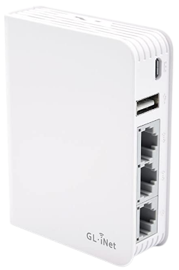
  

  

    

      <h4>GL-AR750 (Creta)</h4>
    

    

      <ul>
<li>Type de connecteur	Ethernet</li>
<li>Marque	GL.iNet  </li>
<li>Classe de bande de fréquence	Double bande  </li>
<li>Système d'exploitation	IOS </li>
<li>Type de technologie sans fil	802.11ac  </li>
<li>Nombre de ports	3  </li>
<li>Débit de transfert de données	750 Megabits Per Second  </li>
<li>Tension	5 Volts  </li>
</ul>
    

  

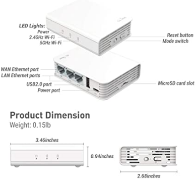{:height="300"}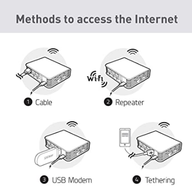{:height="300"}  
*GL.iNet GL-AR750 (Creta) Routeur Voyage AC VPN,300Mbps(2.4G)+433Mbps(5G) Wi-FI,128MB RAM,MicroSD Stockage Supporté, Pont Répétiteur, OpenWrt/LEDE pré-Installé*

SOURCE OUVERTE ET PROGRAMMABLE : OpenWrt/LEDE pré-installé, soutenu par un référentiel de logiciels.  
VPN CLIENT & SERVER : OpenVPN et WireGuard préinstallés, compatibles avec plus de 30 fournisseurs de services VPN.  
STOCKAGE ET EXTENSIBILITÉ : 128 Mo de RAM, 16 Mo NOR Flash, jusqu'à 128 Go d'emplacement MicroSD, port USB 2.0, trois ports Ethernet (1 WAN et 2 LAN).

## GL-AR750 CRETA

* [[OpenWrt Wiki] GL.iNet GL-AR750](https://openwrt.org/toh/gl.inet/gl-ar750)
* [GL.iNet Docs](https://docs.gl-inet.com)

### Mise en service

Mettre sous tension et se connecter en wifi

SSID = GL-AR750-9dc  
Mot de passe = goodlife  

Lancer le navigateur sur le lien 192.168.8.1 pour le paramétrage

Langue  
{:width="200"}  

Mot de passe admin  
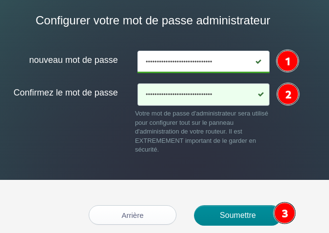{:width="300"}  

### Configuration 

* **L'internet**
    * Mode partage avec un téléphone 4G/5G relié en USB  
    * Port Wan utilisé comme Lan
* **Sans Fil** 
    * Modifier les clés wifi des 2 modes 2.4G/5G

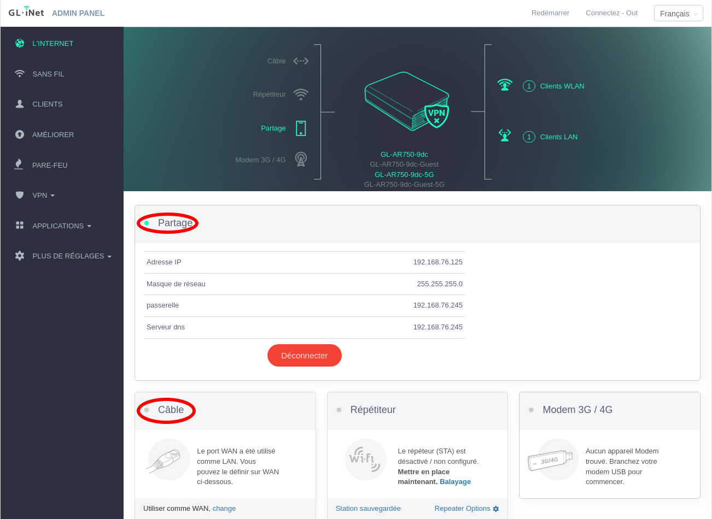{:width="700"}  

* **Plus de réglages**
    * Fuseau horaire - Synchroniser

### Wireguard - Mullvad

[Configurer wireguard mullvad](https://www.gl-inet.com/solutions/vpn/mullvad/)   
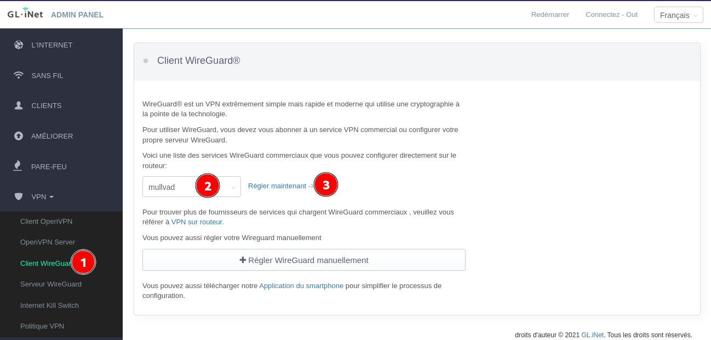  
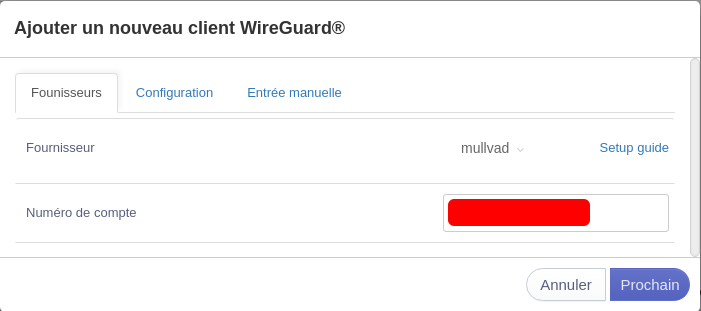{:width="400"}  
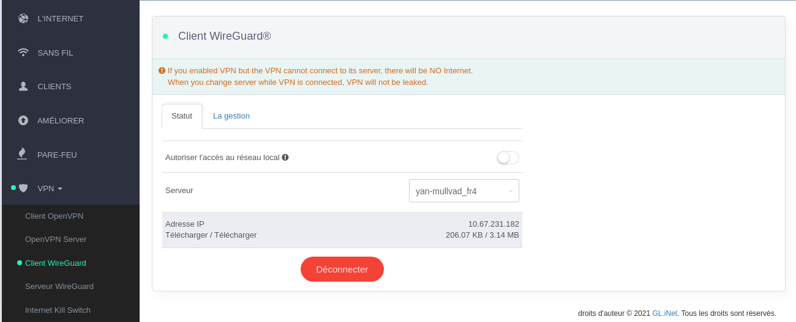  
On est connecté à "mullvad"  

On peut activer/désactiver wireguard par le bouton matériel  
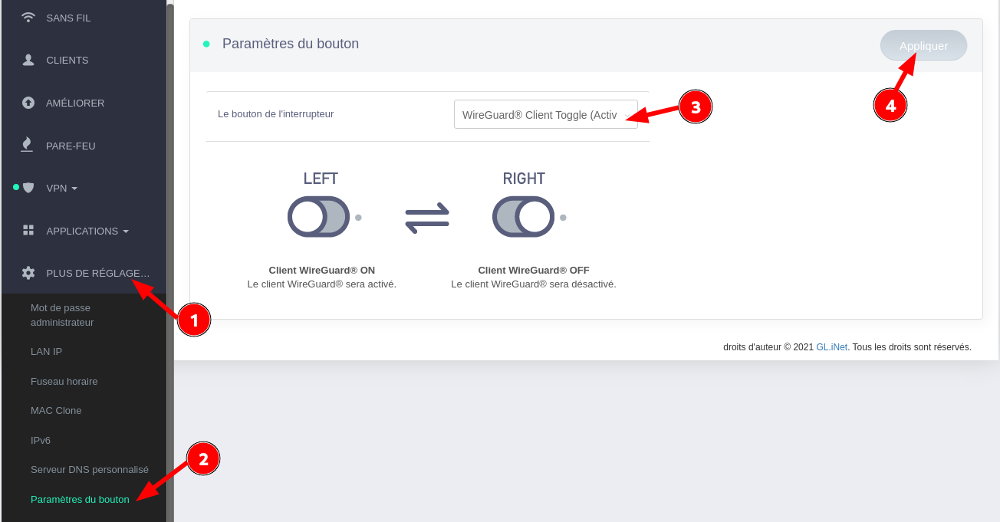  
Côté du `.` (droit) , **wiregard est DESACTIVE**

Le basculement du bouton wireguard Activé/Désactivé doit être suivi d'un redémarrage du routeur
{: .prompt-warning }

### Connexion SSH

Connexion ssh provoque une erreur

    ssh root@192.168.8.1

*Unable to negotiate with 192.168.8.1 port 22: no matching host key type found. Their offer: ssh-rsa*

Solution

    ssh -oHostKeyAlgorithms=+ssh-rsa root@192.168.8.1

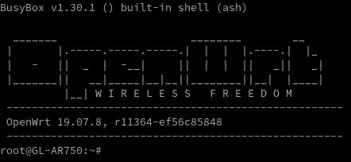

## Tethering

*Le Tethering est en fait le partage de votre connexion Internet avec tout autre appareil tel qu’un PC, un ordinateur portable, une tablette ou un téléphone portable.* 

**Connecter le smartphone au port USB du routeur** à l'aide du câble USB, puis activez l'option USB Tethering dans les paramètres d'Android.  
Paramètres &rarr; Réseau et Internet  
{:height="300"} 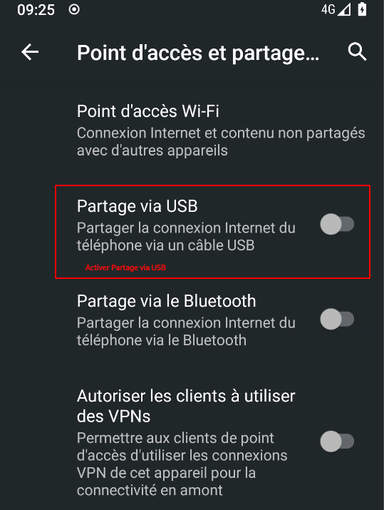{:height="300"}   
Le téléphone activera immédiatement le mode Tethering USB lorsqu'il sera branché sur un routeur ( ou un ordinateur portable).  
*Un téléphone verrouillé n'activera pas le mode "Partage via USB" sans une intervention manuelle.*

## Câble

### Configuration

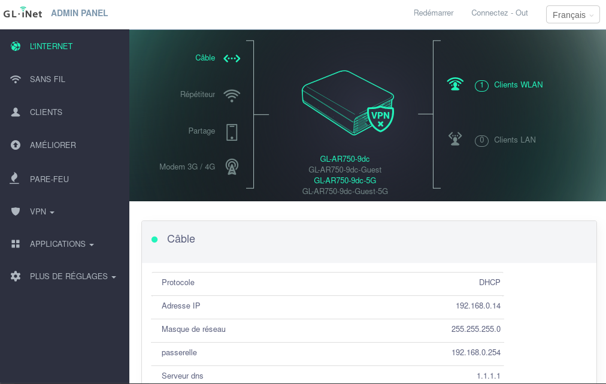  
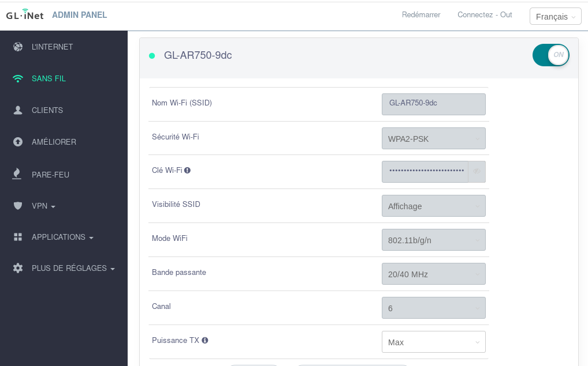  
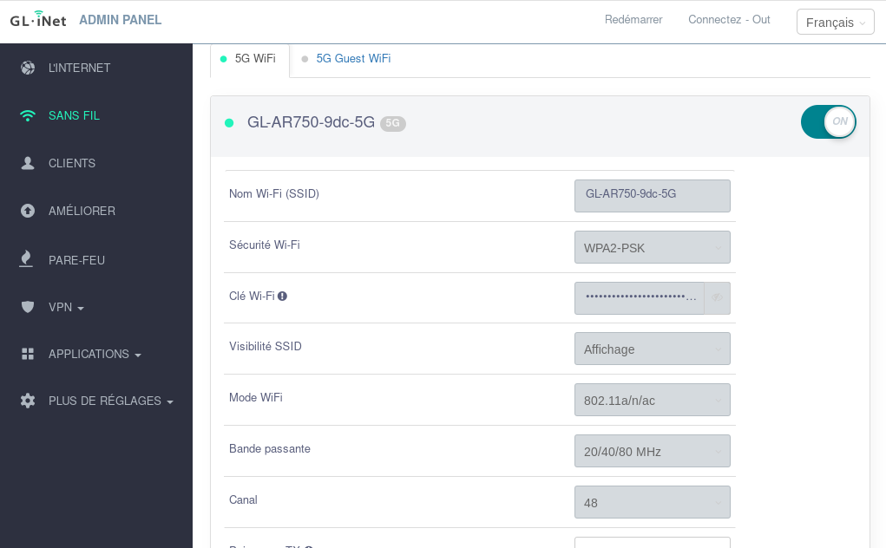  
  
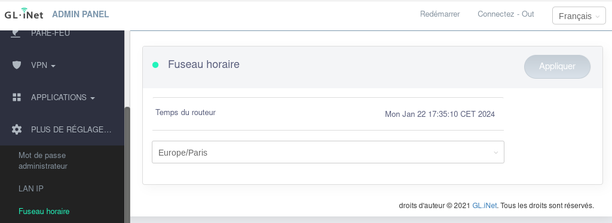  
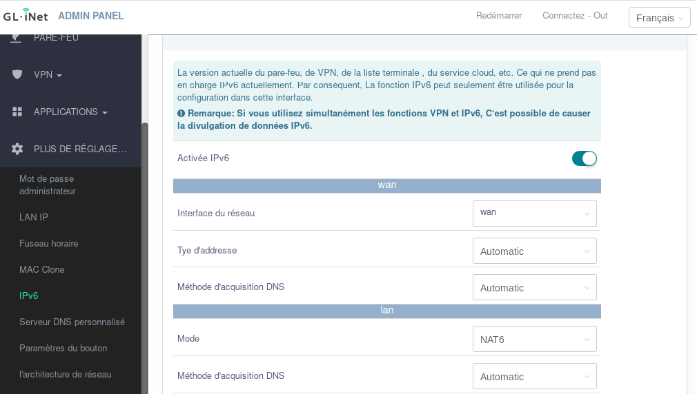  

### Analyse wifi  

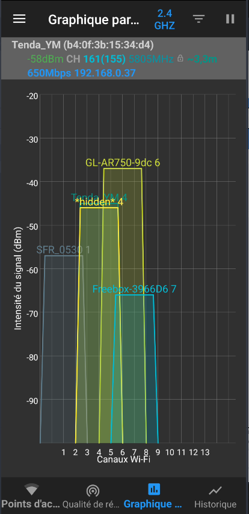{:height="400"}  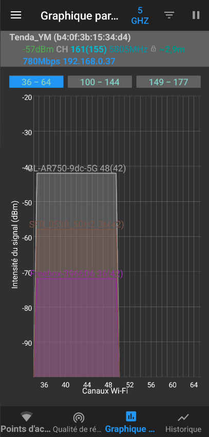{:height="400"} 

## Luci

### LuCI interface web

Installation Luci, **PLUS DE REGLAGE..** &rarr; **Avancée**
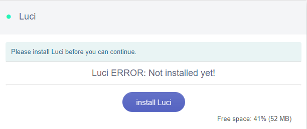  
Après installation  
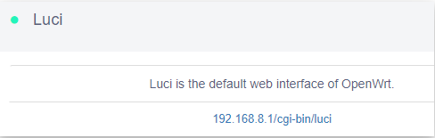  
patientez quelques minutes après lancement...  
Accès &rarr; 192.168.8.1/cgi-bin/luci  
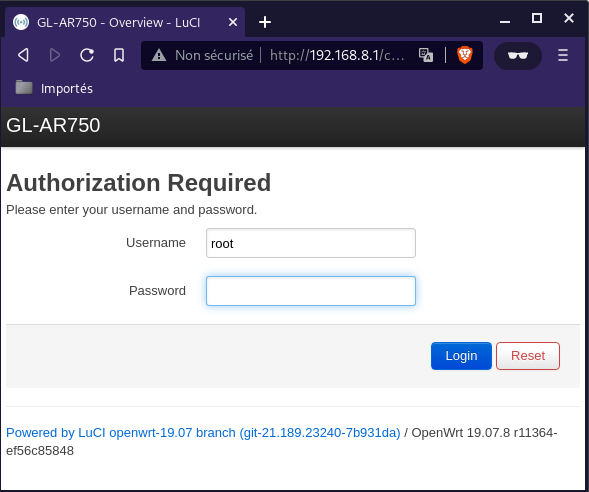  
*Note : Le nom d'utilisateur est root. Le mot de passe est le même que celui que vous utilisez pour accéder au panneau d'administration web.*

### Client wireguard

* [Configuration du client VPN WireGuard® pour le routeur OpenWrt](https://www.vpnunlimited.com/fr/help/manuals/open-wrt-wireguard-setup)

