+++
title = 'Lenovo Serveur MySpeed'
date = 2024-10-29 00:00:00 +0100
categories = ['debian']
+++
## MySpeed

{:height="80"}  
<https://github.com/gnmyt/myspeed>

### Analyse vitesse internet

MySpeed est un logiciel d'analyse de test de vitesse qui enregistre votre vitesse internet pendant 30 jours.  
Caractéristiques

* 📊 MySpeed génère des statistiques claires sur la vitesse, le ping, et plus encore.
* ⏰ MySpeed automatise les tests de vitesse et vous permet de définir le temps entre les tests à l'aide d'expressions Cron.
* 🗄️ Ajouter plusieurs serveurs directement à une instance MySpeed
* 🩺 Configurez des contrôles de santé pour vous notifier par email, Signal, WhatsApp ou Telegram en cas d'erreurs ou de temps d'arrêt
* 📆 Les résultats des tests peuvent être stockés jusqu'à 30 jours
* 🔥 Prise en charge de Prometheus et Grafana
* 🗳️ Choisissez entre les serveurs de test de vitesse Ookla, LibreSpeed et Cloudflare
* 💁 En savoir plus sur MySpeed sur [notre site web](https://myspeed.dev/)

### Installer MySpeed

Prérequis

```bash
# debian
sudo apt install wget curl unzip 
# alpine linux
sudo apk add wget curl unzip 
```

Vous n'avez besoin de faire cela que si vous n'avez pas encore installé NodeJS

```bash
curl -sSL https://deb.nodesource.com/setup_18.x | bash
sudo apt-get install nodejs -y 
```

Versions  installées: `node -v && npm -v`  
node v20.10.0  
npm 10.8.3

Créer un dossier

    mkdir ~/sharenfs/rnmkcy/myspeed && cd ~/sharenfs/rnmkcy/myspeed 

Télécharger la dernière version

```
wget $(curl -s https://api.github.com/repos/gnmyt/myspeed/releases/latest | grep browser_download_url | cut -d '"' -f 4)
unzip MySpeed-*.zip && rm MySpeed-*.zip 

npm install 
npm audit fix
```

### Proxy nginx

Créer le proxy sur le domaine `speed.rnmkcy.eu` qui écoute sur le port 5216

```
server {
    listen 80;
    listen [::]:80;
    server_name  speed.rnmkcy.eu;

    # redirect all plain HTTP requests to HTTPS
    return 301 https://speed.rnmkcy.eu$request_uri;
}

server {
    # ipv4 listening port/protocol
    listen       443 ssl http2;
    # ipv6 listening port/protocol
    listen           [::]:443 ssl http2;
    server_name  speed.rnmkcy.eu;

    include /etc/nginx/conf.d/security.conf.inc;

  location / { 
      proxy_pass              http://127.0.0.1:5216;
  } 

}
```

### Lancement  MySpeed

Lancer le serveur manuellement

    NODE_ENV=production node server 


Depuis un navigateur, ouvrir le lien https://speed.rnmkcy.eu  
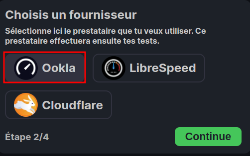  
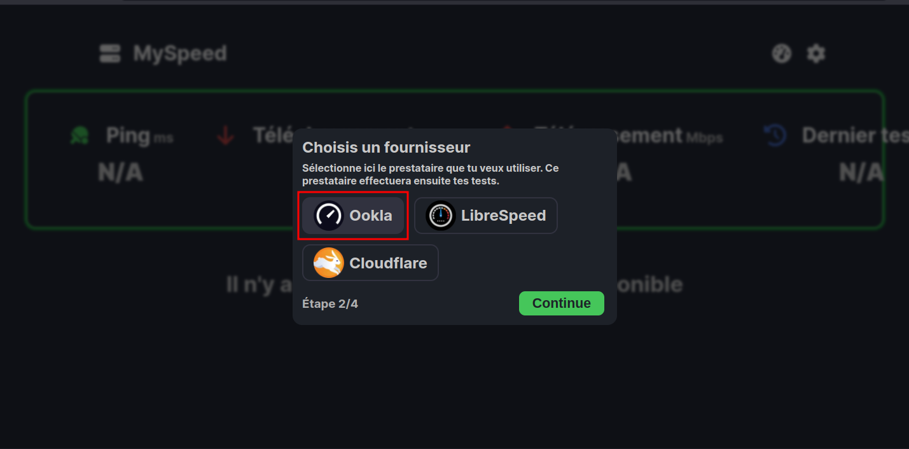  
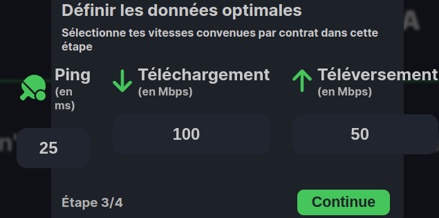  
  
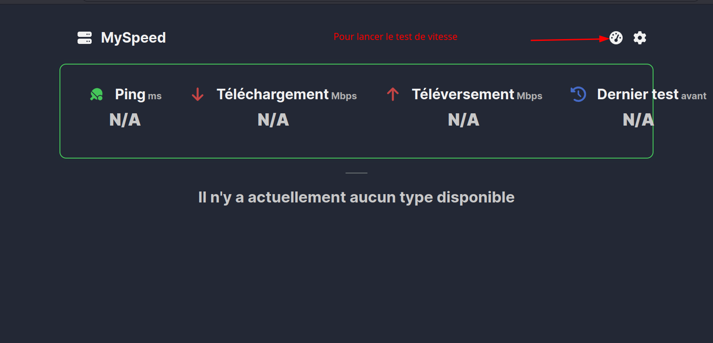  

Après lancement du test  
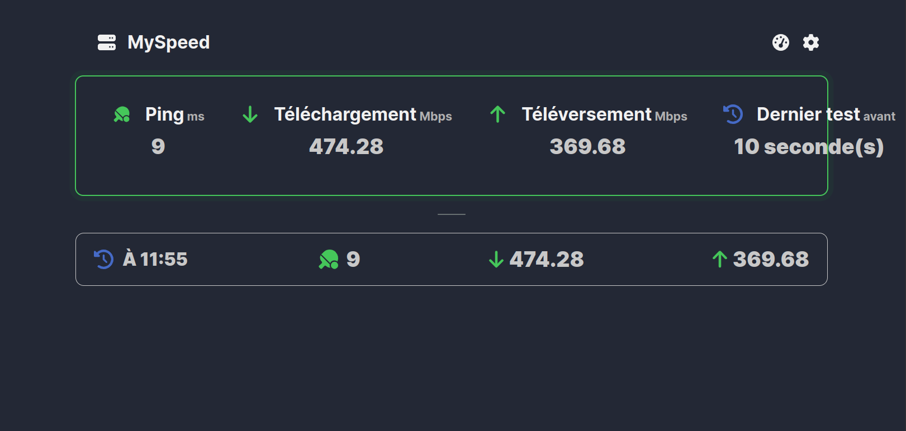  

Sur le terminal  
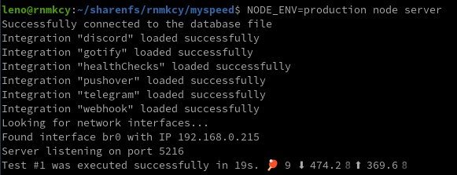  

### MySpeed 24/7

Créez un fichier nommé `myspeed.service` sous `/etc/systemd/system` 

    sudo nano /etc/systemd/system/myspeed.service

```
[Unit]
Description=MySpeed
After=network.target

[Service]
Type=simple
ExecStart=/home/leno/.nvm/versions/node/v20.10.0/bin/node server
Restart=always
User=leno
Environment=NODE_ENV=production
WorkingDirectory=/sharenfs/rnmkcy/myspeed

[Install]
WantedBy=multi-user.target
```

Enregistrer le fichier, CTRL + X, puis Y et enfin Entrée

Rechargez systemd

    sudo systemctl daemon-reload

Si vous voulez que MySpeed démarre au démarrage de systemd 

    sudo systemctl enable myspeed --now

Vérifiez maintenant le statut de MySpeed

    systemctl status myspeed

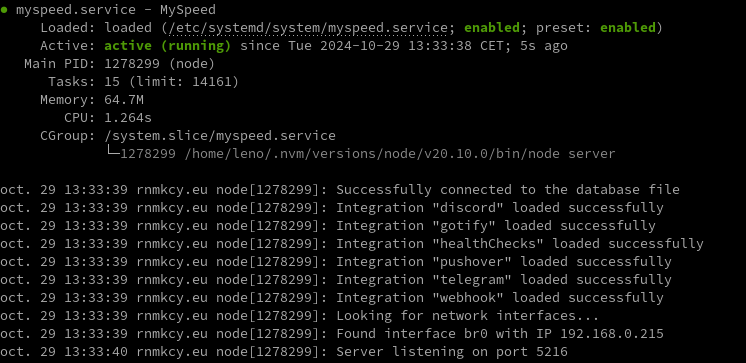  

Ouvrir le lien <https://speed.rnmkcy.eu>  
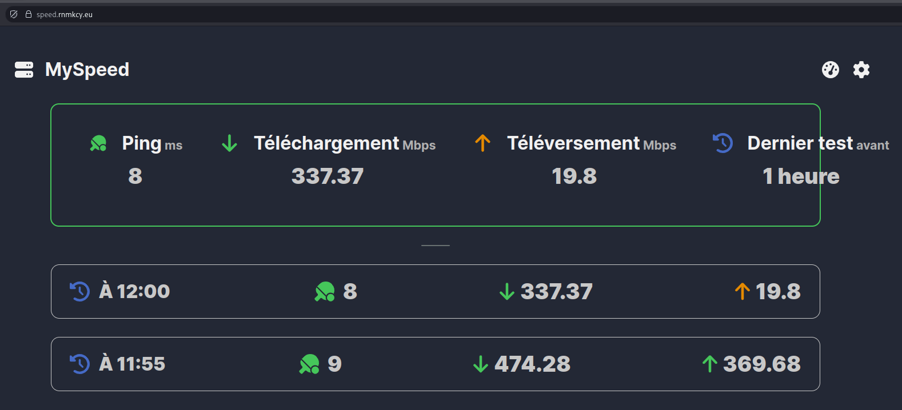  
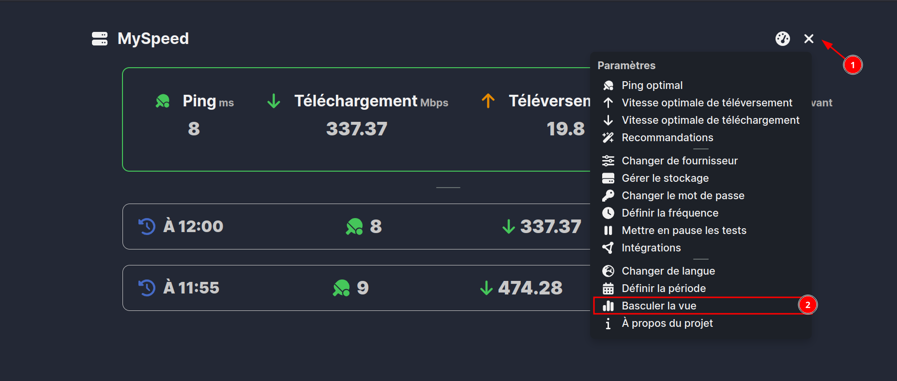  
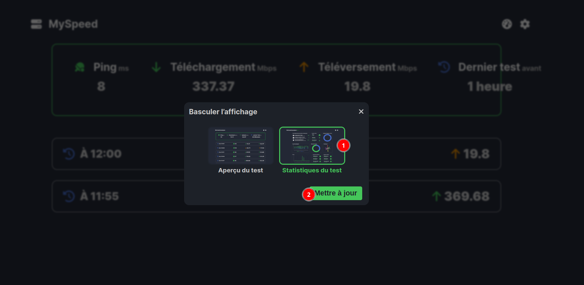  
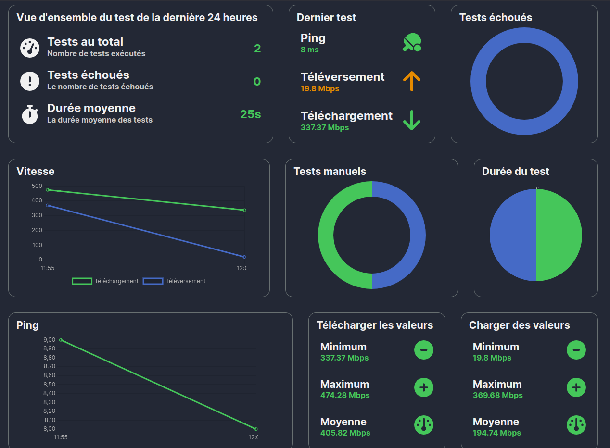  
