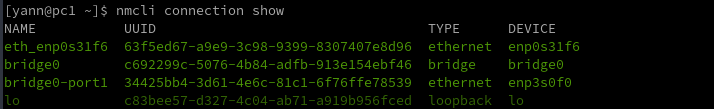
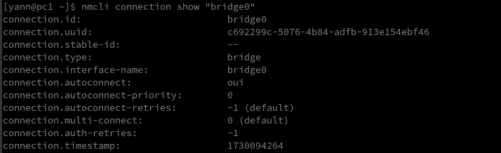
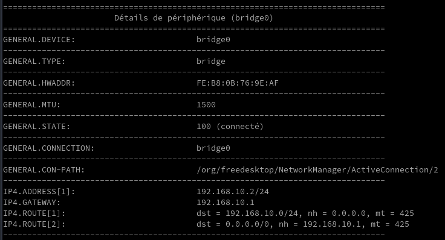
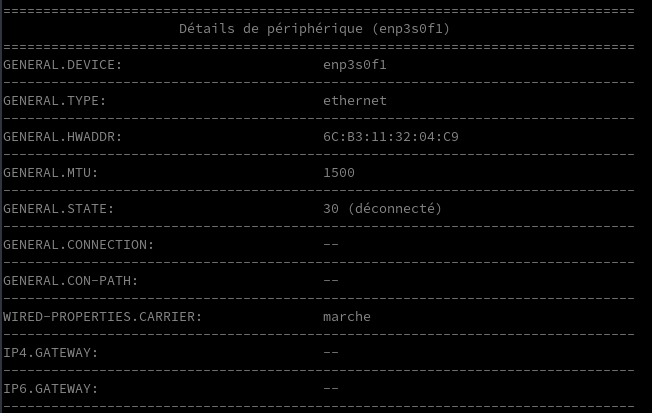

+++
title = 'Réseau NetworkManager - nmcli'
date = 2024-10-31 00:00:00 +0100
categories = network
+++
*nmcli (NetworkManager Command Line Interface) est une interface de ligne de commande du gestionnaire de réseau Linux.*

## nmcli

Article original : [nmcli : configurer le réseau NetworkManager sur Linux (Debian, Ubuntu, …)](https://www.malekal.com/nmcli-configurer-reseau-networkmanager-linux/)

### Interfaces réseau

lister les connexions réseau

    nmcli connection show



Puis pour afficher la configuration d’une interface réseau, saisissez la commande suivante en spécifiant le nom de la connexion réseau obtenue précédemment.

    nmcli connection show "bridge0"



Vous pouvez aussi utiliser cette commande pour obtenir des informations sur les interfaces réseaux.

    nmcli -p device show

  


### Configurer le réseau avec nmcli

**Ajouter une connexion réseau**  
`sudo nmcli connection add type <type-reseau> ifname <nom-connexion>`

**Modifier une connexion réseau existante**  
Avec nmcli, on peut apporter des ajustements et des configurations à une connexion réseau existante, comme basculer entre les configurations statiques et DHCP  
`sudo nmcli connection modify <connection-id> <parameter> <value>`

les configurations que nous pouvons ajouter et modifier une connexion à l’aide de nmcli.
Tout d’abord, nous allons créer un nouveau profil de connexion, par exemple sous le nom “gl-inet”

    nmcli connection add con-name gl-inet ifname enp3s0f1 type ethernet

On obtient la sortie suivante

    Connexion « gl-inet » (afec2e60-eb76-476c-8046-5ace62449019) ajoutée avec succès.

Le problème est que l'on se connecte immédiatement à cette interface qui n'est pas encore configurée
{: .prompt-warning }

Pour définir le démarrage automatique (ou pas) de la connexion réseau

    nmcli connection modify gl-inet connection.autoconnect yes
    nmcli connection modify gl-inet connection.autoconnect no

**Définir une adresse IPv4 statique avec un masque de sous-réseau /24**

    sudo nmcli connection modify gl-inet ipv4.address 192.168.8.2/24

**Définir une adresse IPv6 statique avec un masque de sous-réseau /64** (facultatif)

    sudo nmcli connection modify gl-inet ipv6.addresses 2001:db8:1::1/64

**Configurer une passerelle par défaut en IPv4 ou IPv6**

```bash
#IPv4
sudo nmcli connection modify gl-inet ipv4.gateway 192.168.8.1
#IPv6
sudo nmcli connection modify gl-inet ipv6.gateway 2001:db8:1::fffe
```

**Configurer un serveur DNS en IPv4 ou IPv6**  
Pour spécifier les serveurs DNS sur votre connexion internet, utilisez ces commandes :

```bash
#IPv4
sudo nmcli connection modify gl-inet ipv4.dns "192.168.0.254"
#IPv6
nmcli connection modify gl-inet ipv6.dns "2001:db8:1::ffbb"
```

**Définir la méthode de connexion IPv4 et IPv6 en DHCP (IP automatique)**  
Pour configurer votre connexion en DHCP :

```bash
#For IPv4
sudo nmcli connection modify gl-inet ipv4.method auto
#For IPv6
sudo sudo nmcli connection modify gl-inet ipv6.method auto
```

Pour que les modifications apportées prennent effet, vous devez activer le profil.

```bash
sudo nmcli connection up gl-inet
```

