+++
title = 'Maddy Mail Server rnmkcy.eu'
date = 2024-11-07 00:00:00 +0100
categories = ['messagerie']
+++
*Maddy Mail Server met en œuvre toutes les fonctionnalités requises pour faire fonctionner un serveur de courrier électronique. Il peut envoyer des messages via SMTP (fonctionne comme MTA), accepter des messages via SMTP (fonctionne comme MX) et stocker des messages tout en y donnant accès via IMAP. En outre, il met en œuvre des protocoles auxiliaires qui sont obligatoires pour assurer une sécurité raisonnable du courrier électronique (DKIM, SPF, DMARC, DANE, MTA-STS).  
Il remplace Postfix, Dovecot, OpenDKIM, OpenSPF, OpenDMARC et d'autres encore par un seul démon avec une configuration uniforme et un coût de maintenance minimal.*

## Maddy Mail Server

* [Comparaison des serveurs de messagerie](https://forwardemail.net/fr/blog/open-source/alpine-linux-email-server#email-server-comparison)
* [A curated list of resources on Email tools, server, framework, technology...](https://github.com/Mindbaz/awesome-opensource-email)
* [Maddy mail server](https://maddy.email/tutorials/setting-up/)
* [Comment installer un serveur de mails sur votre offre VPS ?](https://forum.inovaperf.fr/d/288-comment-installer-un-serveur-de-mails-sur-votre-offre-vps)
* [How to Set Up Selfhosted Email Server](https://taoshu.in/net/selfhost-email/)

{:height="100"}

### Installation

*Mise en place un serveur de messagerie utilisant maddy*

ATTENTION: Le serveur rnmkcy.eu ne dispose pas d'une adresse IPV6 car le réseau est géré par un pont. De plus le fournisseur d'accès internet ne gère pas le DNS Reverse IPV6.

Prérequis :

* Serveur Debian 12
    * [Désactiver IPV6 sur une debian 12](/posts/Debian_12_Serveur_Lenovo_Thinkcentre_M700_Tiny_M.2_SSD_500Go/#d%C3%A9sactiver-ipv6)
    * Vérifier que le fournisseur d'accès internet ne bloque pas le trafic SMTP port TCP 25
    * Activer le DNS Reverse IPV4 rnmkcy.eu chez le fournisseur d'accès internet
* Domaine OVH : rnmkcy.eu
    * Protection DNS contre le transfert
    * DNSSEC activé

Utilisation image préconstruite (Linux, amd64)  
Disponible sur [GitHub](https://github.com/foxcpp/maddy/releases) ou [maddy.email/builds](https://maddy.email/builds/).

Archive au format zst, installer l'outil si besoin (par défaut sur debian 12): `sudo apt install zstd`

```bash
# Téléchargement
wget https://github.com/foxcpp/maddy/releases/download/v0.7.1/maddy-0.7.1-x86_64-linux-musl.tar.zst
# décompression
tar -I zstd -xvf maddy-0.7.1-x86_64-linux-musl.tar.zst
```

Contenu archive

```
./maddy-0.7.1-x86_64-linux-musl/
./maddy-0.7.1-x86_64-linux-musl/maddy
./maddy-0.7.1-x86_64-linux-musl/systemd/
./maddy-0.7.1-x86_64-linux-musl/systemd/maddy.service
./maddy-0.7.1-x86_64-linux-musl/systemd/maddy@.service
./maddy-0.7.1-x86_64-linux-musl/maddy.conf
```

Copier l'exécutable maddy que vous pouvez copier dans /usr/local/bin

    sudo cp maddy-0.7.1-x86_64-linux-musl/maddy /usr/local/bin/

### Configuration système 

*distribution basée sur systemd*

On a utilisé une archive préconstruite, copiez manuellement `systemd/*.service` dans `/etc/systemd/system`

    sudo cp maddy-0.7.1-x86_64-linux-musl/systemd/*.service /etc/systemd/system/

Vous devez recharger la configuration du gestionnaire de service pour rendre le service disponible 

    sudo systemctl daemon-reload

En outre, vous devez créer l'utilisateur et le groupe maddy (maddy ne s'exécute jamais en tant que root)

    sudo useradd -mrU -s /sbin/nologin -d /var/lib/maddy -c "maddy mail server" maddy

Créer le répertoire et copier le fichier de configuration

    sudo mkdir -p /etc/maddy
    sudo cp maddy-0.7.1-x86_64-linux-musl/maddy.conf /etc/maddy/


### Nom hôte + domaine

Ouvrir `/etc/maddy/maddy.conf` 

* Si vous installez un très petit serveur de messagerie, vous pouvez utiliser rnmkcy.eu dans les deux champs. 
* Cependant, pour faciliter une future migration de service, <u>il est recommandé d'utiliser une entrée DNS séparée</u> à cet effet. Il s'agit généralement de mx1.rnmkcy.eu, mx2, etc. Vous pouvez bien sûr utiliser un autre sous-domaine, par exemple : smtp1.rnmkcy.eu. Un serveur de basculement de courrier électronique sera possible si vous transférez mx2.rnmkcy.eu vers un autre serveur (à condition que vous le configuriez pour gérer votre domaine).

```
$(hostname) = mx1.rnmkcy.eu
$(primary_domain) = rnmkcy.eu
$(local_domains) = $(primary_domain)
```

Si vous souhaitez gérer plusieurs domaines, vous devez toujours en désigner un comme "primaire".  
Ajoutez tous les autres domaines à la ligne `local_domains`  

    $(local_domains) = $(primary_domain) example.com other.example.com

### Enregistrements DNS

La façon dont il est configuré dépend de votre fournisseur DNS (ou de votre serveur, si vous utilisez le vôtre).

Pour la partie mail

```
        IN MX    10 mx1.rnmkcy.eu.
mx1     IN A     82.64.18.243
```

joker`(*)` pour tous les sous-domaines

### Certificats TLS

Une chose qui ne peut pas être configurée automatiquement, ce sont les certificats TLS (/etc/maddy/maddy.conf).    

    tls file /etc/maddy/certs/$(hostname)/fullchain.pem /etc/maddy/certs/$(hostname)/privkey.pem

Créer le dossier de  stockage des certificats

```
sudo mkdir -p /etc/maddy/certs/mx1.rnmkcy.eu
sudo chown $USER:root /etc/maddy/certs/mx1.rnmkcy.eu # pour les certificats
```

**ACME.sh**  

Création des certificats ([Serveur , installer et renouveler les certificats SSL Let's encrypt via Acme](/posts/Acme-Certficats-Serveurs/))

```
acme.sh --dns dns_ovh --server letsencrypt --issue --keylength ec-384 -d 'mx1.rnmkcy.eu'
```

Si vous utilisez **acme.sh** pour gérer vos certificats, vous pouvez simplement exécuter

```
acme.sh --ecc --install-cert -d 'mx1.rnmkcy.eu' \
  --key-file       /etc/maddy/certs/mx1.rnmkcy.eu/privkey.pem  \
  --fullchain-file /etc/maddy/certs/mx1.rnmkcy.eu/fullchain.pem
```

`Problème de lecture des certificats par le daemon maddy, malgré l'utilisation des ACL !!! + problème de renouvellement des certificats car aucun shell ne peut être exécuté !!!`{: .prompt-warning }

Vous devez vous assurer que maddy peut les lire lorsqu'il tourne en tant qu'utilisateur non privilégié (maddy ne tourne jamais en tant que root, même au démarrage), une façon de le faire est d'utiliser les ACLs (installer acl : `sudo apt install acl`)

```
sudo setfacl -R -m g:maddy:rwx /etc/maddy/certs/mx1.rnmkcy.eu
```

maddy recharge les certificats TLS à partir du disque une fois par minute, de manière à ce qu'il remarque le renouvellement. Il est possible de forcer le rechargement via `systemctl reload maddy` 


Renouvellement par cron

```
45 0 * * * "$HOME/.acme.sh"/acme.sh --cron --home "$HOME/.acme.sh" --renew-hook "$HOME/.acme.sh/acme.sh --ecc --install-cert -d 'mx1.rnmkcy.eu' --key-file /etc/maddy/certs/mx1.rnmkcy.eu/privkey.pem --fullchain-file /etc/maddy/certs/mx1.rnmkcy.eu/fullchain.pem" > /dev/null
```

### Première exécution

lancer et activer maddy

    sudo systemctl enable maddy --now 

maddy initie le répertoire `/var/lib/maddy/` et génère la clé DKIM

#### DKIM

*L’enregistrement DKIM est un enregistrement TXT modifié qui ajoute des signatures cryptographiques à vos messages électroniques. Vous ajoutez un enregistrement DKIM à votre système de nom de domaine (DNS), et il contient la cryptographie à clé publique utilisée par le serveur de messagerie récepteur pour authentifier un message.* 

Et la dernière, la clé DKIM, est un peu délicate. maddy a généré une clé pour vous lors du premier démarrage.  
Vous pouvez la trouver dans `/var/lib/maddy/dkim_keys/rnmkcy.eu_default.dns`  
Vous devez la mettre dans un enregistrement TXT pour le domaine default._domainkey.rnmkcy.eu

```
default._domainkey IN TXT "v=DKIM1;k=rsa;p=MIIBIjANBgkqZuislR85jSpyVpe1jjvnNI8nf8GRPM0RR9uEPQIDAQAB;"
```

#### DMARC

Une politique DMARC détermine ce qu'il advient d'un message électronique après sa vérification par rapport aux enregistrements SPF et DKIM. Un e-mail passe ou échoue à SPF et DKIM. La politique DMARC détermine si l'échec entraîne le marquage de l'e-mail comme spam, son blocage ou sa remise au destinataire prévu. (Les serveurs de messagerie peuvent toujours marquer les e-mails comme spam s'il n'y a pas d'enregistrement DMARC, mais DMARC fournit des instructions plus claires sur le moment de le faire).

La politique de domaine de rnmkcy.eu pourrait être :

*Si un e-mail échoue aux tests DKIM et SPF, marquez-le comme spam.*

Ces politiques ne sont pas enregistrées sous forme de phrases lisibles par l'homme, mais plutôt sous forme de commandes lisibles par la machine afin que les services de messagerie puissent les interpréter automatiquement. Cette politique DMARC ressemblerait en fait à ceci :

```
v=DMARC1; p=quarantine; adkim=s; aspf=s;
```

Qu’est-ce que cela signifie ?

*    **v=DMARC1** indique que cet enregistrement TXT contient une politique DMARC et doit être interprété comme tel par les serveurs de messagerie.
*    **p=quarantine** indique que les serveurs de messagerie doivent « mettre en quarantaine » les e-mails qui ne répondent pas aux critères DKIM et SPF, les considérant comme des spams potentiels. Parmi les autres paramètres possibles, citons **p=none**, qui permet aux e-mails qui échouent de passer quand même, et **p=reject**, qui demande aux serveurs de messagerie de bloquer les e-mails qui échouent.
*    **adkim=s** signifie que les vérifications DKIM sont « strictes ». Il est également possible de définir « relaxé » en remplaçant s par r, comme **adkim=r** 
*    **aspf=s** est identique à adkim=s, mais pour SPF.

Notez que aspf et adkim sont des paramètres facultatifs. L'attribut p= indique ce que les serveurs de messagerie doivent faire avec les e-mails qui échouent à SPF et DKIM.
{: .prompt-info }

Si l'administrateur rnmkcy.eu voulait rendre cette politique encore plus stricte et signaler plus fortement aux serveurs de messagerie de considérer les messages non autorisés comme du spam, il ajusterait l'attribut `p=` comme suit :

```
v=DMARC1; p=reject; adkim=s; aspf=s;
```

En substance, cela signifie : *Si un e-mail échoue aux tests DKIM et SPF, ne le remettez pas.*

**Qu'est-ce qu'un rapport DMARC ?**  
Les politiques DMARC peuvent contenir des instructions pour l'envoi de rapports sur les e-mails qui passent ou échouent au test DKIM ou SPF. En général, les administrateurs configurent les rapports pour qu'ils soient envoyés à un service tiers qui les réduit à une forme plus digeste, afin que les administrateurs ne soient pas submergés d'informations. Les rapports DMARC sont extrêmement importants, car ils fournissent aux administrateurs les informations dont ils ont besoin pour décider de l'ajustement de leurs politiques DMARC, par exemple si leurs e-mails légitimes échouent aux tests SPF et DKIM, ou si un spammeur tente d'envoyer des e-mails illégitimes.

L'administrateur de rnmkcy.eu ajouterait la partie **rua** de cette politique pour envoyer ses rapports DMARC à un service tiers (dont l'adresse électronique est « exemple@third-party-example.com ») :

    v=DMARC1; p=reject; adkim=s; aspf=s; rua=mailto:exemple@third-party-example.com;

**Qu'est-ce qu'un enregistrement DMARC ?**  
Un enregistrement DMARC stocke la politique DMARC d'un domaine. Les enregistrements DMARC sont stockés dans le système de noms de domaine (DNS) sous forme d'enregistrements DNS TXT . Un enregistrement DNS TXT peut contenir presque tout le texte qu'un administrateur de domaine souhaite associer à son domaine. L'une des façons d'utiliser les enregistrements DNS TXT est de stocker les politiques DMARC.

(Notez qu'un enregistrement DMARC est un enregistrement DNS TXT qui contient une politique DMARC, et non un type spécialisé d' enregistrement DNS.)

La politique DMARC de rnmkcy.eu pourrait ressembler à ceci :

Nom 	| Type |Contenu 	|TTL
-----|-------|-----|---
_dmarc.rnmkcy.eu |	TXT |	v=DMARC1; p=quarantine; adkim=r; aspf=r; rua=mailto:example@third-party-rnmkcy.eu; |	32600

Dans cet enregistrement TXT, la politique DMARC est contenue dans le champ « Contenu ».

**Politique choisie pour DMARC rnmkcy.eu**

```
_dmarc        IN TXT     "v=DMARC1; p=none"
```

#### MTA-STS 

**Prérequis, nginx est installé**

*Vous disposiez d'un serveur de messagerie SMTP prenant en charge STARTTLS. La plupart des agents de distribution de courrier (MDA) prenant en charge TLS négocieront automatiquement une certaine forme de cryptage. Cependant, il s'avère que STARTTLS est particulièrement vulnérable aux attaques de type Man-in-the-middle en raison de sa prise de contact en texte brut, permettant à des adversaires tels que votre FAI, la NSA ou même des pirates chinois de lire vos e-mails privés.*

* [Qu'est-ce que MTA-STS ?](https://dmarcian.com/fr/mta-sts/)
* [Enable MTA-STS in 5 Minutes with NGINX](https://www.naut.ca/blog/2020/04/07/mta-sts-in-5-minutes/)

Créer le dossier 

    sudo mkdir -p /var/www/default-www/.well-known

**Enregistrement MTA-STS DNS domaine rnmkcy.eu**

```
; Mark domain as MTA-STS compatible 
_mta-sts.rnmkcy.eu.   TXT    "v=STSv1; id=20240210140000"
; and request reports about failures to be sent to postmaster@rnmkcy.eu
_smtp._tls.rnmkcy.eu. TXT    "v=TLSRPTv1;rua=mailto:postmaster@rnmkcy.eu"
```

**Stratégie pour serveur de messagerie rnmkcy.eu**  

* **version**: La version du protocole du fichier. Au moment de la rédaction de ce document, il doit s'agir de STSv1.
* **mode**: Il s'agit du mode de la politique. Les valeurs disponibles sont **testing**, **enforce**, ou **none**.
    * **testing**: Les expéditeurs enverront vos rapports (TLSRPT) indiquant les échecs d'application de la politique. Cela nécessite que TLSRPT soit également implémenté pour fonctionner. Les échecs de connexion TLS ne seront pas bloqués, tout en étant capable de recevoir des rapports.
    * **enforce**: Les serveurs de messagerie expéditeurs qui prennent en charge MTA STS ne délivreront pas de courrier à votre domaine lorsque l'authentification du certificat échoue, ou ne peut pas négocier TLS. Des rapports sur ces échecs sont également envoyés.
    * **none**: Les expéditeurs traiteront le domaine comme s'il n'avait pas de politique active. Cela désactive effectivement le MTA STS.
* **mx**: Les enregistrements MX pour le domaine. Ils doivent correspondre aux enregistrements MX publiés dans le DNS de votre domaine. Vous pouvez spécifier le FQDN ou un hôte joker (mx : mail.example.org ou mx : *.example.org). Assurez-vous que chaque enregistrement MX est ajouté sur sa propre ligne dans le fichier de stratégie.
* **max_age**: La durée de vie maximale de la politique exprimée en secondes. Cela représente la durée pendant laquelle un expéditeur mettrait en cache la politique du domaine. Il est recommandé d'utiliser une valeur équivalente à plusieurs semaines ou plus, mais ne dépassant pas 31557600 (environ 1 an).

Fichier `/var/www/default-www/.well-known/mta-sts.txt`

```
version : STSv1
mode : testing
max_age : 604800
mx : mx1.rnmkcy.eu
```

Mise en forme pour affichage navigateur

```
version: STSv1\r\nmode: testing\r\nmx: rnmkcy.eu\r\nmax_age: 604800\r\n
```

Pour le domaine **rnmkcy.eu** fichier configuration `/etc/nginx/conf.d/mta-sts.conf`

```
server {
    listen 443 ssl http2;
    listen [::]:443 ssl http2;
    server_name mta-sts.rnmkcy.eu;
    root /var/www/default-www;

    include /etc/nginx/conf.d/security.conf.inc;
      location = /.well-known/mta-sts.txt {
        default_type text/plain;
        return 200 "version: STSv1\r\nmode: testing\r\nmx: mx1.rnmkcy.eu\r\nmax_age: 604800\r\n";
      }
}
```

Redémarrez NGINX et pointez le sous-domaine mta-sts vers le serveur NGINX via un enregistrement A ou !AAAA

le MDA récupère la stratégie MTA-STS à partir de l'URL suivante :

<https://mta-sts.rnmkcy.eu/.well-known/mta-sts.txt>  
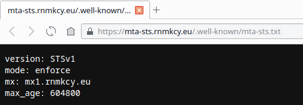  

#### TLSA (DANE)

*Le résumé du RFC 6698 « The DNS-Based Authentication of Named Entities (DANE) Transport Layer Security (TLS) Protocol : TLSA", dans lequel DANE est proposé, décrit assez bien ce qu'est DANE : « Les communications cryptées sur l'internet utilisent souvent le protocole TLS (Transport Layer Security), qui dépend de tiers pour certifier les clés utilisées. Ce document améliore cette situation en permettant aux administrateurs de noms de domaine de spécifier les clés utilisées dans les serveurs TLS de ce domaine. Cela nécessite des améliorations correspondantes dans le logiciel client TLS, mais aucun changement dans le logiciel serveur TLS ».*

[How to use DANE/TLSA](https://weberblog.net/how-to-use-danetlsa/)

Il est également recommandé de définir un enregistrement TLSA (DANE). Utilisez <https://www.huque.com/bin/gen_tlsa> pour en générer un.  
Copier/coller le contenu du certificat `/etc/maddy/certs/mx1.rnmkcy.eu/fullchain.pem`, port sur 25, le protocole de transport sur "tcp" et le nom de domaine sur le nom d'hôte MX.  
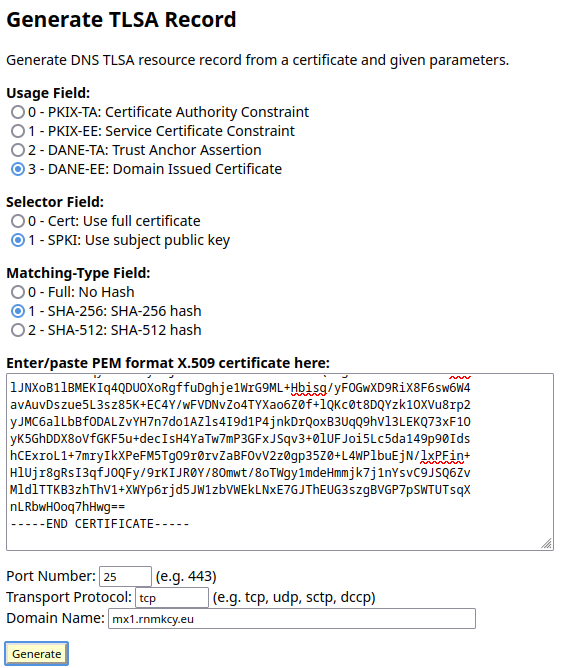  

Et cliquer sur generate  
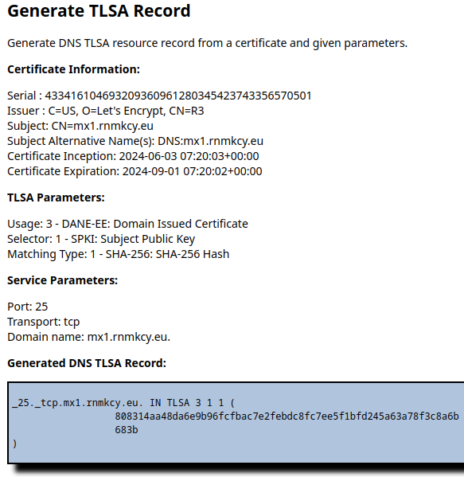  

Ajouter à l'enregistrement DNS 

```
_25._tcp.mx1.rnmkcy.eu. IN TLSA 3 1 1 808314aa48da6e9b96fcfbac7e2febdc8fc7ee5f1bfd245a63a78f3c8a6b683b
```

Test: `dig _25._tcp.mx1.rnmkcy.eu tlsa +dnssec +multi`  

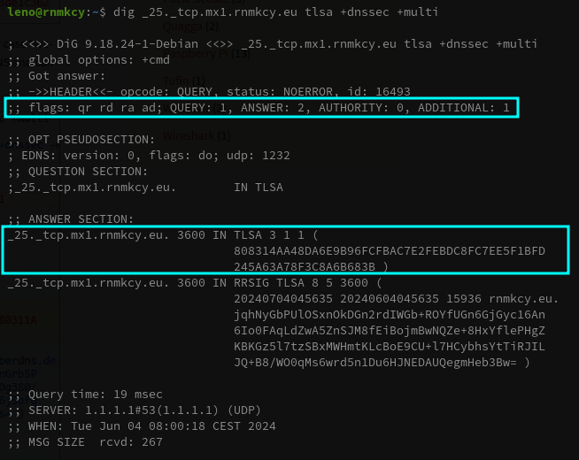{:width="600"}  


#### DNS complet

```
$TTL 3600
@	IN SOA dns110.ovh.net. tech.ovh.net. (2024060306 86400 3600 3600000 300)
        IN NS     dns110.ovh.net.
        IN NS     ns110.ovh.net.
        IN MX     10 mx1.rnmkcy.eu.
        IN A     82.64.18.243
        IN CAA     128 issue "letsencrypt.org"
*        IN A     82.64.18.243
_25._tcp.mx1        IN TLSA     3 1 1 808314aa48da6e9b96fcfbac7e2febdc8fc7ee5f1bfd245a63a78f3c8a6b683b
_dmarc        IN TXT     "v=DMARC1; p=quarantine; rua=mailto:postmaster@rnmkcy.eu"
_mta-sts        IN TXT     "v=STSv1; id=1"
_smtp._tls        IN TXT     "v=TLSRPTv1;rua=mailto:postmaster@rnmkcy.eu"
default._domainkey        IN TXT     ( "v=DKIM1; k=rsa; p=MIIBIjANBgkqhkiG9w0B...QJJzR7M0arF8jdQIDAQAB" )
mx1        IN A     82.64.18.243
```

### Outils de test

[17 outils SMTP pour diagnostiquer et tester la sécurité du courrier électronique](https://geekflare.com/fr/smtp-testing-tools/)

[Validateur MTA-STS gratuit](https://esmtp.email/tools/mta-sts/)  
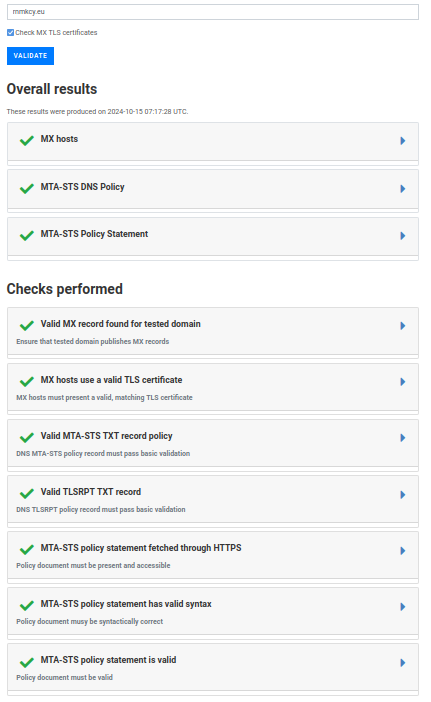  

[CheckTLS](https://www.checktls.com) vous permet de vérifier la sécurité de votre messagerie et le fonctionnement de vos courriels. EmailSentry Outlook vous aide à vous assurer que tous les courriels que vous envoyez sont privés, légaux et sûrs.  
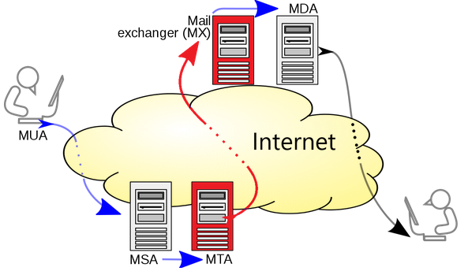{:width="400"}   
L’outil est approuvé par HIPAA, CCPA, PCI, GDPR et d’autres réglementations de conformité pour la sécurité des emails. CheckTLS vous aide également à résoudre les problèmes détectés dans vos courriels après le test.  
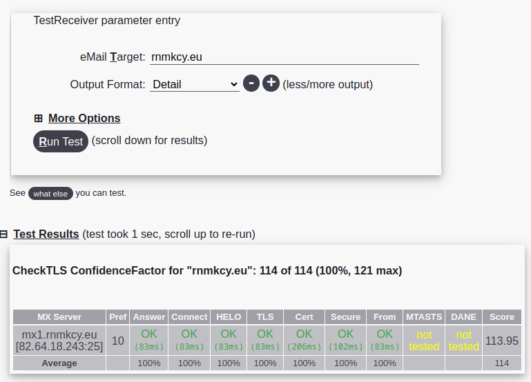{:width="600"}   

[SSL-Tools](https://ssl-tools.net/mailservers) est un outil assez simple qui permet d’entrer la partie « domaine » d’une adresse électronique et de tester sa sécurité.  
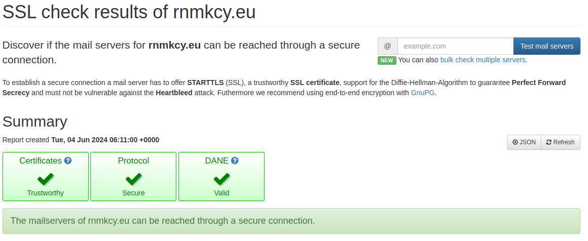{:width="600"}   
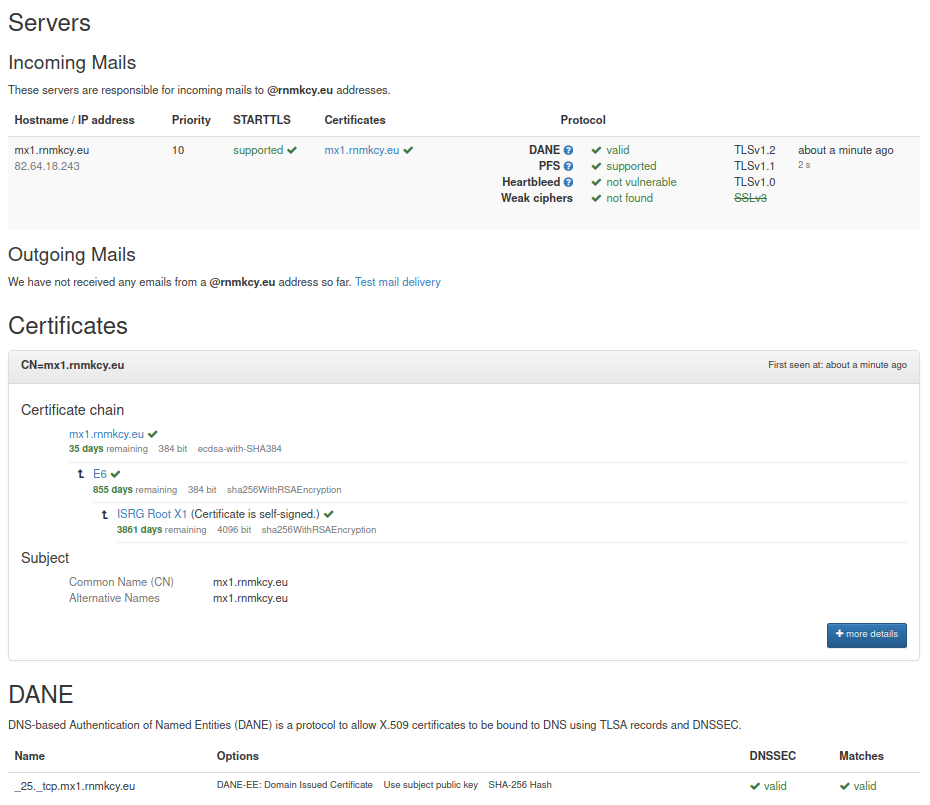{:width="600"}   

[ImmuniWeb](https://www.immuniweb.com/ssl/) offre un outil efficace pour tester la sécurité SSL.  
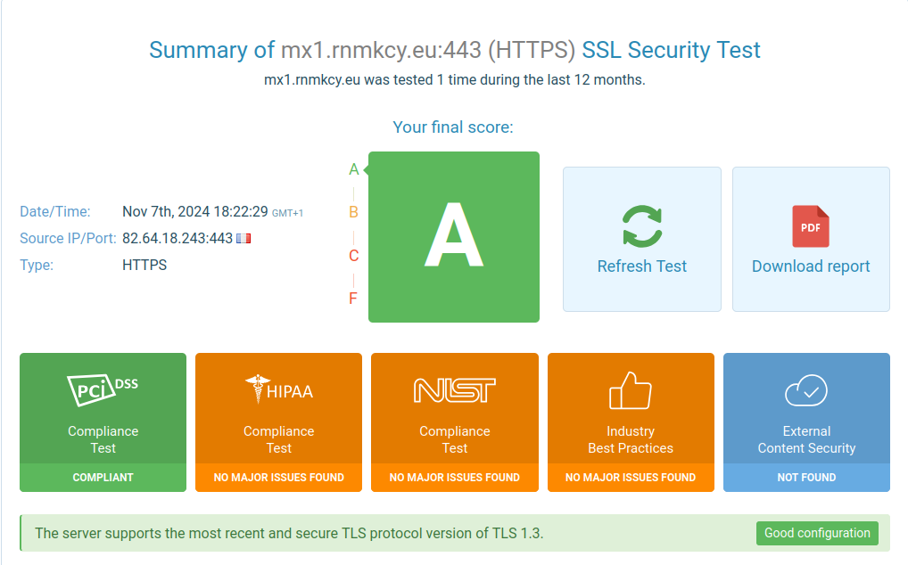{:width="600"}   

[DNSQueries](https://www.dnsqueries.com/en/smtp_test_check.php) est un outil utile qui vous permet de vérifier la santé de votre serveur SMTP et de vous assurer que tout fonctionne correctement.  
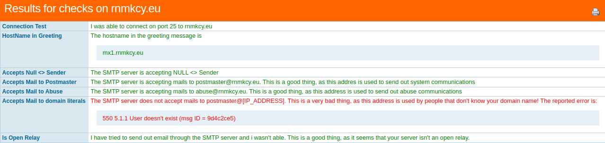   

[MTA-STS Lookup - Check domains for Inbound Transport Layer Security (TLS) Enforcement - MxToolbox](https://mxtoolbox.com/mta-sts.aspx)
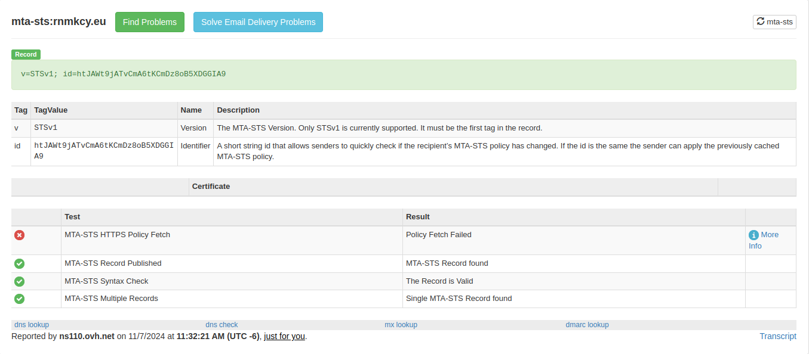   

[MxToolbox](https://mxtoolbox.com/diagnostic.aspx)
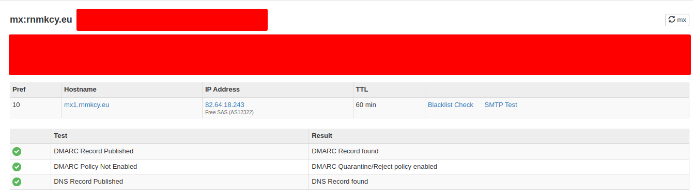

[Mx lookup - MxToolBox](https://mxtoolbox.com/SuperTool.aspx)  
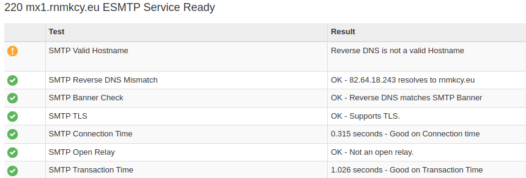   

### Comptes utilisateurs 

*Gestion base sqlite3 ou LLDAP*

#### Gestion sqlite3

Un serveur de messagerie est inutile sans boîtes aux lettres, n'est-ce pas ? Contrairement à des logiciels comme postfix et dovecot, maddy utilise par défaut des <u>"utilisateurs virtuels"</u>, ce qui signifie qu'il ne se préoccupe pas des utilisateurs du système et n'en a pas connaissance.

Les boîtes aux lettres IMAP ("comptes") et les identifiants d'authentification sont séparés.

Pour enregistrer les informations d'identification d'un utilisateur, utilisez la commande `maddy creds create`  

```bash
maddy creds create postmaster@rnmkcy.eu # on vous demande de saisir le mot de passe du compte
```

Notez que le nom d'utilisateur est une adresse électronique. Ceci est nécessaire car le nom d'utilisateur est utilisé pour autoriser l'accès IMAP et SMTP (à moins que vous ne configuriez des mappings personnalisés, non décrits ici).

Après avoir enregistré les informations d'identification de l'utilisateur, vous devez également créer un compte de stockage local 

```bash
maddy imap-acct create postmaster@rnmkcy.eu
```

Voilà, c'est fait. Vous avez maintenant votre première adresse électronique.  
Lorsque vous vous authentifiez avec votre client de messagerie, n'oubliez pas que le nom d'utilisateur est "postmaster@rnmkcy.eu", et pas seulement "postmaster".

L'exécution de `maddy creds --help` et `maddy imap-acct --help` peut s'avérer utile pour connaître les autres commandes.  

Créer l'utilisateur postmaster sans shell ni home

    sudo useradd postmaster

Notez que les comptes IMAP et les identifiants sont gérés séparément, mais que les noms d'utilisateur doivent correspondre par défaut pour que les choses fonctionnent.

Ajout utilisateur local linux au serveur de messagerie et le stockage local

```bash
maddy creds create leno@rnmkcy.eu # on vous demande de saisir le mot de passe du compte
maddy imap-acct create leno@rnmkcy.eu
```

Liste des utilisateurs : `maddy creds list` et des stockages : `maddy imap-acct list`

Le compte de soumission SMTP et le compte IMAP sont tous deux leno@rnmkcy.eu, et non leno  

Dans le table.chain par défaut, seul le courrier envoyé au compte existant sera accepté.    
Si vous souhaitez que leno@rnmkcy.eu reçoive tous les envois à une adresse inexistante, vous pouvez ajouter la ligne suivante au bloc `local_rewrites` de `table.chain` au fichier de configuration `/etc/maddy/maddy.conf` 

```
    optional_step regexp "(.+)@(.+)" "leno@$2"
```

`table.chain` après modification  
   

La première règle redirigera le courrier électronique envoyé à foo+git@rnmkcy.eu vers foo@rnmkcy.eu  
La deuxième règle s'assure que le courrier destiné à postmaster (sans le domaine) sera envoyé à postmaster@rnmkcy.eu  
La troisième règle trouvera la règle de redirection dans le fichier /etc/maddy/aliases  
Et la dernière règle FACULTATIVE transférera tous les courriers dont le destinataire est inconnu à leno@rnmkcy.eu.

#### Gestion LLDAP (ACTIVE)

`Maddy créera automatiquement un compte imap si un nouvel utilisateur se connecte via LDAP.`{: .prompt-tip }

maddy prend en charge l'authentification via LDAP en utilisant la liaison DN. Les mots de passe sont vérifiés par le serveur LDAP.  
Maddy a besoin de connaître le DN à utiliser pour la liaison. Il peut être obtenu soit par recherche de répertoire ou template  

Notez que les backends de stockage utilisent traditionnellement des adresses e-mail, si vous utilisez des identifiants non-email comme nom d'utilisateur, vous devez les mapper sur les e-mails de livraison en utilisant auth_map (voir la page de documentation pour le backend de stockage utilisé).  
auth.ldap peut également être utilisé comme module de table. De cette façon, vous pouvez vérifier si le compte existe. Il fonctionne seulement si le modèle DN n'est pas utilisé.

[Exemple de configuration Maddy avec LLDAP](https://github.com/lldap/lldap/blob/main/example_configs/maddy.md)  
Exemple de configuration de maddy avec LLDAP fonctionnant dans docker.
Vous pouvez remplacer `local_authdb` par un autre nom si vous souhaitez utiliser plusieurs backends d'authentification.  
Si vous ne voulez utiliser qu'un seul backend de stockage, assurez-vous de désactiver `auth.pass_table local_authdb` dans votre configuration s'il est encore actif.

```
#auth.pass_table local_authdb {
#    table sql_table {
#        driver sqlite3
#        dsn credentials.db
#        table_name passwords
#    }
#}
auth.ldap local_authdb {
    urls ldap://127.0.0.1:3890

    bind plain "cn=admin,ou=people,dc=rnmkcy,dc=eu" "admin_password"
    base_dn "dc=rnmkcy,dc=eu"
    filter "(&(|(uid={username})(mail={username}))(objectClass=person))"

    starttls off
    debug off
    connect_timeout 1m
}
```

Après les modifications, on redémarre le serveur de messagerie

    sudo systemctl restart maddy

#### Alias de messagerie

Les alias de messagerie sont stockés dans le fichier `/etc/maddy/aliases` sous le format suivant  

```
# adresse mail alias: adresse mail destinataire
achats@rnmkcy.eu: yann@rnmkcy.eu
hideme@rnmkcy.eu: yann@rnmkcy.eu
vpn@rnmkcy.eu: yann@rnmkcy.eu
postmaster@rnmkcy.eu: yann@rnmkcy.eu
abuse@rnmkcy.eu: yann@rnmkcy.eu
```

Redémarrer le service

    sudo systemctl restart maddy


### Parefeu

Si un parefeu est utilisé, il faut ouvrir les ports 25,587 et 993

```
sudo ufw allow 25
sudo ufw allow 587
sudo ufw allow 993
```

### msmtp

*__msmtp__ est un client SMTP très simple et facile à configurer pour l'envoi de courriels. Son mode de fonctionnement par défaut consiste à transférer les courriels au serveur SMTP que vous aurez indiqué dans sa configuration*

* [Send emails from your terminal with msmtp](https://arnaudr.io/2020/08/24/send-emails-from-your-terminal-with-msmtp/)
* [Msmtp: A simple mail transfer agent](https://futurile.net/resources/msmtp-a-simple-mail-transfer-agent/)

**Installation**

    sudo apt install msmtp

Essayons d'envoyer un mail. À ce stade, nous n'avons pas encore créé de fichier de configuration pour msmtp, nous devons donc fournir tous les détails sur la ligne de commande.

Ecrire un message dans un fichier texte

```shell
cat << EOF > message.txt
From: postmaster@rnmkcy.eu
To: yack@cinay.eu
Subject: Test msmtp

Ceci est un envoi de message en ligne de commande
EOF
```

Envoyer le message

```shell
cat message.txt | msmtp \
    --auth=on --tls=on \
    --host mx1.rnmkcy.eu \
    --port 587 \
    --user postmaster@rnmkcy.eu \
    --read-envelope-from \
    --read-recipients
```

saisir le mot de passe pour postmaster@rnmkcy.eu à rnmkcy.eu :

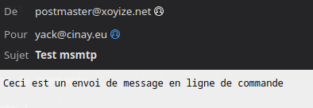{:width="400"}  

Dans le fichier message.txt, nous avons fourni de: (l'adresse électronique de la personne qui envoie le courriel) et à: (l'adresse électronique de destination). Nous avons ensuite demandé à msmtp de réutiliser ces valeurs pour définir l'enveloppe de l'email avec `--read-envelope-from` et `--read-cepients`.

Et les autres paramètres ?

* `--auth=on` parce que nous voulons authentifier avec le serveur.
* `--tls=on` parce que nous voulons nous assurer que la communication avec le serveur est cryptée.
* `--host` et `--port` indique où trouver le serveur.
* `--user` est évidemment votre nom d'utilisateur.

**Écrire un fichier de configuration**

msmtp prend en charge deux emplacements : `~/.msmtprc` et `~/.config/msmtp/config`, nous utiliserons `~/.msmtprc` 

ATTENTION: Si serveur de messagerie utilise une base LDAP, seuls les utilisateurs de cette base seront valides pour la configuration
{: .prompt-warning }


Créer la configuration

```shell
cat << 'EOF' > ~/.msmtprc
defaults
auth on
tls on
tls_trust_file /etc/maddy/certs/mx1.rnmkcy.eu/fullchain.pem
logfile ~/.msmtp.log
#
account postmaster_maddy
host mx1.rnmkcy.eu
port 587
from postmaster@rnmkcy.eu
user postmaster@rnmkcy.eu
password Mot_de_Passe_postmaster
#
account rnmkcy_eu
host mx1.rnmkcy.eu
port 587
from leno@rnmkcy.eu
user leno@rnmkcy.eu
password Mot_de_Passe_leno
#
account yann_rnmkcy_eu
host mx1.rnmkcy.eu
port 587
from yann@rnmkcy.eu
user yann@rnmkcy.eu
password Mot_de_Passe_yann
#
account default : postmaster_maddy
EOF
```

Le mot de passe postmaster est ajouté au fichier `~/.msmtprc`

Modifier les droits du fichier

    chmod 600 ~/.msmtprc

Envoyer un message

    msmtp -t < message.txt

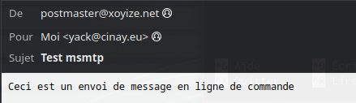{:width="400"}  

Envoi/

    nano sample/

``/
From: postmaster@rnmkcy.eu
To: yack@cinay.eu
Subject: ICI, le sujet du message
Mime-Version: 1.0
Content-Type: text/; charset=utf-8

/>
  <head>Entête du message</head>
  <body>
    <h2>Titre du message</h2>
    <p>Contenu du message</p> 
  </body>
</>
```

Envoi

    cat sample/ | msmtp yack@cinay.eu

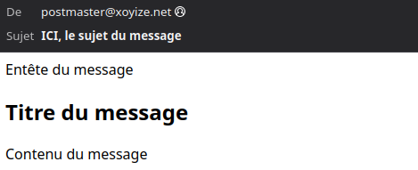{:width="400"}  

Ici, la commande `cat` affiche le contenu du fichier sample/, puis nous sommes en train de passer le résultat à la commande `msmtp`.

Nous utilisons `Content-Type` comme en-tête `MIME` afin que le fichier soit traité comme un fichier HTML. Nous devons noter que nous devons spécifier les informations d'en-tête d'email dans le fichier HTML pour le traiter avec msmtp.

**Les tests en une ligne de commande**

```bash
echo -e "Subject: Test messagerie postmaster\r\nMIME-Version: 1.0\nContent-Type: text/; charset=utf-8\r\n\r\n \
/><head>Serveur maddy </head><body> \
<h2>Messagerie</h2><p>Test msmtp en mode ligne de commande </p></body>" |msmtp --from=postmaster@rnmkcy.eu -t yanfi@yanfi.net
```

Le fichier `.msmtp.log`

```
juin 03 11:20:37 host=mx1.rnmkcy.eu tls=on auth=on user=postmaster@rnmkcy.eu from=postmaster@rnmkcy.eu recipients=yack@cinay.eu mailsize=319 smtpstatus=250 smtpmsg='250 2.0.0 OK: queued' exitcode=EX_OK
```

En utilisant les autres utilisateurs
```bash
echo -e "Subject: Test messagerie\r\nMIME-Version: 1.0\nContent-Type: text/; charset=utf-8\r\n\r\n \
/><head>Test envoi</head><body> \
<h2>Envoi message</h2><p>Test depuis yann@rnmkcy.eu...</p></body>" \
|msmtp -a yann_rnmkcy_eu --from=leno@rnmkcy.eu -t yack@cinay.eu

echo -e "Subject: Test messagerie\r\nMIME-Version: 1.0\nContent-Type: text/; charset=utf-8\r\n\r\n \
/><head>Serveur maddy </head><body> \
<h2>Messagerie</h2><p>Test msmtp en mode ligne de commande </p></body>" |msmtp --from=yann@rnmkcy.eu -t yanfi@yanfi.net

```

Le fichier `.msmtp.log`

```
juin 03 11:25:13 host=mx1.rnmkcy.eu tls=on auth=on user=yann@rnmkcy.eu from=yann@rnmkcy.eu recipients=yack@cinay.eu mailsize=307 smtpstatus=250 smtpmsg='250 2.0.0 OK: queued' exitcode=EX_OK
```

`Au final le fichier de configuration .msmtprc ne contiendra que l'utilisateur postmaster@rnmkcy.eu`{: .prompt-info }


### Conclusion

`Le serveur de messagerie IMAP/SMTP rnmkcy.eu est entièrement opérationnel`{: .prompt-tip }
