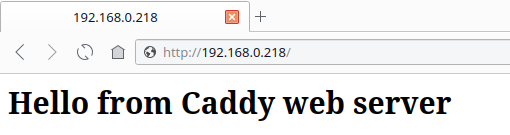
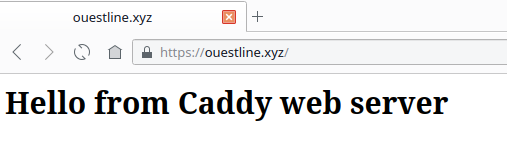
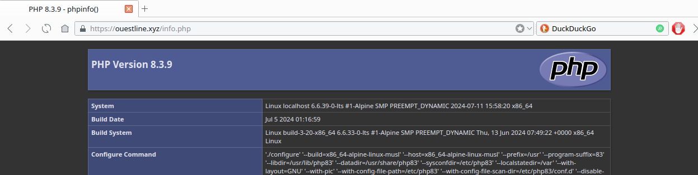

+++
title = 'Alpine Linux - serveur web Caddy'
date = 2024-11-14 00:00:00 +0100
categories = serveur
+++
*Caddy est un serveur web écrit en Go, open source et disponible avec HTTPS automatiquement*

## Caddy

{:height="50"}  {:height="50"}  
[Guide d'utilisation d'un serveur Caddy sous Linux](https://ettayeb.fr/guide-dutilisation-dun-serveur-caddy-sous-linux/)

### Prérequis

Pour installer Caddy sous Alpine Linux, il y a quelques paquets que vous devez installer - nss-tools, setcap, wget et tar.

```bash
sudo apk add libcap nss-tools  # wget tar sont normalement installés par défaut
```

### Binaire caddy

Rendez-vous sur la [page des releases Caddy](https://github.com/caddyserver/caddy/releases), qui propose des binaires pour une variété d'architectures de processeurs.  
Pour déterminer l'architecture du processeur de votre système, exécutez la commande suivante :

```bash
uname -m  # --> x86_64
```

Le plupart du temps, les serveurs et les systèmes de bureau fonctionnent avec des processeurs Intel 64 bits. La sortie de la commande ci-dessus sur de tels systèmes serait x86_64, qui est également connu sous le nom de "amd64".  
Vous devez donc télécharger le fichier `.tar.gz` pour Linux amd64 

```bash
wget https://github.com/caddyserver/caddy/releases/download/v2.8.4/caddy_2.8.4_linux_amd64.tar.gz
```

Une fois que vous avez téléchargé le fichier, décompressez le binaire caddy dans le répertoire /usr/local/bin en exécutant 

```bash
sudo tar -C /usr/local/bin/ -xf caddy_2.8.4_linux_amd64.tar.gz caddy
```

Pour confirmer que le binaire a été installé, exécutez la commande suivante 

    caddy version 

Vous devriez voir sur votre terminal le résultat suivant  
`v2.8.4 h1:q3pe0wpBj1OcHFZ3n/1nl4V4bxBrYoSoab7rL9BMYNk=`

### Utilisateur caddy

**Configuration des comptes d'utilisateurs et des répertoires**  
Les serveurs Web tels que Caddy sont généralement exposés sur l'Internet. C'est une bonne pratique que de lancer tout logiciel qui est exposé sur Internet en tant qu'utilisateur restreint.

Par conséquent, nous allons configurer un utilisateur restreint system nommé **caddy** avec le répertoire personnel  `/etc/caddy` 

    sudo adduser -s /bin/false -h /etc/caddy -S caddy
    sudo addgroup caddy

Dans le dossier d'accueil, Caddy stocke la configuration dans le répertoire .config, et les certificats dans le répertoire `.local` 

    sudo mkdir -p /etc/caddy/.config /etc/caddy/.local

Nous aurons également besoin d'un répertoire dans lequel nous pourrons dire à Caddy de stocker les logs, créer un répertoire `/var/log/caddy` 

    sudo mkdir -p /var/log/caddy

Modifier la propriété de ces répertoires au profit de l'utilisateur caddy 

    sudo chown -R caddy: /etc/caddy /var/log/caddy

Lorsque vous exécutez un logiciel en tant qu'utilisateur non root, Linux interdit à ces processus d'écouter des numéros de port inférieurs à 1024. Pour contourner cette restriction et exécuter Caddy en toute sécurité en tant qu'utilisateur non root, ajoutez la capacité `cap_net_bind_service` au binaire caddy :

```bash
# inexistant sur alpine
sudo setcap cap_net_bind_service+ep /usr/local/bin/caddy
```

### Service caddy

Créer le service caddy `/etc/init.d/caddy`

```
#!/sbin/openrc-run
supervisor=supervise-daemon

name="Caddy web server"
description="Fast, multi-platform web server with automatic HTTPS"
description_checkconfig="Check configuration"
description_reload="Reload configuration without downtime"

: ${caddy_opts:="--config /etc/caddy/Caddyfile --adapter caddyfile"}

command=/usr/local/bin/caddy
command_args="run $caddy_opts"
command_user=caddy:caddy
extra_commands="checkconfig"
extra_started_commands="reload"
capabilities="^cap_net_bind_service"

depend() {
	need net localmount
	after firewall
}

checkconfig() {
	ebegin "Checking configuration for $name"
	su ${command_user%:*} -s /bin/sh -c "$command validate $caddy_opts"
	eend $?
}

reload() {
	ebegin "Reloading $name"
	su ${command_user%:*} -s /bin/sh -c "$command reload $caddy_opts"
	eend $?
}

stop_pre() {
	if [ "$RC_CMD" = restart ]; then
		checkconfig || return $?
	fi
}
```

Le rendre exécutable

    chmod +x /etc/init.d/caddy

### Démarrage automatique

Maintenant que nous avons créé l'utilisateur et les répertoires, nous allons configurer Caddy comme un service du système. Le serveur web Caddy démarrera automatiquement lorsque vous démarrez (ou redémarrez) votre système.[How to enable and start services on Alpine Linux](https://www.cyberciti.biz/faq/how-to-enable-and-start-services-on-alpine-linux/)

ajouter/activer le service caddy au démarrage

```bash
# syntaxe commande
rc-update add caddy
# OU
rc-update add caddy default
```

Renvoie le résultat suivant

```
* service caddy added to runlevel default
```

Démarrer le service caddy

```bash
rc-service caddy start
# OU
service caddy start
```

Renvoie le résultat suivant

```
* Starting Caddy web server ...    [ ok ]
```

### Site web

Création d'un Caddyfile, qui indique à Caddy ce qu'il doit faire lorsqu'une requête HTTP arrive. 

    sudo nano /etc/caddy/Caddyfile

entrez le contenu suivant :

```json
http:// {
    root * /var/lib/caddy/
    encode gzip
    file_server
}
```

Ceci demandera à Caddy de mettre à disposition les fichiers présents dans son répertoire de travail actuel, et de compresser les corps des réponses HTTP avec l'algorithme gzip. 

Tester caddy

```shell
sudo mkdir -p /var/caddy/html
sudo -s 
echo "<h1>Hello from Caddy web server</h1>" > /var/caddy/html/index.html
```

Après avoir fait ces modifications, exécutez la commande suivante pour démarrer Caddy

    sudo service caddy reload

Caddy http, lien <http://192.168.0.218>   


Après avoir effectué les modifications dans le DNS, modifiez le fichier `/etc/caddy/Caddyfile`

```json
ouestline.xyz {
    root * /var/lib/caddy/html/
    encode gzip
    file_server
}
```

Reformater 

    sudo caddy fmt --overwrite /etc/caddy/Caddyfile

Recharger caddy

    sudo service caddy reload

Caddy https, lien <https://ouestline.xyz>   


### Activer PHP dans Caddy

Installer php 8.3

```shell
sudo apk add php83 php83-fpm
```

Après avoir installé PHP, éditez le fichier de configuration PHP-FPM et changez l’utilisateur et le groupe par défaut avec caddy

    sudo nano /etc/php83/php-fpm.d//www.conf

Recherchez et remplacez le nom d’utilisateur et de groupe de www-data par caddy :

```
user = caddy
group = caddy
listen.owner = caddy
listen.group = caddy
```

Créez le service PHP-FPM pour appliquer les modifications

```shell
sudo rc-update add php-fpm83
```

`* service php-fpm83 added to runlevel default`

Démarrez le service PHP-FPM pour appliquer les modifications

```shell
sudo service php-fpm83 start
service php-fpm83 status
```

`* status: started`

Modifier fichier de configuration d’hôte virtuel Caddy `/etc/caddy/Caddyfile`

```
ouestline.xyz {
        root * /var/caddy/html/
        encode gzip
        php_fastcgi 127.0.0.1:9000
}
```

Redémarrer le service Caddy pour appliquer les modifications :

    sudo service caddy restart

Ensuite, créer un fichier PHP de test pour Caddy

    sudo nano /var/caddy/html/info.php

Ajoutez la ligne suivante

```php
<?php phpinfo(); ?>
```

Tester le lien <https://ouestline.xyz/info.php>  


## Compléments

### Héberger plusieurs sites web

Généralement, vous souhaitez répondre aux requêtes de plusieurs domaines à partir d'un même serveur. Ce concept est parfois appelé "Virtual hosting". Vous pouvez ajouter des blocs supplémentaires à votre fichier Caddyfile pour réaliser de l'hébergement virtuel.

Par exemple, vous avez trois domaines, exemple1.com, exemple2.com et exemple3.com, où chaque domaine doit servir un contenu différent à l'utilisateur. La première étape consiste à créer des répertoires pour ces domaines, tels que /var/caddy/exemple1.com, /var/caddy/exemple2.com et /var/caddy/exemple3.com, et à stocker les fichiers requis dans ces répertoires.

Une fois le contenu en place, modifiez votre fichier Caddy de la manière suivante :

```yaml
{
    email <YOUR EMAIL ADDRESS HERE>
}

example1.com {
    root * /var/caddy/example1.com
    encode gzip
    file_server
}

example2.com {
    root * /var/caddy/example2.com
    encode gzip
    file_server
}

example3.com {
    root * /var/caddy/example3.com
    encode gzip
    file_server
}
```

Après avoir effectué les modifications ci-dessus, rechargez la configuration de Caddy en exécutant :

    sudo service caddy reload

Caddy configurera HTTPS sur ces trois domaines et distribuera le contenu à partir des répertoires respectifs.

Si, pour une raison quelconque, vous souhaitez que les sites soient uniquement en HTTP, vous pouvez ajouter un http:// devant le nom de chaque site, comme suit :

```yaml
http://example1.com {
    # Caddyfile directives for example1.com
}
```

### Journalisation des requêtes

Par défaut, Caddy ne journalise pas les demandes. Toutefois, vous pouvez configurer Caddy pour qu'il journalise les requêtes grâce à la directive "log". Par défaut, Caddy stocke ses journaux sous forme de lignes de JSON, bien que d'autres formats soient également disponibles.

Comme nous l'avons vu dans les sections précédentes, le fichier Caddy est composé de sections dans lesquelles vous ajoutez la configuration pour chaque site Web. Pour configurer la journalisation, modifiez le fichier Caddy de sorte que chaque bloc ressemble à ceci :

```yaml
<YOUR DOMAIN NAME HERE, OR SPECIFY "http://"> {
    encode gzip
    file_server
    log {
        output file /var/log/caddy/access.log
    }
}
```

Une fois que vous avez enregistré le fichier Caddy, rechargez la configuration avec :

    sudo service caddy reload

Maintenant, visitez le site Web dans un navigateur, afin de générer quelques entrées de journal. Exécutez la commande suivante pour afficher les journaux :

    sudo cat /var/log/caddy/access.log

