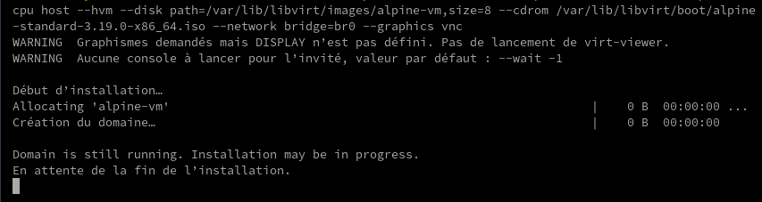
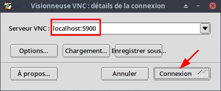
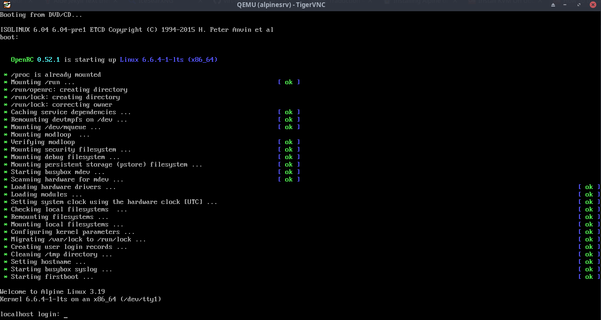
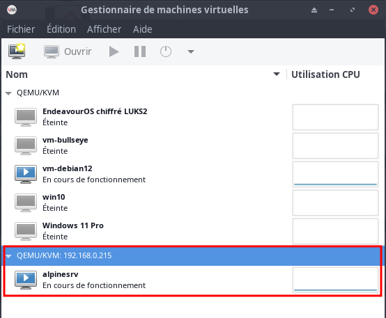
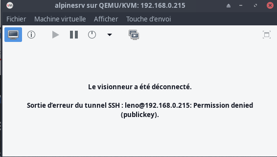
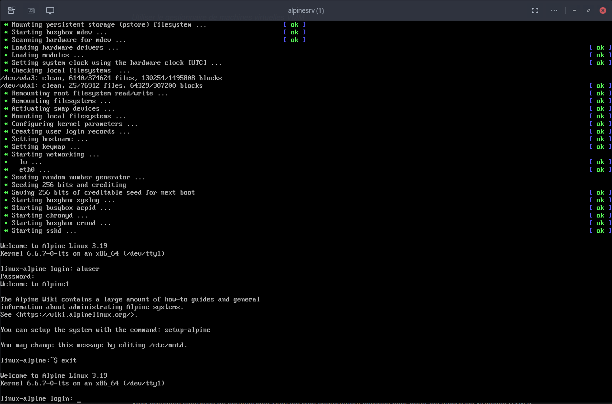

+++
title = 'Installer KVM (qemu libvirt) sur un serveur'
date = 2024-11-14 00:00:00 +0100
categories = ['virtuel']
+++
*Avec KVM, vous pouvez facilement configurer un environnement de virtualisation sur une machine Linux et héberger une large gamme de systèmes d'exploitation invités, notamment Linux, Windows, BSD, Mac OS et bien d'autres.*


{:height=30}  {:height=30}

## KVM sur serveur

* Un serveur de type Debian avec un [pont (bridge)](/posts/Debian_12_Serveur_Lenovo_Thinkcentre_M700_Tiny_M.2_SSD_500Go/#bridge-ip-v4-v6-statiques) installé 
* Serveur avec prise en charge virtualisation matérielle


### Installation KVM sur serveur debian

{:height="50"}  

Pour installer KVM et tous les autres composants requis afin de configurer un environnement de virtualisation KVM sur votre serveur

    sudo apt install qemu-kvm libvirt-daemon-system libvirt-clients bridge-utils virtinst

Ici,

*    **qemu-kvm** - Métapaquet QEMU pour le support KVM (c'est-à-dire virtualisation complète QEMU sur matériel x86),
*    **libvirt-daemon-system** - Fichiers de configuration du démon Libvirt,
*    **libvirt-clients** - des programmes pour la bibliothèque libvirt,
*    **bridge-utils** - des utilitaires de configuration du pont Ethernet Linux,
*    **virtinst** - des programmes pour créer et cloner des machines virtuelles.

Une fois KVM installé, démarrez le service libvirtd (si non démarré) :

    sudo systemctl enable libvirtd
    sudo systemctl start libvirtd

Vérifiez l'état du libvirtd service avec la commande :

    systemctl status libvirtd

Sortie :

```
● libvirtd.service - Virtualization daemon
     Loaded: loaded (/lib/systemd/system/libvirtd.service; enabled; preset: enabled)
     Active: active (running) since Sat 2023-12-16 13:35:21 CET; 8s ago
TriggeredBy: ● libvirtd.socket
             ● libvirtd-admin.socket
             ● libvirtd-ro.socket
       Docs: man:libvirtd(8)
             https://libvirt.org
   Main PID: 103946 (libvirtd)
      Tasks: 19 (limit: 32768)
     Memory: 15.4M
        CPU: 239ms
     CGroup: /system.slice/libvirtd.service
             └─103946 /usr/sbin/libvirtd --timeout 120
```

*le service libvertd est activé et démarré !*

Ajoutez maintenant votre utilisateur actuel aux groupes kvm et libvirt afin qu'il puisse créer et gérer des VM à l'aide de virsh utilitaire de ligne de commande ou Virt-manager interface graphique.

    sudo usermod -aG kvm $USER
    sudo usermod -aG libvirt $USER

Vous pouvez également utiliser les commandes suivantes pour ajouter l'utilisateur actuel aux groupes kvm et libvirt.

    sudo usermod -a -G kvm $(whoami)
    sudo usermod -a -G libvirt $(whoami)

### Pont réseau (bridge)  

Un réseau ponté partage la véritable interface réseau de l'ordinateur hôte avec d'autres machines virtuelles pour se connecter au réseau extérieur. Par conséquent, chaque VM peut se lier directement à n’importe quelle adresse IPv4 ou IPv6 disponible, tout comme un ordinateur physique.

Nous allons faire en sorte que toutes les machines virtuelles utilisent la même série d'adresses IP que celle utilisée par le système hôte.

Le pont installé par défaut sur le serveur

    sudo brctl show br0

```
bridge name	bridge id		STP enabled	interfaces
br0		8000.002324c90686	no		eno1
```

**Ajouter un réseau de pont à KVM**

Configurer KVM pour utiliser ce pont, créez un fichier XML appelé `host-bridge.xml` :

    nano host-bridge.xml

Ajoutez les lignes suivantes :

```xml
<network>
  <name>host-bridge</name>
  <forward mode="bridge"/>
  <bridge name="br0"/>
</network>
```

Exécutez les commandes suivantes **en mode utilisateur** pour démarrer le pont nouvellement créé et en faire le pont par défaut pour les VM :

```bash
virsh net-define host-bridge.xml      # Réseau host-bridge défini depuis host-bridge.xml
virsh net-start host-bridge           # Réseau host-bridge démarré
virsh net-autostart host-bridge       # Réseau host-bridge marqué en démarrage automatique
```

### Vérification réseau

Pour vérifier si le pont hôte KVM est actif et démarré 

    virsh net-list --all

Sortie 

```
 Nom           État    Démarrage automatique   Persistent
-----------------------------------------------------------
 host-bridge   actif   Oui                     Oui
```

À ce stade, on dispose d'une installation KVM fonctionnelle sur le serveur avec un réseau de pont KVM configuré.

## Création machines virtuelles KVM avec la commande virsh

Nous pouvons utiliser l'utilitaire de ligne de commande virsh pour créer et gérer des machines virtuelles. La commande virsh est utilisée pour créer, lister, mettre en pause, redémarrer, arrêter et supprimer des machines virtuelles à partir de la ligne de commande.

Par défaut, les fichiers de la machine virtuelle et autres fichiers associés sont stockés sous `/var/lib/libvirt/`  
Le chemin par défaut pour stocker les images ISO est `/var/lib/libvirt/boot/`  
Nous pouvons bien sûr modifier ces emplacements lors de l'installation d'une nouvelle VM.

### Lister toutes les machines virtuelles

Tout d’abord, vérifions s’il existe des machines virtuelles.  
Pour afficher la liste de toutes les machines virtuelles disponibles 

    sudo virsh liste --all

Sortie 

```
 ID   Nom   État
------------------
```

Comme vous pouvez le constater, il n’existe aucune machine virtuelle existante.

### Télécharger des images ISO

Avant de créer notre première VM, nous devons télécharger l'image ISO dans le répertoire `/var/lib/libvirt/boot/` 

```
sudo -s
cd /var/lib/libvirt/boot/
wget https://dl-cdn.alpinelinux.org/alpine/v3.19/releases/x86_64/alpine-standard-3.19.0-x86_64.iso
wget https://dl-cdn.alpinelinux.org/alpine/v3.19/releases/x86_64/alpine-standard-3.19.0-x86_64.iso.sha256
# Vérifier
sha256sum alpine-standard-3.19.0-x86_64.iso < alpine-standard-3.19.0-x86_64.iso.sha256 
```

### Créer des machines virtuelles KVM

Utilisez la commande `virt-install --osinfo list` pour obtenir la liste des variantes de systèmes d'exploitation acceptées. Voir `osinfo-query os` pour plus de résultats.

    sudo virt-install --osinfo list |more

Créons une machine virtuelle Alpine avec 2 Go de RAM, 1 cœur de processeur et 8 Go de disque dur.

```bash
sudo virt-install --os-variant="alpinelinux3.17" --name alpinesrv --ram=2048 --vcpus=1 --cpu host --hvm --disk path=/var/lib/libvirt/images/alpine-vm,size=8 --cdrom /var/lib/libvirt/boot/alpine-standard-3.19.0-x86_64.iso --network bridge=br0 --graphics vnc
```

Décomposons la commande ci-dessus et voyons ce que fait chaque option.

*    `--os-variant="alpinelinux3.17"` : Obligatoire , liste disponible `virt-install --osinfo list`
*    `--name alpinesrv`  : Le nom de la machine virtuelle
*    `--ram=2048` : alloue 2 Go de RAM à la VM.
*     `--vcpus=1` : indique le nombre de cœurs de processeur dans la VM.
*     `--cpu host` : optimise les propriétés du processeur de la machine virtuelle en exposant la configuration du processeur de l'hôte à l'invité.
*     `--hvm` : Demandez la virtualisation matérielle complète.
*     `--disk path=/var/lib/libvirt/images/alpine-vm,size=8` : L'emplacement où enregistrer le disque dur de la VM et sa taille. Dans ce cas, j'ai alloué une taille de disque dur de 8 Go.
*     `--cdrom /var/lib/libvirt/boot/alpine-standard-3.19.0-x86_64.iso` : L'emplacement où vous avez l'image ISO réelle du programme d'installation d'Alpine.
*     `--network bridge=br0` : demandez à la VM d'utiliser le réseau de pont. Si vous n'avez pas configuré le réseau de pont, ignorez ce paramètre.
*     `--graphics vnc` : autorise l'accès VNC à la VM à partir d'un client distant.

Exemple de sortie :

```
WARNING  Graphismes demandés mais DISPLAY n’est pas défini. Pas de lancement de virt-viewer.
WARNING  Aucune console à lancer pour l’invité, valeur par défaut : --wait -1

Début d’installation…
Allocating 'alpine-vm'                                                           |    0 B  00:00:00 ... 
Création du domaine…                                                             |    0 B  00:00:00     

Domain is still running. Installation may be in progress.
En attente de la fin de l’installation.
```

Créer une machine virtuelle KVM à partir de la ligne de commande


Ce message continuera à s'afficher jusqu'à ce que vous vous connectiez à la VM à partir d'un système distant via n'importe quelle application VNC et que vous complétiez l'installation du système d'exploitation.

Étant donné que notre système hôte KVM (serveur ) ne dispose pas d'interface graphique, nous ne pouvons pas poursuivre l'installation du système d'exploitation invité à partir du système hôte lui-même. Je vais donc utiliser une machine de rechange dotée d'une interface graphique pour terminer l'installation du système d'exploitation invité à l'aide d'un client VNC.

`Nous en avons terminé avec le serveur ici. Les étapes suivantes doivent être effectuées sur un système client disposant d'une interface graphique.`{: .prompt-warning }

### Accés aux machines virtuelles KVM distantes via le client VNC

Sur un autre système linux doté d'un environnement de bureau graphique avec le client de bureau à distance TigerVNC installé.

Ouvrez une nouvelle fenêtre de terminal et connectez-vous en SSH au système hôte KVM :

    ssh leno@192.168.0.215 -p 55215 -i /home/yann/.ssh/lenovo-ed25519

Ici,

*  leno est le nom de l'utilisateur dans l'hôte KVM (serveur debian)
*  192.168.0.215 est l'adresse IP de l'hôte KVM.
*  `-p` pour un port différent de 22 et `-i` pour la clé

Recherchez le port VNC utilisé par la VM en cours d'exécution  

    sudo virsh dumpxml alpinesrv | grepvnc

Remplacez "alpinesrv" avec le nom de votre VM.

Sortie :

```xml
<graphics type='vnc' port='5900' autoport='yes' listen='127.0.0.1'>
```

Le numéro du port VNC est 5900.

Maintenant déconnectez-vous de la session SSH de l'hôte KVM et exécutez le port SSH suivant commande de transfert depuis le terminal de votre système local 

    ssh -L 5900:127.0.0.1:5900 leno@192.168.0.215 -p 55215 -i /home/yann/.ssh/lenovo-ed25519

Lancez l'application client TigerVNC , saisir "localhost:5900" dans la barre d'adresse et enfin appuyez sur Connexion    
{:width="300"}

L'application TigerVNC  montre la fenêtre du système d'exploitation virtuelle en cours sur le serveur debian  


### Accés aux machines virtuelles KVM distantes via virt-manager

*Utiliser le gestionnaire de machines virtuelles VMM* 

Tester, ouvrir une fenêtre de commande (Alt F2) et saisir :  

    virt-manager -c 'qemu+ssh://leno@192.168.0.215:55215/system?keyfile=/home/yann/.ssh/lenovo-ed25519'

et cliquer sur **lancer**   



### Accès console des machines virtuelles KVM distantes via virt-viewer

Si l'on tente une ouverure de la console depuis virt-manager , on a l'erreur suivante  


Il faut utiliser `virt-viewer` (à installer : `yay -S virt-viewer`)  
Créer une configuration ssh client `~/.ssh/config` pour accéder au serveur lenovo qui héberge KVM  

```
Host lenovo
    Hostname 192.168.0.215
    User leno
    IdentityFile ~/.ssh/lenovo-ed25519
    port 55215
```

Ouvrir le viewer virt , Alt+F2  


La console est lancée...  
{:width="600"}

## Gérer les machines virtuelles KVM à l'aide de la commande virsh

Voici quelques exemples de commandes virsh les plus couramment utilisées pour gérer les machines virtuelles KVM à partir de la ligne de commande à l'aide de la commande virsh.

###  Répertorier les VM en cours d'exécution

Exécutez la commande virsh list pour afficher la liste des VM en cours d'exécution :

    sudo virsh list

Exemple de sortie :

```
 Id   Name           State
------------------------------
 2    Ubuntu-22.04   running
```

Comme vous pouvez le voir, la machine virtuelle Ubuntu 22.04 est actuellement en cours d'exécution et son ID est 2.

Pour afficher toutes les machines virtuelles (en cours d’exécution et arrêtées), utilisez l’indicateur --all.

    sudo virsh list --all

### Démarrer des VM

Pour démarrer une VM, la commande suivante peut être utilisée :

    sudo virsh start VM_NAME

Exemple:

    sudo virsh start Ubuntu-22.04

Vous pouvez également utiliser l'ID de la VM pour la démarrer :

    sudo virsh start 2

### Redémarrer les machines virtuelles

Pour redémarrer une VM en cours d'exécution, procédez :

    sudo virsh reboot Ubuntu-22.04

Ou,

    sudo reboot 2

### Suspendre les VM

Pour suspendre une VM en cours d'exécution, procédez :

    sudo suspend Ubuntu-22.04

Ou,

    sudo suspend 2

### Reprendre les VM

Pour reprendre une VM suspendue, procédez :

    sudo virsh resume Ubuntu-22.04

Ou,

    sudo resume 2

### Arrêter les machines virtuelles

Pour mettre hors tension une VM en cours d'exécution, procédez :

    sudo virsh shutdown Ubuntu-22.04

Ou,

    sudo shutdown 2

### Supprimer des machines virtuelles

Pour supprimer complètement une VM, procédez :

    sudo virsh undefine Ubuntu-22.04
    sudo virsh destroy Ubuntu-22.04

Virsh possède de nombreuses commandes et options. Pour les connaître tous, reportez-vous à la virsh section d'aide :

    virsh --help

##  Liens

* [Manage KVM Virtual Machines Using Cockpit Web Console](https://ostechnix.com/manage-kvm-virtual-machines-using-cockpit-web-console/)
* [How To Manage KVM Virtual Machines With Virt-Manager](https://ostechnix.com/how-to-manage-kvm-virtual-machines-with-virt-manager/)
* [How To Enable Virsh Console Access For KVM Guests](https://ostechnix.com/how-to-enable-virsh-console-access-for-kvm-guests/)
* [How To Manage KVM Virtual Machines With Virt-Manager](https://ostechnix.com/how-to-manage-kvm-virtual-machines-with-virt-manager)
* [Create A KVM Virtual Machine Using Qcow2 Image In Linux](https://ostechnix.com/create-a-kvm-virtual-machine-using-qcow2-image-in-linux)
* [How To Migrate Virtualbox VMs Into KVM VMs In Linux](https://ostechnix.com/how-to-migrate-virtualbox-vms-into-kvm-vms-in-linux)
* [How To Use Vagrant With Libvirt KVM Provider](https://ostechnix.com/how-to-use-vagrant-with-libvirt-kvm-provider)
* [Enable UEFI Support For KVM Virtual Machines In Linux](https://ostechnix.com/enable-uefi-support-for-kvm-virtual-machines-in-linux)
* [How To Enable Nested Virtualization In KVM In Linux](https://ostechnix.com/how-to-enable-nested-virtualization-in-kvm-in-linux)
* [Display Virtualization Systems Stats With Virt-top In Linux](https://ostechnix.com/display-virtualization-systems-stats-with-virt-top-in-linux)
* [How To Find The IP Address Of A KVM Virtual Machine](https://ostechnix.com/how-to-find-the-ip-address-of-a-kvm-virtual-machine)
* [How To Rename KVM Guest Virtual Machine](https://ostechnix.com/how-to-rename-kvm-guest-virtual-machine)
* [Access And Modify Virtual Machine Disk Images With Libguestfs](https://ostechnix.com/access-and-modify-virtual-machine-disk-images-with-libguestfs)
* [Quickly Build Virtual Machine Images With Virt-builder](https://ostechnix.com/quickly-build-virtual-machine-images-with-virt-builder)
* [How To Rescue Virtual Machines With Virt-rescue](https://ostechnix.com/how-to-rescue-virtual-machines-with-virt-rescue)
* [How To Extend KVM Virtual Machine Disk Size In Linux](https://ostechnix.com/how-to-extend-kvm-virtual-machine-disk-size-in-linux)
* [Setup A Shared Folder Between KVM Host And Guest](https://ostechnix.com/setup-a-shared-folder-between-kvm-host-and-guest)

* [How to Manage KVM Virtual Environment using Command Line Tools in Linux](https://www.geeksforgeeks.org/how-to-manage-kvm-virtual-environment-using-command-line-tools-in-linux/)
