+++
title = 'Lenovo KVM - Alpine Linux vm-ouestline'
date = 2024-11-14 00:00:00 +0100
categories = ['virtuel']
+++
*Alpine Linux est une distribution Linux ultra-légère...*

{:width="300"}  

## Alpine Linux

*Création machine virtuelle Alpine  de type KVM avec 2 Go de RAM, 1 cœur de processeur et 5 Go de disque dur.*

### Créer vm-ouestline sur un serveur

[Les dernières images Alpine Linux](https://alpinelinux.org/downloads/)  

Création d'une image virtuelle **vm-ouestline** sous le serveur Lenovo rnmkcy.eu  
On se connecte sur le serveur Lenovo en SSH 

    ssh leno@192.168.0.215 -p 55215 -i /home/yann/.ssh/lenovo-ed25519

puis on exécute la commande suivante pour créer  une machine virtuelle Alpine avec 2 Go de RAM, 1 cœur de processeur et 5 Go de disque dur

```shell
sudo virt-install \
--osinfo alpinelinux3.17 \
--name vm-ouestline \
--memory 2048 \
--vcpus 1 \
--cpu host \
--hvm \
--disk path=/srv/kvm/libvirt/images/vm-ouestline.qcow2,format=qcow2,size=5 \
--cdrom /srv/kvm/libvirt/boot/alpine-standard-3.20.3-x86_64.iso \
--network bridge=virbr1 \
--graphics vnc  
```

Note: La dernière version Alpine Linux est alpinelinux3.20  au 10/07/2024 mais KVM ne connait que alpinelinux3.17 (`sudo virt-install --osinfo list |grep alpine`)

Après exécution dans un terminal de la commande ci dessus, on arrive sur l'écran suivant  
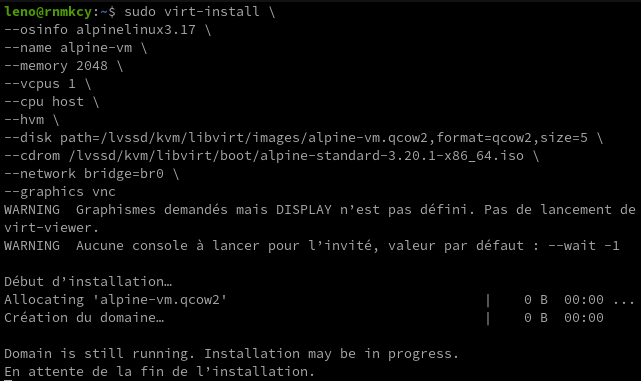  

### Configurer vm-ouestline

Le serveur Lenovo n'a pas d'affichage, il faut créer un tunnel ssh depuis un poste client

    ssh -L 5900:127.0.0.1:5900 leno@192.168.0.215 -p 55215 -i /home/yann/.ssh/lenovo-ed25519

Puis lancer de ce même poste un client VNC  
{:width="300"}  
la console s'affiche   
  

Une fois l'image ISO lancée, on arrive à un invite de connexion.   
Indiquez `root` comme nom d'utilisateur, aucun mot de passe ne vous sera demandé à cette étape.   

Le système est utilisable, mais on veut l'installer, ce qui passe par la commande suivante (clavier qwerty)

```
setup-alpine # saisir setup)qlpine
```

Une suite de questions :  
  
mot de passe root (rtyuiop)  
  
APK mirror (f) ,patienter ...  
  
Utilisateur **alouest**  

Relever l'adresse ip allouée : `ip a` --> 192.168.100.178  
Puis redémarrer : `reboot`  
La fenêtre vnc se ferme  

Vous devez utiliser l'utilisateur pour vous connecter via SSH (impossible avec le compte root)  
Sur un terminal linux du serveur Lenovo

    ssh alouest@192.168.100.178

Une fois connecté ,vous pouvez accéder au "root" de manière classique avec la commande :

    su -

Mise à jour

```shell
apk update
apk upgrade 
# Vous pouvez fusionner les deux lignes avec 
apk -U upgrade
```

Editeur nano (Vous pouvez aussi opter pour vi qui est nativement présent sur le système)

    apk add nano

### Réseau statique

[How to configure static IP address on Alpine Linux](https://www.cyberciti.biz/faq/how-to-configure-static-ip-address-on-alpine-linux/)

IPv6 est activé par défaut : `cat /etc/modules |grep ipv6`

Configuration réseau statique ipv4 et ipv6, fichier `/etc/network/interfaces`

    /etc/network/interfaces

```shell
auto lo
iface lo inet loopback

auto eth0
iface eth0 inet static
        address 192.168.100.25/24
        gateway 192.168.100.1

iface eth0 inet6 static
        address 2a01:e0a:9c8:2081::2/64
        netmask 64
        gateway fe80::8e97:eaff:fe39:66d6
        pre-up echo 2 > /proc/sys/net/ipv6/conf/eth0/accept_ra
```

Fichier de résolution dns

    /etc/resolv.conf

```
search network-nat
nameserver 192.168.100.1
```

ATTENTION , pour l'adresse ipv6 statique il faut renseigner le NextHop de la box free avec l'adresse inet6 de l'interface réseau eth0 : `ip a |grep "inet6 fe"`  &rarr; `fe80::5054:ff:fe6c:b2fd` 
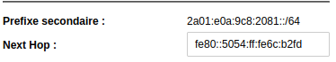  
{: .prompt-warning }

Les modifications apportées à /etc/network/interfaces peuvent être activées en exécutant

```shell
rc-service networking restart  # par défaut
/etc/init.d/networking restart # alternative
service networking restart     # autre alternative
```

Ou redémarrer la machine virtuelle **vm-ouestline** : `reboot`

Connexion ssh sur la nouvelle adresse IP 

    ssh alouest@192.168.100.25

Le réseau : `ip a`

```
1: lo: <LOOPBACK,UP,LOWER_UP> mtu 65536 qdisc noqueue state UNKNOWN qlen 1000
    link/loopback 00:00:00:00:00:00 brd 00:00:00:00:00:00
    inet 127.0.0.1/8 scope host lo
       valid_lft forever preferred_lft forever
    inet6 ::1/128 scope host 
       valid_lft forever preferred_lft forever
2: eth0: <BROADCAST,MULTICAST,UP,LOWER_UP> mtu 1500 qdisc pfifo_fast state UP qlen 1000
    link/ether 52:54:00:93:7f:98 brd ff:ff:ff:ff:ff:ff
    inet 192.168.100.25/24 scope global eth0
       valid_lft forever preferred_lft forever
    inet6 2a01:e0a:9c8:2081::1/64 scope global 
       valid_lft forever preferred_lft forever
    inet6 fe80::5054:ff:fe93:7f98/64 scope link 
       valid_lft forever preferred_lft forever
```

### OpenSSH avec clés

*Connexion ssh sur un autre port avec un jeu de clés*

Générer une paire de clé sur l'ordinateur de bureau PC1  
Générer une paire de clé curve25519-sha256 (ECDH avec Curve25519 et SHA2) pour une liaison SSH avec le serveur.

    ssh-keygen -t ed25519 -o -a 100 -f ~/.ssh/vm-ouestline

Copier la clé publique `cat ~/.ssh/vm-ouestline.pub` dans le presse-papier

On se connecte sur la machine virtuelle alpine linux depuis un terminal lenovo

    ssh alouest@192.168.100.25

Créer le répertoire et ouvrir nouveau fichier

    mkdir -p $HOME/.ssh/
    nano $HOME/.ssh/authorized_keys

Coller le contenu du presse-papier , sauver le fichier et sortir

Modifier les droits

    chmod 600 $HOME/.ssh/authorized_keys

Passer en mode su

    su -

Modifier la configuration serveur SSH

    nano /etc/ssh/sshd_config

Modifier

```
Port = 55218
PasswordAuthentication no
```

Relancer le serveur

    service sshd restart

Test connexion via proxy

    ssh -o ProxyCommand="ssh -W %h:%p -p 55215 -i /home/yann/.ssh/lenovo-ed25519 leno@192.168.0.215" alouest@192.168.100.25 -p 55218 -i /home/yann/.ssh/vm-ouestline

Modifier message connexion  
Passer en mode su

    su -

Modifier fichier /etc/motd

```
    _    _        _              _     _                     
   /_\  | | _ __ (_) _ _   ___  | |   (_) _ _  _  _ __ __    
  / _ \ | || '_ \| || ' \ / -_) | |__ | || ' \| || |\ \ /    
 /_/ \_\|_|| .__/|_||_||_|\___| |____||_||_||_|\_,_|/_\_\    
           |_|                                               
  _  ___  ___     _   __  ___     _   __    __     ___  ___  
 / |/ _ \|_  )   / | / / ( _ )   / | /  \  /  \   |_  )| __| 
 | |\_, / / /  _ | |/ _ \/ _ \ _ | || () || () |_  / / |__ \ 
 |_| /_/ /___|(_)|_|\___/\___/(_)|_| \__/  \__/(_)/___||___/ 
                      _    _  _                              
  ___  _  _  ___  ___| |_ | |(_) _ _   ___    __ __ _  _  ___
 / _ \| || |/ -_)(_-<|  _|| || || ' \ / -_) _ \ \ /| || ||_ /
 \___/ \_,_|\___|/__/ \__||_||_||_||_|\___|(_)/_\_\ \_, |/__|
                                                    |__/     
```

### sudo

Passer en root

    su -

Editer la configuration des dépôts

    nano /etc/apk/repositories

Trouvez maintenant la ligne qui se termine dans /community Ensuite, retirez le # au début de la ligne. Le fichier résultant devrait ressembler à ceci

```
#/media/cdrom/apks
http://mirrors.ircam.fr/pub/alpine/v3.20/main
http://mirrors.ircam.fr/pub/alpine/v3.20/community
```

Mise à jour des dépôts

    apk update

Installer sudo

    apk add sudo

Pas de mot de passe sudo pour l'utilisateur alouest

    echo "alouest     ALL=(ALL) NOPASSWD: ALL" >> /etc/sudoers

### Parefeu UFW

[Comment mettre en place un pare-feu avec UFW...](https://www.digitalocean.com/community/tutorials/how-to-set-up-a-firewall-with-ufw-on-ubuntu-20-04-fr)

Installation  

    sudo apk add ufw

Activer le parefeu

```shell
sudo ufw enable
```

Par défaut  
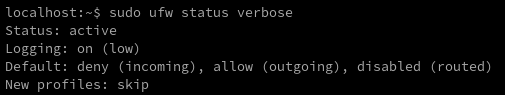  

Les règles à ajouter

```shell
sudo ufw allow 55218 # SSH
#sudo ufw allow http
sudo ufw allow https
#sudo ufw allow from 192.168.0.0/24 # autoriser un sous-réseau d’adresses IP
```

Le status : `sudo ufw status verbose`

```
Status: active
Logging: on (low)
Default: deny (incoming), allow (outgoing), disabled (routed)
New profiles: skip

To                         Action      From
--                         ------      ----
55218                      ALLOW IN    Anywhere                  
443                        ALLOW IN    Anywhere                  
55218 (v6)                 ALLOW IN    Anywhere (v6)             
443 (v6)                   ALLOW IN    Anywhere (v6)             
```

Activer le service au démarrage

    sudo rc-update add ufw

`* service ufw added to runlevel default`

### Partage (virtiofs)

*Virtiofs est un système de fichiers partagé qui permet aux machines virtuelles d'accéder à une arborescence de répertoires sur l'hôte. Contrairement aux approches existantes, il est conçu pour offrir la sémantique et les performances d'un système de fichiers local.*

Il faut valider **Enable shared memory**  
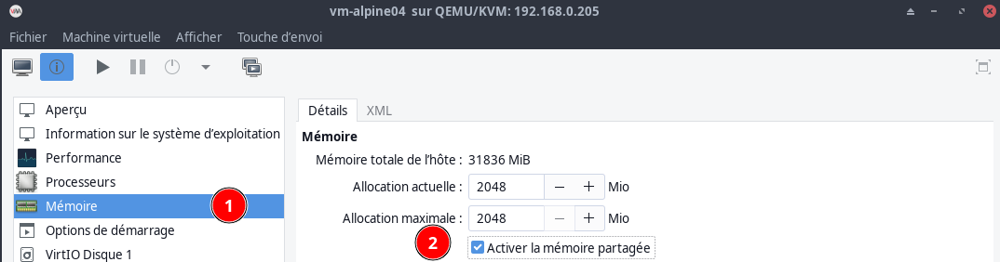  
Puis ajouter un **système de fichier**  
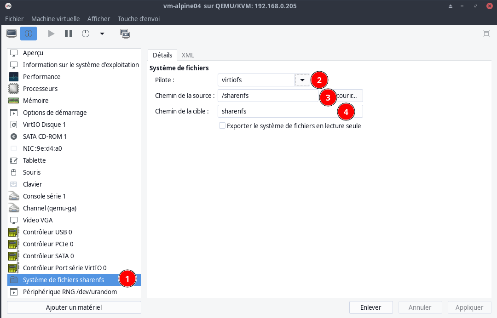  

`Un arrêt puis un démarrage de la machine virtuelle est obligatoire`{: .prompt-warning }

Vue des éléments XML de domaine suivants pour partager le répertoire hôte /path avec l'invité

```xml
<domaine>
      ...
  <memoryBacking>
    <source type="memfd"/>
    <access mode="shared"/>
  </memoryBacking>
      ...
  <devices>
        ...
    <filesystem type="mount" accessmode="passthrough">
      <driver type="virtiofs"/>
      <source dir="/sharenfs"/>
      <target dir="media_tag"/>
      <address type="pci" domain="0x0000" bus="0x07" slot="0x00" function="0x0"/>
    </filesystem>
        ...
   </devices>
</domaine>
```

Créer dossier local

    mkdir ~/sharenfs

Le partage sur `/etc/fstab`

```
media_tag   /home/alouest/sharenfs   virtiofs rw 0 0
```

monter

```
sudo mount -a
```

## ouestline.xyz

### DNS OVH IPV6

```
$TTL 3600
@	IN SOA dns111.ovh.net. tech.ovh.net. (2024070608 86400 3600 3600000 300)
        IN NS     ns111.ovh.net.
        IN NS     dns111.ovh.net.
        IN AAAA     2a01:e0a:9c8:2081::2
    600 IN TXT     "v=spf1 mx ~all"
        IN CAA     128 issue "letsencrypt.org"
*        IN AAAA     2a01:e0a:9c8:2081::1
```

### Caddy server 

[Alpine Linux - serveur web Caddy](/posts/Alpine_Linux_serveur_web_caddy/)

Configuration du fichier caddy : `/etc/caddy/Caddyfile`  

```
ouestline.xyz {
	root * /var/caddy/html/
	encode gzip
	file_server
}

php.ouestline.xyz {
	root * /var/caddy/php/
	encode gzip
	php_fastcgi 127.0.0.1:9000
}

static.ouestline.xyz {
	root * /home/alouest/sharenfs/multimedia/Divers/static
	encode gzip
	file_server
}
```

Redémarrer caddy

    sudo service caddy restart

## Node.js NPM

*NPM est le gestionnaire de paquets de Node.js, qui est fourni avec un outil de ligne de commande, que vous pouvez utiliser pour rechercher et installer tous les paquets open source à l'aide d'une seule commande. Vous pouvez également contrôler les versions de votre paquet, consulter les dépendances et même créer des scripts personnalisés dans vos projets via l' utilitaire de ligne de commande npm .*

### Node.JS sur Alpine Linux

Pour commencer, actualisez les référentiels Alpine Linux en exécutant la commande apk suivante :

    sudo apk update

Ensuite, nous allons installer la version Node.JS LTS et NPM qui est le gestionnaire de packages pour NodeJS .

```bask
sudo apk add --update nodejs npm
# OU
sudo apk add nodejs npm
```

Ceci installe Node.JS, NPM, et tous les paquets et bibliothèques supplémentaires, ainsi que les dépendances à partir des dépôts de Alpine Linux.  
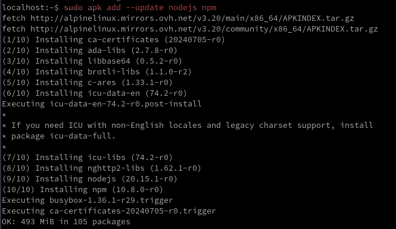  
Si vous souhaitez installer la version actuelle de Node.js à partir du dépôt communautaire 

    sudo apk add nodejs-current npm

Une fois l'installation terminée, vous pouvez vérifier si Node.js est installé

    node -v

Pour NPM 

    npm -v

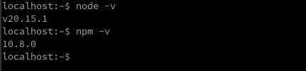  

## Réseau NAT

Bascule en réseau NAT

Modifier le réseau pour le mettre en DHCP

    sudo nano /etc/network/interfaces

```
auto lo
iface lo inet loopback

auto eth0
iface eth0 inet dhcp  
```

Arrêter la machine virtuelle depuis le gestionnaire de machine virtuelle   
Créer un réseau NAT   
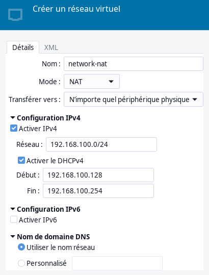{:width="300"}  
Démarrage auto  
{:width="350"}  
Modifier NIC machine virtuelle  
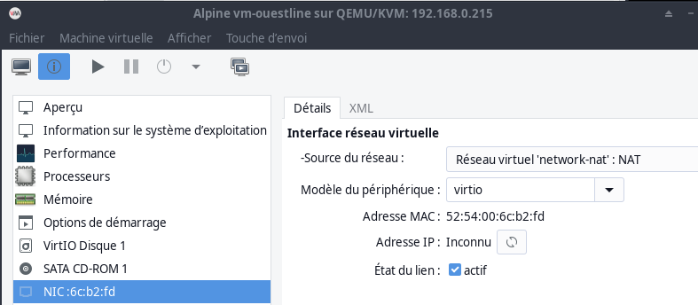{:width="400"}  
Ajouter affichage VNC  
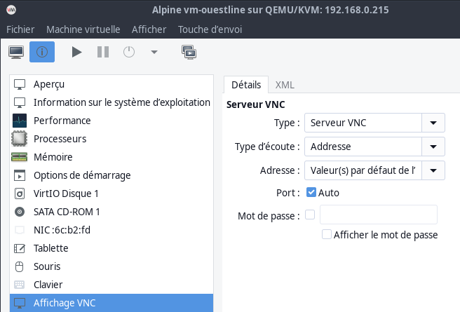{:width="400"}  

Démarrer la machine virtuelle  

Se connecter depuis le réseau local par VNC

    ssh -L 9500:localhost:5901 leno@192.168.0.215 -p 55215 -i /home/yann/.ssh/lenovo-ed25519

Utilisation TightVNC  
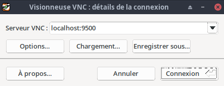{:width="300"}  

Se connecter   
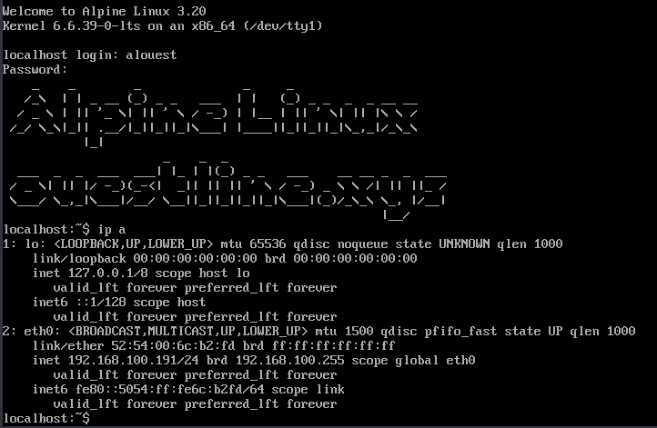{:width="400"}  

**On va mettre une IP statique**  

IPv6 est activé par défaut : `cat /etc/modules |grep ipv6`

Configuration réseau statique ipv4 et ipv6, fichier `/etc/network/interfaces`

    /etc/network/interfaces

```shell
auto lo
iface lo inet loopback

auto eth0
iface eth0 inet static
        address 192.168.100.10/24
        gateway 192.168.100.1
        hostname linux-alpine

iface eth0 inet static
        address 2a01:e0a:9c8:2081::1/64
        gateway fe80::8e97:eaff:fe39:66d6
        pre-up echo 0 > /proc/sys/net/ipv6/conf/eth0/accept_ra
```

Fichier de résolution dns

    /etc/resolv.conf

```
search network-nat
nameserver 192.168.100.1
```

ATTENTION , pour l'adresse ipv6 statique il faut renseigner le NextHop de la box free avec l'adresse inet6 de l'interface réseau eth0 : `ip a |grep "inet6 fe"`  &rarr; `fe80::5054:ff:fe6c:b2fd` 
  
{: .prompt-warning }

Les modifications apportées à /etc/network/interfaces peuvent être activées en exécutant

```shell
rc-service networking restart  # par défaut
/etc/init.d/networking restart # alternative
service networking restart     # autre alternative
```

Ou redémarrer la machine virtuelle **vm-ouestline** : `reboot`
