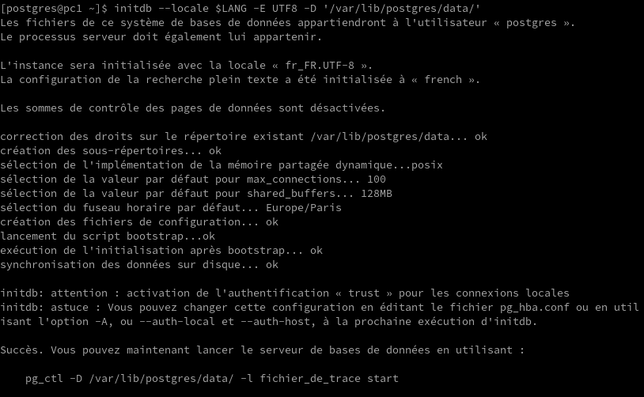
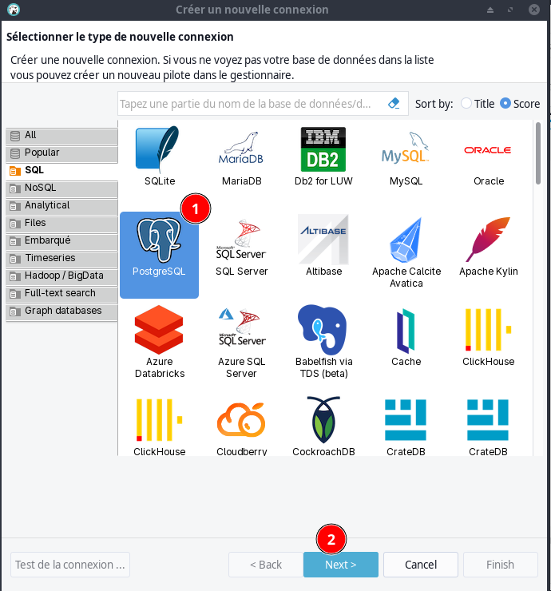
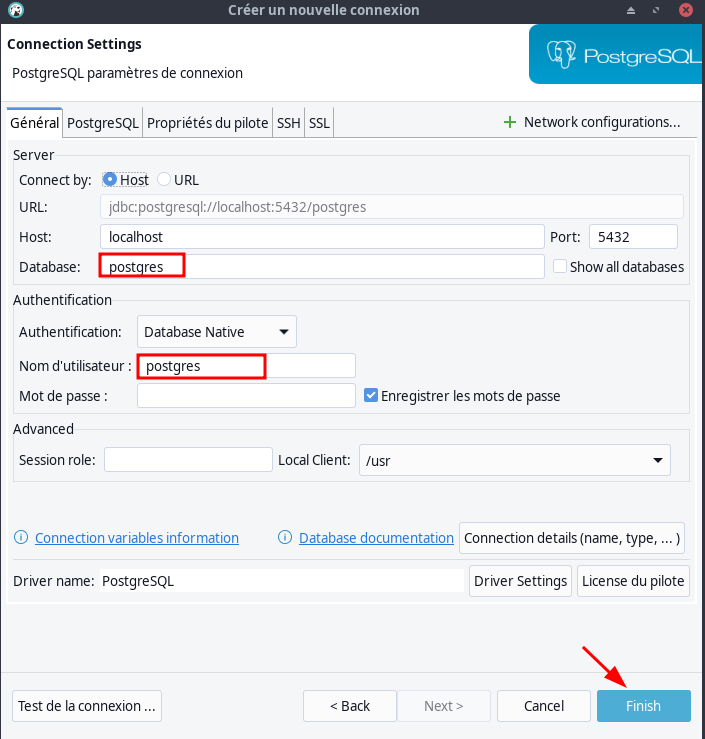
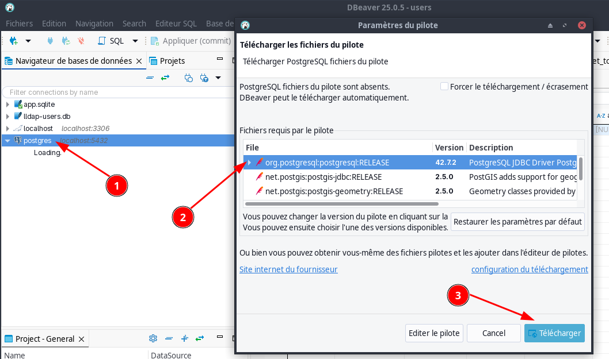
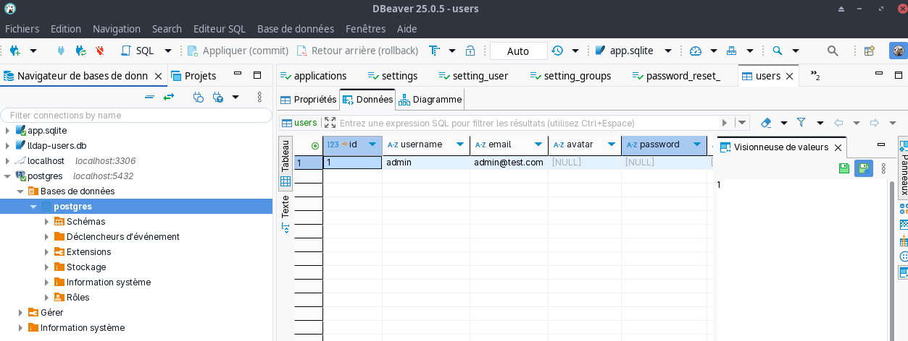
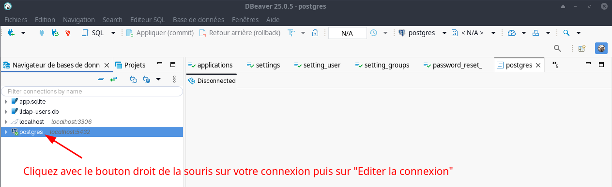
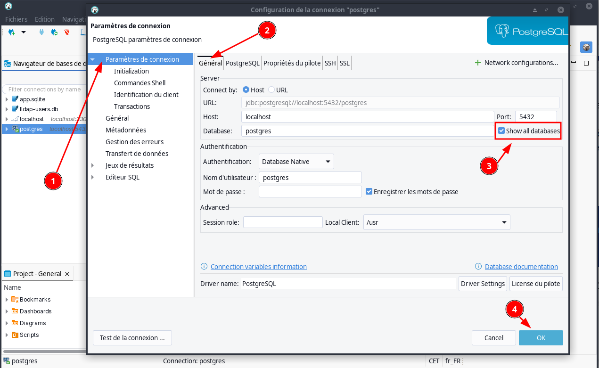

+++
title = 'PostgreSQL'
date = 2024-11-21 00:00:00 +0100
categories = psql
+++
## PostgreSQL

<div class="item">
  <div class="item__image">
    
  </div>
  <div class="item__content">
    <div class="item__header">
      <h4>PostgreSQL</h4>
    </div>
    <div class="item__description">
      <li><a href="https://linuxgenie.net/install-postgresql-psql-arch-linux/">How to Install PostgreSQL (psql) on Arch Linux</a></li>
      <li><a href="https://www.postgresqltutorial.com/postgresql-cheat-sheet/">PostgreSQL Cheat Sheet</a></li>
      <li><a href="https://public.dalibo.com/exports/formation/manuels/modules/i1/i1.handout.html">Sauvegarde et restauration</a></li>
    </div>
  </div>
</div>

### Installation

Installation sur archlinux
    yay -S postgresql

Relever version `postgres --version`  
*postgres (PostgreSQL) 16.3*

### Configurer le serveur PostgreSQL

Pour configurer le serveur PostgreSQL sur Arch Linux, vous devez installer le paquetage Postgresql. Ensuite, vous pouvez démarrer le service en initialisant le cluster de base de données. Vous pouvez définir un mot de passe pour le super-utilisateur et créer des bases de données et des tables.  
Comme nous avons déjà installé PostgreSQL, nous devons maintenant le configurer. Pour cela, passez d'abord à l'utilisateur Postgres avec cette commande :

    sudo -iu postgres

Prompt : `[postgres@pc1 ~]$`

initialiser le répertoire pour les données.  
PostgreSQL stockera ses données dans ce répertoire. Vous pouvez utiliser l'emplacement par défaut `/var/lib/postgres/data` ou en choisir un autre.

    initdb --locale $LANG -E UTF8 -D '/var/lib/postgres/data/'



Démarrer et activer PostgreSQL

    sudo systemctl enable postgresql --now

Vérifier : `systemctl status postgresql`  


### Accès 

Pour accéder

    psql -U postgres

### Importation base

Pour importer une base SQL

```
# Créer une base 
psql -U postgres -c "CREATE DATABASE ttrss"
# Importer
psql -U postgres ttrss < nom_fichier.sql
```

### OPTIONS

Vous pouvez également activer les sommes de contrôle des données pour renforcer l'intégrité des données en ajoutant l'argument `--data-checksums` à la commande précédente. Pour savoir si les sommes de contrôle des données sont activées, exécutez la commande suivante :

    sudo -iu postgres
    psql --tuples-only -c "SHOW data_checksums"


Pour initialiser le répertoire de données avec les sommes de contrôle activées

    initdb --locale $LANG -E UTF8 -D '/var/lib/postgres/data/' --data-checksums

Cela créera un nouveau répertoire de données dans `/var/lib/postgres/data/` avec la locale et l'encodage spécifiés. De plus, il effectue une vérification de la somme de contrôle des données pour chaque page écrite sur le disque. Cela permet de détecter les corruptions de données causées par un matériel défectueux.

Vous pouvez également modifier les méthodes d'authentification pour les connexions locales et distantes en ajoutant l'argument ci-dessous à la commande précédente :

    --auth-local=peer --auth-host=scram-sha-256

La méthode par défaut est la confiance, ce qui signifie que n'importe qui sur l'hôte peut se connecter en tant qu'utilisateur de la base de données. Cette méthode n'étant pas très sûre, vous pouvez en utiliser une autre.

## TTRSS alpine-vm

Se connecter sur la machine virtuelle *Flux RSS ttrss 192.168.100.60 alpine-vm*

**Via SSH**

```ssh
ssh -o ProxyCommand="ssh -W %h:%p -p 55205 -i /home/yann/.ssh/yick-ed25519 yick@192.168.0.205" aluser@192.168.100.60 -p 55217 -i /home/yann/.ssh/ttrss_alpine-vm
```

### Docker PostgreSQL

*Le fichier `mp_base_postgre` contient le mot de passe base postgre présent dans le fichier `.env`*

En mode su

Liste des containers: `docker ps`

```
CONTAINER ID   IMAGE                                    COMMAND                  CREATED        STATUS                PORTS                         NAMES
9cdfa0be153b   cthulhoo/ttrss-fpm-pgsql-static:latest   "/opt/tt-rss/updater…"   3 months ago   Up 2 days             9000/tcp                      aluser-updater-1
5caa141879d3   cthulhoo/ttrss-web-nginx:latest          "/docker-entrypoint.…"   3 months ago   Up 2 days (healthy)   192.168.100.60:8280->80/tcp   aluser-web-nginx-1
8780c353b2dc   cthulhoo/ttrss-fpm-pgsql-static:latest   "/bin/sh -c ${SCRIPT…"   3 months ago   Up 2 days             9000/tcp                      aluser-app-1
c1f2552f68cc   postgres:15-alpine                       "docker-entrypoint.s…"   3 months ago   Up 2 days             5432/tcp                      aluser-db-1
```

Sauvegarde restauration d'une base PostgreSQL qui est dans un container docker

    docker exec -i pg_container_name /bin/bash -c "PGPASSWORD=Mot_de_passe_base_postgres pg_dump --username utilisateur_base_postgres nom_base_postgres" > dump_base_postgres.sql

Dans la liste des containers , `pg_container_name` serait `aluser-db-1`

### Databases

```shell
sudo docker exec -i aluser-db-1 /bin/bash -c "PGPASSWORD=$(cat mp_base_postgre) psql -h localhost --username=postgres  --list"
```

Liste des bases postgre

```
                                                List of databases
   Name    |  Owner   | Encoding |  Collate   |   Ctype    | ICU Locale | Locale Provider |   Access privileges   
-----------+----------+----------+------------+------------+------------+-----------------+-----------------------
 postgres  | postgres | UTF8     | en_US.utf8 | en_US.utf8 |            | libc            | 
 template0 | postgres | UTF8     | en_US.utf8 | en_US.utf8 |            | libc            | =c/postgres          +
           |          |          |            |            |            |                 | postgres=CTc/postgres
 template1 | postgres | UTF8     | en_US.utf8 | en_US.utf8 |            | libc            | =c/postgres          +
           |          |          |            |            |            |                 | postgres=CTc/postgres
(3 rows)
```

### Générer Dump base postgres  

```shell
sudo docker exec -i aluser-db-1 /bin/bash -c "PGPASSWORD=$(cat mp_base_postgre) pg_dump --username postgres postgres" > dump_ttrss.sql
```

### Liens - ttrss.md

*Générer un fichier markdown des liens remarquables de la base PostgreSQL "postgre" Tiny Tiny RSS*

Le script de création du fichier ttrss.md : `import_base.sh` 

```bash
# Cr&ation fichier
sudo docker exec -it aluser-db-1 psql postgres   -U postgres -c "\COPY (
select concat('<li><a href=\"' || ttrss_entries.link || '\">', ttrss_entries.title || ' (' ,ttrss_feeds.title || ')</a></li> ' ) 
 from ttrss_entries 
  join ttrss_user_entries
   on ttrss_entries.id = ttrss_user_entries.ref_id
  join ttrss_feeds 
   on ttrss_feeds.id = ttrss_user_entries.feed_id
 where ttrss_user_entries.marked = true 
 order by ttrss_entries.updated DESC)
 TO 'ttrss.md'"
# Copie locale du fichier ttrss.md
sudo docker cp aluser-db-1:/ttrss.md ttrss.md
sudo chown $USER:$USER ttrss.md
```

## PC1

### Archlinux postgresql

Résumé des commandes pour installer et créer une base PostgreSQL  


```bash
# Installation sur archlinux
yay -S postgresql
# Configurer postgresql
sudo -iu postgres
# initialiser le répertoire pour les données
initdb --locale $LANG -E UTF8 -D '/var/lib/postgres/data/'
# --locale $LANG: Définit les paramètres de langue pour la base de données.
# -E UTF8: S'assure que la base de données utilise le codage UTF-8.
# -D '/var/lib/postgres/data': Choisissez où les données seront stockées.
exit
# Démarrer et activer PostgreSQL
sudo systemctl enable postgresql --now
```

### Script Analyse base ttrss

**articles_remarquables_ttrss (NOUVEAU)**

Création d'un bash nommé `articles_remarquables_ttrss` pour exécuter les opérations suivantes:

* Transfert via ssh du fichier `ttrss.md` de la machine virtuelle Alpine Linux vers le dossier local /tmp
* Recréer un fichier markdown qui sera automatiquement intégré dans le site statique

Le bash `$HOME/scripts/articles_remarquables_ttrss`

```bash
#!/bin/bash
set -euo pipefail
trap 'echo "Une erreur est survenue."; exit 1' ERR

echo "Connexion SSH VM Alpine ttrss"
echo "Importation fichier ttrss.md dans /tmp/"
scp -o ProxyCommand="ssh -W %h:%p -p 55205 -i /home/yann/.ssh/yick-ed25519 yick@192.168.0.205" -i /home/yann/.ssh/ttrss_alpine-vm  -P 55217 aluser@192.168.100.60:/home/aluser/ttrss.md /tmp/
LIENS_TTRSS="/tmp/liens_ttrss.html"
echo "Création fichier $LIENS_TTRSS"
cat << EOF > $LIENS_TTRSS
<!doctype html>
<html lang="fr">
<head>
  <meta charset="utf-8">
  <title>Doc Html</title>
<style>
body {
  font-family: Arial, Helvetica, sans-serif;
  font-size: 16px;
  background-color: black;
  color: white;
}

/* unvisited link */
a:link {
  color: #22F21B;
}
/* mouse over link */
a:hover {
  color: hotpink;
}

#myBtn {
  display: none;
  position: fixed;
  bottom: 20px;
  right: 30px;
  z-index: 99;
  font-size: 18px;
  border: none;
  outline: none;
  background-color: red;
  color: white;
  cursor: pointer;
  padding: 15px;
  border-radius: 4px;
}

#myBtn:hover {
  background-color: #555;
}
</style>
</head>
<body>
<h1>Liens TTRSS</h1>
  <button onclick="topFunction()" id="myBtn" title="Haut de page">&uarr;</button>
    <div class="search-bar">
      <div class="search-box js-search-box">
        <input type="text" id="saisie-recherche" onkeyup="rechercheFonction()" placeholder="Rechercher..." title="Saisir" autofocus>
      </div>
    </div>
<ul id="articlesTTRSS">
EOF
echo "Ajout des liens /tmp/ttrss.md"
cat /tmp/ttrss.md >> $LIENS_TTRSS
echo "Ajout Javascript"
cat << EOF >> $LIENS_TTRSS
</ul>

	<script>
	//Get the button
	let mybutton = document.getElementById("myBtn");
	
	// When the user scrolls down 20px from the top of the document, show the button
	window.onscroll = function() {scrollFunction()};

	function scrollFunction() {
	  if (document.body.scrollTop > 20 || document.documentElement.scrollTop > 20) {
	    mybutton.style.display = "block";
	  } else {
	    mybutton.style.display = "none";
	  }
	}
	
	// When the user clicks on the button, scroll to the top of the document
	function topFunction() {
	  document.body.scrollTop = 0;
	  document.documentElement.scrollTop = 0;
	}


	function rechercheFonction() {
	    var input, filter, ul, li, a, i, txtValue;
	    input = document.getElementById("saisie-recherche");
	    filter = input.value.toUpperCase();
	    ul = document.getElementById("articlesTTRSS");
	    li = ul.getElementsByTagName("li");
	    for (i = 0; i < li.length; i++) {
	        a = li[i].getElementsByTagName("a")[0];
	        txtValue = a.textContent || a.innerText;
	        if (txtValue.toUpperCase().indexOf(filter) > -1) {
	            li[i].style.display = "";
	        } else {
	            li[i].style.display = "none";
	        }
	    }
	}
	// Cacher le champ de recherche
	var mysearchbox = document.getElementById("searchbox");
	mysearchbox.style.visibility = "hidden";
	</script>
  </body>
</html>
EOF
echo "Copier le fichier liens_ttrss.html dans le dossier site"
echo "cp $LIENS_TTRSS /home/yann/sharenfs/rnmkcy/site/"
cp $LIENS_TTRSS /home/yann/sharenfs/rnmkcy/site/
```

### Dbeaver base postgres

Création base vide

```shell
psql -U postgres -c "CREATE DATABASE ttrss"
```

Des erreurs !

```
ATTENTION:  database "postgres" has a collation version mismatch
DÉTAIL : The database was created using collation version 2.40, but the operating system provides version 2.41.
ASTUCE : Rebuild all objects in this database that use the default collation and run ALTER DATABASE postgres REFRESH COLLATION VERSION, or build PostgreSQL with the right library version.
ERREUR:  template database "template1" has a collation version mismatch
DÉTAIL : The template database was created using collation version 2.40, but the operating system provides version 2.41.
ASTUCE : Rebuild all objects in the template database that use the default collation and run ALTER DATABASE template1 REFRESH COLLATION VERSION, or build PostgreSQL with the right library version.
```

Correction 

```shell
sudo -u postgres -- psql -c 'ALTER DATABASE postgres REFRESH COLLATION VERSION; ALTER DATABASE template1 REFRESH COLLATION VERSION;'
```

On récupère la base dump_ttrss.sql

```bash
#!/bin/bash
set -euo pipefail
trap 'echo "Une erreur est survenue."; exit 1' ERR

# Connexion SSH VM Alpine ttrss, récupération base postgresql ttrss sous forme de fichier SQL
scp -o ProxyCommand="ssh -W %h:%p -p 55205 -i /home/yann/.ssh/yick-ed25519 yick@192.168.0.205" -i /home/yann/.ssh/ttrss_alpine-vm  -P 55217 aluser@192.168.100.60:/home/aluser/dump_ttrss.sql /home/yann/media/devel/psql/
```

Résultat de la commande

```
DATABASE template1 REFRESH COLLATION VERSION;'
ATTENTION:  database "postgres" has a collation version mismatch
DÉTAIL : The database was created using collation version 2.40, but the operating system provides version 2.41.
ASTUCE : Rebuild all objects in this database that use the default collation and run ALTER DATABASE postgres REFRESH COLLATION VERSION, or build PostgreSQL with the right library version.
NOTICE:  changement de version de 2.40 à 2.41
NOTICE:  changement de version de 2.40 à 2.41
ALTER DATABASE
ALTER DATABASE
```

```bash
#!/bin/bash
set -euo pipefail
trap 'echo "Une erreur est survenue."; exit 1' ERR

# Localement, supprimer et recréer base vide postgresql ttrss
psql -U postgres -c "DROP DATABASE ttrss"
psql -U postgres -c "CREATE DATABASE ttrss"
# Import fichier SQL dans la base
psql -U postgres ttrss < /srv/media/devel/psql/dump_ttrss.sql
# Générer le fichier markdown
psql ttrss   -U postgres -c "\COPY (
select concat('<li><a href=\"' || ttrss_entries.link || '\">', ttrss_entries.title || ' (' ,ttrss_feeds.title || ')</a></li> ' ) 
 from ttrss_entries 
  join ttrss_user_entries
   on ttrss_entries.id = ttrss_user_entries.int_id
  join ttrss_feeds 
   on ttrss_feeds.id = ttrss_user_entries.feed_id
 where ttrss_user_entries.marked = true 
 order by ttrss_entries.updated DESC)
 TO '/srv/media/devel/psql/ttrss.md'"
# Créer le fichier liens_ttrss.md dans le dossier yannstatic
# cat /srv/media/devel/psql/Entete_liens_ttrss.txt /srv/media/devel/psql/ttrss.md /srv/media/devel/psql/Pied_liens_ttrss.txt > /srv/media/yannstatic/liens_ttrss.md
LIENS_TTRSS="/srv/media/yannstatic/liens_ttrss.md"
cat << EOF > $LIENS_TTRSS
---
layout: article
titles: Liens ttrss au format HTML
---

/ lang="fr">
  <body>
<head>
  <meta charset="utf-8">
  <title>Doc Html</title>
</head>
    <div class="search-bar">
      <div class="search-box js-search-box">
        <input type="text" id="saisie-recherche" onkeyup="rechercheFonction()" placeholder="Rechercher..." title="Saisir" autofocus>
      </div>
    </div>
<ul id="articlesTTRSS">
EOF
cat /srv/media/devel/psql/ttrss.md >> $LIENS_TTRSS
cat << EOF >> $LIENS_TTRSS
</ul>

  <button onclick="topFunction()" id="myBtn" title="Haut de page">&uarr;</button>
	<script>
	//Get the button
	var mybutton = document.getElementById("myBtn");
	
	// When the user scrolls down 20px from the top of the document, show the button
	window.onscroll = function() {scrollFunction()};

	function scrollFunction() {
	  if (document.body.scrollTop > 20 || document.documentElement.scrollTop > 20) {
	    mybutton.style.display = "block";
	  } else {
	    mybutton.style.display = "none";
	  }
	}
	
	// When the user clicks on the button, scroll to the top of the document
	function topFunction() {
	  document.body.scrollTop = 0;
	  document.documentElement.scrollTop = 0;
	}


	function rechercheFonction() {
	    var input, filter, ul, li, a, i, txtValue;
	    input = document.getElementById("saisie-recherche");
	    filter = input.value.toUpperCase();
	    ul = document.getElementById("articlesTTRSS");
	    li = ul.getElementsByTagName("li");
	    for (i = 0; i < li.length; i++) {
	        a = li[i].getElementsByTagName("a")[0];
	        txtValue = a.textContent || a.innerText;
	        if (txtValue.toUpperCase().indexOf(filter) > -1) {
	            li[i].style.display = "";
	        } else {
	            li[i].style.display = "none";
	        }
	    }
	}
	// Cacher le champ de recherche
	var mysearchbox = document.getElementById("searchbox");
	mysearchbox.style.visibility = "hidden";
	</script>
  </body>
</>
EOF
```

### DBeaver - PostgreSQL

Utiliser dbeaver pour se connecter à postgresql

Ouvrir Dbeaver --> Base de données --> Nouvelle connexion  

{:width="350" .normal}  
{:width="350" .normal}  

{: .normal}  
{: .normal}  

Création database ttrss avec Dbeaver  
*DBeaver / PostgreSQL : « Error : database ttrss already exists », mais je ne le trouve pas.*

1.    Cliquez avec le bouton droit de la souris sur votre connexion puis sur **Editer la connexion**    
{: .normal}  
2.    Dans le panneau de gauche, cliquez sur  **Paramètres de connexion** puis **Général** et cochez la case **Show all databases**   
{: .normal}  

