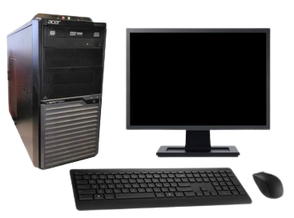
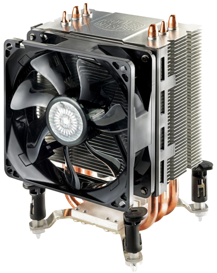
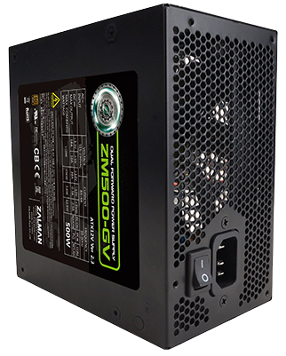
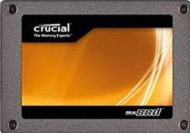

+++
title = 'Description matériel mini tour PC1'
date = 2024-11-25 00:00:00 +0100
categories = ['ordinateur']
+++


- [Carte mère ASUS H110M-A/M.2](#carte-mère-asus-h110m-am2)
- [Processeur Refroidisseur Mémoire Alimentation](#processeur-refroidisseur-mémoire-alimentation)

## Carte mère ASUS H110M-A/M.2

{:width="150"}

- [Carte mère ASUS H110M-A/M.2](/files/F11483_H110M-A_M_2_UM_WEB.pdf)
- [Pinout des entrées/sorties de la carte mère ASUS H110M-A/M.2](/files/CarteMere-H110M-AM.2-pinout-entrees-sorties.pdf)


**CPU**

* Intel® Socket 1151 for 7th/6th Generation Core™ i7/Core™ i5/Core™ i3/Pentium®/Celeron® Processors
* Supports Intel® 14 nm CPU
* Supports Intel® Turbo Boost Technology 2.0
    * The Intel® Turbo Boost Technology 2.0 support depends on the CPU types.
    * Refer to [www.asus.com](http://www.asus.com/) for CPU support list
* Chipset
* Intel® H110

**Réseau**

* Contrôleur Gigabit Intel 1219v compatible avec LANGuard

**Memory**

* 2 x DIMM, Max. 32GB, DDR4 2400/2133 MHz Non-ECC, Un-buffered Memory
* Supports Intel® Extreme Memory Profile (XMP)
    * Hyper DIMM support is subject to the physical characteristics of individual CPUs. 
    * Refer to www.asus.com for the Memory QVL (Qualified Vendors Lists).
    * Due to Intel® chipset limitation, DDR4 2400MHz memory frequency is only supported by 7th Generation Intel® processors. Higher memory modules will run at the maximum transfer rate of DDR4 2400MHz.
    * Due to Intel® chipset limitation, DDR4 2133MHz and higher memory modules on 6th Generation Intel® processors will run at the maximum transfer rate of DDR4 2133MHz.

**Graphic**

* Integrated Graphics Processor- Intel® HD Graphics support
* Multi-VGA output support : HDMI/DVI-D/RGB ports
    - Supports HDMI  with max. resolution 4096 x 2160 @ 24 Hz / 2560 x 1600 @ 60 Hz
    - Supports DVI-D with max. resolution 1920 x 1200 @ 60 Hz
    - Supports RGB   with max. resolution 1920 x 1200 @ 60 Hz
* Maximum shared memory of 1024 MB
* Supports up to 2 displays simultaneously

**Expansion Slots**

* 1 x PCIe 3.0/2.0 x16 (x16 mode)
* 2 x PCIe 2.0 x1

**Storage**

* Intel® H110 chipset :
* 1 x M.2 Socket 3, with M key, type 2242/2260/2280 storage devices support (both SATA & PCIE mode)*2
* 4 x SATA 6Gb/s port(s),
* Intel® Rapid Storage Technology supports*1
* LAN
* Intel® I219V

**Audio**

* Realtek® ALC887 8-Channel High Definition Audio CODEC *2
    - Supports : Jack-detection, Front Panel Jack-retasking

    **Audio Feature :**

    - LED-illuminated design - Brighten up your build with the gorgeous illuminated audio trace path.
    - Audio Shielding: Ensures precision analog/digital separation and greatly reduced multi-lateral interference
    - Dedicated audio PCB layers: Separate layers for left and right channels to guard the quality of the sensitive audio signals
    - Premium Japanese audio capacitors: Provide warm, natural and immersive sound with exceptional clarity and fidelity

**USB Ports**

* Intel® H110 chipset :
* 4 x USB 3.1 Gen 1 port(s) (2 at back panel, blue, 2 at mid-board)
* Intel® H110 chipset :
* 6 x USB 2.0/1.1 port(s) (4 at back panel, black, 2 at mid-board)

**Special Features**

* ASUS 5X Protection II :
    - ASUS LANGuard - 2.5X higher surge tolerance
    - ASUS DIGI+ VRM - 5 Phase digital power design
    - ASUS DRAM Overcurrent Protection - Prevents damage from short circuits
    - ASUS Stainless-Steel Back I/O - 3X corrosion-resistance for greater durability
    - ASUS ESD Guards - Electrostatic discharge protection
* ASUS EPU :
    - EPU
* ASUS Exclusive Features :
    - AI Suite 3
    - Ai Charger
    - Low EMI Solution
    - USB 3.0 Boost
    - Mobo Connect
    - PC Cleaner
* ASUS Quiet Thermal Solution :
    - Stylish Fanless Design Heat-sink solution
    - ASUS Fan Xpert
* ASUS EZ DIY :
    - ASUS CrashFree BIOS 3
    - ASUS EZ Flash 3
    - ASUS UEFI BIOS EZ Mode
    - Push Notice
* ASUS Q-Design :
    - ASUS Q-Slot
    - ASUS Q-DIMM

**Back I/O Ports**

* 1 x PS/2 keyboard (purple)
* 1 x PS/2 mouse (green)
* 1 x DVI-D
* 1 x D-Sub
* 1 x HDMI
* 1 x LAN (RJ45) port(s)
* 2 x USB 3.1 Gen 1 (blue)
* 4 x USB 2.0
* 3 x Audio jack(s)

**Internal I/O Ports**

* 1 x USB 3.1 Gen 1 connector(s) support(s) additional 2 USB 3.1 Gen 1 port(s)
* 1 x USB 2.0 connector(s) support(s) additional 2 USB 2.0 port(s)
* 1 x M.2 Socket 3
* 1 x COM port(s) connector(s)
* 4 x SATA 6Gb/s connector(s)
* 1 x CPU Fan connector(s) (1 x 4 -pin)
* 1 x Chassis Fan connector(s) (1 x 4 -pin)
* 1 x S/PDIF out header(s)
* 1 x 24-pin EATX Power connector(s)
* 1 x 4-pin ATX 12V Power connector(s)
* 1 x Front panel audio connector(s) (AAFP)
* 1 x Clear CMOS jumper(s)
* 1 x System panel connector

**Accessories**

* User's manual
* I/O Shield
* 2 x SATA 3Gb/s cable(s)
* 1 x M.2 Screw Package
* 1 x Supporting DVD

**Manageability**

* WfM 2.0, DMI 3.0, WOL by PME, PXE

**Form Factor**

* mATX Form Factor
* 8.9 inch x 7.3 inch ( 22.6 cm x 18.5 cm )

**BIOS**

* 128 Mb Flash ROM, UEFI AMI BIOS, PnP, DMI 3.0, WfM2.0, SM BIOS 3.0, ACPI 5.0, Multi-language BIOS, ASUS EZ Flash 3, ASUS CrashFree BIOS 3, My Favorites, Quick Note, Last Modified Log, F12 PrintScreen function, and ASUS DRAM SPD (Serial Presence Detect) memory information

Mise à jour du bios

* [Update BIOS ASUS H110M-A/M.2](/files/E12583_BIOS_Update_EM_V3_WEB_20170614.pdf)  
* [BIOS H110M-A-M-2](https://fr.driverscollection.com/?H=H110M-A/M.2&By=ASUS&SS=BIOS) 
    * **Version 4202** 
    * Date de sortie:15 Mar 2019
 


Après mise à jour du BIOS , il faut activer **Intel Virtualization Technology**  

1. Accès au BIOS (F2)
2. Advanced Mode (F7)
   - Onglet *Advanced* 
   - Faire défiler le champ *Cpu configuration* jusqu'au paramètre  **Intel Virtualization Technology**
   - Activer **Intel Virtualization Technology  Enabled**
   - Onglet *Exit* 
3. **Save changes & reset**


## Processeur Refroidisseur Mémoire Alimentation

**Intel Core i5-7500 4 cores (3.4 GHz)**   

**CPU UPGRADE** [ASUS H110M-A/M.2 processor support and specifications](https://www.asus.com/fr/motherboards-components/motherboards/prime/h110m-a-m-2/helpdesk_cpu/) (*list des CPU compatibles avec la carte mère*) 

**Processeur [Intel Core i5-7500 CPU](http://www.cpu-upgrade.com/CPUs/Intel/Core_i5/i5-7500.html) mis en place le 20/02/2020**

```
General specs 
        Microarchitecture:	Kaby Lake
        Core Name:	Kaby Lake-S
        Manufacturing Process:	0.014 micron
        Socket Type:	Socket 1151
        The Number of Cores:	4
        The Number of Threads:	4
        Multiprocessing:	Not supported
        Frequency:	3.4 GHz
        Maximum Turbo Frequency:	3.8 GHz
        L1 Cache:	128 KB (code)
        128 KB (data)
        L2 Cache:	1 MB
        L3 Cache:	6 MB
        Thermal Design Power:	65 Watt
        Integrated GPU:	Intel HD 630
        Supported memory:	DDR3L-1333 / DDR3L-1600 / DDR4-2133 / DDR4-2400

Instructions and Technologies
        Execute Disable Bit?	Yes
        64-bit Support?	Yes
        Hyper-Threading technology?	No
        Turbo Boost?	Yes
        Virtualization?	Yes
        Enhanced SpeedStep?	Yes
        Instruction Set Extensions:	AES
            AVX
            AVX2
            F16C
            FMA3
            MMX
            SSE
            SSE2
            SSE3
            SSE4
            Supplemental SSE3
```

Les processeurs **Intel core i7**  
Core i7-6700 (3.4GHz, 4C, HT, L3:8M, GT2, 65W, rev.R0)  
Core i7-6700K (4.0GHz, 4C, HT, L3:8M, GT2, 91W, rev.R0)  
Core i7-6700T (2.8GHz, 4C, HT, L3:8M, GT2, 35W, rev.R0)  
Core i7-7700 (3.6GHz, 4C, HT, L3:8M, Intel HD 600 series, 65W, rev.B0)  
Core i7-7700K (4.2GHz, 4C, HT, L3:8M,Intel HD 600 series , 91W, rev.B0)  
Core i7-7700T (2.9GHz, 4C, HT, L3:8M,Intel HD 600 series , 35W, rev.B0)  


**Cooler Master Hyper TX3i**   
Ventilateur pour processeur (pour socket Intel 775 / 1150 / 1151 / 1155 / 1156)   
{:width="10%"}

**Kingston ValueRAM 16 Go DDR4 2133 MHz CL15 DR X8**   
RAM DDR4 PC4-17000 - KVR21N15D8/16 (garantie 10 ans par Kingston)   
{:width="10%"}  
**Crucial UDIMM 16 Go DDR4-3200  CT16G4DFRA32A**  
{:width="10%"}  

**Zalman ZM500-GV 80PLUS Bronze**   
Alimentation 500W ATX 12V v2.3 80PLUS Bronze   
{:width="20%"}

**Sabrent SSD Interne Rocket Q M.2 2280 NVMe PCIe Haute Performance de 1TB (SB-RKTQ-1TB)**  
{:width="20%"}  
**Sabrent Rocket Q**


**Western Digital Red 4 To SATA 3"5 6Gb/s**  
{:width="10%"}  
**WDC WD40EFRX-68W**  
*Spécifiquement conçus pour les systèmes NAS de 1 à 8 baies, les disques durs Western Digital Red sont faits pour tourner 24h/24 et 7j/7, et destinés aux particuliers et aux petites structures de travail. Ces disques durs au format 3.5" sont construits autour de 64 à 256 Mo de cache  sur un bus SATA III. Leur compatibilité est assurée avec la plupart des serveurs NAS de grandes marques .*

**Crucial SSD 120Go**  
{:width="10%"}  
**nvme1tb300SSD1**  

**Crucial SSD CT512MX1  512Go**  
{:width="10%"}  
**Crucial_CT512MX1**  