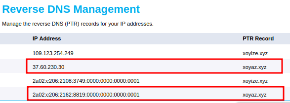
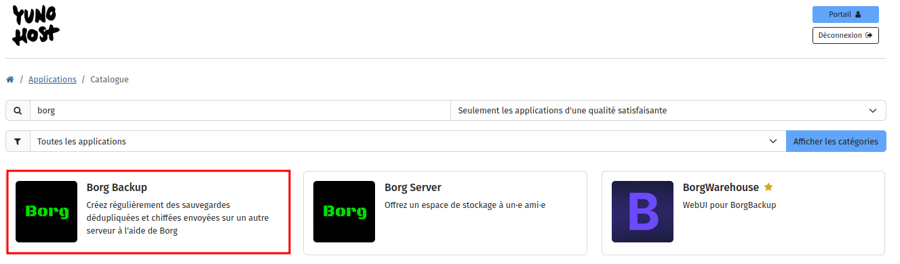
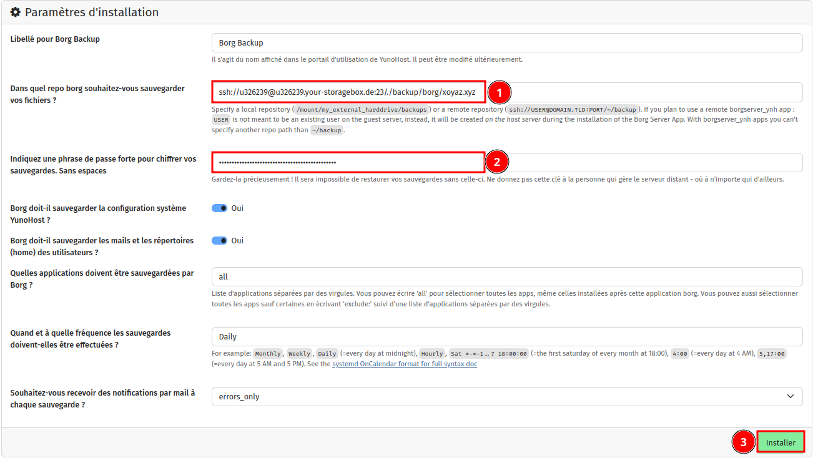
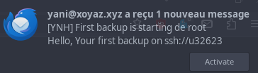
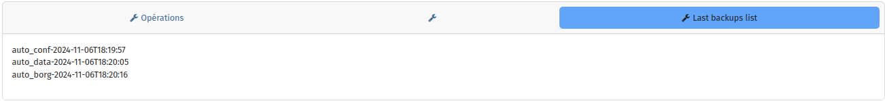

+++
title = 'Contabo VPS debian 12 (bookworm) - Yunohost xoyaz.xyz'
date = 2024-11-27 00:00:00 +0100
categories = vps yunohost
+++
*YunoHost est une distribution basée sur Debian GNU/Linux composée de logiciels libres et ayant pour objectif de faciliter la pratique de l’auto-hébergement*

[](https://contabo.com/en/)

**VPS** 1 SSD  
**IP**: 37.60.230.30  
**IPv6**: 2a02:c206:2162:8819::1  
**Location**: Dusseldorf  
**OS**: Debian 12  

## Debian 12 (bookworm)

{:height="50"}  

On se connecte en root sur le VPS

    ssh root@37.60.230.30

Le terminal

```
Linux vmi1628819.contaboserver.net 6.1.0-10-amd64 #1 SMP PREEMPT_DYNAMIC Debian 6.1.37-1 (2023-07-03) x86_64
  _____
 / ___/___  _  _ _____ _   ___  ___
| |   / _ \| \| |_   _/ \ | _ )/ _ \
| |__| (_) | .` | | |/ _ \| _ \ (_) |
 \____\___/|_|\_| |_/_/ \_|___/\___/

Welcome!

This server is hosted by Contabo. If you have any questions or need help,
please don't hesitate to contact us at support@contabo.com.
```

### Mise à jour + Réseau IPV6

Les commandes

```bash
apt update && apt upgrade -y  # Mise à jour
apt autoremove -y             # supprimer les paquets inutilisés
apt install rsync curl tmux jq figlet git tree -y   # Quelques outils
enable_ipv6                   # Activation ipv6
reboot                        # redémarrage
```

se reconnecter ssh  

    ssh root@37.60.230.30

Vérifier l'adressage : `ip a`

```
1: lo: <LOOPBACK,UP,LOWER_UP> mtu 65536 qdisc noqueue state UNKNOWN group default qlen 1000
    link/loopback 00:00:00:00:00:00 brd 00:00:00:00:00:00
    inet 127.0.0.1/8 scope host lo
       valid_lft forever preferred_lft forever
    inet6 ::1/128 scope host noprefixroute 
       valid_lft forever preferred_lft forever
2: eth0: <BROADCAST,MULTICAST,UP,LOWER_UP> mtu 1500 qdisc fq_codel state UP group default qlen 1000
    link/ether 00:50:56:4e:73:83 brd ff:ff:ff:ff:ff:ff
    altname enp0s18
    altname ens18
    inet 37.60.230.30/20 brd 37.60.239.255 scope global eth0
       valid_lft forever preferred_lft forever
    inet6 2a02:c206:2162:8819::1/64 scope global 
       valid_lft forever preferred_lft forever
    inet6 fe80::250:56ff:fe4e:7383/64 scope link 
       valid_lft forever preferred_lft forever
```

### Date et heure + Synchro

Activer le fuseau Europe/Paris

    timedatectl set-timezone Europe/Paris

Horloge système synchronisée : `timedatectl`

```
               Local time: Mon 2024-11-04 14:21:24 CET
           Universal time: Mon 2024-11-04 13:21:24 UTC
                 RTC time: Mon 2024-11-04 13:21:24
                Time zone: Europe/Paris (CET, +0100)
System clock synchronized: yes
              NTP service: active
          RTC in local TZ: no
```

### Reconfigurer locales

Activer uniquement **en_GB.UTF-8**, **en_US.UTF-8** et **fr_FR.UTF-8**

    dpkg-reconfigure locales

Default en_US.UTF-8

```
Generating locales (this might take a while)...
  en_GB.UTF-8... done
  en_US.UTF-8... done
  fr_FR.UTF-8... done
Generation complete.
```

### Reverse DNS

Activer le reverse DNS IPV4 et IPV6 pour le domaine xoyaz.xyz : Control panel → Reverse DNS management  
{:width="400"}  
Désactiver VNC: Your services &rarr; Manage &rarr; VPS Control &rarr; Manage &rarr; Disable VNC et valider par un clic sur Disable

## Yunohost xoyaz.xyz


**Pré-requis**  
Un serveur dédié ou virtuel avec Debian 12 (Bookworm) pré-installé (avec un kernel >= 6.1), avec au moins 512Mo de RAM et 16Go de capacité de stockage  

### Script installation

**Lancer le script d'installation**  
Ouvrez la ligne de commande sur votre serveur (soit directement, soit avec SSH)  
Vous devez être connecté en tant que root, curl installé (which curl)  
Lancez la commande suivante :

    curl https://install.yunohost.org | bash

Détails de l'installation dans `/var/log/yunohost-installation_20241104_150816.log`

### Post-installation

post-installation de Yunohost.

    yunohost tools postinstall

Suivre la procédure

```
Main domain: xoyaz.xyz
Admin username: yani
Admin full name: yani bopro
New administration password: ********************
Confirm new administration password: ********************
Warning: The YunoHost project is a team of volunteers who have made common cause to create a free operating system for servers, called YunoHost. The YunoHost software is published under the AGPLv3 license (<https://www.gnu.org/licenses/agpl-3.0.txt>). In connection with this software, the project administers and makes available several technical and community services for various purposes. By using these services, you agree to be bound by the following Terms of Services: <https://yunohost.org/terms_of_services>.
I have read and understand the Terms of Services [Y/N]: Y
Info: Installing YunoHost…
Success! Self-signed certificate now installed for the domain 'xoyaz.xyz'
Success! Domain created
Info: The email alias 'root@xoyaz.xyz' will be added to the group 'admins'
Info: The email alias 'admin@xoyaz.xyz' will be added to the group 'admins'
Info: The email alias 'admins@xoyaz.xyz' will be added to the group 'admins'
Info: The email alias 'webmaster@xoyaz.xyz' will be added to the group 'admins'
Info: The email alias 'postmaster@xoyaz.xyz' will be added to the group 'admins'
Info: The email alias 'abuse@xoyaz.xyz' will be added to the group 'admins'
Info: Updating aliases for group 'admins'
Info: The app catalog cache is empty or obsolete.
Info: Updating application catalog…
Info: (Will fetch 537 logos, this may take a couple minutes)
```

### DNS OVH xoyaz.xyz

{:width="50"} 

Configuration DNS domaine par défaut **xoyaz.xyz**

    yunohost domain dns suggest xoyaz.xyz

La configuration DNS du domaine 

```
Warning: No diagnosis cache yet for category 'dnsrecords'
Info: This command shows you the *recommended* configuration. It does not actually set up the DNS configuration for you. It is your responsability to configure your DNS zone in your registrar according to this recommendation.
; Basic ipv4/ipv6 records
@ 3600 IN A 37.60.230.30
@ 3600 IN AAAA 2a02:c206:2162:8819::1

; Mail
@ 3600 IN MX 10 xoyaz.xyz.
@ 3600 IN TXT "v=spf1 a mx -all"
mail._domainkey 3600 IN TXT "v=DKIM1; h=sha256; k=rsa; p=MIGfMA0GCSqGSIb....EQIDAQAB"
_dmarc 3600 IN TXT "v=DMARC1; p=none"


; Extra
* 3600 IN A 37.60.230.30
* 3600 IN AAAA 2a02:c206:2162:8819::1
@ 3600 IN CAA 0 issue "letsencrypt.org"
```

{:height="20"}  
Se connecter à l'espace client du site OVH : **Web cloud &rarr; Domaines &rarr; xoyaz.xyz &rarr; Zone DNS**  
Cliquer sur **"Modifier en mode textuel"**, garder les 4 premières lignes :  
{:width="600"}  
puis effacer tout ce qu'il y a en-dessous, et le remplacer par la configuration donnée par votre serveur avec la commande `yunohost domain dns suggest xoyaz.xyz`

### Certificats SSL Let's Encrypt xoyaz.xyz

{:height="30"}  
On active les certificats SSL pour le domaine xoyaz.xyz

    yunohost domain cert install xoyaz.xyz --no-checks

Résultat

```
[...]
Success! Configuration updated for 'nginx'
Success! Let's Encrypt certificate now installed for the domain 'xoyize.xyz'
```

### OpenSSH, clé et motd

{:height="40"}  

<u>Sur l'ordinateur de bureau</u>  
Générer une paire de clé curve25519-sha256 (ECDH avec Curve25519 et SHA2) nommé **xoyaz-ed25519** pour une liaison SSH avec le serveur yunohost  

    ssh-keygen -t ed25519 -o -a 100 -f ~/.ssh/xoyaz-ed25519

Envoyer les clés publiques sur le serveur yunohost en se se connectant  avec l'utilisateur administrateur 

    ssh-copy-id -i ~/.ssh/xoyaz-ed25519.pub yani@37.60.230.30

On se connecte  avec l'utilisateur administrateur

    ssh yani@37.60.230.30

<u>Sur le serveur Yunohost</u>  
La liste des paramètres modifiables :  `sudo yunohost settings list`

Sur votre serveur, la modification du fichier de configuration SSH pour désactiver l'authentification par mot de passe est gérée par un paramètre système 

    sudo yunohost settings set security.ssh.ssh_password_authentication -v no

Modifier le port SSH

*Pour empêcher les tentatives de connexion SSH par des robots qui analysent Internet à la recherche de tout serveur sur lequel SSH est activé, vous pouvez modifier le port SSH. Ceci est géré par un paramètre système, qui prend en charge la mise à jour de la configuration SSH et Fail2Ban.*

    sudo yunohost settings set security.ssh.ssh_port -v 55030

Accès depuis <u>l'ordinateur de bureau</u> avec la clé privée  

```bash
ssh -p 55030 -i ~/.ssh/xoyaz-ed25519 yani@37.60.230.30   # avec ip serveur
ssh -p 55030 -i ~/.ssh/xoyaz-ed25519 yani@xoyaz.xyz      # avec domaine serveur
```

**Motd:** `/etc/motd`

```
 __   __                 _              _                                                      
 \ \ / /_  _  _ _   ___ | |_   ___  ___| |_                                                    
  \ V /| || || ' \ / _ \| ' \ / _ \(_-<|  _|                                                   
   |_|  \_,_||_||_|\___/|_||_|\___//__/ \__|                                                   
 __ __ ___  _  _  __ _  ___   __ __ _  _  ___                                                  
 \ \ // _ \| || |/ _` ||_ / _ \ \ /| || ||_ /                                                  
 /_\_\\___/ \_, |\__,_|/__|(_)/_\_\ \_, |/__|                                                  
            |__/                    |__/                                                       
  ____ ____    __   __     ___  ____  __     ____  __                                          
 |__ /|__  |  / /  /  \   |_  )|__ / /  \   |__ / /  \                                         
  |_ \  / /_ / _ \| () |_  / /  |_ \| () |_  |_ \| () |                                        
 |___/ /_/(_)\___/ \__/(_)/___||___/ \__/(_)|___/ \__/ 
```

### Historique de la ligne de commande

Ajoutez la recherche d’historique de la ligne de commande au terminal
Se connecter en utilisateur debian
Tapez un début de commande précédent, puis utilisez shift + up (flèche haut) pour rechercher l’historique filtré avec le début de la commande.

```bash
# Global, tout utilisateur
echo '"\e[1;2A": history-search-backward' | sudo tee -a /etc/inputrc
echo '"\e[1;2B": history-search-forward' | sudo tee -a /etc/inputrc
```

### Diagnostique

La machine ayant été redémarré après la configuration dns , on peut lancer une vérification  

    sudo yunohost diagnosis run

Lecture après exécution 

    sudo yunohost diagnosis show --human-readable

Résultat 

```
=================================
Base system (basesystem)
=================================
[INFO] Server hardware architecture is kvm amd64
  - Server model is QEMU Standard PC (i440FX + PIIX, 1996)
[INFO] Server is running Linux kernel 6.1.0-26-amd64
[INFO] Server is running Debian 12.7
[INFO] Server is running YunoHost 12.0.6 (stable)
  - yunohost version: 12.0.6 (stable)
  - yunohost-admin version: 12.0.3.5 (stable)
  - yunohost-portal version: 12.0.6 (stable)
  - moulinette version: 12.0.3 (stable)
  - ssowat version: 12.0.3 (stable)

=================================
Internet connectivity (ip)
=================================
[SUCCESS] Domain name resolution is working!
[SUCCESS] The server is connected to the Internet through IPv4!
  - Global IP: 37.60.230.30
  - Local IP: 37.60.230.30
[SUCCESS] The server is connected to the Internet through IPv6!
  - Global IP: 2a02:c206:2162:8819::1
  - Local IP: 2a02:c206:2162:8819::1

=================================
DNS records (dnsrecords)
=================================
[SUCCESS] DNS records are correctly configured for domain xoyaz.xyz (category basic)
[SUCCESS] DNS records are correctly configured for domain xoyaz.xyz (category mail)
[SUCCESS] DNS records are correctly configured for domain xoyaz.xyz (category extra)
[SUCCESS] Your domains are registered and not going to expire anytime soon.
  - xoyaz.xyz expires in 119 days.

=================================
Ports exposure (ports)
=================================
[SUCCESS] Port 25 is reachable from the outside.
  - Exposing this port is needed for email features (service postfix)
[SUCCESS] Port 80 is reachable from the outside.
  - Exposing this port is needed for web features (service nginx)
[SUCCESS] Port 443 is reachable from the outside.
  - Exposing this port is needed for web features (service nginx)
[SUCCESS] Port 587 is reachable from the outside.
  - Exposing this port is needed for email features (service postfix)
[SUCCESS] Port 993 is reachable from the outside.
  - Exposing this port is needed for email features (service dovecot)
[SUCCESS] Port 55030 is reachable from the outside.
  - Exposing this port is needed for admin features (service ssh)

=================================
Web (web)
=================================
[SUCCESS] Domain xoyaz.xyz is reachable through HTTP from outside the local network.

=================================
Email (mail)
=================================
[SUCCESS] The SMTP mail server is able to send emails (outgoing port 25 is not blocked).
[SUCCESS] The SMTP mail server is reachable from the outside and therefore is able to receive emails!
[SUCCESS] Your reverse DNS is correctly configured!
[SUCCESS] The IPs and domains used by this server do not appear to be blacklisted
[SUCCESS] 0 pending emails in the mail queues

=================================
Services status check (services)
=================================
[SUCCESS] Service dnsmasq is running!
[SUCCESS] Service dovecot is running!
[SUCCESS] Service fail2ban is running!
[SUCCESS] Service nginx is running!
[SUCCESS] Service opendkim is running!
[SUCCESS] Service postfix is running!
[SUCCESS] Service slapd is running!
[SUCCESS] Service ssh is running!
[SUCCESS] Service yunohost-api is running!
[SUCCESS] Service yunohost-firewall is running!
[SUCCESS] Service yunohost-portal-api is running!
[SUCCESS] Service yunomdns is running!

=================================
System resources (systemresources)
=================================
[SUCCESS] The system still has 5.2 GiB (90%) RAM available out of 5.8 GiB.
[INFO] The system has no swap at all. You should consider adding at least 512 MiB of swap to avoid situations where the system runs out of memory.
  - Please be careful and aware that if the server is hosting swap on an SD card or SSD storage, it may drastically reduce the life expectancy of the device.
[SUCCESS] Storage / (on device /dev/sda3) still has 368 GiB (99.3%) space left (out of 371 GiB)!
[SUCCESS] Storage /boot (on device /dev/sda2) still has 1.7 GiB (94.5%) space left (out of 1.8 GiB)!

=================================
System configurations (regenconf)
=================================
[SUCCESS] All configuration files are in line with the recommended configuration!

=================================
Applications (apps)
=================================
[SUCCESS] All installed apps respect basic packaging practices
```

### Ldap admin sudo

*On veut autoriser l’utilisateur administrateur de Yunohost à exécuter des commandes root sans avoir à saisir le mot de passe*

Ouvrir un terminal en mode administrateur  

Lecture du paramétrage ldap admins sudo  

    ldapsearch -H ldap://127.0.0.1:389 -x -LLL -b "cn=admins,ou=sudo,dc=yunohost,dc=org" -s sub -x "(objectclass=*)"

```
dn: cn=admins,ou=sudo,dc=yunohost,dc=org
cn: admins
objectClass: sudoRole
objectClass: top
sudoCommand: ALL
sudoUser: %admins
sudoHost: ALL
```

Il faut ajouter l’option `sudoOption` avec pour valeur `!authenticate` à la branche `cn=admins`  
Créer un fichier `add-to-sudo-role.ldif`

```
cat > add-to-sudo-role.ldif << 'EOL'
dn: cn=admins,ou=sudo,dc=yunohost,dc=org
changetype: modify
add: sudoOption
sudoOption: !authenticate
EOL
```

Exécuter la commande suivante

    ldapmodify -Y EXTERNAL -H ldapi:/// -f add-to-sudo-role.ldif

Résultat de la commande

```
SASL/EXTERNAL authentication started
SASL username: gidNumber=0+uidNumber=0,cn=peercred,cn=external,cn=auth
SASL SSF: 0
modifying entry "cn=admins,ou=sudo,dc=yunohost,dc=org"
```

Lecture du paramétrage ldap admins sudo après modification  

    ldapsearch -H ldap://127.0.0.1:389 -x -LLL -b "cn=admins,ou=sudo,dc=yunohost,dc=org" -s sub -x "(objectclass=*)"

```
dn: cn=admins,ou=sudo,dc=yunohost,dc=org
cn: admins
objectClass: sudoRole
objectClass: top
sudoCommand: ALL
sudoUser: %admins
sudoHost: ALL
sudoOption: !authenticate
```

## Domaine cinay.eu

Création domaine 

    yunohost domain add cinay.eu

```
Success! Self-signed certificate now installed for the domain 'cinay.eu'
Success! Configuration updated for 'nginx'
Success! Configuration updated for 'postfix'
Success! Configuration updated for 'dovecot'
Success! Configuration updated for 'dnsmasq'
Success! Domain created
```

### Paramètres DNS cinay.eu

    yunohost domain dns suggest cinay.eu

La configuration DNS du domaine 

```
Info: This command shows you the *recommended* configuration. It does not actually set up the DNS configuration for you. It is your responsability to configure your DNS zone in your registrar according to this recommendation.
; Basic ipv4/ipv6 records
@ 3600 IN A 37.60.230.30
@ 3600 IN AAAA 2a02:c206:2162:8819::1

; Mail
@ 3600 IN MX 10 cinay.eu.
@ 3600 IN TXT "v=spf1 a mx -all"


; Extra
* 3600 IN A 37.60.230.30
* 3600 IN AAAA 2a02:c206:2162:8819::1
@ 3600 IN CAA 0 issue "letsencrypt.org"
```

{:height="20"}  
Se connecter à l'espace client du site OVH : **Web cloud &rarr; Domaines &rarr; cinay.eu &rarr; Zone DNS**  
Cliquer sur **"Modifier en mode textuel"**, garder les 4 premières lignes :  
{:width="600"}  
puis effacer tout ce qu'il y a en-dessous, et le remplacer par la configuration donnée par votre serveur avec la commande `yunohost domain dns suggest cinay.eu`

### Certificats SSL Let's Encrypt cinay.eu

{:height="30"}  
On active les certificats SSL pour le domaine cinay.eu

    yunohost domain cert install cinay.eu --no-checks

Résultat

```
[...]
Success! Configuration updated for 'nginx'
Success! Let's Encrypt certificate now installed for the domain 'cinay.eu'
```

### Utilisateur domaine cinay.eu

Créer un utilisateur dans le domaine cinay.eu

    yunohost user create yack -F 'yack cinay' -p Mot_de_passe_ou_passphrase -d cinay.eu

Ajout des alias

```bash
yunohost user update yack --add-mailalias yann@cinay.eu
yunohost user update yack --add-mailalias boproyan@cinay.eu
yunohost user update yack --add-mailalias discord@cinay.eu
yunohost user update yack --add-mailalias wg@cinay.eu
yunohost user update yack --add-mailalias vps@cinay.eu
yunohost user update yack --add-mailalias vpn@cinay.eu
yunohost user update yack --add-mailalias yannick@cinay.eu
yunohost user update yack --add-mailalias cnx@cinay.eu
yunohost user update yack --add-mailalias yannick.meunier@cinay.eu
yunohost user update yack --add-mailalias domo@cinay.eu
yunohost user update yack --add-mailalias fubo@cinay.eu
yunohost user update yack --add-mailalias iptv@cinay.eu
yunohost user update yack --add-mailalias ign@cinay.eu
yunohost user update yack --add-mailalias map@cinay.eu
yunohost user update yack --add-mailalias debyan@cinay.eu
yunohost user update yack --add-mailalias rnmkcy@cinay.eu
yunohost user update yack --add-mailalias leno@cinay.eu
yunohost user update yack --add-mailalias buyonrakuten@cinay.eu
```

## Domaine yanfi.net

Création domaine 

    yunohost domain add yanfi.net

```
Success! Self-signed certificate now installed for the domain 'yanfi.net'
Success! Configuration updated for 'nginx'
Success! Configuration updated for 'postfix'
Success! Configuration updated for 'dovecot'
Success! Configuration updated for 'dnsmasq'
Success! Domain created
```

### Paramètres DNS yanfi.net

    yunohost domain dns suggest yanfi.net

La configuration DNS du domaine 

```
Info: This command shows you the *recommended* configuration. It does not actually set up the DNS configuration for you. It is your responsability to configure your DNS zone in your registrar according to this recommendation.
; Basic ipv4/ipv6 records
@ 3600 IN A 37.60.230.30
@ 3600 IN AAAA 2a02:c206:2162:8819::1

; Mail
@ 3600 IN MX 10 yanfi.net.
@ 3600 IN TXT "v=spf1 a mx -all"


; Extra
* 3600 IN A 37.60.230.30
* 3600 IN AAAA 2a02:c206:2162:8819::1
@ 3600 IN CAA 0 issue "letsencrypt.org"
```

{:height="20"}  
Se connecter à l'espace client du site OVH : **Web cloud &rarr; Domaines &rarr; yanfi.net &rarr; Zone DNS**  
Cliquer sur **"Modifier en mode textuel"**, garder les 4 premières lignes :  
{:width="600"}  
puis effacer tout ce qu'il y a en-dessous, et le remplacer par la configuration donnée par votre serveur avec la commande `yunohost domain dns suggest yanfi.net`


### Certificats SSL Let's Encrypt yanfi.net

{:height="30"}  
On active les certificats SSL pour le domaine yanfi.net

    yunohost domain cert install yanfi.net --no-checks

Résultat

```
[...]
Success! Configuration updated for 'nginx'
Success! Let's Encrypt certificate now installed for the domain 'yanfi.net'
```

### Utilisateurs domaine yanfi.net

Créer utilisateur 'yanfi' dans le domaine yanfi.net

    yunohost user create yanfi -F 'yanfi net' -p Mot_de_passe_ou_passphrase -d yanfi.net

Ajout des alias

```
yunohost user update yanfi --add-mailalias foryuno@yanfi.net
yunohost user update yanfi --add-mailalias yannick@yanfi.net
yunohost user update yanfi --add-mailalias ffsync@yanfi.net
yunohost user update yanfi --add-mailalias yannick.meunier@yanfi.net
yunohost user update yanfi --add-mailalias foroli@yanfi.net
yunohost user update yanfi --add-mailalias windy@yanfi.net
yunohost user update yanfi --add-mailalias div@yanfi.net
yunohost user update yanfi --add-mailalias api@yanfi.net
yunohost user update yanfi --add-mailalias assur@yanfi.net
yunohost user update yanfi --add-mailalias randos@yanfi.net
```

Créer utilisateur 'claudine' dans le domaine yanfi.net

    yunohost user create claudine -F 'Claudine Meunier' -p Mot_de_passe_ou_passphrase -d yanfi.net

## Migration imap

[Migrer ses emails facilement avec imapsync](https://jesuisadmin.fr/migrer-emails-facilement-imapsync/)

*imapsync est comme son nom l'indique un outil (développé en perl) qui permet de synchroniser des boîtes mail en utilisant le protocol imap*

On se connecte sur le serveur xoyize.xyz (109.123.254.249)  
En mode sudo, on installe impasync

```bash
sudo apt-get install libauthen-ntlm-perl libclass-load-perl  libcrypt-ssleay-perl \
libdata-uniqid-perl libdigest-hmac-perl libdist-checkconflicts-perl \
libfile-copy-recursive-perl \
libio-compress-perl  libio-socket-inet6-perl \
libio-socket-ssl-perl libio-tee-perl libmail-imapclient-perl \
libmodule-scandeps-perl \
libnet-ssleay-perl libpar-packer-perl libreadonly-perl libregexp-common-perl \
libsys-meminfo-perl libterm-readkey-perl libtest-fatal-perl libtest-mock-guard-perl \
libtest-pod-perl libtest-requires-perl libtest-simple-perl libunicode-string-perl  \
liburi-perl libtest-nowarnings-perl \
libtest-deep-perl libtest-warn-perl \
make \
cpanminus

sudo cpanm Mail::IMAPClient
sudo cpanm JSON::WebToken
sudo cpan Encode::IMAPUTF7
sudo cpan File::Tail
```

Transfert imap cluadine xoyize.xyz (109.123.254.249) --> imap claudine xoyaz.yz
```
imapsync --host1 109.123.254.249 --port1 993 --ssl1 --user1 claudine --password1 Mot_de_passe --host2 37.60.230.30 --port2 993 --ssl2 --user2 claudine --password2 Mot_de_passe
```

## BorgBackup

Sauvegardes borgbackup seront effectuées sur un "Storage Box" Hetzner (u326239.your-storagebox.de), dans le dépôt `ssh://u326239@u326239.your-storagebox.de:23/./backup/borg/xoyaz.xyz`  

### Installation

Se connecter sur la page web administration yunohost xoyaz.xyz et installer **Borg Backup**   


Renseigner et installer l'application  

Les fichiers des clés `id_borg_ed25519.pub` et `id_borg_ed25519` dans le dossier `/root/.ssh/

### Boite de stockage

Ajouter la clé Publique `ssh-ed25519 AAAAC3NzaC1lZDI1NTE5AAAAIAGSDBEyWPgDHgNuWNtaygp6jmIlpWCs6VKnC0oGLTXO root@xoyaz.xyz` au fichier authorized_keys de la boîte de stockage

*Cette opération va se dérouler sur poste ayant accès à la boîte de stockage avec clés SSH*

On télécharge le fichier existant `authorized_keys` de la boîte de stockage **bx11-yann** dans un fichier local nommé `storagebox_authorized_keys`

```shell
echo -e "get .ssh/authorized_keys storagebox_authorized_keys" | sftp -P 23 -i ~/.ssh/bx11-yann-ed25519 u326239@u326239.your-storagebox.de
```

Ajout clé publique

```shell
echo "ssh-ed25519 AAAAC3NzaC1lZDI1NTE5AAAAIAGSDBEyWPgDHgNuWNtaygp6jmIlpWCs6VKnC0oGLTXO root@xoyaz.xyz" >> storagebox_authorized_keys
```

On renvoie le fichier modifié `storagebox_authorized_keys` dans le fichier `authorized_keys` de la boîte de stockage **bx11-yann**

```shell
echo -e "put storagebox_authorized_keys .ssh/authorized_keys" | sftp -P 23 -i ~/.ssh/bx11-yann-ed25519 u326239@u326239.your-storagebox.de
```

Valider la connexion SSH avec la clé privée borg située sous /root/.ssh (en mode su)

    sftp -P 23 -i /root/.ssh/id_borg_ed25519 u326239@u326239.your-storagebox.de

```
The authenticity of host '[u326239.your-storagebox.de]:23 ([2a01:4f8:2b01:d53::2]:23)' can't be established.
ED25519 key fingerprint is SHA256:XqONwb1S0zuj5A1CDxpOSuD2hnAArV1A3wKY7Z3sdgM.
This key is not known by any other names.
Are you sure you want to continue connecting (yes/no/[fingerprint])? yes
Warning: Permanently added '[u326239.your-storagebox.de]:23' (ED25519) to the list of known hosts.
Connected to u326239.your-storagebox.de.
sftp> quit
```

### Rappel concernant la phrase de passe

La phrase de passe est le seul moyen de décrypter vos sauvegardes. Vous devez veiller à la conserver en sécurité dans un endroit « extérieur » à votre serveur afin de couvrir le scénario dans lequel votre serveur serait détruit pour une raison ou une autre.
{: .prompt-info }

### Tester la sauvegarde

À cette étape, votre sauvegarde doit s'exécuter à l'heure prévue. Notez que la première sauvegarde peut prendre beaucoup de temps, car de nombreuses données doivent être copiées via ssh. Les sauvegardes suivantes sont incrémentales : seules les données nouvellement générées depuis la dernière sauvegarde seront copiées.
{: .prompt-info }

Si vous souhaitez tester la configuration correcte de Borg Apps avant l'heure prévue, vous pouvez lancer une sauvegarde manuellement à partir de la ligne de commande :

    sudo systemctl start borg

Si tout démarre correctement, un message est envoyé:  
{:width="300"}

Une fois la sauvegarde terminée, vous pouvez vérifier qu'une sauvegarde est listée dans le **webadmin > Applications > Borg > 'Last backups list'**.  


### Exécution manuelle des commandes borg

Le panneau de configuration dispose d'une « Liste des dernières sauvegardes » qui permet de consulter rapidement les archives de sauvegarde récemment créées.  
Cependant, vous pouvez vouloir vérifier manuellement que les sauvegardes sont effectivement effectuées régulièrement et qu'elles contiennent le contenu attendu.  
Tout d'abord, préparez l'environnement avec les variables borg appropriées :

```
app=borg
PATH="/var/www/$app/venv/bin/:$PATH"
export BORG_PASSPHRASE="$(sudo yunohost app setting $app passphrase)" 
export BORG_RSH="ssh -i /root/.ssh/id_${app}_ed25519 -oStrictHostKeyChecking=yes"
repository="$(sudo yunohost app setting $app repository)"
```

Les commandes exécutables

*    Lister les archives: 
    * borg list "$repository" | less
*    Lister les fichiers d'une archive spécifique: 
    * borg list "$repository::ARCHIVE_NAME" | less
*    Voir les informations sur l'archive: 
    * borg info "$repository::ARCHIVE_NAME"
*   Vérifier l'intégrité des données: 
    * borg info "$repository::ARCHIVE_NAME" --verify-data

### Restauration d'archives à partir de Borg

Une « archive » borg peut être exportée vers un fichier `.tar` qui peut ensuite être restauré en utilisant la procédure classique de sauvegarde et de restauration de Yunohost :  

**NB : cette commande suppose que vous avez préparé l'environnement comme dans la section précédente**

    borg export-tar « $repository::ARCHIVE_NAME » /home/yunohost/archives/ARCHIVE_NAME.tar

#### Restaurez ensuite en utilisant le flux de travail classique :

* à partir de la ligne de commande : 
    * yunohost backup restore ARCHIVE_NAME
* ou dans le webadmin > Sauvegardes

#### Restaurer la « source+config » de l'application, et ses données séparément

Pour les applications contenant une grande quantité de données, il n'est pas pratique de tout restaurer en une seule fois en raison de l'espace et du temps que cela prendrait.   
Au lieu de cela, vous voudrez peut-être restaurer d'abord le « noyau » (la source, la configuration, etc.) de l'application, - et ensuite les données.  
Tout d'abord, borg peut exporter une archive `.tar` mais ignorer le chemin correspondant aux données de l'application. 

Par exemple, pour exporter une archive tar pour Nextcloud, mais sans ses données :

```shell
borg export-tar --exclude apps/nextcloud/backup/home/yunohost.app "$repository::ARCHIVE_NAME" /home/yunohost.backup/archives/ARCHIVE_NAME.tar
yunohost backup restore ARCHIVE_NAME
```

Ensuite, extrayez les données de Nextcloud directement au bon endroit, **sans passer** par le processus classique de restauration de sauvegarde de YunoHost :

```shell
cd /home/yunohost.app/
borg extract "$repository::ARCHIVE_NAME" apps/nextcloud/backup/home/yunohost.app/
mv apps/nextcloud/backup/home/yunohost.app/nextcloud ./
rm -r apps
```

## Outils

### Cockpit

Installer cockpit en tant que "client"

    sudo apt install cockpit

## Mainenance

### DNS

Suite au diagnostique du 27/11/2024

```
The automatic diagnosis on your YunoHost server identified some issues on your server. You will find a description of the issues below. You can manage those issues in the 'Diagnosis' section in your webadmin.

---

=================================
DNS records (dnsrecords)
=================================

[WARNING] Some DNS records are missing or incorrect for domain cinay.eu (category mail)
  - Please check the documentation at https://yunohost.org/dns_config if you need help configuring DNS records.
  - According to the recommended DNS configuration, you should add a DNS record with the following info.
    Type: TXT
    Name: mail._domainkey
    Value: "v=DKIM1; h=sha256; k=rsa; p=MIGfMA0GCSqGSIb3DQEBAQUAA4GNADCBiQKBgQDVq+aoWGvWxCYV1otSNQhNhcG7z6ysvLxSWLPgMUYhyR1/N4wStnwsAbuPFWhv1Jxry3gPqSr07q+9hb4G3aHfiMrQ/fT1nH0ZF2AdARnoIX1UbEaOCNNMS8YybaTH1w/WOas+afA529AxADMXvecYOJTWuJFXA8/PAjAqa5GwtwIDAQAB"

[WARNING] Some DNS records are missing or incorrect for domain yanfi.net (category mail)
  - Please check the documentation at https://yunohost.org/dns_config if you need help configuring DNS records.
  - According to the recommended DNS configuration, you should add a DNS record with the following info.
    Type: TXT
    Name: mail._domainkey
    Value: "v=DKIM1; h=sha256; k=rsa; p=MIGfMA0GCSqGSIb3DQEBAQUAA4GNADCBiQKBgQDaAuogXSjk3a8VXD4vMeIAyfZd5L/lX03W2X0q5poFJsZ3DXJdJJE+vT66U1PYSoijEU73V667wYpDmGQZk2pspvYDQAxg93Czl+5dosdcT7AZmoVUrIJp7+Jm0RX6u8236MnXk1l5fEHlIzDea/NnFJFONEG3zrZHtOkwA778awIDAQAB"
```

Se connecter SSH

Liste des domaines : `yunohost domain list`  
domains: 

- cinay.eu
- xoyaz.xyz
- yanfi.net

Suggestions DNS : `yunohost domain suggest <Domaine>`

    yunohost domain dns suggest xoyaz.xyz

```
Info: This command shows you the *recommended* configuration. It does not actually set up the DNS configuration for you. It is your responsability to configure your DNS zone in your registrar according to this recommendation.
; Basic ipv4/ipv6 records
@ 3600 IN A 37.60.230.30
@ 3600 IN AAAA 2a02:c206:2162:8819::1
; Mail
@ 3600 IN MX 10 xoyaz.xyz.
@ 3600 IN TXT "v=spf1 a mx -all"
mail._domainkey 3600 IN TXT "v=DKIM1; h=sha256; k=rsa; p=MIGfMA0GCSqGSIb3DQEBAQUAA4GNADCBiQKBgQDTrrlvw4tSVSD2kN/9bXNmAeplz/oZRcyM4Mhz6Xl8ZlXNoPVSnXqz0CLHHQ3zoM7tOQuKZ1TeNNcc7H6ffuSU1zV2sNJyfSOLQUi5uTjT0wA6Wur5sxCRYEpWHfYCyUrh6gvQ/JQCw/AbHzhr0wyNb+dN8FMZQU/4m5JPL+AbEQIDAQAB"
_dmarc 3600 IN TXT "v=DMARC1; p=none"
; Extra
* 3600 IN A 37.60.230.30
* 3600 IN AAAA 2a02:c206:2162:8819::1
@ 3600 IN CAA 0 issue "letsencrypt.org"
```

    yunohost domain dns suggest cinay.eu

```
Info: This command shows you the *recommended* configuration. It does not actually set up the DNS configuration for you. It is your responsability to configure your DNS zone in your registrar according to this recommendation.
; Basic ipv4/ipv6 records
@ 3600 IN A 37.60.230.30
@ 3600 IN AAAA 2a02:c206:2162:8819::1
; Mail
@ 3600 IN MX 10 cinay.eu.
@ 3600 IN TXT "v=spf1 a mx -all"
mail._domainkey 3600 IN TXT "v=DKIM1; h=sha256; k=rsa; p=MIGfMA0GCSqGSIb3DQEBAQUAA4GNADCBiQKBgQDVq+aoWGvWxCYV1otSNQhNhcG7z6ysvLxSWLPgMUYhyR1/N4wStnwsAbuPFWhv1Jxry3gPqSr07q+9hb4G3aHfiMrQ/fT1nH0ZF2AdARnoIX1UbEaOCNNMS8YybaTH1w/WOas+afA529AxADMXvecYOJTWuJFXA8/PAjAqa5GwtwIDAQAB"
_dmarc 3600 IN TXT "v=DMARC1; p=none"
; Extra
* 3600 IN A 37.60.230.30
* 3600 IN AAAA 2a02:c206:2162:8819::1
@ 3600 IN CAA 0 issue "letsencrypt.org"
```

    yunohost domain dns suggest yanfi.net

```
Info: This command shows you the *recommended* configuration. It does not actually set up the DNS configuration for you. It is your responsability to configure your DNS zone in your registrar according to this recommendation.
; Basic ipv4/ipv6 records
@ 3600 IN A 37.60.230.30
@ 3600 IN AAAA 2a02:c206:2162:8819::1
; Mail
@ 3600 IN MX 10 yanfi.net.
@ 3600 IN TXT "v=spf1 a mx -all"
mail._domainkey 3600 IN TXT "v=DKIM1; h=sha256; k=rsa; p=MIGfMA0GCSqGSIb3DQEBAQUAA4GNADCBiQKBgQDaAuogXSjk3a8VXD4vMeIAyfZd5L/lX03W2X0q5poFJsZ3DXJdJJE+vT66U1PYSoijEU73V667wYpDmGQZk2pspvYDQAxg93Czl+5dosdcT7AZmoVUrIJp7+Jm0RX6u8236MnXk1l5fEHlIzDea/NnFJFONEG3zrZHtOkwA778awIDAQAB"
_dmarc 3600 IN TXT "v=DMARC1; p=none"
; Extra
* 3600 IN A 37.60.230.30
* 3600 IN AAAA 2a02:c206:2162:8819::1
@ 3600 IN CAA 0 issue "letsencrypt.org"
```