+++
title = 'Gitea'
date = 2024-11-28 00:00:00 +0100
categories = ['debian']
+++
*Gitea est le service Git open source auto-hébergé le plus rapide et le plus simple.*

## Gitea

{:width="100" .normal}

* [Gitea](https://doc.ycharbi.fr/index.php/Gitea)
* [Installer le service Gitea Git sur Debian](https://fr.linux-console.net/?p=21341)
* [Comment installer le service Gitea Git sur Debian 11](https://fr.linux-console.net/?p=3182)
* [How to Install Gitea on Debian 11 ](https://www.rosehosting.com/blog/how-to-install-gitea-on-debian-11/)
* [Installation du serveur git Gitea](https://wiki.hadoly.fr/documentation_technique:gitea)

### Principales caractéristiques 

* Gratuit et open source
* A une faible utilisation des ressources – à la fois RAM et CPU
* Prise en charge de plusieurs bases de données
* Prise en charge du Markdown et du mode d'organisation
* Wiki intégré alimenté par Git
* Jetons de référentiel avec droits d'écriture
* Mise en miroir git externe
* Git LFS 2.0
* Rôles d'utilisateur granulaires (code, problèmes, wiki, etc.)
* Engagements signés par GPG
* Éditeur de code Web
* Graphique de validation
* Recherche de problèmes et suivi des problèmes
* Restreindre l'accès push et fusionner à certains utilisateurs
* Prise en charge des webhooks
* Prise en charge de plusieurs serveurs LDAP/AD
* Synchronisation des utilisateurs LDAP
* Authentification à deux facteurs (2FA)
* Prise en charge d'OpenId Connect
* Intégration OAuth 2.0 (autorisation externe)
* Intégration Mattermost/Slack
* Intégration de Microsoft Teams
* Affichage de l'état externe CI/CD

###  Conditions préalables

Serveur Debian : rnmkcy.eu , 192.168.0.215  
Accès serveur via SSH: `ssh leno@192.168.0.215 -p 55215 -i /home/yann/.ssh/lenovo-ed25519`

Mise à jour système et installer git

```
sudo apt update
sudo apt install git
```

### Ajout utilisateur git pour Gitea

Gitea doit disposer d'un compte utilisateur local dédié aux opérations de gestion. Ajoutez l'utilisateur et le groupe à votre système Debian en exécutant les commandes suivantes.

```bash
sudo adduser \
   --system \
   --shell /bin/bash \
   --gecos 'Git Version Control' \
   --group \
   --disabled-password \
   --home /home/git \
   git
```

La création de l'utilisateur attribuera un identifiant unique à l'utilisateur et créera son répertoire personnel.

```
Ajout de l'utilisateur système « git » (UID 117) ...
Ajout du nouveau groupe « git » (GID 124) ...
Ajout du nouvel utilisateur « git » (UID 117) avec pour groupe d'appartenance « git » ...
Création du répertoire personnel « /home/git » ...
```

### Base de données gitea

Gitea utilise une base de données MariaDB/MySQL comme backend de base de données.Version `mysql --version`

```
mysql  Ver 15.1 Distrib 10.11.6-MariaDB, for debian-linux-gnu (x86_64) using  EditLine wrapper
```

* si MariaDB installé aller directement au paragraphe **Créer base gitea**
* Si MariaDB non installé, suivre les instructions du paragraphe suivant **Installer MariaDB**

#### Installer MariaDB

exécuter la commande suivante

    sudo apt install mariadb-server -y

Sécuriser la base, accès via root sans mot de passe

    sudo mysql_secure_installation

Répondez à toutes les questions comme indiqué ci-dessous :

```
Enter current password for root (enter for none): 
OK, successfully used password, moving on...
Set root password? [Y/n] n
Remove anonymous users? [Y/n] Y
Disallow root login remotely? [Y/n] Y
Remove test database and access to it? [Y/n] Y
Reload privilege tables now? [Y/n] Y
```

#### Créer base gitea

Création base gitea, utilisateur gitea 

```bash
sudo mysql -e "CREATE DATABASE gitea; GRANT ALL PRIVILEGES ON gitea.* TO 'gitea'@'localhost' IDENTIFIED BY 'Mot_de_passe_base_gitea'; FLUSH PRIVILEGES;"
```

### Installer Gitea sur debian

Les packages binaires gitea sont disponibles sur la [page Téléchargements](https://dl.gitea.com/gitea/). Vérifiez la dernière version avant de la télécharger.

```bash
# Commande pour télécharger la dernière version gitea linux-amd64
curl -s  https://api.github.com/repos/go-gitea/gitea/releases/latest |grep browser_download_url  |  cut -d '"' -f 4  | grep '\linux-amd64$' | wget -i -
```

Déplacez le fichier binaire téléchargé vers le dossier /usr/local/bin

```bash
chmod +x gitea-*-linux-amd64
sudo mv gitea-*-linux-amd64 /usr/local/bin/gitea
```

Confirmez l'installation réussie en vérifiant la version de Gitea installée : `gitea --version`

```
Gitea version 1.22.1 built with GNU Make 4.3, go1.22.5 : bindata, sqlite, sqlite_unlock_notify
```

### Configurer systemd pour Gitea

Créer les répertoires requis pour la configuration de Gitea.

```bash
sudo mkdir -p /etc/gitea /var/lib/gitea/{custom,data,indexers,public,log}
sudo chown git:git /var/lib/gitea/{data,indexers,log}
sudo chmod 750 /var/lib/gitea/{data,indexers,log}
sudo chown root:git /etc/gitea
sudo chmod 770 /etc/gitea
```

Le programme d'installation Web aura besoin du fichier de configuration d'autorisation écriture  sous /etc/gitea

Créez un fichier de service systemd pour Gitea

    sudo nano /etc/systemd/system/gitea.service

```
[Unit]
Description=Gitea (Git avec une tasse de thé)
After=syslog.target
After=network.target
After=mysql.service

[Service]
LimitMEMLOCK=infinity
LimitNOFILE=65535
RestartSec=2s
Type=simple
User=git
Group=git
WorkingDirectory=/var/lib/gitea/
ExecStart=/usr/local/bin/gitea web -c /etc/gitea/app.ini
Restart=always
Environment=USER=git HOME=/home/git GITEA_WORK_DIR=/var/lib/gitea

[Install]
WantedBy=multi-user.target
```

Recharger systemd et démarrer le service Gitea.

```bash
sudo systemctl daemon-reload
sudo systemctl enable --now gitea
```

Vérifier l'état du service : `systemctl status gitea`

```
● gitea.service - Gitea (Git avec une tasse de thé)
     Loaded: loaded (/etc/systemd/system/gitea.service; enabled; preset: enabled)
     Active: active (running) since Tue 2024-07-23 15:29:14 CEST; 15s ago
   Main PID: 139683 (gitea)
      Tasks: 9 (limit: 14161)
     Memory: 106.8M
        CPU: 394ms
     CGroup: /system.slice/gitea.service
             └─139683 /usr/local/bin/gitea web -c /etc/gitea/app.ini

juil. 23 15:29:15 rnmkcy.eu gitea[139683]: 2024/07/23 15:29:15 cmd/web.go:111:showWebStartupMessage() [I] Gitea version: 1.22.1 built with GNU Make 4.3, go1.22.5 : bindata, sqlite, sqlite_unlock_notify
juil. 23 15:29:15 rnmkcy.eu gitea[139683]: 2024/07/23 15:29:15 cmd/web.go:112:showWebStartupMessage() [I] * RunMode: prod
juil. 23 15:29:15 rnmkcy.eu gitea[139683]: 2024/07/23 15:29:15 cmd/web.go:113:showWebStartupMessage() [I] * AppPath: /usr/local/bin/gitea
juil. 23 15:29:15 rnmkcy.eu gitea[139683]: 2024/07/23 15:29:15 cmd/web.go:114:showWebStartupMessage() [I] * WorkPath: /var/lib/gitea
juil. 23 15:29:15 rnmkcy.eu gitea[139683]: 2024/07/23 15:29:15 cmd/web.go:115:showWebStartupMessage() [I] * CustomPath: /var/lib/gitea/custom
juil. 23 15:29:15 rnmkcy.eu gitea[139683]: 2024/07/23 15:29:15 cmd/web.go:116:showWebStartupMessage() [I] * ConfigFile: /etc/gitea/app.ini
juil. 23 15:29:15 rnmkcy.eu gitea[139683]: 2024/07/23 15:29:15 cmd/web.go:117:showWebStartupMessage() [I] Prepare to run install page
juil. 23 15:29:15 rnmkcy.eu gitea[139683]: 2024/07/23 15:29:15 cmd/web.go:304:listen() [I] Listen: http://0.0.0.0:3000
juil. 23 15:29:15 rnmkcy.eu gitea[139683]: 2024/07/23 15:29:15 cmd/web.go:308:listen() [I] AppURL(ROOT_URL): http://localhost:3000/
juil. 23 15:29:15 rnmkcy.eu gitea[139683]: 2024/07/23 15:29:15 ...s/graceful/server.go:50:NewServer() [I] Starting new Web server: tcp:0.0.0.0:3000 on PID: 139683
```

En attendant le proxy Nginx, accédez à Gitea en utilisant l'URL – http://127.0.0.1:3000 via un tunnel ssh   
Syntaxe `ssh -L portLocal:Adresse_IP_Serveur:portDistant utilisateur@serveur`

```bash
ssh -L 9500:127.0.0.1:3000 leno@192.168.0.215 -p 55215 -i /home/yann/.ssh/lenovo-ed25519
```

Ouvrir un navigateur en local avec : `localhost:9500`  

### Terminer installation Gitea avec l'interface Web

Configuration initiale  

Définir l'authentification de la base de données  
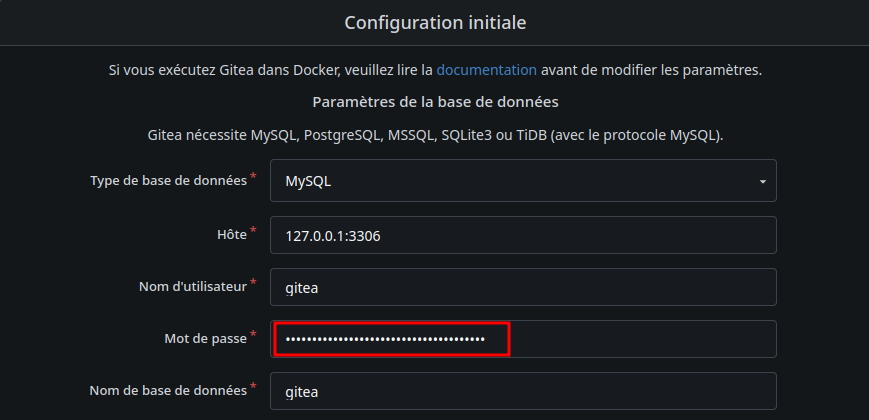  
Le nom d'utilisateur et le mot de passe fournis doivent correspondre à ceux fournis dans la section **Créer base gitea**

Définir les paramètres généraux de l'application  
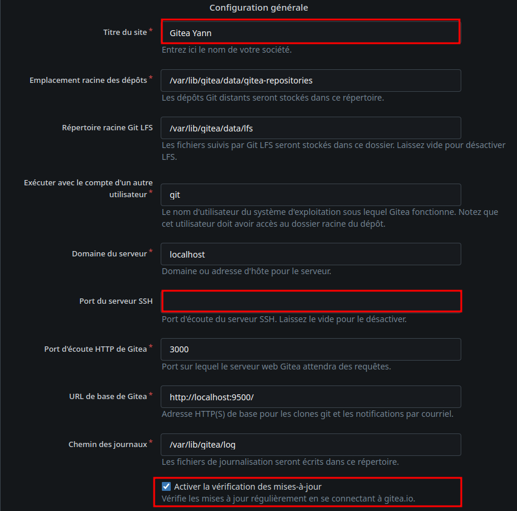  

créer un compte utilisateur administrateur  
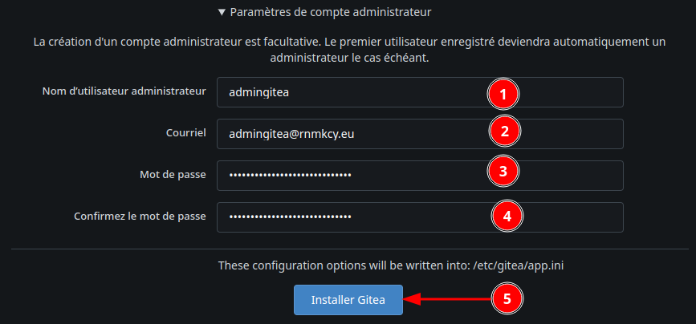  

Fournir les informations de votre base de données Gitea, l'URL, le nom d'utilisateur administrateur, le mot de passe et cliquez sur le bouton **Installer Gitea**. Vous devriez voir le tableau de bord Gitea   
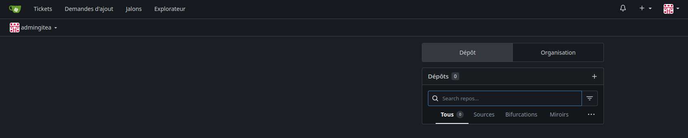  

### Gitea Proxy Nginx

Nginx est installé  
Le domaine utilisé: gitea.rnmkcy.eu  

Créer un fichier de configuration : `/etc/nginx/conf.d/gitea.rnmkcy.eu.conf`  

```nginx
server {
    listen 80;
    listen [::]:80;
    server_name  gitea.rnmkcy.eu;

    # redirect all plain HTTP requests to HTTPS
    return 301 https://gitea.rnmkcy.eu$request_uri;
}

server {
    # ipv4 listening port/protocol
    listen       443 ssl http2;
    # ipv6 listening port/protocol
    listen           [::]:443 ssl http2;
    server_name  gitea.rnmkcy.eu;
    client_max_body_size 100M;
    include /etc/nginx/conf.d/security.conf.inc;

  location / { 
      proxy_pass              http://127.0.0.1:3000;
  } 

}
```

Vérifier : `sudo nginx -t` et recharger nginx

    sudo systemctl reload nginx

Accès lien <https://gitea.rnmkcy.eu>  
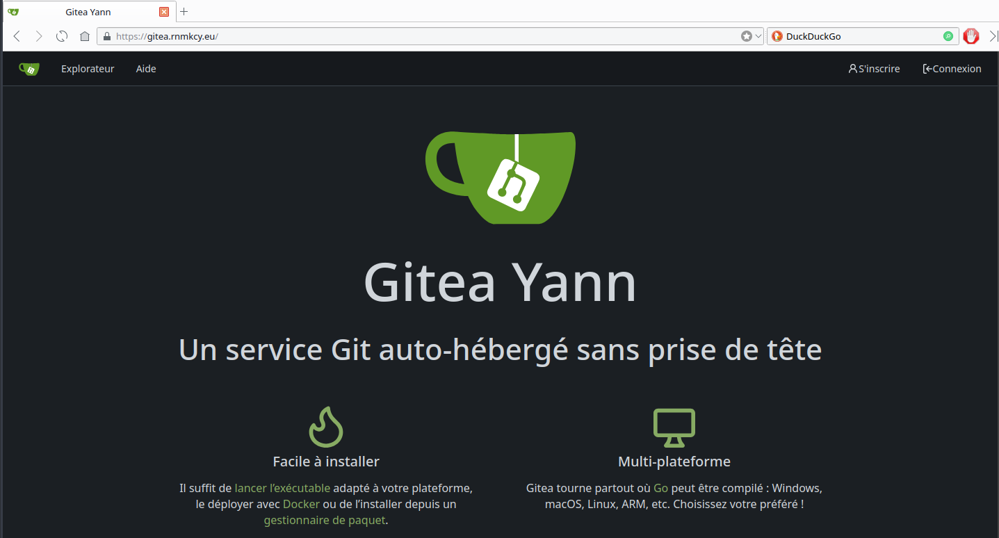  

Se connecter avec "admingitea"  
  
Pour corriger , ouvrir le fichier `/etc/gitea/app.ini` et modier la ligne suivante  

```
ROOT_URL = https://gitea.rnmkcy.eu
```

On interdit également aux utilisateurs non reconnus de créer un compte

```
DISABLE_REGISTRATION = true
```

Relancer le service : `sudo systemctl restart gitea`

## Gitea LLDAP

Dans Gitea, aller à "Administration du site", "Identité et accès", "Sources d'authentification" et cliquer sur  "Ajouter une source d'authentication"  
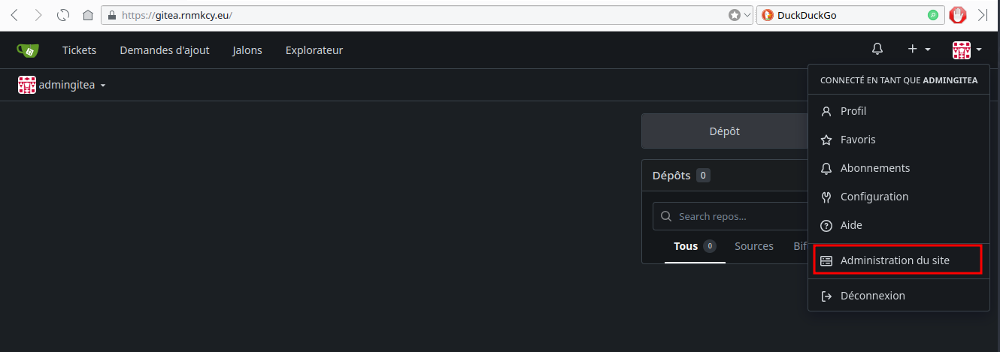  
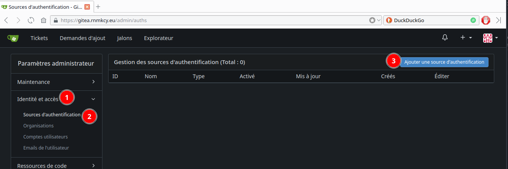  


Sélectionner `LDAP (via BindDN)`

* Host: Le ip/hostname de votre serveur lldap
* Port: Port de votre serveur lldap (3890 par défaut)
* Bind DN: `uid=admin,ou=people,dc=rnmkcy,dc=eu`
* Bind Mot de passe : Le mot de passe de votre admin lldap
* Base de recherche utilisateur: `ou=people,dc=rnmkcy,dc=eu`
* Filtre utilisateur: Si vous voulez que tous les utilisateurs puissent se connecter, utilisez  
`(&(objectClass=person)(|(uid=%[1]s)(mail=%[1]s)))`  
Pour se connecter, ils peuvent utiliser leur adresse e-mail ou leur nom d'utilisateur.  
Si vous voulez seulement des membres un groupe spécifique pour être en mesure de se connecter, dans ce cas le groupe `git_user`, utiliser  
`(&(memberof=cn=git_user,ou=groups,dc=rnmkcy,dc=eu)(|(uid=%[1]s)(mail=%[1]s)))`  
Pour plus d'informations sur le filtre, voir: <https://docs.gitea.io/en-us/authentication/#ldap-via-binddn>
* Filtre Admin (facultatif): Utiliser `(memberof=cn=lldap_admin,ou=groups,dc=rnmkcy,dc=eu)` si vous voulez que les administrateurs lldap deviennent des administrateurs Gitea. Laissez vide sinon.

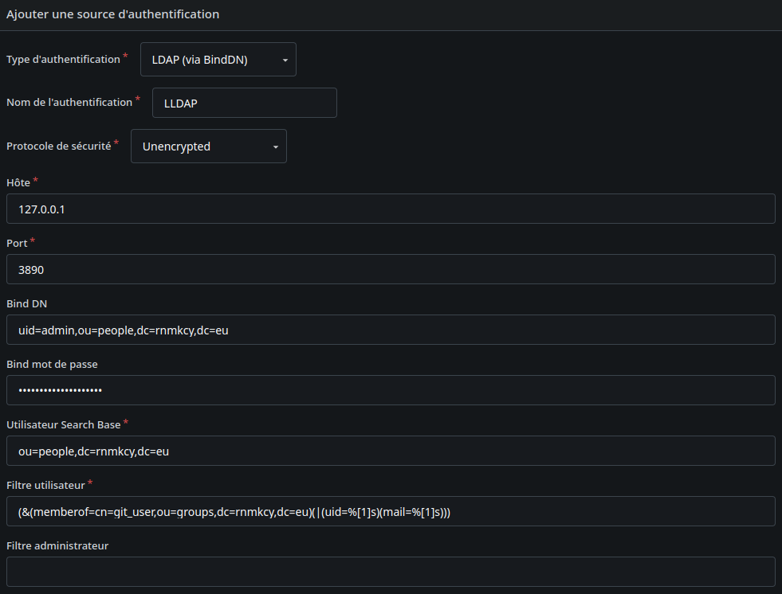  

* Attribut nom d'utilisateur: `uid `
* Attribut Prénom: `givenName `
* Attribut Nom de famille : `sn`
* Email Attribute: `mail `
* Avatar Attribute: `jpegPhoto `

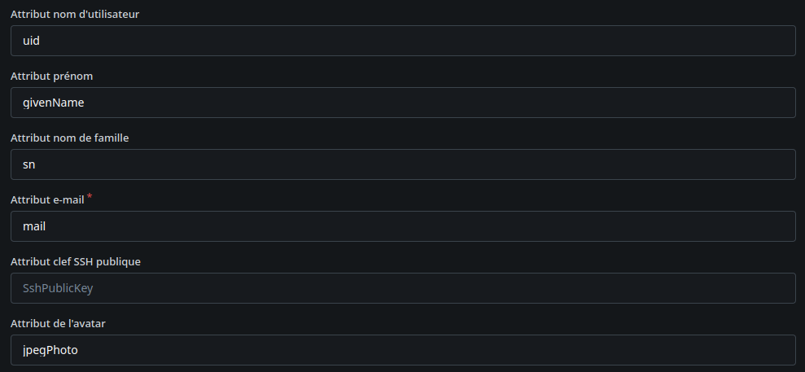  

Au final  
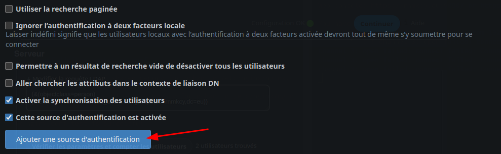  
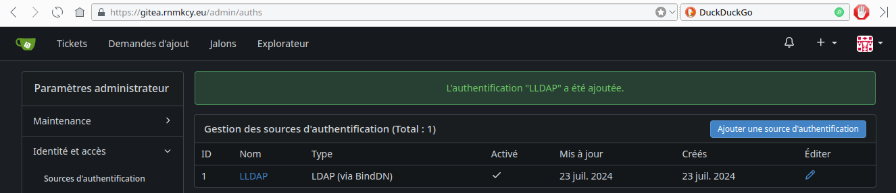  

Après avoir appliqué les paramètres ci-dessus, les utilisateurs devraient être en mesure de se connecter avec leur adresse email.

## Gitea SSH

*Configurer un compte Gitea avec une clé SSH fournit un niveau de sécurité aux interactions avec le serveur.* 

### Générer une clé

Générer une clé SSH dans un terminal

    ssh-keygen -t ed25519 -o -a 100 -f $HOME/.ssh/gitea-yann-ssh

Inclure une "passphrase" ajoute une couche supplémentaire de sécurité.

Copier dans le presse-papier le contenu de la clé publique `$HOME/.ssh/gitea-yann-ssh.pub`

```
ssh-ed25519 AAAAC3NzaC1lZDI1NTE5AAAAIGdV5acwJ/g/PnkpsmrJhjWBTnk90s2phY8GKN4hqqrZ yann@yann-pc1
```

### Tableau de bord

Se connecter au compte Gitea.  
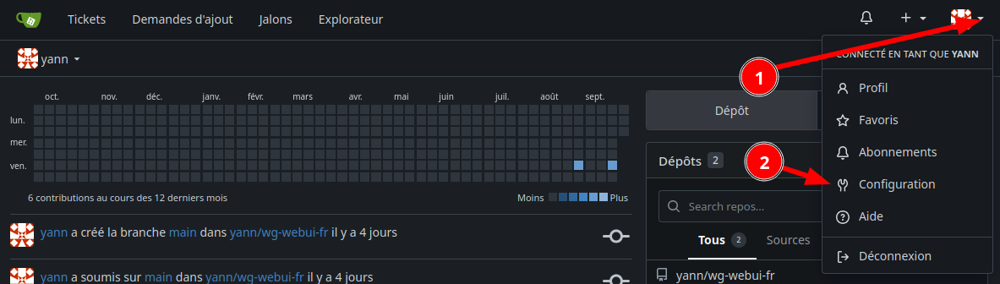  

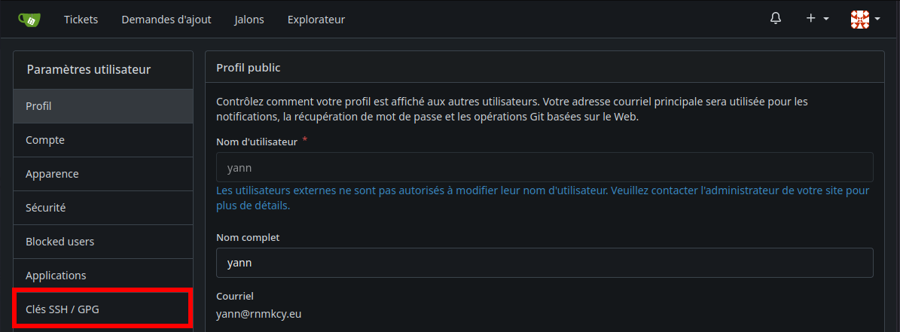  

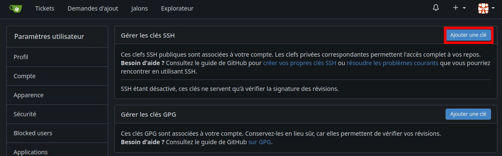  

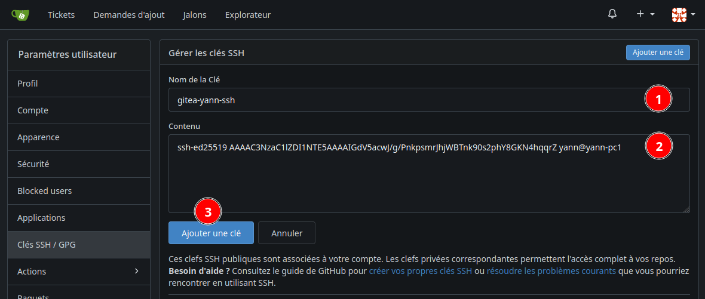  

1. Saisir un nom pour la clé 
2. Coller le contenu de la clé publique  

### Vérification clé SSH

Ensuite, vous devez vérifier votre clé SSH avec Gitea.  
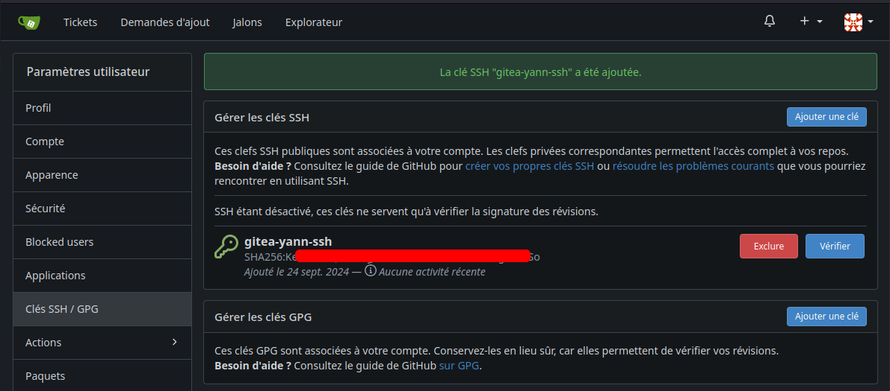  
Pour commencer la vérification, cliquez sur le bouton "Vérifier"   
Veuillez noter qu’une fois que vous commencerez le processus de vérification, vous devrez le terminer relativement rapidement sinon redémarrer le processus de vérification.  
  

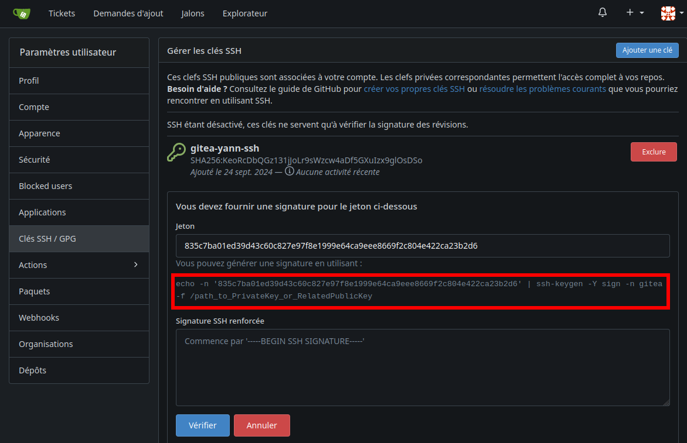  

```bash
# commande à saisir sur le poste qui détient le jeu de clé
echo -n '456ca79a71d4999cba05ec0a3272a243e69825b326477e24c49ac69ea67f7faf' | ssh-keygen -Y sign -n gitea -f $HOME/.ssh/gitea-yann-ssh.pub
```

Vous obtenez une signature que vous copiez et collez dans la zone **"Signature SSH renforcée"**

```
-----BEGIN SSH SIGNATURE-----
U1NIU0lHAAAAAQAAADMAAAALc3NoLWVkMjU1MTkAAAAgZ1XlpzAn+D8+eSmyasmGNYFOeT
3SzamFjwYo3iGqqtkAAAAFZ2l0ZWEAAAAAAAAABnNoYTUxMgAAAFMAAAALc3NoLWVkMjU1
MTkAAABAnF3dBivmgrkIWaXXXIId8L7+1G6Ds6eZKRGkMpgYZ/CbdbmqMpFIien1GUlaUn
fMPRjvVK6aT7eEeGD1mu+aBw==
-----END SSH SIGNATURE-----
```

Puui cliquer sur **"Vérifier"**

Après vérification  
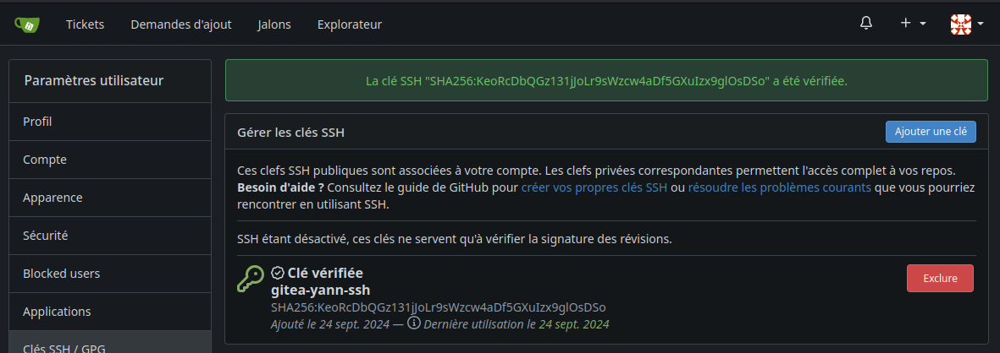  

## Gitea authentification

Activation autorisation par clé matérielle Yubico

Se onnecter sur gitea <https://gitea.rnmkcy.eu> dans le panneau de configuration  
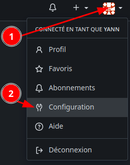{:width="200"}

Ajouter les clés matérielles (au minimun 2 pour éviter un problème en cas de perte ou dégradation)  
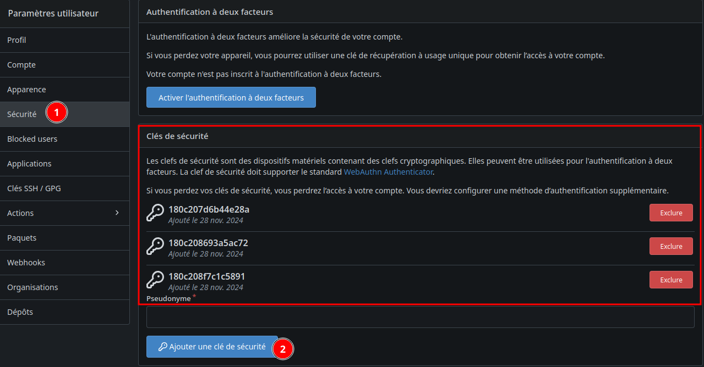

Connexion, après saisie nom et mot de passe  


Après avoir effleurer la zone tactile de la clé  
  
vous arrivez sur la page d'acceuil de gitea

## Git (local)

### Utilitaires Git - Stockage des identifiants

[Utilitaires Git - Stockage des identifiants](https://git-scm.com/book/fr/v2/Utilitaires-Git-Stockage-des-identifiants)

Stockage des identifiants

Avec les protocoles HTTP ‑ toute connexion nécessite un nom d’utilisateur et un mot de passe. Cela devient même plus difficile avec des systèmes à authentification à deux facteurs, où le mot de passe utilisé est généré dynamiquement au hasard et devient imprononçable.

Heureusement, Git dispose d’un système de gestion d’identifiants qui peut faciliter cette gestion. Git propose de base quelques options :

*    Par défaut, rien n’est mis en **cache**. Toutes les connexions vous demanderont votre nom d’utilisateur et votre mot de passe.
*    Le mode **« cache »** conserve en mémoire les identifiants pendant un certain temps. Aucun mot de passe n’est stocké sur le disque et les identifiants sont oubliés après 15 minutes.
*    Le mode **« store »** sauvegarde les identifiants dans un fichier texte simple sur le disque, et celui-ci <u>n’expire jamais</u>. Ceci signifie que tant que vous ne changerez pas votre mot de passe sur le serveur Git, vous n’aurez plus à entrer votre mot de passe. Le défaut de cette approche est que vos mots de passe sont stockés en clair dans un fichier texte dans votre répertoire personnel.


Vous pouvez choisir une de ces méthodes en paramétrant une valeur de configuration Git :

    git config --global credential.helper cache

Certains de ces assistants ont des options. L’assistant « store » accepte un argument **`--file <chemin>`** qui permet de personnaliser l’endroit où le fichier texte est sauvegardé (par défaut, c’est **`~/.git-credentials)`**.  
L’assistant cache accepte une option **`--timeout <secondes>`** qui modifie la période de maintien en mémoire (par défaut, 900, soit 15 minutes).  
Voici un exemple de configuration de l’option **« store »** avec un nom de fichier personnalisé :

    git config --global credential.helper 'store --file ~/.my-credentials'

Git vous permet même de configurer plusieurs assistants. Lors de la recherche d’identifiants pour un serveur donné, Git les interrogera dans l’ordre jusqu’à la première réponse. Pour la sauvegarde des identifiants, Git enverra le nom d’utilisateur et le mot de passe à tous les assistants et ceux-ci pourront choisir ce qu’ils en font. Voici à quoi ressemblerait un .gitconfig si vous utilisiez un fichier d’identifiants sur une clé USB mais souhaiteriez utiliser l’option de cache pour éviter des frappes trop fréquentes si la clé n’est pas insérée.

```
[credential]
    helper = store --file /mnt/thumbdrive/.git-credentials
    helper = cache --timeout 30000
```
