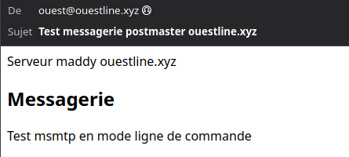

+++
title = 'Serveur de messagerie maddy configuration multi domaine'
date = 2024-12-02 00:00:00 +0100
categories = ['messagerie']
+++
*Maddy Mail Server met en œuvre toutes les fonctionnalités requises pour faire fonctionner un serveur de courrier électronique. Il peut envoyer des messages via SMTP (fonctionne comme MTA), accepter des messages via SMTP (fonctionne comme MX) et stocker des messages tout en y donnant accès via IMAP. En outre, il met en œuvre des protocoles auxiliaires qui sont obligatoires pour assurer une sécurité raisonnable du courrier électronique (DKIM, SPF, DMARC, DANE, MTA-STS).  
Il remplace Postfix, Dovecot, OpenDKIM, OpenSPF, OpenDMARC et d'autres encore par un seul démon avec une configuration uniforme et un coût de maintenance minimal.*

## Maddy Mail Server multi domaine

{:height="100"}

### Installation

*Mise en place un serveur de messagerie utilisant maddy*

* [Maddy mail server](https://maddy.email/tutorials/setting-up/)

### Configuration de plusieurs domaines

**Par défaut, maddy utilise les adresses e-mail comme identifiants de compte à des fins d'authentification et de stockage**.  
Par conséquent, le compte nommé **user@xoyize.net** est complètement indépendant de **user@ouestline.xyz**.  
Ils doivent être créés séparément, peuvent avoir des informations d'identification différentes et avoir des boîtes aux lettres IMAP distinctes.

Cela rend extrêmement facile la configuration de Maddy pour gérer plusieurs domaines autrement indépendants.

Le fichier de configuration par défaut contient deux macros - __`$(primary_domain)`__ et __`$(local_domains)`__. Ils sont utilisés à plusieurs endroits du fichier pour configurer le routage des messages, les contrôles de sécurité, etc.

En général, vous devez simplement ajouter tous les domaines que vous souhaitez que Maddy gère __`$(local_domains)`__, comme ceci :

```
$(primary_domain) = xoyize.net
$(local_domains) = $(primary_domain) ouestline.xyz
```

Notez que vous devez choisir un domaine comme « principal » à utiliser dans les messages générés automatiquement.
{: .prompt-info }

Cela fait, vous pouvez créer des comptes en utilisant les deux domaines dans le nom, envoyer et recevoir des messages, etc...   
`N'oubliez pas de configurer les enregistrements SPF, DMARC et MTA-STS correspondants`{: .prompt-warning }.

Notez également que vous n'avez pas vraiment besoin d'un certificat TLS distinct pour chaque domaine géré. Vous pouvez avoir un nom d'hôte, par exemple **mail.xoyize.net**, défini comme enregistrement MX pour plusieurs domaines.

<u>Si vous voulez que plusieurs domaines partagent l'espace de nom d'utilisateur</u> , vous devez modifier plusieurs options supplémentaires.

Vous pouvez faire en sorte que les utilisateurs **"user@xoyize.net"** et **"user@ouestline.xyz"** partagent les mêmes informations d'identification de l'utilisateur **"user"** mais aient des boîtes aux lettres IMAP différentes (**"user@xoyize.net"** et **"user@ouestline.xyz"** en conséquence. ). Pour cela, il suffit de définir globalement __`auth_map`__  sur `email_local part` :  

    auth_map email_localpart

De cette façon, lorsque l'utilisateur se connecte en tant que « user@xoyize.net », « user » sera transmis au fournisseur d'authentification, mais « user@xoyize.net » sera transmis au backend de stockage. Vous devez créer des comptes comme celui-ci :

    maddy creds create user
    maddy imap-acct create user@xoyize.net
    maddy imap-acct create user@ouestline.xyz

<u>Si vous souhaitez que les comptes partagent également le même stockage IMAP du compte nommé "user"</u> , vous pouvez définir `storage_map` dans le point de terminaison IMAP et `delivery_map` dans le backend de stockage l'utilisation `email_locapart` :

```
storage.imapsql local_mailboxes {
   ...
   delivery_map email_localpart # deliver "user@*" to "user"
}
imap tls://0.0.0.0:993 {
   ...
   storage &local_mailboxes
   ...
   storage_map email_localpart # "user@*" accesses "user" mailbox
}
```

Vous pouvez également souhaiter qu'il soit possible de <u>se connecter sans spécifier de domaine</u>.  
Dans ce cas, utilisez **email_localpart_optional** pour `auth_map` et `storage_map`.

Vous devez également faire en sorte que le contrôle `authorize_sender` (utilisé dans le point final de soumission) accepte les noms d'utilisateur qui ne sont pas des emails :

```
authorize_sender {
  ...
  user_to_email chain {
    step email_localpart_optional           # remove domain from username if present
    step email_with_domain $(local_domains) # expand username with all allowed domains
  }
}
```

### Résumé

Vos options :

**A - "user@xoyize.net" et "user@ouestline.xyz" ont des informations d'identification et des boîtes aux lettres distinctes.**

    $(primary_domain) = xoyize.net
    $(local_domains) = xoyize.net ouestline.xyz

Créez des comptes en tant que :

    maddy creds create user@xoyize.net
    maddy imap-acct create user@xoyize.net
    maddy creds create user@ouestline.xyz
    maddy imap-acct create user@ouestline.xyz

**B - "user@xoyize.net" et "user@ouestline.xyz" ont les mêmes informations d'identification mais des boîtes aux lettres distinctes.**

    $(primary_domain) = xoyize.net
    $(local_domains) = xoyize.net ouestline.xyz
    auth_map email_localpart

Créez des comptes en tant que :

    maddy creds create user
    maddy imap-acct create user@xoyize.net
    maddy imap-acct create user@ouestline.xyz

**C - "user@xoyize.net", "user@ouestline.xyz", "user" ont les mêmes informations d'identification et les mêmes boîtes aux lettres.**

```
   $(primary_domain) = xoyize.net
   $(local_domains) = xoyize.net ouestline.xyz
   auth_map email_localpart_optional # authenticating as "user@*" checks credentials for "user"

   storage.imapsql local_mailboxes {
      ...
      delivery_map email_localpart_optional # deliver "user@*" to "user" mailbox
   }

   imap tls://0.0.0.0:993 {
      ...
      storage_map email_localpart_optional # authenticating as "user@*" accesses "user" mailboxes
   }

   submission tls://0.0.0.0:465 {
      check {
        authorize_sender {
          ...
          user_to_email chain {
            step email_localpart_optional           # remove domain from username if present
            step email_with_domain $(local_domains) # expand username with all allowed domains
          }
        }
      }
      ...
   }
```

Créez des comptes en tant que :

    maddy creds create user
    maddy imap-acct create user

## Ajout domaine

*Ajout domaine ouestline.xyz au domaine existant par défaut xoyize.xyz*

### DNS ouestline.xyz

Enregistrement DNS MX pointe vers **mx1.xoyize.xyz**  

```
$TTL 3600
@	IN SOA dns111.ovh.net. tech.ovh.net. (2024120221 86400 3600 3600000 300)
        IN NS     ns111.ovh.net.
        IN NS     dns111.ovh.net.
        IN MX     10 mx1.xoyize.xyz
        IN A     158.220.91.148
        IN AAAA     2a02:c204:2231:478::1
        IN CAA     0 issue "letsencrypt.org"
*        IN A     158.220.91.148
*        IN AAAA     2a02:c204:2231:478::1
```

### Paramétrage maddy

Modifier le fichier de configuration `/etc/maddy/maddy.conf`

Ajouter tous les domaines que vous souhaitez que Maddy gère __`$(local_domains)`__, comme ceci :

```
$(primary_domain) = xoyize.xyz
$(local_domains) = $(primary_domain) ouestline.xyz
```

Notez que vous devez choisir un domaine comme « principal » à utiliser dans les messages générés automatiquement.
{: .prompt-info }

Vous pouvez créer des comptes en utilisant les deux domaines dans le nom, envoyer et recevoir des messages, etc...   
`N'oubliez pas de configurer les enregistrements SPF, DMARC et MTA-STS correspondants`{: .prompt-warning }.

Notez également que vous n'avez pas vraiment besoin d'un certificat TLS distinct pour chaque domaine géré. Vous pouvez avoir un nom d'hôte, par exemple **mx1.xoyize.xyz**, défini comme enregistrement MX pour plusieurs domaines.

### SPF, DMARC et MTA-STS domaine ouestline.xyz

Les enregistrements DNS

```
_dmarc        IN TXT     "v=DMARC1;p=quarantine;rua=mailto:postmaster@ouestline.xyz;"
# Générer un code alphanumérique de longueur 32 pour id
_mta-sts        IN TXT     "v=STSv1; id=RzW4KbrYuyd6mg4wAkbe9sH2YS2I78wY;"
_smtp._tls        IN TXT     "v=TLSRPTv1;rua=mailto:postmaster@ouestline.xyz"

```

Configuration finale DNS ouestline.xyz

```
$TTL 3600
@	IN SOA dns111.ovh.net. tech.ovh.net. (2024120223 86400 3600 3600000 300)
        IN NS     ns111.ovh.net.
        IN NS     dns111.ovh.net.
        IN MX     10 mx1.xoyize.xyz
        IN A     158.220.91.148
        IN AAAA     2a02:c204:2231:478::1
    600 IN TXT     "v=spf1 a mx -all"
        IN CAA     0 issue "letsencrypt.org"
*        IN A     158.220.91.148
*        IN AAAA     2a02:c204:2231:478::1
_dmarc        IN TXT     "v=DMARC1;p=quarantine;rua=mailto:postmaster@ouestline.xyz;"
_mta-sts        IN TXT     "v=STSv1; id=RzW4KbrYuyd6mg4wAkbe9sH2YS2I78wY;"
_smtp._tls        IN TXT     "v=TLSRPTv1;rua=mailto:postmaster@ouestline.xyz"
```

### Utilisateurs

L'exécution de `maddy creds --help` et `maddy imap-acct --help` peut s'avérer utile pour connaître les autres commandes.  

Créer l'utilisateur postmaster sans shell ni home

    sudo useradd ouest

Notez que les comptes IMAP et les identifiants sont gérés séparément, mais que les noms d'utilisateur doivent correspondre par défaut pour que les choses fonctionnent.

Ajout utilisateur local linux au serveur de messagerie et le stockage local

```bash
sudo -u maddy maddy creds create ouest@ouestline.xyz # on vous demande de saisir le mot de passe du compte
sudo -u maddy maddy imap-acct create ouest@ouestline.xyz
```

Liste des utilisateurs : `maddy creds list` et des stockages : `maddy imap-acct list`

```
sudo -u maddy maddy creds list
xouser@xoyize.xyz
xoyi@xoyize.xyz

sudo -u maddy maddy imap-acct list
xoyi@xoyize.xyz
xouser@xoyize.xyz
```


Ajouter au fichier alias `/etc/maddy/aliases`

```
postmaster@ouestline.xyz: ouest@ouestline.xyz
```


Redémarrer le service

    sudo systemctl restart maddy

### msmtp

*__msmtp__ est un client SMTP très simple et facile à configurer pour l'envoi de courriels. Son mode de fonctionnement par défaut consiste à transférer les courriels au serveur SMTP que vous aurez indiqué dans sa configuration*

Modifier le fichier de configuration pour y ajouter le domaine ouestline.xyz

Créer la configuration

```shell
cat << 'EOF' >> ~/.msmtprc
#
account ouestline
host mx1.xoyize.xyz
port 587
from ouest@ouestline.xyz
user ouest@ouestline.xyz
password xxxxxxxxxxxxxxxxxxxx
EOF
```

Le mot de passe postmaster est ajouté au fichier `~/.msmtprc`


**Les tests en une ligne de commande**

```bash
echo -e "Subject: Test messagerie postmaster ouestline.xyz\r\nMIME-Version: 1.0\nContent-Type: text/html; charset=utf-8\r\n\r\n \
<html><head>Serveur maddy ouestline.xyz </head><body> \
<h2>Messagerie</h2><p>Test msmtp en mode ligne de commande </p></body>" |msmtp --from=ouest@ouestline.xyz -t yanfi@yanfi.net
```

Message reçu sur yanfi.net  


## Ajout domaine cinay.eu

*Ajout domaine cinay.eu pour la messagerie (maddy) et le web (caddy)*

### DNS cinay.eu

Enregistrement DNS MX pointe vers **mx1.xoyize.xyz**  

```
$TTL 3600
@	IN SOA dns111.ovh.net. tech.ovh.net. (2024120221 86400 3600 3600000 300)
        IN NS     ns111.ovh.net.
        IN NS     dns111.ovh.net.
        IN MX     10 mx1.xoyize.xyz
        IN A     158.220.91.148
        IN AAAA     2a02:c204:2231:478::1
        IN CAA     0 issue "letsencrypt.org"
*        IN A     158.220.91.148
*        IN AAAA     2a02:c204:2231:478::1
```

### Modifier le paramétrage maddy

Modifier le fichier de configuration `/etc/maddy/maddy.conf`

Ajouter tous les domaines que vous souhaitez que Maddy gère __`$(local_domains)`__, comme ceci :

```
$(primary_domain) = xoyize.xyz
$(local_domains) = $(primary_domain) cinay.eu
```

Notez que vous devez choisir un domaine comme « principal » à utiliser dans les messages générés automatiquement.
{: .prompt-info }

Vous pouvez créer des comptes en utilisant les deux domaines dans le nom, envoyer et recevoir des messages, etc...   
`N'oubliez pas de configurer les enregistrements SPF, DMARC et MTA-STS correspondants`{: .prompt-warning }.

Notez également que vous n'avez pas vraiment besoin d'un certificat TLS distinct pour chaque domaine géré. Vous pouvez avoir un nom d'hôte, par exemple **mx1.xoyize.xyz**, défini comme enregistrement MX pour plusieurs domaines.

### SPF, DMARC et MTA-STS domaine cinay.eu

Les enregistrements DNS

```
_dmarc        IN TXT     "v=DMARC1;p=quarantine;rua=mailto:postmaster@cinay.eu;"
# Générer un code alphanumérique de longueur 32 pour id:
# tr -cd '[:alnum:]' < /dev/urandom | fold -w32 | head -n1
_mta-sts        IN TXT     "v=STSv1; id=kAEqO4mpFAubOToGX2p8n0NgPWPexIFj;"
    600 IN TXT     "v=spf1 a mx -all"
_smtp._tls        IN TXT     "v=TLSRPTv1;rua=mailto:postmaster@cinay.eu"

```

Configuration finale DNS cinay.eu

```
$TTL 3600
@	IN SOA dns111.ovh.net. tech.ovh.net. (2024120223 86400 3600 3600000 300)
        IN NS     ns111.ovh.net.
        IN NS     dns111.ovh.net.
        IN MX     10 mx1.xoyize.xyz
        IN A     158.220.91.148
        IN AAAA     2a02:c204:2231:478::1
    600 IN TXT     "v=spf1 a mx -all"
        IN CAA     0 issue "letsencrypt.org"
*        IN A     158.220.91.148
*        IN AAAA     2a02:c204:2231:478::1
_dmarc        IN TXT     "v=DMARC1;p=quarantine;rua=mailto:postmaster@cinay.eu;"
_mta-sts        IN TXT     "v=STSv1; id=kAEqO4mpFAubOToGX2p8n0NgPWPexIFj;"
_smtp._tls        IN TXT     "v=TLSRPTv1;rua=mailto:postmaster@cinay.eu"
```

### Utilisateurs cinay.eu

L'exécution de `maddy creds --help` et `maddy imap-acct --help` peut s'avérer utile pour connaître les autres commandes.  

Créer l'utilisateur postmaster sans shell ni home

    sudo useradd yack

Notez que les comptes IMAP et les identifiants sont gérés séparément, mais que les noms d'utilisateur doivent correspondre par défaut pour que les choses fonctionnent.

Ajout utilisateur local linux au serveur de messagerie et le stockage local

```bash
sudo -u maddy maddy creds create yack@cinay.eu # on vous demande de saisir le mot de passe du compte
sudo -u maddy maddy imap-acct create yack@cinay.eu
```

Liste des utilisateurs : `maddy creds list` et des stockages : `maddy imap-acct list`

```
sudo -u maddy maddy creds list |grep yack
yack@cinay.eu

sudo -u maddy maddy imap-acct list |grep yack
yack@cinay.eu
```

### Alias cinay.eu

Ajouter au fichier alias `/etc/maddy/aliases`

```
postmaster@cinay.eu: yack@cinay.eu
yann@cinay.eu: yack@cinay.eu
boproyan@cinay.eu: yack@cinay.eu
discord@cinay.eu: yack@cinay.eu
wg@cinay.eu: yack@cinay.eu
vps@cinay.eu: yack@cinay.eu
vpn@cinay.eu: yack@cinay.eu
yannick@cinay.eu: yack@cinay.eu
cnx@cinay.eu: yack@cinay.eu
yannick.meunier@cinay.eu: yack@cinay.eu
domo@cinay.eu: yack@cinay.eu
fubo@cinay.eu: yack@cinay.eu
iptv@cinay.eu: yack@cinay.eu
ign@cinay.eu: yack@cinay.eu
map@cinay.eu: yack@cinay.eu
debyan@cinay.eu: yack@cinay.eu
rnmkcy@cinay.eu: yack@cinay.eu
leno@cinay.eu: yack@cinay.eu
buyonrakuten@cinay.eu: yack@cinay.eu
```

Redémarrer le service

    sudo systemctl restart maddy

### Modification msmtp pour intégrer le domaine cinay.eu

*__msmtp__ est un client SMTP très simple et facile à configurer pour l'envoi de courriels. Son mode de fonctionnement par défaut consiste à transférer les courriels au serveur SMTP que vous aurez indiqué dans sa configuration*

Modifier le fichier de configuration pour y ajouter le domaine cinay.eu

Créer la configuration

```shell
cat << 'EOF' >> ~/.msmtprc
#
account cinay
host mx1.xoyize.xyz
port 587
from yack@cinay.eu
user yack@cinay.eu
password xxxxxxxxxxxxxxxxxxxx
EOF
```

Le mot de passe postmaster est ajouté au fichier `~/.msmtprc`


### Msmtp envoi message depuis cinay.eu en une ligne de commande 

```bash
echo -e "Subject: Test messagerie postmaster cinay.eu\r\nMIME-Version: 1.0\nContent-Type: text/html; charset=utf-8\r\n\r\n \
<html><head>Serveur maddy cinay.eu </head><body> \
<h2>Messagerie</h2><p>Test msmtp en mode ligne de commande </p></body>" |msmtp --from=yack@cinay.eu -t yanfi@yanfi.net
```

Message reçu sur yanfi.net  


### Serveur web cinay.eu (FACULTATIF)

**cinay.eu - index.html**

Créer dossier www (`WorkingDirectory=/var/caddy/www/xoyize.xyz`), y ajouter un fichier `index.html` 

```bash
sudo mkdir -p /var/caddy/www/cinay.eu
sudo touch /var/caddy/www/cinay.eu/index.html
echo "<h1>Serveur caddy cinay.eu</h1><h2>Dossier /var/caddy/www/cinay.eu/</h2>" | sudo tee -a /var/caddy/www/cinay.eu/index.html
```

**Modifier le fichier de configuration** __`/etc/caddy/Caddyfile`__  
Ajouter

```
cinay.eu {
    root cinay.eu
    encode gzip
    file_server
}
```

On elance le service caddy

    sudo systemctl restart caddy

On vérifie sur le lien <https://cinay.eu>  


