+++
title = 'Lenovo Serveur Debian 12 rnmkcy.eu'
date = 2024-12-10 00:00:00 +0100
categories = ['debian']
+++
*Serveur [Lenovo ThinkCentre M700 Tiny](/posts/Description_materiel_Lenovo_ThinkCentre_M700_Tiny_et_mise_a_jour_BIOS/ 'Description matériel') Debian 12 (bookworm), Ram 12 Go et SSD M.2 2280 500 Go*  


## Serveur Debian 12

{:height="100"} 

Installer avec clé USB contenant image ISO **debian-12.1.0-amd64-netinst.iso**  

Machine : think  
root : root49600  
leno : leno49600  

Disque SSD 500Go M.2  
Partitions LVM avec home séparé et 100Go utilisé  

La machine reboot à la fin de l'installation  
Se connecter avec l'utilisateur "leno"  
Relever l'adresse ip : `ip a` , exemple 192.168.0.11

Serveur SSH
Utilitaires usuels du système

On peut également se connecter via ssh : `ssh leno@192.168.0.11`  


Passer en `su` , installer sudo

    su
    apt install sudo
    echo "leno     ALL=(ALL) NOPASSWD: ALL" >> /etc/sudoers

Installer le module iwlwifi pour éviter les messages d'erreur dans le bios

    sudo apt install firmware-iwlwifi

Modifier les lignes suivantes le grub `/etc/default/grub`

```
# ajout loglevel=0
GRUB_CMDLINE_LINUX_DEFAULT="quiet loglevel=0"
# désactiver la recherche des autres OS
GRUB_DISABLE_OS_PROBER=true
```

Un redémarrage de la machine est obligatoire

Structure volume LVM

```
  VG        #PV #LV #SN Attr   VSize    VFree  
  think-vg    1   4   0 wz--n-  464,78g 221,65g

  LV        VG        Attr       LSize   Pool Origin Data%  Meta%  Move Log Cpy%Sync Convert
  home      think-vg  -wi-ao---- <64,24g                                                    
  root      think-vg  -wi-ao---- <27,94g                                                    
  swap_1    think-vg  -wi-ao---- 976,00m                                                    
```

### Réseau 

#### Ip V4 statiques

configurer une adresse IPv4 en statique  

    nano /etc/network/interfaces

```
auto eno1
iface eno1 inet static
    address 192.168.0.215
    netmask 255.255.255.0
    gateway 192.168.0.254
```

#### Ip V6 statiques

On active ou pas IPV6

**Activer IPV6**

Pour le nexthop IPV6 FreeBox

    ip a |grep "inet6 fe80"

*inet6 fe80::223:24ff:fec9:686/64 scope link*

Paramètres de la Freebox, Configuration IPV6 &rarr; Délégation de préfixe  
Préfixe : 2a01:e0a:9c8:2082::/64  
Next Hop : fe80::223:24ff:fec9:686  
Adresse IPv- lien local : fe80::8e97:eaff:fe39:66d6

Ajout IPV6

```
auto eno1
iface eno1 inet static
    address 192.168.0.215
    netmask 255.255.255.0
    gateway 192.168.0.254

iface eno1 inet6 static
 address 2a01:e0a:9c8:2082::1
 netmask 64
 post-up ip -6 route add default via fe80::8e97:eaff:fe39:66d6 dev eno1
```

**Désactiver IPV6**

Pour un focntionnement correct de la messagerie, il faut désactiver IPV6 car le DNS reverse n'est pas géré

OVH - Supprimer les liens IPV6 sur le domaine rnmkcy.eu  
Les lignes à supprimer dans la zone dns  

```
         IN AAAA   2a01:e0a:9c8:2080:64de:1eff:fe0e:f3eb
*        IN AAAA   2a01:e0a:9c8:2080:64de:1eff:fe0e:f3eb
```

Désactiver IPV6 sur debian 12 [(How to Disable IPv6 on Debian 12)](https://itslinuxfoss.com/disable-ipv6-debian-12/)  
Désactiver l'IPv6 sur Debian 12 à l'aide de la configuration sysctl

Modifier le fichier de configuration sysctl

    sudo nano /etc/sysctl.conf

Ajouter les lignes suivantes en fin de fichier

```
# Disabling the IPv6
net.ipv6.conf.all.disable_ipv6 = 1
net.ipv6.conf.default.disable_ipv6 = 1
net.ipv6.conf.lo.disable_ipv6 = 1
```

Appliquer les modifications

    sudo sysctl -p

Redémarrer l'ordinateur

    sudo reboot

Vérifier le status IPV6

    sudo sysctl net.ipv6.conf.all.disable_ipv6

*net.ipv6.conf.all.disable_ipv6 = 1*

*Le « 1 » indique que l'IPv6 a été désactivé avec succès.  Pour réactiver l'IPv6 sur Debian 12, ouvrez le fichier de configuration sysctl et supprimez la ligne ajoutée.*

#### Bridge Ip V4 V6 (OPTION)

Adresse mac interface eno1

    ip address show dev eno1 | awk '$1=="link/ether" {print $2}'

`00:23:24:c9:06:86`

Installer le logiciel bridge-utils 

    apt install bridge-utils

FreeBox DMZ `192.168.0.215` pour un accès IPV4 depuis l'extérieur  
FreeBox nexthop IPV6 

    ip a |grep "inet6 fe80"

*inet6 fe80::223:24ff:fec9:686/64 scope link*

Passage en ip statique 192.168.0.215 et 2a01:e0a:9c8:2081::1 (nexthop `fe80::223:24ff:fec9:686`)   	
lien local box : fe80::8e97:eaff:fe39:66d6

Modifier l'interface

    nano /etc/network/interfaces

```
auto lo
iface lo inet loopback

iface eno1 inet manual

auto br0
iface br0 inet static
    address 192.168.0.215
    netmask 255.255.255.0
    gateway 192.168.0.254

    bridge_ports eno1
    bridge_stp off       # disable Spanning Tree Protocol
    bridge_waitport 0    # no delay before a port becomes available
    bridge_fd 0          # no forwarding delay

#iface br0 inet6 static
#    address 2a01:e0a:9c8:2081::1
#    netmask 64
#    gateway fe80::8e97:eaff:fe39:66d6
#    autoconf 0
```

Vérifier le dns

    /etc/resolv.conf 

```
nameserver 1.1.1.1
nameserver 192.168.0.254
```

Un redémarrage de la machine pour la prise en compte : `systemctl reboot`

Connexion sur l'adresse ip fixe

```bash
# IPV6
ssh leno@2a01:e0a:9c8:2081::1  
# IPV4 
ssh leno@192.168.0.215
```

Vérification des adresses IP

    ip a

```
1: lo: <LOOPBACK,UP,LOWER_UP> mtu 65536 qdisc noqueue state UNKNOWN group default qlen 1000
    link/loopback 00:00:00:00:00:00 brd 00:00:00:00:00:00
    inet 127.0.0.1/8 scope host lo
       valid_lft forever preferred_lft forever
    inet6 ::1/128 scope host noprefixroute 
       valid_lft forever preferred_lft forever
2: eno1: <BROADCAST,MULTICAST,UP,LOWER_UP> mtu 1500 qdisc fq_codel master br0 state UP group default qlen 1000
    link/ether 00:23:24:c9:06:86 brd ff:ff:ff:ff:ff:ff
    altname enp0s31f6
3: br0: <BROADCAST,MULTICAST,UP,LOWER_UP> mtu 1500 qdisc noqueue state UP group default qlen 1000
    link/ether 66:de:1e:0e:f3:eb brd ff:ff:ff:ff:ff:ff
    inet 192.168.0.215/24 brd 192.168.0.255 scope global br0
       valid_lft forever preferred_lft forever
    inet6 2a01:e0a:9c8:2080:64de:1eff:fe0e:f3eb/64 scope global dynamic mngtmpaddr 
       valid_lft 86106sec preferred_lft 86106sec
    inet6 fe80::64de:1eff:fe0e:f3eb/64 scope link 
       valid_lft forever preferred_lft forever
```

#### Redémarrage

Pour prendre en compte les modifications de la configuration réseau

    systemctl reboot

### Hostname

    sudo hostnamectl set-hostname rnmkcy.eu
    hostnamectl

```
 Static hostname: rnmkcy.eu
       Icon name: computer-desktop
         Chassis: desktop 🖥️
      Machine ID: 11ae731552174ae5b2dd4c60ac8fa88c
         Boot ID: e59a1b2d79d040fab620c797a19a636e
Operating System: Debian GNU/Linux 12 (bookworm)  
          Kernel: Linux 6.1.0-16-amd64
    Architecture: x86-64
 Hardware Vendor: Lenovo
  Hardware Model: ThinkCentre M700
Firmware Version: FWKTBCA
```

### Date et heure

    timedatectl

```
               Local time: ven. 2023-12-15 16:20:37 CET
           Universal time: ven. 2023-12-15 15:20:37 UTC
                 RTC time: ven. 2023-12-15 15:20:36
                Time zone: Europe/Paris (CET, +0100)
System clock synchronized: yes
              NTP service: active
          RTC in local TZ: no
```

### Groupe "users"

Vérifier si utilisateur appartient au groupe "users" : `id leno`  

```
uid=1000(leno) gid=1000(leno) groupes=1000(leno),24(cdrom),25(floppy),29(audio),30(dip),44(video),46(plugdev),100(users),106(netdev)
```

Si non appartenance, exécuter : `sudo usermod -a -G users $USER`

Pour visualiser tous les messages de journal, ajouter l'utilisateur au groupe existant **adm** 

    sudo usermod -a -G adm $USER

### OpenSSH, clé et script

{:width="70"}  

<u>Générer une paire de clé sur l'ordinateur de bureau PC1</u>  
Générer une paire de clé curve25519-sha256 (ECDH avec Curve25519 et SHA2) pour une liaison SSH avec le serveur.  

    ssh-keygen -t ed25519 -o -a 100 -f ~/.ssh/lenovo-ed25519

Envoyer les clés publiques sur le serveur lenovo  

    ssh-copy-id -i ~/.ssh/lenovo-ed25519.pub leno@192.168.0.215

<u>On se connecte sur le serveur debian 12</u>  

    ssh leno@192.168.0.215

Modifier la configuration serveur SSH  

    sudo nano /etc/ssh/sshd_config

Modifier

```conf
Port = 55215
PasswordAuthentication no
```

Relancer le serveur

    sudo systemctl restart sshd

Test connexion

    ssh -p 55215 -i ~/.ssh/lenovo-ed25519 leno@192.168.0.215

### Utilitaires

Installer utilitaires  

    sudo apt install rsync curl tmux jq figlet git

### Motd

Effacer et créer motd

    sudo rm /etc/motd && sudo nano /etc/motd

```
  _                                __  __  ____  __    __  
 | |    ___  _ _   ___ __ __ ___  |  \/  ||__  |/  \  /  \ 
 | |__ / -_)| ' \ / _ \\ V // _ \ | |\/| |  / /| () || () |
 |____|\___||_||_|\___/ \_/ \___/ |_|  |_| /_/  \__/  \__/ 
  _____  _     _        _     ___            _             
 |_   _|| |_  (_) _ _  | |__ / __| ___  _ _ | |_  _ _  ___ 
   | |  | ' \ | || ' \ | / /| (__ / -_)| ' \|  _|| '_|/ -_)
   |_|  |_||_||_||_||_||_\_\ \___|\___||_||_|\__||_|  \___|
  _  ___  ___     _   __  ___     __     ___  _  ___       
 / |/ _ \|_  )   / | / / ( _ )   /  \   |_  )/ || __|      
 | |\_, / / /  _ | |/ _ \/ _ \ _| () |_  / / | ||__ \      
 |_| /_/ /___|(_)|_|\___/\___/(_)\__/(_)/___||_||___/      
```

Script ssh_rc_bash

>ATTENTION!!! Les scripts sur connexion peuvent poser des problèmes pour des appels externes autres que ssh

```bash
wget https://static.xoyize.xyz/files/ssh_rc_bash
chmod +x ssh_rc_bash # rendre le bash exécutable
./ssh_rc_bash        # exécution
```

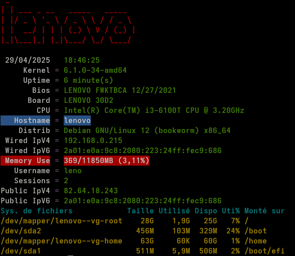

### Parefeu UFW

{:width="50"} 

*UFW, ou pare - feu simple , est une interface pour gérer les règles de pare-feu dans Arch Linux, Debian ou Ubuntu. UFW est utilisé via la ligne de commande (bien qu'il dispose d'interfaces graphiques disponibles), et vise à rendre la configuration du pare-feu facile.*

Installation **Debian / Ubuntu**

    sudo apt install ufw

*Par défaut, les jeux de règles d'UFW sont vides, de sorte qu'il n'applique aucune règle de pare-feu, même lorsque le démon est en cours d'exécution.*   

Les règles 

```bash
sudo ufw allow 55215/tcp  # port SSH
sudo ufw allow https      # port 443
```

Activer le parefeu

    sudo ufw enable

```
Command may disrupt existing ssh connections. Proceed with operation (y|n)? y
Firewall is active and enabled on system startup
```

Status

     sudo ufw status verbose

```
Status: active
Logging: on (low)
Default: deny (incoming), allow (outgoing), disabled (routed)
New profiles: skip

To                         Action      From
--                         ------      ----
55215/tcp                  ALLOW IN    Anywhere                  
443                        ALLOW IN    Anywhere                  
55215/tcp (v6)             ALLOW IN    Anywhere (v6)             
443 (v6)                   ALLOW IN    Anywhere (v6)             
```

désactiver la journalisation

    sudo ufw logging off

### Fail2ban

[Installer et configurer Fail2ban + UFW sur Debian 11](/posts/Debian_11_Fail2ban_UFW/)

    sudo apt install fail2ban

Configuration `/etc/fail2ban/jail.local`

```
[DEFAULT]
# Debian 12 has no log files, just journalctl
backend = systemd
logtarget = SYSTEMD-JOURNAL
bantime = 720m # How long to block an abusive IP
findtime = 120m # Time period to check the connections
maxretry = 3 # Within the above time period, block the abusive IP if the number of the abusive IP connections reaches the maxretry
banaction = ufw
banaction_allports = ufw
destemail = rnmkcy@rnmkcy.eu
sender = rnmkcy@rnmkcy.eu
ignoreip = 127.0.0.1/8 ::1 192.168.0.0/24 # Ignore these IP, Hosts, IP ranges during operation

[sshd]
# To use more aggressive sshd modes set filter parameter "mode" in jail.local:
# normal (default), ddos, extra or aggressive (combines all).
# See "tests/files/logs/sshd" or "filter.d/sshd.conf" for usage example and details.
#mode   = normal
enabled = true
port    = 55215
logpath = %(sshd_log)s
backend = %(sshd_backend)s
bantime = 60h
maxretry = 3
```

Relancer

    sudo systemctl restart fail2ban

Tester fail2ban  
[Using Fail2Ban for SSH Brute-force Protection](https://www.linode.com/docs/guides/how-to-use-fail2ban-for-ssh-brute-force-protection/)

Depuis un VPS, on va essayer de se connecter sur rnmkcy.eu via ssh

```
yann@xoyaz:~$ ssh riri@rnmkcy.eu -p 55215
riri@rnmkcy.eu: Permission denied (publickey).
yann@xoyaz:~$ ssh riri@rnmkcy.eu -p 55215
riri@rnmkcy.eu: Permission denied (publickey).
yann@xoyaz:~$ ssh riri@rnmkcy.eu -p 55215
riri@rnmkcy.eu: Permission denied (publickey).
yann@xoyaz:~$ ssh riri@rnmkcy.eu -p 55215
ssh: connect to host rnmkcy.eu port 55215: Connection refused
```

Comme vous pouvez le voir dans la sortie ci-dessus, après trois échecs consécutifs, Fail2Ban bloque activement la connexion SSH. Après trois échecs consécutifs, la connexion est interrompue et l'utilisateur est bloqué pendant la durée spécifiée. Si vous essayez de vous connecter à nouveau pendant la période de blocage, vous obtenez une erreur "Connexion refusée" et vous n'êtes pas en mesure d'établir une connexion SSH au serveur.

Pour afficher l'état et les informations concernant une prison particulière comme sshd, vous pouvez utiliser la commande suivante 

    sudo fail2ban-client status sshd

```
Status for the jail: sshd
|- Filter
|  |- Currently failed:	0
|  |- Total failed:	3
|  `- Journal matches:	_SYSTEMD_UNIT=sshd.service + _COMM=sshd
`- Actions
   |- Currently banned:	4
   |- Total banned:	4
   `- Banned IP list:	109.123.254.249 2a02:7b40:c3b5:f29c::1 2a02:c206:2108:3749::1 195.181.242.156
```

### Ajout disque SSD

* [Ajout disque stockage SSD](/posts/Ajout_disque_stockage_SSD/)

### Envoi message via postfix 

`NE PAS UTILISER CETTE SOLUTION SI UN SERVEUR DE MESSAGERIE DOIT ETRE INSTALLE`{: .prompt-warning }

{:height="100"}  

*On va configurer Postfix afin qu’il puisse être utilisé pour envoyer des notifications par e-mail uniquement par les applications locales installées sur le même serveur que Postfix*

* [Envoi de message - Installer et configurer Postfix comme serveur SMTP d'envoi uniquement](/posts/Debian_Postfix_serveur_SMTP_envoi_uniquement/)

Installer mailutils `sudo apt install mailutils`  
et postfix `sudo apt install postfix    `  
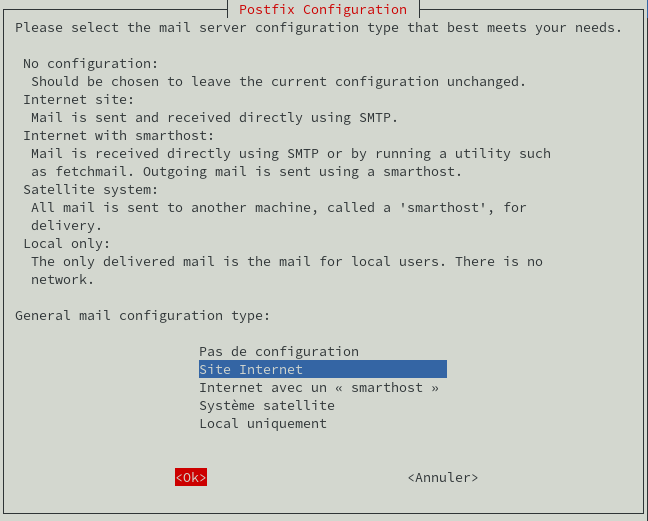{:height="250"}  
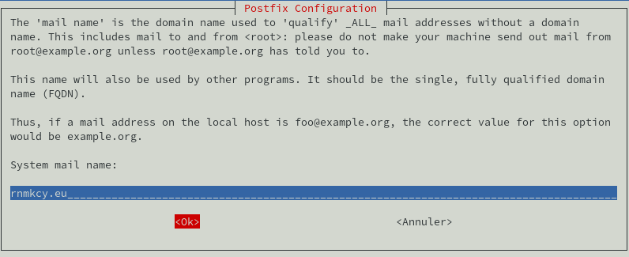{:height="150"}

Les modifications dans le fichier `/etc/postfix/main.cf`  
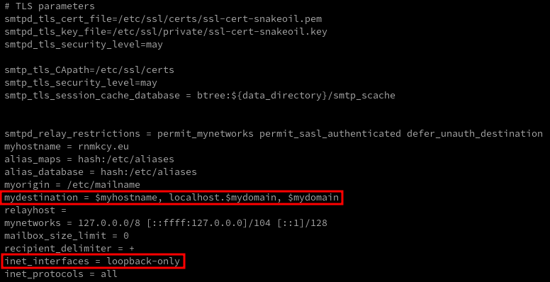

redémarrez Postfix.

    sudo systemctl restart postfix 

Test

    echo "Test envoi via postfix smtp" | mail -s "serveur debian 12" leno@yanfi.net

### Historique ligne de commande

Ajoutez la recherche d’historique de la ligne de commande au terminal  
Se connecter en utilisateur debian  
Tapez un début de commande précédent, puis utilisez shift + up (flèche haut) pour rechercher l’historique filtré avec le début de la commande.

```bash
# Global, tout utilisateur
echo '"\e[1;2A": history-search-backward' | sudo tee -a /etc/inputrc
echo '"\e[1;2B": history-search-forward' | sudo tee -a /etc/inputrc
```

### Erreurs 

Les erreurs dans le journal de boot

**Montage CIFS**  
Erreur relevée

```
oct. 09 16:27:12 rnmkcy.eu kernel: CIFS: VFS: Error connecting to socket. Aborting operation.
oct. 09 16:27:12 rnmkcy.eu kernel: CIFS: VFS: cifs_mount failed w/return code = -111
oct. 09 16:27:12 rnmkcy.eu systemd[1]: Failed to mount mnt-FreeUSB2To.mount - cifs mount script.
```

Il faut remplacer `allow-hotplug eno1` par `auto eno1` pour le réseau dans le fichier `/etc/network/interfaces`

### DNS et Certificats

{:width="30"}  

Domaine rnmkcy.eu

```dns
$TTL 3600
@	IN SOA dns110.ovh.net. tech.ovh.net. (2023112301 86400 3600 3600000 300)
         IN NS     ns110.ovh.net.
         IN NS     dns110.ovh.net.
         IN A      82.64.18.243
         IN AAAA   2a01:e0a:9c8:2080:64de:1eff:fe0e:f3eb
         IN CAA    128 issue "letsencrypt.org"
*        IN A      82.64.18.243
*        IN AAAA   2a01:e0a:9c8:2080:64de:1eff:fe0e:f3eb
```

Valider la DMZ sur la freebox  
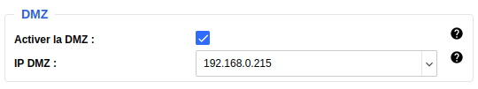

Domaine ouestline.xyz

```dns
$TTL 3600
@	IN SOA dns111.ovh.net. tech.ovh.net. (2024022709 86400 3600 3600000 300)
        IN NS     ns111.ovh.net.
        IN NS     dns111.ovh.net.
        IN AAAA   2a01:e0a:9c8:2080:64de:1eff:fe0e:f3eb
        IN A      82.64.18.243
*        IN AAAA  2a01:e0a:9c8:2080:64de:1eff:fe0e:f3eb
*        IN A     82.64.18.243
```

**Certificats Let's Encrypt**  
* [Serveur , installer et renouveler les certificats SSL Let's encrypt via Acme](/posts/Acme-Certficats-Serveurs/)

Les dossiers

```bash
sudo mkdir -p /etc/ssl/private/
sudo chown $USER -R /etc/ssl/private/
```

Installer acme

```
cd ~
sudo apt install socat -y # prérequis
#git clone https://github.com/Neilpang/acme.sh.git
git clone https://github.com/acmesh-official/acme.sh.git
cd acme.sh
./acme.sh --install 
# déconnexion et reconnexion utilisateur
```

La création des certificats pour le domaine rnmkcy.eu 
Exporter les clés OVH

    acme.sh --dns dns_ovh --server letsencrypt --issue --keylength ec-384 -d 'rnmkcy.eu' -d '*.rnmkcy.eu'

L'installation dans les dossiers locaux

```bash
acme.sh --ecc --install-cert -d rnmkcy.eu --key-file /etc/ssl/private/rnmkcy.eu-key.pem --fullchain-file /etc/ssl/private/rnmkcy.eu-fullchain.pem
```

La création des certificats pour le domaine ouestline.xyz 
Exporter les clés OVH

    acme.sh --dns dns_ovh --server letsencrypt --issue --keylength ec-384 -d 'ouestline.xyz' -d '*.ouestline.xyz'

L'installation dans les dossiers locaux

```bash

acme.sh --ecc --install-cert -d ouestline.xyz --key-file /etc/ssl/private/ouestline.xyz-key.pem --fullchain-file /etc/ssl/private/ouestline.xyz-fullchain.pem
```

### ACL - Multimedia

Installation acl

    sudo apt install acl

Création groupe et dossier multimedia

```bash
# Script de création des dossiers multimédia

GROUPE_MEDIA=multimedia
DOSSIER_MEDIA=/sharenfs/multimedia

## Création du groupe multimedia
sudo groupadd -f $GROUPE_MEDIA

## Création des dossiers génériques
sudo mkdir -p "$DOSSIER_MEDIA"
sudo mkdir -p "$DOSSIER_MEDIA/Music"
sudo mkdir -p "$DOSSIER_MEDIA/Picture"
sudo mkdir -p "$DOSSIER_MEDIA/Video"
sudo mkdir -p "$DOSSIER_MEDIA/eBook"
sudo mkdir -p "$DOSSIER_MEDIA/Divers"

## Application des droits étendus sur le dossier multimedia.
# Droit d'écriture pour le groupe et le groupe multimedia en acl et droit de lecture pour other:
sudo setfacl -RnL -m g:$GROUPE_MEDIA:rwX,g::rwX,o:r-X "$DOSSIER_MEDIA"
# Application de la même règle que précédemment, mais par défaut pour les nouveaux fichiers.
sudo setfacl -RnL -m d:g:$GROUPE_MEDIA:rwX,g::rwX,o:r-X "$DOSSIER_MEDIA"
# Réglage du masque par défaut. Qui garantie (en principe...) un droit maximal à rwx. Donc pas de restriction de droits par l'acl.
sudo setfacl -RL -m m::rwx "$DOSSIER_MEDIA"
```

Ajout utilisateurs + nextcloud au groupe multimedia

    sudo usermod -a -G multimedia leno
    sudo usermod -a -G multimedia yann
    sudo usermod -a -G multimedia nextcloud

Les droits

    getfacl --omit-header /sharenfs/multimedia/

```
getfacl : suppression du premier « / » des noms de chemins absolus
user::rwx
group::rwx
group:multimedia:rwx
mask::rwx
other::r-x
default:user::rwx
default:group::rwx
default:group:multimedia:rwx
default:mask::rwx
default:other::r-x
```

### Partages 

#### Samba FreeUSB2To (Freebox)

*Partage disque USB 2To monté sur FreeboX*

1. [Accés partage samba depuis linux](/posts/Partage_disque_externe_USB_sur_Freebox/#accés-partage-samba-depuis-linux)
2. [Montage linux du disque USB Freebox](/posts/Partage_disque_externe_USB_sur_Freebox/#montage-linux-du-disque-usb-freebox)

**Résumé**  
Partage : //192.168.0.254/FreeUSB2To  
Point de montage local : `sudo mkdir -p /mnt/FreeUSB2To`  
Outil cifs : `sudo apt install cifs-utils`  
Utlisateur mot de passe:  `/root/.smbcredentials`

Deux options de montage, via fstab ou systemd.mount

A-Montage via fstab (Défaut)

Ajout de la ligne suivante au fichier /etc/fstab

    //192.168.0.254/FreeUSB2To /mnt/FreeUSB2To cifs _netdev,x-systemd.after=network-online.target,noexec,nosuid,vers=3.0,uid=1000,gid=1000,credentials=/root/.smbcredentials 0 0

Recharger

    sudo systemctl daemon-reload
    sudo mount -a

B-Montage avec systemd automount, `/etc/systemd/system/mnt-FreeUSB2To.mount` 

```
[Unit]
  Description=cifs mount script
  Requires=network-online.target
  After=network-online.service

[Mount]
  What=//192.168.0.254/FreeUSB2To
  Where=/mnt/FreeUSB2To
  Options=credentials=/root/.smbcredentials,rw,uid=1000,gid=1000,vers=3.0
  Type=cifs

[Install]
  WantedBy=multi-user.target
```

`/etc/systemd/system/mnt-FreeUSB2To.automount`

```
[Unit]
  Description=cifs mount script
  Requires=network-online.target
  After=network-online.service

[Automount]
  Where=/mnt/FreeUSB2To
  TimeoutIdleSec=10

[Install]
  WantedBy=multi-user.target
```

Lancement et activation

    sudo systemctl enable mnt-FreeUSB2To.automount --now

Vérifier : `ls /mnt/FreeUSB2To/`

**Lien**

    ln -s /mnt/FreeUSB2To/ /home/leno/FreeUSB2To

#### nfs-ssd

Créer un volume logique LVM de 300G EXT4 sur `ssd1tovg`

```bash
sudo lvcreate -L 300G -n nfs-ssd ssd1tovg
sudo mkfs.ext4 /dev/ssd1tovg/nfs-ssd
```

Relever UUID : `sudo blkid |grep "nfs--ssd"`  
UUID="dceb7362-f0e1-480d-92ba-2078b9938208"

Point de montage et droits utilisateur ID=1000

```
sudo mkdir -p /mnt/nfs-ssd
sudo chown -R $USER:$USER -R /mnt/nfs-ssd
```

Ajout au fichier `/etc/fstab`

```
#  /dev/mapper/ssd1tovg-nfs--ssd
UUID=dceb7362-f0e1-480d-92ba-2078b9938208 /mnt/nfs-ssd ext4    defaults        0       2
```

Recharger et monter

```bash
sudo systemctl daemon-reload
sudo mount -a
```

#### NFS sharenfs

[NFS (Network File System), partages réseau linux](/posts/NFS/)

**Liens**

    ln -s /sharenfs/ /home/leno/sharenfs
    ln -s /sharenfs/scripts/ /home/leno/scripts


**Ajout au serveur NFS d'un partage de 300Go**  
Ajouter les systèmes de fichiers dans le fichier d'exportation `/etc/exports` du serveur NFS afin de déterminer les systèmes de fichiers locaux exportés vers les clients NFS.

Le fichier comporte des commentaires indiquant la structure générale de chaque ligne de configuration. La syntaxe est la suivante :  
`directory_to_share    client(share_option1,...,share_optionN)`

Ouvrir le fichier d'exportation avec votre éditeur de texte

    sudo nano /etc/exports

Ajouter la ligne suivante au contenu existant

```
/mnt/nfs-ssd 192.168.0.0/24(rw,sync,no_all_squash,root_squash,no_subtree_check)
```

Vous devrez créer une ligne pour chacun des répertoires que vous prévoyez de partager.  
Le fichier au 11 octobre 2024  

```
/sharenfs   192.168.0.0/24(rw,no_root_squash,no_subtree_check)
/mnt/nfs-ssd 192.168.0.0/24(rw,sync,no_all_squash,root_squash,no_subtree_check)
```

Exportation

    sudo exportfs -arv

Avec le résultat suivant

```
exporting 192.168.0.0/24:/mnt/nfs-ssd
exporting 192.168.0.0/24:/sharenfs
```

**Lien**

    ln -s /mnt/nfs-ssd/ /home/leno/nfs-ssd

#### Stockage 2To USB3toNvme (NEW)

*Stockage USB3-Nvme 2To ext4*
Le SSD Nvme 2To est connecté USB 3 sur /dev/sdd

Créer un point de montage

    sudo mkdir -p /mnt/USB3toNvme

Relever UUID : `sudo blkid |grep sdd`

```
/dev/sdd1: UUID="0afcbea4-38cb-4d00-bcc7-57a8531f8dd8" BLOCK_SIZE="4096" TYPE="ext4" PARTLABEL="Linux filesystem" PARTUUID="5a6aac94-b9b6-4793-bd68-fd9e56b9adb3"
```

Il faut garder à l'esprit que cette procédure ne fonctionne que pour les clés USB connectées au système au démarrage.

La méthode recommandée et la plus fiable consiste à **utiliser l'identifiant universel unique (UUID)** . L'UUID est généralement un numéro de 128 bits utilisé pour identifier de manière unique les disques afin que le noyau les mappe à l'emplacement exact du nœud.  

1. Nous devons spécifier que nous utilisons l'UUID dans le fichier `/etc/fstab` :  
`UUID=0afcbea4-38cb-4d00-bcc7-57a8531f8dd8 /mnt/USB3toNvme auto defaults,nofail,x-systemd.automount 0 2`
2. **Le deuxième élément de la commande est le point de montage** `/mnt/USB3toNvme`
3. Si nous le savons, nous pouvons spécifier **le type du système de fichiers dans le troisième élément** (par exemple FAT32 ou exFAT). Cependant, si nous ne le savons pas, nous pouvons toujours utiliser l' option **auto**
4. **Le quatrième élément est la liste des options** . Nous spécifions celles par défaut suivies de **nofail** (utilisé pour éviter de signaler des échecs) et `x-system.automount` (dont nous avons besoin pour demander à systemd de monter automatiquement le périphérique). Nous pouvons spécifier d'autres options si nous le souhaitons, à l'exception de noauto , qui empêche le montage automatique du lecteur.
5. **Le cinquième élément indique si nous souhaitons effectuer une vérification pour vider les fichier**s. Il est généralement défini sur 0 pour ne pas l'effectuer.
6. **Le sixième élément est l'ordre dans lequel le noyau vérifie les systèmes de fichiers au démarrage** . Pour les périphériques root, la valeur est 1 mais pour notre clé USB, elle devrait être 2 .

Recharger et monter

    sudo systemctl daemon-reload 
    sudo mount /dev/sdd1 /mnt/USB3toNvme

#### Stockage 2To USB3toNvme (OLD)

*Stockage USB3-Nvme 2To ext4*
Le SSD Nvme 2To est connecté USB 3 sur /dev/sdc  

En mode su

Le nouveau SSD Nvme 2To est connecté USB 3 sur /dev/sdc  
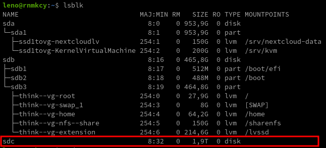

Créer les nouvelles partitions

    gdisk /dev/sdc

```
GPT fdisk (gdisk) version 1.0.9

Partition table scan:
  MBR: not present
  BSD: not present
  APM: not present
  GPT: not present

Creating new GPT entries in memory.

Command (? for help): n
Partition number (1-128, default 1): 
First sector (34-4000797326, default = 2048) or {+-}size{KMGTP}: 
Last sector (2048-4000797326, default = 4000796671) or {+-}size{KMGTP}: 
Current type is 8300 (Linux filesystem)
Hex code or GUID (L to show codes, Enter = 8300): 
Changed type of partition to 'Linux filesystem'

Command (? for help): w

Final checks complete. About to write GPT data. THIS WILL OVERWRITE EXISTING
PARTITIONS!!

Do you want to proceed? (Y/N): Y
OK; writing new GUID partition table (GPT) to /dev/sdc.
The operation has completed successfully.
```

Vérification  
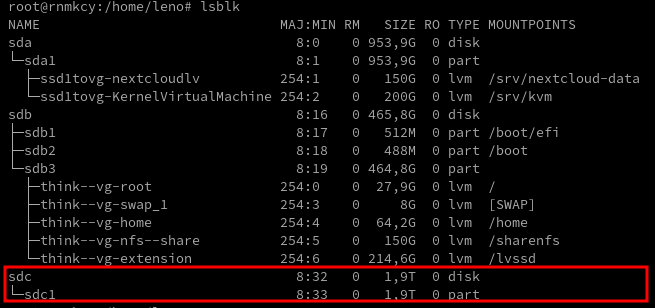

    
Formater la partition ext4

```shell
mkfs.ext4 /dev/sdc1
```

UUID partition /dev/sdc1

```shell
blkid |grep "/dev/sdc1"
```

Résultat commande 

```
/dev/sdc1: UUID="0afcbea4-38cb-4d00-bcc7-57a8531f8dd8" BLOCK_SIZE="4096" TYPE="ext4" PARTLABEL="Linux filesystem" PARTUUID="5a6aac94-b9b6-4793-bd68-fd9e56b9adb3"
```

Création point de montage

    mkdir /mnt/USB3toNvme

Fstab

```
# USB3toNvme 2To ext4 
UUID=0afcbea4-38cb-4d00-bcc7-57a8531f8dd8 /mnt/USB3toNvme      ext4    defaults        0       2
```

Montage

```shell
systemctl daemon-reload
mount -a
```

Vérification

    df -h /mnt/USB3toNvme/

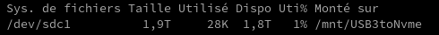

Droits utilisateur leno

    sudo chown $USER:$USER -R /mnt/USB3toNvme

Lien

    sudo ln -s /mnt/USB3toNvme $HOME/USB3toNvme 

**ACL USB3toNvme**  
Accès au dossier `/mnt/USB3toNvme` controlé par acl et le groupe multimedia

```shell
# Script de création des dossiers multimédia

GROUPE_MEDIA=multimedia
DOSSIER_MEDIA=/mnt/USB3toNvme

## Création du groupe multimedia
#sudo groupadd -f $GROUPE_MEDIA

## Création des dossiers génériques
sudo mkdir -p "$DOSSIER_MEDIA"

## Application des droits étendus sur le dossier multimedia.
# Droit d'écriture pour le groupe et le groupe multimedia en acl et droit de lecture pour other:
sudo setfacl -RnL -m g:$GROUPE_MEDIA:rwX,g::rwX,o:r-X "$DOSSIER_MEDIA"
# Application de la même règle que précédemment, mais par défaut pour les nouveaux fichiers.
sudo setfacl -RnL -m d:g:$GROUPE_MEDIA:rwX,g::rwX,o:r-X "$DOSSIER_MEDIA"
# Réglage du masque par défaut. Qui garantie (en principe...) un droit maximal à rwx. Donc pas de restriction de droits par l'acl.
sudo setfacl -RL -m m::rwx "$DOSSIER_MEDIA"
```

Les droits

    getfacl --omit-header /mnt/USB3toNvme

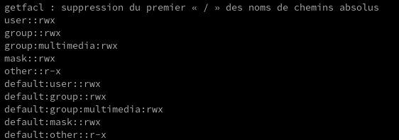

## Serveur de messagerie

### maddy

Arrêter et désactiver postfix (si installé)

    sudo systemctl stop postfix && sudo systemctl disable postfix

Suivre la procédure détaillée dans ce lien [Maddy Mail Server rnmkcy.eu](/posts/Serveur_messagerie_IMAP_SMTP_rnmkcy.eu/) 

`Le serveur de messagerie Maddy est configuré avec la gestion des utilisateurs par LLDAP`{: .prompt-info }

Le fichier de configuration : `$HOME/.msmtprc`

```
account yann_rnmkcy_eu
host mx1.rnmkcy.eu
port 587
from yann@rnmkcy.eu
user yann@rnmkcy.eu
password Mot_de_Passe_yann
#
account default : postmaster_maddy
```

Envoi message en ligne de commande via msmtp

```bash
echo -e "Subject: Test messagerie\r\nMIME-Version: 1.0\nContent-Type: text/; charset=utf-8\r\n\r\n \
/><head>Serveur maddy </head><body> \
<h2>Messagerie</h2><p>Test msmtp en mode ligne de commande </p></body>" |msmtp --from=yann@rnmkcy.eu -t yanfi@yanfi.net
```

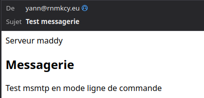

### Smtp acme

Définir les paramètres dns acme pour une notification par smtp dans `./bashrc`

```
export SMTP_FROM="postmaster@rnmkcy.eu"
export SMTP_TO="vpn@cinay.eu"
export SMTP_HOST="rnmkcy.eu"
export SMTP_PORT="587"
export SMTP_SECURE="tls"
export SMTP_USERNAME="postmaster@rnmkcy.eu"
export SMTP_PASSWORD="xxxxxxxxxxxxxxx"
export SMTP_BIN="/usr/bin/python3"
```

exécutez la commande suivante pour activer la notification smtp pour votre Let’s Encrypt lorsqu’un certificat est ignoré, renouvelé ou erroné. Par exemple :

    acme.sh --set-notify --notify-hook smtp

Résultat de la commande

```
[mar. 26 déc. 2023 14:46:06 CET] Set notify hook to: smtp
[mar. 26 déc. 2023 14:46:06 CET] Sending via: smtp
[mar. 26 déc. 2023 14:46:06 CET] smtp Success
```

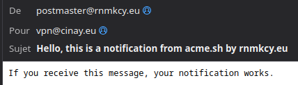

Modifier le script `echeance_certificat.sh` pour y inclure les paramètres `--set-notify --notify-hook smtp`

## Nextcloud

{:width="100"}  

### Installer nextcloud hub

[Nginx PHP MariaDB Nextcloud Hub](/posts/Nginx-PHP-MariaDB-Nextcloud_Hub/)

### Gestion Mail 

#### Mail Nextcloud

Si vous avez installé un serveur mail, installer at activer l'application **mail** de nextcloud  


Paramétrage en "Manuel"  
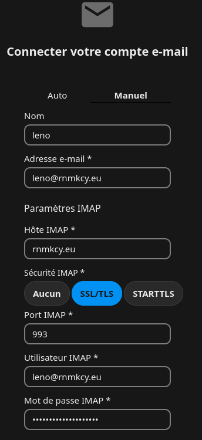{:width="200"} 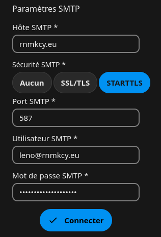{:width="200"}  

`ATTENTION : Hôtes IMAP et SMTP --> mx1.rnmkcy.eu`{: .prompt-danger }

Cliquer sur "Connecter"  
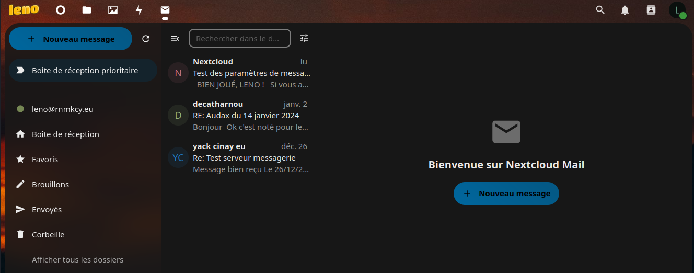

#### SnappyMail Nextcloud (INACTIF)

[SnappyMail Nextcloud](/posts/SnappyMail/#snappymail-nextcloud)

### Fail2ban Nextcloud

[Hardening and security guidance](https://docs.nextcloud.com/server/latest/admin_manual/installation/harden_server/#hardening-and-security-guidance)

*L'exposition de votre serveur à l'internet conduira inévitablement à l'exposition des services fonctionnant sur les ports exposés à l'internet à des tentatives de connexion par force brute.*

**Configurer un filtre et une prison pour Nextcloud**  

Un filtre définit des règles regex pour identifier les utilisateurs qui ne parviennent pas à s'authentifier sur l'interface utilisateur de Nextcloud, WebDAV, ou qui utilisent un domaine non fiable pour accéder au serveur.

Créer un fichier `/etc/fail2ban/filter.d/nextcloud.conf` avec le contenu suivant :

 
[Definition]
_groupsre = (?:(?:,?\s*"\w+":(?:"[^"]+"|\w+))*)
failregex = ^\{%(_groupsre)s,?\s*"remoteAddr":"<HOST>"%(_groupsre)s,?\s*"message":"Login failed:
            ^\{%(_groupsre)s,?\s*"remoteAddr":"<HOST>"%(_groupsre)s,?\s*"message":"Trusted domain error.
datepattern = ,?\s*"time"\s*:\s*"%%Y-%%m-%%d[T ]%%H:%%M:%%S(%%z)?"


Le fichier jail définit la manière de traiter les tentatives d'authentification échouées détectées par le filtre Nextcloud.

Créez un fichier `/etc/fail2ban/jail.d/nextcloud.local` avec le contenu suivant :

```
[nextcloud]
backend = auto
enabled = true
port = 80,443
protocol = tcp
filter = nextcloud
maxretry = 3
bantime = 86400
findtime = 43200
logpath = /srv/nextcloud-data/nextcloud.log
```

Veillez à remplacer logpath par l'emplacement nextcloud.log de votre installation. Si vous utilisez des ports autres que 80 et 443 pour votre serveur Web, vous devez également les remplacer. Les paramètres bantime et findtime sont définis en secondes.

Redémarrez le service fail2ban. 

    sudo systemctl restart fail2ban

Vous pouvez vérifier l'état de votre prison Nextcloud en exécutant :

    sudo fail2ban-client status nextcloud

Etat relevé

```
Status for the jail: nextcloud
|- Filter
|  |- Currently failed:	0
|  |- Total failed:	0
|  `- File list:	/srv/nextcloud-data/nextcloud.log
`- Actions
   |- Currently banned:	0
   |- Total banned:	0
   `- Banned IP list:	
```
### Partages Webdav (davfs2)

*davfs2 est un outil Linux permettant de se connecter à des partages WebDAV comme s'il s'agissait de disques locaux. Il s'agit d'un système de fichiers open-source sous licence GPL pour le montage de serveurs WebDAV.*

Vous pouvez créer un point de montage WebDAV en ligne de commande Linux. Ceci est utile si vous préferrez accéder à Nextcloud de la même manière que n’importe quel autre système de ficher distant. L’exemple suivant montre comment créer un point de montage personnel et activer sa connexion automatiquement à chaque fois que vous vous connectez à votre ordinateur Linux.
{: .prompt-info }

Installer le driver WebDAV davfs2, qui autorise le montage de partages WebDAV comme n’importe quel autre filesystem distant. Utilisez cette commande pour l’installer sur Debian/Ubuntu

    sudo apt install davfs2

Ajoutez vous dans le groupe davfs2

    sudo usermod -aG davfs2 $USER

Créez ensuite un répertoire nextcloud dans votre répertoire personnel pour le point de montage, et .davfs2/ pour votre fichier de configuration personnel

    mkdir ~/nextcloud
    mkdir ~/.davfs2

Copiez `/etc/davfs2/secrets` dans `~/.davfs2`

    sudo cp  /etc/davfs2/secrets ~/.davfs2/secrets

Mettez vous propriétaire avec les permissions read-write seulement

    sudo chown $USER:$USER ~/.davfs2/secrets
    chmod 600 ~/.davfs2/secrets

Ajoutez vos information de connexion Nextcloud à la fin du fichier secrets `~/.davfs2/secrets`, en mettant :

* Le point de montage : /home/leno/nextcloud
* identifiant : yann
* mot de passe de votre compte Nextcloud : Mot de passe application 'Webdav davfs2' 

Le fichier `~/.davfs2/secrets`

```
# Credential Line
# ---------------
# A credential line consists of the mount-point, the user-name and
# the password. The mount-point must be an absolute path, starting
# with /. The password may be omitted.
/home/leno/nextcloud yann mot_passe_application_nextcloud
```

`ATTENTION ,il faut créer un mot de passe application pour l'utilisateur yann dans nextcloud`{: .prompt-warning }

Ajouter l’information de montage dans `/etc/fstab` avec l'url d'accès aux dossiers de l'utilisateur yann --> https://cloud.rnmkcy.eu/remote.php/dav/files/5afdc712-b11f-305a-948f-195fa036d5a5/  

Ligne ajoutée en fin du fichier `/etc/fstab`

```
https://cloud.rnmkcy.eu/remote.php/dav/files/5afdc712-b11f-305a-948f-195fa036d5a5/ /home/leno/nextcloud davfs user,rw,auto 0 0
```

Recharger

    sudo systemctl daemon-reload

Ensuite testez le montage et l’authentification en exécutant la commande suivante. Si votre configuration est correcte, vous n’avez pas besoin de passer en mode root

    mount ~/nextcloud

Si vous rencontrez des problèmes lorsque vous créer un fichier dans le répertoire, éditez le fichier `/etc/davfs2/davfs2.conf` et ajoutez

    use_locks 0

Vous devriez aussi être capable de le démonter

    umount ~/nextcloud

Maintenant, chaque fois que vous vous connecterez à votre système Linux, votre partage Nextcloud devrait automatiquement se connecter via WebDAV dans votre répertoire ~/nextcloud . Si vous préférez le monter manuellement, remplacez **auto** par **noauto** dans `/etc/fstab`
{: .prompt-info }

`/home/leno/nextcloud` est monté avec les droits root  
Si l'on veut un montage avec des droits utilisateurs il faut ajouter `uid` et `gid`

Ligne modifiée en fin du fichier `/etc/fstab`

```
# uid=1000(leno) gid=1000(leno)
https://cloud.rnmkcy.eu/remote.php/dav/files/5afdc712-b11f-305a-948f-195fa036d5a5/ /home/leno/nextcloud davfs user,uid=1000,gid=1000,rw,auto 0 0
```

### Stockage externe (OPTION)

[KB450312 – Connecting SMB Share to Nextcloud](https://knowledgebase.45drives.com/kb/kb450312-connecting-smb-share-to-nextcloud/)

Installer le client samba

    sudo apt install smbclient

Activer application **External storage support**  
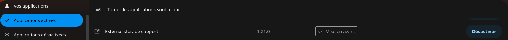

Accès thinkshare ,disque local /sharenfs au groupe **admin** seulement   
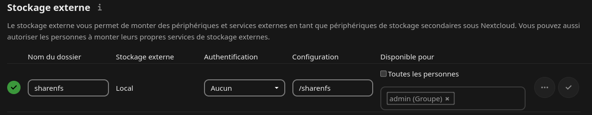

Accès FreeUSB2To sous-dossier Externe_Nextcloud ,disque samba connecté sur la freebox   
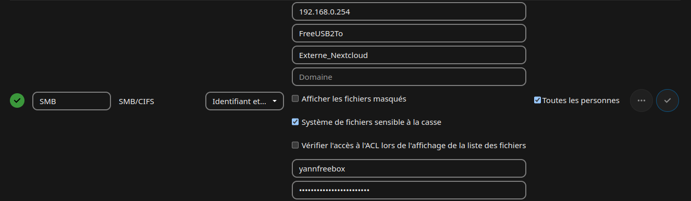

Quand on sélectionne le dossier Home, le readme.md est affiché et on peut le modifier ou le supprimer

### Sauvegarde Restauration

[Scripts Bash Sauvegarde-Restauration Nextcloud](/posts/Nginx-PHP-MariaDB-Nextcloud_Hub/#scripts-bash-sauvegarde-restauration-nextcloud)

Le fichier de configuration `~/Nextcloud-Backup-Restore`

<details>
<summary><b>Etendre Réduire</b></summary>
  
# Configuration for Nextcloud-Backup-Restore scripts

# TODO: The main backup directory
backupMainDir='/mnt/FreeUSB2To/sauvegardes/nextcloud_backup'

# TODO: Use compression for file/data dir
# When this is the only script for backups, it is recommend to enable compression.
# If the output of this script is used in another (compressing) backup (e.g. borg backup),
# you should probably disable compression here and only enable compression of your main backup script.
useCompression=false

# TOOD: The bare tar command for using compression while backup.
# Use 'tar -cpzf' if you want to use gzip compression.
compressionCommand='tar -cpzf'

# TOOD: The bare tar command for using compression while restoring.
# Use 'tar -xmpzf' if you want to use gzip compression.
extractCommand='tar -xmpzf'

# TODO: File names for backup files
fileNameBackupFileDir='nextcloud-filedir.tar'
fileNameBackupDataDir='nextcloud-datadir.tar'
fileNameBackupExternalDataDir=''
fileNameBackupDb='nextcloud-db.sql'

# TODO: The directory of your Nextcloud installation (this is a directory under your web root)
nextcloudFileDir='/var/www/nextcloud'

# The directory of your Nextcloud data directory (outside the Nextcloud file directory)
# If your data directory is located under Nextcloud's file directory (somewhere in the web root),
# the data directory will not be a separate part of the backup but included in the file directory backup.
nextcloudDataDir='/srv/nextcloud-data'

# TODO: The directory of your Nextcloud's local external storage.
# Uncomment if you use local external storage.
#nextcloudLocalExternalDataDir='/var/nextcloud_external_data'

# TODO: The service name of the web server. Used to start/stop web server (e.g. 'systemctl start <webserverServiceName>')
webserverServiceName='nginx'

# TODO: Your web server user
webserverUser='nextcloud'

# TODO: The name of the database system (one of: mysql, mariadb, postgresql)
# 'mysql' and 'mariadb' are equivalent, so when using 'mariadb', you could also set this variable to 'mysql' and vice versa.
databaseSystem='mysql'

# TODO: Your Nextcloud database name
nextcloudDatabase='nextcloud'

# TODO: Your Nextcloud database user
dbUser='nextcloud'

# TODO: The password of the Nextcloud database user
dbPassword='Mot_passe_base_mysql_nextcloud'

# TODO: The maximum number of backups to keep (when set to 0, all backups are kept)
maxNrOfBackups=5

# TODO: Setting to include/exclude the backup directory of the Nextcloud updater
# Set to true in order to include the backups of the Nextcloud updater
includeUpdaterBackups=false

# OPTIONAL: Setting to include/exclude the Nextcloud data directory
# Set to false to exclude the Nextcloud data directory from backup
# WARNING: Excluding the data directory is NOT RECOMMENDED as it leaves the backup in an inconsistent state and may result in data loss!
includeNextcloudDataDir=true

</details>

## rnmkcy.eu

Nginx, PHP et MariaDB ont été installés lors de la mise en place de Nextcloud  

### Dossier racine (rnmkcy.eu)

Création sur le disque partagé 

    mkdir -p /sharenfs/multimedia/Divers/{diceware,img,osm-new,site,static}

Les droits

    sudo chown leno:leno -R /sharenfs/multimedia/
    sudo chmod 775 -R /sharenfs/multimedia/

La topologie  
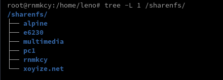

Déplacer le root du site rnmkcy.eu  
Création dossier : `mkdir /sharenfs/rnmkcy`  
Déplacement : `sudo mv /var/www/default-www /sharenfs/rnmkcy/racine/`  

Le fichier nginx `/etc/nginx/conf.d/rnmkcy.eu.conf`

```
server {
    listen 443 ssl http2;
    listen [::]:443 ssl http2;
    server_name rnmkcy.eu;

    include /etc/nginx/conf.d/security.conf.inc;

    root /sharenfs/rnmkcy/racine/ ;
        location / {
            index index.htm index/ index.php;
        }
  location ~ \.php(?:$|/) {
    include fastcgi_params;
    fastcgi_param SCRIPT_FILENAME $request_filename;
    fastcgi_split_path_info ^(.+\.php)(/.+)$;
    fastcgi_param HTTPS on;

    fastcgi_param modHeadersAvailable true;         # Avoid sending the security headers twice
    fastcgi_param front_controller_active true;     # Enable pretty urls
    fastcgi_param HTTP_ACCEPT_ENCODING "";          # Disable encoding of nextcloud response to inject ynh scripts
    fastcgi_pass unix:/var/run/php/php8.3-fpm.sock;
    fastcgi_intercept_errors on;
    fastcgi_request_buffering off;
  }

  include /etc/nginx/conf.d/rnmkcy.eu.d/*.conf;
}
```

Recharger : `sudo systemctl reload nginx`

### static site diceware et cartes (static.rnmkcy.eu)

Regroupe static site diceware et cartes

    /etc/nginx/conf.d/static.rnmkcy.eu.conf 

```
server {
    listen 443 ssl http2;
    listen [::]:443 ssl http2;
    server_name static.rnmkcy.eu;

    include /etc/nginx/conf.d/security.conf.inc;
    root /sharenfs/multimedia/Divers/static/;

    location / {
      index index.htm index/ index.php;
		  location ~ \.php(?:$|/) {
		    include fastcgi_params;
		    fastcgi_param SCRIPT_FILENAME $request_filename;
		    fastcgi_split_path_info ^(.+\.php)(/.+)$;
		    fastcgi_param HTTPS on;
		
		    fastcgi_param modHeadersAvailable true;         # Avoid sending the security headers twice
		    fastcgi_param front_controller_active true;     # Enable pretty urls
		    fastcgi_param HTTP_ACCEPT_ENCODING "";          # Disable encoding of nextcloud response to inject ynh scripts
		    fastcgi_pass unix:/var/run/php/php8.3-fpm.sock;
		    fastcgi_intercept_errors on;
		    fastcgi_request_buffering off;
		  }
    }
}

server {
    listen 443 ssl http2;
    listen [::]:443 ssl http2;
    server_name site.rnmkcy.eu;

    include /etc/nginx/conf.d/security.conf.inc;
    root /sharenfs/rnmkcy.eu/site/;

    location / {
      index index/ index.php /_h5ai/public/index.php;
		  location ~ \.php(?:$|/) {
		    include fastcgi_params;
		    fastcgi_param SCRIPT_FILENAME $request_filename;
		    fastcgi_split_path_info ^(.+\.php)(/.+)$;
		    fastcgi_param HTTPS on;
		
		    fastcgi_param modHeadersAvailable true;         # Avoid sending the security headers twice
		    fastcgi_param front_controller_active true;     # Enable pretty urls
		    fastcgi_param HTTP_ACCEPT_ENCODING "";          # Disable encoding of nextcloud response to in>
		    fastcgi_pass unix:/var/run/php/php8.3-fpm.sock;
		    fastcgi_intercept_errors on;
		    fastcgi_request_buffering off;
		  }
	}
}

server {
    listen 443 ssl http2;
    listen [::]:443 ssl http2;
    server_name dice.rnmkcy.eu;

    include /etc/nginx/conf.d/security.conf.inc;
    root /sharenfs/multimedia/Divers/diceware/;

    location / {
      index index.htm index/;
    }
}

server {
    listen 443 ssl http2;
    listen [::]:443 ssl http2;
    server_name osm.rnmkcy.eu;

    include /etc/nginx/conf.d/security.conf.inc;
    root /sharenfs/multimedia/Divers/osm-new/;

    location / {
      index index.htm index/ index.php;
		  location ~ \.php(?:$|/) {
		    include fastcgi_params;
		    fastcgi_param SCRIPT_FILENAME $request_filename;
		    fastcgi_split_path_info ^(.+\.php)(/.+)$;
		    fastcgi_param HTTPS on;
		
		    fastcgi_param modHeadersAvailable true;         # Avoid sending the security headers twice
		    fastcgi_param front_controller_active true;     # Enable pretty urls
		    fastcgi_param HTTP_ACCEPT_ENCODING "";          # Disable encoding of nextcloud response to inject ynh scripts
		    fastcgi_pass unix:/var/run/php/php8.3-fpm.sock;
		    fastcgi_intercept_errors on;
		    fastcgi_request_buffering off;
		  }
    }
}
```

Recharger : `sudo systemctl reload nginx`

Accès 

* <https://static.rnmkcy.eu> 
* <https://osm.rnmkcy.eu> 
* <https://dive.rnmkcy.eu> 
* <https://site.rnmkcy.eu>

### Shaarli (shaarli.rnmkcy.eu)

*[Shaarli](https://shaarli.readthedocs.io/en/master/), le service personnel, minimaliste, super rapide, sans base de données, signet.*

#### Installer Shaarli

Pour installer Shaarli, il suffit de placer les fichiers de la [dernière archive .zip](https://github.com/shaarli/Shaarli/releases) sous la racine du document de votre serveur web (directement à la racine du document, ou dans un sous-répertoire). Téléchargez l'archive shaarli-vX.X.X-full pour y inclure les dépendances.

```bash
wget https://github.com/shaarli/Shaarli/releases/download/v0.13.0/shaarli-v0.13.0-full.zip
unzip shaarli-v0.13.0-full.zip
sudo rsync -avP Shaarli/ /var/www/shaarli.rnmkcy.eu/
```

#### Définir les permissions de fichier

Quelle que soit la méthode d'installation, les autorisations de fichiers appropriées doivent être définies:

```bash
sudo chown -R root:www-data /var/www/shaarli.rnmkcy.eu
sudo chmod -R g+rX /var/www/shaarli.rnmkcy.eu
sudo chmod -R g+rwX /var/www/shaarli.rnmkcy.eu/{cache/,data/,pagecache/,tmp/}
```

#### nginx php-fpm

Installer si nécessaire nginx et php-fpm

    sudo apt install nginx php-fpm

Extensions PHP nécessaires  
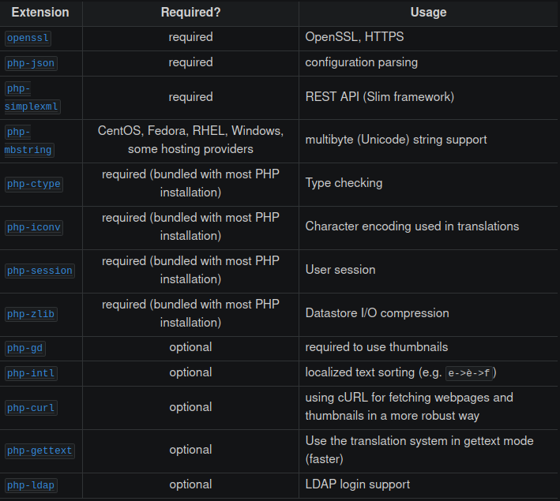

Installer

    sudo apt install php8.3-xml php8.3-common php8.3-gd php8.3-intl php8.3-curl php8.3-mbstring

Le fichier php fpm `/etc/php/8.2/fpm/pool.d/shaarli.conf`

```
[shaarli]

user = www-data
group = www-data

listen = /var/run/php/php8.3-fpm-shaarli.sock

listen.owner = www-data
listen.group = www-data

pm = dynamic
pm.max_children = 5
pm.start_servers = 2
pm.min_spare_servers = 1
pm.max_spare_servers = 3

; Default Value: current directory or / when chroot
chdir = /var/www/shaarli.rnmkcy.eu
```

Modifier le fichier de configuration de virtualhost

    sudo nano /etc/nginx/conf.d/shaarli.rnmkcy.eu.conf

```nginx
server {
    listen 80;
    listen [::]:80;
    server_name  shaarli.rnmkcy.eu;

    # redirect all plain HTTP requests to HTTPS
    return 301 https://shaarli.rnmkcy.eu$request_uri;
}

server {
    # ipv4 listening port/protocol
    listen       443 ssl http2;
    # ipv6 listening port/protocol
    listen           [::]:443 ssl http2;
    server_name  shaarli.rnmkcy.eu;
    root         /var/www/shaarli.rnmkcy.eu;

    # log file locations
    # combined log format prepends the virtualhost/domain name to log entries
    access_log  /var/log/nginx/access.log combined;
    error_log   /var/log/nginx/error.log;

    include /etc/nginx/conf.d/security.conf.inc;

    # increase the maximum file upload size if needed: by default nginx limits file upload to 1MB (413 Entity Too Large error)
    client_max_body_size 100m;

    # relative path to shaarli from the root of the webserver
    # if shaarli is installed in a subdirectory of the main domain, edit the location accordingly
    location / {
        # default index file when no file URI is requested
        index index.php;
        try_files _ /index.php$is_args$args;
    }

    location ~ (index)\.php$ {
        try_files $uri =404;
        # slim API - split URL path into (script_filename, path_info)
        fastcgi_split_path_info ^(.+\.php)(/.+)$;
        # pass PHP requests to PHP-FPM
        fastcgi_pass   unix:/var/run/php/php8.3-fpm-shaarli.sock;
        fastcgi_index  index.php;
        include        fastcgi.conf;
    }

    location ~ /doc// {
        default_type "text/";
        try_files $uri $uri/ $uri/ =404;
    }

    location = /favicon.ico {
        # serve the Shaarli favicon from its custom location
        alias /var/www/shaarli/images/favicon.ico;
    }

    # allow client-side caching of static files
    location ~* \.(?:ico|css|js|gif|jpe?g|png|ttf|oet|woff2?)$ {
        expires    max;
        add_header Cache-Control "public, must-revalidate, proxy-revalidate";
        # HTTP 1.0 compatibility
        add_header Pragma public;
    }
}
```

Vérifier

    sudo nginx -t

Recharger les configurations php-fpm nginx

    sudo systemctl reload php8.3-fpm nginx

#### Configurer Shaarli

Ouvrir le lien <https://shaarli.rnmkcy.eu>

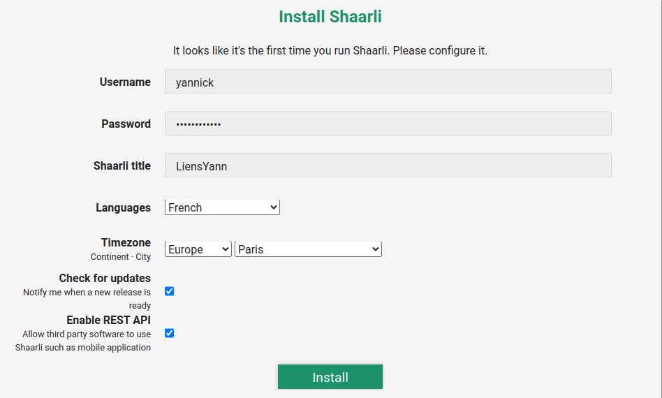  
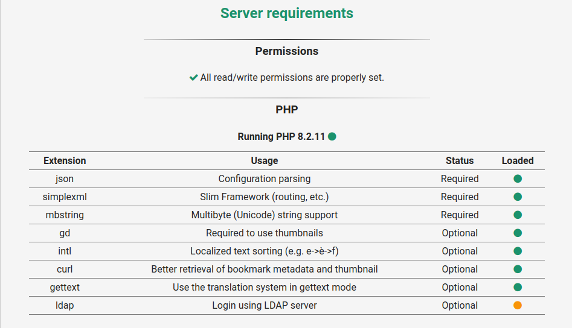  

Après avoir cliqué sur "Install" on arrive sur la page de connexion  
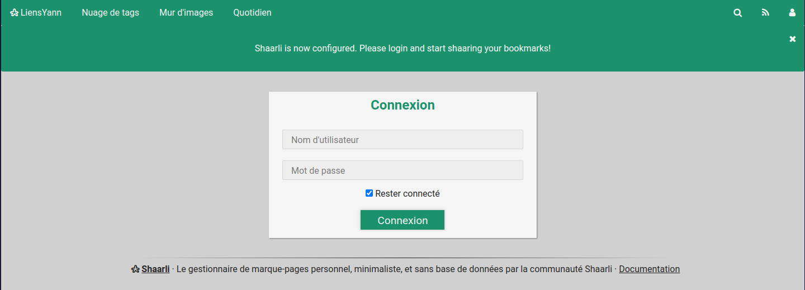  

**Pour une utilisation avec Lldap**(A VERIFIER)  
IP_SRV_LLDAP=127.0.0.1  
Si utilisation serveur LLDAP, ajouter les lignes suivantes au fichier `/var/www/shaarli.rnmkcy.eu/data/config.json.php`

```
    "ldap": {
        "host": "ldap://127.0.0.1:3890",
        "dn": "uid=%s,ou=people,dc=domain,dc=com"
    }
```

### Traduction (traduction.rnmkcy.eu)

[LibreTranslate API de traduction](/posts/LibreTranslate/)  
Une API pour la traduction accessible sur le lien <https://traduction.rnmkcy.eu>

### Calibre web (calibre.rnmkcy.eu)

{:height="60"} 

<https://github.com/janeczku/calibre-web>

#### Environnement python

Vérifier python3

    python3 -V

Python 3.11.2

Prérequis, installer pip et aussi venv pour votre version de python 

    sudo apt install python3-venv python3-dev 

Création dossier puis un environnement virtuel pour calibre-web

```shell
sudo mkdir /home/leno/calibreweb
sudo chown $USER:$USER /home/leno/calibreweb
python3 -m venv /home/leno/calibreweb
```

Activer l'environnement

    source /home/leno/calibreweb/bin/activate

On arrive sur le prompt `((calibreweb) leno@rnmkcy:~$`  

Installer calibre-web

```shell
pip3 install --upgrade pip
pip3 install wheel
pip3 install cmake
pip3 install calibreweb
```

#### Service calibreweb

Utilisation fichier systemd pour le lancement automatique

    sudo nano /etc/systemd/system/calibreweb.service

Contenu du fichier

```
[Unit]
Description=Service calibreweb
After=network.target

[Service]
Type=simple
User=leno
ExecStart=/home/leno/calibreweb/bin/cps

[Install]
WantedBy=multi-user.target
```

ATTENTION! , User est l’utilisateur connecté ($USER)

Recharger et lancer le service calibreweb et vérifier

    sudo systemctl daemon-reload
    sudo systemctl start calibreweb

Vérifier et activer

    sudo systemctl status calibreweb
    sudo systemctl enable calibreweb

#### Proxy nginx

[Setup Reverse Proxy](https://github.com/janeczku/calibre-web/wiki/Setup-Reverse-Proxy)

Si vous voulez utiliser nginx comme proxy , fichier de configuration `/etc/nginx/conf.d/calibre.ouestline.xyz.conf` 

```nginx
server {
    listen 80;
    listen [::]:80;
    server_name  calibre.ouestline.xyz;

    # redirect all plain HTTP requests to HTTPS
    return 301 https://calibre.ouestline.xyz$request_uri;
}

server {
    # ipv4 listening port/protocol
    listen       443 ssl http2;
    # ipv6 listening port/protocol
    listen           [::]:443 ssl http2;
    server_name  calibre.ouestline.xyz;

    include /etc/nginx/conf.d/security-ouestline.xyz.conf.inc;

    # connexion nginx fermée si sous domaine inexistant
    if ($http_host != "calibre.ouestline.xyz") {
     return 444;
    }

  location / { 
     proxy_pass              http://127.0.0.1:8083;
  } 

}
```

Ouvrir le lien https://calibre.ouestline.xyz  
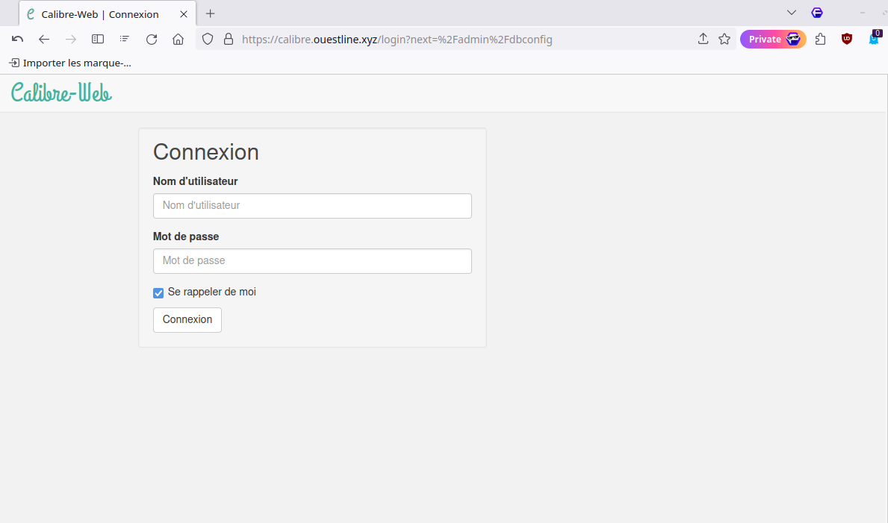{:width="600"}  
Par défaut admin admin123  

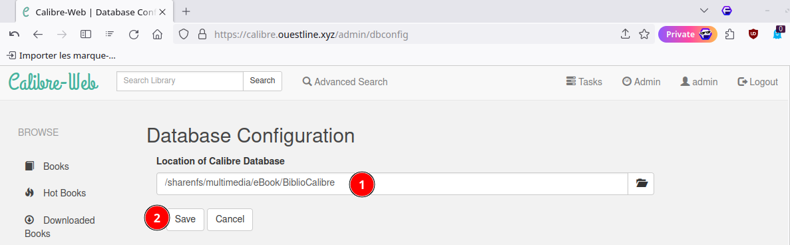{:width="600"}  
Cliquer sur **Admin** avec un grand A, pusi clic "Edit Users"   
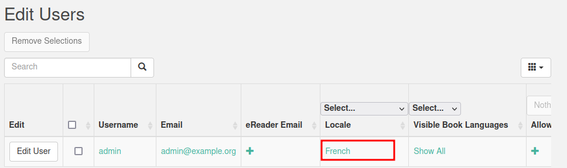{:width="600"}  
Clic sur "Back", le menu s'affiche en français

Configuration de l’interface utilisateur  
Thème sombre puis clic "Sauvegarder"

Afficher champ lu/non lu   
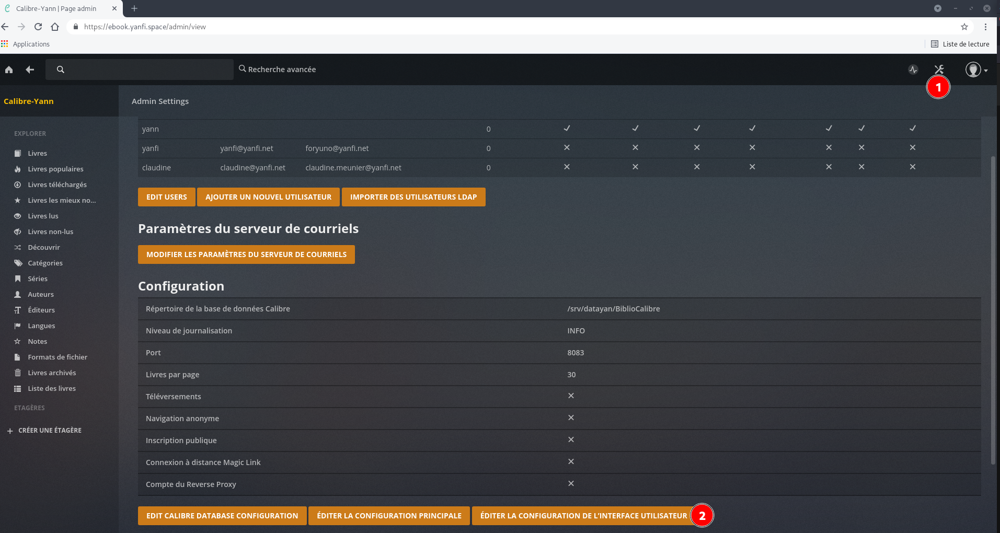{:width="600"}  
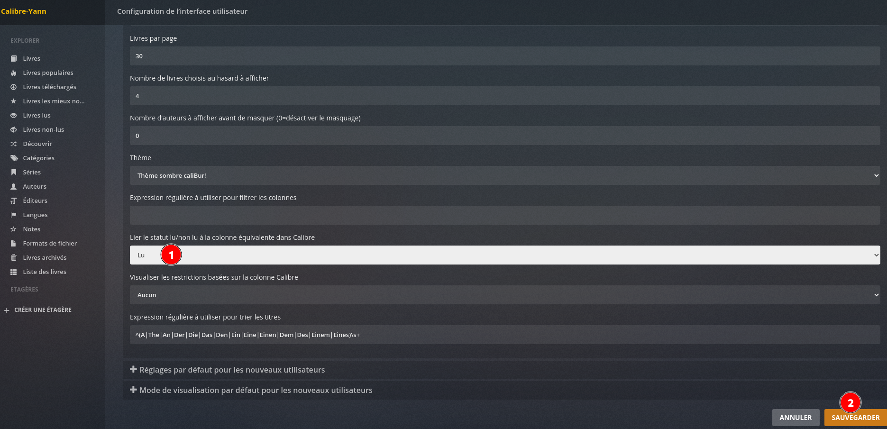{:width="600"}

#### Authentification ldap

*LDAP peut être utilisé comme fournisseur de connexion pour Calibre-Web. En fonction de votre distribution, certains paquets doivent être installés. Vous devez également installer les dépendances listées dans le fichier optional-requirements.txt dans la section LDAP.*

Il faut installer des modules complémentaires  

```
# ldap login
python-ldap>=3.0.0,<3.5.0
Flask-SimpleLDAP>=1.4.0,<1.5.0
```

Prérequis

 sudo apt install libsasl2-dev python3-dev libldap2-dev libssl-dev

activer l'environnement

    source /home/leno/calibreweb/bin/activate

On arrive sur le prompt `((calibreweb) leno@rnmkcy:~$`  

Installer python ldap

```shell
pip3 install python-ldap
pip3 install Flask-SimpleLDAP
```

Redémarrer le service 

    sudo systemctl restart calibreweb

Se connecter en admin sur le lien <https://calibre.rnmkcy.eu>

Après un redémarrage de Calibre-Web, vous devriez voir Flask_SimpleLDAP dans la section "A propos".  
Dans la section Admin -> Editer la configuration principale -> Configuration des options, une nouvelle option "Type de connexion" apparaît. Après avoir sélectionnée "Utiliser l'authentification LDAP" , vous devez configurer votre connexion LDAP :

[Configuration lldap](https://github.com/lldap/lldap/blob/main/example_configs/calibre_web.md)   
Remplacer `dc=rnmkcy,dc=eu` avec le domaine configuré dans LLDAP

**Version Anglaise**  
Login type : `Use LDAP Authentication`  
LDAP Server Host Name or IP Address : `127.0.0.1`  
LDAP Server Port : `3890`  
LDAP Encryption : `none`  
LDAP Authentication : `simple`  
LDAP Administrator Username : `uid=admin,ou=people,dc=rnmkcy,dc=eu`  
LDAP Administrator Password : `MOT_PASSE_ADMIN_LDAP`  
LDAP Distinguished Name (DN) : `dc=rnmkcy,dc=eu`  
LDAP User Object Filter : `(&(objectclass=person)(uid=%s))`  
LDAP Server is OpenLDAP? : `yes`  
LDAP Group Object Filter : `(&(objectclass=groupOfUniqueNames)(cn=%s))`  
LDAP Group Name : `calibre_web`  
Note: Créez un groupe dans lldap et ajoutez-y les utilisateurs qui auront accès à votre instance Calibre-Web.

LDAP Group Members Field : `uniqueMember`  
LDAP Member User Filter Detection : `Custom Filter`  
LDAP Member User Filter : `(&(objectclass=person)(uid=%s))`  
Note: mettre en minuscule le mot "person" jusqu'à ce que ce bug soit corrigé

**Version Française**  
Type de connexion : `Utiliser l'authentificationLDAP`  
Nom d'hôte ou Adresse IP du serveur LDAP : `127.0.0.1`  
Port du serveur LDAP : `3890`  
Chiffrement LDAP : `Aucun`  
Authentification LDAP : `Simple`  
Nom d'utilisateur de l'administrateur LDAP : `uid=admin,ou=people,dc=rnmkcy,dc=eu`  
Mot de passe de l'administrateur LDAP : `MOT_PASSE_ADMIN_LDAP`  
LDAP Distinguished Name (DN) : `dc=rnmkcy,dc=eu`  
Filtre objet de l'utilisateur LDAP : `(&(objectclass=person)(uid=%s))`    
Est-ce que le serveur LDAP est OpenLDAP? Cocher la case   

Les paramètres suivant sont nécessaires pour importer un utilisateur  
Filtre objet de groupe LDAP : `(&(objectclass=groupOfUniqueNames)(cn=%s))`  
Nom de groupe LDAP : `calibre_web`  
Note: Créez un groupe dans lldap et ajoutez-y les utilisateurs qui auront accès à votre instance Calibre-Web.

Champ des membres de groupe LDAP : `uniqueMember`  
Filtre de détection des utilisateurs membres LDAP : `Filtre personnalisé` 
Filtre utilisateur des membres LDAP : `(&(objectclass=person)(uid=%s))`  


Images de la configuration  
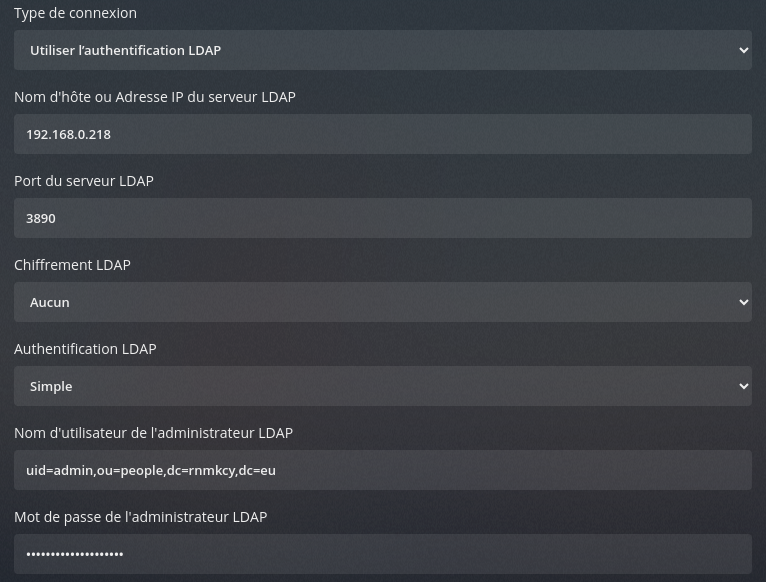{:width="600"}  
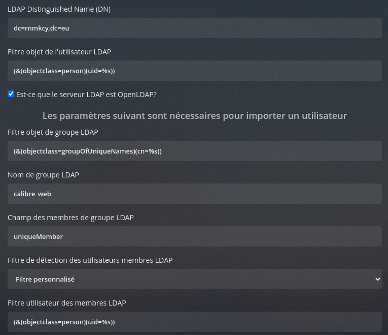{:width="600"}  
Cliquer sur **SAUVEGARDER**

<u>Pour se connecter à Calibre-Web via LDAP, les utilisateurs doivent être créés ou importés dans Calibre-Web</u> (le compte utilisateur doit être visible dans la section d'administration de Calibre-Web). Si vous entrez un mot de passe dans la section "Modifier l'utilisateur" pour votre compte administrateur, vous pouvez vous connecter en tant que solution de repli si le serveur LDAP n'est pas accessible (ou si la connexion est mal configurée). Dans le cas contraire, il n'est pas possible de se connecter à Calibre-Web et de modifier les paramètres. Si le serveur LDAP est hors service, aucun utilisateur sans mot de passe de secours ne peut se connecter à Calibre-Web. Les mots de passe des utilisateurs ne sont pas mis à jour/stockés dans la base de données de Calibre-Web. Tant que le serveur LDAP fonctionne, les utilisateurs avec le mot de passe de secours ne peuvent se connecter qu'avec leur mot de passe LDAP et non avec le mot de passe de secours.
{: .prompt-info }

#### Connexion invité

La connexion invité ne nécessite pas de login et mot de passe   
Elle est autorisée seulement car on utilise **authelia** comme portail SSO  

Configuration authelia `/etc/authelia/configuration.yml`

```yaml
access_control:
  default_policy: deny
  rules:
    - domain:
        - "calibre.rnmkcy.eu"
```

Paramétrage calibre-web   
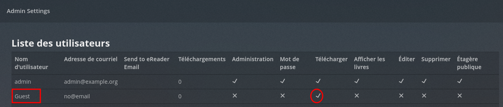  
Accès bibliothèque et autorisation téléchargement  

#### Rafraîchissement site calibre

Les modifications du dossier d'origine et de la base calibre sont synchronisées par rsync. Cependant la page web calibre n'est pas réactualisée, il faut relancer le service calibre par la commande `systemctl restart calibreweb`.

Pour automatiser la relance du service, on va s'appuyer sur le fait que la base calibre `metadata.db` change de date et heure à chaque modification

Nous allons surveiller dansle dossier `/sharenfs/multimedia/eBook/BiblioCalibre/` toute modification du fichier `metadata.db` qui entrainera l’exécution d’un script

Dans le répertoire systemd nous créons une unité de cheminement calibreweb-modif.path

    sudo nano /etc/systemd/system/calibreweb-modif.path

```
[Unit]
Description=Surveiller BiblioCalibre metadata.db

[Path]
PathChanged=/sharenfs/multimedia/eBook/BiblioCalibre/metadata.db
Unit=calibreweb-modif.service

[Install]
WantedBy=multi-user.target
```

Dans la section `[Path]`, `PathChanged=` indique le chemin absolu du fichier à surveiller, tandis que `Unit=` indique l’unité de service à exécuter si le fichier change. 

Le service `calibreweb-modif.service`

```
[Unit] 
Description="Relance du service calibreweb"

[Service]
ExecStart=/usr/bin/systemctl restart calibreweb.service

[Install]
WantedBy=multi-user.target
```

Mise en place, il faut activer path 

```bash
sudo systemctl enable calibreweb-modif.path --now
```

En cas de modifications : `journalctl -u calibreweb-modif.service`  

```
juil. 23 11:50:16 rnmkcy.eu systemd[1]: Started calibreweb-modif.service - "Relance du service calibreweb".
juil. 23 11:50:16 rnmkcy.eu systemd[1]: calibreweb-modif.service: Deactivated successfully.
```

### Gestion documents (only.rnmkcy.eu)

#### OnlyOffice Docs community (INACTIF)

Créer un serveur ONLYOFFICE sur un debian virtuel, voir [OnlyOffice Debian Document Server](/posts/OnlyOffice_Debian/)

Accès via proxy adresse 192.168.0.217

Lien only.rnmkcy.eu avec jeton accès   
Configuration `/etc/nginx/conf.d/only.rnmkcy.eu.conf`

```
server {
  listen 80;
  listen [::]:80;
  server_name  only.rnmkcy.eu;

  # redirect all plain HTTP requests to HTTPS
  return 301 https://only.rnmkcy.eu$request_uri;
}

server {
    listen 443 ssl http2;
    listen [::]:443 ssl http2;
    server_name only.rnmkcy.eu;

    include /etc/nginx/conf.d/security.conf.inc;

    
    more_set_headers "Strict-Transport-Security : max-age=63072000; includeSubDomains; preload";
    

		location / {
		
		 proxy_pass        http://192.168.0.217/;
		  proxy_http_version 1.1;
		  proxy_set_header Upgrade $http_upgrade;
		  #proxy_set_header Connection $proxy_connection;
		  proxy_set_header Connection "upgrade";
		  proxy_set_header  X-Forwarded-Host $server_name;
		  proxy_set_header  X-Forwarded-Proto $scheme;
		  proxy_set_header  X-Forwarded-For $proxy_add_x_forwarded_for;
		  proxy_redirect    off;
		  proxy_set_header  Host $host;
		  proxy_set_header  X-Real-IP $remote_addr;
		  
		  more_set_headers "X-Frame-Options : ALLOW-FROM https://cloud.rnmkcy.eu always";
		  client_max_body_size 10M;
		}

    access_log /var/log/nginx/only.rnmkcy.eu-access.log;
    error_log /var/log/nginx/only.rnmkcy.eu-error.log;
}
```

#### Collabora Online

[Collabora](/posts/Collabora_Debian/)

### Notification (ntfy)

[Ntfy service de notification](/posts/Ntfy/)

### Audio (zic.rnmkcy.eu)

#### Nextcloud Music (OPTION)

* [Je quitte Spotify pour mon propre cloud musical autohébergé !](https://blog.flozz.fr/2024/06/21/je-quitte-spotify-pour-mon-propre-cloud-musical-autoheberge/)
* [Créer facilement son cloud musical avec Nextcloud](https://blog.flozz.fr/2024/07/10/creer-facilement-son-cloud-musical-avec-nextcloud/)

Après activation application **Music** , se connecter en utilisateur et cliquer sur icône 

**Ampache et Subsonic**  
Vous pouvez parcourir et écouter votre collection de musique à partir d'applications externes qui prennent en charge l'API Ampache ou Subsonic.  
<https://cloud.rnmkcy.eu/apps/music/ampache>  
Utilisez cette adresse pour parcourir votre collection musicale à partir d'un lecteur compatible avec Ampache. Si cette URL ne fonctionne pas, essayez d'ajouter '/server/xml.server.php'.  
<https://cloud.rnmkcy.eu/apps/music/subsonic>  
Utilisez cette adresse pour parcourir votre collection de musique à partir d'un lecteur compatible Subsonic.

Ici, vous pouvez générer des mots de passe à utiliser avec l'API Ampache ou Subsonic. Des mots de passe séparés sont utilisés parce qu'ils ne peuvent pas être stockés de manière vraiment sécurisée en raison de la conception des API. Vous pouvez générer autant de mots de passe que vous le souhaitez et les révoquer à tout moment.
{: .prompt-info }

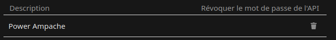

#### Navidrome

[Audio Navidrome, installation sur debian](/posts/Audio_Navidrome-installation_sur_debian/)

Version 051.1 au 24/03/2024

```bash
wget https://github.com/navidrome/navidrome/releases/download/v0.51.1/navidrome_0.51.1_Linux_amd64.tar.gz -O Navidrome.tar.gz
sudo tar -xvzf Navidrome.tar.gz -C /opt/navidrome/
sudo chown -R navidrome:navidrome /opt/navidrome
```

créer un nouveau fichier nommé `/var/lib/navidrome/navidrome.toml` avec les paramètres suivants.

```
# Dossier où est stockée votre bibliothèque musicale
MusicFolder = "/sharenfs/multimedia/Music/musicyan"
# Définir la langue par défaut
DefaultLanguage="fr"
```

Créer une unité Système `/etc/systemd/system/navidrome.service` avec les données suivantes. 

```
[Unit]
Description=Navidrome Music Server and Streamer compatible with Subsonic/Airsonic
After=remote-fs.target network.target
AssertPathExists=/var/lib/navidrome

[Install]
WantedBy=multi-user.target

[Service]
User=navidrome
Group=navidrome
Type=simple
ExecStart=/opt/navidrome/navidrome --configfile "/var/lib/navidrome/navidrome.toml"
WorkingDirectory=/var/lib/navidrome
TimeoutStopSec=20
KillMode=process
Restart=on-failure

# See https://www.freedesktop.org/software/systemd/man/systemd.exec/
DevicePolicy=closed
NoNewPrivileges=yes
PrivateTmp=yes
PrivateUsers=yes
ProtectControlGroups=yes
ProtectKernelModules=yes
ProtectKernelTunables=yes
RestrictAddressFamilies=AF_UNIX AF_INET AF_INET6
RestrictNamespaces=yes
RestrictRealtime=yes
SystemCallFilter=~@clock @debug @module @mount @obsolete @reboot @setuid @swap
ReadWritePaths=/var/lib/navidrome

# You can uncomment the following line if you're not using the jukebox This
# will prevent navidrome from accessing any real (physical) devices
#PrivateDevices=yes

# You can change the following line to `strict` instead of `full` if you don't
# want navidrome to be able to write anything on your filesystem outside of
# /var/lib/navidrome.
ProtectSystem=full

# You can uncomment the following line if you don't have any media in /home/*.
# This will prevent navidrome from ever reading/writing anything there.
#ProtectHome=true

# You can customize some Navidrome config options by setting environment variables here. Ex:
#Environment=ND_BASEURL="/navidrome"
```

Rechargez le démon de service, lancez le nouveau service et vérifiez 

```bash
sudo systemctl daemon-reload
sudo systemctl enable navidrome.service --now
sudo systemctl status navidrome.service
```

Si le service a démarré correctement, vérifiez que vous pouvez accéder à http://localhost:4533.

Ouvrir un terminal sur le client linux qui dispose des clés ssh et lancer la commande

    ssh -L 9500:localhost:4533  leno@192.168.0.215 -p 55215 -i /home/yann/.ssh/lenovo-ed25519

Créer un compte administrateur : yann

**Proxy nginx** `/etc/nginx/conf.d/zic.rnmkcy.eu`

```
server {
    listen 80;
    listen [::]:80;
    server_name  zic.rnmkcy.eu;

    # redirect all plain HTTP requests to HTTPS
    return 301 https://zic.rnmkcy.eu$request_uri;
}

server {
    # ipv4 listening port/protocol
    listen       443 ssl http2;
    # ipv6 listening port/protocol
    listen           [::]:443 ssl http2;
    server_name  zic.rnmkcy.eu;

    include /etc/nginx/conf.d/security.conf.inc;

  location / {
      proxy_pass              http://127.0.0.1:4533;
      proxy_set_header Host $host;
      proxy_set_header X-Real-IP $remote_addr;
      proxy_set_header X-Forwarded-For $proxy_add_x_forwarded_for;
      proxy_set_header X-Forwarded-Proto $scheme;
      proxy_set_header X-Forwarded-Protocol $scheme;
      proxy_set_header X-Forwarded-Host $http_host;
      proxy_buffering off;
  }

}
```

<https://zic.rnmkcy.eu>

#### Application web radiolise

Les versions node 

```
$ node -v --> v20.10.0
$ npm -v  --> 10.8.1
$ echo $PATH
/home/leno/.nvm/versions/node/v20.10.0/bin:/usr/local/bin:/usr/bin:/bin:/usr/local/games:/usr/games:/usr/local/go/bin
```

[Application Radiolise](https://gitlab.com/radiolise/radiolise.gitlab.io)

Installer Radiolise 

    npm install -g radiolise

L’option -g indique à npm d’installer le module dans le monde entier, afin qu’il soit disponible dans tout le système.

Ensuite, démarrez le serveur à chaque fois en tapant simplement

    radiolise

```
ᯤ  Welcome to Radiolise v5.9.0
Enjoy your favorite TV and radio streams!

Server listening on: http://127.0.0.1:56225/
```

arrêt par Ctrl+C

Où est l'application : `whereis radiolise`  
*radiolise: /home/leno/.nvm/versions/node/v20.10.0/bin/radiolise*

Créer un service utilisateur `~/.config/systemd/user/radiolise.service`

```bash
cd /home/leno
# créer dossier systemd utilisateur
mkdir -p ~/.config/systemd/user/
```

Le service

```
[Unit]
Description=Application radiolise port 56225

[Service]
ExecStart=/home/leno/.nvm/versions/node/v20.10.0/bin/radiolise

[Install]
WantedBy=default.target
```

Lancer et activer le service

```
systemctl --user daemon-reload
systemctl enable --user radiolise.service --now
systemctl status --user radiolise.service
```

### Radicale (INACTIF)

*Pour réduire la dépendance aux produits Google , héberger un serveur CardDav et CalDav à l’aide de Radicale*  
[Radicale serveur de calendrier et contacts](/posts/Radicale_serveur_de_calendrier_et_contacts/)

Deux options pour nginx

1. Radicale dans un sous-répertoire de NGINX webroot et l'instance est accessible via http://example.com/radicale
2. Radicale est placé dans le webroot de votre installation nginx et l'instance est accessible via http://radicale.example.com

<https://rnmkcy.eu/radicale>

### Cockpit Web (cockpit.rnmkcy.eu) 

Installation application &rarr; [Cockpit](/posts/Cockpit_Web/)

Domaine : cockpit.rnmkcy.eu   
Fichier de configuration nginx `/etc/nginx/conf.d/cockpit.rnmkcy.eu.conf`

```
server {
    listen 80;
    listen [::]:80;
    server_name  cockpit.rnmkcy.eu;
    return 301 https://cockpit.rnmkcy.eu$request_uri;
}

server {
    listen       443 ssl http2;
    listen       [::]:443 ssl http2;
    server_name  cockpit.rnmkcy.eu;

    include /etc/nginx/conf.d/security.conf.inc;

    location / {
        # Required to proxy the connection to Cockpit
        proxy_pass https://127.0.0.1:9090;
        proxy_set_header Host $host;
        proxy_set_header X-Forwarded-Proto $scheme;

        # Required for web sockets to function
        proxy_http_version 1.1;
        proxy_buffering off;
        proxy_set_header Upgrade $http_upgrade;
        proxy_set_header Connection "upgrade";

        # Pass ETag header from Cockpit to clients.
        # See: https://github.com/cockpit-project/cockpit/issues/5239
        gzip off;
    }

}
```

Vérification et rechargement nginx

    nginx -t
    systemctl reload nginx

<https://cockpit.rnmkcy.eu/>

### Gestion photos (INACTIF)

#### HomeGallery 

* <https://home-gallery.org/>
* [Documentation HomeGallery](https://docs.home-gallery.org)

Création du dossier photos 

```bash
sudo mkdir /sharenfs/photos
sudo chown $USER:$USER /sharenfs/photos
```

Installer [HomeGallery](/posts/HomeGallery/) sur le serveur virtuel "debsrv01" ([Lenovo KVM - Serveur virtuel Debian 12 + Jekyll](/posts/Serveur_virtuel_Debian_12_image_nocloud/))

Création fichier de configuration nginx `/etc/nginx/conf.d/photo.rnmkcy.eu.conf`

```
server {
    listen 80;
    listen [::]:80;
    server_name  photo.rnmkcy.eu;

    # redirect all plain HTTP requests to HTTPS
    return 301 https://photo.rnmkcy.eu$request_uri;
}

server {
    # ipv4 listening port/protocol
    listen       443 ssl http2;
    # ipv6 listening port/protocol
    listen           [::]:443 ssl http2;
    server_name  photo.rnmkcy.eu;

    include /etc/nginx/conf.d/security.conf.inc;

    # connexion nginx fermée si sous domaine inexistant
    if ($http_host != "photo.rnmkcy.eu") {
     return 444;
    }

  location / { 
     proxy_pass              http://192.168.0.219:3000;
  } 

}
```

Recharger nginx

    sudo systemctl reload nginx

Le lien <https://photo.rnmkcy.eu>

### RSS (rss.rnmkcy.eu)

#### KVM - Alpine ttrss

[Lenovo KVM - Alpine Linux Tiny Tiny RSS](/posts/KVM-Alpine-Linux/)  
Le lien <https://flux.rnmkcy.eu>

#### Yarr RSS (INACTIF)

*yarr (yet another rss reader) est un agrégateur de flux basé sur le web qui peut être utilisé à la fois comme application de bureau et comme serveur personnel auto-hébergé.  
L'application est un simple binaire avec une base de données intégrée (SQLite).*

* [Yarr - un lecteur de RSS web qui me plait bien](https://lord.re/posts/246-yarr-web-rss-pour-remplacer-ttrss/)
* [Yarr - github](https://github.com/nkanaev/yarr)

**1 - Installer binaire yarr**

Les derniers binaires préconstruits pour Linux/MacOS/Windows AMD64 sont disponibles [ici](https://github.com/nkanaev/yarr/releases/latest)  
Télécharger, décompresser le zip et placer le binaire linux dans le dossier `/usr/local/bin/`

```bash
wget https://github.com/nkanaev/yarr/releases/download/v2.4/yarr-v2.4-linux64.zip
unzip yarr-v2.4-linux64.zip
sudo mv yarr /usr/local/bin/
```

Lancer l'exécutable : `yarr`

```
[...]
2024/06/04 14:08:16 main.go:150: starting server at http://127.0.0.1:7070
```

Test sur navigateur

```
ssh -L 5900:127.0.0.1:7070 leno@192.168.0.215 -p 55215 -i /home/yann/.ssh/lenovo-ed25519
```

Ouvrir le lien localhost:5900 dans un navigateur  
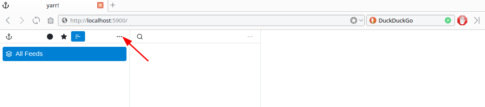  
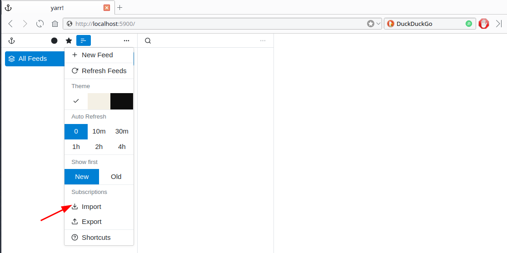  
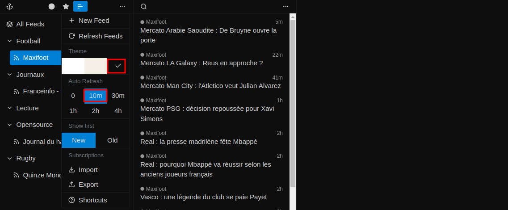  

**2 - Service yarr-daemaon**

Créer un service `/etc/systemd/system/yarr-daemaon.service` pour lancer l'exécutable

```
[Unit]
Description=RSS yarr server

[Service]
Type=simple
Restart=always
User=leno
Group=leno
WorkingDirectory=/home/leno/.config/yarr
ExecStart=/usr/local/bin/yarr

[Install]
WantedBy=multi-user.target
```

Lancer et activer le service 

```bash
sudo systemctl daemon-reload
sudo systemctl enable yarr-daemaon --now
```

Vérifier status : `systemctl status yarr-daemaon`

```
● yarr-daemaon.service - RSS yarr server
     Loaded: loaded (/etc/systemd/system/yarr-daemaon.service; enabled; preset: enabled)
     Active: active (running) since Tue 2024-06-04 14:53:13 CEST; 5s ago
   Main PID: 739708 (yarr)
      Tasks: 8 (limit: 14162)
     Memory: 13.5M
        CPU: 114ms
     CGroup: /system.slice/yarr-daemaon.service
             └─739708 /usr/local/bin/yarr

juin 04 14:53:13 rnmkcy.eu systemd[1]: Started yarr-daemaon.service - RSS yarr server.
juin 04 14:53:13 rnmkcy.eu yarr[739708]: 2024/06/04 14:53:13 main.go:105: using db file /home/leno/.config/yarr/storage.db
juin 04 14:53:13 rnmkcy.eu yarr[739708]: 2024/06/04 14:53:13 main.go:150: starting server at http://127.0.0.1:7070
juin 04 14:53:13 rnmkcy.eu yarr[739708]: 2024/06/04 14:53:13 worker.go:76: auto-refresh 10m: starting
juin 04 14:53:13 rnmkcy.eu yarr[739708]: 2024/06/04 14:53:13 worker.go:105: Refreshing feeds
juin 04 14:53:13 rnmkcy.eu yarr[739708]: 2024/06/04 14:53:13 worker.go:135: Finished refreshing 4 feeds
```

**3 - Proxy yarr nginx**

Le fichier de configuration `/etc/nginx/conf.d/yarr.rnmkcy.eu.conf`

```nginx
server {
    listen 80;
    listen [::]:80;
    server_name  yarr.rnmkcy.eu;

    # redirect all plain HTTP requests to HTTPS
    return 301 https://yarr.rnmkcy.eu$request_uri;
}

server {
    # ipv4 listening port/protocol
    listen       443 ssl http2;
    # ipv6 listening port/protocol
    listen           [::]:443 ssl http2;
    server_name  yarr.rnmkcy.eu;

    include /etc/nginx/conf.d/security.conf.inc;

  location / { 
     proxy_pass              http://127.0.0.1:7070;
  } 

}
```

Recharger nginx : `sudo systemctl reload nginx`  
Visiter le lien <https://yarr.rnmkcy.eu>  
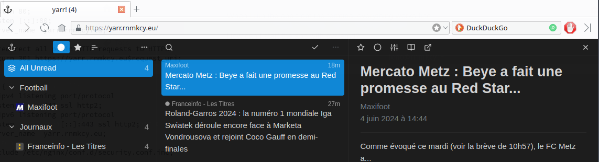  

### Webmail SnappyMail (webmail.rnmkcy.eu)

{:height="80"}  
*Client de messagerie web simple multi-domaine, moderne, léger et rapide*

#### Installation

On passe en mode administrateur

    sudo -s

Créer le dossier d'installation

    mkdir -p /var/www/webmail

Téléchargement dernière version snappymail

```bash
cd /var/www/webmail
wget https://snappymail.eu/repository/latest.tar.gz
```

Extraction

    tar -xzf latest.tar.gz
    rm latest.tar.gz

Autorisations

```bash
# Définir les autorisations
find /var/www/webmail/snappymail -type d -exec chmod 755 {} \;
find /var/www/webmail/snappymail -type f -exec chmod 644 {} \;
chown -R www-data:www-data /var/www/webmail/snappymail
```

#### Configuration nginx

Le fichier de configuration nginx `/etc/nginx/conf.d/webmail.rnmkcy.eu.conf` 

<details>
<summary><b>Etendre Réduire webmail.rnmkcy.eu.conf</b></summary>

  
###
# Redirect non-secure (unencrypted) HTTP to the more secure (encrypted) HTTPS
server {
	listen 80 default_server;
	listen [::]:80 default_server;
	server_name _;
	return 301 https://$host$request_uri;
}

###
# Actual domain configuration
server {
	###
	# TLS for the win!
	listen 443 ssl http2;
	listen [::]:443 ssl http2;

	###
	# Domain name
	server_name webmail.rnmkcy.eu;

	###
	# SSL configuration
        ssl_certificate /etc/ssl/private/rnmkcy.eu-fullchain.pem;
        ssl_certificate_key /etc/ssl/private/rnmkcy.eu-key.pem;
	ssl_protocols TLSv1.2 TLSv1.3;
	ssl_ciphers "ECDHE-ECDSA-CHACHA20-POLY1305:ECDHE-RSA-CHACHA20-POLY1305:DHE-RSA-CHACHA20-POLY1305:AES-256-GCM-SHA384:EECDH+AESGCM:EDH+AESGCM";
	ssl_ecdh_curve secp521r1:secp384r1;
	ssl_session_timeout  10m;
	ssl_session_cache    shared:SSL:10m;
	ssl_session_tickets off;
	ssl_prefer_server_ciphers on;

	###
	# Security headers
	add_header Strict-Transport-Security "max-age=15768000; includeSubDomains; preload;" always;
	add_header X-Content-Type-Options "nosniff" always;
	add_header X-XSS-Protection "1; mode=block" always;
	add_header X-Robots-Tag "none" always;
	add_header X-Download-Options "noopen" always;
	add_header X-Permitted-Cross-Domain-Policies "none" always;
	add_header Referrer-Policy "no-referrer" always;
	add_header X-Frame-Options "SAMEORIGIN" always;
	fastcgi_hide_header X-Powered-By;

	###
	# GZIP / compression settings
	gzip on;
	gzip_vary on;
	gzip_comp_level 4;
	gzip_min_length 256;
	gzip_proxied expired no-cache no-store private no_last_modified no_etag auth;
	gzip_types application/atom+xml application/javascript application/json application/ld+json application/manifest+json application/rss+xml application/vnd.geo+json application/vnd.ms-fontobject application/x-font-ttf application/x-web-app-manifest+json application//+xml application/xml font/opentype image/bmp image/svg+xml image/x-icon text/cache-manifest text/css text/plain text/vcard text/vnd.rim.location.xloc text/vtt text/x-component text/x-cross-domain-policy;

	###
	# Define the document root
	root /var/www/webmail;
	index index.php;

	client_max_body_size 50M;

	###
	# Forbid access to dotfiles
	location ~ (^|/)\. {
		return 403;
	}

	###
	# The actual root location
	location / {
                try_files $uri $uri/ /index.php?$args;
	}

	###
	# Last but not least, the PHP-FPM settings
	location ~* \.php$ {
		fastcgi_pass    unix:/var/run/php/php8.3-fpm.sock;
		include         fastcgi_params;
		fastcgi_param   SCRIPT_FILENAME    $document_root$fastcgi_script_name;
		fastcgi_param   SCRIPT_NAME        $fastcgi_script_name;
	}

}

</details>

Recharger nginx

    sudo systemctl reload nginx

#### Accés page administration

Ouvrez l'interface d'administration <https://webmail.rnmkcy.eu/?admin> pour configurer les paramètres de votre serveur de messagerie.  
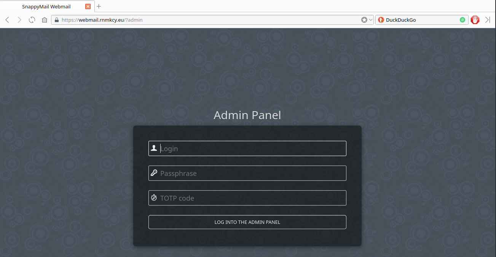  
Connectez-vous avec l'utilisateur "admin" et le mot de passe du fichier ``/var/www/webmail/data/_data_/_default_/admin_password.txt``.  

Si vous avez des problèmes pour appeler l'interface d'administration, essayez de le faire en mode privé de votre navigateur. De cette façon, les cookies et autres données mises en cache lors d'installations précédentes sont ignorés.

#### Mot de passe admin

Le fichier de mot de passe est créé après l'ouverture de l'interface d'administration !  
Assurez-vous de changer immédiatement le mot de passe par défaut !   
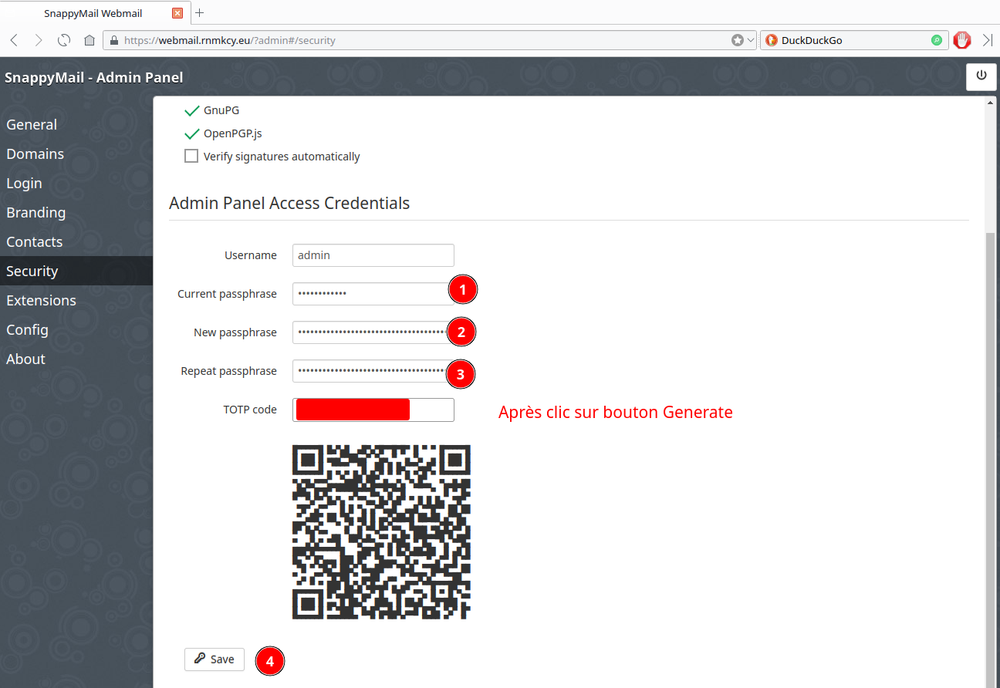  
après avoir changé le mot de passe par défaut, le fichier `admin_password.txt` est supprimé.  
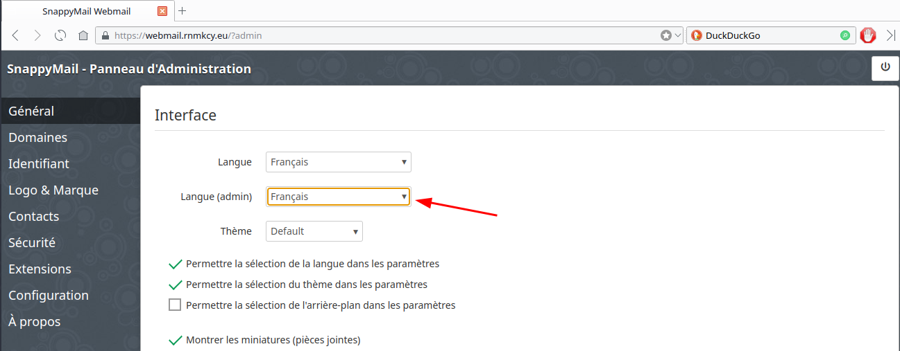  
Interface admin en français

Domaines de messagerie  
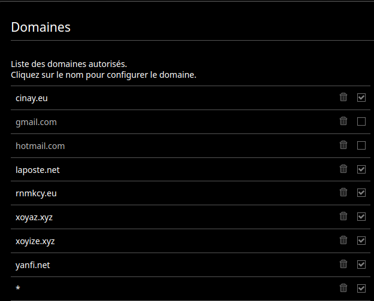  

Authentification 2FA pour les utilisateurs, il faut "Activer les plugins" et télécharger le plugin "Two Factor Authentication" puis cocher pour valider   
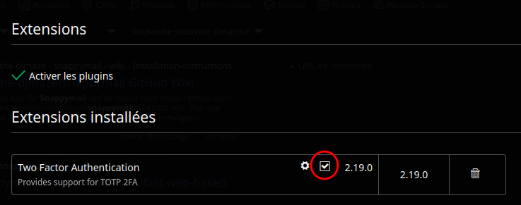  

`Le code TOTP défini pour "admin" sera en vigueur pour tout les utilisateurs`{: .prompt-info }

### SearXNG (searx.rnmkcy.eu)

*[SearXNG](https://docs.searxng.org/) est un métamoteur qui recherche ses informations à travers plusieurs moteurs de recherche généralistes*

**Installation**
[Lenovo KVM - SearXNG Alpine Linux (alpine-searx)](/posts/KVM-Alpine-Linux-Docker-SearXNG/)  
Le lien à ajouter dans les moteurs de recherche : <https://searx.rnmkcy.eu/search?q=%s>

### Gitea (gitea.rnmkcy.eu)

*Gitea est une forge logicielle libre en Go sous licence MIT, pour l'hébergement de développement logiciel, basé sur le logiciel de gestion de versions Git pour la gestion du code source, comportant un système de suivi des bugs, un wiki, ainsi que des outils pour la relecture de code.*

* [Gitea](/posts/Gitea/)

### Gpx studio (gpx.rnmkcy.eu)

* [Moteur de routage (BRouter) + Visualisation et édition traces gpx (gpx.studio)](/posts/Visualisation_et_edition_des_traces_gpx_studio/)

### Mesure vitesse internet (speed.rnmkcy.eu)

* [MySpeed](/posts/Lenovo_Serveur_MySpeed/)

## Authentification unique (SSO Authelia + LLdap)

*L'authentification unique, souvent désignée par le sigle anglais SSO (de single sign-on) est une méthode permettant à un utilisateur d'accéder à plusieurs applications informatiques (ou sites web sécurisés) en ne procédant qu'à une seule authentification.([Authentification unique {:height="12"} ](https://fr.wikipedia.org/wiki/Authentification_unique))*

Light Lightweight Directory Access Protocol (LLDAP) est à l'origine un protocole permettant l'interrogation et la modification des services d'annuaire. Ce protocole repose sur TCP/IP. Il a cependant évolué pour représenter une norme pour les systèmes d'annuaires, incluant un modèle de données, un modèle de nommage, un modèle fonctionnel basé sur le protocole LDAP, un modèle de sécurité et un modèle de réplication. C'est une structure arborescente dont chacun des nœuds est constitué d'attributs associés à leurs valeurs

* [SSO Authelia](/posts/Authelia_serveur_authentification_et_autorisation/)
* [LLdap - Serveur virtuel d'authentification (VM+Docker)](/posts/Light_LDAP_simple_serveur_authentification/)

Avec une solution SSO, le login est redirigé vers une seule application et l'utilisateur se verra toujours présenter la même page de connexion quelque soient les applications finales qu'il utilisera.

`ATTENTION:`{: .prompt-warning } Le service **authelia** est en erreur sytématiquement après un redémarrage car la machine virtuelle KVM **lldap** (hébergée dans le serveur Lenovo) n'est pas entièrement active lorsque le service **authelia** est lancé

`SOLUTION:`{: .prompt-tip } Il faut retarder le lancement du service **authelia**  de 30s en ajoutant la ligne `ExecStartPre=/bin/sleep 30`  avant `ExecStart=/usr/bin/authelia --config /etc/authelia/configuration.yml` dans le fichier `/lib/systemd/system/authelia.service`


### LLdap - Gestionnaire web (lldap.rnmkcy.eu)

*Gestion de l'annuaire lldap des utilisateurs*

Création proxy nginx pour le gestionnaire web LLdap 

    /etc/nginx/conf.d/lldap.rnmkcy.eu.conf

```
server {
    listen 80;
    listen [::]:80;
    server_name  lldap.rnmkcy.eu;

    # redirect all plain HTTP requests to HTTPS
    return 301 https://lldap.rnmkcy.eu$request_uri;
}

server {
    # ipv4 listening port/protocol
    listen       443 ssl http2;
    # ipv6 listening port/protocol
    listen           [::]:443 ssl http2;
    server_name  lldap.rnmkcy.eu;

    include /etc/nginx/conf.d/security.conf.inc;

    # connexion nginx fermée si sous domaine inexistant
    if ($http_host != "lldap.rnmkcy.eu") {
     return 444;
    }

  location / { 
     proxy_pass              http://127.0.0.1:17170;
  } 

}
```

Vérifier et recharger nginx: `sudo nginx -t && sudo systemctl reload nginx`  
Accès par le lien <https://lldap.rnmkcy.eu/>  
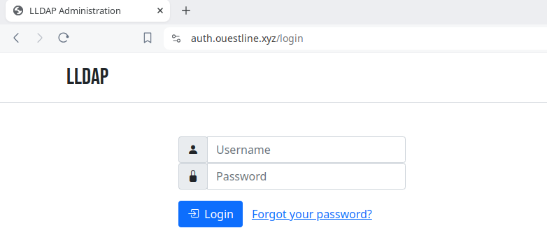{:width="300"}

### Authelia SSO+Nginx (auth.rnmkcy.eu)

{:height="50"}  
*Authelia pour gérer les autorisations d'accès à des applications en s'appuyant sur l'annuaire lldap*


Modifier **authentication_backend** dans le fichier de configuration authelia pour communiquer avec le serveur lldap

```yaml
authentication_backend:
  # Password reset through authelia works normally.
  password_reset:
    disable: false
  # How often authelia should check if there is an user update in LDAP
  refresh_interval: 1m
  ldap:
    implementation: custom
    # Pattern is ldap://HOSTNAME-OR-IP:PORT
    # Port de saut normal est 389, standard dans LLDAP est 3890
    url: ldap://127.0.0.1:3890
    # The dial timeout for LDAP.
    timeout: 5s
    # Utilisez StartTLS avec la connexion LDAP, TLS est non supporté maintenant
    start_tls: false
    #tls:
    #  skip_verify: false
    #  minimum_version: TLS1.2
    # Set base dn, like dc=google,dc.com
    base_dn: dc=rnmkcy,dc=eu
    username_attribute: uid
    # Vous devez configurer cela à ou=people, parce que tous les utilisateurs sont stockés dans cette ou!
    additional_users_dn: ou=people
    # Pour permettre la connexion avec le nom d'utilisateur et l'email
    # on peut utiliser un filtre comme
    # (&(|({username_attribute}={input})({mail_attribute}={input}))(objectClass=person))
    users_filter: "(&({username_attribute}={input})(objectClass=person))"
    # Définir ceci à ou=groups, parce que tous les groupes sont stockés dans cette ou
    additional_groups_dn: ou=groups
    # Les groupes ne sont pas affichés dans l'interface utilisateur, mais ce filtre fonctionne.
    groups_filter: "(member={dn})"
    # L'attribut tenant le nom du groupe.
    group_name_attribute: cn
    # Attribut email
    mail_attribute: mail
    # L'attribut tenant le nom d'affichage de l'utilisateur. 
    # Cela sera utilisé pour accueillir un utilisateur authentifié.
    display_name_attribute: displayName
    # Le nom d'utilisateur et mot de passe de l'utilisateur admin.
    # "admin" devrait être le nom d'utilisateur administrateur que vous définissez dans la configuration LLDAP
    user: uid=admin,ou=people,dc=rnmkcy,dc=eu
    # Le mot de passe peut également être défini en utilisant un secret:
    # https://www.authelia.com/docs/configuration/secrets/
    password: '<Mot de passe administrateur ldap>'
```


Le fichier complet de configuration authelia `/etc/authelia/configuration.yml`

<details>
<summary><b>Etendre Réduire</b> <i>configuration.yml</i></summary>
  
###############################################################################
#                           Authelia Configuration                            #
###############################################################################

theme: dark
##
## Identity Validation Configuration
##
## This configuration tunes the identity validation flows.
identity_validation:
  ## Reset Password flow. Adjusts how the reset password flow operates.
  reset_password:
    jwt_secret: "Générer avec la commande : tr -cd '[:alnum:]' < /dev/urandom | fold -w 64 | head -n 1 | tr -d '\n' ; echo"

server:
  address: 'tcp://127.0.0.1:9091/'
  disable_healthcheck: false
  tls:
    key: ""
    certificate: ""
  ## Server Endpoints configuration.
  ## This section is considered advanced and it SHOULD NOT be configured unless you've read the relevant documentation.
  endpoints:
    ## Enables the pprof endpoint.
    enable_pprof: false
    ## Enables the expvars endpoint.
    enable_expvars: false

log:
  level: trace
  file_path: '/etc/authelia/authelia.log'

totp:
  issuer: rnmkcy.eu
  period: 30
  skew: 1

##
## WebAuthn Configuration
##
webauthn:
  ## Désactiver Webauthn.
  disable: false

  ## Ajuster le délai d'interaction pour les dialogues Webauthn.
  timeout: 60s

  ## Le nom d'affichage que le navigateur doit montrer à l'utilisateur lorsqu'il utilise
  ##  Webauthn pour se connecter ou s'enregistrer.
  display_name: Authelia

  ## La préférence de transmission contrôle si nous collectons la déclaration d'attestation,
  ##  y compris l'AAGUID, à partir de l'appareil.
  ## Les options sont none, indirect, direct.
  attestation_conveyance_preference: indirect

  ## Contrôle si l'utilisateur doit faire un geste ou une action pour confirmer sa présence.
  ## Les options sont : required, preferred, discouraged.
  user_verification: preferred

authentication_backend:
  password_reset:
    disable: false
  refresh_interval: 1m
  ldap:
    implementation: custom
    address: ldap://127.0.0.1:3890
    timeout: 5s
    start_tls: false
    base_dn: dc=rnmkcy,dc=eu
    additional_users_dn: ou=people
    users_filter: "(&({username_attribute}={input})(objectClass=person))"
    additional_groups_dn: ou=groups
    groups_filter: "(member={dn})"
    user: uid=admin,ou=people,dc=rnmkcy,dc=eu
    password: 'Mot_de_passe_LLDAP'
    attributes:
      mail: 'mail'
      username: 'uid'
      group_name: 'cn'
      display_name: 'displayName'

access_control:
  default_policy: deny
  rules:
    ## bypass rule
    - domain:
        - "auth.rnmkcy.eu"
        - "cloud.rnmkcy.eu"
      policy: bypass
    ## catch-all
    - domain:
        - "calibre.rnmkcy.eu"
        - "site.rnmkcy.eu"
      policy: one_factor
    - domain:
        - "cockpit.rnmkcy.eu"
      policy: two_factor

session:
  secret: 'Générer avec la commande : tr -cd '[:alnum:]' < /dev/urandom | fold -w 64 | head -n 1 | tr -d '\n' ; echo'
  name: 'authelia_session'
  same_site: 'lax'
  inactivity: '45m'
  expiration: '12h'
  remember_me: '2M'
  cookies:
    - domain: 'rnmkcy.eu'
      authelia_url: 'https://auth.rnmkcy.eu'
      default_redirection_url: 'https://rnmkcy.eu'
      name: 'authelia_session'
      same_site: 'lax'
      inactivity: '45m'
      expiration: '12h'
      remember_me: '1d'
  redis:
    host: localhost
    port: 6379
    #password: ""
    database_index: 0
    maximum_active_connections: 10
    minimum_idle_connections: 0

regulation:
  max_retries: 3
  find_time: 10m
  ban_time: 12h

storage:
  encryption_key: "Générer avec la commande : tr -cd '[:alnum:]' < /dev/urandom | fold -w 64 | head -n 1 | tr -d '\n' ; echo"
  mysql:
    address: '127.0.0.1:3306'
    database: authelia
    username: authelia
    password: "Mot_de_passe_base_authelia"

notifier:
  smtp:
    username: 'yako@xoyize.xyz'
    password: 'Mot_de_passe_serveur_messagerie'
    sender: 'yako@xoyize.xyz'
    address: 'submission://xoyize.xyz:587'

</details>

Les fichiers de configuration nginx pour authelia  
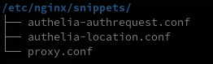

<details>
<summary><b>Etendre Réduire</b> <i>authelia-authrequest.conf</i></summary>
  
## Send a subrequest to Authelia to verify if the user is authenticated and has permission to access the resource.
auth_request /authelia;

## Set the $target_url variable based on the original request.

## Comment this line if you're using nginx without the http_set_misc module.
#set_escape_uri $target_url $scheme://$http_host$request_uri;

## Uncomment this line if you're using NGINX without the http_set_misc module.
set $target_url $scheme://$http_host$request_uri;

## Save the upstream response headers from Authelia to variables.
auth_request_set $user $upstream_http_remote_user;
auth_request_set $groups $upstream_http_remote_groups;
auth_request_set $name $upstream_http_remote_name;
auth_request_set $email $upstream_http_remote_email;

## Inject the response headers from the variables into the request made to the backend.
proxy_set_header Remote-User $user;
proxy_set_header Remote-Groups $groups;
proxy_set_header Remote-Name $name;
proxy_set_header Remote-Email $email;

## If the subreqest returns 200 pass to the backend, if the subrequest returns 401 redirect to the portal.
error_page 401 =302 https://auth.rnmkcy.eu/?rd=$target_url;

</details>

<details>
<summary><b>Etendre Réduire</b> <i>authelia-location.conf</i></summary>
  
set $upstream_authelia http://127.0.0.1:9091/api/verify;

## Virtual endpoint created by nginx to forward auth requests.
location /authelia {
    ## Essential Proxy Configuration
    internal;
    proxy_pass $upstream_authelia;

    ## Headers
    ## The headers starting with X-* are required.
    proxy_set_header X-Original-URL $scheme://$http_host$request_uri;
    proxy_set_header X-Original-Method $request_method;
    proxy_set_header X-Forwarded-Method $request_method;
    proxy_set_header X-Forwarded-Proto $scheme;
    proxy_set_header X-Forwarded-Host $http_host;
    proxy_set_header X-Forwarded-Uri $request_uri;
    proxy_set_header X-Forwarded-For $remote_addr;
    proxy_set_header Content-Length "";
    proxy_set_header Connection "";

    ## Basic Proxy Configuration
    proxy_pass_request_body off;
    proxy_next_upstream error timeout invalid_header http_500 http_502 http_503; # Timeout if the real server is dead
    proxy_redirect http:// $scheme://;
    proxy_http_version 1.1;
    proxy_cache_bypass $cookie_session;
    proxy_no_cache $cookie_session;
    proxy_buffers 4 32k;
    client_body_buffer_size 128k;

    ## Advanced Proxy Configuration
    send_timeout 5m;
    proxy_read_timeout 240;
    proxy_send_timeout 240;
    proxy_connect_timeout 240;
}

</details>

<details>
<summary><b>Etendre Réduire</b> <i>proxy.conf</i></summary>
  
## Headers
proxy_set_header Host $host;
proxy_set_header X-Original-URL $scheme://$http_host$request_uri;
proxy_set_header X-Forwarded-Proto $scheme;
proxy_set_header X-Forwarded-Host $http_host;
proxy_set_header X-Forwarded-Uri $request_uri;
proxy_set_header X-Forwarded-Ssl on;
proxy_set_header X-Forwarded-For $remote_addr;
proxy_set_header X-Real-IP $remote_addr;
proxy_set_header Connection "";

## Basic Proxy Configuration
client_body_buffer_size 128k;
proxy_next_upstream error timeout invalid_header http_500 http_502 http_503; ## Timeout if the real server is dead.
proxy_redirect  http://  $scheme://;
proxy_http_version 1.1;
proxy_cache_bypass $cookie_session;
proxy_no_cache $cookie_session;
proxy_buffers 64 256k;

## Trusted Proxies Configuration
## Please read the following documentation before configuring this:
##     https://www.authelia.com/integration/proxies/nginx/#trusted-proxies
# set_real_ip_from 10.0.0.0/8;
# set_real_ip_from 172.16.0.0/12;
# set_real_ip_from 192.168.0.0/16;
# set_real_ip_from fc00::/7;
real_ip_header X-Forwarded-For;
real_ip_recursive on;

## Advanced Proxy Configuration
send_timeout 5m;
proxy_read_timeout 360;
proxy_send_timeout 360;
proxy_connect_timeout 360;

</details>

Le sso est en place , il faut modifier les fichiers de configuration nginx des applications concernées

#### Protection des applications

* Ne pas oublier de recharger nginx après chaque modification des fichiers de configuration : `sudo systemctl reload nginx`
* Ajouter le site dans le fichier de configuration `/etc/authelia/configuration.yml` entre **domain** et **policy: one_factor** de la balise  **acces_control** entre  
* Relancer le service authelia : `sudo systemctl restart authelia`

<details>
<summary><b>Etendre Réduire</b> <i>calibre.rnmkcy.eu.conf</i></summary>
  
server {
    listen 80;
    listen [::]:80;
    server_name  calibre.rnmkcy.eu;

    # redirect all plain HTTP requests to HTTPS
    return 301 https://calibre.rnmkcy.eu$request_uri;
}

server {
    # ipv4 listening port/protocol
    listen       443 ssl http2;
    # ipv6 listening port/protocol
    listen           [::]:443 ssl http2;
    server_name  calibre.rnmkcy.eu;

    include /etc/nginx/conf.d/security.conf.inc;
    include snippets/authelia-location.conf; # Authelia auth endpoint

    # connexion nginx fermée si sous domaine inexistant
    if ($http_host != "calibre.rnmkcy.eu") {
     return 444;
    }

  location / { 
     proxy_pass              http://127.0.0.1:8083;
     include snippets/authelia-authrequest.conf; # Protect this endpoint
  } 

}

</details>


<details>
<summary><b>Etendre Réduire</b> <i>cockpit.rnmkcy.eu.conf</i></summary>
  
server {
    listen 80;
    listen [::]:80;
    server_name  cockpit.rnmkcy.eu;
    return 301 https://cockpit.rnmkcy.eu$request_uri;
}

server {
    listen       443 ssl http2;
    listen       [::]:443 ssl http2;
    server_name  cockpit.rnmkcy.eu;

    include /etc/nginx/conf.d/security.conf.inc;
    include snippets/authelia-location.conf; # Authelia auth endpoint

    location / {
        # Required to proxy the connection to Cockpit
        proxy_pass https://127.0.0.1:9090;
        proxy_set_header Host $host;
        proxy_set_header X-Forwarded-Proto $scheme;

        # Required for web sockets to function
        proxy_http_version 1.1;
        proxy_buffering off;
        proxy_set_header Upgrade $http_upgrade;
        proxy_set_header Connection "upgrade";

        # Pass ETag header from Cockpit to clients.
        # See: https://github.com/cockpit-project/cockpit/issues/5239
        gzip off;
     include snippets/authelia-authrequest.conf; # Protect this endpoint
    }

}

  location / { 
     proxy_pass              http://127.0.0.1:8083;
     include snippets/authelia-authrequest.conf; # Protect this endpoint
  } 

}

</details>

## Sauvegardes

### BorgBackup

[BorgBackup Lenovo](/posts/BorgBackup_entre_serveurs/#borgbackup-lenovo)  

Si le dossier scripts existe, créer un alias dans le fichier `~/.bash_aliases`

    alias borglist='$HOME/scripts/borglist.sh'

Exemple d'utilisation

    borglist -if xoyaz.xyz -d 19/08/2024 -b mount -a /mnt/USB3toNvme -p /sharenfs/pc1/.borg

Création dossier pour extraction 

```bash
sudo lvcreate -L 150G -n borgbackup ssd1tovg
sudo mkfs.ext4 /dev/ssd1tovg/borgbackup 
sudo mkdir -p /mnt/ssd/borgbackup
sudo mount /dev/ssd1tovg/borgbackup /mnt/ssd/borgbackup
sudo chown $USER:$USER -R /mnt/ssd/borgbackup
```

UUID `blkid |grep "borgbackup"`  
`/dev/mapper/ssd1tovg-borgbackup: UUID="19732f0f-e660-4aa5-9465-7608b54f29b6" BLOCK_SIZE="4096" TYPE="ext4"`

Ajout fstab

```
# /dev/mapper/ssd1tovg-borgbackup
UUID=19732f0f-e660-4aa5-9465-7608b54f29b6 /mnt/ssd/borgbackup      ext4    defaults        0       2
```

Recharger : `sudo systemctl daemon-reload`

### Les fichiers de paramétrage pour BorgBackup

Liste des serveurs et dossiers qui font l'objet d'une sauvegarde : `$HOME/scripts/borglist.serveurs`  

Ci dessous liste au 12 décembre 2024

```
pc1 media nextcloud e6230 rnmkcy.eu asus-xh51 xoyaz.xyz
```

Dossier contenant les fichiers descriptifs pour chaque dossier et serveur avec le même nom : `/mnt/sharenfs/pc1/.borg` 

* `<serveur ou dossier>.borgssh`    -> Clé privée Borg SSH
* `<serveur ou dossier>.repository` -> Dépôt sur la box
* `<serveur ou dossier>.passphrase` -> Phrase mot de passe dépôt
* `<serveur ou dossier>.exclusions` -> Fichiers et dossiers à exclure

ATTENTION les fichiers `*.borgssh` ont pour droit '600' : `chmod 600 *.borgssh`

Lien sur PC1 `$HOME/Private/.borg` -> `/mnt/sharenfs/pc1/.borg`


### Synchronisation des backup borg  

*Synchronisation des backup borg entre le serveur de stockage (storage box) et le disque USB partagé monté sur la freebox en utilisant systemd timer.*

Le script à exécuter en mode su `/root/.borg/synchro-backup.sh`

```shell
#!/bin/bash

# Synchro BX11 --> FreeUSB2To
servers=("e6230" "xoyize.xyz" "rnmkcy.eu" "asus-xh51" "xoyaz.xyz")
for hote in "${servers[@]}"
 do 
  rsync -avz --delete --rsync-path='rsync' -e 'ssh -p 23 -i /root/.ssh/id_borg_ed25519' u326239@u326239.your-storagebox.de:backup/borg/$hote /mnt/FreeUSB2To/sauvegardes/borgbackup/
 done
```

Script exécutable

    chmod +x /root/.borg/synchro-backup.sh

Le service /etc/systemd/system/storage-freedisk.service

```
[Unit]
Description=Rsync storagebox vers FreeUSB2To

[Service]
Type=oneshot
ExecStart=/usr/bin/bash /root/.borg/synchro-backup.sh
```

Le timer /etc/systemd/system/storage-freedisk.timer

```
[Unit]
Description=Rsync storagebox vers FreeUSB2To

[Timer]
OnCalendar=*-*-* 04:25
Persistent=true

[Install]
WantedBy=timers.target
```

Exécution tous les jours à 4h25 du matin

Activez/démarrez le timer, puis vérifiez qu’il est chargé et actif

```
sudo systemctl enable storage-freedisk.timer
sudo systemctl start storage-freedisk.timer
systemctl status storage-freedisk.timer
```

Vérifiez qu’il a été démarré en vérifiant s’il apparaît dans la liste des minuteries :

    systemctl list-timers

## Développement

### Go + Node 

* [Installer la dernière version de Go](/posts/Debian_installer_Go+Node/#installer-la-dernière-version-de-go)
    * go version go1.21.4 linux/amd64
* [Installer Node.js](/posts/Debian_installer_Go+Node/#installer-nodejs-sur-debian-12-11-ou-10-via-nodesource)
    * Now using node v20.10.0 (npm v10.2.3)  
Creating default alias: default -> 20.10.0 (-> v20.10.0)


### Php composer

*Composer est un outil de gestion de dépendance populaire pour PHP, créé principalement pour faciliter l'installation et les mises à jour pour les dépendances du projet.*

```shell
php -r "copy('https://getcomposer.org/installer', 'composer-setup.php');" 
sudo php composer-setup.php --install-dir=/usr/local/bin --filename=composer
sudo chmod +x /usr/local/bin/composer
```

### wg-webui-fr

*Gestion clients et serveur wireguard (go+nodejs)*

Dossier : `~/wg-webui-fr/`

**Créer le service wgweb**  
Créer le service `/etc/systemd/system/wgweb.service`

```
[Unit]
Description=Wireguard web
After=network.target

[Service]

Type=simple

Restart=on-failure
RestartSec=10

WorkingDirectory=/opt/appwg
ExecStart=/opt/appwg/wg-ui

[Install]
WantedBy=multi-user.target
```

**Environnement fichier .env**  
Modifier le fichier environnement `~/wg-webui-fr/.env`

```
SERVER=127.0.0.1
PORT=8090
GIN_MODE=debug

WG_CONF_DIR=/opt/appwg/wireguard
WG_INTERFACE_NAME=wg0.conf

SMTP_HOST=127.0.0.1
SMTP_PORT=587
SMTP_USERNAME=""
SMTP_PASSWORD=""
SMTP_FROM="wg-web-ui <wg-web-ui@wg-web-ui.xyz>"
```

`ATTENTION: Pour exécuter l'application un fichier wg0.conf doit être présent dans le dossier ./wireguard`{: .prompt-warning }

**Première construction wg-webui-fr**

Pour éviter le message suivant lors de la première construction 

```
core/client.go:13:2: no required module provides package gopkg.in/gomail.v2; to add it:
	go get gopkg.in/gomail.v2
```

Exécuter

    go get gopkg.in/gomail.v2

Exécuter les commandes suivantes

```
cd ~/wg-webui-fr/
go mod tidy
go build -o wg-ui main.go
cd ui
export NODE_OPTIONS=--openssl-legacy-provider
export VUE_APP_API_BASE_URL=http://localhost:8080/api/v1.0
npm install
npm run build
cd ~/wg-webui-fr/
sudo mkdir -p /opt/appwg/ui
sudo cp ~/wg-webui-fr/wg-ui /opt/appwg
sudo cp -r ~/wg-webui-fr/ui/dist /opt/appwg/ui/
sudo cp ~/wg-webui-fr/.env /opt/appwg/
```

Premier lancement du service et activation

```bash
sudo systemctl daemon-reload
sudo systemctl enable wgweb.service --now
```

Wireguard ui est accessible sur localhost:8080  

**Pour une mise è jour wg-webui-fr** 

Exécuter les commandes suivantes

```bash
#sudo systemctl stop wgweb.service
cd ~/wg-webui-fr/
go build -o wg-ui main.go
cd ui
export NODE_OPTIONS=--openssl-legacy-provider
export VUE_APP_API_BASE_URL=http://localhost:8080/api/v1.0
npm install
npm run build
cp ~/wg-webui-fr/wg-ui /opt/appwg
cp -r ~/wg-webui-fr/ui/dist /opt/appwg/ui/
#sudo cp ~/wg-webui-fr/wg-ui /opt/appwg
#sudo cp -r ~/wg-webui-fr/ui/dist /opt/appwg/ui/
#sudo systemctl start wgweb.service
```


Tests

    ssh -L 9500:localhost:8090 leno@192.168.0.215 -p 55215 -i /home/yann/.ssh/lenovo-ed25519

### Radiolise (INACTIF)

<https://www.radio-browser.info/>  
[Radio-li-se](https://gitlab.com/radiolise/radiolise.gitlab.io)

Prérequis: Node.js (LTS recommandé)

Installer Radiolise à l'échelle globale 

    npm install -g radiolise

Puis démarrez le serveur à chaque fois en tapant simplement 

    radiolise

Démarrage auto de l'application node  
[Comment mettre en place une application Node.js pour la production](https://www.digitalocean.com/community/tutorials/how-to-set-up-a-node-js-application-for-production-on-ubuntu-20-04-fr)

Nous allons installer PM2, un gestionnaire de processus pour les applications Node.js. PM2 permet de démoniser les applications afin qu’elles s’exécutent en arrière-plan comme un service.

Utilisez npm pour installer la dernière version de PM2 sur votre serveur :

    npm install pm2@latest -g

Commençons par utiliser la commande pm2 start​​​1​​​ pour exécuter votre application, radiolise, en arrière-plan :

    pm2 start radiolise

Cela ajoute également votre demande à la liste de processus de PM2, qui est produite chaque fois que vous lancez une demande  
  
Comme indiqué ci-dessus, PM2 attribue automatiquement un nom d'application (basé sur le nom de fichier, sans l’extension .js) et un identifiant PM2. PM2 conserve également d’autres informations, telles que le PID du processus, son état actuel et l’utilisation de la mémoire.

Les applications qui tournent sous PM2 seront redémarrées automatiquement si l’application crashe ou est arrêtée, mais nous pouvons prendre une mesure supplémentaire pour que l’application soit lancée au démarrage du système en utilisant la sous-commande startup.  Cette sous-commande génère et configure un script de démarrage pour lancer PM2 et ses processus gérés aux démarrages du serveur

        pm2 startup systemd

La dernière ligne de la sortie résultante comprendra une commande à exécuter avec les privilèges de superuser afin de configurer PM2 pour qu’il démarre au démarrage  

```
[PM2] Init System found: systemd
[PM2] To setup the Startup Script, copy/paste the following command:
sudo env PATH=$PATH:/home/leno/.nvm/versions/node/v20.10.0/bin /home/leno/.nvm/versions/node/v20.10.0/lib/node_modules/pm2/bin/pm2 startup systemd -u leno --hp /home/leno
```

Exécutez la commande à partir de la sortie

    sudo env PATH=$PATH:/home/leno/.nvm/versions/node/v20.10.0/bin /home/leno/.nvm/versions/node/v20.10.0/lib/node_modules/pm2/bin/pm2 startup systemd -u leno --hp /home/leno

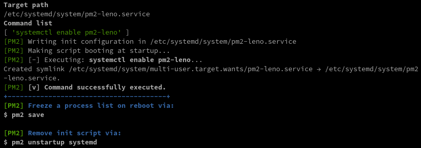  
Vous avez maintenant créé une unité systemd qui exécute pm2 pour votre utilisateur au démarrage. Cette instance pm2, à son tour, lance radiolise

Démarrer le service avec systemctl:

    sudo systemctl start pm2-leno

Un redémarrage de la machine est souhaitable 

    systemctl status pm2-leno

```
● pm2-leno.service - PM2 process manager
     Loaded: loaded (/etc/systemd/system/pm2-leno.service; enabled; preset: enabled)
     Active: active (running) since Fri 2024-01-05 18:47:50 CET; 1min 6s ago
       Docs: https://pm2.keymetrics.io/
    Process: 941 ExecStart=/home/leno/.nvm/versions/node/v20.10.0/lib/node_modules/pm2/bin/pm2 resurrect (code=exited, status=0/SUCCESS)
   Main PID: 1368 (PM2 v5.3.0: God)
      Tasks: 15 (limit: 14162)
     Memory: 71.5M
        CPU: 6.445s
     CGroup: /system.slice/pm2-leno.service
             └─1368 "PM2 v5.3.0: God Daemon (/home/leno/.pm2)"

janv. 05 18:47:50 rnmkcy.eu pm2[941]: [PM2] PM2 Successfully daemonized
janv. 05 18:47:50 rnmkcy.eu pm2[941]: [PM2] Resurrecting
janv. 05 18:47:50 rnmkcy.eu pm2[941]: [PM2] Restoring processes located in /home/leno/.pm2/dump.pm2
janv. 05 18:47:50 rnmkcy.eu pm2[941]: [PM2] Process /home/leno/.nvm/versions/node/v20.10.0/bin/radiolise restored
janv. 05 18:47:50 rnmkcy.eu pm2[941]: ┌────┬──────────────┬─────────────┬─────────┬─────────┬──────────┬────────┬──────┬───────────┬──────────┬──────────┬──────────┬──────────┐
janv. 05 18:47:50 rnmkcy.eu pm2[941]: │ id │ name         │ namespace   │ version │ mode    │ pid      │ uptime │ ↺    │ status    │ cpu      │ mem      │ user     │ watching │
janv. 05 18:47:50 rnmkcy.eu pm2[941]: ├────┼──────────────┼─────────────┼─────────┼─────────┼──────────┼────────┼──────┼───────────┼──────────┼──────────┼──────────┼──────────┤
janv. 05 18:47:50 rnmkcy.eu pm2[941]: │ 0  │ radiolise    │ default     │ 0.39.6  │ fork    │ 1436     │ 0s     │ 0    │ online    │ 0%       │ 30.0mb   │ leno     │ disabled │
janv. 05 18:47:50 rnmkcy.eu pm2[941]: └────┴──────────────┴─────────────┴─────────┴─────────┴──────────┴────────┴──────┴───────────┴──────────┴──────────┴──────────┴──────────┘
janv. 05 18:47:50 rnmkcy.eu systemd[1]: Started pm2-leno.service - PM2 process manager.
```

Votre application fonctionne et écoute sur localhost, mais vous devez mettre en place un moyen pour que vos utilisateurs y accèdent. Pour cela, nous allons mettre en place le serveur web Nginx comme proxy inverse.

    /etc/nginx/conf.d/radio.rnmkcy.eu.conf 

```
server {
    listen 80;
    listen [::]:80;
    server_name  radio.rnmkcy.eu;
    return 301 https://radio.rnmkcy.eu$request_uri;
}

server {
    listen       443 ssl http2;
    listen       [::]:443 ssl http2;
    server_name  radio.rnmkcy.eu;

    include /etc/nginx/conf.d/security.conf.inc;

    location / {
        proxy_pass http://127.0.0.1:56225;
        proxy_http_version 1.1;
        proxy_set_header Upgrade $http_upgrade;
        proxy_set_header Connection 'upgrade';
        proxy_set_header Host $host;
        proxy_cache_bypass $http_upgrade;
    }

}
```

Vérifier et recharger nginx

    sudo nginx -t && sudo systemctl reload nginx

Lien <https://radio.rnmkcy.eu>

### webauthn (NON INSTALLE)

*standard pour l'authentification sur le web utilisant la cryptographie asymétrique*

Dossier de travail `/sharenfs/rnmkcy/` avec les droits utilisateur (leno ID=1000)

    cd /sharenfs/rnmkcy/

Cloner le git 

    git clone https://github.com/davidearl/webauthn.git

accessible en lecture/écriture sur pc1 `~/media/sharenfs/rnmkcy/webauthn/`

Cela nécessite

* [Bibliothèque PHP CBOR](https://github.com/2tvenom/CBOREncode): peut être installé en utilisant l'installation de compositeur dans le répertoire du projet
* [phpseclib](https://github.com/phpseclib/phpseclib), ditto
* Un récent openssl inclus dans PHP ([openssl_vérify](http://php.net/manual/en/function.openssl-verify.php) en particulier)
* PHP 5.6.1 ou ultérieur (de préférence PHP 7.4 ou 8.1; non testé avec PHP 8.2, qui a quelques modifications significatives aux déclarations de propriétés)

Exemple

Le code d'exemple est en direct à <https://webauthn.davidearl.uk>

Pour accueillir l'exemple vous-même,

* placer le code dans la hiérarchie des documents pour votre serveur (par exemple https://example.com/webauthn),
* installer CBOR etc. en utilisant l'installation de composer
* Visiter url https://exemple.com/webauthn/exemple

Si vous mettez tous les répertoires dans webauthn à votre racine de document et ajoutez un index. php comme suit, vous pouvez l'exécuter au niveau supérieur comme par exemple. https://exemple.com (utilisez votre nom de domaine, évidemment).

    <?php chdir('exemple'); include_once('index.php');

Installer PHP 8.1

    sudo apt install php8.1 php8.1-fpm

Créer un pool php spécifique

    cp /etc/php/8.1/fpm/pool.d/www.conf /etc/php/8.1/fpm/pool.d/webauth.conf

Modifier le fichier `/etc/php/8.1/fpm/pool.d/webauth.conf`

```
[webauth]
; Default Values: The user is set to master process running user by default.
;                 If the group is not set, the user's group is used.
user = leno    
group = leno
; Default Values: The user is set to master process running user by default.
;                 If the group is not set, the user's group is used.
user = leno    
group = leno

; Note: This value is mandatory.
listen = /run/php/php8.1-fpm-webauth.sock
```

Relancer php-fpm

    sudo systemctl restart php8.1-fpm

Installer CBOR et phpseclib

    composer install

```
Installing dependencies from lock file (including require-dev)
Verifying lock file contents can be installed on current platform.
Package operations: 5 installs, 0 updates, 0 removals
  - Downloading atoum/atoum (4.1)
  - Downloading phpseclib/phpseclib (3.0.17)
  - Installing 2tvenom/cborencode (1.0.2): Extracting archive
  - Installing atoum/atoum (4.1): Extracting archive
  - Installing paragonie/random_compat (v9.99.100): Extracting archive
  - Installing paragonie/constant_time_encoding (v2.6.3): Extracting archive
  - Installing phpseclib/phpseclib (3.0.17): Extracting archive
Generating autoload files
1 package you are using is looking for funding.
Use the `composer fund` command to find out more!
```

Le fichier nginx `/etc/nginx/conf.d/webauth.rnmkcy.eu.conf` 

```
server {
    listen 443 ssl http2;
    listen [::]:443 ssl http2;
    server_name webauth.rnmkcy.eu;

    include /etc/nginx/conf.d/security.conf.inc;
    root /sharenfs/rnmkcy/webauthn/;

    location / {
      index index.php;
    }


  location ~ \.php(?:$|/) {
    include fastcgi_params;
    fastcgi_param SCRIPT_FILENAME $request_filename;
    fastcgi_split_path_info ^(.+\.php)(/.+)$;
    fastcgi_param HTTPS on;

    fastcgi_param modHeadersAvailable true;         # Avoid sending the security headers twice
    fastcgi_param front_controller_active true;     # Enable pretty urls
    fastcgi_param HTTP_ACCEPT_ENCODING "";          # Disable encoding of nextcloud response to inject ynh scripts
    fastcgi_pass unix:/var/run/php/php8.1-fpm-webauth.sock;
    fastcgi_intercept_errors on;
    fastcgi_request_buffering off;
  }
}
```

Vérifier et recharger nginx

    sudo nginx -t && sudo systemctl reload nginx

Créer un fichier `/sharenfs/rnmkcy/webauthn/index.php` 

<details>
<summary><b>Etendre Réduire index.php</b></summary>

  
<?php

/*
If you put the whole webauthn directory in the www document root and put an index.php in there
which just includes this file, it should then work. Alternatively set it as a link to this file.
*/

//require_once(dirname(__DIR__).'vendor/autoload.php');
require_once('vendor/autoload.php');

/* In this example, the user database is simply a directory of json files
  named by their username (urlencoded so there are no weird characters
  in the file names). For simplicity, it's in the HTML tree so someone
  could look at it - you really, really don't want to do this for a
  live system 
  */
define('USER_DATABASE', '.users');
if (! file_exists(USER_DATABASE)) {
  if (! @mkdir(USER_DATABASE)) {
    error_log(sprintf('Cannot create user database directory - is the/ directory writable by the web server? If not: "mkdir %s; chmod 777 %s"', USER_DATABASE, USER_DATABASE));
    die(sprintf("cannot create %s - see error log", USER_DATABASE));
  }
}
session_start();

function oops($s){
  http_response_code(400);
  echo "{$s}\n";
  exit;
}

function userpath($username){
  $username = str_replace('.', '%2E', $username);
  return sprintf('%s/%s.json', USER_DATABASE, urlencode($username));
}

function getuser($username){
  $user = @file_get_contents(userpath($username));
  if (empty($user)) { oops('user not found'); }
  $user = json_decode($user);
  if (empty($user)) { oops('user not json decoded'); }
  return $user;
}

function saveuser($user){
  file_put_contents(userpath($user->name), json_encode($user));
}

/* A post is an ajax request, otherwise display the page */
if (! empty($_POST)) {

  try {

    $webauthn = new \Davidearl\WebAuthn\WebAuthn($_SERVER['HTTP_HOST']);

    switch(TRUE){

    case isset($_POST['registerusername']):
      /* initiate the registration */
      $username = $_POST['registerusername'];
      $crossplatform = ! empty($_POST['crossplatform']) && $_POST['crossplatform'] == 'Yes';
      $userid = md5(time() . '-'. rand(1,1000000000));

      if (file_exists(userpath($username))) {
        oops("user '{$username}' already exists");
      }

      /* Create a new user in the database. In principle, you can store more
         than one key in the user's webauthnkeys,
         but you'd probably do that from a user profile page rather than initial
         registration. The procedure is the same, just don't cancel existing
         keys like this.*/
      $user = (object)['name'=> $username,
                       'id'=> $userid,
                       'webauthnkeys' => $webauthn->cancel()];
      saveuser($user);
      $_SESSION['username'] = $username;
      $j = ['challenge' => $webauthn->prepareChallengeForRegistration($username, $userid, $crossplatform)];
      break;

    case isset($_POST['register']):
      /* complete the registration */
      if (empty($_SESSION['username'])) { oops('username not set'); }
      $user = getuser($_SESSION['username']);

      /* The heart of the matter */
      $user->webauthnkeys = $webauthn->register($_POST['register'], $user->webauthnkeys);

      /* Save the result to enable a challenge to be raised agains this
         newly created key in order to log in */
      saveuser($user);
      $j = 'ok';

      break;

    case isset($_POST['loginusername']):
      /* initiate the login */
      $username = $_POST['loginusername'];
      $user = getuser($username);
      $_SESSION['loginname'] = $user->name;

      /* note: that will emit an error if username does not exist. That's not
         good practice for a live system, as you don't want to have a way for
         people to interrogate your user database for existence */

      $j['challenge'] = $webauthn->prepareForLogin($user->webauthnkeys);

      /* Save user again, which sets server state to include the challenge expected */
      saveuser($user);
      break;

    case isset($_POST['login']):
      /* authenticate the login */
      if (empty($_SESSION['loginname'])) { oops('username not set'); }
      $user = getuser($_SESSION['loginname']);

      if (! $webauthn->authenticate($_POST['login'], $user->webauthnkeys)) {
        http_response_code(401);
        echo 'failed to authenticate with that key';
        exit;
      }
      /* Save user again, which sets server state to include the challenge expected */
      saveuser($user);
      $j = 'ok';

      break;

    default:
      http_response_code(400);
      echo "unrecognized POST\n";
      break;
    }

  } catch(Exception $ex) {
    oops($ex->getMessage());
  }

  header('Content-type: application/json');
  echo json_encode($j);
  exit;
}

?>
<!DOCTYPE/>
/>
<head>
<title>webauthn php server side example and test</title>
<style>
body {
  font-family: Verdana, sans-serif;
}
h1 {
  font-size: 1.5em;
}
h2 {
  font-size: 1.2em;
}
.ccontent {
  display: flex;
  flex-wrap: wrap;
  margin: 10px;
}
.cbox {
  width: 100%;
  max-width: 480px;
  min-height: 150px;
  border: 1px solid black;
  padding: 10px;
  margin: 10px;
  line-height: 2;
}
.cdokey {
  display: none;
  background-color: orange;
  color: white;
  font-weight: bold;
  margin: 10px 0;
  padding: 10px;
}
.cerror {
  display: none;
  background-color: tomato;
  color: white;
  padding: 10px;
  font-weight: bold;
}
.cdone {
  display: none;
  background-color: darkgreen;
  color: white;
  padding: 10px;
  font-weight: bold;
}
.chint {
  max-width: 450px;
  margin-left: 2em;
}
</style>

</head>
<body>
  <h1>webauthn php server side example and test</h1>
  <ul>
	<li><a href='https://github.com/davidearl/webauthn'>GitHub</a>
  </ul>

  <div class='cerror'></div>
  <div class='cdone'></div>

  <div class='ccontent'>

	<div class='cbox' id='iregister'>
	  <h2>User Registration</h2>
	  <form id='iregisterform' action='/' method='POST'>
		<label> enter a new username (eg email address): <input type='text' name='registerusername'></label><br>
        cross-platform?<sup>*</sup> <select name='cp'>
          <option value=''>(choose one)</option>
          <option>No</option>
          <option>Yes</option>
        </select><br>
		<input type='submit' value='Submit'><br>
	  </form>
	  <div class='cdokey' id='iregisterdokey'>
		Do your thing: press button on key, swipe fingerprint or whatever
	  </div>
	</div>

	<div class='cbox' id='ilogin'>
	  <h2>User Login</h2>
	  <form id='iloginform' action='/' method='POST'>
		<label> enter existing username: <input type='text' name='loginusername'></label><br>
		<input type='submit' value='Submit'>
	  </form>
	  <div class='cdokey' id='ilogindokey'>
		Do your thing: press button on key, swipe fingerprint or whatever
	  </div>

	</div>

  </div>

  <p class='chint'>* Use cross-platform 'Yes' when you have a removable device, like
  a Yubico key, which you would want to use to login on different
  computers; say 'No' when your device is attached to the computer (in
  that case in Windows 10 1903 release, your login
  is linked to Windows Hello and you can use any device it supports
  whether registered with that device or not, but only on that
  computer). The choice affects which device(s) are offered by the
  browser and/or computer security system.</p>

<script src='src/webauthnregister.js'></script>
<script src='src/webauthnauthenticate.js'></script>

<!-- only for the example, the webauthn js does not need jquery itself -->
<script src='https://code.jquery.com/jquery-3.3.1.min.js'></script>

<script>
  $(function(){

	$('#iregisterform').submit(function(ev){
		var self = $(this);
		ev.preventDefault();
		var cp = $('select[name=cp]').val();
		if (cp == "") {
			$('.cerror').show().text("Please choose cross-platform setting - see note below about what this means");
			return;
		}
		
		$('.cerror').empty().hide();

		$.ajax({url: '/',
				method: 'POST',
				data: {registerusername: self.find('[name=registerusername]').val(), crossplatform: cp},
				dataType: 'json',
				success: function(j){
					$('#iregisterform,#iregisterdokey').toggle();
					/* activate the key and get the response */
					webauthnRegister(j.challenge, function(success, info){
						if (success) {
							$.ajax({url: '/',
									method: 'POST',
									data: {register: info},
									dataType: 'json',
									success: function(j){
										$('#iregisterform,#iregisterdokey').toggle();
										$('.cdone').text("registration completed successfully").show();
										setTimeout(function(){ $('.cdone').hide(300); }, 2000);
									},
									error: function(xhr, status, error){
										$('.cerror').text("registration failed: "+error+": "+xhr.responseText).show();
									}
								   });
						} else {
							$('.cerror').text(info).show();
						}
					});
				},

				error: function(xhr, status, error){
					$('#iregisterform').show();
					$('#iregisterdokey').hide();
					$('.cerror').text("couldn't initiate registration: "+error+": "+xhr.responseText).show();
				}
			   });
	});

	$('#iloginform').submit(function(ev){
		var self = $(this);
		ev.preventDefault();
		$('.cerror').empty().hide();

		$.ajax({url: '/',
				method: 'POST',
				data: {loginusername: self.find('[name=loginusername]').val()},
				dataType: 'json',
				success: function(j){
					$('#iloginform,#ilogindokey').toggle();
					/* activate the key and get the response */
					webauthnAuthenticate(j.challenge, function(success, info){
						if (success) {
							$.ajax({url: '/',
									method: 'POST',
									data: {login: info},
									dataType: 'json',
									success: function(j){
										$('#iloginform,#ilogindokey').toggle();
										$('.cdone').text("login completed successfully").show();
										setTimeout(function(){ $('.cdone').hide(300); }, 2000);
									},
									error: function(xhr, status, error){
										$('.cerror').text("login failed: "+error+": "+xhr.responseText).show();
									}
								   });
						} else {
							$('.cerror').text(info).show();
						}
					});
				},

				error: function(xhr, status, error){
					$('#iloginform').show();
					$('#ilogindokey').hide();
					$('.cerror').text("couldn't initiate login: "+error+": "+xhr.responseText).show();
				}
			   });
	});

});
</script>

</body>
</>




</details>


## Virtualisation KVM

### Installer KVM sur le serveur

[Installer KVM (Kernel Virtual Machine) sur un serveur](/posts/Installer_KVM_Kernel_Virtual_Machine_sur_un_serveur/)

Modifier le pool par défaut après avoir ajouté un disque  /srv/kvm  
Créer un dossier kvm

    sudo mkdir -p /srv/kvm/pool

Pour indiquer le chemin d'accès au pool de stockage pour le type (Dir), nous avons besoin du dernier argument, "target", bien que nous puissions omettre les autres arguments en utilisant le symbole "-".

    sudo virsh pool-define-as --name poolk --type dir --target /srv/kvm/libvirt/images

pool poolk défini

Utilisez la commande suivante pour inspecter chaque pool de stockage que vous avez dans l'environnement

     sudo virsh pool-list --all

```
 Nom       État      Démarrage automatique
--------------------------------------------
 boot     actif     Oui
 images   actif     Oui
 poolk    inactif   no
```

Démarrer le pool de stockage et le charger lors du démarrage

    sudo virsh pool-autostart poolk

Le pool poolk démarrera automatiquement

Supprimer les pool boot, images et default

```
sudo virsh pool-destroy boot    # Pool boot détruit
sudo virsh pool-undefine boot   # Le pool boot a été supprimé
sudo virsh pool-destroy images  # Pool images détruit
sudo virsh pool-undefine images # Le pool images a été supprimé
```

Vérification

     sudo virsh pool-list --all

```
 Nom     État    Démarrage automatique
----------------------------------------
 poolk   actif   Oui
```

Pour manipuler les "pool" en xml  
Edition : `virsh pool-edit poolk`  
Edition : `virsh pool-dumpxml poolk`  

Créer un second pool nommé "poolb" dossier `/srv/kvm/libvirt/boot`

Liste des "pool" : `sudo virsh pool-list --all`

```
 Nom     État    Démarrage automatique
----------------------------------------
 poolb   actif   Oui     # /srv/kvm/libvirt/boot
 poolk   actif   Oui     # /srv/kvm/libvirt/images
```

### Clavier étendu

Pour avoir un clavier étendu sur la VM  
[Passing keyboard/mouse via Evdev](https://wiki.archlinux.org/title/PCI_passthrough_via_OVMF#Passing_keyboard/mouse_via_Evdev)  

D'abord, trouvez vos périphériques clavier et souris dans /dev/input/by-id/. Seuls les appareils avec événement en leur nom sont valides: `ls /dev/input/by-id/`

Sur PC1 : **usb-Logitech_USB_Receiver-if01-event-mouse** et **usb-Kingston_HyperX_Alloy_Origins-if02-event-kbd** 

On va juste ajouter le clavier cr la souris ne pose pas de problème  
Ajouter le clavier à votre configuration (exemple VM EndeavourOS) dans `<devices>`:

    sudo virsh edit EndeavourOS

```xml
    <input type='evdev'>
      <source dev='/dev/input/by-id/usb-Kingston_HyperX_Alloy_Origins-if02-event-kbd' grab='all' repeat='on' grabToggle='ctrl-ctrl'/>
    </input>
```

Vous pouvez également envisager de passer des entrées PS/2 à Virtio dans vos configurations.

```xml
    <input type='keyboard' bus='virtio'/>
```

Les dispositifs d'entrée virtio ne seront pas utilisés jusqu'à ce que les pilotes invités soient installés. QEMU continuera d'envoyer des événements clés aux appareils PS2 jusqu'à ce qu'il détecte l'initialisation du pilote d'entrée virtio. Notez que les appareils PS2 ne peuvent pas être enlevés car ils sont une fonction interne des chipsets Q35/440FX émulés. 

### Réseau NAT IPV6

NAT libvirt pour accepter IPV6  

Une modification obligatoire sous peine d'une erreur réseau  

Vérifiez la configuration de l'hôte : l'interface eno1 a des routes IPv6 autoconfigurées par le noyau et l'activation de la redirection sans que accept_ra soit fixé à 2 entraînera le vidage de ces routes par le noyau, ce qui brisera le réseau.
{: .prompt-danger }

Fixer accept_ra à 2

    sysctl -q -e -w net.ipv6.conf.eno1.accept_ra=2

Ajout au fichier sysctl.conf (debian)

    echo "net.ipv6.conf.eno1.accept_ra=2" | sudo tee -a /etc/sysctl.conf

créez un fichier XML appelé `network-nat.xml` :

    nano network-nat.xml

Ajoutez les lignes suivantes :

```xml
<network>
  <name>network-nat</name>
  <forward mode='nat'>
    <nat ipv6='yes'>
      <port start='1024' end='65535'/>
    </nat>
  </forward>
  <bridge name='virbr1' stp='on' delay='0'/>
  <mac address='52:54:00:84:e0:df'/>
  <domain name='network-nat'/>
  <ip address='192.168.100.1' netmask='255.255.255.0'>
    <dhcp>
      <range start='192.168.100.128' end='192.168.100.254'/>
    </dhcp>
  </ip>
  <ip family='ipv6' address='2a01:e0a:9c8:2081::' prefix='64'>
  </ip>
</network>
```

Exécutez les commandes suivantes  pour démarrer le pont nouvellement créé et en faire le pont par défaut pour les VM :

```bash
sudo virsh net-define network-nat.xml       
sudo virsh net-start network-nat            
sudo virsh net-autostart network-nat        
```

Pour vérifier s'il est actif et démarré  
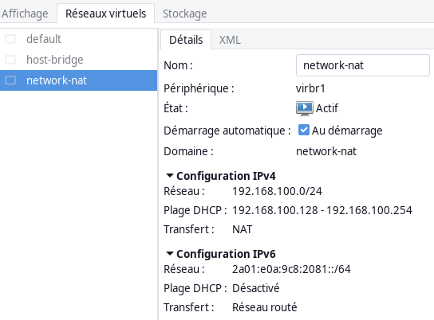

### Structure libvirt

```
# Les configurations xml
root@rnmkcy:/home/leno# tree -L 2 /etc/libvirt/qemu
/etc/libvirt/qemu
├── alpine-vm.xml
├── autostart
│   ├── alpine-vm.xml -> /etc/libvirt/qemu/alpine-vm.xml
│   ├── vm-debian12.xml -> /etc/libvirt/qemu/vm-debian12.xml
│   └── vm-ouestline.xml -> /etc/libvirt/qemu/vm-ouestline.xml
├── bookworm01.xml
├── debsrv01.xml
├── leno-alpine-vm01.xml
├── lenoyuno.xml
├── miniflux.xml
├── networks
│   ├── autostart
│   ├── default.xml
│   └── host-bridge.xml
├── ttrss.xml
├── vm-debian12.xml
└── vm-ouestline.xml

# Les images iso et qcow2
root@rnmkcy:/home/leno# tree -L 3 /srv/kvm/
/srv/kvm/
└── libvirt
    ├── boot
    │   ├── alpine-standard-3.20.2-x86_64.iso
    │   ├── archlinux-2024.09.01-x86_64.iso
    │   └── debian-12.6.0-amd64-netinst.iso
    └── images
        ├── alpine-ouest
        ├── alpine-vm01.qcow2
        ├── alpine-vm.qcow2
        ├── alpine-vm.qcow2.sav
        ├── bookworm01.qcow2
        ├── debian-10-onlyoffice.qcow2
        ├── debian-12-authelia.qcow2
        ├── debian-12-lldap.qcow2
        ├── debian-12-nocloud-amd64.qcow2
        ├── lenoyuno.qcow2
        ├── miniflux.qcow2
        ├── ttrss.qcow2
        ├── vm-bookworm_sav.qcow2
        ├── vm-debian12.qcow2
        └── vm-ouestline.qcow2

```

### VM - Alpine ouestline

[Alpine Linux dans un environnement virtuel KVM Lenovo](/posts/Alipine-Linux/)

### VM - vm-debian12

[Lenovo KVM - Machine virtuelle debian 12 (vm-debian12)](/posts/Qemu-KVM-Machine_virtuelle_debian_12_image_cloud_Qcow2/)

### Arrêt VM avant reboot Hôte

Il faut arrêter proprement toutes les machines virtuelles en cours d'exécution avant de stopper ou redémarrer la machine hôte"

Script qui s'exécute avant arrêt/redémarrage machine hôte

    nano /home/leno/run_before_shutdown.sh 

```
#!/bin/bash
# Identifiants machines virtuelles en cours d'exécution 
while read vmid
do
  virsh shutdown $vmid
done <<< "$(virsh list --id --state-running)"	
# Le triple chevron <<< permet de prendre la sortie de commande en entrée de boucle.
```

Droits en exécution

    chmod +x /home/leno/run_before_shutdown.sh

Le service systemd

    nano /etc/systemd/system/run-before-shutdown.service

```
[Unit]
Description=shutdown vm
DefaultDependencies=no
Before=shutdown.target

[Service]
Type=oneshot
ExecStart=/home/leno/run_before_shutdown.sh
TimeoutStartSec=0

[Install]
WantedBy=shutdown.target
```

Rechargement et activation service

```shell
systemctl daemon-reload
systemctl enable run-before-shutdown.service
```

## Sécurité

### Lynis

[Lynis pour auditer et renforcer la sécurité des systèmes basés sur Linux](/posts/Lynis/)

### Rkhunter

[Rkhunter (Rootkit Hunter)](/posts/Rkhunter-Rootkit_Hunter/)

## Maintenance

### Liaison SSH Yunohost xoyaz.xyz

Créer une liaison SSH avec le serveur xoyaz.xyz qui n'accepte que les connexions avec clé sur le port 55030

* Serveur distant: 37.60.230.30 (xoyaz.xyz)
* Utilisateur: yani
* Port : 55030

Générer une paire de clé curve25519-sha256 (ECDH avec Curve25519 et SHA2) pour une liaison SSH avec le serveur.

    ssh-keygen -t ed25519 -o -a 100 -f ~/.ssh/xoyaz_xyz

La clé publique `~/.ssh/xoyaz_xyz.pub` 

    ssh-ed25519 AAAAC3NzaC1lZDI1NTE5AAAAIFzVuzJY77wG5oTeatGgNOLmySGbRDNvj/PWLeQK+X9B leno@rnmkcy.eu

Depuis un poste ayant accès au serveur xoyaz.xyz , se connecter et ajouter la clé publique en fin du fichier `~/.ssh/authorized_keys`

    echo "ssh-ed25519 AAAAC3NzaC1lZDI1NTE5AAAAIFzVuzJY77wG5oTeatGgNOLmySGbRDNvj/PWLeQK+X9B leno@rnmkcy.eu" >> $HOME/.ssh/authorized_keys

Depuis un terminal du serveur  rnmkcy.eu, première connexion au serveur xoyaz.xyz via ssh

    ssh -i ~/.ssh/xoyaz_xyz -p 55030 yani@xoyaz.xyz

```
The authenticity of host '[xoyaz.xyz]:55030 ([37.60.230.30]:55030)' can't be established.
ED25519 key fingerprint is SHA256:5MZJ+RVEpv92P5BbBtfQrYr2+brt6HyD+OWE8qv8cek.
This key is not known by any other names.
Are you sure you want to continue connecting (yes/no/[fingerprint])? yes
Warning: Permanently added '[xoyaz.xyz]:55030' (ED25519) to the list of known hosts.
Linux xoyaz.xyz 6.1.0-26-amd64 #1 SMP PREEMPT_DYNAMIC Debian 6.1.112-1 (2024-09-30) x86_64
 __   __                 _              _                                                      
 \ \ / /_  _  _ _   ___ | |_   ___  ___| |_                                                    
  \ V /| || || ' \ / _ \| ' \ / _ \(_-<|  _|                                                   
   |_|  \_,_||_||_|\___/|_||_|\___//__/ \__|                                                   
 __ __ ___  _  _  __ _  ___   __ __ _  _  ___                                                  
 \ \ // _ \| || |/ _` ||_ / _ \ \ /| || ||_ /                                                  
 /_\_\\___/ \_, |\__,_|/__|(_)/_\_\ \_, |/__|                                                  
            |__/                    |__/                                                       
  ____ ____    __   __     ___  ____  __     ____  __                                          
 |__ /|__  |  / /  /  \   |_  )|__ / /  \   |__ / /  \                                         
  |_ \  / /_ / _ \| () |_  / /  |_ \| () |_  |_ \| () |                                        
 |___/ /_/(_)\___/ \__/(_)/___||___/ \__/(_)|___/ \__/ 
You have no mail.
Last login: Sat Nov  9 08:31:18 2024 from 193.32.126.230
```

Si l'on veut un accès SSH par IP 

    ssh -i ~/.ssh/xoyaz_xyz -p 55030 yani@37.60.230.30

```
The authenticity of host '[37.60.230.30]:55030 ([37.60.230.30]:55030)' can't be established.
ED25519 key fingerprint is SHA256:5MZJ+RVEpv92P5BbBtfQrYr2+brt6HyD+OWE8qv8cek.
This host key is known by the following other names/addresses:
    ~/.ssh/known_hosts:27: [xoyaz.xyz]:55030
Are you sure you want to continue connecting (yes/no/[fingerprint])? yes
Warning: Permanently added '[37.60.230.30]:55030' (ED25519) to the list of known hosts.
Linux xoyaz.xyz 6.1.0-26-amd64 #1 SMP PREEMPT_DYNAMIC Debian 6.1.112-1 (2024-09-30) x86_64
 __   __                 _              _                                                      
 \ \ / /_  _  _ _   ___ | |_   ___  ___| |_                                                    
  \ V /| || || ' \ / _ \| ' \ / _ \(_-<|  _|                                                   
   |_|  \_,_||_||_|\___/|_||_|\___//__/ \__|                                                   
 __ __ ___  _  _  __ _  ___   __ __ _  _  ___                                                  
 \ \ // _ \| || |/ _` ||_ / _ \ \ /| || ||_ /                                                  
 /_\_\\___/ \_, |\__,_|/__|(_)/_\_\ \_, |/__|                                                  
            |__/                    |__/                                                       
  ____ ____    __   __     ___  ____  __     ____  __                                          
 |__ /|__  |  / /  /  \   |_  )|__ / /  \   |__ / /  \                                         
  |_ \  / /_ / _ \| () |_  / /  |_ \| () |_  |_ \| () |                                        
 |___/ /_/(_)\___/ \__/(_)/___||___/ \__/(_)|___/ \__/ 
You have no mail.
Last login: Sat Nov  9 08:39:47 2024 from 82.64.18.243
```

### Gestionnaire liaison SSH (sshm)

Utiliser "sshm" pour gérer les liaisons SSH  

Créer un alias

```bash
echo "alias sshm='$HOME/scripts/ssh-manager.sh'" >>  ~/.bash_aliases
source ~/.bash_aliases
```

La liste des serveurs `$HOME/.ssh/.ssh_servers`

```
IPv4v6;Alias;Adresse IP ou Domaine;Port;Clef;Opt;Chemin Local;Chemin Distant
xoyaz;yani;37.60.230.30;55030;xoyaz_xyz;;;Y;;4
iceyan;iceyan;185.112.146.46;55046;iceyan.xyz;;;Y;;4
icevps;hallmar;91.194.161.27;55027;icevps.xyz;;;Y;;4
```

### Syncthing (INACTIF)

*Syncthing est une application de synchronisation de fichiers pair à pair open source disponible pour Windows, Mac, Linux, Android, Solaris, Darwin et BSD. Aucun compte ni enregistrement préalable à l'utilisation auprès d'un tiers n'est nécessaire, ni même optionnelle. La sécurité et l'intégrité des données sont intégrées dans la conception du logiciel (<https://fr.wikipedia.org/wiki/Syncthing>)*

Paquets Debian/Ubuntu

Pour permettre au système de vérifier l'authenticité des paquets, vous devez fournir la clé de version.

```
# Add the release PGP keys:
sudo mkdir -p /etc/apt/keyrings
sudo curl -L -o /etc/apt/keyrings/syncthing-archive-keyring.gpg https://syncthing.net/release-key.gpg
```

Le canal stable est mis à jour avec les versions stables, généralement tous les premiers mardis du mois.

```
# Add the "stable" channel to your APT sources:
echo "deb [signed-by=/etc/apt/keyrings/syncthing-archive-keyring.gpg] https://apt.syncthing.net/ syncthing stable" | sudo tee /etc/apt/sources.list.d/syncthing.list
```

Et finallement

```
# Update and install syncthing:
sudo apt-get update
sudo apt-get install syncthing
```


**Utiliser Systemd pour configurer Syncthing en tant que service système**  

Le paquetage officiel Syncthing deb est livré avec le fichier de service systemd nécessaire. Dans le répertoire `/lib/systemd/system/`, vous trouverez un fichier `syncthing@.service`. Activez syncthing pour qu'il démarre automatiquement au démarrage en exécutant la commande ci-dessous.  
Remplacez le nom d'utilisateur par votre nom d'utilisateur réel.

```
sudo systemctl enable syncthing@leno.service
sudo systemctl start syncthing@leno.service
```

Vérifier le statut

    systemctl status syncthing@username.service

```
● syncthing@leno.service - Syncthing - Open Source Continuous File Synchronization for leno
     Loaded: loaded (/lib/systemd/system/syncthing@.service; enabled; preset: enabled)
     Active: active (running) since Sat 2024-06-22 11:02:15 CEST; 10s ago
       Docs: man:syncthing(1)
   Main PID: 706653 (syncthing)
      Tasks: 18 (limit: 14162)
     Memory: 28.2M
        CPU: 1.474s
     CGroup: /system.slice/system-syncthing.slice/syncthing@leno.service
             ├─706653 /usr/bin/syncthing serve --no-browser --no-restart --logflags=0
             └─706661 /usr/bin/syncthing serve --no-browser --no-restart --logflags=0

juin 22 11:02:16 rnmkcy.eu syncthing[706653]: [SUJWS] INFO: Loading HTTPS certificate: open>
```

Nous pouvons voir que le démarrage automatique de Syncthing est activé et qu'il est en cours d'exécution.

Le service systemd syncthing crée des fichiers de configuration sous /home/username/.config/syncthing/ et un dossier /home/username/Sync comme dossier de synchronisation par défaut. Le fichier de configuration principal est /home/username/.config/syncthing/config.xml.

**Désactiver Syncthing**

```bash
sudo systemctl disable syncthing@leno.service
sudo systemctl stop syncthing@leno.service
```

### Partitions LVM

#### Réduire la partion LVM thinkshare

*Réduction à 120Go*

en mode su

Arrêt samba

    systemctl stop smb

On démonte et on force le check de la partition :

    umount /sharenfs/
    fsck.ext4 -fy /dev/mapper/think--vg-thinkshare

On regarde la taille de la partition à réduire :

$ lvs

```
  LV         VG        Attr       LSize   Pool Origin Data%  Meta%  Move Log Cpy%Sync Convert
  lvssd      think-ssd -wi-ao---- 100,00g                                                    
  home       think-vg  -wi-ao---- <64,24g                                                    
  root       think-vg  -wi-ao---- <27,94g                                                    
  swap_1     think-vg  -wi-ao---- 976,00m                                                    
  thinkshare think-vg  -wi-a----- 371,65g                                                    
```

Ici je veux réduire à 120G, on va donc réduire à 119G. C’est pour être certain de ne perdre aucune donnée lorsque l’on va réduire le LV. Une fois le LV réduit à 120Go, on augmentera la taille du système de fichiers à celui du LV pour avoir nos 120G.

   resize2fs /dev/mapper/think--vg-thinkshare 119G

On réduit le logical volume :

   lvreduce -L 120G -v /dev/mapper/think--vg-thinkshare

On vérifie :

   lvs

```
  LV         VG        Attr       LSize   Pool Origin Data%  Meta%  Move Log Cpy%Sync Convert
  lvssd      think-ssd -wi-ao---- 100,00g                                                    
  home       think-vg  -wi-ao---- <64,24g                                                    
  root       think-vg  -wi-ao---- <27,94g                                                    
  swap_1     think-vg  -wi-ao---- 976,00m                                                    
  thinkshare think-vg  -wi-a----- 120,00g                                                    
```

On adapte la taille de notre système de fichiers pour atteindre les 120G :

   resize2fs /dev/mapper/think--vg-thinkshare

Remontage

    mount -a

Relance samba

    systemct start smb

#### Augmenter taille partition LVM

[LVM Resize – How to Increase an LVM Partition](https://www.rootusers.com/lvm-resize-how-to-increase-an-lvm-partition/)

Exemple : Agrandir de 50Go le volume logique LVM `/dev/think-vg/nfs-share`

Informations : `sudo lvdisplay /dev/think-vg/nfs-share`

```
  --- Logical volume ---
  LV Path                /dev/think-vg/nfs-share
  LV Name                nfs-share
  VG Name                think-vg
  LV UUID                eflpKO-86o2-LviU-L5uj-71yn-cu3Z-NOfsQt
  LV Write Access        read/write
  LV Creation host, time rnmkcy.eu, 2024-01-07 14:45:02 +0100
  LV Status              available
  # open                 1
  LV Size                150,00 GiB
  Current LE             51200
  Segments               2
  Allocation             inherit
  Read ahead sectors     auto
  - currently set to     256
  Block device           254:3
```

Etendre le volume logique avec l'option `-L` pour augmenter le volume d'une taille spécifiée (M pour Mégaoctets, G pour Gigaoctets, T pour Téraoctets). Vous pouvez également supprimer le + pour augmenter le volume jusqu'à la quantité spécifiée

    lvextend -L+50G /dev/think-vg/nfs-share 

Alternativement, si vous souhaitez utiliser tout l'espace libre du groupe de volumes plutôt que de spécifier une taille à augmenter, exécutez  `lvextend -l +100%FREE` 

Redimensionner le système de fichiers. Cette opération permet d'étendre le système de fichiers de manière à ce qu'il occupe l'espace nouvellement créé à l'intérieur du volume logique.

    resize2fs /dev/think-vg/nfs-share

Une fois que le système de fichiers a été redimensionné, l'espace devrait être prêt à être utilisé. Si vous exécutez la commande « df » pour visualiser l'espace disque, vous devriez constater qu'il a été augmenté avec succès.

    df -h |grep "share"

```
/dev/mapper/think--vg-nfs--share            196G     61G  127G  33% /sharenfs
```

#### Augmenter taille SWAP

en mode su

Désactiver swap

    swapoff -a

Augmenter taille swap LVM à 8Go

    lvextend -L 8G /dev/think-vg/swap_1

Réactiver swap

    swapon

### Renouvellement Certificats SSL

Renouvellement auto des certificats par acme n'exécute pas le `--reloadcmd` , il faut exécuter un script dans une tâche cron

Les service de messagerie est assuré par msmtp

Le script de renouvellement `~/echeance_certificat.sh`

```shell
#!/bin/bash

# Domaine
if [ -z "$1" ]
  then
   _domain="rnmkcy.eu"
  else
   _domain=$1
fi
echo $_domain

# Forcer le renouvellement par un 2ième argument , exemple 'force' 
# Test expiration certificats
PEM="/etc/ssl/private/$_domain-fullchain.pem"
#
# 1 jour x 24 heures x 60 minutes x 60 secondes = 86 400
# 2 days in seconds 
DAYS="172800" 
_openssl="/usr/bin/openssl"
$_openssl x509 -enddate -noout -in "$PEM"  -checkend "$DAYS" | grep -q 'Certificate will expire'

if [ $? -eq 0 -o ! -z "$2" ] 
then
  # certificat expire dans 2 jours , on renouvelle
  echo "Force renouvellement des certificats Lets Encrypt"
  "$HOME/.acme.sh"/acme.sh --force --cron --home "$HOME/.acme.sh" --renew-hook "$HOME/.acme.sh/acme.sh --ecc --install-cert -d $_domain --key-file /etc/ssl/private/$_domain-key.pem --fullchain-file /etc/ssl/private/$_domain-fullchain.pem --set-notify --notify-hook smtp"
  #	
  echo "Recharge service nginx"
  sudo systemctl reload nginx
  #
  # Envoi message
  resul="Le certificat TLS/SSL ("$PEM") a été renouvellé sur "$_domain" ["$(date)"]"
  # Si anomalie , ajout option --debug à msmtp
  echo -e "Subject: Renouvellement certificat\r\nMIME-Version: 1.0\nContent-Type: text/; charset=utf-8\r\n\r\n"$resul |msmtp --from=postmaster@rnmkcy.eu -t yako@xoyize.xyz
else
  echeance=$($_openssl x509 -enddate -noout -in "$PEM" |grep "notAfter=" |awk -F'=' '{print $2}')
  #echo -e "Subject: Certificat\r\nMIME-Version: 1.0\nContent-Type: text/; charset=utf-8\r\n\r\nEchéance Certificat Domaine "$_domain" : "$echeance |msmtp --from=postmaster@rnmkcy.eu -t yako@xoyize.xyz
  echo "Echéance Certificat Domaine "$_domain" : "$echeance
fi
```

Le rendre exécutable

    chmod +x ~/echeance_certificat.sh

Créer la tâche

    crontab -e

```
# serveur messagerie mx1.rnmkcy.eu
45 02 * * * "$HOME/.acme.sh"/acme.sh --cron --home "$HOME/.acme.sh" --renew-hook "$HOME/.acme.sh/acme.sh --ecc --install-cert -d 'mx1.rnmkcy.eu' --key-file /etc/maddy/certs/mx1.rnmkcy.eu/privkey.pem --fullchain-file /etc/maddy/certs/mx1.rnmkcy.eu/fullchain.pem" > /dev/null
# *.rnmkcy.eu
00 04 * * * $HOME/echeance_certificat.sh rnmkcy.eu
```

Les certificats seront renouvellés 7 jours avant l'échéance

Les échéances sont lisibles en exécutant `acme.sh --list`  

```
Main_Domain    KeyLength  SAN_Domains  CA               Created               Renew
mx1.rnmkcy.eu  "ec-384"   no           LetsEncrypt.org  2024-06-03T08:20:04Z  2024-08-01T08:20:04Z
rnmkcy.eu      "ec-384"   *.rnmkcy.eu  LetsEncrypt.org  2024-06-03T08:20:17Z  2024-08-01T08:20:17Z
```

### Etat des lieux

Utilise un script bash nommé `etat_des_lieux.sh` dans le dossier `~/scripts/`

<details>
<summary><b>Etendre Réduire</b></summary>
  
#!/bin/bash

# etat_des_lieux.sh

# Etat des lieux

echo "#################"
echo "#### disques ####"
echo "#################"
sudo fdisk -l |grep "/dev/" 
echo "\n"
echo "#####################"
echo "Structure des volumes"
echo "#####################"
lsblk 
echo "\n"
echo "###########################"
echo "#### points de montage ####"
echo "###########################"
mount |grep -E "/dev/mapper|/dev/sd"
echo "\n"
echo "########################################"
echo "#### versions nginx, php et mariadb ####"
echo "########################################"
sudo nginx -v && php --version && mysql --version 
echo "\n"
echo "#####################"
echo "#### volumes LVM ####"
echo "#####################"
sudo pvs && sudo vgs && sudo lvs
echo "\n"
echo "##################################################################"
echo "#### fichiers de configuration nginx /etc/nginx/conf.d/*.conf ####"
echo "##################################################################"
tree -L 1 /etc/nginx/conf.d/
echo "\n"
echo "#######################################"
echo "#### dossiers 'root' des sites web ####"
echo "#######################################"
grep -E "root /" /etc/nginx/conf.d/*.conf
echo "\n"
echo "############################"
echo "#### fichier /etc/fstab ####"
echo "############################"
sudo cat /etc/fstab
echo "\n"
echo "####################################"
echo "#### points de montage des UUID ####"
echo "####################################"
findmnt --fstab --evaluate

</details>

Le rendre exécutable

    chmod +x ~/scripts/etat_des_lieux.sh

Créer un alias

```bash
echo "alias etat='$HOME/scripts/etat_des_lieux.sh'" >>  ~/.bash_aliases
source ~/.bash_aliases
```

