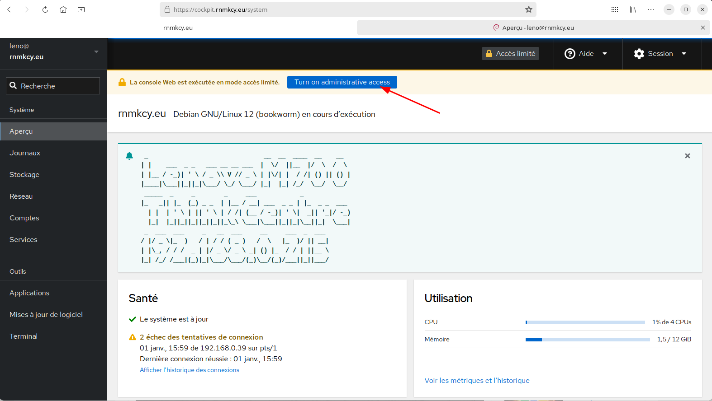
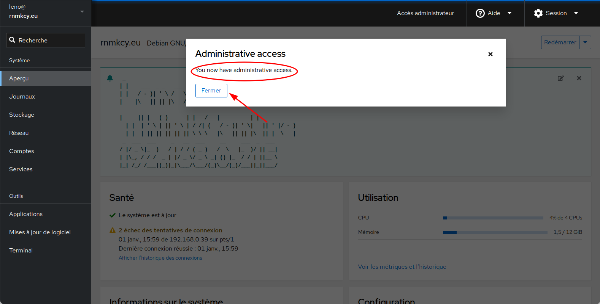
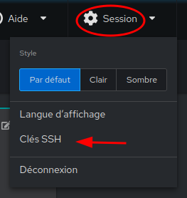
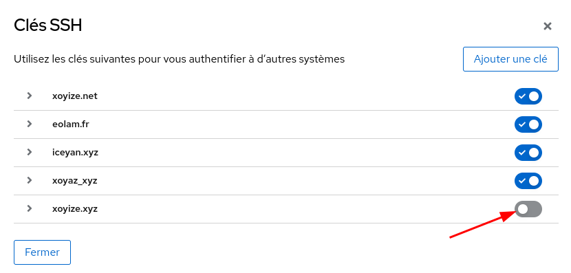
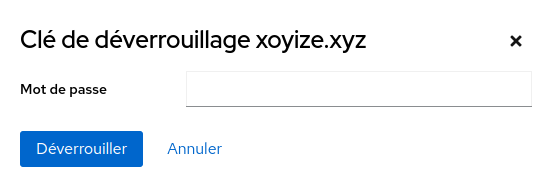
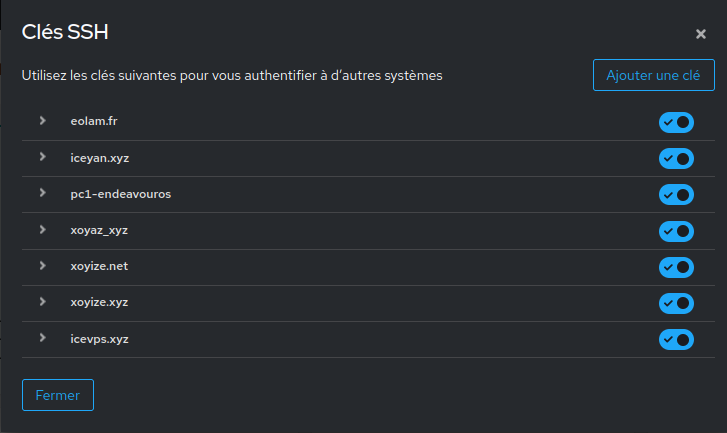
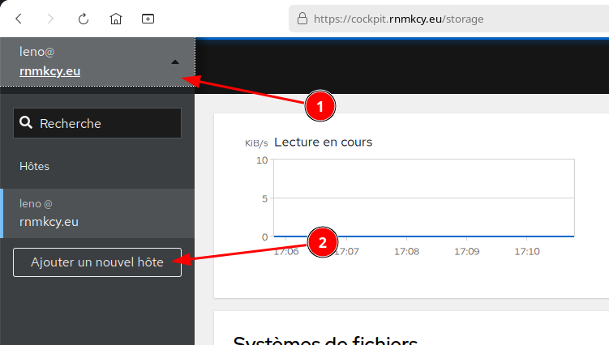
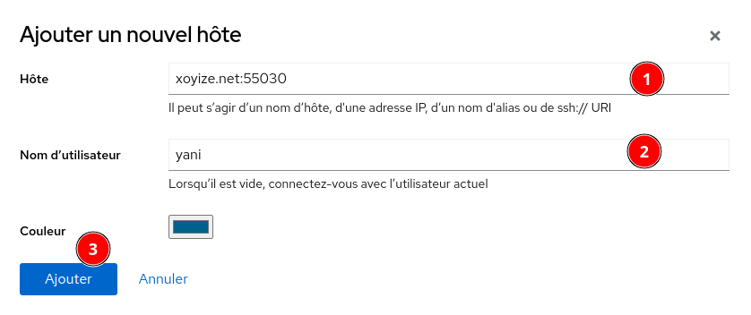
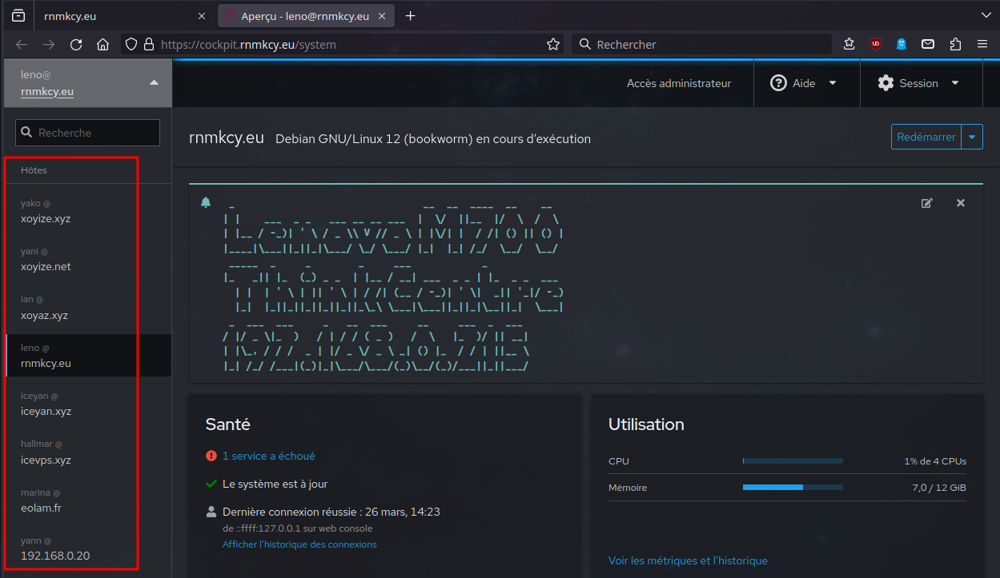

+++
title = 'Cockpit'
date = 2025-08-14
categories = ['debian']
+++
*Cockpit est une interface d'administration de serveur interactive. Il est facile à utiliser et très léger. Cockpit interagit directement avec le système d'exploitation depuis une vraie session Linux dans un navigateur.*

[{:width="200"}](https://cockpit-project.org/) 

* [Cockpit : une interface web pour gérer son serveur Linux](https://www.it-connect.fr/cockpit-une-interface-web-pour-gerer-son-serveur-linux/)
* [Cockpit : une WebUI système pour Linux](https://www.clevernetsystems.com/cockpit-webui-systeme-linux/)
* [Gestion des machines virtuelles KVM avec Cockpit Web Console sous Linux](https://fr.linux-console.net/?p=1270)
* [How to manage a remote host via Cockpit](https://www.techrepublic.com/article/how-to-manage-a-remote-host-via-cockpit/)
* [Managing remote systems in the web console](https://access.redhat.com/documentation/en-us/red_hat_enterprise_linux/8/html/managing_systems_using_the_rhel_8_web_console/managing-remote-systems-in-the-web-console_system-management-using-the-rhel-8-web-console)
* [How to Install Cockpit on Debian 12](https://docs.vultr.com/how-to-install-cockpit-on-debian-12)

## Cockpit interface web

Avec l'interface Web de Cockpit on réalise de nombreuses tâches et surveiller l'état d'un serveur.

*    Gérer les comptes utilisateurs
*    Visualiser l'état du matériel (configuration, charge actuelle, etc.)
*    Mettre à jour les paquets
*    Visualiser les journaux du système
*    Accéder à un Terminal en ligne
*    Gérer le pare-feu Linux
*    Créer et gérer des machines virtuelles (et containers)
*    Gérer les services (par exemple : redémarrer Apache)
*    Gérer plusieurs serveurs Linux avec un seul Cockpit
*    [...]

### Installation

**Machines Debian**

    sudo apt update && sudo apt install cockpit

Les paquets installés par défaut: `sudo dpkg -l |grep cockpit`

```
cockpit             Web Console for Linux servers
cockpit-bridg       Cockpit bridge server-side component
cockpit-networkmanager  pour la gestion Réseau
cockpit-packagekit  Cockpit user interface for packages
cockpit-storaged    pour configurer et surveiller le stockage, les disques et les supports sur le système.
cockpit-system      Cockpit admin interface for a system
cockpit-ws          Cockpit Web Service
```

vous devez installer le package `cockpit-machines` pour gérer les machines virtuelles

Pour les fonctionnalités supplémentaires, installer l'un des paquets suivants:

* **cockpit-machines** pour la gestion de machines virtuelles utilisant libvirt
* **cockpit-pcp** pour la lecture des paramètres de PCP et le chargement des archives de PCP
* **cockpit-podman** pour la gestion des conteneurs Podman 
* **firewalld** pare-feu pour gérer le Pare-feu en utilisant le Cockpit dans Networking
* **udisks2** pour gérer le stockage

Activer le service au démarrage

```shell
sudo systemctl enable --now cockpit.socket
```

**Machines Alpine Linux**

```shell
sudo apk update
sudo apk add cockpit 
sudo rc-service cockpit start
sudo rc-update add cockpit 
```

### hôte virtuel

Pour la sécurité Cockpit sera incapable de répondre aux demandes d'origines qu'il n'est pas familier en raison de limitations de domaine croisées. Dans notre exemple, Cockpit verra l'origine comme cockpit.domain.tld mais il va croire qu'il fonctionne sur 127.0.0.1 et donc ne peut pas répondre à la demande.

Pour informer le mandataire Cockpit, vous devrez modifier le fichier de configuration Cockpit `/etc/cockpit/cockpit.conf`. Ce fichier peut ne pas exister, le créer.

```
[WebService]
Origins = https://cockpit.domain.tld wss://cockpit.domain.tld
ProtocolHeader = X-Forwarded-Proto
```

Ces modifications permettront à Cockpit de savoir que les connexions seront fournies pour https (secure http) et wss (secure websockets) sur le sous-domaine cockpit.domain.tld, et qu'il devrait chercher l'en-tête `X-Forwarded-Proto` pour déterminer si la connexion est sécurisée ou non, ceci est important car Cockpit redirigera toute connexion non locale de https automatiquement et voit que cockpit.domain. tld est non local.

Une fois ces changements effectués, vous devrez redémarrer cockpit.

Pour créer un proxy, vous devrez d'abord créer un bloc de serveur virtuel afin que nginx sache ce qu'il faut faire lorsqu'il reçoit une requête pour votre sous-domaine. Si ce bloc n'existe pas, nginx servira simplement la page par défaut.

Ce bloc serveur vous permettra d'accéder à Cockpit via http://cockpit.domain.tld (remplacer par votre nom de domaine):

```
server {
    listen         80;
    listen         443 ssl;
    server_name    cockpit.domain.tld;

    location / {
        # Required to proxy the connection to Cockpit
        proxy_pass https://127.0.0.1:9090;
        proxy_set_header Host $host;
        proxy_set_header X-Forwarded-Proto $scheme;

        # Required for web sockets to function
        proxy_http_version 1.1;
        proxy_buffering off;
        proxy_set_header Upgrade $http_upgrade;
        proxy_set_header Connection "upgrade";

        # Pass ETag header from Cockpit to clients.
        # See: https://github.com/cockpit-project/cockpit/issues/5239
        gzip off;
    }
}
```

NOTE: Puisque Cockpit gère automatiquement la redirection http vers https, vous pouvez avoir un bloc serveur qui couvre les connexions http et https.

Une fois que vous avez ajouté le nouveau bloc hôte virtuel, vous devrez redémarrer nginx.

    sudo systemctl reload nginx

### Connexion

Connectez-vous avec votre nom d'utilisateur Debian qui doit être dans le groupe sudo

    sudo usermod -aG sudo $USER

Remarque : les membres du groupe "sudo" sont considérés comme étant administrateur du serveur. Cela va permettre de modifier la configuration du serveur via Cockpit. Pour les comptes "non sudo", l'accès à Cockpit sera possible, mais en lecture seule.

Maintenant, dans l'interface de connexion Cockpit, vous pouvez utiliser n'importe quel utilisateur que vous avez sur Debian pour vous connecter.

  


### Ajout clés SSH

Avant l'ajout des clés , il faut utiliser un dossier accessible par l'administrateur du serveur cockpit  

Pour éviter toute erreur, on utilise le dossier personnel de l'administrateur `$HOME/.ssh`  

On va générer des clés localement pour tous les serveurs distants à gérer par cockpit et copier la clé publique dans le presse papier

```shell
ssh-keygen -t ed25519 -o -a 100 -f $HOME/.ssh/nom_clé
cat $HOME/.ssh/nom_clé.pub # contenu clé publique à copier
```

Ajouter la clé publique au fichier `authorized_keys` du serveur distant 

Lorsque les clés ont été ajoutées et validées (en lançant une première connexion manuellement), on ouvre l'onglet **session** de cockpit web  
{:width="200"}  
La liste des clés présentes dans le dossier de l'administrateur s'affiche  
{:width="500"}  
{:width="200"}  
Pour valider la clé, saisir, s'il y a lieu, le mot de passe puis **Déverrouiller**

### Gérer plusieurs serveurs Linux

À partir d'un serveur où Cockpit est installé, on peut gérer plusieurs serveurs Linux !  
Il y a 2 prérequis : 

1. que le serveur à gérer soit accessible via SSH
2. Cockpit soit installé sur ce serveur. 

Ensuite, sur un serveur central, que l'on peut considérer comme un serveur d'administration équipé de Cockpit, on va venir ajouter les hôtes distants.** La communication entre les deux serveurs sera établie via SSH.**

Ajout et déverrouillage des clés pour la connexion (A FAIRE A CHAQUE SESSION)   
Session &rarr; Clés SSH  
{:width="500"}

Pour ajouter un nouvel hôte, il faut cliquer en haut à gauche de l'interface. Pour ma part, je dois cliquer sur "leno@ rnmkcy.eu". Ensuite, il faut cliquer sur le bouton "Ajouter un nouvel hôte" pour lancer l'assistant.  
{:width="500"}  

Il faut commencer par renseigner le nom d'hôte ou son adresse IP  + port si différent de 22, ainsi que le nom du compte à utiliser (bien sûr on évitera "root"). Cliquez sur "Ajouter".    
{:width="300"}

Vous pouvez ensuite aller sur la page d'analyse du serveur avec la possibilité de passer en mode administrateur  
  


Connexion depuis serveur Lenovo avec le PC EndeavourOS sur le même réseau  

* PC EndeavourOS, fichier `/etc/ssh/sshd_config`
    1. Choisir un autre port SSH : 55020
    2. Ne pas autoriser la connexion avec mot de passe : `PasswordAuthentication no`
    3. Ajout clé publique `pc1-endeavouros.pub` au fichier `~/.ssh/authorized_keys`
* Redémarrer le service : `sudo systemctl restart sshd`
* Règles parefeu
    * sudo firewall-cmd --permanent --zone=public --add-port=55020/tcp
    * sudo firewall-cmd --reload

* Serveur Lenovo
    * Connexion ssh : `ssh -p 55020 -i .ssh/pc1-endeavouros yann@192.168.0.20`

Liste des "hôtes" accessibles par cockpit (sous réserve que les clés SSH soient actives)  
{:width="700"}  

### Mise à jour depuis les backports debian

Une mise à jour peut être proposée  

    sudo apt update

```
[...]
Construction de l'arbre des dépendances... Fait
Lecture des informations d'état... Fait      
6 paquets peuvent être mis à jour. Exécutez « apt list --upgradable » pour les voir.
```

Détails

    sudo apt list --upgradable 

```
En train de lister... Fait
cockpit-bridge/stable-backports 329-1~bpo12+1 amd64 [pouvant être mis à jour depuis : 325-1~bpo12+1]
cockpit-networkmanager/stable-backports 329-1~bpo12+1 all [pouvant être mis à jour depuis : 325-1~bpo12+1]
cockpit-packagekit/stable-backports 329-1~bpo12+1 all [pouvant être mis à jour depuis : 325-1~bpo12+1]
cockpit-storaged/stable-backports 329-1~bpo12+1 all [pouvant être mis à jour depuis : 325-1~bpo12+1]
cockpit-system/stable-backports 329-1~bpo12+1 all [pouvant être mis à jour depuis : 325-1~bpo12+1]
cockpit/stable-backports 329-1~bpo12+1 all [pouvant être mis à jour depuis : 325-1~bpo12+1]
```

Les paquets sont dans stable-backports

    sudo apt install -t stable-backports cockpit cockpit-bridge cockpit-networkmanager cockpit-packagekit cockpit-storaged cockpit-system
