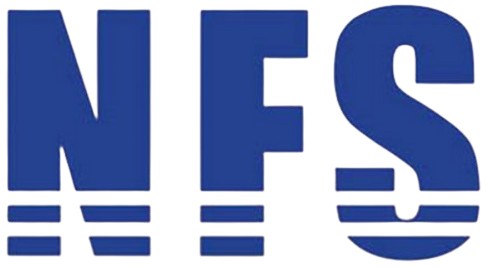
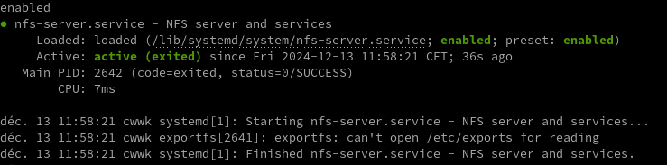
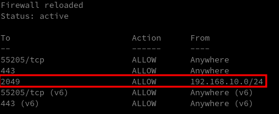

+++
title = 'NFSv4 (Network File System), partages réseau linux'
date = 2024-12-13 00:00:00 +0100
categories = ['nfs']
+++
*NFS ou Network File System est un protocole réseau qui permet de monter un système de fichiers distant sur le réseau. Le protocole NFS utilise une architecture client-serveur : le serveur NFS fournit tous les répertoires ou partitions accessibles, et les clients accèdent à tous les répertoires et systèmes de fichiers via la connexion réseau interne à l'aide du protocole rpcbind.*

{:width="120" .normal}

Traduction article **HowtoForge** [How to Install NFS Server and Client on Debian 12](https://www.howtoforge.com/tutorial/install-nfs-server-and-client-on-debian/)

L'état actuel du protocole Network File System est décrit ci-dessous.

*    NFSv2 et NFSv3 sont toujours pris en charge par les principaux systèmes d'exploitation, mais pour des raisons de sécurité, vous devez restreindre l'accès au serveur NFS au réseau local approuvé. NFSv2 et NFSv3 sont recommandés pour les déploiements de petite et moyenne taille.
*    Le <u>protocole NFSv4</u> fournit des fonctionnalités de sécurité de base telles que l'authentification et le chiffrement, mais s'appuie sur Kerberos pour ces parties. Vous devez donc effectuer des <u>configurations supplémentaires pour utiliser NFSv4 avec des fonctionnalités de sécurité de base</u>.

Dans ce guide, je vais vous montrer comment installer un serveur et un client NFS sur **Debian 12**. J'installerai le serveur NFS et configurerai **NFSv4**, y compris la configuration d'exportfs via le pseudo système de fichiers. Enfin, vous configurerez le client Debian pour monter le serveur NFS uniquement via NFSv4 et configurerez le montage automatique via le fichier `/etc/fstab`.

## Prérequis

Pour compléter ce guide, assurez-vous de disposer des éléments suivants :

* Un serveur Debian 12 - Dans ce cas, le serveur **bookworm** avec l'adresse IP 192.168.0.205 sera utilisé comme serveur NFS, et **client1** avec l'adresse IP 192.168.0.20 sera utilisé comme client NFS.
* Un utilisateur non root avec des privilèges sudo/administrateur.

## Installation du serveur NFS

*NFS ou Network File System est un protocole de partage de fichiers distribué. Sous Linux, y compris Debian, le package NFS est disponible par défaut sur le dépôt officiel. Effectuez la première étape ci-dessous pour installer le package du serveur NFS et apprendre à gérer le service du serveur NFS.*

Avant de passer à l'installation, exécutez la commande apt ci-dessous pour mettre à jour le référentiel Debian et obtenir les dernières informations sur le paquet.

    sudo apt update

Installez maintenant le package du serveur NFS nfs-kernel-server à l'aide de la commande apt ci-dessous. Saisissez y pour confirmer l'installation et appuyez sur ENTRÉE.

    sudo apt install nfs-kernel-server nfs-common

Une fois le paquet **nfs-kernel-server** installé, le service **nfs-server** est créé, exécuté et activé par défaut sur votre machine Debian. Exécutez les commandes systemctl suivantes pour vérifier le service nfs-server et vous assurer qu'il est activé et en cours d'exécution.

```bash
sudo systemctl is-enabled nfs-server
sudo systemctl status nfs-server
```



Vous devez activer la sortie , ce qui signifie que le serveur NFS sera exécuté automatiquement au démarrage du système. Vous devriez voir le message active (exited) ou active (running) lors de l'exécution.

Eventuellment, vous pouvez utiliser les commandes suivantes pour démarrer, redémarrer et arrêter le service nf-server.

```bash
sudo systemctl start nfs-server 
sudo systemctl restart nfs-server 
sudo systemctl stop nfs-server
```

### Configuration NFSv4

Actuellement, la dernière version du protocole NFS est la v4, qui a été améliorée en termes de sécurité et de performances. Dans la section suivante, vous apprendrez à configurer et à activer NFSv4 sur votre serveur NFS.

Ouvrez la configuration NFS par défaut [/etc/default/nfs-common](URL) à l’aide de la commande de l’éditeur nano.

    sudo nano /etc/default/nfs-common

Modifiez le paramètre **NEED_STATD** sur **no** et **NEED_IDMAPD** sur **yes**  
Le **NFSv4** requiert **NEED_IDMAPD** qui sera utilisé comme démon de mappage d'ID et fournit des fonctionnalités entre le serveur et le client.

```bash
NEED_STATD="no"
NEED_IDMAPD="yes"
```

Enregistrez le fichier et quittez l'éditeur lorsque vous avez terminé.

Ouvrez maintenant la configuration du serveur NFS `/etc/default/nfs-kernel-server` à l’aide de la commande de l’éditeur nano ci-dessous.

    sudo nano /etc/default/nfs-kernel-server

Ajoutez la configuration suivante pour désactiver NFSv2 et NFSv3 lors de l'exécution du service nfs-server et désactiver les demandes de montage des clients pour NFSv2 et NFSv3 .

```bash
RPCNFSDOPTS="-N 2 -N 3"
RPCMOUNTDOPTS="--manage-gids -N 2 -N 3"
```

Enregistrez et quittez le fichier lorsque vous avez terminé.

Enfin, exécutez la commande suivante pour redémarrer le service nfs-server et appliquer les modifications. Ainsi, votre serveur NFS n'acceptera que le protocole NFSv4.

    sudo systemctl restart nfs-server

### Configuration du pare-feu UFW

L'activation de firewalld sur votre serveur NFS est indispensable, vous pouvez limiter les réseaux internes qui peuvent accéder au serveur NFS. Effectuez cette étape pour configurer UFW (Uncomplicated Firewall) et sécuriser votre serveur NFS.

Si UFW n'est pas installé, exécutez la commande apt ci-dessous pour l'installer.

    sudo apt install ufw -y

Une fois UFW installé, exécutez la commande ufw ci-dessous pour autoriser le service SSH et activer UFW. Saisissez y et appuyez sur ENTER pour confirmer et activer UFW.

```bash
sudo ufw allow ssh
sudo ufw enable
```

Vous devriez obtenir une sortie **"Firewall is active and enabled on system startup"** lorsque l'UFW est en cours d'exécution et activé.

Ensuite, exécutez la commande ufw suivante pour permettre à votre sous-réseau de réseau local d'accéder au serveur NFS. La commande suivante permettra à 192.168.0.0/24 d'accéder au serveur NFS.

    sudo ufw allow from 192.168.0.0/24 to any port nfs

Enfin, exécutez la commande ufw suivante pour recharger et vérifier l’état UFW.

```bash
sudo ufw reload
sudo ufw status
```

  
Vous devriez voir le port NFS **2049** ajouté à **UFW**, seul le sous-réseau réseau **192.168.0.0/24** peut  accéder au port.

### Configuration du pseudo-système de fichiers et des exportations

Un pseudo-système de fichiers est un faux système de fichiers qui vous permet de configurer un répertoire partagé NFS comme un système de fichiers unique. Ainsi, au lieu d'utiliser plusieurs répertoires partagés, vous pouvez utiliser un seul pseudo-système de fichiers pour tous vos répertoires partagés.

Dans la section suivante, vous allez configurer un pseudo-système de fichiers sur le serveur NFS et l'utiliser comme système de fichiers partagé unique pour les clients NFS.

Exécutez la commande suivante pour créer de nouveaux répertoires /sharenfs , /sharenfs/data et /sharenfs/documents. Ensuite, modifiez la propriété sur **nobody** et **nogroup** via **chown**.

```bash
mkdir -p /sharenfs/{data,documents} 
sudo chown -R nobody:nogroup /sharenfs
```

Créez maintenant d'autres répertoires /exports , /exports/home , /exports/data et /exports/documents à l'aide de la commande ci-dessous. Et assurez-vous de modifier la propriété sur nobody et nogroup .

```bash
mkdir -p /exports/{data,home,documents}
sudo chown -R nobody:nogroup /exports
```

Ensuite, montez le répertoire /home en tant que pseudo-système de fichiers sur le répertoire /exports/home , le répertoire partagé /sharenfs/dat sur /exports/data et le répertoire partagé /sharenfs/documents sur /exports/documents .

```bash
sudo mount --bind /home /exports/home
sudo mount --bind /shared/data /exports/data
sudo mount --bind /shared/documents /exports/documents
```

Vérifiez la liste des systèmes de fichiers montés à l'aide de la commande df ci-dessous. Le paramètre -a est utilisé pour afficher tous les systèmes de fichiers disponibles, y compris le pseudo-système de fichiers.

    sudo df -ah

Vous devriez voir trois pseudo-systèmes de fichiers disponibles et montés.

Vous pouvez également configurer un pseudo-système de fichiers de manière permanente via le fichier `/etc/fstab`  Ouvrez le fichier /etc/fstab à l'aide de l'éditeur nano.

    sudo nano /etc/fstab

Ajoutez la configuration suivante au fichier :

```bash
/home /exports/home    none bind
/sharenfs/data /exports/data     none bind
/sharenfs/documents /exports/documents    none bind
```

Enregistrez et fermez le fichier une fois terminé.

Vous pouvez ajouter le répertoire exporté `/exports` au serveur NFS en tant que pseudo-système de fichiers.

Ouvrez le fichier `/etc/exports` à l’aide de la commande d’éditeur nano suivante.

    sudo nano /etc/exports

Ajoutez la ligne suivante au fichier.

```bash
/exports    192.168.0.0/255.255.255.0(rw,pas_root_squash,pas_subtree_check,crossmnt,fsid=0)
```

Enregistrez et fermez le fichier lorsque vous avez terminé.

Vous trouverez ci-dessous quelques options NFS utilisées pour ce cas :

*    **rw** : autorise l'accès en lecture et en écriture pour le serveur et le client NFS au volume/répertoire.
*    **no_subtree_check** : désactive la vérification des sous-arbres, ce qui a de légères implications en matière de sécurité, mais peut améliorer la fiabilité dans certaines circonstances.
*    **no_root_sqash** : désactive le squashing de la racine. Cette option est principalement utile pour les clients sans disque.
*    **fsid=0** : pour NFSv4, ce paramètre est utilisé pour informer le serveur NFS que cette exportation est la racine de tous les systèmes de fichiers exportés.

Ensuite, exécutez la commande suivante pour redémarrer le service nfs-server et appliquer les modifications. Puis, vérifiez le serveur nfs pour vous assurer que le service est en cours d'exécution.

```bash
sudo systemctl restart nfs-server 
sudo systemctl status nfs-server
```

Enfin, exécutez la commande suivante pour vérifier le répertoire et le système de fichiers exportés sur le serveur NFS à l’aide de la commande suivante.

```bash
sudo showmount -e 192.168.0.205 
sudo showmount -e
```

Si tout se passe bien, vous devriez voir que le répertoire `/exports` est exporté sur le serveur NFS.

## Configuration du client NFS

À ce stade, vous avez configuré le serveur NFS avec un pseudo-système de fichiers et sécurisé le serveur NFS via UFW. Vous allez maintenant configurer la machine cliente et monter le système de fichiers partagé du serveur NFS.

Connectez-vous à la machine cliente et installez le paquet nfs 

```bash
sudo apt install nfs-common # debian
sudo pacman -S nfs-utils    # archlinux
```

Une fois le package installé, exécutez la commande suivante pour créer les répertoires de montage cibles /users , /data et /documents .

    mkdir -p /users /data /documents

Ensuite, exécutez les commandes mount.nfs4 ci-dessous pour monter le pseudo-système de fichiers exporté dans le répertoire cible. Dans ce cas, le pseudo-système de fichiers /home est monté dans le répertoire /users , le /data dans le répertoire /data et le /documents dans le répertoire /documents .

```bash
sudo mount.nfs4 192.168.0.205:/home /users 
sudo mount.nfs4 192.168.0.205:/data /data 
sudo mount.nfs4 192.168.0.205:/documents /documents
```

Vérifiez la liste des systèmes de fichiers montés à l’aide de la commande df ci-dessous.

    sudo df -h

En cas de succès, vous devriez voir que chaque pseudo-système de fichiers du serveur NFS est monté sur chaque répertoire cible 

vérification du munt nfsv4

De plus, vous pouvez également monter la racine d'un pseudo-système de fichiers de la manière suivante. Si vous vérifiez le répertoire cible /nfs, vous devriez voir trois répertoires différents /home, /data et /documents .

```bash
mkdir -p /nfs 
sudo mount.nfs4 192.168.0.205:/ /nfs -o soft,intr,rsize=8192,wsize=8192
```

monter le pseudo-système de fichiers du système de fichiers racine
Monter le serveur NFS via /etc/fstab

En haut, vous avez monté le serveur NFS via la commande mount.nfs4. La section suivante vous montrera comment monter le serveur NFS de manière permanente via le fichier /etc/fstab .

Tout d’abord, supprimez le serveur NFS via la commande umount ci-dessous.

    sudo umount /users /data /documents

Ouvrez maintenant le fichier `/etc/fstab` en utilisant la commande d’éditeur nano suivante.

    sudo nano /etc/fstab

Ajoutez les lignes suivantes au fichier.

```bash
192.168.0.205:/home/users nfs4 soft,intr,rsize=8192,wsize=8192 
192.168.0.205:/data/data nfs4 soft,intr,rsize=8192,wsize= 8192 
192.168.0.205:/documents/documents nfs4 soft,intr,rsize=8192,wsize=8192
```

Enregistrez le fichier et quittez l'éditeur une fois terminé.

Ensuite, exécutez la commande systemctl ci-dessous pour redémarrer le gestionnaire systemd. Ensuite, exécutez la commande mount pour monter tous les systèmes de fichiers disponibles dans le fichier /etc/fstab .

```bash
sudo systemctl daemon-reload 
sudo mount -a
```

Vérifiez ensuite la liste des systèmes de fichiers montés à l'aide de la commande df suivante. En cas de succès, vous devriez voir que le serveur NFS est monté sur chaque répertoire cible.

    sudo df -h

monter via /etc/fstab

Vous pouvez également essayer de redémarrer la machine cliente pour voir l'effet. Si tout se passe bien, le serveur NFS devrait être monté automatiquement via le fichier /etc/fstab.

    sudo reboot

## NFS systemd

### Comme unité systemd

Remarque : Assurez-vous que le nom du fichier correspond au point de montage que vous souhaitez utiliser. Par exemple, le nom de l'unité mnt-sharenfs. montage ne peut être utilisé que si vous allez monter le partage sous /mnt/sharenfs. Sinon, l'erreur suivante pourrait se produire : systemd[1] : mnt-sharenfs.mount : Où= le réglage ne correspond pas au nom de l'unité. Refus.. Si le point de montage contient des caractères non ASCII, utilisez systemd-escape).

    What= chemin à partager

    Where= chemin pour monter le partage

    Options= partage des options de montage

Remarque:

* Les unités de montage réseau acquièrent automatiquement `After` dépendances sur `remote-fs-pre.target`, `network.target` et `network-online.target`, et gagnez une `Before` dépendance sur `remote-fs.target` à moins que l'option de montage `nofail` soit définie. Vers cette dernière, une unité `Wants` est également ajoutée.
* Ajouter `noauto` aux `Options` empêchant le montage automatique pendant le démarrage (à moins qu'il ne soit tiré par une autre unité).
* Si vous voulez utiliser un nom d'hôte pour le serveur que vous voulez partager (au lieu d'une adresse IP), ajoutez `nss-lookup.target` à `After`. Cela pourrait éviter les erreurs de montage au moment du démarrage qui ne surviennent pas lors du test de l'unité.

#### mount

/etc/systemd/system/mnt-sharenfs.mount

```
[Unit]
Description=Mount sharenfs au boot

[Mount]
What=10.19.55.4:/sharenfs
Where=/mnt/sharenfs
Options=vers=4
Type=nfs
TimeoutSec=30

[Install]
WantedBy=multi-user.target
```

Astuce : Dans le cas d'un système inaccessible, ajouter `ForceUnmount=true` à `[Mount]`, permettant à l'exportation d'être (forcé-)non montée.

Pour utiliser `mnt-sharenfs.mount` au démarrage du système, démarrez et activez le

#### automount

Pour monter automatiquement une action, on peut utiliser l'unité de montage automatique suivante :

/etc/systemd/system/mnt-sharenfs.automount

```
[Unit]
Description=Automount sharenfs

[Automount]
Where=/mnt/sharenfs

[Install]
WantedBy=multi-user.target
```

Désactiver/arrêter l'unité `mnt-sharenfs.mount` et activer/démarrer `mnt-sharenfs.automount` pour monter automatiquement le partage lorsque le chemin de montage est accessible.

```shell
sudo systemctl enable mnt-sharenfs.automount --now
```

Astuce : Ajouter le délai `TimeoutIdleSec=` pour permettre le démontage automatique.  
*Configure un temps mort. Une fois que le montage a été ralenti pendant le temps spécifié, systemd tentera de démonter. Prend une valeur sans unité en secondes, ou une valeur d'intervalle de temps comme "5min 20s". Passez 0 pour désactiver la logique timeout. Le timeout est désactivé par défaut.*

### Problème montage au boot

* [Beginners guide to mount NFS share in Linux with examples](https://www.golinuxcloud.com/linux-mount-nfs/)
* [How to start systemd service after NFS mount in Linux](https://www.golinuxcloud.com/start-systemd-service-after-nfs-mount/)

Les modifications du fichier `/etc/systemd/system/mnt-sharenfs.mount`

```
[Unit]
Description=NFS Mount sharenfs au boot
DefaultDependencies=no
Conflicts=umount.target
After=network-online.target nebula.service
Before=umount.target

[Mount]
What=10.19.55.4:/sharenfs
Where=/mnt/sharenfs
Type=nfs
Options=defaults

[Install]
WantedBy=multi-user.target
```

Comprenez la section `[Unit]` :

* les unités cibles compléteront toutes les dépendances configurées de type `Wants=` ou `Requires=` avec les dépendances de type `After=` sauf si `DefaultDependences=no` est défini dans les unités spécifiées.
* Nous mettons `umount.target` avec `Conflicts=` pour s'assurer que l'unité en conflit est arrêtée avant le début de l'autre unité
* Comme NFS dépend du réseau, nous mettons `network-online.target` et `remote-fs.target` sous `After=`   
* Le service `netfs`(`remote-fs.target`) est chargé de monter les systèmes de fichiers réseau listés dans `/etc/fstab` (NFS, SMBFS/CIFS, NCP, ou toute ligne avec l'option `_netdev`).
* Il ne montera ces types de systèmes de fichiers que lorsque le système démarrera le réseau. Si ce service n'est pas démarré au démarrage, les systèmes de fichiers réseau ne seront pas montés.
* Aussi, nous aimerions appeler notre service avant `umount.target`

Si vous êtes toujours intéressé à apprendre sur les fichiers d'unité de montage, alors j'ai écrit un autre [article détaillé sur ce sujet avec différents exemples](https://www.golinuxcloud.com/mount-filesystem-in-certain-order-systemd/).
