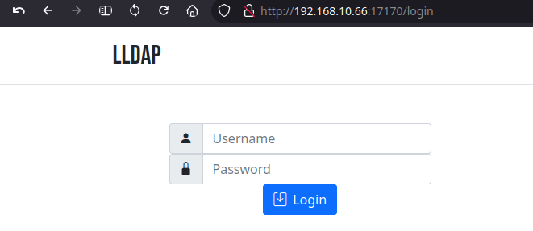

+++
title = 'cwwk KVM - Serveur LLDAP (Alpine Linux vm-lldap)'
date = 2024-12-16 00:00:00 +0100
categories = ['virtuel']
+++
*Alpine Linux est une distribution Linux ultra-légère pour héberger un serveur [LLDAP](https://github.com/lldap/lldap)*

{:width="300"}    

## Alpine Linux

*Création machine virtuelle Alpine  de type KVM avec 2 Go de RAM, 1 cœur de processeur et 5 Go de disque dur.*

### Créer vm-lldap sur un serveur

[Les dernières images Alpine Linux](https://alpinelinux.org/downloads/)  

Création d'une image virtuelle **vm-lldap** sous le serveur cwwk 
On se connecte sur le serveur cwwk en SSH 

    ssh yick@192.168.0.205 -p 55205 -i /home/yann/.ssh/yick-ed25519

puis on exécute la commande suivante pour créer  une machine virtuelle Alpine avec 2 Go de RAM, 1 cœur de processeur et 5 Go de disque dur

```shell
sudo virt-install \
--osinfo alpinelinux3.17 \
--name vm-lldap \
--memory 1024 \
--vcpus 1 \
--cpu host \
--hvm \
--disk path=/srv/kvm/libvirt/images/vm-lldap.qcow2,format=qcow2,size=5 \
--cdrom /mnt/FreeUSB2To/iso/alpine-standard-3.21.0-x86_64.iso \
--network bridge=virbr0 \
--graphics vnc  
```

Note: La dernière version Alpine Linux est alpinelinux3.20  au 10/07/2024 mais KVM ne connait que alpinelinux3.17 (`sudo virt-install --osinfo list |grep alpine`)

Après exécution dans un terminal de la commande ci dessus, on arrive sur l'écran suivant  
  

### Configurer vm-lldap

Le serveur cwwk n'a pas d'affichage, il faut créer un tunnel ssh depuis un poste client

    ssh -L 9500:127.0.0.1:5900 yick@192.168.0.205 -p 55205 -i /home/yann/.ssh/yick-ed25519

Puis lancer de ce même poste un client VNC  
{:width="300"}  
la console s'affiche   
  

Une fois l'image ISO lancée, on arrive à un invite de connexion.   
Indiquez `root` comme nom d'utilisateur, aucun mot de passe ne vous sera demandé à cette étape.   

Le système est utilisable, mais on veut l'installer, ce qui passe par la commande suivante (clavier qwerty)

```
setup-alpine # saisir setup)qlpine
```

Une suite de questions :  
  
mot de passe root (rtyuiop)  
  
APK mirror (f) ,patienter ...  
  
Utilisateur/mp **aluser/aluser49**  

Relever l'adresse ip allouée : `ip a` --> 192.168.10.138  
Puis redémarrer : `reboot`  
La fenêtre vnc se ferme  

Vous devez utiliser l'utilisateur pour vous connecter via SSH (impossible avec le compte root)  
Sur un terminal linux du serveur cwwk

    ssh aluser@192.168.10.138

Une fois connecté ,vous pouvez accéder au "root" de manière classique avec la commande :

    su -

Mise à jour

```shell
apk update
apk upgrade 
# Vous pouvez fusionner les deux lignes avec 
apk -U upgrade
```

Editeur nano (Vous pouvez aussi opter pour vi qui est nativement présent sur le système)

    apk add nano

Supprimer le VNC dans vm-lldap avec le gestionnaire de machine virtuelle  

```xml
<graphics type="vnc" port="-1" autoport="yes">
  <listen type="address"/>
</graphics>
```

### Réseau - IP statique

[How to configure static IP address on Alpine Linux](https://www.cyberciti.biz/faq/how-to-configure-static-ip-address-on-alpine-linux/)

Le fichier de configuration `/etc/network/interfaces`

    /etc/network/interfaces

```shell
auto lo
iface lo inet loopback

auto eth0
iface eth0 inet static
        address 192.168.10.66/24
        gateway 192.168.10.1
```

Fichier de résolution dns

    /etc/resolv.conf

```
nameserver 1.1.1.1
nameserver 9.9.9.9
```

Les modifications apportées à /etc/network/interfaces peuvent être activées en exécutant

```shell
service networking restart 
```

### OpenSSH avec clés

*Connexion ssh sur un autre port avec un jeu de clés*

Générer une paire de clé sur l'ordinateur de bureau PC1  
Générer une paire de clé curve25519-sha256 (ECDH avec Curve25519 et SHA2) pour une liaison SSH avec le serveur.

    ssh-keygen -t ed25519 -o -a 100 -f ~/.ssh/vm-lldap

Copier la clé publique `cat ~/.ssh/vm-lldap.pub` dans le presse-papier

	ssh-ed25519 AAAAC3NzaC1lZDI1NTE5AAAAIBQu0LRiDjPM7BJAfjECl22fnEchVuxnw38RV2IJs0+l yann@yann-pc1

On modifie les droits de la clé privée

    chmod 600 ~/.ssh/vm-lldap

On se connecte sur la machine virtuelle alpine linux "ttrss alpine-searx"

    ssh aluser@192.168.10.66

Créer le répertoire et ouvrir nouveau fichier

    mkdir -p $HOME/.ssh/
    nano $HOME/.ssh/authorized_keys

Coller le contenu du presse-papier , sauver le fichier et sortir

Modifier les droits

    chmod 600 $HOME/.ssh/authorized_keys

Passer en mode su

    su -

Modifier la configuration serveur SSH

    nano /etc/ssh/sshd_config

Modifier

```
Port = 55066
PasswordAuthentication no
```

Relancer le serveur

    service sshd restart

Test connexion

    ssh -p 55066 -i ~/.ssh/vm-lldap aluser@192.168.10.66

### sudo

Passer en root

    su -

Editer la configuration des dépôts

    nano /etc/apk/repositories

Trouvez maintenant la ligne qui se termine dans /community Ensuite, retirez le # au début de la ligne. Le fichier résultant devrait ressembler à ceci

```
#/media/cdrom/apks
http://dl-cdn.alpinelinux.org/alpine/v3.21/main
http://dl-cdn.alpinelinux.org/alpine/v3.21/community
```

Mise à jour des dépôts

    apk update

Installer sudo

    apk add sudo

Pas de mot de passe sudo pour l'utilisateur aluser

    echo "aluser     ALL=(ALL) NOPASSWD: ALL" >> /etc/sudoers

### motd

Modifier /etc/motd

```
    _    _        _              _     _                 
   /_\  | | _ __ (_) _ _   ___  | |   (_) _ _  _  _ __ __
  / _ \ | || '_ \| || ' \ / -_) | |__ | || ' \| || |\ \ /
 /_/ \_\|_|| .__/|_||_||_|\___| |____||_||_||_|\_,_|/_\_\
           |_|    _  _     _                             
 __ __ _ __  ___ | || | __| | __ _  _ __                 
 \ V /| '  \|___|| || |/ _` |/ _` || '_ \                
  \_/ |_|_|_|    |_||_|\__,_|\__,_|| .__/                
  _  ___  ___     _   __  ___     _|_|__      __   __    
 / |/ _ \|_  )   / | / / ( _ )   / | /  \    / /  / /    
 | |\_, / / /  _ | |/ _ \/ _ \ _ | || () |_ / _ \/ _ \   
 |_| /_/ /___|(_)|_|\___/\___/(_)|_| \__/(_)\___/\___/   
```

## Configuration d'un serveur LLDAP


### Général

LLDAP est un petit serveur LDAP conçu pour les services d'annuaires sans la surcharge d'un serveur OpenLDAP complet. Le serveur LLDAP est conçu pour une gestion facile à l'aide d'une interface graphique Web simple. Il manque certaines des fonctionnalités trouvées dans d'autres serveurs d'annuaires, car il est spécifiquement conçu pour une utilisation facile.

### Prérequis

LLDAP utilise une base Sqlite

```bash
sudo apk -U upgrade
sudo apk add --no-cache sqlite
```

### Installer

L'installation de LLDAP est assez simple et peut être effectuée en moins de 5 minutes. Commencez par vous connecter en tant que root :

    sudo -s

Ensuite, nous nous assurons que le système est à jour et installons wget  

    apk update && apk upgrade && apk add wget

Ensuite, nous créons le répertoire dans lequel LLDAP va être installé

```bash
mkdir -p /opt/lldap
cd /opt/lldap
# Lien https://github.com/lldap/lldap/releases pour la dernière version lldap
wget https://github.com/lldap/lldap/releases/download/v0.6.1/amd64-lldap.tar.gz
tar xzf amd64-lldap.tar.gz
mv amd64-lldap/* .
rm -rf amd64-lldap*
apk add openldap-clients # les commandes ldapadd, ldapsearch
```

### Configuration

Pour configurer LLDAP, nous devons créer un fichier de configuration et un fichier rc pour un démarrage automatique. Nous générons d'abord 2 chaînes aléatoires à utiliser dans la configuration comme **jwt_secret** et **key_seed** :

    openssl rand -base64 15 && openssl rand -base64 15

Ensuite, nous collons la configuration suivante dans `/opt/lldap/lldap_config.toml` et remplaçons **jwt_secret** et **key_seed** par les valeurs générées aléatoirement :

```
ldap_port = 3890
http_port = 17170
http_url = "https://domain.tld"
jwt_secret = "very-long-string"
ldap_base_dn = "dc=domain,dc=tld"
ldap_user_dn = "admin"
ldap_user_email = "admin@domain.tld"
ldap_user_pass = "very-strong-password"
database_url = "sqlite:///opt/lldap/users.db?mode=rwc"
key_seed = "random-string-again"

[smtp_options]
#enable_password_reset=true
#server="smtp.gmail.com"
#port=587
#smtp_encryption = "TLS"
#user="sender@gmail.com"
#password="password"
#from="LLDAP Admin <sender@gmail.com>"
#reply_to="Do not reply <noreply@localhost>"

[ldaps_options]
#enabled=true
#port=6360
## Certificate file.
#cert_file="/data/cert.pem"
## Certificate key file.
#key_file="/data/key.pem"
```

Remplacez **domain.tld** par le nom de domaine que vous avez choisi. Ensuite, nous devons créer un fichier **openrc** pour pouvoir démarrer automatiquement lldap :

```bash
cat <<EOF > /etc/init.d/lldap
#!/sbin/openrc-run

name=lldap
command="/opt/lldap/lldap"
command_args="run"
command_background="yes"
pidfile="/run/lldap.pid"

depend() {
        need net
}

start_pre()
{
        cd /opt/lldap
}
EOF
```

Ce n'est pas un fichier très volumineux, mais il vous permet de démarrer et de garantir que lldap démarre et fonctionne correctement. Nous devons maintenant l'ajouter au niveau d'exécution par défaut et démarrer le service

    chmod +x /etc/init.d/lldap && rc-update add lldap

### Utilisation

Pour utiliser LLDAP, nous pouvons accéder à <http://192.168.10.66:17170> et nous connecter avec les informations d'identification que nous avons spécifiées dans le fichier de configuration.   


Il s'agit d'une configuration de base. Vous pouvez désormais connecter d'autres services prenant en charge les connexions LDAP à LLDAP.([Setting up a LLDAP server (Article original)](https://wiki.alpinelinux.org/wiki/Setting_up_a_LLDAP_server))

Depuis un un autre poste linux sur le réseau 192.168.10.0/24  
Accès aux informations de l’annuaire en ligne de commande

 
