+++
title = 'Calibre-Web naviguer, lire et télécharger des livres électroniques'
date = 2024-12-16 00:00:00 +0100
categories = calibre
+++
## Calibre-Web

* [How To Create a calibre Ebook Server on Ubuntu 20.04](https://www.digitalocean.com/community/tutorials/how-to-create-a-calibre-ebook-server-on-ubuntu-20-04)
*[Calibre Web](https://libraries.io/github/janeczku/calibre-web) est une application Web offrant une interface propre pour naviguer, lire et télécharger des livres électroniques en utilisant une base de données[Calibre](https://calibre-ebook.com) existante.*

* Ce logiciel est un "fork" de [library](https://github.com/mutschler/calibreserver)  sous licence GPL v3.

{:width="400"}

### Caractéristiques

* Interface HTML5 Bootstrap 3
* configuration graphique complète
* Gestion des utilisateurs avec des permissions par utilisateur à grain fin
* Interface administrateur
* Interface utilisateur en brésilien, tchèque, néerlandais, anglais, finnois, français, allemand, grec, hongrois, italien, japonais, khmer, polonais, russe, chinois simplifié, espagnol, suédois, turc, ukrainien.
* Flux OPDS pour les applications de lecture de livres électroniques
* Filtrez et recherchez par titres, auteurs, tags, séries et langues.
* Créer une collection de livres personnalisée (étagères)
* Prise en charge de l'édition des métadonnées des livres électroniques et de la suppression des livres électroniques de la bibliothèque Calibre.
* Prise en charge de la conversion des eBooks par les binaires Calibre
* Restriction du téléchargement des livres électroniques aux utilisateurs connectés
* Support pour l'enregistrement public des utilisateurs
* Envoi d'eBooks vers des appareils Kindle d'un simple clic de souris
* Synchronisation de vos appareils Kobo avec votre bibliothèque Calibre via Calibre-Web
* Prise en charge de la lecture des eBooks directement dans le navigateur (.txt, .epub, .pdf, .cbr, .cbt, .cbz, .djvu)
* Téléchargement de nouveaux livres dans de nombreux formats, y compris les formats audio (.mp3, .m4a, .m4b)
* Prise en charge des colonnes personnalisées de Calibre
* Possibilité de masquer le contenu en fonction des catégories et du contenu des colonnes personnalisées par utilisateur.
* Possibilité de mise à jour automatique
* Connexion "Magic Link" pour faciliter la connexion aux eReaders
* Connexion via LDAP, google/github oauth et via l'authentification proxy.

## Debian server

### Prérequis

Vérifier si debian est à jour

    sudo apt update
    sudo apt upgrade

Les outils

    sudo apt install git sqlite3 imagemagick python3-setuptools python3-pip


### Installation via pip

<u>Installation application **calibre-web** dans le répertoire **$HOME**</u>

```bash
cd $HOME
# Clonez calibre-web
git clone https://github.com/janeczku/calibre-web.git 
# déplacer vers **/opt**
sudo mv calibre-web /opt/
# les droits
sudo chown $USER. -R /opt/calibre-web/
# Allez dans le dossier
cd /opt/calibre-web 
# Mise à jour dernière version pip
/usr/bin/python3 -m pip install --upgrade pip
# installation des prérequis
/usr/bin/python3 -m pip install --target vendor -r requirements.txt
cd ~
```

### Service systemd calibre-web

Utilisation fichier systemd pour le lancement automatique  

	sudo nano /etc/systemd/system/calibre-web.service

Contenu du fichier

```
[Unit]
Description=Service calibre-web
After=network.target

[Service]
Type=simple
User=utilisateur
ExecStart=/usr/bin/python3 /opt/calibre-web/cps.py

[Install]
WantedBy=multi-user.target
```

>**ATTENTION!** , **User** est l'utilisateur connecté ($USER)

Lancer le service calibre-web :

	sudo systemctl start calibre-web

Vérifier:

	sudo systemctl status calibre-web

```
● calibre-web.service - Service calibre-web
   Loaded: loaded (/etc/systemd/system/calibre-web.service; disabled; vendor preset: enabled)
   Active: active (running) since Thu 2022-03-31 15:28:26 CEST; 11s ago
 Main PID: 23838 (python3)
    Tasks: 3 (limit: 4718)
   Memory: 72.7M
   CGroup: /system.slice/calibre-web.service
           └─23838 /usr/bin/python3 /opt/calibre-web/cps.py

Mar 31 15:28:26 server32771 systemd[1]: Started Service calibre-web.
```

Activation  

	sudo systemctl enable calibre-web

### proxy nginx

configuration nginx pour un serveur local à l'écoute sur le port 8083, mappage de Calibre-Web à /calibre :

```
http {
    server {
            client_max_body_size 20M;
            location /calibre {
                proxy_bind              $server_addr;
                proxy_pass              http://127.0.0.1:8083;
                proxy_set_header        Host            $http_host;
                proxy_set_header        X-Forwarded-For $proxy_add_x_forwarded_for;
                proxy_set_header        X-Scheme        $scheme;
                proxy_set_header        X-Script-Name   /calibre;
        }
    }
}
```

>Remarque : Si vous utilisez SSL dans votre proxy inverse sur un port non standard (par exemple 12345), la ligne proxy_redirect suivante peut être nécessaire :  
`proxy_redirect http://$host/ https://$host:12345/ ;`  

Le domaine "calibre.yanspm.com" est activé avec les certificats let's encrypt  

Le fichier de configuration nginx

    cat /etc/nginx/conf.d/calibre-web.conf

```
server {
    listen 80;
    listen [::]:80;

    ## redirect http to https ##
    server_name calibre.yanspm.com;
    return  301 https://$server_name$request_uri;
}

server {
    listen 443 ssl http2;
    listen [::]:443 ssl http2;
    server_name calibre.yanspm.com;

    include ssl_params;
    include header_params;

    location / { 
        proxy_pass              http://127.0.0.1:8083;
    } 

    access_log /var/log/nginx/calibre-access.log;
    error_log /var/log/nginx/calibre-error.log;
}
```

Vérifier  
`sudo nginx -t`  
Redémarrer nginx  
`sudo systemctl reload nginx`  

accès à la configuration <https://calibre.yanspm.com/config>  

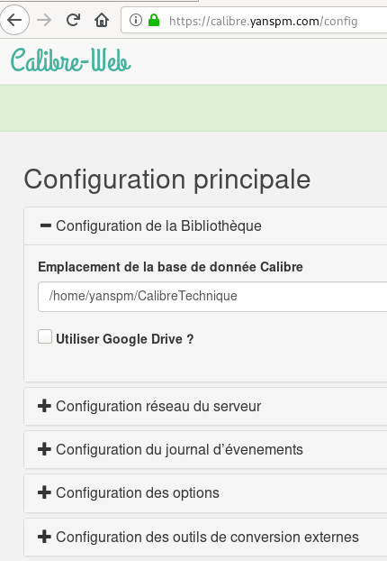{:height="300"}

puis cliquer sur **Connexion**  
Par défaut: *Nom d'utilisateur:* admin , *Mot de passe:* admin123 

Paramétrage , cliquer sur **Admin** (pas sur admin avec le a minuscule)

Cliquer sur **Add new user**  
Username : yannick  
Email address : div@cinay.xyz  
Password : xxxxxx  
Kindle email:  
Language : français  
Show books with language : Show all  

{:height="300"}

Cliquer sur **submit**  

Se reconnecter avec l'utilisateur *yanspm*  
Cliquer sur *Admin* et sélectionner *admin* , cocher la case "Supprimer cet utilisateur"  
Cliquer sur **Soumettre**  
Il reste l'utilisateur/administrateur **yanspm**  

## Yunohost 

### Ajout domaine (facultatif)

Ajout domaine et certificats ebook.yanfi.space

    yunohost domain add ebook.yanfi.space
    yunohost domain cert-install ebook.yanfi.space --no-checks

### Application calibre-web

Installer l'application **Calibre-web**  

    yunohost app install https://github.com/YunoHost-Apps/calibreweb_ynh

```
Choose the domain where this app should be installed [cinay.eu | gitea.cinay.eu | map.cinay.eu | static.cinay.eu | yanfi.net | yanfi.space | ebook.yanfi.space | searx.yanfi.space | zic.yanfi.space] (default: yanfi.space): ebook.yanfi.space
Choose the path where this app should be installed (default: /calibre): /
Choose an administrator user for this app [yann | claudine | yanfi]: yann
Should this app be exposed to anonymous visitors? [yes | no] (default: no): yes
Select a default language [fr | en | es | de] (default: fr): 
Do you want to allow uploading of books? [yes | no] (default: no): 
Do you want to allow access to the library to all Yunohost users?  [yes | no] (default: yes): 
```

### Synchro bibliothèque avec rsync

Synchronisation du dossier local `/home/yunohost.multimedia/share/eBook/` avec le dossier distant `/home/usernl/backup/BiblioCalibre` du serveur xoyaz.xyz  
L'opération est exécutable en mode su seulement  

    rsync -avz --delete --rsync-path="sudo rsync" -e "ssh -p 55036 -i /home/admin/.ssh/OVZ-STORAGE-128 -o StrictHostKeyChecking=no -o UserKnownHostsFile=/dev/null" usernl@xoyaz.xyz:/home/usernl/backup/BiblioCalibre/* /home/yunohost.multimedia/share/eBook/  && chown calibreweb.calibreweb -R /home/yunohost.multimedia/share/eBook/

Créer une tâche crontab

    sudo -s
    crontab -e

```
# Synchronisation du dossier local /home/yunohost.multimedia/share/eBook/ avec le dossier distant /home/usernl/backup/BiblioCalibre du serveur xoyaz.xyz
# Tous les jours à 4h00 du matin
0 4 * * * rsync -avz --delete --rsync-path="sudo rsync" -e "ssh -p 55036 -i /home/admin/.ssh/OVZ-STORAGE-128 -o StrictHostKeyChecking=no -o UserKnownHostsFile=/dev/null" usernl@xoyaz.xyz:/home/usernl/backup/BiblioCalibre/* /home/yunohost.multimedia/share/eBook/  && chown calibreweb.calibreweb -R /home/yunohost.multimedia/share/eBook/
```

### Les traductions 

```bash
find /var/www/calibreweb/cps/templates/ -name "*.*" -type f -exec sed -i "s#'Sort according to book date, newest first'#'Trier selon la date du livre, le plus récent en premier'#g" {} \;
find /var/www/calibreweb/cps/templates/ -name "*.*" -type f -exec sed -i "s#'Sort according to book date, oldest first'#'Trier selon la date du livre, le plus ancien en premier'#g" {} \;
find /var/www/calibreweb/cps/templates/ -name "*.*" -type f -exec sed -i "s#'Sort title in alphabetical order'#'Trier le titre par ordre alphabétique'#g" {} \;
find /var/www/calibreweb/cps/templates/ -name "*.*" -type f -exec sed -i "s#'Sort title in reverse alphabetical order'#'Trier le titre en ordre alphabétique inverse'#g" {} \;
find /var/www/calibreweb/cps/templates/ -name "*.*" -type f -exec sed -i "s#'Sort authors in alphabetical order'#'Trier les auteurs par ordre alphabétique'#g" {} \;
find /var/www/calibreweb/cps/templates/ -name "*.*" -type f -exec sed -i "s#'Sort authors in reverse alphabetical order'#'Trier les auteurs par ordre alphabétique inverse'#g" {} \;
find /var/www/calibreweb/cps/templates/ -name "*.*" -type f -exec sed -i "s#'Sort according to publishing date, newest first'#'Trier selon la date de publication, les plus récentes en premier'#g" {} \;
find /var/www/calibreweb/cps/templates/ -name "*.*" -type f -exec sed -i "s#'Sort according to publishing date, oldest first'#'Trier selon la date de publication, la plus ancienne en premier'#g" {} \;
```


Les fichiers de traduction française dans le dossier `/var/www/calibreweb/cps/translations/fr/LC_MESSAGES/`  
Editer et modifier le fichier `messages.po`  
Convertir le `po` vers `mo` , lien  <http://po2mo.net/>  
Redémarrer le service `calibreweb`

    systemctl restart calibreweb

### Paramétrage

Ouverture du lien https://ebook.yanfi.space  
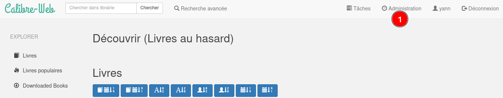{:width="400"}  
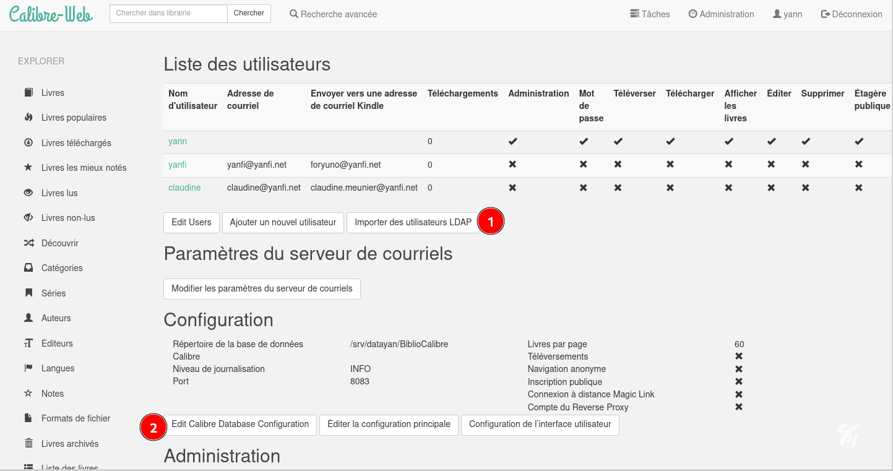{:width="400"}  
{:width="400"}  
{:width="400"}  
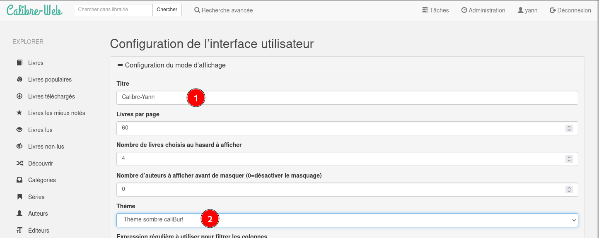{:width="400"}  
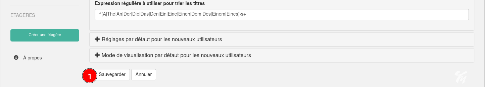{:width="400"}  
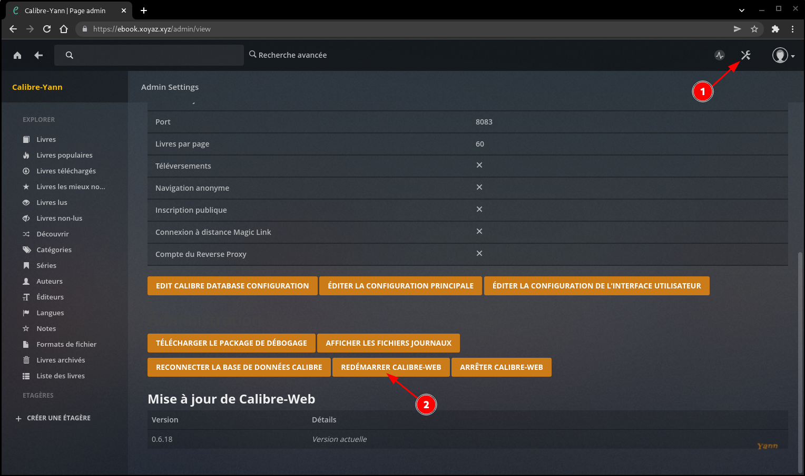{:width="400"}  

## Trucs et astuces

* [Organiser sa bibliothèque](http://tutocalibre.free.fr/tuto_organiser.php)

### Paramétrer les colonnes à afficher

émarrez Calibre et ouvrez la fenêtre des paramètres. Sélectionnez l'option "Ajouter mes propres colonnes" dans la catégorie "Interface utilisateur".  
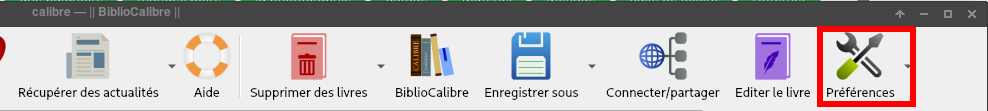{:width="400"}  

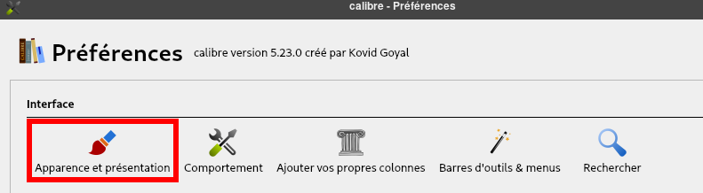{:width="400"}  


### marquer les livres comme lus

* [Calibre: marquer les livres comme lus et non lus](https://fr.hackzl.com/calibre-b-cher-als-gelesen-und-ungelesen-markieren)


Marquer des livres électroniques dans Calibre comme lus et non lus

Par défaut, Calibre n'offre pas de fonction directe avec laquelle vous pouvez trier les livres par lecture et non lus. Cependant, vous pouvez créer vos propres colonnes et créer cette fonctionnalité vous-même, même si c'est un peu compliqué. Dans notre galerie de photos, vous pouvez voir les étapes comme un itinéraire de clic.

1.    Démarrez Calibre et ouvrez la fenêtre des paramètres. Sélectionnez l'option "Ajouter mes propres colonnes" dans la catégorie "Interface utilisateur".  
{:width="400"}  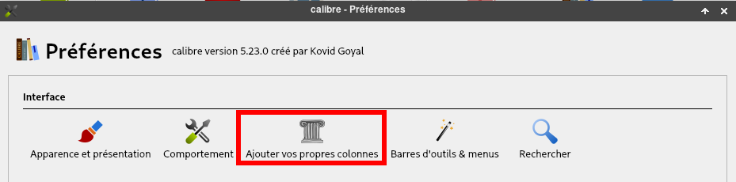{:width="400"}  
2.    Vous verrez maintenant toutes les colonnes créées dans Calibre. Pour la fonction de lecture, vous devez créer votre propre colonne. Pour ce faire, cliquez sur le vert plus à droite ou sur le bouton "Ajouter une colonne personnalisée" en bas de l'écran.  
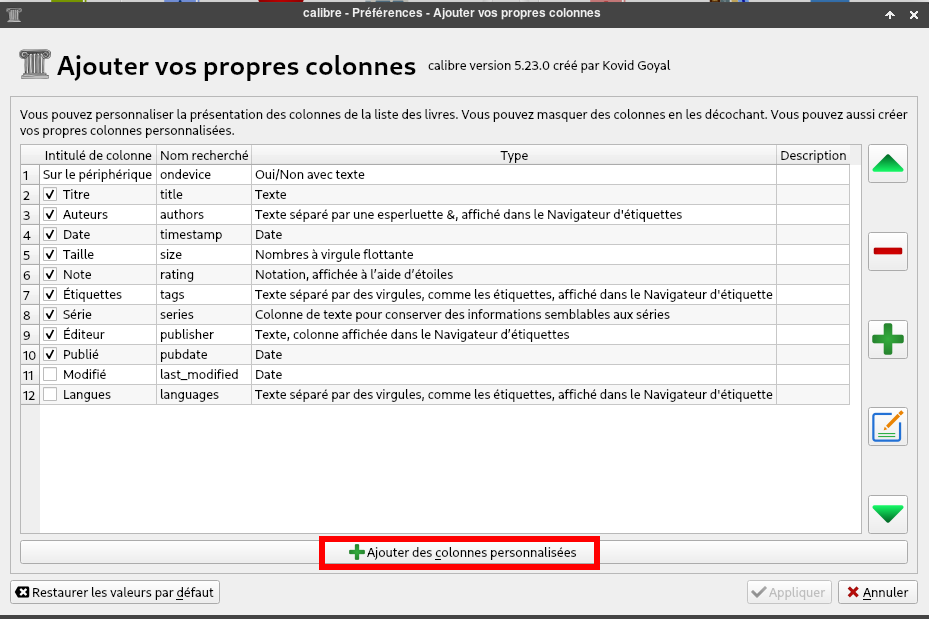{:width="600"}  
3.    Dans la fenêtre qui s'ouvre, sélectionnez "Oui/Non" sous "Création rapide". Calibre remplit désormais automatiquement les colonnes avec certaines données. Entrez le mot clé "lu" (sans guillemets) sous "Nom recherché". Sous l'en-tête de colonne, saisissez une description, telle que "Lu?".Valeur par défaut "Non", Confirmez ensuite avec OK pour créer la colonne.  
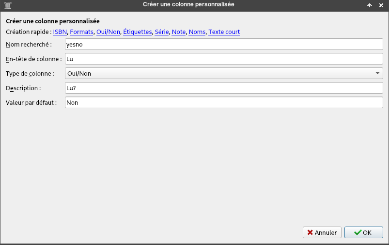{:width="600"}  
4.    Assurez-vous maintenant que la coche est placée à côté de la colonne "Lu?" Que vous venez de créer. Ne fermez pas la fenêtre avec le X, mais enregistrez vos modifications avec la touche "Appliquer".  
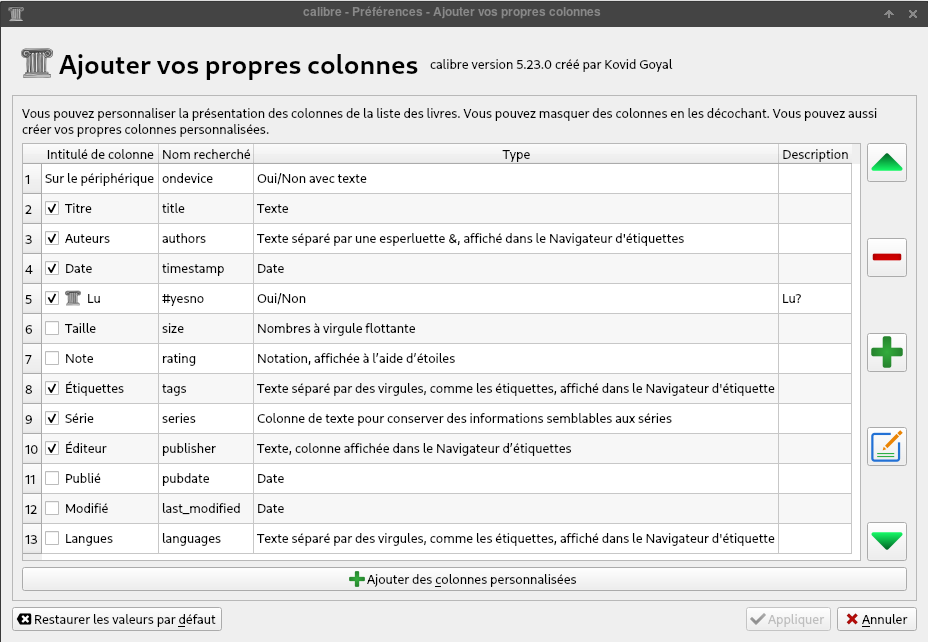{:width="600"}  
Un redémarrage de Calibre est nécessaire  
5.    De retour dans votre bibliothèque, faites un clic droit pour sélectionner un livre puis sous "Modifier les métadonnées" sélectionnez l'option "Modifier les métadonnées individuellement". Sous l'onglet "Métadonnées définies par l'utilisateur", vous pouvez désormais facilement sélectionner si un livre est lu ou non lu.

### Lier le champ "lu" avec calibre-web

Se connecter en administrateur sur calibre-web  
  


## Calibre web (calibre.rnmkcy.eu)

{:height="60"} 

<https://github.com/janeczku/calibre-web>

### Environnement python

Vérifier python3

    python3 -V

Python 3.11.2

Prérequis, installer pip et aussi venv pour votre version de python 

    sudo apt install python3-venv python3-dev 

Création dossier puis un environnement virtuel pour calibre-web

```shell
sudo mkdir /home/leno/calibreweb
sudo chown $USER:$USER /home/leno/calibreweb
python3 -m venv /home/leno/calibreweb
```

Activer l'environnement

    source /home/leno/calibreweb/bin/activate

On arrive sur le prompt `((calibreweb) leno@rnmkcy:~$`  

Installer calibre-web

```shell
pip3 install --upgrade pip
pip3 install wheel
pip3 install cmake
pip3 install calibreweb
```

### Service calibreweb

Utilisation fichier systemd pour le lancement automatique

    sudo nano /etc/systemd/system/calibreweb.service

Contenu du fichier

```
[Unit]
Description=Service calibreweb
After=network.target

[Service]
Type=simple
User=leno
ExecStart=/home/leno/calibreweb/bin/cps

[Install]
WantedBy=multi-user.target
```

ATTENTION! , User est l’utilisateur connecté ($USER)

Recharger et lancer le service calibreweb et vérifier

    sudo systemctl daemon-reload
    sudo systemctl start calibreweb

Vérifier et activer

    sudo systemctl status calibreweb
    sudo systemctl enable calibreweb

### Proxy nginx

[Setup Reverse Proxy](https://github.com/janeczku/calibre-web/wiki/Setup-Reverse-Proxy)

Si vous voulez utiliser nginx comme proxy , fichier de configuration `/etc/nginx/conf.d/calibre.ouestline.xyz.conf` 

```nginx
server {
    listen 80;
    listen [::]:80;
    server_name  calibre.ouestline.xyz;

    # redirect all plain HTTP requests to HTTPS
    return 301 https://calibre.ouestline.xyz$request_uri;
}

server {
    # ipv4 listening port/protocol
    listen       443 ssl http2;
    # ipv6 listening port/protocol
    listen           [::]:443 ssl http2;
    server_name  calibre.ouestline.xyz;

    include /etc/nginx/conf.d/security-ouestline.xyz.conf.inc;

    # connexion nginx fermée si sous domaine inexistant
    if ($http_host != "calibre.ouestline.xyz") {
     return 444;
    }

  location / { 
     proxy_pass              http://127.0.0.1:8083;
  } 

}
```

Ouvrir le lien https://calibre.ouestline.xyz  
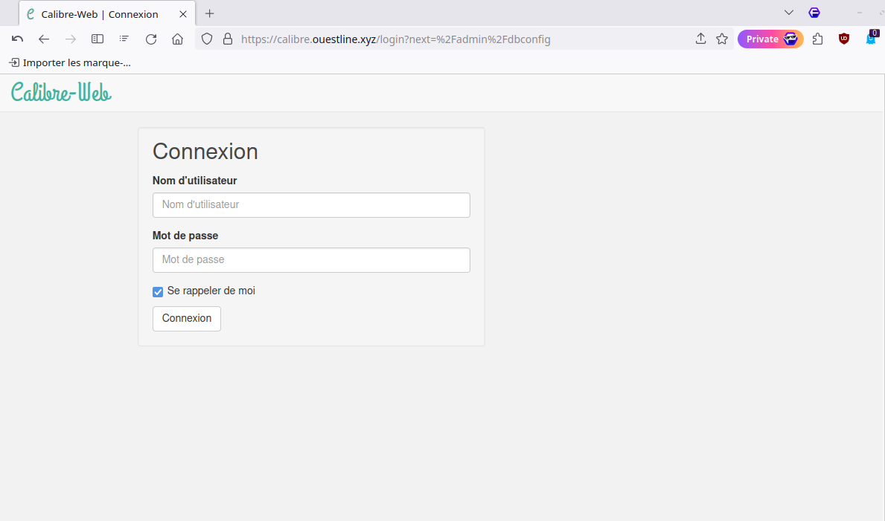{:width="600"}  
Par défaut admin admin123  

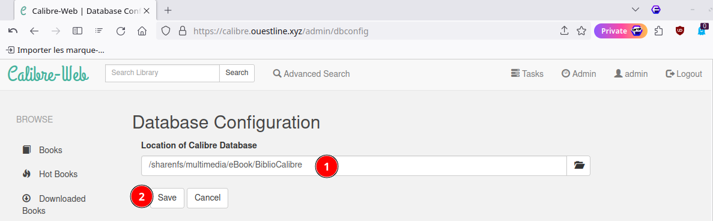{:width="600"}  
Cliquer sur **Admin** avec un grand A, pusi clic "Edit Users"   
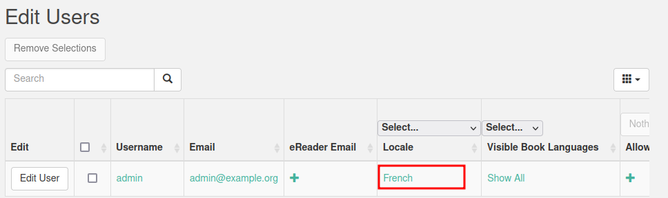{:width="600"}  
Clic sur "Back", le menu s'affiche en français

Configuration de l’interface utilisateur  
Thème sombre puis clic "Sauvegarder"

Afficher champ lu/non lu   
{:width="600"}  
{:width="600"}

### Authentification ldap

*LDAP peut être utilisé comme fournisseur de connexion pour Calibre-Web. En fonction de votre distribution, certains paquets doivent être installés. Vous devez également installer les dépendances listées dans le fichier optional-requirements.txt dans la section LDAP.*

Il faut installer des modules complémentaires  

```
# ldap login
python-ldap>=3.0.0,<3.5.0
Flask-SimpleLDAP>=1.4.0,<1.5.0
```

Prérequis

 sudo apt install libsasl2-dev python3-dev libldap2-dev libssl-dev

activer l'environnement

    source /home/leno/calibreweb/bin/activate

On arrive sur le prompt `((calibreweb) leno@rnmkcy:~$`  

Installer python ldap

```shell
pip3 install python-ldap
pip3 install Flask-SimpleLDAP
```

Redémarrer le service 

    sudo systemctl restart calibreweb

Se connecter en admin sur le lien <https://calibre.rnmkcy.eu>

Après un redémarrage de Calibre-Web, vous devriez voir Flask_SimpleLDAP dans la section "A propos".  
Dans la section Admin -> Editer la configuration principale -> Configuration des options, une nouvelle option "Type de connexion" apparaît. Après avoir sélectionnée "Utiliser l'authentification LDAP" , vous devez configurer votre connexion LDAP :

[Configuration lldap](https://github.com/lldap/lldap/blob/main/example_configs/calibre_web.md)   
Remplacer `dc=rnmkcy,dc=eu` avec le domaine configuré dans LLDAP

**Version Anglaise**  
Login type : `Use LDAP Authentication`  
LDAP Server Host Name or IP Address : `127.0.0.1`  
LDAP Server Port : `3890`  
LDAP Encryption : `none`  
LDAP Authentication : `simple`  
LDAP Administrator Username : `uid=admin,ou=people,dc=rnmkcy,dc=eu`  
LDAP Administrator Password : `MOT_PASSE_ADMIN_LDAP`  
LDAP Distinguished Name (DN) : `dc=rnmkcy,dc=eu`  
LDAP User Object Filter : `(&(objectclass=person)(uid=%s))`  
LDAP Server is OpenLDAP? : `yes`  
LDAP Group Object Filter : `(&(objectclass=groupOfUniqueNames)(cn=%s))`  
LDAP Group Name : `calibre_web`  
Note: Créez un groupe dans lldap et ajoutez-y les utilisateurs qui auront accès à votre instance Calibre-Web.

LDAP Group Members Field : `uniqueMember`  
LDAP Member User Filter Detection : `Custom Filter`  
LDAP Member User Filter : `(&(objectclass=person)(uid=%s))`  
Note: mettre en minuscule le mot "person" jusqu'à ce que ce bug soit corrigé

**Version Française**  
Type de connexion : `Utiliser l'authentificationLDAP`  
Nom d'hôte ou Adresse IP du serveur LDAP : `127.0.0.1`  
Port du serveur LDAP : `3890`  
Chiffrement LDAP : `Aucun`  
Authentification LDAP : `Simple`  
Nom d'utilisateur de l'administrateur LDAP : `uid=admin,ou=people,dc=rnmkcy,dc=eu`  
Mot de passe de l'administrateur LDAP : `MOT_PASSE_ADMIN_LDAP`  
LDAP Distinguished Name (DN) : `dc=rnmkcy,dc=eu`  
Filtre objet de l'utilisateur LDAP : `(&(objectclass=person)(uid=%s))`    
Est-ce que le serveur LDAP est OpenLDAP? Cocher la case   

Les paramètres suivant sont nécessaires pour importer un utilisateur  
Filtre objet de groupe LDAP : `(&(objectclass=groupOfUniqueNames)(cn=%s))`  
Nom de groupe LDAP : `calibre_web`  
Note: Créez un groupe dans lldap et ajoutez-y les utilisateurs qui auront accès à votre instance Calibre-Web.

Champ des membres de groupe LDAP : `uniqueMember`  
Filtre de détection des utilisateurs membres LDAP : `Filtre personnalisé` 
Filtre utilisateur des membres LDAP : `(&(objectclass=person)(uid=%s))`  


Images de la configuration  
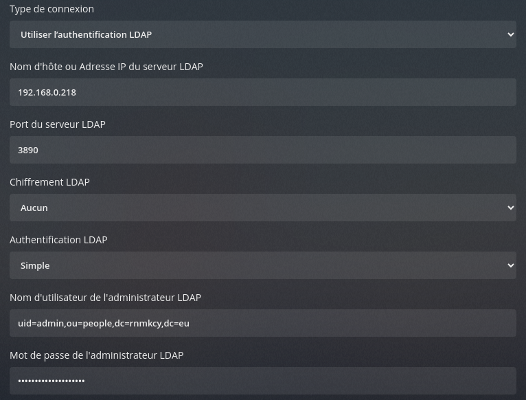{:width="600"}  
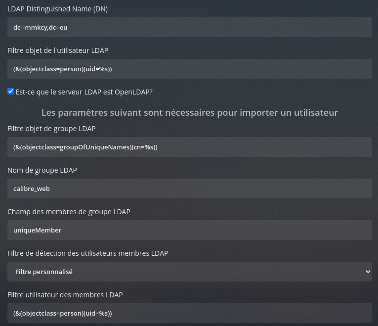{:width="600"}  
Cliquer sur **SAUVEGARDER**

<u>Pour se connecter à Calibre-Web via LDAP, les utilisateurs doivent être créés ou importés dans Calibre-Web</u> (le compte utilisateur doit être visible dans la section d'administration de Calibre-Web). Si vous entrez un mot de passe dans la section "Modifier l'utilisateur" pour votre compte administrateur, vous pouvez vous connecter en tant que solution de repli si le serveur LDAP n'est pas accessible (ou si la connexion est mal configurée). Dans le cas contraire, il n'est pas possible de se connecter à Calibre-Web et de modifier les paramètres. Si le serveur LDAP est hors service, aucun utilisateur sans mot de passe de secours ne peut se connecter à Calibre-Web. Les mots de passe des utilisateurs ne sont pas mis à jour/stockés dans la base de données de Calibre-Web. Tant que le serveur LDAP fonctionne, les utilisateurs avec le mot de passe de secours ne peuvent se connecter qu'avec leur mot de passe LDAP et non avec le mot de passe de secours.
{: .prompt-info }

### Connexion invité

La connexion invité ne nécessite pas de login et mot de passe   
Elle est autorisée seulement car on utilise **authelia** comme portail SSO  

Configuration authelia `/etc/authelia/configuration.yml`

```yaml
access_control:
  default_policy: deny
  rules:
    - domain:
        - "calibre.rnmkcy.eu"
```

Paramétrage calibre-web   
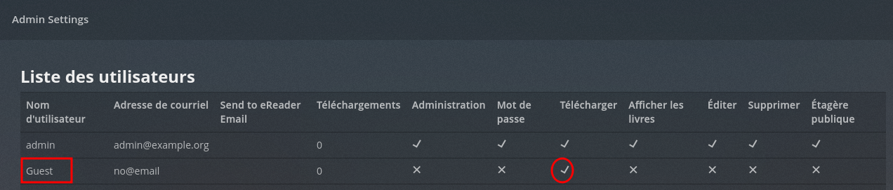  
Accès bibliothèque et autorisation téléchargement  

### Rafraîchissement site calibre

Les modifications du dossier d'origine et de la base calibre sont synchronisées par rsync. Cependant la page web calibre n'est pas réactualisée, il faut relancer le service calibre par la commande `systemctl restart calibreweb`.

Pour automatiser la relance du service, on va s'appuyer sur le fait que la base calibre `metadata.db` change de date et heure à chaque modification

Nous allons surveiller dansle dossier `/sharenfs/multimedia/eBook/BiblioCalibre/` toute modification du fichier `metadata.db` qui entrainera l’exécution d’un script

Dans le répertoire systemd nous créons une unité de cheminement calibreweb-modif.path

    sudo nano /etc/systemd/system/calibreweb-modif.path

```
[Unit]
Description=Surveiller BiblioCalibre metadata.db

[Path]
PathChanged=/sharenfs/multimedia/eBook/BiblioCalibre/metadata.db
Unit=calibreweb-modif.service

[Install]
WantedBy=multi-user.target
```

Dans la section `[Path]`, `PathChanged=` indique le chemin absolu du fichier à surveiller, tandis que `Unit=` indique l’unité de service à exécuter si le fichier change. 

Le service `calibreweb-modif.service`

```
[Unit] 
Description="Relance du service calibreweb"

[Service]
ExecStart=/usr/bin/systemctl restart calibreweb.service

[Install]
WantedBy=multi-user.target
```

Mise en place, il faut activer path 

```bash
sudo systemctl enable calibreweb-modif.path --now
```

En cas de modifications : `journalctl -u calibreweb-modif.service`  

```
juil. 23 11:50:16 rnmkcy.eu systemd[1]: Started calibreweb-modif.service - "Relance du service calibreweb".
juil. 23 11:50:16 rnmkcy.eu systemd[1]: calibreweb-modif.service: Deactivated successfully.
```
