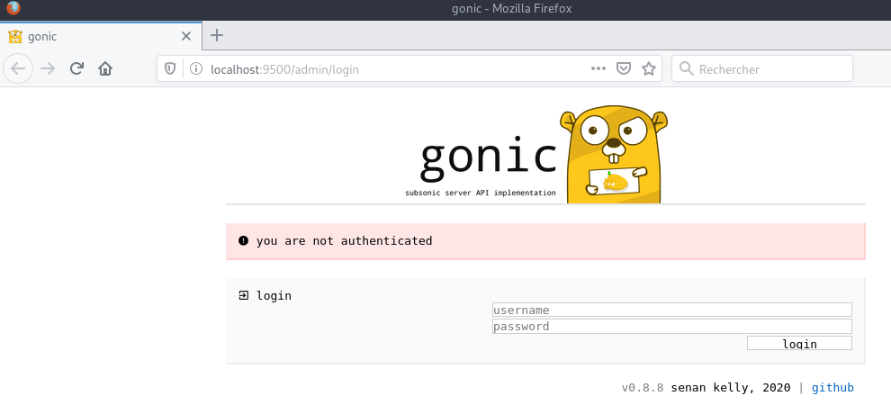

+++
title = 'cwwk - Service Audio Gonic'
date = 2024-12-24 00:00:00 +0100
categories = vps
+++
*Gonic, service qui implémente l'API Subsonic pour le streaming audio, écrit en Go* 

## Serveur Audio Gonic

{:width="200"}  

Caractéristiques de [Gonic](https://github.com/sentriz/gonic)

- navigation par dossier
- navigation par tags (en utilisant [taglib](https://taglib.org/) - prend en charge mp3, opus, flac, ape, m4a, wav, etc.)
- transcodage et cache audio à la volée (demande [ffmpeg](https://ffmpeg.org/)) 
- mode jukebox subsonic (mpv), pour lecture audio côté serveur sans faille au lieu de streaming  
- soutien aux podcasts  
- balayage assez rapide 
- plusieurs utilisateurs, chacun avec ses propres préférences de transcodage, playlists, meilleurs titres, meilleurs artistes, etc.
- [last.fm] (https://www.last.fm/)
- [listenbrainz](https://listenbrainz.org/) scrobbling 
- les similarités artistiques et les biographies de la dernière. - Oui.
- prise en charge de tags multi-valorisés comme les albumartistes et les genres 
- une interface web pour la configuration (configurer en dernier. fm, gérer les utilisateurs, lancer des scans, etc.)
- soutien au tag [album-artiste](https://mkoby.com/2007/02/18/artiste-versus-album-artiste/), pour ne pas encombrer votre liste d'artistes avec des apparitions d'albums de compilation
- écrit en [go](https://golang.org/) 
- sel plus récent et jeton auth
- testés sur [airsonic-refix](https://github.com/tamland/airsonic-refix), [symfonium](https://symfonium.app), [dsub](https://f-droid.org/en/packages/github.daneren2005.dsub/), [jamstash](http://jamstash.com/), [subsonic.el](https://git.sr.ht/~amk/subsonic.el), [sublime music](https://github.com/sublime-music/sublime-music), [soundwaves](https://apps.apple.com/us/app/soundwaves/id736139596), [stmp](https://github.com/wildeyedskies/stmp), [strawberry](https://www.strawberrymusicplayer.org/), et [subs/subs/

### Prérequis

Golang - [Installer la dernière version de Go](/posts/Debian_installer_Go+Node/#installer-la-derni%C3%A8re-version-de-go)  

Les outils (ajouter mpv si utilisé)

    sudo apt install build-essential git sqlite3 libtag1-dev ffmpeg


### Installation gonic

Le dossier de l'application

    sudo mkdir -p /opt/gonic
    
Le dossier musique est local **/home/usernl/backup/musique**, créer un lien sur ce dossier  

    sudo ln -s /home/usernl/backup/musique /opt/gonic/music

Installer "gonic"

```bash
# dépendances
sudo apt install build-essential git sqlite3 libtag1-dev ffmpeg    
cd $HOME/
# installation/compilation gonic, et vérifier la version
# sudo GOBIN=/usr/local/bin 
go install go.senan.xyz/gonic/cmd/gonic@latest
```

Copier l'exécutable "gonic" dans /usr/local/go/bin/

    sudo cp $HOME/go/bin/gonic /usr/local/bin/   

Version: `gonic -version`  
v0.16.4

### Créer utilisateur dossier et configuration

Ajouter un utilisateur gonic, créer un répertoire de données et installer un fichier de configuration

```bash
sudo adduser --system --no-create-home --group gonic
sudo mkdir -p /var/lib/gonic/ /etc/gonic/
sudo chown -R gonic:gonic /var/lib/gonic/
sudo wget https://raw.githubusercontent.com/sentriz/gonic/master/contrib/config -O /etc/gonic/config
```

### Configuration

Le fichier `/etc/gonic/config`

```
# Interface and port to listen on. Defaults to 0.0.0.0:4747
listen-addr                 127.0.0.1:4747
# gonic's internal state database location
db-path                     /var/lib/gonic/gonic.db
# music-path                  /srv/audio/music
music-path                  /sharenfs/multimedia/Music/musicyan
# podcast-path                /var/cache/podcast
podcast-path                /sharenfs/multimedia/Music/podcasts
# playlists-path             /srv/audio/playlists
playlists-path              /sharenfs/multimedia/Music/playlists
# Directory where transcoded audio files and covers are stored. It's safe to
# delete contents periodically (see tmpfilesd configuration), as it will be
# regenerated.
cache-path                  /var/cache/gonic
```

### Service gonic    

Que fait le service ?

* Le dossier musique est local
* lancer le serveur "gonic" en écoute local sur le port 4747 avec les options `-music-path`, `-db-path` et `-proxy-prefix` 
* A l'arrêt,tuer la tâche "gonic" 

Chaque service généré par systemd est configuré par un fichier .service qui se trouve dans le répertoire **/etc/systemd/system**

```bash
sudo wget https://raw.githubusercontent.com/sentriz/gonic/master/contrib/gonic.service -O /etc/systemd/system/gonic.service
sudo systemctl daemon-reload
sudo systemctl enable --now gonic

#systemctl status gonic            # check status, should be active (running)
#journalctl --follow --unit gonic  # check logs
```

Status service: `systemctl status gonic`

```
● gonic.service - gonic service
     Loaded: loaded (/etc/systemd/system/gonic.service; enabled; preset: enabled)
     Active: active (running) since Tue 2024-12-24 18:04:30 CET; 3s ago
   Main PID: 127009 (gonic)
      Tasks: 8 (limit: 38144)
     Memory: 7.5M
        CPU: 21ms
     CGroup: /system.slice/gonic.service
             └─127009 /usr/local/bin/gonic -config-path /etc/gonic/config

déc. 24 18:04:30 cwwk gonic[127009]: 2024/12/24 18:04:30     scan-at-start-enabled     false
déc. 24 18:04:30 cwwk gonic[127009]: 2024/12/24 18:04:30     scan-interval             0
déc. 24 18:04:30 cwwk gonic[127009]: 2024/12/24 18:04:30     scan-watcher-enabled      false
déc. 24 18:04:30 cwwk gonic[127009]: 2024/12/24 18:04:30     tls-cert
déc. 24 18:04:30 cwwk gonic[127009]: 2024/12/24 18:04:30     tls-key
déc. 24 18:04:30 cwwk gonic[127009]: 2024/12/24 18:04:30     version                   false
déc. 24 18:04:30 cwwk gonic[127009]: 2024/12/24 18:04:30 starting job "session clean"
déc. 24 18:04:30 cwwk gonic[127009]: 2024/12/24 18:04:30 starting job "http"
déc. 24 18:04:30 cwwk gonic[127009]: 2024/12/24 18:04:30 starting job "podcast refresh"
déc. 24 18:04:30 cwwk gonic[127009]: 2024/12/24 18:04:30 starting job "podcast download"
```

Visualiser le journal

    sudo journalctl -t gonic

```
-- Logs begin at Mon 2020-06-29 11:14:09 CEST, end at Mon 2020-06-29 15:57:28 CEST. --
Jun 29 15:57:28 vps70253415 gonic[12048]: 2020/06/29 15:57:28 starting gonic v0.8.8
Jun 29 15:57:28 vps70253415 gonic[12048]: 2020/06/29 15:57:28 provided config
Jun 29 15:57:28 vps70253415 gonic[12048]: 2020/06/29 15:57:28     cache-path      /tmp/gonic_cache
Jun 29 15:57:28 vps70253415 gonic[12048]: 2020/06/29 15:57:28     config-path
Jun 29 15:57:28 vps70253415 gonic[12048]: 2020/06/29 15:57:28     db-path         /opt/gonic/gonic.db
Jun 29 15:57:28 vps70253415 gonic[12048]: 2020/06/29 15:57:28     jukebox-enabled false
Jun 29 15:57:28 vps70253415 gonic[12048]: 2020/06/29 15:57:28     listen-addr     0.0.0.0:4747
Jun 29 15:57:28 vps70253415 gonic[12048]: 2020/06/29 15:57:28     music-path      /opt/gonic/music
Jun 29 15:57:28 vps70253415 gonic[12048]: 2020/06/29 15:57:28     proxy-prefix    /
Jun 29 15:57:28 vps70253415 gonic[12048]: 2020/06/29 15:57:28     scan-interval   0
Jun 29 15:57:28 vps70253415 gonic[12048]: 2020/06/29 15:57:28     version         false
Jun 29 15:57:28 vps70253415 gonic[12048]: 2020/06/29 15:57:28 starting job 'http'
```

### Accès web 

#### Via SSH

- Gonic &rarr; localhost:4747

*on va utiliser une redirection de port via ssh*

**Serveur audio gonic**  
Ouvrir un terminal sur le client linux qui dispose des clés ssh et lancer la commande

    ssh -L 5900:127.0.0.1:4747 yick@192.168.0.205 -p 55205 -i /home/yann/.ssh/yick-ed25519

Ouvrir un navigateur sur le client et saisir localhost:9500 pour afficher le serveur audio gonic  
  
Par défaut : admin/admin

admin/TrailleHumideGermonSynapsePolysoc

#### Proxy nginx zic.rnmkcy.eu

Gonic est un serveur local http sur le port 4747 et pour un accès externe il nous faut un proxy

Proxy nginx - configuration `/etc/nginx/conf.d/zic.rnmkcy.eu.conf`

```
server {
    listen 80;
    listen [::]:80;
    server_name  zic.rnmkcy.eu;

    # redirect all plain HTTP requests to HTTPS
    return 301 https://zic.rnmkcy.eu$request_uri;
}

server {
    # ipv4 listening port/protocol
    listen       443 ssl http2;
    # ipv6 listening port/protocol
    listen           [::]:443 ssl http2;
    server_name  zic.rnmkcy.eu;

    include /etc/nginx/conf.d/security.conf.inc;

    # Proxy audio gonic server
    location / {

      proxy_set_header        Host $host;
      proxy_set_header        X-Real-IP $remote_addr;
      proxy_set_header        X-Forwarded-For $proxy_add_x_forwarded_for;
      proxy_set_header        X-Forwarded-Proto $scheme;

      proxy_pass          http://127.0.0.1:4747;
      proxy_read_timeout  120;
    }

}

```

On vérifie et on relance le serveur nginx

    sudo nginx -t
    sudo systemctl reload nginx
    
Accès https://zic.rnmkcy.eu
