+++
title = 'Dell Latitude E6230 - EndeavourOS chiffré LVM/LUKS'
date = 2024-12-27 00:00:00 +0100
categories = ['archlinux', 'chiffrement', 'lvm']
+++
*EndeavourOS est une distribution GNU/Linux basée sur Arch Linux.*

{:width="90"} 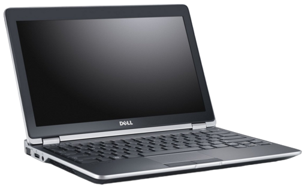{:width="150"}  
[Portable Dell Latitude E6230 - matériel , documentation et bios](/posts/Dell_Latitude_E6230_Caracteristiques_generales_Documentation_et_Bios/)

* **LVM/LUKS**, flexibilité de partitionnement en utilisant LVM dans une seule partition cryptée LUKS.
    * <u>Avantages</u>:
        * partitionnement simple avec connaissance de LVM
        * Une seule clé nécessaire pour déverrouiller tous les volumes (p. ex. installation facile de récupération de disque)
        * Mise en page du volume non visible lorsque verrouillé
        * Méthode la plus facile pour permettre la [suspension du disque](https://wiki.archlinux.org/title/Dm-crypt/Swap_encryption#With_suspend-to-disk_support)
    * <u>Inconvénients</u>:
        * LVM ajoute une couche de mappage supplémentaire et un "hook"
        * Moins utile, si un volume doit recevoir une clé séparée

`Installer une distribution EndeavourOS chiffrée sur une partition LVM est impossible avec l'outil "Calamarès"`{: .prompt-warning }

## EndeavourOS temporaire 

*Pour une installation EndavourOS LVM/LUKS, il faut passer par une installation temporaire*

### Création Eos USB Live

*Création d'une clé USB EndeavourOS bootable*

Dans un terminal linux  
Télécharger le dernier fichier iSO : <https://endeavouros.com/latest-release/>  
**EndeavourOS_Endeavour-2024.06.25.iso**

Vérifier checksum

```bash
sha512sum -c EndeavourOS_Endeavour-2024.06.25.iso.sha512sum
```

Résultat de la commande ci dessus après quelques minutes  
*EndeavourOS_Endeavour-2024.06.25.iso: Réussi*

Créer la clé bootable  
Pour savoir sur quel périphérique, connecter la clé sur un port USB d'un ordinateur et lancer la commande `sudo dmesg` ou `lsblk`  
Dans le cas présent , le périphérique USV est **/dev/sdc**

```bash
sudo dd if=EndeavourOS_Endeavour-2024.06.25.iso of=/dev/sdc bs=4M
```

### Démarrer sur Eos USB Live 

Insérer la clé USB EndeavourOS, redémarrer la machine, sur Eos live 

1. basculer en FR  
2. ouvrir un terminal

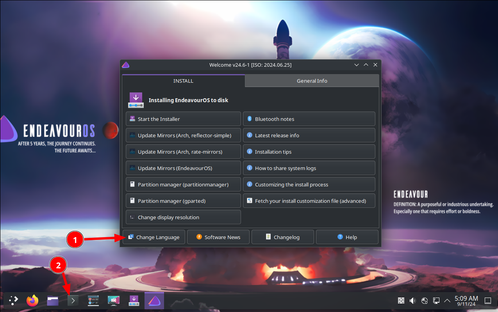{:width="600"}

`Clavier QWERTY!!!`{: .prompt-warning }  

{:width="600"}  
Remove Us...   
Apply  

On va se connecter en SSH  

```
ip a # relever adresse IP
sudo systemctl start sshd
passwd liveuser  # changer le mot de passe liveuser --> rtyuiop
sudo firewall-cmd --zone=public --add-port=22/tcp
```

Se connecter depuis un poste sur le même réseau: `ssh liveuser@adresse_IP`

### Partionnement

en mode su

```
sudo -s
```

Le disque : `lsblk`

```
sda         8:0    0 447.1G  0 disk 
```

On partitionne un disque en 3 avec `gdisk`

* Partition 1 : 512M EFI (code ef00) système de fichier FAT32
* Partition 2 : 438G LVM (code 8e00) système de fichier EXT4
* Partition restante pour Installation temporaire

Zapper le disque,

(**Attention** Ceci effacera de manière irréversible toutes les données de votre disque, veuillez sauvegarder toutes les données importantes) :

```
sgdisk --zap-all /dev/sda
```

Créer une table de partition GPT à l'aide de la commande `sgdisk` :

```
sgdisk --clear --new=1:0:+550MiB --typecode=1:ef00 --new=2:0:+438G --typecode=2:8e00 /dev/sda

```

Format la partition EFI

```
mkfs.fat -F32 /dev/sda1 
```

### Installer Eos XFCE

Utilisation de Calamarès, cliquer sur **Démarrer l'installateur**  
Installation "en ligne"  
Bureau: XFCE4  
Paquets : Tout sauf LTS Kernel
Chargeur: systemd-boot  
Partitions:  
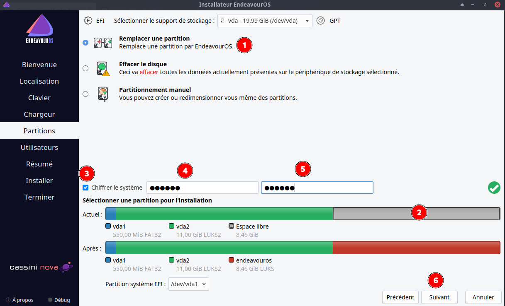{:width="600"}  
Utilisateurs:  
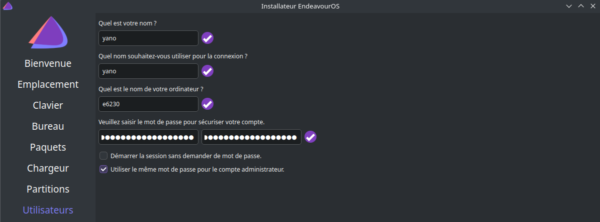{:width="600"}  
Ordi e6230, mot passe utilisateur identique admin  
Résumé:  
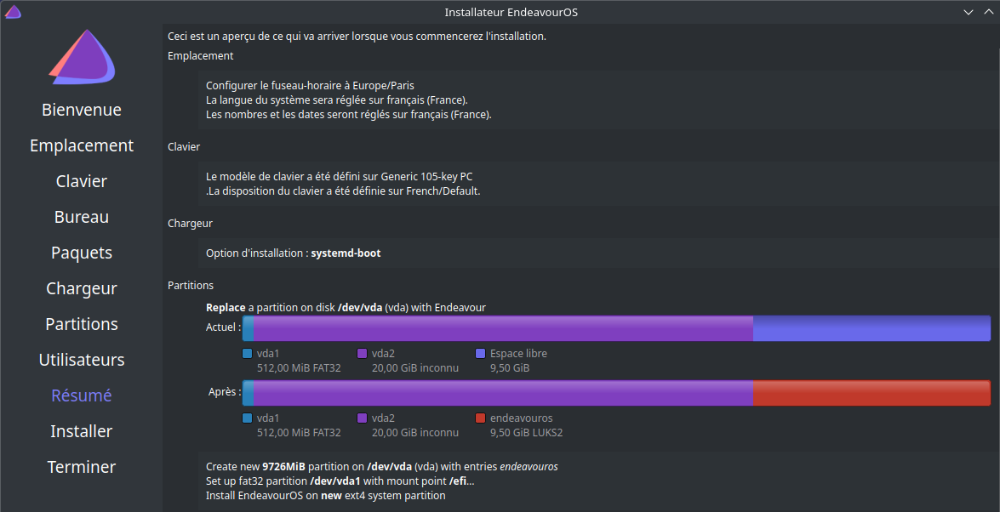{:width="600"}  
Cliquer sur **Installer**  

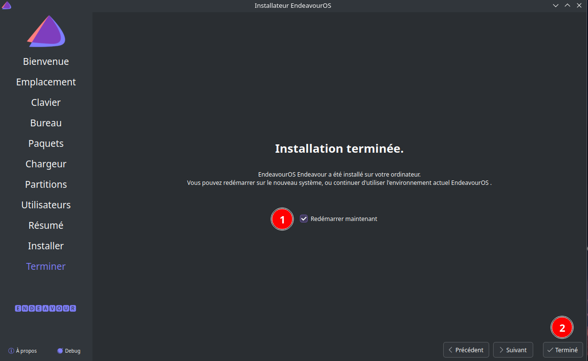{:width="600"}  
L'installation est terminée, cliquer "Redémarrer maintenant" et sur **Terminé**

### Créer nouveau système

`Clé USB Eos Live insérée, redémarrer dans l'environnement Live-Cd`{: .prompt-info }

`Clavier QWERTY!!!`{: .prompt-warning }  
Ouvrir un terminal  
Créer un accès sur la machine via SSH depuis un poste distant  
Lancer le service : `sudo systemctl start sshd`  
Ouvrir le port 22 firewall: `sudo firewall-cmd --zone=public --add-port=22/tcp --permanent`  
Créer un mot de passe à liveuser : `passwd liveuser` --> rtyuiop
Relever l'adresse ip de la machine : `ip a`

**Déchiffrer système temporaire**

Le système temporaire chiffré `/dev/sda3`

Dans l'environnement live-CD, ouvrez un Terminal ,basculez en mode su et tapez (ou marquez et copiez la ligne avec ctrl-c et collez dans le terminal avec shift-ctrl-v ) …

```shell
cryptsetup luksOpen /dev/sda3 crypttemp # saisir la phrase mot de passe de l'installation
mkdir -p /media/crypttemp
mount /dev/mapper/crypttemp /media/crypttemp 
```

Nos données d'installation temporaires sont désormais accessibles sous `/media/crypttemp`   

```
bin  boot  dev	efi  etc  home	lib  lib64  lost+found	mnt  opt  proc	root  run  sbin  srv  sys  tmp	usr  var
```

**Créer nouveau système**

Chiffrer la partition /dev/sda2,saisir la passphrase définitive

```shell
cryptsetup luksFormat --type luks2 /dev/sda2
```

Une demande de confirmation est exigée

```
WARNING!
========
This will overwrite data on /dev/sda2 irrevocably.

Are you sure? (Type 'yes' in capital letters): YES
Enter passphrase for /dev/sda2: 
Verify passphrase: 
```

Choisissez un mot de passe sécurisé ( <https://xkcd.com/936/> )

```shell
cryptsetup luksOpen /dev/sda2 crypt
    Enter passphrase for /dev/sda2:
pvcreate /dev/mapper/crypt
    Physical volume "/dev/mapper/crypt" successfully created.
vgcreate vg0 /dev/mapper/crypt
    Volume group "vg0" successfully created
```

Une bonne taille de départ pour le volume racine (lvroot) est d'environ 30 Go. Si vous envisagez d'utiliser ultérieurement un fichier d'échange résidant sur root, vous devez en tenir compte.  
Le redimensionnement ultérieur des volumes est assez facile, alors n'y réfléchissez pas trop.  
Vous pouvez attribuer tout l'espace libre restant au volume d'accueil,  
`lvcreate --extents 100%FREE vg0 -n lvhome`  
mais pour augmenter les volumes plus tard et pour les instantanés , il faut de l'espace vide à l'intérieur du groupe de volumes, donc je choisis généralement une taille pour lvhome qui laisse environ 30 Go d'espace inutilisé global dans le volume groupe (en supposant un lecteur de 500 Go, par exemple 500 – 0,512 – 40 – 430 = 29,488)

```shell
# 40G root dont 8 swapfile
lvcreate -L 40G vg0 -n lvroot   #  Logical volume "lvroot" created.
lvcreate -L 110G vg0 -n lvhome  #  Logical volume "lvhome" created.
#lvcreate -l 100%FREE vg0 -n lvhome  #  Logical volume "lvhome" created.
```

Créez un système de fichiers ext4 sur les volumes logiques.

```shell
mkfs.ext4 -L root /dev/mapper/vg0-lvroot
mkfs.ext4 -L home /dev/mapper/vg0-lvhome
```

### Montage sur "mnt"

Monter le nouveau système sur `/mnt` pour les systèmes UEFI

```shell
mount /dev/mapper/vg0-lvroot /mnt
mkdir -p /mnt/home
mount /dev/mapper/vg0-lvhome /mnt/home
mkdir -p /mnt/efi
mount /dev/sda1 /mnt/efi
```

```
lsblk
```

devrait maintenant fournir une sortie similaire à la suivante (ignorez les tailles, celles-ci proviennent d'une installation de test) …

pour les systèmes UEFI :

```
NAME             MAJ:MIN RM   SIZE RO TYPE  MOUNTPOINTS
loop0              7:0    0   1.7G  1 loop  /run/archiso/airootfs
sda                8:0    0 111.8G  0 disk  
├─sda1             8:1    0   550M  0 part  /mnt/efi
├─sda2             8:2    0   100G  0 part  
│ └─crypt        254:1    0   100G  0 crypt 
│   ├─vg0-lvroot 254:2    0    40G  0 lvm   /mnt
│   └─vg0-lvhome 254:3    0    60G  0 lvm   /mnt/home
└─sda3             8:3    0  11.3G  0 part  
  └─crypttemp    254:0    0  11.3G  0 crypt /media/crypttemp
```

### Cloner système temporaire

pour vider les nouveaux points de montage

```
rsync -avA /media/crypttemp/ /mnt
```

*Veuillez patienter quelques minutes*

### Démonter système temporaire

```shell
umount /media/crypttemp
cryptsetup luksClose crypttemp
```

### Configurer "crypttab"

Configuration `/etc/crypttab`

```
cryptsetup luksUUID /dev/sda2
```

renvoie **0b5f9165-989d-4211-9734-7303c9bd771b**  
Votre UUID sera différent, alors <u>**assurez-vous d'utiliser votre UUID à l'étape suivante !**</u>

```
nano /mnt/etc/crypttab
```

contient une ligne non commentée commençant par `luks-`...  
Remplacez cette ligne par la suivante ; <u>**n'oubliez pas d' utiliser votre UUID**</u>

```
cryptlvm UUID=0b5f9165-989d-4211-9734-7303c9bd771b     none luks
```

Sauvegarder et quitter.

### Basculer en chroot

Passer en chroot

```
arch-chroot /mnt
```

### Configurer "fstab"

Configurer /etc/fstab

```
blkid -s UUID -o value /dev/mapper/vg0-lvroot
```

renvoie l'UUID du volume racine :  **e2e8bb75-02b8-4cf9-aa76-b793e91c431c**.

```
blkid -s UUID -o value /dev/mapper/vg0-lvhome
```

renvoie l'UUID du volume d'accueil : **d8ae2ca4-2c2c-409a-9d49-243dcde32ec7**.

```
nano /etc/fstab
```

contient une ligne commençant par `/dev/mapper/luks-`...  
**Supprimez** cette ligne et ajoutez ce qui suit (<u>**n'oubliez pas d' utiliser vos UUID**</u>)

```
UUID=e2e8bb75-02b8-4cf9-aa76-b793e91c431c / ext4 noatime 0 0
UUID=d8ae2ca4-2c2c-409a-9d49-243dcde32ec7 /home ext4 noatime 0 0
```

Sauvegarder et quitter.

### Options du noyau


Dans **systemd-boot**, vous éditez le fichier d'entrée approprié qui se trouve sur votre partition EFI dans le répertoire `loader/entries`  
Chaque entrée est une option de démarrage dans le menu et chacune a une ligne appelée options. Vous pouvez modifier ces entrées directement, mais ces changements peuvent être écrasés lors de l'installation ou de la mise à jour de paquets.

UUID de /dev/sda2 : `blkid -s UUID -o value /dev/sda2`

Pour effectuer les changements, au lieu de modifier les entrées, modifiez le fichier `/etc/kernel/cmdline` qui est un fichier d'une ligne contenant une liste d'options du noyau.  

    nano /etc/kernel/cmdline

```
nvme_load=YES nowatchdog rw rd.luks.uuid=2c8e7bb4-9286-47e9-8823-12b79bf2810c root=/dev/mapper/vg0-lvroot
```

Exécutez ensuite `sudo reinstall-kernels` qui remplira les entrées et régénérera les initrds.

    reinstall-kernels

### Sortie chroot 

```
exit
umount -R /mnt
```

Oter la clé USB , redémarrer

```
reboot
```

`FINI! Vous devriez maintenant avoir un système LVMonLUKS fonctionnel avec un volume logique séparé pour /home`{: .prompt-info }

## EndeavourOS chiffré LVM/LUKS

### Premier démarrage

La partition est chiffrée  
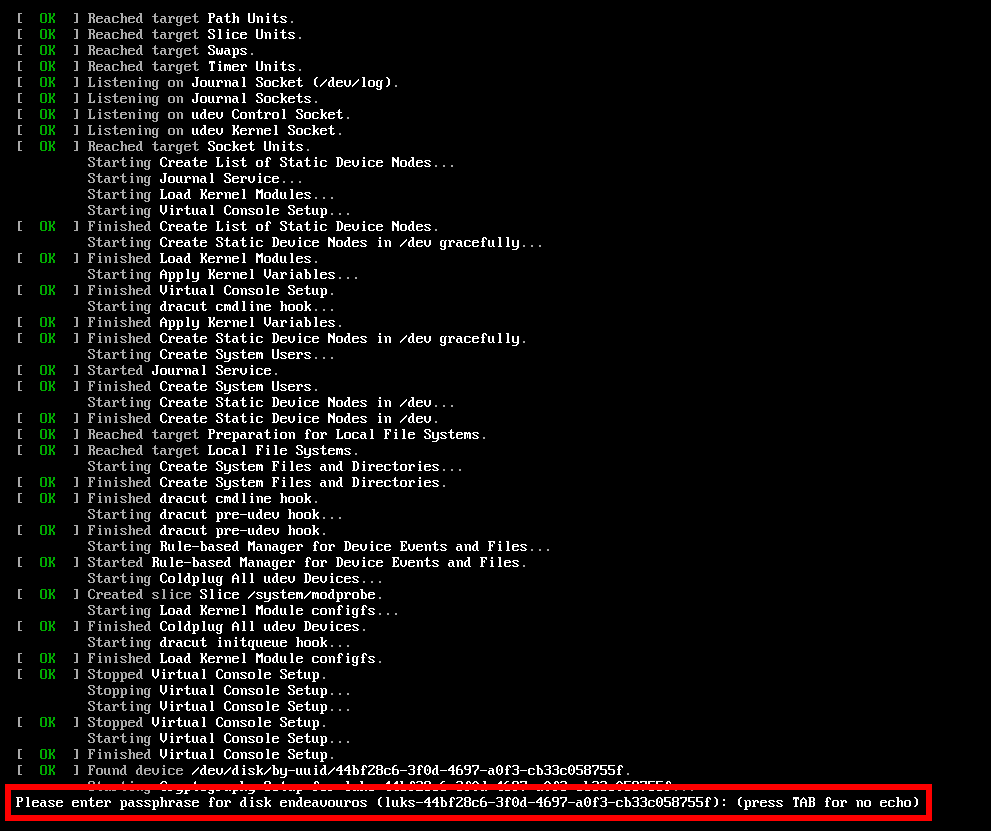  
Au message "Please enter passphrase for disk endeavouros...", saisir la phrase mot de passe pour déchiffrer le disque  
Sur la page de connexion utilisateur yano, saisir le mot de passe  

### Utilisateur droits sudo

Modifier sudoers pour accès sudo sans mot de passe à l'utilisateur **yano**  

```shell
su               # mot de passe root identique utilisateur
echo "yano     ALL=(ALL) NOPASSWD: ALL" >> /etc/sudoers.d/20-yano
```

`ATTENTION : Le clavier n'a pas de touche ">", il faut saisir le code Unicode : Ctrl+Shift+u003E`{: .prompt-warning }

### Mise à jour Système

Mode terminal 

    yay -Syu

Mode graphique  


Désactiver la veille écran   
Menu --> Paramètres --> Economiseur d'écran --> Onglet "Verrouiller l'écran" , désactiver

### Activation SSH avec clés

#### Etablir une liaison temporaire SSH

Pour un accès sur la machine via SSH depuis un poste distant  

1. Lancer et activer le service : `sudo systemctl enable sshd --now`  
2. Ouvrir le port 22 firewall: `sudo firewall-cmd --zone=public --add-port=22/tcp`  
3. Relever l'adresse ip de la machine : `ip a`  192\.168.0.21 dans notre cas

Se connecter depuis un poste distant `ssh yano@192.168.0.21`

#### SSH avec clés

**A - Poste appelant**  
Générer une paire de clé curve25519-sha256 (ECDH avec Curve25519 et SHA2) nommé **e6230** pour une liaison SSH avec le portable E6230.

```
ssh-keygen -t ed25519 -o -a 100 -f ~/.ssh/e6230
```

Envoyer les clés depuis le poste distant

```
ssh-copy-id -i ~/.ssh/e6230.pub yano@192.168.0.21
```

On se connecte sur la machine

    ssh yano@192.168.0.21

**B - Dell Latitude e6230**  
Modification fichier configuration ssh sur le dell e6230 pour le port

```
sudo nano /etc/ssh/sshd_config
```

```
Port 56230
PasswordAuthentication	no
```

`IL FAUT ACTIVER LE PORT 56230 EN ZONE "PUBLIC" DU PAREFEU !`{: .prompt-warning }

Ajouter le nouveau port à la zone configurée de firewalld ("public" par défaut).

```shell
sudo firewall-cmd --zone=public --add-port=56230/tcp --permanent
sudo systemctl restart firewalld
```

Redémarrer sshd

```bash
sudo systemctl restart sshd
```

Se connecter depuis le poste appelant

```
ssh yano@192.168.0.21 -p 56230 -i /home/yann/.ssh/e6230
```

Ouvrir un terminal

#### Motd

```bash
sudo nano /etc/motd
```

```text
  ___   ___  _     _                                  
 |   \ | __|| |   | |                                 
 | |) || _| | |__ | |__                               
 |___/ |___||____||____|                              
        __  ___  ____  __                             
  ___  / / |_  )|__ / /  \                            
 / -_)/ _ \ / /  |_ \| () |                           
 \___|\___//___||___/ \__/                            
  _  ___  ___     _   __  ___     _   __    ___   __  
 / |/ _ \|_  )   / | / / ( _ )   / | /  \  / _ \ /  \ 
 | |\_, / / /  _ | |/ _ \/ _ \ _ | || () |_\_, /| () |
 |_| /_/ /___|(_)|_|\___/\___/(_)|_| \__/(_)/_/  \__/ 
```

### Réseau wifi

*Le portable DELL est connecté sur le réseau filaire 192.168.0.0/24 pour l'installation*

Paramétrage wifi pour une utilisation sur un autre réseau 192.168.10.0/24  
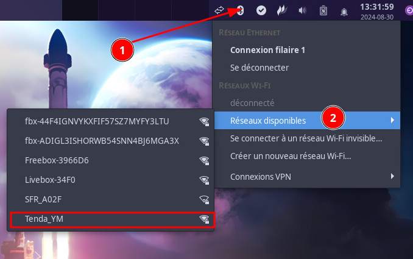{:width="400"}  
Adresse IP 192.168.10.90

### VNC

*Se connecter VNC via SSH sur IP 192.168.10.90*

**Portable DELL Latitude e6230**

installer x11vnc

```
yay -S x11vnc
```

Générer un mot de passe dans le dossier root

```shell
sudo -s
x11vnc -storepasswd "mot_de_passe" /root/.vnc_passwd
exit
```

*stored passwd in file: /root/.vnc_passwd*

Ajouter le nouveau port 5900 à la zone configurée de firewalld ("public" par défaut).

```shell
sudo firewall-cmd --zone=public --add-port=5900/tcp --permanent
sudo systemctl restart firewalld
```

Lancement manuel en console et en session utilisateur pour valider et enregistrer le mot de passe VNC

```shell
sudo x11vnc -xkb -noxrecord -noxfixes -noxdamage -display :0 -auth /var/run/lightdm/root/:0 -usepw
```

Saisir le mot de passe VNC 2 fois ( la seconde pour vérification) et répondre `y` pour écriture

```
Enter VNC password: 
Verify password:    
Write password to /root/.vnc/passwd?  [y]/n y
```

Résultat de la commande ci-dessus sur le terminal du portable DELL

```text
[...]
The VNC desktop is:      e6230:0
PORT=5900

******************************************************************************
Have you tried the x11vnc '-ncache' VNC client-side pixel caching feature yet?

The scheme stores pixel data offscreen on the VNC viewer side for faster
retrieval.  It should work with any VNC viewer.  Try it by running:

    x11vnc -ncache 10 ...

One can also add -ncache_cr for smooth 'copyrect' window motion.
More info: http://www.karlrunge.com/x11vnc/faq/#faq-client-caching
```

Arrêt par Ctrl+C

**Poste Appelant**

<u>Première fenêtre de terminal</u>

Tunnel SSH  
Utilisez le drapeau `-localhost` avec **x11vnc** pour qu’il se lie à l’interface locale.  
Une fois que c’est fait, vous pouvez utiliser SSH pour tunneliser le port ; puis, connectez-vous à VNC via SSH.

```shell
# SSH avec clés
ssh -f -L 5900:localhost:5900 -p 56230 -i ~/.ssh/e6230 yano@192.168.10.90 'sudo x11vnc -xkb -noxrecord -noxfixes -noxdamage -display :0 -auth /var/run/lightdm/root/:0 -usepw'
```

<u>Seconde fenêtre de terminal</u>  
Exécuter la commande suivante

```bash
vncviewer -PreferredEncoding=ZRLE localhost:0
```

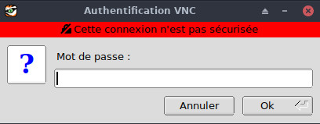{:width="200"}  
Saisir le mot de passe pour la connexion VNC

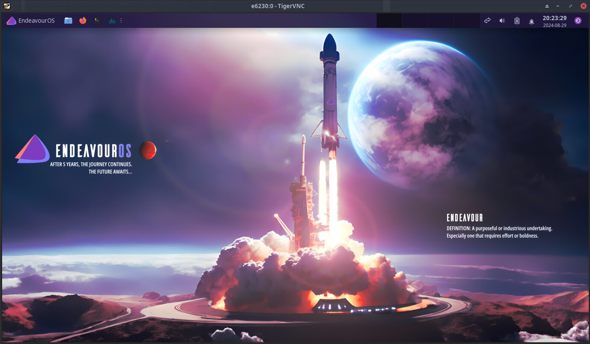{:width="600"}

Si le curseur est mal affiché, c’est possible de mettre l’option -cursor à la ligne de commande x11vnc
`Le programme écoute sur le port 9500. Il faut penser à ouvrir le parefeu du Latitude e6230 sur ce port en TCP`{: .prompt-info }

<u>Script - VNC via Tunnel SSH</u>

* Ouverture distant et redirection du port 5900 via tunnel ssh, reprise de la main (nohup)
* On mémorise le processus ssh (pidof)
* Lancement de vncviewer
* En sortie du viewer, on tue le processus ssh ... avec kill

  nano ~/scripts/vncdell.sh

```bash
#!/bin/bash

nohup ssh -f -L 5900:localhost:5900 -p 56230 -i ~/.ssh/e6230 yano@192.168.10.90 'sudo x11vnc -xkb -noxrecord -noxfixes -noxdamage -display :0 -auth /var/run/lightdm/root/:0 -usepw'
p=$(pidof -s ssh)
# tempo
echo "Patienter 5 secondes..."
sleep 5
vncviewer -PreferredEncoding=ZRLE localhost:0
kill $p
echo "FIN VNC"
 
exit 0
```

Droits en exécution

```
chmod +x ~/scripts/vncdell.sh
```

Au lancement du script

```
sh ~/scripts/vncdell.sh
```

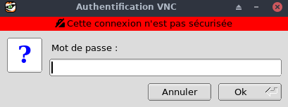{:width="200"}  
Saisir le mot de passe VNC

### Clé matérielle FIDO2

*Le déverrouillage se fait par saisie d'une phrase mot de passe, on peut ajouter des clés FIDO2 pour un déchiffrement sans mot de passe ([Using FIDO2 keys to unlock LUKS on EndeavourOS](https://forum.endeavouros.com/t/using-fido2-keys-to-unlock-luks-on-endeavouros/51111))*

#### Prérequis

Installer librairie libfido2 pour la prise en charge des clés Yubico et SoloKeys

```bash
sudo pacman -S libfido2
```

Vérifier que le disque chiffré est /dev/sda2 : `lsblk`

```
NAME                                          MAJ:MIN RM   SIZE RO TYPE  MOUNTPOINTS
sda                                             8:0    0 447,1G  0 disk  
├─sda1                                          8:1    0     1G  0 part  /efi
└─sda2                                          8:2    0 446,1G  0 part  
  └─luks-d603c182-2d04-4a31-bde6-512ac2d18e7b 254:0    0 446,1G  0 crypt /
```

Vérifier que le chiffrement est luks2 : `sudo cryptsetup luksDump /dev/sda2`

```
LUKS header information
Version:       	2
[...]
```

#### Enroler clé USB FIDO2 YubiKey 5 NFC

{:height="100"}  

Vérifier que la YubiKey est insérée dans un port USB

Lister la yubikey 

```bash
sudo systemd-cryptenroll --fido2-device=list
```

```text
PATH         MANUFACTURER PRODUCT              
/dev/hidraw4 Yubico       YubiKey OTP+FIDO+CCID
```

Clé yubikey "24 554 586" pour le déverrouillage du disque chiffré /dev/sda2**

```
sudo systemd-cryptenroll --fido2-device=auto /dev/sda2
```

Résulat de la commande précédente

```
🔐 Please enter current passphrase for disk /dev/sda2: *********************   
Requested to lock with PIN, but FIDO2 device /dev/hidraw4 does not support it, disabling.
Initializing FIDO2 credential on security token.
👆 (Hint: This might require confirmation of user presence on security token.)
Generating secret key on FIDO2 security token.
👆 In order to allow secret key generation, please confirm presence on security token.
New FIDO2 token enrolled as key slot 1.
```

Le **Y** de la clé se met à clignoter , il suffit de poser son doigt sur l'emplacement du **Y** pour le déverrouillage
{: .prompt-info }

Si vous avez plusieurs clés répéter l'opération **Enroler clé USB FIDO2 YubiKey 5 NFC**

Nous avons ajouté 3 clés yubikey FIDO2

1. yubikey "24 554 586"
2. yubikey "29 085 988"
3. yubikey "24 554 581"

#### Prise en charge FIDO2 (crypttab)

Le fichier `/etc/crypttab` contient la liste des périphériques à déverrouiller automatiquement.  
Chaque ligne du fichier crypttab est de la forme :  
`<target name> <source device> <key file> <options>`

* `<target name>` : Nom à donner au mappage (/dev/mapper/name), dans le cas présent "secret"
* `<source device>` : l'identifiant du container luks, sous la forme UUID=
* `<key file>` : chemin absolu vers le ficher de phrase de passe. Si le déverrouillage doit s'effectuer par saisie d'un mot de passe, indiquer "none"
* `<options>` : liste d'options séparées par des virgules, par exemple luks, discard pour un chiffrage luks et autoriser l'utilisation de la commane fstrim ou discard au niveau du container. L'option keyscript= donne la possibilité d'exécuter un script ou une commande avec le chemin vers le fichier de passe de phrase (paramètre password précédent) fourni comme argument.

`/etc/crypttab` avant modification

```
# <name>               <device>                         <password> <options>
luks-c3f9cc28-3bb6-4c96-a86b-22a659c37ecc UUID=c3f9cc28-3bb6-4c96-a86b-22a659c37ecc     none luks
```

Modifier `/etc/crypttab` pour la prise en chrrge FIDO2 en ajoutant `fido2-device=auto`  

```bash
sudo nano /etc/crypttab
```

La quatrième colonne **luks** est remplacée par **luks,fido2-device=auto**

```
# <name>               <device>                         <password> <options>
luks-c3f9cc28-3bb6-4c96-a86b-22a659c37ecc UUID=c3f9cc28-3bb6-4c96-a86b-22a659c37ecc     none luks,fido2-device=auto
```

Sauvegarder et quitter.

Réinitialiser le noyau

```
sudo reinstall-kernels
```

`Redémarrer la machine`{: .prompt-info }

#### Outil systemd-cryptenroll

**[systemd-cryptenroll](https://wiki.archlinux.org/title/Systemd-cryptenroll)**  
systemd-cryptenroll est un outil permettant d'enregistrer des jetons de sécurité matériels et des périphériques dans un volume crypté LUKS2, qui peuvent ensuite être utilisés pour déverrouiller le volume pendant le démarrage.  
systemd-cryptenroll permet d'enregistrer des cartes à puce, des jetons FIDO2 et des puces de sécurité Trusted Platform Module dans des périphériques LUKS, ainsi que des phrases de passe ordinaires. Ces périphériques sont ensuite déverrouillés par `systemd-cryptsetup@.service` à l'aide des jetons enregistrés. 

systemd-cryptenroll peut lister les keyslots d'un périphérique LUKS, de manière similaire à `cryptsetup luksDump`, mais dans un format plus convivial. 

    sudo systemd-cryptenroll /dev/sda2

Résultat pour disque déchiffrable avec une phrase et 3 clés FIDO2

```
SLOT TYPE    
   0 password
   1 fido2       yubikey "24 554 586"
   2 fido2       yubikey "29 085 988"
   3 fido2       yubikey "24 554 581"
```

#### Clé USB SoloKeys FIDO2 (OPTION)

{:height="100"}

Lister la clé

```
systemd-cryptenroll --fido2-device=list
```

```
PATH         MANUFACTURER PRODUCT   
/dev/hidraw1 SoloKeys     Solo 4.1.5
```

Ajout de la solokeys

```
sudo systemd-cryptenroll --fido2-device=auto /dev/sda2
```

```
🔐 Please enter current passphrase for disk /dev/sda2: ***********             
Requested to lock with PIN, but FIDO2 device /dev/hidraw1 does not support it, disabling.
Initializing FIDO2 credential on security token.
👆 (Hint: This might require confirmation of user presence on security token.)
Generating secret key on FIDO2 security token.
👆 In order to allow secret key generation, please confirm presence on security token.
New FIDO2 token enrolled as key slot 3.
```

Lors du boot , le **S** de la SoloKeys passe au ROUGE et il suffit d'appuyer sur le voyant pour qu'il repasse  au vert afin de lancer le processus de déchiffrement et finir le démarrage
{: .prompt-info }

### Passphrase de recouvrement (OPTION)

Les jetons et puces de sécurité FIDO2, PKCS#11 et TPM2 s'associent bien avec les clés de recouvrement : puisque vous n'avez plus besoin de taper votre mot de passe tous les jours, il est logique de vous en débarrasser et d'enregistrer à la place une clé de recouvrement à forte entropie que vous imprimez ou scannez hors écran et conservez dans un endroit physique sûr.  
Voici comment procéder :

```
sudo systemd-cryptenroll --recovery-key /dev/sda2
```

```
🔐 Please enter current passphrase for disk /dev/nvme0n1p2: ***********             
A secret recovery key has been generated for this volume:

    🔐 vbcrnbjn-vkrkihte-rctbufne-nlihihjl-tegudteu-rkjthcgd-hvhuvgik-rugeregh

Please save this secret recovery key at a secure location. It may be used to
regain access to the volume if the other configured access credentials have
been lost or forgotten. The recovery key may be entered in place of a password
whenever authentication is requested.
New recovery key enrolled as key slot 3.
```

Cette opération génère une clé, l'enregistre dans le volume LUKS2, l'affiche à l'écran et génère un code QR que vous pouvez scanner en dehors de l'écran si vous le souhaitez.  
La clé possède la plus grande entropie et peut être saisie partout où vous pouvez saisir une phrase d'authentification.  
C'est pourquoi il n'est pas nécessaire de modifier le fichier /etc/crypttab pour que la clé de récupération fonctionne.

### Historique ligne de commande  

Ajoutez la recherche d’historique de la ligne de commande au terminal  
Se connecter en utilisateur  
Tapez un début de commande précédent, puis utilisez shift + up (flèche haut) pour rechercher l’historique filtré avec le début de la commande.

```shell
# Global, tout utilisateur
echo '"\e[1;2A": history-search-backward' | sudo tee -a /etc/inputrc
echo '"\e[1;2B": history-search-forward' | sudo tee -a /etc/inputrc
```

### Créer les dossiers "utilisateur"

Créer les dossiers `.keepassx` , `Notes` , `scripts` `statique/images` et `statique/_posts`

```bash
mkdir -p ~/{.ssh,.keepassx,scripts,media}
mkdir -p ~/media/statique/{images,_posts}
mkdir -p ~/media/Documents/Dossiers-Locaux-Thunderbird
mkdir -p ~/media/Notes
# Lien pour affichage des images avec éditeur Retext
sudo ln -s /home/yano/media/statique/images /images
# Lien /srv/media
sudo chown $USER:$USER /srv
sudo ln -s $HOME/media /srv/media
```

### Partages réseau 

**A - NFS Client**  
{:width="80"}  
Installez le paquetage du client NFS

    sudo pacman -S nfs-utils    # archlinux

Le dossier cible

    /home/yano/sharenfs

Montage `/etc/fstab`

```
# Serveur debian 12 cwwk 192.168.0.205
192.168.0.205:/sharenfs	/home/yano/sharenfs nfs4 nofail,x-systemd.automount,x-systemd.requires=network-online.target,x-systemd.device-timeout=10s,rsize=8192,wsize=8192 0 0
```

Rechargement et montage

    sudo systemctl daemon-reload
    sudo mount -a

**B - SSHFS (NON UTILISE)**

*On utiliser SSHFS le portable DELL n'est pas toujours sur le réseau local* 

{:width="50"}  
*SSHFS sert à monter sur son système de fichier, un autre système de fichier distant, à travers une connexion SSH, le tout avec des droits utilisateur.*

Créer une connexion ssh entre la machine portable DELL Latitude e6230 et le serveur cwwk rnmkcy.eu

Créer le jeu de clés sur le portable DELL

    ssh-keygen -t ed25519 -o -a 100 -f ~/.ssh/cwwk-rnmkcy.eu

Ajouter le contenu de la clé publique `~/.ssh/cwwk-rnmkcy.eu.pub` au fichier `authorized_keys` du serveur cwwk (82.64.18.243)  

```
ssh-ed25519 AAAAC3NzaC1lZDI1NTE5AAAAIPxU9Kt0mVwftbt23M02kKWYuapoblvLBAkvIt6qCYIM yano@e6230
```

Tester la connexion SSH depuis le portable DELL port 55215

    ssh -p 55205 -i ~/.ssh/cwwk-rnmkcy.eu yick@rnmkcy.eu

Installer sshfs sur le portable DELL

```bash
sudo pacman -S sshfs   # archlinux
```

Exemple de montage manuel  
`sshfs -oIdentityFile=<clé privée> utilisateur@domaine.tld:<dossier distant> <dossier local> -C -p <port si dfférent de 22>`

Partage du dossier /sharenfs serveur cwwk avec ~/sharenfs machine DELL  
Créer le point de montage local

    mkdir ~/sharenfs

<u>Accès utilisateur sécurisé</u>  
Lors du montage automatique via fstab, le système de fichiers sera généralement monté par root. Par défaut, cela produit des résultats indésirables si vous souhaitez accéder en tant qu'utilisateur ordinaire et limiter l'accès aux autres utilisateurs.Ajouter la ligne suivante au fichier `/etc/fstab`

```
yick@rnmkcy.eu:/sharenfs /home/yano/sharenfs fuse.sshfs _netdev,user,idmap=user,follow_symlinks,identityfile=/home/yano/.ssh/cwwk-rnmkcy.eu,port=55205,allow_other,default_permissions,uid=1000,gid=1000 0 0
```

Recharger les daemons

    sudo systemctl daemon-reload

Si vous voulez qu'ils soient montés uniquement lors de l'accès, vous devrez utiliser les paramètres `noauto,x-systemd.automount`  
De plus, vous pouvez utiliser l'option x-systemd.mount-timeout= pour spécifier combien de temps systemd doit attendre la fin de la commande de montage. Enfin, l'option _netdev garantit que systemd comprend que le montage dépend du réseau et le commande une fois que le réseau est en ligne.  
`noauto,x-systemd.automount,x-systemd.mount-timeout=30,_netdev`

Lancer le montage en mode vue pour valider la clé SSH  
ATTENTION : les paramètres **noauto,x-systemd.automount** ne doivent pas être utilisés pour cette opération

    sudo mount -av

```
/efi                      : déjà monté
/                         : ignoré
/tmp                      : déjà monté
The authenticity of host '[rnmkcy.eu]:55215 ([82.64.18.243]:55215)' can't be established.
ED25519 key fingerprint is SHA256:UXJCYtFENT8AKvmNe5TugLM1mXDdIcSOQ3o3oeAxd5I.
This key is not known by any other names.
Are you sure you want to continue connecting (yes/no/[fingerprint])? yes
Warning: Permanently added '[rnmkcy.eu]:55215' (ED25519) to the list of known hosts.
/home/yano/sharenfs      : successfully mounted
```

Le fichier `/etc/fstab` après validation de la clé

```
leno@rnmkcy.eu:/sharenfs /home/yano/sharenfs fuse.sshfs noauto,x-systemd.automount,_netdev,user,idmap=user,follow_symlinks,identityfile=/home/yano/.ssh/cwwk-rnmkcy.eu,port=55215,allow_other,default_permissions,uid=1000,gid=1000 0 0
```

### Plymouth

*[Plymouth - Processus de démarrage graphique](/posts/Plymouth_Processus_de_demarrage_graphique/)*

Installation

    yay -S plymouth plymouth-theme-endeavouros

Modifier image du thème endeavouros  

```bash
sudo cp /usr/share/plymouth/themes/endeavouros/wallpaper.png /usr/share/plymouth/themes/endeavouros/wallpaper_sav.png
sudo cp sharenfs/e6230/eos_theme_plymouth/wallpaper.png /usr/share/plymouth/themes/endeavouros/
```

Ajout splash au fichier `/etc/kernel/cmdline`  

    nvme_load=YES nowatchdog splash rw rd.luks.uuid=c3f9cc28-3bb6...

Prise en compte

    sudo reinstall-kernels

### Paramètres XFCE

On déplace le **tableau de bord** du bas vers le haut de l'écran  

* Affichage date et heure  
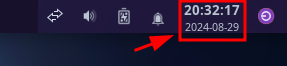  
ou **format personnalisé** dans **Horloge** : `%e %b %Y %R`
* Gestionnaire d'alimentation (Batterie et Branché)  
* Paramètres --> Gestionnaire de paramètres --> Gestionnaire d'alimentation  
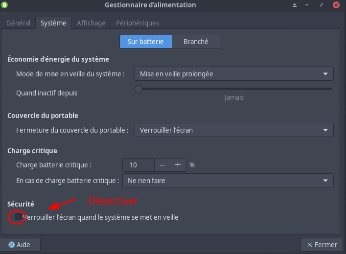{:width="400"}  
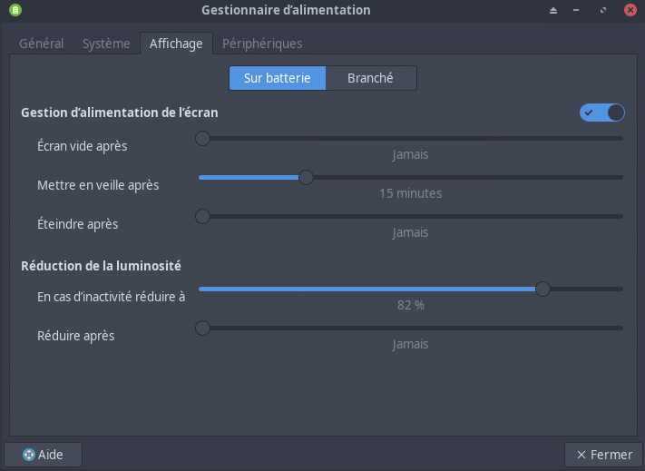{:width="400"}  
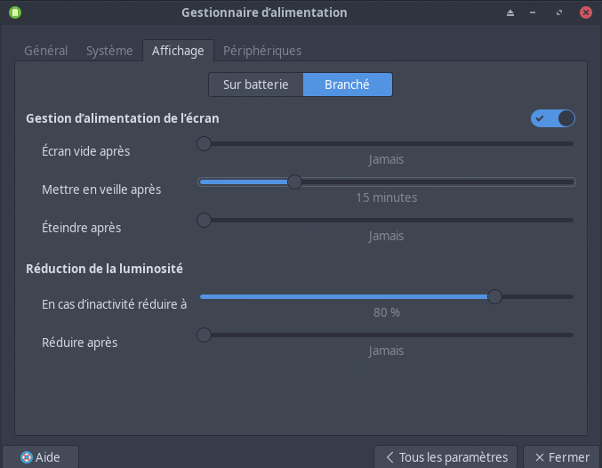{:width="400"}  
* Economiseur d'écran de Xfce  
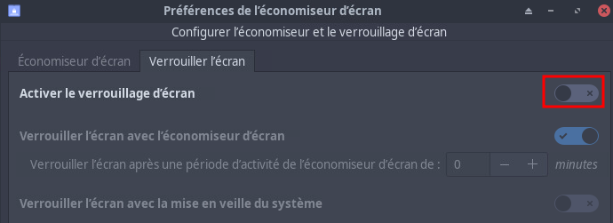{:width="400"}  

### Ecran bureau et connexion

#### Ecran bureau

Les fonds d'écran (1366x768) --> 
`/usr/share/endeavouros/backgrounds/`

    sudo cp sharenfs/e6230/Fonds/earth_planet_eclipse_yano_1366x768.jpg /usr/share/endeavouros/backgrounds/

Clic droit sur le bureau   
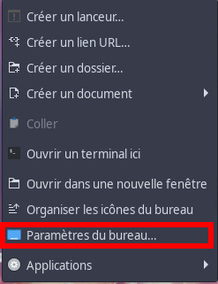{:height="200"}  
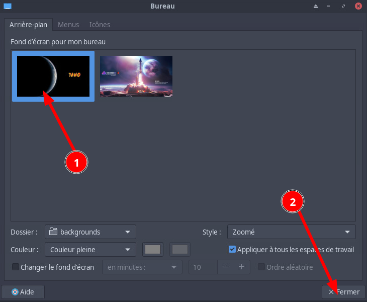{:width="400"}  

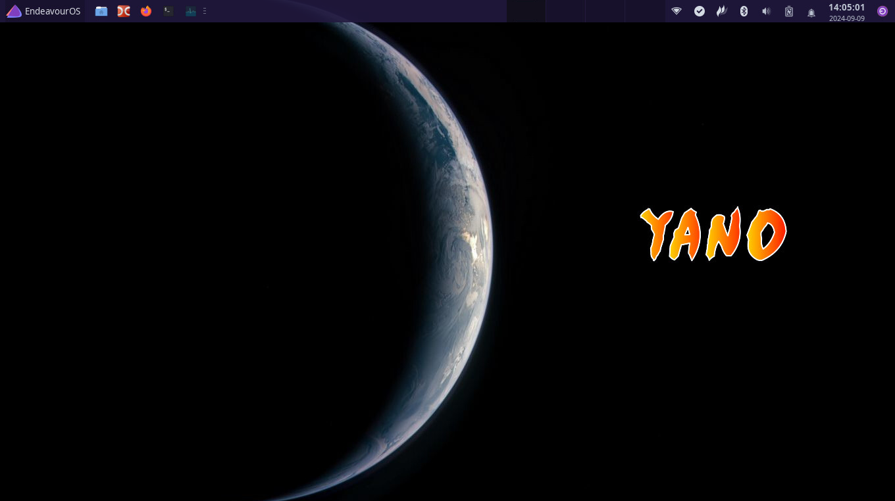{:width="600"}  

#### Ecran de connexion

Utilise `lightdm-slick-greeter` Un greeter basé sur GTK plus axé sur l’apparence que `lightdm-gtk-greeter`

Nouvelle image

    sudo cp sharenfs/e6230/Fonds/wallpaper_sav.png /usr/share/endeavouros/backgrounds/endeavouros-wallpaper.png

Les paramètres sont dans le fichier `/etc/lightdm/slick-greeter.conf`

```
[Greeter]
background=/usr/share/endeavouros/backgrounds/endeavouros-wallpaper.png
draw-user-backgrounds=false
draw-grid=true
theme-name=Arc-Dark
icon-theme-name=Qogir
cursor-theme-name=Qogir
cursor-theme-size=16
show-a11y=false
show-power=false
background-color=#000000
```

Si vous changez l’image de fond, il désactiver draw-grid

```
draw-grid=false
```

Page de connexion  
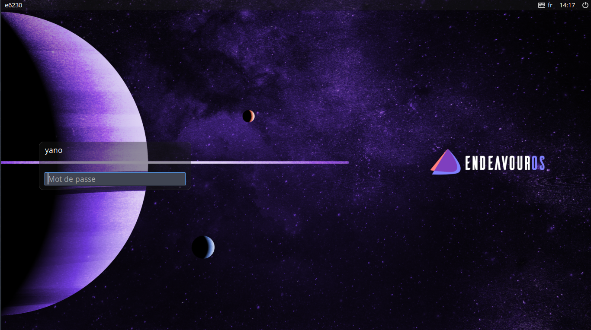{:width="600"}  

## Bluetooth

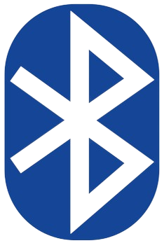{:height="50"}  

### Activer Bluetooth

Bluetooth n'est pas actif par défaut, en raison de plusieurs risques de sécurité et pour éviter une consommation d'énergie inutile.

Les packages nécessaires sont installés par défaut, mais ils sont dans leur état désactivé par défaut.

Pour pouvoir utiliser Bluetooth, vous devez démarrer le service ou l'activer si vous avez besoin que Bluetooth soit exécuté à chaque démarrage :

```bash
sudo systemctl start bluetooth  # pour le démarrer pour la session restera désactivé après le redémarrage.
sudo systemctl enable bluetooth --now # à activer par défaut, s'exécutera après chaque démarrage.
```

### Souris Bluetooth Pebble

**Souris Bluetooth Pebble Mouse 2 M350s**  
Basculez entre 3 de vos dispositifs d'une simple pression sur le bouton Easy-Switch.  
Position 1 pour le portable DELL latitude e6230  
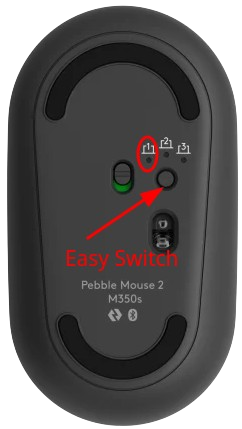{:height="400"}  
*Pour effacer une configuration existante de la souris bluetooth , garder enfoncer le bouton Easy-Switch jusqu'au clignotement rapide de la led*

Pour ajouter la souris bluetooth au portable DELL, clic droit sur l'icône bluetooth de la barre des tâches, Périphériques puis Rechercher et lorsque l'appareil est détecté , il faut l'appairer  
{:width="300"}   
{:width="300"}   

### Ecouteurs bluetooth

  
Soundcore Liberty Air 2  
[Test des Anker Soundcore Liberty Air 2](https://www.cnetfrance.fr/produits/test-anker-soundcore-liberty-air-2-39895873.htm)

Utiliser le gestionnaire bluetooth et la recherche  
{:width="400"}  

Lorsque le périphérique est détecté, il faut l'appairer, clic-droit --> Appairer  
Après appairage  
{:width="400"}  

`Pour que le périphèrique fonctionne correctement, il est IMPERATIF de redémarrer la machine`{: .prompt-info }

Après redémarrage, il faut séléctionner le profil audio  
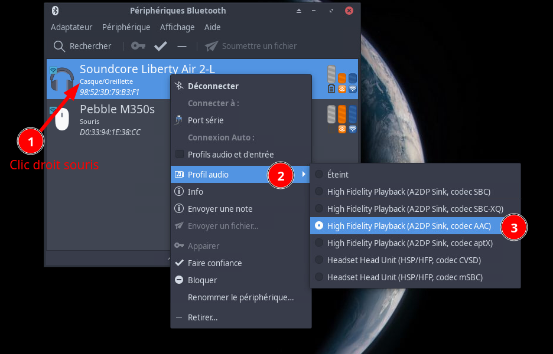{:width="500"}  

## Applications

### Client Nextcloud

{:width="80"}

Installation client nextcloud

```
yay -S nextcloud-client libgnome-keyring gnome-keyring  
```

Démarrer le client nextcloud , après avoir renseigné l'url <https://cloud.rnmkcy.eu> ,login et mot de passe pour la connexion

Trousseau de clé avec mot de passe idem connexion utilisateur

Paramétrage

* Menu → Lancer **Client de synchronisation nextcloud**
* Adresse du serveur : <https://cloud.xoyaz.xyz>  
  Se connecter avec un **mot de passe application nextcloud "Synchro DELL e6230"**
* Nom d’utilisateur : yann
* Mot de passe : xxxxx  
  {:width="300"}  
  Puis saisir l'adresse : https://cloud.rnmkcy.eu  
  Le nagigateur s'ouvre sur l'adresse saisie   
  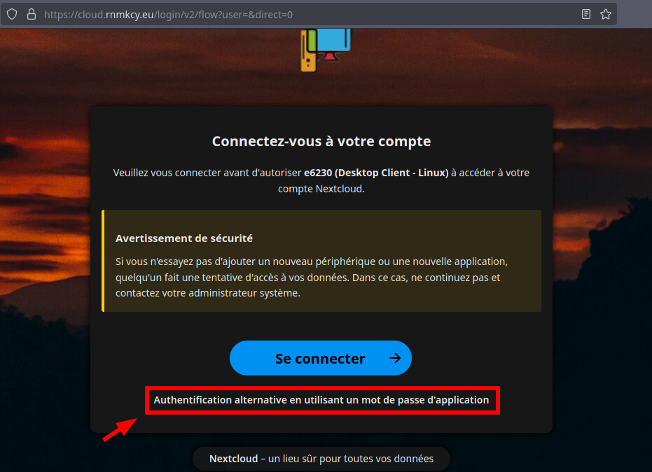{:width="500"}  
  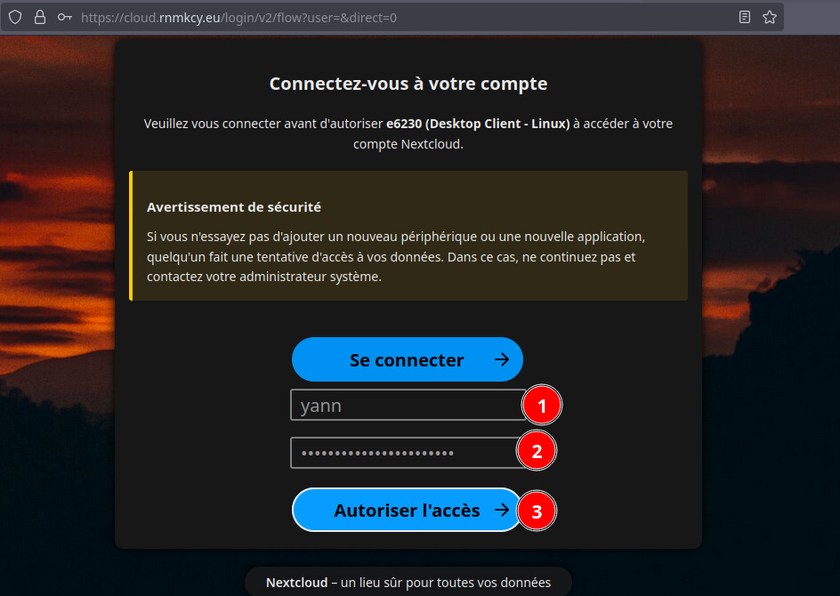{:width="500"}  
  {:width="500"}    
* Sauter les dossiers à synchroniser, Ignorer la configuration des dossiers
  {:width="400"}  
* Trousseau de clés = mot de passe connexion utilisateur  
  {:width="400"}
* Paramètres nextcloud  
  {:width="400"}

Saisir les différents dossiers à synhroniser  
{:width="400"}

Au prochain redémarrage, il faudra confirmer le mot de passe du trousseau   
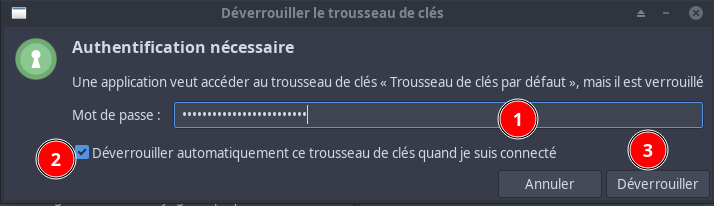{:width="400"}

**Pour modifier le mot de passe du trousseau (OPTION)**  
Installer seahorse : `yay -S seahorse`  
Lancer "Mots de passe et clés", faites un clic droit sur votre trousseau de clés par défaut et choisissez Changer de mot de passe.  
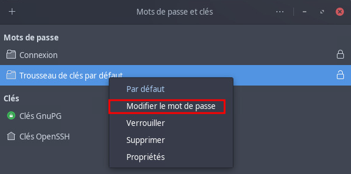{:width="300"}  
Vous devrez d'abord saisir votre ancien mot de passe. Ensuite, vous devrez saisir deux fois votre nouveau mot de passe et valider.  

### Mot de passe (KeePassXC)

{:height="50"}  
*On utilise une clé matérielle pour déverrouiller la base de mot de passe*

`La clé matériel utilisée pour la connexion doit être insérée`{: .prompt-tip }

Installer le gestionnaire de mot de passe **keepassxc**

```bash
yay -S keepassxc
```

Ouvrir "KeePassXC" --> Affichage  
**Affichage → Thème** : Sombre  
**Affichage → Mode compact**  , un redémarrage de l'application est nécessaire

Ajouter aux favoris "KeePassXC" et ouvrir l'application  
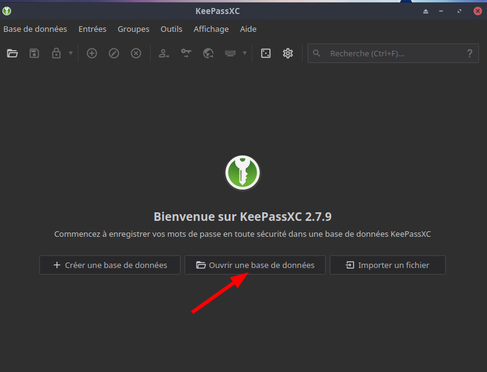{:width="400"}  
Base de données --> Ouvrir une base de données (afficher les fichiers cachés) : **~/.keepassx/yannick_xc.kdbx** --> Ouvrir  
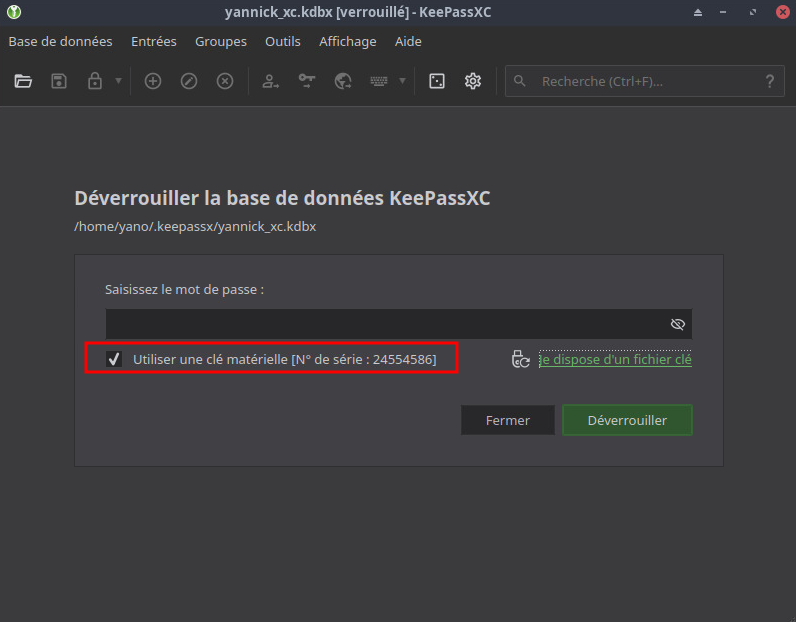{:width="400"}

### Double Commander

{:height="50"}  
*Double Commander est un gestionnaire de fichiers open source multiplateforme avec deux panneaux côte à côte. Il s'inspire de Total Commander*

Application GTK 

```bash
yay -S doublecmd-gtk2
```

Ajouter l'application aux favoris  
Les paramètres sont stockés dans le dossier `~/.config/doublecmd/`

### Minicom

Installation

    yay -S minicom

Paramétrage de l'application terminale **minicom**

```
sudo minicom -s
```

> Seul les paramètres à modifier sont cités

Configuration du port série  
  
A -                             Port série : **/dev/ttyUSB0**  
F -              Contrôle de flux matériel : **Non**  
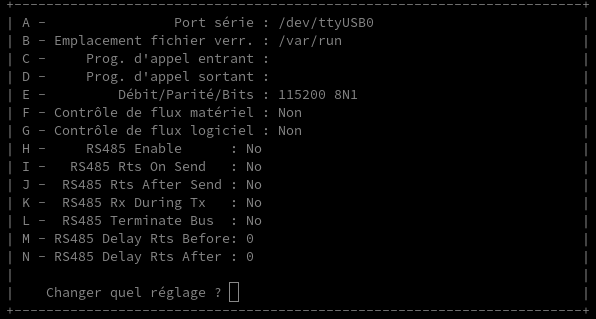  
Echap  
Enregistrer config. sous dfl  
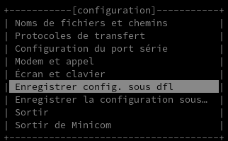  
Sortir de Minicom

### Flameshot (copie écran)

**Copie écran (flameshot)**  
[**Flameshot**](https://github.com/lupoDharkael/flameshot) c’est un peu THE TOOL pour faire des captures d’écrans

```
yay -S flameshot
```

Lancer l'application XFCE Flameshot et l'icône est visible dans la barre des tâches  
{:width="300"}

Paramétrage de flameshot, clic droit sur icône , Configuration  
{:width="300"}  
Paramétrage de flameshot  
{:width="400"}
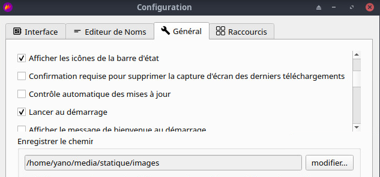{:width="400"}  

### scrpy émulation android

Utilise adb et le port USB

```
yay -S scrcpy
```

*Les icônes pour lancer l'application sont générés à l'installation*

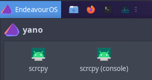{:width="300"}  

### Paquets supplémentaires

Lancer la commande

```bash
yay -S gimp libreoffice-fresh-fr jq figlet p7zip tmux calibre retext bluefish terminator filezilla zenity borg android-tools yt-dlp xclip nmap tigervnc xournalpp

# qrencode zbar qbittorrent  gedit 
```

Autre

```
yay -S menulibre
```

### Ntfy notification

[Ntfy service de notification](/posts/Ntfy/)

```bash
# Téléchargement
wget https://github.com/binwiederhier/ntfy/releases/download/v2.11.0/ntfy_2.11.0_linux_amd64.tar.gz
# Décompresser
tar xzvf ntfy_2.11.0_linux_amd64.tar.gz
# copier binaire
sudo cp ntfy_2.11.0_linux_amd64/ntfy /usr/local/bin/
# utilisateur ntfy
sudo useradd -r ntfy
# modifier les droits
sudo chown ntfy:ntfy /usr/local/bin/ntfy
```

### BorgBackup

{:height="60"}  
[Borg - Laptop Dell e6230](/posts/BorgBackup_vers-Boite_de_stockage/#borg---laptop-dell-e6230)

Résumé des opérations

1. Créer une clé SSH pour l’authentification borg
2. Ajouter clé publique `/root/.ssh/id_borg_ed25519.pub` au fichier authorized_keys de la boîte de stockage
3. Tester la connexion ssh à la boite de stockage
4. Créer le bash `/root/.borg/borg-backup.sh` et le rendre exécutable `chmod +x`
5. Exécution script au boot après 3 min `/etc/systemd/system/run-script-with-delay.service` et `/etc/systemd/system/run-script-with-delay.timer`
 


Passphrase et dépôt (en mode su)

```bash
mkdir -p /root/.borg
# ajout phrase
cat /home/yano/sharenfs/pc1/.borg/e6230.passphrase > /root/.borg/e6230.passphrase
# ajout dépôt
cat /home/yano/sharenfs/pc1/.borg/e6230.repository > /root/.borg/e6230.repository
```

Initialisation dépôt distant

```bash
export BORG_PASSPHRASE="$(cat /root/.borg/e6230.passphrase)"
export BORG_RSH='ssh -i /root/.ssh/id_borg_ed25519'
BORG_REPOSITORY="$(cat /root/.borg/e6230.repository)"
borg init --encryption=repokey $BORG_REPOSITORY
```

Le résultat de la commande

```
IMPORTANT: you will need both KEY AND PASSPHRASE to access this repo!

Key storage location depends on the mode:
- repokey modes: key is stored in the repository directory.
- keyfile modes: key is stored in the home directory of this user.

For any mode, you should:
1. Export the borg key and store the result at a safe place:
   borg key export           REPOSITORY encrypted-key-backup
   borg key export --paper   REPOSITORY encrypted-key-backup.txt
   borg key export --qr/ REPOSITORY encrypted-key-backup/
2. Write down the borg key passphrase and store it at safe place.
```

Le fichier d'exclusion `/root/.borg/exclusions`

```text
/proc
/sys
/dev
/media
/mnt
/cdrom
/tmp
/run
/var/tmp
/var/run
/var/cache
lost+found
/home/yano/.cache
/home/yano/.keepassx
/home/yano/Téléchargements
/home/yano/Musique
/home/yano/Vidéos
/home/yano/media
/home/yano/scripts
/home/yano/sharenfs
```

Lancer la première sauvegarde (en mode su), lancer `tmux`

```
# exécuter script borgbackup
/root/.borg/borg-backup.sh
# sortie tmux : ctrl+b puis d
# retour tmux : tmux a
```

Lister les sauvegardes borgbackup `~/borg-e6230.sh`

```bash
#!/bin/bash

echo "Liste des sauvegardes borgbackup"
export BORG_RSH='ssh -i /home/yano/sharenfs/pc1/.borg/e6230.borgssh'
export BORG_PASSPHRASE=`(cat /home/yano/sharenfs/pc1/.borg/e6230.passphrase)`
export BORG_RELOCATED_REPO_ACCESS_IS_OK=yes
echo "borg list --short `(cat /home/yano/sharenfs/pc1/.borg/e6230.repository)`"
echo "Veuillez patitenter quelques instants..."
borg list --short `(cat /home/yano/sharenfs/pc1/.borg/e6230.repository)`
```

Le rendre exécutable: `chmod +x ~/borg-e6230.sh` puis exécution `./borg-e6230.sh`  
Résultat  

```
Liste des sauvegardes borgbackup
borg list --short ssh://u326239@u326239.your-storagebox.de:23/./backup/borg/e6230
Veuillez patitenter quelques instants...
2024-09-09-14h58
2024-09-10-15h28
```

[Exécution script au boot après 3 min](/posts/BorgBackup_vers-Boite_de_stockage/#exécution-script-au-boot-après-3-min)

## Vpn 

Pour éviter les messages d'avertissements de NetworkManage en utilisation VPN, on passe au niveau erreur sur les messages. Ajouter ce qui suit au fichier `/etc/NetworkManager/NetworkManager.conf`

```
[logging]
level=ERR
domains=ALL
```

Redémarrer le service réseau

    sudo systemctl restart Networkmanager

### NordVPN

[NordVPN fournisseur de services de réseau privé virtuel (VPN)](/posts/NordVPN/)

### Mullvad

Installation

    yay -S mullvad-vpn-bin

Paramétrage et utilisation voir documentation : *[Utilisation application VPN Mullvad](/doc/Utilisation application VPN Mullvad/)*

## Maintenance

### Lecteur carte à puce + NFC

*comment configurer votre système pour utiliser un lecteur de carte à puce*

Installez ccid et opensc à partir des référentiels officiels

```bash
sudo pacman -S ccid opensc
```

Si le lecteur de carte ne dispose pas d'un clavier NIP, définissez `enable_pinpad = false` dans le fichier de configuration opensc **/etc/opensc.conf**

Démarrer le service pcscd.service

```bash
sudo systemctl start pcscd.service # démarrer
```

> **Conseil**: Si vous obtenez le `Failed to start pcscd.service: Unit pcscd.socket not found`. erreur `Failed to start pcscd.service: Unit pcscd.socket not found`. , rechargez simplement les unités systemd avec cette commande `systemctl daemon-reload`

Status

```bash
sudo systemctl status pcscd.service 
```

```
● pcscd.service - PC/SC Smart Card Daemon
     Loaded: loaded (/usr/lib/systemd/system/pcscd.service; indirect; preset: disabled)
     Active: active (running) since Fri 2023-05-12 18:24:39 CEST; 10s ago
TriggeredBy: ● pcscd.socket
       Docs: man:pcscd(8)
   Main PID: 2386 (pcscd)
      Tasks: 6 (limit: 19046)
     Memory: 1.4M
        CPU: 61ms
     CGroup: /system.slice/pcscd.service
             └─2386 /usr/bin/pcscd --foreground --auto-exit

mai 12 18:24:39 e6230 systemd[1]: Started PC/SC Smart Card Daemon.
```

lecteur de carte `pcsc-tools`

```bash
sudo pacman -S pcsc-tools
```

et lancez l’utilitaire `pcsc_scan` , puis (connectez le lecteur de carte à puce si non interne) insérez une carte. Si vous voyez une sortie comme celle-ci, le lecteur de carte à puce ainsi que la carte ont été reconnus avec succès.

```
Mon Jul 29 14:43:50 2019
 Reader 0: Broadcom Corp 5880 [Contacted SmartCard] (0123456789ABCD) 00 00
  Event number: 2
  Card state: Card inserted, 
  ATR: 3B DA 18 FF 81 B1 FE 75 1F 03 00 31 C5 73 C0 01 40 00 90 00 0C

[...]
Possibly identified card (using /usr/share/pcsc/smartcard_list.txt):
3B DA 18 FF 81 B1 FE 75 1F 03 00 31 C5 73 C0 01 40 00 90 00 0C
	OpenPGP Card V2
```

Activer le service pcscd.service

```bash
sudo systemctl enable pcscd.service # activer
```

Vérifier également la lecture NFC

### Outils Chiffrage LUKS

**Ouvrir un disque chiffré LUKS2**  
Installer les outils archlinux

```
pacman -S arch-install-scripts
```

```
cryptsetup luksOpen /dev/sda2 crypt

mount /dev/mapper/vg0-lvroot /mnt
mkdir -p /mnt/home
mount /dev/mapper/vg0-lvhome /mnt/home
mkdir -p /mnt/efi
mount /dev/sda1 /mnt/efi
```

**Liste des clés et mots de passe LUKS2**

Le déchiffrement du disque dur /dev/sda2 peut être réalisé de plusieurs manière

* Phrase mot de passe
* Clés FIDO2 (Solokeys et Yubico)
* Phrase de recouvrement

Chacune des possibilités est stockée dans un "SLOT" (8 max, de 0 à 7)  
Lister les "SLOT" : `sudo cryptsetup luksDump /dev/sda2`  

Il y a 5 slots utilisés

* slot 0 : Phrase de passe
* slot 1 : Phrase de recouvrement
* slot 2 : Yubikeys Fido2 24 554 586
* slot 3 : Yubikeys Fido2 24 554 581
* slot 4 : Solokeys

Tester les différentes clés enregistrées

```
# Phrase de passe
sudo cryptsetup --verbose open --token-id=0 --test-passphrase /dev/sda2

Le jeton 0 a besoin d'une ressource supplémentaire qui est manquante.
Saisissez la phrase secrète pour /dev/sda2 : 
Emplacement de clé 0 déverrouillé.
Commande réussie.

# Yubico 24 554 586
sudo cryptsetup --verbose open --test-passphrase /dev/sda2

Asking FIDO2 token for authentication.
👆 Please confirm presence on security token to unlock.
Emplacement de clé 2 déverrouillé.
Commande réussie.

# Yubico 24 554 581
sudo cryptsetup --verbose open --test-passphrase /dev/sda2

Asking FIDO2 token for authentication.
👆 Please confirm presence on security token to unlock.
Emplacement de clé 3 déverrouillé.
Commande réussie.

# Solokeys
sudo cryptsetup --verbose open --test-passphrase /dev/sda2

Asking FIDO2 token for authentication.
👆 Please confirm presence on security token to unlock.
Emplacement de clé 4 déverrouillé.
Commande réussie.
```

**Procédure de vérification**

Désactiver l'historique

    set +o history

Vérifier la phrase mot de passe

```bash
printf "anycurrentpassphrase" | \
  sudo cryptsetup luksOpen --test-passphrase /dev/sda2 && \
  echo "Il y a une clé disponible avec ce passphrase."
```

Réactiver l'historique

    set -o history

