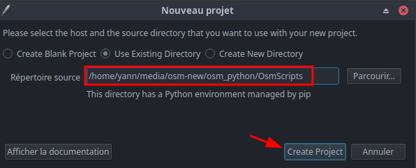
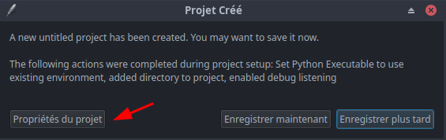
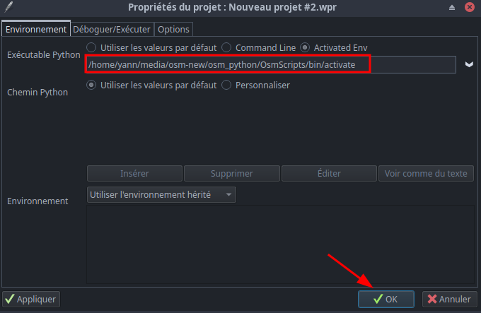
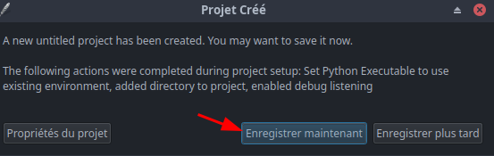

+++
title = 'Cartographie'
date = 2024-12-29 00:00:00 +0100
categories = cartographie python
+++
## Cartographie python 

*virtualenv est un outil utilisé pour créer un espace de travail isolé pour une application Python. Il présente divers avantages tels que la possibilité d'installer des modules localement, d'exporter un environnement de travail et d'exécuter un programme Python dans cet environnement*  

### OsmScripts 

*Python 3.3+ est livré avec un module appelé venv.*

`$HOME/media` identique `/srv/media`

**Environnement python**  

Créer un dossier `osm_python`

```bash
mkdir $HOME/media/osm-new/osm_python
cd $HOME/media/osm-new/osm_python
```

Pour créer un environnement, utilisez la commande `python -m venv <environment name>`
Créer un environnement pour l'application

    python3 -m venv OsmScripts

activer l'environnement virtuel  

    source OsmScripts/bin/activate

On arrive sur un prompt : `(OsmScripts) [yann@pc1 osm_python]$`

Mettre à jour pip dans l'environnement

    python -m pip install --upgrade pip

  

**Installer des paquets à l'aide de pip**  
[Install packages in a virtual environment using pip and venv](https://packaging.python.org/en/latest/guides/installing-using-pip-and-virtual-environments/)

Lorsque votre environnement virtuel est activé, vous pouvez installer des paquets. Utilisez la commande pip install pour installer des paquets.Par exemple, installons la bibliothèque Requests à partir de l'index des paquets Python (PyPI) : `python3 -m pip install requests`

Rechercher et installer les paquets `gpxpy` et `geopy` sur <https://pypi.org/> qui sont utilisés dans le projet

```bash
pip install gpxpy
pip install geopy
```

**Wing Personal projet OsmScripts**  
Dans le dossier `$HOME/media/osm-new` 

Projet --> Nouveau projet  
{width="400"}  
{width="400"}  
{width="500"}  
{width="400"}  

Projet : `$HOME/media/osm-new/osm_python/OsmScripts.wpr`  
Structure

```
[yann@pc1 ~]$ tree -L 2 -d /srv/media/osm-new/
/srv/media/osm-new/
├── archives
├── css
│   └── images
├── file
│   ├── photos
│   └── tmp
├── fonts
├── images
├── js
└── osm_python
    └── OsmScripts
```


**Le script python**  
Le script python `$HOME/media/osm-new/osm_python/OsmScripts/tracesgpxnew.py`   
<details>
<summary><b>Etendre Réduire</b></summary>
  
#!/usr/bin/python
# -*- coding: utf-8 -*-

"""
tracesgpxnew.py 
Créé le 10 juin 2021
Modifié le 14 octobre 2024
"""

import pdb

import sys as mod_sys
import logging as mod_logging
import math as mod_math

import gpxpy as mod_gpxpy
import os, fnmatch
import sys
import shutil
import json
from xml.dom import minidom
import datetime 
import calendar 
import geopy.geocoders
from geopy.geocoders import Nominatim

def format_time(time_s):
    if not time_s:
        return 'n/a'
    else:
        minutes = mod_math.floor(time_s / 60.)
        hours = mod_math.floor(minutes / 60.)
        return '%s:%s:%s' % (str(int(hours)).zfill(2), str(int(minutes % 60)).zfill(2), str(int(time_s % 60)).zfill(2))

def format_date(date_s):
    if not date_s:
        return 'n/a'
    else:
        #start_time.strftime("%d %b %Y")
        return '%s' % (date_s.strftime("%d %b %Y"))

def format_heure(heure_s):
    if not heure_s:
        return 'n/a'
    else:
        #start_time.strftime("%H:%M:%S") 
        return '%s' % (heure_s.strftime("%H:%M:%S"))

def format_long_length(length):
    return '{:.3f}km'.format(length / 1000.)

def format_long_length_num(length):
    return '{:.3f}'.format(length / 1000.)

def format_short_length(length):
    return '{:.2f}m'.format(length)

def format_short_length_num(length):
    return '{:.2f}'.format(length)

def format_speed(speed):
    if not speed:
        speed = 0
    else:
        #return '{:.2f}m/s = {:.2f}km/h'.format(speed, speed * 3600. / 1000.)
        return '{:.2f}km/h'.format(speed * 3600. / 1000.)

def format_speed_num(speed):
    if not speed:
        speed = 0
    else:
        #return '{:.2f}m/s = {:.2f}km/h'.format(speed, speed * 3600. / 1000.)
        return '{:.2f}'.format(speed * 3600. / 1000.)

def quelJour(date): 
    jour = datetime.datetime.strptime(date, '%d %m %Y').weekday() 
    return (calendar.day_name[jour]) 

def nblignes(nf):
    #  
    return len(open(nf).readlines(  ))

def print_gpx_part_info(gpx_part,jsTraces,dataTraces,fichier,dataIndex):

    data = gpx_part.tracks[0].segments[0].points
    data = gpx_part.tracks[0].segments[0].points
    lati=data[0].latitude
    longi=data[0].longitude
    # Nominatim
    geopy.geocoders.options.default_user_agent = 'gxinforep'
    geopy.geocoders.options.default_timeout = None
    geolocator = Nominatim()
    location = geolocator.reverse(str(lati) + "," + str(longi))
    y=location.address.split(",")
    z=0
    for x in y:
        z=z+1
    nom=y[z-8] + ' ' + y[z-7] + ' ' + y[z-2]  
    lieu=y[z-8].strip()
    commune=y[z-7].strip()
    cposte=y[z-2].strip()

    length_2d = gpx_part.length_2d()
    moving_time, stopped_time, moving_distance, stopped_distance, max_speed = gpx_part.get_moving_data()
    uphill, downhill = gpx_part.get_uphill_downhill()
    start_time, end_time = gpx_part.get_time_bounds()
    vmoy=(format_speed(moving_distance / moving_time) if moving_time > 0 else "?")
    vmoy_num=(format_speed_num(moving_distance / moving_time) if moving_time > 0 else "?")
    # les randonnées du dimanche sont par défaut privées
    # si dimanche (Sunday) --> private sinon public
    privpub = "public"
    if quelJour(start_time.strftime("%d %m %Y")) == "Sunday":
        privpub = "private"
   
    # latitude longitude lieu commune cp distance vitesse niveau jour gpx indexation
    #  { genre: 'Rap', band: 'Migos', albums: 2},
    jsTraces.write('{\n "id": ' + str(dataIndex) + ',"latitude": ' + str(lati) + ', "longitude": ' + str(longi) + ', "lieu": "' + lieu \
        + '", "commune": "' + commune + '", "cp": "' + cposte + '", "distance": "' + format_long_length_num(length_2d) \
        + '", "vitesse": "' + vmoy_num + '", "niveau": "' + format_short_length_num(uphill) \
        + '", "jour": "' + start_time.strftime("%Y-%m-%d") + '", "gpx": "' + fichier + '"\n}')

    #
    if dataIndex == initial_count - 1:
        jsTraces.write('\n')
    else:
        jsTraces.write(',\n')
    
    dataChaine='[' + str(lati) + ',' + str(longi) + ',"' + lieu + '","' + commune + '","' + cposte + '","' + format_long_length_num(length_2d) + '","' + vmoy_num \
        + '","' + format_short_length_num(uphill) + '","' + start_time.strftime("%Y-%m-%d") + '","' + fichier + '",' + str(dataIndex) + '],\n'
    dataTraces.write(dataChaine)
    
  

if __name__ == '__main__':
    # Le dossier qui contient les traces gpx
    dossier=os.getcwd()+'/'
    # on teste si arguments
    if len( sys.argv ) > 1:
        for strParam in sys.argv[1:]:
            dossier=strParam+'/'
    # parsing folder
    print("Dossier gpx: " + dossier)
    # ---------------
    # le nom du fichier sans extension : ztest ou traces
    NomSansExt = "tracestableau" 
    jsonFile= dossier + NomSansExt + ".json"
    jsonFileExist = False
    # Fichier utilisé dans osm-new
    dataFile= dossier + "tracesdataset.js"
    dataFileExist = False
    

    if os.path.exists(jsonFile):
        #os.remove(jsonFile)
        jsonFileExist = True
    if os.path.exists(dataFile):
        #os.remove(dataFile)
        dataFileExist = True    
    
    # Les fichiers gpx à traiter sont dans /tmp
    listOfFiles = sorted(os.listdir(dossier + 'tmp/'))
    pattern = "*.gpx" 
    if len(listOfFiles) == 0:
        print("pas de fichier à traiter")
        quit()

    # Nb fichiers
    initial_count = 0
    dir = dossier + 'tmp/'
    for path in os.listdir(dir):
        if os.path.isfile(os.path.join(dir, path)):
            initial_count += 1
    print("Nombre de fichiers: " + str(initial_count))
    
    # Traitement du fichier jsonFile suivant existance ou pas 
    if not jsonFileExist:
        jsTraces = open(jsonFile, "a+") 
        jsTraces.write("[\n")
    else:
        #supprimer la dernière ligne du fichier jsonFile
        os.system('sed -i "$ d" {0}'.format(jsonFile))
        jsTraces = open(jsonFile, "a+") 
        
    # Traitement du fichier dataFile suivant existance ou pas 
    if not dataFileExist:
        dataIndex = 0
        dataTraces = open(dataFile, "a+") 
        dataTraces.write("var addressPoints = [\n")
    else:
        # fichier existe , nombre de lignes
        dataIndex = nblignes(dataFile) - 2
        #supprimer la dernière ligne du fichier dataFile
        os.system('sed -i "$ d" {0}'.format(dataFile))
        dataTraces = open(dataFile, "a+") 
      

        
    for fichier in listOfFiles:  
        if fnmatch.fnmatch(fichier, pattern):
            try:
                print('gpx : %s' % fichier)
                gpx = mod_gpxpy.parse(open(dossier +'tmp/' + fichier))
                print_gpx_part_info(gpx,jsTraces,dataTraces,fichier,dataIndex)
                # Déplacer le fichier gpx après traitement:
                shutil.move(dossier +'tmp/' + fichier, dossier + fichier)
                # Incrémenter l'index:
                dataIndex = dataIndex + 1
               
            except Exception as e:
                mod_logging.exception(e)
                print('Error processing %s' % dossier +'/' + fichier)
                mod_sys.exit(1)  
    print('Ecriture fichier ' + jsonFile)
    jsTraces.write(']')
    jsTraces.close()
    
    print('Ecriture fichier ' + dataFile)
    dataTraces.write('];')
    dataTraces.close()

</details>

### Utilisation 'tracesgpxnew.py'

Le lancement du script tient compte de l'environnement python, du chemin complet du script et du paramètre dossier qui contiendra le(s) fichiers gpx

```bash
/srv/media/osm-new/osm_python/OsmScripts/bin/python /srv/media/osm-new/osm_python/OsmScripts/tracesgpxnew.py /srv/media/osm-new/file
```

### Synchronisation distante

Après intégration des nouveaux fichiers gpx par le script python, faire une mise à jour des dossiers distants par rsync

```bash
#!/bin/bash

echo "-----------------------------------------------
Synchro osm-new avec xoyize.xyz" 
rsync -avz --delete --exclude 'archives' --exclude 'osm_python' --rsync-path="sudo rsync" -e "ssh -p 55249 -i /home/yann/.ssh/xoyize-ed25519 -o StrictHostKeyChecking=no -o UserKnownHostsFile=/dev/null" /srv/media/osm-new yako@xoyize.xyz:/home/yunohost.multimedia/share/Divers/

echo "-----------------------------------------------
Synchro osm-new avec nfs sharenfs/multimedia/Divers/osm-new" 
rsync -avz --delete --exclude 'archives' --exclude 'osm_python' /srv/media/osm-new /home/yann/sharenfs/multimedia/Divers/

exit
```

Exécuter `sh /srv/media/osm-new/osm-new-synchro.sh`

### Alias local 'tracesgpx'

Alias 'tracesgpx' dans  `.bashrc`  

```bash
alias tracesgpx="/srv/media/osm-new/osm_python/OsmScripts/bin/python /srv/media/osm-new/osm_python/OsmScripts/tracesgpxnew.py /srv/media/osm-new/file"
```

Ajout synchronisation à l'alias 'tracesgpx' dans  `.bashrc`

```bash
alias tracesgpx="/srv/media/osm-new/osm_python/OsmScripts/bin/python /srv/media/osm-new/osm_python/OsmScripts/tracesgpxnew.py /srv/media/osm-new/file; sh /srv/media/osm-new/osm-new-synchro.sh"
```
