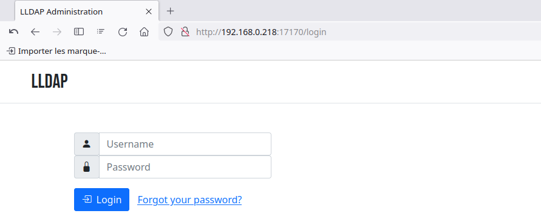
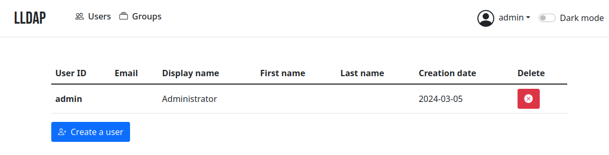
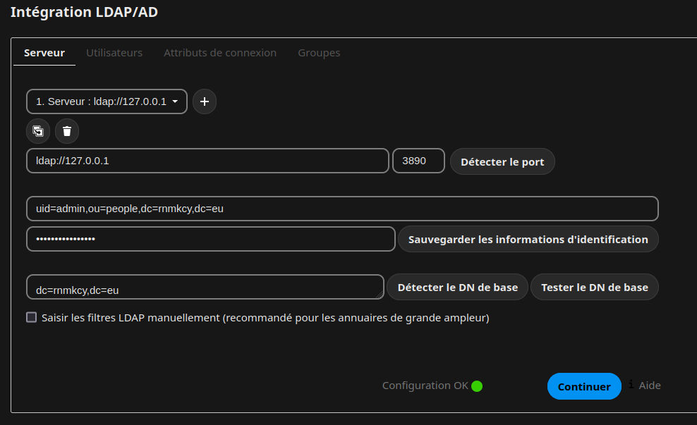
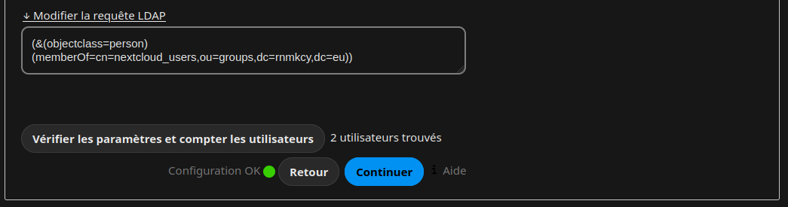
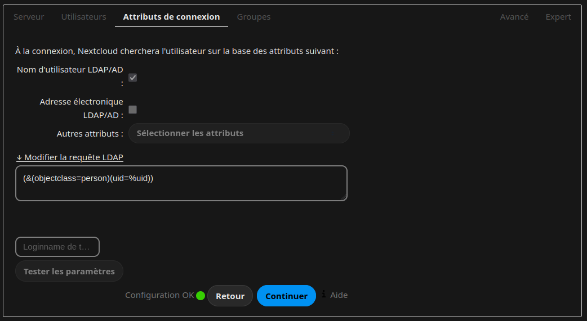

+++
title = 'cwwk - Service LLdap'
date = 2025-01-02 00:00:00 +0100
categories = authentification
+++
*[LLDAP](https://github.com/lldap/lldap) : Light LDAP est un serveur d'authentification léger qui fournit une interface LDAP simplifiée.  
Authelia & lldap : authentification, SSO, gestion des utilisateurs et réinitialisation de mot de passe pour les réseaux domestiques*  
{: .normal}  
*Il s'intègre avec de nombreux backends, de KeyCloak à Authelia en passant par Nextcloud et
[plus](https://github.com/lldap/lldap/blob/main/README.md#compatible-services) !*  

{: .normal}

Il s'accompagne d'une interface qui facilite la gestion des utilisateurs et leur permet de
de modifier leurs coordonnées ou de réinitialiser leur mot de passe par courrier électronique.

Ce serveur est un système de gestion des utilisateurs qui est :

- simple à mettre en place (pas de problème avec `slapd`),
- simple à gérer (interface web conviviale),
- peu de ressources,
- avec des valeurs de base par défaut pour que vous n'ayez pas à comprendre les
  les subtilités de LDAP.

Il cible principalement les serveurs auto-hébergés, avec des composants open-source comme
comme Nextcloud, Airsonic et ainsi de suite, qui ne supportent que LDAP comme source d'authentification externe.  
Pour plus de fonctionnalités (support OAuth/OpenID, reverse proxy, ...) vous pouvez installer
d'autres composants (KeyCloak, Authelia, ...) utilisant ce serveur comme source de
vérification pour les utilisateurs, via LDAP.

Par défaut, les données sont stockées dans SQLite, mais vous pouvez remplacer le backend par
MySQL/MariaDB ou PostgreSQL.


## LLDAP Debian 12

{:width="200" .normal}  

* <https://github.com/lldap/lldap>

Le paquetage pour les distributions Debian, CentOS Fedora, OpenSUSE, Ubuntu peut être trouvé sur [LLDAP OBS](https://software.opensuse.org//download.html?project=home%3AMasgalor%3ALLDAP&package=lldap), le login par défaut est **admin/password**  
Vous pouvez le changer à partir de l'interface web après avoir démarré le service.

Pour Debian 12, exécutez :  

```bash
echo 'deb http://download.opensuse.org/repositories/home:/Masgalor:/LLDAP/Debian_12/ /' | sudo tee /etc/apt/sources.list.d/home:Masgalor:LLDAP.list
curl -fsSL https://download.opensuse.org/repositories/home:Masgalor:LLDAP/Debian_12/Release.key | gpg --dearmor | sudo tee /etc/apt/trusted.gpg.d/home_Masgalor_LLDAP.gpg > /dev/null
sudo apt update
sudo apt install lldap
```

*Gardez à l'esprit que le propriétaire de la clé peut distribuer des mises à jour, des paquets et des dépôts auxquels votre système fera confiance.*

Après installation le service lldap est activé et lancé.

### Configuration LLDAP

Génération du jeton **jwt_secret**

    tr -cd '[:alnum:]' < /dev/urandom | fold -w "64" | head -n 1

Génération du mot de passe admin LDAP

    tr -cd '[:alnum:]' < /dev/urandom | fold -w "20" | head -n 1

Le fichier de configuration

    sudo nano /etc/lldap/lldap_config.toml

```yaml
ldap_host = "127.0.0.1"
ldap_port = 3890
ldap_base_dn = "dc=rnmkcy,dc=eu"

jwt_secret = "iO69xVjRSMPSXXMtewXOz6L3z0yTqZO5E5DyCVSU4qLFSA9dBNkzP2KuDCmgcU4C"
ldap_user_pass = "h7vTE0laTutIpY41Qm3e"
database_url = "sqlite:///var/lib/lldap/users.db?mode=rwc"
key_file = "/var/lib/lldap/private_key"
```

Les droits

    sudo chown lldap:lldap -R /var/lib/lldap/

Rdémarrer le service

    sudo systemctl restart lldap

Status

    sudo journalctl -u lldap --no-pager

```
juin 15 14:15:27 rnmkcy.eu lldap[316169]: Loading configuration from /etc/lldap/lldap_config.toml
juin 15 14:15:27 rnmkcy.eu lldap[316169]: 2024-06-15T12:15:27.870479452+00:00  INFO     set_up_server [ 1.72ms | 100.00% ]
juin 15 14:15:27 rnmkcy.eu lldap[316169]: 2024-06-15T12:15:27.870515174+00:00  INFO     ┝━ ｉ [info]: Starting LLDAP version 0.5.0
juin 15 14:15:27 rnmkcy.eu lldap[316169]: 2024-06-15T12:15:27.874043650+00:00  INFO     ┝━ ｉ [info]: Starting the LDAP server on port 3890
juin 15 14:15:27 rnmkcy.eu lldap[316169]: 2024-06-15T12:15:27.874465957+00:00  INFO     ┕━ ｉ [info]: Starting the API/web server on port 17170
juin 15 14:15:27 rnmkcy.eu lldap[316169]: 2024-06-15T12:15:27.874581673+00:00  INFO     ｉ [info]: starting 1 workers
juin 15 14:15:27 rnmkcy.eu lldap[316169]: 2024-06-15T12:15:27.874589477+00:00  INFO     ｉ [info]: Actix runtime found; starting in Actix runtime
juin 15 14:15:27 rnmkcy.eu lldap[316169]: 2024-06-15T12:15:27.875120927+00:00  INFO     ｉ [info]: DB Cleanup Cron started
juin 15 14:16:02 rnmkcy.eu lldap[316169]: 2024-06-15T12:16:02.395644037+00:00  INFO     LDAP session [ 117ms | 0.13% / 100.00% ]
juin 15 14:16:02 rnmkcy.eu lldap[316169]: 2024-06-15T12:16:02.395705461+00:00  INFO     ┝━ LDAP request [ 116ms | 99.43% ]
juin 15 14:16:02 rnmkcy.eu lldap[316169]: 2024-06-15T12:16:02.512572975+00:00  INFO     ┝━ LDAP request [ 510µs | 0.44% ]
juin 15 14:16:02 rnmkcy.eu lldap[316169]: 2024-06-15T12:16:02.557354881+00:00  INFO     ┕━ LDAP request [ 1.64µs | 0.00% ]
```

Vérifier que le serveur est bien en écoute

```shell
sudo ss -tulnp | grep lldap

tcp   LISTEN 0      2048              0.0.0.0:17170      0.0.0.0:*    users:(("lldap",pid=858,fd=11))                                                                                                             
tcp   LISTEN 0      2048            127.0.0.1:3890       0.0.0.0:*    users:(("lldap",pid=858,fd=10))                                                                                                   
```

Ouvrir la page web en utilisant un proxy ssh

    ssh -L 9800:localhost:17170 yick@192.168.0.205 -p 55205 -i /home/yann/.ssh/yick-ed25519

Sur un navigateur local : localhost:9800

### Interface web de gestion

Se connecter à l'**interface web de gestion** <http://127.0.0.1:17170/> (bien évidemment en prod, on mettra le chiffrement en place ou un proxy).  
  

Le compte par défaut est admin et le mot de passe est contenu dans le fichier "/srv/lldap/secrets/LDAP_USER_PASS".  
  
Vous pouvez créer/gérer les groupes et les utilisateurs.

Note : par défaut on utilise une base Sqlite mais il est possible de [migrer plus tard vers MySQL/MariaDB ou PostgreSQL](https://github.com/lldap/lldap/blob/main/docs/database_migration.md)

### Ldap cli

*Accès aux informations de l'annuaire en ligne de commande*

Installer les outils ldap

    sudo apt install ldap-utils

Afficher les données de l'annuaire

```
# IPV4
ldapsearch -H ldap://127.0.0.1:3890 -LLL -D "uid=admin,ou=people,dc=rnmkcy,dc=eu" \
-w '<admin_password>' -b "ou=people,dc=rnmkcy,dc=eu" 

# IPV6
ldapsearch -H ldap://[2a01:e0a:9c8:2080:5054:ff:fea1:29e1]:3890 \
-LLL -D "uid=admin,ou=people,dc=rnmkcy,dc=eu" \
-w '<admin_password>' -b "ou=people,dc=rnmkcy,dc=eu" 
```

Résultat commande

```
dn: uid=admin,ou=people,dc=rnmkcy,dc=eu
objectclass: inetOrgPerson
objectclass: posixAccount
objectclass: mailAccount
objectclass: person
uid: admin
cn: Administrator
createtimestamp: 2024-03-05T14:12:09.880825287+00:00
entryuuid: 22e95ce8-c4c8-3726-a708-abf8eab7fab7

dn: uid=yann,ou=people,dc=rnmkcy,dc=eu
objectclass: inetOrgPerson
objectclass: posixAccount
objectclass: mailAccount
objectclass: person
uid: yann
mail: yann@cinay.eu
cn: Second admin
createtimestamp: 2024-03-05T14:29:18.503605447+00:00
entryuuid: 5afdc712-b11f-305a-948f-195fa036d5a5
```

### Clients LLdap

[lldap - Client configuration](https://github.com/lldap/lldap?tab=readme-ov-file#client-configuration)  
[lldap - Light LDAP implementation for authentication](https://hub.docker.com/r/lldap/lldap)  

Les configurations clientes utilisées

#### Calibre Web

* [Calibre Web](https://github.com/lldap/lldap/blob/main/example_configs/calibre_web.md)


#### Nextcloud LLDAP

**A - Mise en place dans nextcloud (méthode graphique)** 

Préalable sur debian, installer ldap suivant version php

    sudo apt install php8.2-ldap

Activer l'application ldap   


Administration &rarr; Intégration LDAP/AD  
  
**Serveur** 

  
**Utilisateurs**

  
**Attributs de connexion**

**B - Mise en place dans nextcloud (méthode cli)**

* [Nextcloud config cli](https://github.com/lldap/lldap/blob/main/example_configs/nextcloud.md)  

```
# Effacer existant
sudo -u nextcloud php occ ldap:delete-config s01

# Installation et création
sudo -u nextcloud php occ app:install user_ldap
sudo -u nextcloud php occ app:enable user_ldap
sudo -u nextcloud php occ ldap:create-empty-config

# EDIT: domain
sudo -u nextcloud php occ ldap:set-config s01 ldapHost "ldap://127.0.0.1"
sudo -u nextcloud php occ ldap:set-config s01 ldapPort 3890
# EDIT: admin user
sudo -u nextcloud php occ ldap:set-config s01 ldapAgentName "uid=admin,ou=people,dc=rnmkcy,dc=eu"
# EDIT: password
sudo -u nextcloud php occ ldap:set-config s01 ldapAgentPassword "xxxxxxxxxxxxxx"
# EDIT: Base DN
sudo -u nextcloud php occ ldap:set-config s01 ldapBase "dc=rnmkcy,dc=eu"
sudo -u nextcloud php occ ldap:set-config s01 ldapBaseUsers "dc=rnmkcy,dc=eu"
sudo -u nextcloud php occ ldap:set-config s01 ldapBaseGroups "dc=rnmkcy,dc=eu"
sudo -u nextcloud php occ ldap:set-config s01 ldapConfigurationActive 1
sudo -u nextcloud php occ ldap:set-config s01 ldapLoginFilter "(&(objectclass=person)(uid=%uid))"

# EDIT: nextcloud_users group, contains the users who can login to Nextcloud
sudo -u nextcloud php occ ldap:set-config s01 ldapUserFilter "(&(objectclass=person)(memberOf=cn=nextcloud_users,ou=groups,dc=rnmkcy,dc=eu))"
sudo -u nextcloud php occ ldap:set-config s01 ldapUserFilterMode 0
sudo -u nextcloud php occ ldap:set-config s01 ldapUserFilterObjectclass person
sudo -u nextcloud php occ ldap:set-config s01 turnOnPasswordChange 0
sudo -u nextcloud php occ ldap:set-config s01 ldapCacheTTL 600
sudo -u nextcloud php occ ldap:set-config s01 ldapExperiencedAdmin 0
sudo -u nextcloud php occ ldap:set-config s01 ldapGidNumber gidNumber

# ---------------------
sudo -u nextcloud php occ ldap:show-config s01

+-------------------------------+--------------------------------------------------------------------------------+
| Configuration                 | s01                                                                            |
+-------------------------------+--------------------------------------------------------------------------------+
| hasMemberOfFilterSupport      | 0                                                                              |
| homeFolderNamingRule          |                                                                                |
| lastJpegPhotoLookup           | 0                                                                              |
| ldapAdminGroup                |                                                                                |
| ldapAgentName                 | uid=admin,ou=people,dc=rnmkcy,dc=eu                                            |
| ldapAgentPassword             | ***                                                                            |
| ldapAttributeAddress          |                                                                                |
| ldapAttributeBiography        |                                                                                |
| ldapAttributeFediverse        |                                                                                |
| ldapAttributeHeadline         |                                                                                |
| ldapAttributeOrganisation     |                                                                                |
| ldapAttributePhone            |                                                                                |
| ldapAttributeRole             |                                                                                |
| ldapAttributeTwitter          |                                                                                |
| ldapAttributeWebsite          |                                                                                |
| ldapAttributesForGroupSearch  |                                                                                |
| ldapAttributesForUserSearch   |                                                                                |
| ldapBackgroundHost            |                                                                                |
| ldapBackgroundPort            |                                                                                |
| ldapBackupHost                |                                                                                |
| ldapBackupPort                |                                                                                |
| ldapBase                      | dc=rnmkcy,dc=eu                                                                |
| ldapBaseGroups                | dc=rnmkcy,dc=eu                                                                |
| ldapBaseUsers                 | dc=rnmkcy,dc=eu                                                                |
| ldapCacheTTL                  | 600                                                                            |
| ldapConfigurationActive       | 1                                                                              |
| ldapConnectionTimeout         | 15                                                                             |
| ldapDefaultPPolicyDN          |                                                                                |
| ldapDynamicGroupMemberURL     |                                                                                |
| ldapEmailAttribute            |                                                                                |
| ldapExperiencedAdmin          | 0                                                                              |
| ldapExpertUUIDGroupAttr       |                                                                                |
| ldapExpertUUIDUserAttr        |                                                                                |
| ldapExpertUsernameAttr        |                                                                                |
| ldapExtStorageHomeAttribute   |                                                                                |
| ldapGidNumber                 | gidNumber                                                                      |
| ldapGroupDisplayName          | cn                                                                             |
| ldapGroupFilter               |                                                                                |
| ldapGroupFilterGroups         |                                                                                |
| ldapGroupFilterMode           | 0                                                                              |
| ldapGroupFilterObjectclass    |                                                                                |
| ldapGroupMemberAssocAttr      |                                                                                |
| ldapHost                      | ldap://127.0.0.1                                                               |
| ldapIgnoreNamingRules         |                                                                                |
| ldapLoginFilter               | (&(objectclass=person)(uid=%uid))                                              |
| ldapLoginFilterAttributes     |                                                                                |
| ldapLoginFilterEmail          | 0                                                                              |
| ldapLoginFilterMode           | 0                                                                              |
| ldapLoginFilterUsername       | 1                                                                              |
| ldapMatchingRuleInChainState  | unknown                                                                        |
| ldapNestedGroups              | 0                                                                              |
| ldapOverrideMainServer        |                                                                                |
| ldapPagingSize                | 500                                                                            |
| ldapPort                      | 3890                                                                           |
| ldapQuotaAttribute            |                                                                                |
| ldapQuotaDefault              |                                                                                |
| ldapTLS                       | 0                                                                              |
| ldapUserAvatarRule            | default                                                                        |
| ldapUserDisplayName           | displayName                                                                    |
| ldapUserDisplayName2          |                                                                                |
| ldapUserFilter                | (&(objectclass=person)(memberOf=cn=nextcloud_users,ou=groups,dc=rnmkcy,dc=eu)) |
| ldapUserFilterGroups          |                                                                                |
| ldapUserFilterMode            | 0                                                                              |
| ldapUserFilterObjectclass     | person                                                                         |
| ldapUuidGroupAttribute        | auto                                                                           |
| ldapUuidUserAttribute         | auto                                                                           |
| markRemnantsAsDisabled        | 0                                                                              |
| turnOffCertCheck              | 0                                                                              |
| turnOnPasswordChange          | 0                                                                              |
| useMemberOfToDetectMembership | 1                                                                              |
+-------------------------------+--------------------------------------------------------------------------------+
```

