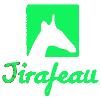
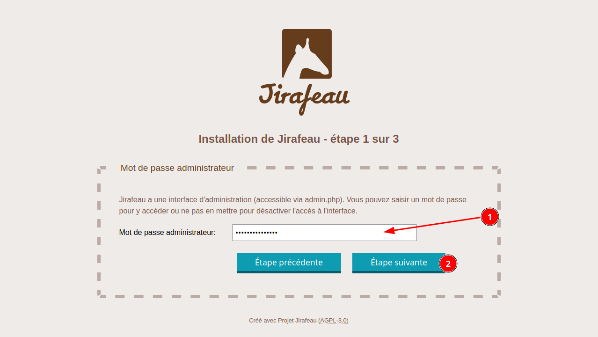
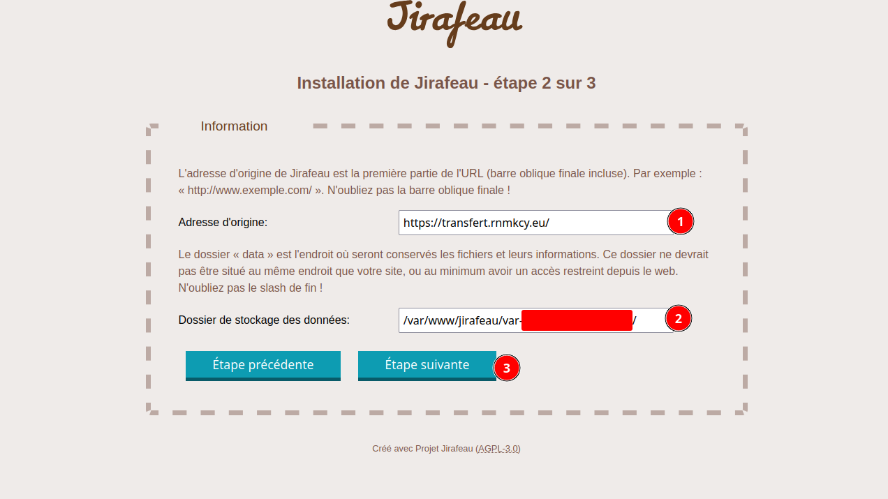
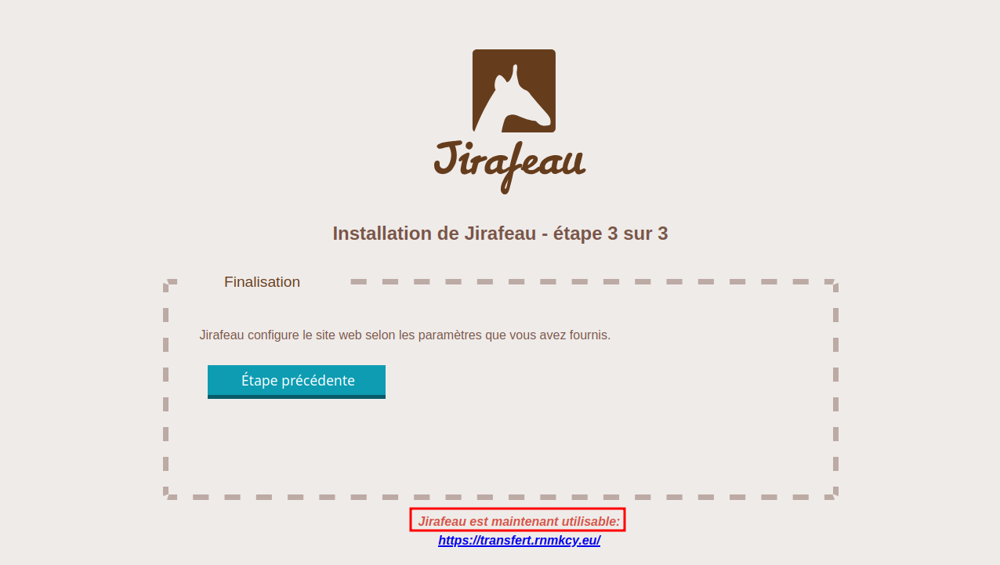

+++
title = 'CWWK Serveur Debian 12 - Jirafeau'
date = 2025-01-06 00:00:00 +0100
categories = ['application']
+++
## Jirafeau

<div class="item">
  <div class="item__image">
    
  </div>
  <div class="item__content">
    <div class="item__header">
      <h4>Jirafeau</h4>
    </div>
    <div class="item__description">
      <p><i>Jirafeau offre la possibilité d’héberger et de partager vos fichiers, le tout en toute simplicité. Choisissez un fichier, Jirafeau vous fournira un lien avec beaucoup d’options. Il est possible de protéger vos liens avec mot de passe ainsi que de choisir la durée de rétention du fichier sur le serveur. Le fichier et le lien s’autodétruiront passé ce délai. Les téléchargements des fichiers transmis peuvent être limités à une certaine date, et chaque fichier peut s’autodétruire après le premier téléchargement. Jirafeau permet de configurer les temps maximum de rétention ainsi que la taille maximale par fichier. Le chiffrement est disponible en option <a href="https://framalibre.org/notices/jirafeau.html">(Citation Framalibre)</a></i></p>
    </div>
  </div>
</div>

**Jirafeau** apporte quelques fonctionnalités intéressantes:

*    Les téléchargements uniques
*    Un lecteur d’images et de vidéos
*    La possibilité de mettre un mot de passe
*    Le stockage limité dans le temps
*    Une API
*    Le chiffrement des données stockées

### Principales caractéristiques:

- Oui. Un téléchargement → un lien de téléchargement et un lien de suppression
- Envoyer tous les grands fichiers (grâce à l'API de fichier HTML5 → PHP `post_max_size` limite sans objet)
- Affiche la progression du téléchargement : vitesse, pourcentage et temps de téléchargement restant
- Aperçu du contenu dans le navigateur (si possible)
- Protection optionnelle par mot de passe (pour téléchargement ou téléchargement)
- Option pour exiger, vérifier ou générer des mots de passe de téléchargement de fichiers
- Réglez l'expiration des téléchargements
- Option d'autodestruction après le premier téléchargement
- URL raccourcies utilisant l'encodage Base64
- Taille maximale de téléchargement configurable
- Oui. Pas de base de données, utiliser uniquement PHP de base
- Support linguistique simple avec beaucoup de langues
- Niveau de fichier [déduplication](http://en.wikipedia.org/wiki/Data_deduplication) pour l'optimisation du stockage (supprime les fichiers une seule fois, mais génère plusieurs liens)
- Chiffrement facultatif des données
- Petite interface d'administration
- script CLI pour supprimer automatiquement les fichiers expirés avec un cronjob
- Page de base, adaptable "Termes de service"
- API de base
- script Bash pour télécharger des fichiers via la ligne de commande
- Thèmes


### Exigences 

- PHP >= 7,4
- Facultatif, mais recommandé: Git >= 2.7
- Pas de base de données requise, pas de courrier requis

### Etapes d'installation 

Sur le serveur cwwk 

Télécharger et installer la dernière [version](https://gitlab.com/jirafeau/Jirafeau/tags) de GitLab sur votre serveur web

```
# télécharger la dernière version
wget https://gitlab.com/jirafeau/Jirafeau/-/archive/4.6.1/Jirafeau-4.6.1.tar.bz2
# décompresser
tar -xvf Jirafeau-4.6.1.tar.bz2
# Déplacer
sudo mv Jirafeau-4.6.1 /var/www/jirafeau
# propriétaire www-data
sudo chown www-data:www-data -R /var/www/jirafeau
# Effacer tar.bz2
rm Jirafeau-4.6.1.tar.bz2
```

### Accès web transfert.rnmkcy.eu

Fichier nginx `/etc/nginx/conf.d/transfert.rnmkcy.eu.conf`

```
server {
    listen 443 ssl http2;
    listen [::]:443 ssl http2;
    server_name transfert.rnmkcy.eu;

    include /etc/nginx/conf.d/security.conf.inc;
    # Authelia
    #include snippets/authelia-location.conf; # Authelia auth endpoint
    root /var/www/jirafeau/;

    location / {
      index index.php;
		  location ~ \.php(?:$|/) {
		    include fastcgi_params;
		    fastcgi_param SCRIPT_FILENAME $request_filename;
		    fastcgi_split_path_info ^(.+\.php)(/.+)$;
		    fastcgi_param HTTPS on;
		
		    fastcgi_param modHeadersAvailable true;         # Avoid sending the security headers twice
		    fastcgi_param front_controller_active true;     # Enable pretty urls
		    fastcgi_param HTTP_ACCEPT_ENCODING "";          # Disable encoding of nextcloud response to in>
		    fastcgi_pass unix:/var/run/php/php8.3-fpm.sock;
		    fastcgi_intercept_errors on;
		    fastcgi_request_buffering off;
		  }
          # Authelia
	  #include snippets/authelia-authrequest.conf; # Protect this endpoint
	}
}
```

Vérifier et recharger nginx

    sudo nginx -t && sudo systemctl reload nginx

### Configuration avec assistant installation web 

Ouvrir le navigateur sur l'emplacement installé <https://transfert.rnmkcy.eu>  

- Le script vous redirigera vers un assistant d'installation minimal pour configurer toutes les options requises  
  
  

- Tous les paramètres optionnels peuvent être définis dans `lib/config.local.php`, regardez `lib/config.original.php` pour voir toutes les valeurs par défaut


### Dépannage

En cas de problèmes:

* Vérifiez votre fichier /lib/config.local.php et comparez-le avec /lib/config.original.php, la syntaxe de configuration ou un paramètre peut avoir changé
* Vérifiez le propriétaire et les autorisations de vos fichiers
* Définir l'option **debug** à **true** pour vérifier tout avertissement ou erreur

### Sécurité

Le répertoire **var** contient tous les fichiers et liens. Il est aléatoirement nommé pour limiter l'accès, mais vous pouvez ajouter une meilleure protection pour empêcher l'accès non autorisé à celui-ci.

Avec nginx, ajouter ce qui suit à votre $vhost.conf:

```
location ~ /var-.* {
    deny all;
    return 404;
}
```

Une autre sécurité de base évidente est de laisser les utilisateurs accéder au site par HTTPS (assurez-vous que web_root dans votre config.local.php est défini avec https).

### Chiffrement

* Le chiffrement des données peut être activé en options. Cette fonctionnalité chiffre les données et envoie la clé de déchiffrement à l'utilisateur (URL de téléchargement interne).
* La clé de déchiffrement n'est pas stockée sur le serveur, donc si vous perdez l'URL de téléchargement, vous ne pourrez pas récupérer le contenu du fichier.
* Le chiffrement est configuré pour utiliser XChaCha20-Poly1305.
* En cas de problèmes de sécurité sur le serveur, l'attaquant ne pourra pas accéder aux fichiers.
* En activant cette fonctionnalité, les effets:
    * Le chiffrement des données a un coût (CPU) et il faut plus de temps pour que les téléchargements soient complétés une fois le fichier envoyé.
    * Pendant le téléchargement, le serveur décryptera à la volée (et utilisera la ressource).
    * Cette fonctionnalité doit avoir le **module PHP Sodium**.
    * La déduplication des fichiers est stoppée pour fonctionner (nous ne pouvons pas comparer deux fichiers chiffrés).
* Assurez-vous que votre serveur n'e 'enregistre pas les requêtes du client.
* Activer HTTPS.

Dans une prochaine étape, le cryptage sera effectué par le client (en JavaScript).