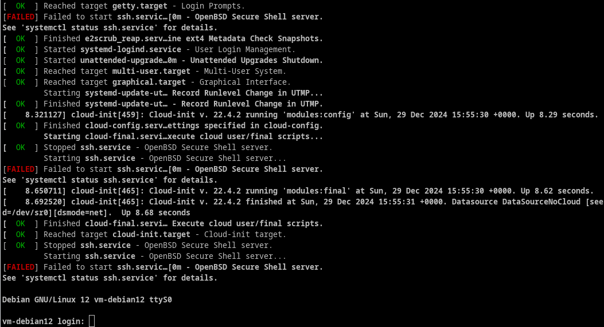
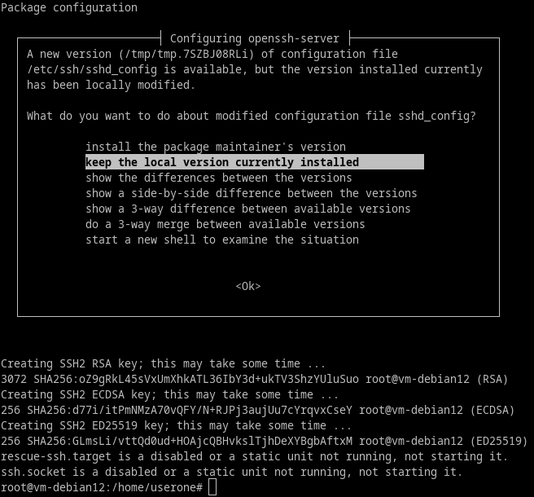

+++
title = 'cwwk KVM - Cloner des images de machines virtuelles'
date = 2025-01-06 00:00:00 +0100
categories = ['virtuel']
+++
## Cloner machine virtuelle Alpine Linux

* [How to clone existing KVM virtual machine images on Linux](https://www.cyberciti.biz/faq/how-to-clone-existing-kvm-virtual-machine-images-on-linux/)
* [How to reset a KVM clone virtual Machines with virt-sysprep on Linux](https://www.cyberciti.biz/faq/reset-a-kvm-clone-virtual-machines-with-virt-sysprep-on-linux/)  
*Utiliser virt-sysprep si vous avez besoin de cloner la VM et de faire/réinitialiser quoi que ce soit à l'intérieur de l'OS invité*

### Lister les machines virtuelles

Exécuter la commande : `sudo virsh list --all`

```
 ID   Nom              État
---------------------------------------------
 1    vm-ntfy          en cours d’exécution
 2    vm-debian12      en cours d’exécution
 3    alpine-vm        en cours d’exécution
 4    alpine-searx     en cours d’exécution
 -    vm-alpine01      fermé
 -    vm-debian12-01   fermé
 -    vm-lldap         fermé
```

### Arrêter la machine à cloner

Si la machine virtuelle est **en cours d’exécution**

    sudo virsh destroy vm-alpine01

Domain 'vm-alpine01' destroyed

### Cloner la machine virtuelle

Machine virtuelle originale: vm-alpine01  
Machine virtuelle cible: vm-alpine02
Disque cible: /srv/kvm/libvirt/images/vm-alpine02.qcow2 

```
sudo virt-clone --original vm-alpine01 \
 --name vm-alpine02 \
 --file /srv/kvm/libvirt/images/vm-alpine02.qcow2
```

Résultat de la commande

```
Allocating 'vm-alpine02.qcow2'                                            | 742 MB  00:00:00 ... 

Le clone « vm-alpine02 » a été créé.
```

### Démarrer le clone vm-alpine02

ATTENTION: Machine virtuelle originale **vm-alpine01** doit être arrêtée

    sudo virsh start vm-alpine02

Même utilisateur et mot de passe pour le clone  
Problème initialisation serveur ssh   
  

Problème serveur ssh, exécuter la commande suivante pour que votre serveur génère sa clé d'hôte afin que vous puissiez vous connecter au serveur via SSH. Plus d'informations ici .

Reconfigurer les clés SSH

    sudo dpkg-reconfigure openssh-server

Domain 'vm-alpine02' started

### Connexion clone vm-alpine02

On se connecte à l'identique de la machine originale depuis un terminal linux sur le même réseau

    ssh -p 55061 -i .ssh/vm-alpine01 alpi@192.168.10.61

Modifier le fichier `/etc/motd`

```
     _     _         _                _      _                          
    / \   | | _ __  (_) _ __    ___  | |    (_) _ __   _   _ __  __     
   / _ \  | || '_ \ | || '_ \  / _ \ | |    | || '_ \ | | | |\ \/ /     
  / ___ \ | || |_) || || | | ||  __/ | |___ | || | | || |_| | >  <      
 /_/   \_\|_|| .__/ |_||_| |_| \___| |_____||_||_| |_| \__,_|/_/\_\     
             |_|                  _         _                ___  ____  
 __   __ _ __ ___           __ _ | | _ __  (_) _ __    ___  / _ \|___ \ 
 \ \ / /| '_ ` _ \  _____  / _` || || '_ \ | || '_ \  / _ \| | | | __) |
  \ V / | | | | | ||_____|| (_| || || |_) || || | | ||  __/| |_| |/ __/ 
   \_/  |_| |_| |_|        \__,_||_|| .__/ |_||_| |_| \___| \___/|_____|
  _   ___  ____      _   __     ___ |_| _   ___     __    _  _          
 / | / _ \|___ \    / | / /_   ( _ )   / | / _ \   / /_  | || |         
 | || (_) | __) |   | || '_ \  / _ \   | || | | | | '_ \ | || |_        
 | | \__, |/ __/  _ | || (_) || (_) |_ | || |_| |_| (_) ||__   _|       
 |_|   /_/|_____|(_)|_| \___/  \___/(_)|_| \___/(_)\___/    |_|         
```

Changement de la clé publique SSH `$HOME/.ssh/authorized_keys`

    echo "ssh-ed25519 AAAAC3NzaC1lZDI1NTE5AAAAIL6y0ZigTHoSppYVyC/MzXBpMvTGaex35IrDyCHEe396 yann@PC1" > $HOME/.ssh/authorized_keys

Modifier le port de connexion SSH dans `/etc/ssh/sshd_config`

    Port = 55064    

Modifier l'adresse ip dans le  fichier de configuration `/etc/network/interfaces` 

```
auto lo
iface lo inet loopback

auto eth0
iface eth0 inet static
        address 192.168.10.64/24
        gateway 192.168.10.1
```

redémarrer la machine pour prendre en compte l'ensemble des modifications

Connexion avec nouvelle adresse ip et nouvelle clé SSH depuis un terminal linux sur le même réseau

    ssh -p 55064 -i $HOME/.ssh/vm-alpine02 alpi@192.168.10.64

## Cloner vm-debian12 vers vm-debian12-01

* [How to clone existing KVM virtual machine images on Linux](https://www.cyberciti.biz/faq/how-to-clone-existing-kvm-virtual-machine-images-on-linux/)
* [How to reset a KVM clone virtual Machines with virt-sysprep on Linux](https://www.cyberciti.biz/faq/reset-a-kvm-clone-virtual-machines-with-virt-sysprep-on-linux/)  
*Utiliser virt-sysprep si vous avez besoin de cloner la VM et de faire/réinitialiser quoi que ce soit à l'intérieur de l'OS invité*


```
yick@cwwk:~$ sudo virsh list
 ID   Nom            État
-------------------------------------------
 1    alpine-vm      en cours d’exécution
 2    vm-ntfy        en cours d’exécution
 3    alpine-searx   en cours d’exécution
 10   vm-debian12    en cours d’exécution

# Arrêt machine à cloner
yick@cwwk:~$ sudo virsh destroy vm-debian12
Domain 'vm-debian12' destroyed

# Cloner
yick@cwwk:~$ sudo virt-clone --original vm-debian12 \
 --name vm-debian12-01 \
 --file /srv/kvm/libvirt/images/debian-12-01.qcow2

Allocating 'debian-12-01.qcow2'                             | 1.2 GB  00:03 ... 

Le clone « vm-debian12-01 » a été créé.

# virsh resume ncbz01
```

### Initialiser les paramètres du clone

```
sudo virt-sysprep -d vm-debian12-01 \
 --hostname vm-debian12-01 \
 --enable user-account,ssh-hostkeys,net-hostname,net-hwaddr,machine-id \
 --keep-user-accounts userone \
 --keep-user-accounts root \
 --run-command 'sed -i "s/192.168.10.62/192.168.10.63/" /etc/netplan/01-enp1s0.yaml'


[   0.0] Examining the guest ...
[   5.2] Performing "machine-id" ...
[   5.2] Performing "net-hostname" ...
[   5.2] Performing "net-hwaddr" ...
[   5.3] Performing "ssh-hostkeys" ...
[   5.3] Performing "user-account" ...
```

### Démarrer le clone vm-debian12-01

Même utilisateur et mot de passe pour le clone  
Problème initialisation serveur ssh   
  

Problème serveur ssh, exécuter la commande suivante pour que votre serveur génère sa clé d'hôte afin que vous puissiez vous connecter au serveur via SSH. Plus d'informations ici .

Reconfigurer les clés SSH

    sudo dpkg-reconfigure openssh-server

{:width=500}

### Connexion ssh clone vm-debian12-01

Se connecter ssh sur l'adresse ip 192.168.10.63 avec la clé 

    ssh userone@192.168.10.63 -i .ssh/vm-debian01

